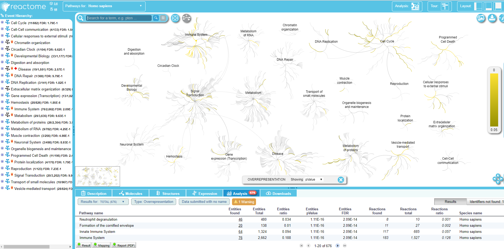
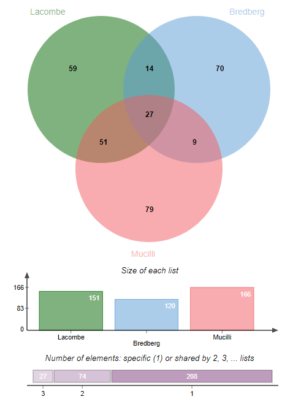

# Introduction
{:.no_toc}

[ProteoRE Galaxy instance](http://www.proteore.org) provides necessary tools to execute a whole annotation pipeline of a protein list identified by LC-MS/MS experiments. This activity introduces these tools and guides you through a simple pipeline using some example datasets based on the study entitled "Proteomic characterization of human exhaled breath condensate" .
The goal of this study was to identify proteins secreted in the respiratory tract (lung, bronchi). Samples were obtained non-invasively by condensation of exhaled air that contains submicron droplets of airway lining fluid. Two pooled samples of EBC, each obtained from 10 healthy donors, were processed. Two 'technical' control samples were processed in parallel to the pooled samples to correct for exogenous protein contamination.
A total of 229 unique proteins were identified in EBC among which 153 proteins were detected in both EBC pooled samples. A detailed bioinformatics analysis of these 153 proteins showed that most of the proteins identified corresponded to proteins secreted in the respiratory tract (lung, bronchi).

> ### Agenda
>
>
> 1. TOC
> {:toc}
>
{: .agenda}

# Get Input Datasets

For this tutorial, we will use 3 datasets: the list of proteins identified by LC-MS/MS in the exhaled breath condensate (EBC) from  and two others EBC proteomes previously published (  and ). These datasets are available from Zenodo [here](https://zenodo.org/record/3405119).

> ###  Hands-on: Data upload
>
> 1. Create a new history for this tutorial and give it a name
>   
>
> 2. Import the files from [Zenodo](https://zenodo.org/record/3405119) or from the shared data library (ask your instructors).
>
>    ```
>    https://zenodo.org/record/3405119/files/Lacombe_2018.txt
>    https://zenodo.org/record/3405119/files/Bredberg.txt
>    https://zenodo.org/record/3405119/files/Mucilli.txt
>    ```
>
>    
>    
>
{: .hands_on}


# Filtering out technical contaminants

A group of 10 proteins were identified in both “technical” control samples with an enrichment in EBC samples below a fixed threshold. These proteins were thus considered to be technical contaminants (see list of proteins in Table 4 in ) and have to be removed from the initial dataset.

> ###  Hands-on: Remove the contaminants
>
> 1. **Filter by keywords and/or numerical value**  with the following parameters:
>    -  *"Input file"*: `Lacombe_2018.txt`
>    - *"Operation"*: `Discard`
>    -  *"Insert Filter by keywords"*
>      - *"Column number on which to apply the filter"*: `c1`
>      - *"Search for exact match ?"*: `No`
>      - *"Enter keywords"*: `copy/paste`
>        - *"Copy/paste keywords to find"*: `P04264 P35908 P13645 Q5D862 Q5T749 Q8IW75 P81605 P22531 P59666 P78386`
>
>    > ###  Outputs
>    > - **Filtered_Lacombe_2018.txt - Discarded_lines**: output list with the ten proteins (contaminants) removed from the original dataset (10 proteins)
>    > - **Filtered_Lacombe_2018.txt**: output contains the remaining proteins that will be considered for further analysis (151 proteins)
>    {: .comment}
>
{: .hands_on}


# Check for the presence of biological contaminants

As EBC samples are obtained from air exhaled through the oral cavity, and even though the RTube collection device contained a saliva trap to separate saliva from the exhaled breath, contamination with salivary proteins had to be assessed. We decided to check the expression pattern for each protein of the "core" EBC proteome using the [The Human Protein Atlas](https://www.proteinatlas.org/) (HPA, ). As HPA is indexed by Ensembl gene identifier (ENSG) we first need to convert Uniprot ID to Ensembl gene (ENSG). Secondly, check for proteins which are highly expressed in the salivary glands as reported by HPA, then in a third step, we filter out these proteins.

> ###  Hands-on: Convert Uniprot ID to Ensembl gene ID
>
> 1. **ID Converter**  with the following parameters:
>    - *"Enter IDs"*: `Input file containing IDs`
>        -  *"Select your file"*: `Filtered_Lacombe_2018.txt` output from **Filter by keywords** 
>    - *"Column number of IDs to map"*: `c1`
>    - *"Species"*: `Human (Homo sapiens)`
>        - *"Type/source of IDs"*: `Uniprot accession number (e.g. P31946)`
>        - *"Target type of IDs you would like to map to"*:
>          -  `Ensembl gene ID (e.g. ENSG00000166913)`
>
>    > ###  Output
>    >
>    > In the output file, a new column which contains Ensembl IDs was added (at the end)
>    {: .comment}
{: .hands_on}


> ###  Hands-on: Check for proteins highly expressed in salivary glands
>
> 1. **Add expression data**  with the following parameters:
>    - *"Enter your IDs"*: `Input file containing your IDs`
>    -  *"Select your file"*: `ID Converter on data ..` from **ID Converter** 
>    - *"Column IDs"*: `c4` (column containing Ensembl IDs)
>    - *"Does file contain header"*: `Yes`
>    - *"Select informareactometion to add to your list"*:
>       -  `Gene name`
>       -  `Gene description`
>       -  `RNA tissue category (according to HPA)`
>       -  `RNA tissue specificity abundance in "Transcript Per Million`
>
>
>    > ###  Outputs
>    >
>    > In the output file, four columns were added (5, 6, 7 and 8) corresponding to the retrieved information from HPA.
>    {: .comment}
>
{: .hands_on}

Examine the output table. Note that in the last column of the list (column 8), we see that *AMY1B*, *CALML5*, *PIP*, *ZG16B*, *CST4*, *MUC7*, *CST1* and *CST2* have been reported as highly enriched in salivary gland with elevated RNA transcript specific Transcript Per Million (TPM) value for each, suggesting that these proteins may come from the saliva and not from the exhaled breath condensate. We will remove these biological contaminants from our initial protein set.

```
[..]
P04745  Alpha-amylase           1  23  ENSG00000174876  AMY1B  Amylase, alpha 1B (salivary) Tissue enriched   salivary gland: 1847.5
[..]
Q9NZT1  Calmodulin-like protein 5  8  ENSG00000178372   CALML5 Calmodulin-like 5            Group enriched    salivary gland: 262.7;skin: 651.2
[..]
```

In the next step, we will filter the data to remove these biological contaminants (i.e. proteins highly expressed in salivary glands)
by filtering out the lines that contain the word `salivary` in the column of RNA transcript specific TPM.

> ###  Hands-on: Filter the data to remove the biological contaminants
>
>  1. **Filter by keywords and/or numerical value**  with the following parameters:
>     -  *"Input file"*: `Add expression data on data ..` from **Add expression data** 
>     - *"Operation"*: `Discard`
>     -  *"Insert Filter by keywords"*
>       - *"Column number on which to apply the filter"* : `c8`  (column with RNA transcript specific TPM)
>       - *"Search for exact match ?" : `No`
>       - *"Enter keywords"*: `copy/paste`
>          - *"Copy/paste keyword to fine"*: `salivary`
>
>     > ###  Outputs
>     > Two output files are created:
>     > - **Filtered Add expression data on data .. - Discarded lines** (12 proteins)
>     > - **FilteredAdd expression data on data ..** (157 proteins)
>     {: .comment}
>
>  > ###  Tip: Using genes instead of keywords
>  > Note also that a list of “gene” may have been entered (selected on the basis of their TPM value) applied to column 5 instead of the keywords "salivary" to column 8, as it has been done in .
>  {: .tip}
>
{: .hands_on}


# Functional annotation of the EBC proteome (enrichment analysis)

The resulting list of 157 proteins identified in the two pooled EBC samples (excluding the 10 contaminants proteins) is now submitted to Gene Ontology (GO)-term enrichment analysis to determine functions that were significantly enriched in our EBC proteomic dataset compared to the lung proteome (corresponding to tissue-specific genes extracted from the Human Protein Atlas). To do so, we first build a lung reference proteome (that should be more representative of the studied sample rather than a full human proteome) that will be used for enrichment analysis performed with the ClusterProfiler tool (based on the R package clusterProfiler).

> ###  Hands-on: Build a lung reference proteome as a background for GO terms enrichment analysis
>
> 1. **Build tissue-specific expression dataset**  with the following parameters:
>    -  *"Experimental data source (antibody- or RNAseq-based)"*: `Expression profiles based on immunohistochemistry`
>    -  *"Select tissue"*: `Lung` and `Bronchus` (you can start typing to filter the list)
>    - *"Expression level"*:
>      -  `High`
>      -  `Medium`
>      -  `Low`
>    - *"Reliability score"*:
>      -  `Enhanced`
>      -  `Supported`
>
>   > ### Output
>   > - **Tissue-specific expression from IHC**: List of the selected proteins.
>   > 6 columns: 'Gene', 'Gene name' and the retrieved info from HPA.
>   {: .comment}
{: .hands_on}


Note that expression information about respiratory cell types is retrieved (column 4; e.g. macrophages, pneumocytes, respiratory epithelial cells)
that could be used for further refinement of your reference background.

As the ClusterProfiler tool (which we will use for the enrichment analysis) does not consider ENSG (Ensembl gene) identifiers as input, we need to convert IDs into either entrez Gene ID or Uniprot accession number.

> ###  Hands-on: Convert Ensembl ID to Uniprot and Entrez Gene ID
>
> 1. **ID Converter**  with the following parameters:
>    - *"Enter IDs"*: `Input file containing IDs`
>    -  *"Select your file"*: `Tissue-specific expression from IHC` from **Build tissue-specific expression dataset** 
>    - *"Column number of IDs to map"*: `c1`
>    - *"Species"*: `Human (Homo sapiens)`
>      - *"Type/source of IDs"*: `Ensembl gene ID (e.g. ENSG00000166913)`
       - *"Target type of IDs you would like to map to"*:
>        -  `UniProt accession number (e.g. P31946)`
>        -  `Entrez gene ID (e.g. 7529)`
>
>    > ###  Output
>    > In the output file, 2 new columns have been added with the ID retrieved thanks to the conversion.
>    {: .comment}
{: .hands_on}

Now we can perform the GO terms analysis. Input list is the EBC proteome to be analyzed after technical and biological contaminants
removal, which is the output of biological contaminants filter step.

> ###  Hands-on: GO terms analysis
>
> 1. **GO terms classification and enrichment analysis**  with the following parameters:
>    - *"Enter your IDs"*: `Input file containing your IDs`
>    -  *"Choose a file that contains your list of IDs"*: `Filtered_Add expression data on data ..`  from **Filter by keywords** 
>    - *"Column number of IDs"*: `c1`
>    - *"Select type/source of IDs"*: `UniProt accession number (e.g.:P31946)`
>    - *"Species"*: `Homo sapiens`
>    - *"Select GO terms category"*:
>      -  `Cellular Component`
>      -  `Biological process`
>      -  `Molecular Function`
>    - *"Perform GO categories representation analysis?"*: `Yes`
>    - *"Ontology level"*: `3`
>    - *"Perform GO categories enrichment analysis?"*: `Yes`
>      - *"Define your own background IDs?"*: `Yes`
>        - *"Enter your background IDs"*: `Input file containing your background IDs`
>        -  *"Select file that contains your background IDs list"*: `ID converter on data ..` from lastest **ID Converter**  run
>        - *"Column number of IDs"*: `c7`
>        - *"Select type of background IDs"*: `UniProt Accession number`
>        - *"Graphical display"*:
>          -  `dot-plot`
>
>   > ###  Output
>   >
>   > Results created in History panel are the following:
>   >   - Cluster profiler
>   >   - ClusterProfiler diagram outputs (collection dataset of all graphical outputs)
>   >   - ClusterProfiler text files (collection dataset of all text files)
>   >
>   >   The suffix “GGO” (GroupGO) corresponds to the results “GO categories representation analysis” option
>   >   (performs a gene/protein classification based on GO distribution at a specific level). The suffix
>   >   “EGO” (EnrichGO) corresponds to the results from the enrichment analysis (based on an
>   >   over-representation test of GO terms against the lung reference background). Two types of graphical output are provided either
>   >   in the form of bar-plot or dot-plot.
>   >   According to this analysis, the main biological processes over-represented in EBC compared to
>   >   lung were some processes related to the immune system and exocytosis (see EGO.BP.dot.png, for Enriched
>   >   Biological Process GO terms dot-plot representation in png format).
>   {: .comment}
{: .hands_on}


# Visualize EBC proteome on biological pathways (using Reactome)

The 157 proteins identified in EBC samples are now mapped to biological pathways and visualized
via the web service of Reactome (), an open access, manually curated and peer-reviewed human pathway
database that aims to provide intuitive bioinformatics tools for the visualization,
interpretation and analysis of pathway knowledge.

> ###  Hands-on: Protein list mapping on Reactome database
>
> 1. **Query pathway database [Reactome]**  with the following parameters:
>    - *"Input IDs"*: `Input file containing your IDs`
>    -  *"Input file containing your IDs"*: `Filtered_Add expression data on data ..` from **Filter by keywords** 
>    - *"Column number of IDs"*: `c1`
>    - *"Species"*: `Human (Homo sapiens)`
>
{: .hands_on}

Within the `Query pathway database on data ..` output of the tool, you can click on a link that opens the connection on Reactome:
.

Here you can explore the Reactome map of your IDs to see the context of your biological pathways.


# Comparison with other proteomic datasets from previous studies

> ###  Hands-on: Lists comparison with Venn diagramm tool
>
> 1. **Venn diagram**  with the following parameters:
>    -  *"Insert List to compare"*
>      - *"Enter your list"*: `Input file containing your list`
>      -  *"Select your file"*: `kept_lines` (output of **Filter by keywords and/or numerical value** )
>      - *"Enter the name of this list"*: `Lacombe et al`
>    -  *"Insert List to compare"*
>      - *"Enter your list"*: `Input file containing your list`
>      -  *"Select your file"*: `output` (Input dataset)
>      - *"Enter the name of this list"*: `Bredberg et al`
>    -  *"Insert List to compare"*
>      - *"Enter your list"*: `Input file containing your list`
>      -  *"Select your file"*: `output` (Input dataset)
>      - *"Enter the name of this list"*: `Mucilli et al`
>
>   > ###  Output
>   >
>   > The Venn diagram shows the number of proteins specific and in common between the 3 lists.
>   > .
>   >
>   {: .comment}
{: .hands_on}

# Conclusion
{:.no_toc}

ProteoRE offers a panel of tools to annotate a protein list.
We showed that it is possible to make ID conversion, perform tissu-expression annotation, but also
Gene Ontology analysis as well as Reactome interogation.
This allows the user to go deeper in the analysis of proteomics analyses results.

