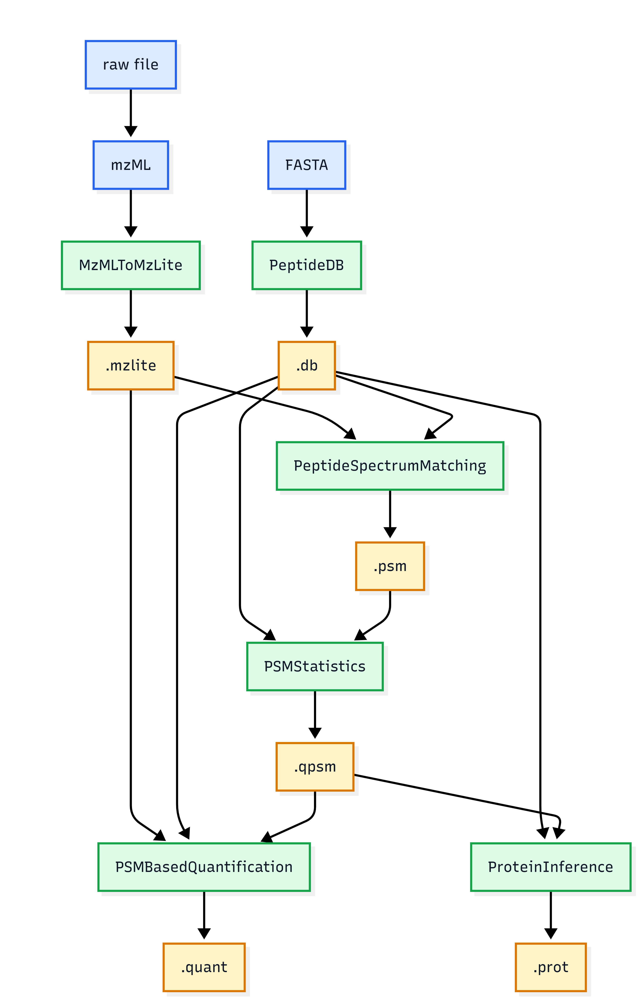
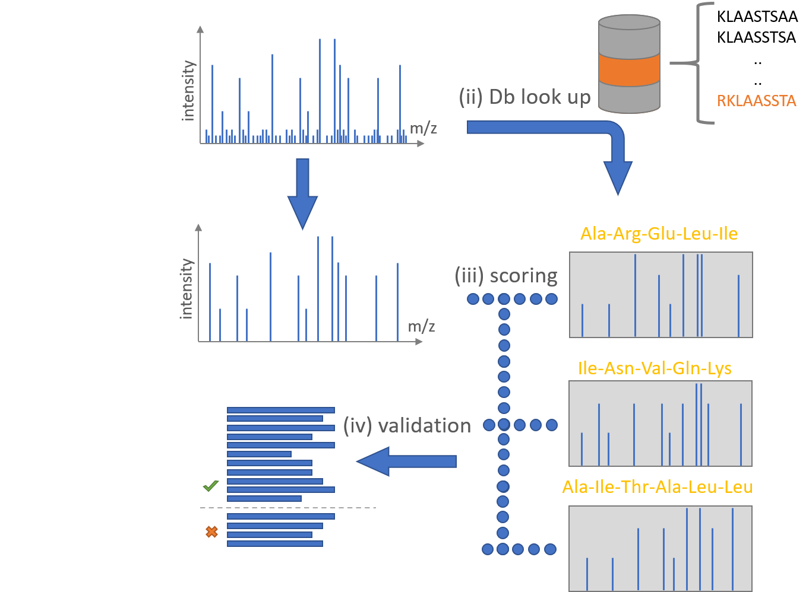
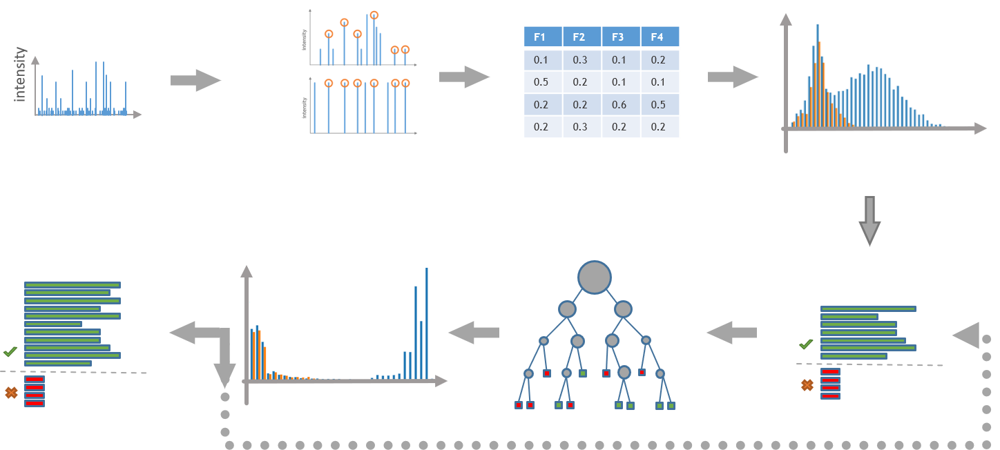

Modern proteomics pursues the principle of completeness, with the aim of identifying and analysing all proteins in a system. A broader definition describes proteomics as the attempt to determine the identity, quantity, structure, and biochemical and cellular functions of all proteins in an organism, tissue, or cell compartment, including their changes depending on location, time, and physiological state (). Mass spectrometry is a central analytical technique in proteomics, as it generates the raw data that form the basis of downstream computational analysis. Processing pipelines such as ProteomIQon take these mass spectrometry data as input and apply a series of bioinformatic analysis steps to identify and quantify peptides and proteins ().
Advantages of the ProteomIQon are that it can handle label-free (14N), labeled (15N) and TIMs data. As well it is a full pipeline developed by one group [CSBiology](https://csbiology.github.io/) with direct compatibility. You can find the project also on GitHub: [ProteomIQon Project](https://github.com/CSBiology/ProteomIQon).

This beginner friendly training will explain how to work with ProteomIQon's main tools. Here a short workflow visualization and agenda: 

> <agenda-title></agenda-title>
>
> In this tutorial, we will cover:
>
> 1. TOC
> {:toc}
>
{: .agenda}

# Input data

This beginner training is based on label-free proteomics data from *Chlamydomonas reinhardtii*. The original experiment, raw files, and metadata are available from [PlantDataHub](https://git.nfdi4plants.org/caroott/RatioLFQ). A corresponding *C. reinhardtii* reference proteome can be obtained from [UniProt](https://www.uniprot.org/proteomes/UP000006906).

> <comment-title>Scope of this tutorial</comment-title>
>
> This tutorial stops after peptide-ion quantification and protein inference. ProteomIQon contains additional tools, including tools for alignment and protein-level quantification, which are outside the scope of this beginner tutorial.
>
> The complete toolchain can be explored in the [ProteomIQon documentation](https://csbiology.github.io/ProteomIQon/).
{: .comment-title}

# From raw data to mzml format
 <hands-on-title>Import the Dataset</hands-on-title>
 > 1. get your data: 
 click to [download the data](https://git.nfdi4plants.org/caroott/RatioLFQ/-/blob/main/assays/DilutionSeries/dataset/20170519%20TM%20FScon3601/20170519%20TM%20FScon3601.wiff?ref_type=heads) and download the file and rename it to "sample.wiff"
 > 2. convert your sample.wiff file to a .mzml file with  the MSConvert Tool which is available on [GALAXY](https://usegalaxy.eu/?tool_id=toolshed.g2.bx.psu.edu%2Frepos%2Fgalaxyp%2Fmsconvert%2Fmsconvert%2F3.0.26121.8&version=latest). 
 Selecet the .mzml as output format, and don't forget to add the PeakPicking Filter, which converts continuous profile spectra into centroided peaks with defined m/z values and  intensities. A detailled guide about how to use MSConvert on GALAXY you can find here [MSConvert Guide](https://galaxyproject.org/news/2019-03-24-msconvert/)

# Convert mzML to mzLite

 The MzMLToMzLite Tool converts your mzml file to a mzlite file. Why? Because it is a SQLite based storage format. It holds the same spectra and metadata as the mzML, in a form that supports random access to single spectra. Using MSConvert, we now have an .mzml file, which we can use as input for the next tool. The MzMLToMzLite tool offers a range of optional parameters, you can find a default version of the [MzMlToMzLiteParams.JSON file](https://github.com/CSBiology/ProteomIQon/blob/dev/src/ProteomIQon/defaultParams/mzMLToMzLiteParams.json). To understand the parameters in detail, you find a detailed [documentation](https://csbiology.github.io/ProteomIQon/tools/MzMLToMzLite.html) here, but for our case we don't need to modify it.  

> <hands-on-title>Convert the mzML file to mzLite</hands-on-title>
>
> 1. Open **ProteomIQon MzMLToMzLite** in Galaxy.
> 2. Select the `mzML` file as input.
> 3. Run the tool.
> 4. Rename the output to `sample.mzlite`.
> 
{: .hands_on}

> <question-title>Why keep the mzLite file?</question-title>
> 
> Which later step in this tutorial needs access to the MS1 signal rather than only peptide identifications?
> 
> > <solution-title></solution-title>
> > 
> > The `PSM` reads the precursor masses to comprehend a peptidion candidate with the theoretical peptidion from the `PeptideDB database`.  
> > Another example is the `PSMBasedQuantification` needs the mzLite file because it extracts ion chromatograms from the MS1 data and fits chromatographic peaks for identified peptide ions.
> {: .solution}
{: .question}

# creating a peptide database with PeptideDB
If you are working with mass spectrometry data and wish to analyse the results from the mass spectrometer (the raw file), you will need a reference. A FASTA file is therefore almost always used. This FASTA file contains the amino acid sequences of the proteins expected to be present in your sample, which can be compared with the measured mass spectra. The FASTA file that you need can be found here [Chlamy data for download](https://www.uniprot.org/proteomes/UP000006906). It includes the whole Proteome of *Chlamydomonas reinhardtii*. To make proper use of this reference, we need to digest it with trypsin *in-silico*. This is where the PeptideDB Tool comes in. It gets your FASTA as input and stores the resulting peptides, with their masses and modifications, in a SQLite database. 

> <warning-title>The upstream default currently includes N15</warning-title>
>
> The current version of `peptideDBParams.json`, which you can find [under this link](https://github.com/CSBiology/ProteomIQon/blob/dev/src/ProteomIQon/defaultParams/peptideDBParams.json) currently contains `N15` in `IsotopicMod`. That is appropriate only when an N15-labeled search space is required. **For the label-free analysis in this tutorial, use an empty list `IsotopicMod: []`.** You should also assign the `Name` field to the model organism currently in use. The default setting is `AraTest`, but as we are working with *C. reinhardtii*, this should be changed to `Chlamy` or `Chlamydomonas`
>
> Do not assume that a default parameter file is automatically correct for every experiment. Protease, modifications, missed cleavages, and isotope labels must match the underlying experimental design.
{: .warning}

> <hands-on-title>Create a peptide database</hands-on-title>
>
> 1. Open **ProteomIQon PeptideDB** in Galaxy.
> 2. Select the *C. reinhardtii* FASTA file.
> 3. Configure the digestion parameters to match the tutorial experiment:
>    - *Protease*: `Trypsin`
>    - *Minimum missed cleavages*: `0`
>    - *Maximum missed cleavages*: `2`
>    - *Isotopic modification*: **[]** for the label-free tutorial
> 4. Understand the parameters from the parameter file in order to apply the correct settings to GALAXY
> 5. Run the tool.
> 6. Rename the generated database to `Chlamy.db`.
>
{: .hands_on}

> <question-title>What happens when more missed cleavages are allowed?</question-title>
> 
>  Imagine that `MaxMissedCleavages` is increased from `2` to `5`. What happens to the peptide search space?
> 
> >  <solution-title></solution-title>
> > 
> >  More theoretical peptides are generated because additional incompletely cleaved peptide sequences are accepted. This increases the search space and can increase both computational cost and the number of candidate peptides considered for a spectrum.
>  {: .solution}
{: .question}
>
> <question-title>Why must the protease setting match the experiment?</question-title>
> 
>  What would happen if the proteins were digested experimentally with trypsin but the database were generated using a different protease?
> 
> >  <solution-title></solution-title>
> > 
> >  The theoretical peptide search space would no longer represent the peptides expected from the experimental digestion. Many real peptides could be absent from the database, while many irrelevant peptide candidates could be introduced.
> {: .solution}
{: .question}

# Peptide Spectrum Matching

Now for the first interesting tool, PeptideSpectrumMatching; this tool attempts to identify which peptide corresponds to a measured MS/MS spectrum. To do this, the tool first examines the corresponding precursor from the previous MS1 scan and determines its charge based on the isotope pattern (charge state determination). Using the charge and the measured m/z value, the mass of the peptide can then be calculated.
The tool then searches the PeptideDB for all peptides whose mass approximately matches this calculated mass. The permitted deviation is defined via LookUpPPM.
For each matching peptide, the tool then calculates which fragment ions should theoretically be produced (fragmentation). These theoretical fragments are compared with the actually measured MS2 spectrum.
The better the theoretical peptide matches the measured spectrum, the higher the score. To this end, ProteomIQon calculates, amongst other things, a SEQUEST-like and an Andromeda-like score, as well as an X!Tandem-like score.
In addition to the genuine peptides, the decoy peptides are also tested. These are artificially generated reference peptides which are later used by PSMStatistics to estimate how many of the identified hits are likely to be false. This is used to determine the False Discovery Rate (FDR). 

The current default search settings include a `LookUpPPM` value of `30.0` ppm and precursor charges between `2` and `5`. See the [PeptideSpectrumMatching documentation](https://csbiology.github.io/ProteomIQon/tools/PeptideSpectrumMatching.html) for the complete parameter description.

> <hands-on-title>Run PeptideSpectrumMatching</hands-on-title>
>
> 1. Open **ProteomIQon PeptideSpectrumMatching** in Galaxy.
> 2. Select:
>    - the `sample.mzlite` file,
>    - the `Chlamy.db` database,
>    - the PeptideSpectrumMatching parameter settings.
> 3. Run the tool.
> 4. Rename the output to `sample.psm`.
> 5. Inspect the tabular output.
{: .hands_on}

 We now understand which input files the tool is getting and what it does, but what are we getting in return? The result is a .psm file with a lot of information, so lets have a look deeper inside. 

| Column | Description |
| --- | --- |
| `PSMId` | Identifier constructed for a candidate peptide-spectrum match. |
| `GlobalMod` | Identifier of the global/isotopic modification state used for the peptide candidate. |
| `PepSequenceID` | Identifier of the unmodified peptide sequence. |
| `ModSequenceID` | Identifier of the modified peptide sequence. |
| `Label` | Target/decoy label: `1` for a target candidate and `-1` for a decoy candidate. |
| `ScanNr` | File-specific ascending MS2 identifier used by the search. |
| `ScanTime` | Retention time of the MS/MS spectrum. |
| `Charge` | Precursor charge state. |
| `PrecursorMZ` | Precursor mass-to-charge ratio. |
| `TheoMass` | Theoretical mass of the peptide candidate. |
| `AbsDeltaMass` | Absolute difference between theoretical and measured precursor mass. |
| `PeptideLength` | Number of residues in the peptide sequence. |
| `SequestScore` | SEQUEST-like spectrum-matching score. |
| `AndroScore` | Andromeda-like spectrum-matching score. |
| `XtandemScore` | X!Tandem-like spectrum-matching score. |
| `StringSequence` | Peptide sequence representation. |

> <question-title>Does the highest search score automatically mean that a PSM is reliable?</question-title>
>
> A peptide candidate has the best SEQUEST-like score for a spectrum. Can we already treat it as a confident identification?
>
> > <solution-title></solution-title>
> >
> > No. A high score means that the candidate matches the spectrum better according to that scoring function, but it does not directly provide a controlled error rate. ProteomIQon therefore uses the target and decoy candidates in `PSMStatistics` to estimate statistical confidence.
> {: .solution}
{: .question}

# Evaluate the psm results with peptide spectrum matching statistics (PSMStats)
The `.psm` file contains several search-engine and quality-related features for each candidate. `PSMStatistics` combines these features into a single model score using a semi-supervised procedure. Target and decoy labels provide the training signal, and the model is retrained iteratively as confident target matches are added.

From the combined score, the tool calculates two important statistical measures:

- **PEP value (Posterior Error Probability):** an estimate of the probability that an individual PSM is incorrect.
- **Q-value:** The Q-value of a PSM is the estimated minimum FDR among the score thresholds at which this PSM is still retained.

The default estimated-threshold configuration currently uses a Q-value threshold of `0.01`, a PEP threshold of `0.05`, up to `15` iterations, and a minimum increase between iterations of `0.005`. See the [PSMStatistics documentation](https://csbiology.github.io/ProteomIQon/tools/PSMStatistics.html) for details.

| Parameter | Default | Meaning |
| --- | ---: | --- |
| `QValueThreshold` | `0.01` | Keep PSMs whose Q-value is below the threshold. |
| `PepValueThreshold` | `0.05` | Keep PSMs whose PEP value is below the threshold. |
| `MaxIterations` | `15` | Maximum number of retraining iterations. |
| `MinimumIncreaseBetweenIterations` | `0.005` | Stop when too few additional confident positives are gained. |
| `PepValueFittingMethod` | `IRLS` | Method used to fit the PEP curve. |
| `ParseProteinIDRegexPattern` | `id` | Controls how protein identifiers are parsed from the database headers. |
| `KeepTemporaryFiles` | `true` | Keeps temporary files generated by the statistical procedure. |

> <hands-on-title>Run PSMStatistics</hands-on-title>
>
> 1. Open **ProteomIQon PSMStatistics** in Galaxy.
> 2. Select:
>    - `sample.psm`,
>    - `Chlamy.db`,
>    - the PSMStatistics parameters.
> 3. Run the tool.
> 4. Rename the main output to `sample.qpsm`.
> 5. Inspect the output table
{: .hands_on}

The `.qpsm` output retains the identification information and adds statistical confidence measures. The most important columns for this tutorial are:

| Column | Description |
| --- | --- |
| `StringSequence` | Peptide sequence representation. |
| `SequestScore` | SEQUEST-like spectrum-matching score. |
| `AndroScore` | Andromeda-like spectrum-matching score. |
| `XtandemScore` | X!Tandem-like spectrum-matching score. |
| `ModelScore` | Combined score learned by PSMStatistics. |
| `QValue` | Estimated Q-value for the PSM. Lower values indicate stronger statistical confidence. |
| `PEPValue` | Estimated posterior error probability for the individual PSM. Lower values indicate stronger confidence. |
| `ProteinNames` | Protein identifiers associated with the identified peptide. |

> <question-title>What is the difference between a Q-value and a PEP value?</question-title>
>
> Which value is intended to describe the error probability of one individual PSM?
>
> > <solution-title></solution-title>
> >
> > The **PEP value** describes the estimated probability that an individual PSM is incorrect. The **Q-value** is related to the estimated false discovery rate of the accepted set of PSMs at a given score threshold.
> {: .solution}
{: .question}

> <question-title>Why does PSMStatistics need decoy matches?</question-title>
>
> What information do decoy peptide candidates provide?
>
> > <solution-title></solution-title>
> >
> > Decoys provide examples of matches that are expected to be incorrect. Their score distribution can therefore be compared with target matches and used to estimate false discoveries and learn which combinations of search features are characteristic of confident target identifications.
> {: .solution}
{: .question}

# Quantification of identified peptides 
Peptide identification tells us which peptide is likely to have produced an MS/MS spectrum, but it does not by itself estimate how abundant that peptide ion was in the chromatographic run.

`PSMBasedQuantification` uses the confident identifications from `PSMStatistics` to locate peptide ions in the MS1 data. For each identified peptide ion, it extracts an ion chromatogram around the expected monoisotopic m/z and retention time, detects chromatographic peaks, and fits the peak closest to the identification. **The fitted peak area is reported as the peptide-ion quantity.**

Important parameters to run the tool are described in the [PSMBasedQuantification documentation](https://csbiology.github.io/ProteomIQon/tools/PSMBasedQuantification.html).

| Parameter | Meaning |
| --- | --- |
| `PerformLabeledQuantification` | Selects label-free or labeled quantification behaviour. |
| `XicExtraction.ScanTimeWindow` | Defines the retention-time window searched around an identification. |
| `XicExtraction.MzWindow_Da` | Defines the m/z window used to extract the ion chromatogram. |
| `XicExtraction.XicProcessing` | Controls chromatographic peak detection, for example the wavelet method. |
| `TopKPSMs` | Optionally limits how many PSMs per peptide ion contribute to the estimate. |
| `BaseLineCorrection` | Controls optional background/baseline correction. |

Nice! so we know now which files are needed and what the parameters mean. So let's run the tool in GALAXY
> <hands-on-title>Run PSMBasedQuantification</hands-on-title>
>
> 1. Open **ProteomIQon PSMBasedQuantification** in Galaxy.
> 2. Select:
>    - `sample.mzlite`,
>    - `sample.qpsm`,
>    - `Chlamy.db`.
> 3. Set *Perform labeled quantification* to **lable-free**.
> 4. Keep the tutorial XIC and peak-detection settings.
> 5. If available in the Galaxy wrapper, enable diagnostic-chart generation for this training run.
> 6. Run the tool.
> 7. Rename the main output to `sample.quant`.
{: .hands_on}

The resulting file is a .quant file now we look at the output to get a better understanding of what we got. Important output columns include:

| Column | Description |
| --- | --- |
| `StringSequence` | Peptide sequence representation. |
| `Charge` | Charge state of the quantified peptide ion. |
| `PrecursorMZ` | Mean precursor m/z associated with the identifications. |
| `QValue` | Best Q-value associated with the peptide ion. |
| `PEPValue` | Best PEP value associated with the peptide ion. |
| `ProteinNames` | Protein identifiers associated with the peptide. |
| `QuantMz_Light` | m/z used for the light/unlabeled peptide-ion quantification. |
| `Quant_Light` | Fitted chromatographic peak area; the main quantitative abundance estimate for the light/unlabeled ion. |
| `MeasuredApex_Light` | Measured intensity at the chromatographic peak apex. |
| `Seo_Light` | Standard error of prediction of the fitted peak model. |
| `Params_Light` | Estimated parameters of the fitted chromatographic peak model. |
| `Difference_SearchRT_FittedRT_Light` | Difference between the identification retention time and fitted peak retention time. |
| `KLDiv_Observed_Theoretical_Light` | Kullback-Leibler divergence comparing observed and theoretical isotope-pattern information before correction. |
| `KLDiv_CorrectedObserved_Theoretical_Light` | Kullback-Leibler divergence after correction. | 

> <question-title>Which value should be used as the main peptide-ion abundance estimate?</question-title>
>
> Would you normally use `MeasuredApex_Light` or `Quant_Light` as the quantity reported by this ProteomIQon step?
>
> > <solution-title></solution-title>
> >
> > `Quant_Light` is the fitted chromatographic peak area and is the quantity reported by ProteomIQon. `MeasuredApex_Light` describes the intensity at the peak maximum, which is useful diagnostic information but is not the fitted-area quantity.
> {: .solution}
{: .question}

> <question-title>What can a diagnostic XIC plot tell you?</question-title>
>
> Imagine that a fitted peak is far away from the MS/MS identification retention time. Why would you inspect this result more closely?
>
> > <solution-title></solution-title>
> >
> > The identification provides a retention-time anchor for the expected peptide ion. A large difference between the identification time and fitted peak position can indicate that the selected chromatographic feature deserves closer inspection. Diagnostic XIC plots can help determine whether the chosen peak shape and location are plausible.
> {: .solution}
{: .question}

# Protein Inferece - peptides to proteins 
Peptide identification does not always translate into a unique protein identification. The same peptide sequence can occur in multiple proteins, homologues, or isoforms. `ProteinInference` therefore maps identified peptides back to proteins and reports **protein groups** that represent the available peptide evidence.

The current parameters are documented in [ProteinInference](https://csbiology.github.io/ProteomIQon/tools/ProteinInference.html):

| Parameter | Meaning |
| --- | --- |
| `ProteinIdentifierRegex` | Extracts protein identifiers from database protein names and, when used, GFF3 entries. |
| `Protein` | Controls how overlapping protein groups are kept or merged. |
| `Peptide` | Controls which peptides are considered for later quantification of protein groups. |
| `GroupFiles` | Determines whether several input runs are inferred together. |
| `GetQValue` | Controls protein-level FDR/Q-value estimation. |

> <hands-on-title>Run ProteinInference</hands-on-title>
>
> 1. Open **ProteomIQon ProteinInference** in Galaxy.
> 2. Select:
>    - `sample.qpsm`,
>    - `Chlamy.db`.
> 3. Use the tutorial ProteinInference parameter settings.
> 4. Run the tool.
> 5. Rename the output to `sample.prot`.
> 6. Inspect the resulting protein groups.
{: .hands_on}

The `.prot` file contains:

| Column | Description |
| --- | --- |
| `ProteinGroup` | Protein identifiers belonging to the inferred group, joined by `;` when several proteins are present. |
| `PeptideSequence` | Peptide sequences supporting the group in the run. |
| `Class` | Peptide-evidence class. Its interpretation is most informative when an appropriate GFF3 annotation is supplied. |
| `TargetScore` | Protein-group score derived from target peptide evidence. |
| `DecoyScore` | Corresponding score derived from decoy protein evidence. |
| `QValue` | Protein-level Q-value estimated from target and decoy scoring. |

> <question-title>Why can one peptide support more than one protein?</question-title>
>
> Two proteins contain exactly the same peptide sequence, and that peptide is confidently identified. Can this peptide alone distinguish which protein was present?
>
> > <solution-title></solution-title>
> >
> > No. The measured peptide provides evidence compatible with both proteins. Additional unique peptides or other biological information would be needed to distinguish them. Protein inference therefore represents this ambiguity using protein groups instead of forcing an unsupported unique assignment.
> {: .solution}
{: .question}

# Optional extension: what changes for N15-labeled data?

The main workflow above is deliberately label-free (in this case label-free means 14N). ProteomIQon also supports metabolically labeled data such as 15N experiments, but the search database and quantification settings must then be changed consistently.

In an N15-labeled experiment, nitrogen atoms containing 14N are replaced by the heavier 15N isotope during metabolic labelling. The mass shift of a peptide depends on the number of nitrogen atoms contained in that peptide. This produces predictable light/heavy peptide-ion relationships that can be used during labeled quantification.

For an N15 workflow:

1. `PeptideDB` must include the N15 isotope modification so that labeled peptide variants are represented in the search space.
2. `PSMBasedQuantification` must use the N15-labeled quantification mode rather than `Unlabeled`.
3. The resulting `.quant` file can contain both light and heavy quantities, including `Quant_Light` and `Quant_Heavy`.

> <question-title>Should an N15 isotope modification be included for an unlabeled sample?</question-title>
>
> > <solution-title></solution-title>
> >
> > No. The peptide database should represent the experimental design. Including an isotope label that is not present generates additional peptide variants and unnecessarily expands the search space.
> {: .solution}
{: .question}

> <question-title>Why must PeptideDB and PSMBasedQuantification agree about labelling?</question-title>
>
> > <solution-title></solution-title>
> >
> > The peptide database determines which label-free or labeled peptide variants can be identified, while the quantification mode determines which chromatographic partner ions are searched and quantified. Inconsistent settings would make the workflow biologically and computationally inconsistent.
> {: .solution}
{: .question}

# Recap: which file contains what?

| File | Produced by | Main purpose |
| --- | --- | --- |
| `.mzlite` | MzMLToMzLite | Efficient access to the MS spectra used by downstream ProteomIQon tools. |
| `.db` | PeptideDB | Search database of theoretical peptides, masses, modifications, and protein relationships. |
| `.psm` | PeptideSpectrumMatching | Candidate peptide-spectrum matches and search scores. |
| `.qpsm` | PSMStatistics | Statistically evaluated PSMs with model score, Q-value, and PEP value. |
| `.quant` | PSMBasedQuantification | Quantified peptide ions based on fitted chromatographic peaks. |
| `.prot` | ProteinInference | Protein groups and protein-level confidence information. |

> <question-title>Match the result to the file</question-title>
>
> Which file would you inspect for each of the following questions?
>
> 1. How large is the fitted chromatographic peak area of an identified peptide ion?
> 2. What is the Q-value of a statistically evaluated PSM?
> 3. Which proteins form an inferred protein group?
> 4. Which target and decoy candidates were initially scored for a spectrum?
>
> > <solution-title></solution-title>
> >
> > 1. `.quant`
> > 2. `.qpsm`
> > 3. `.prot`
> > 4. `.psm`
> {: .solution}
{: .question}

# Conclusion

In this tutorial, you followed a core ProteomIQon DDA workflow from open mass-spectrometry data to peptide identification, statistical validation, peptide quantification, and protein inference.

You first converted mzML data to the mzLite format used throughout the workflow and generated a peptide search database from a protein FASTA file. You then matched MS/MS spectra to candidate peptides, used target-decoy information and statistical modelling to retain confident PSMs, quantified identified peptide ions from fitted chromatographic peak areas, and finally mapped peptide evidence back to proteins and protein groups.

A central lesson is that the intermediate files are not independent outputs: each represents a different stage of the same analysis. Parameters chosen early in the workflow, especially digestion settings, modifications, isotope labels, and identifier parsing, influence the interpretation of later results. For reproducible analysis, these parameters must match the experimental design and should be documented together with the exact ProteomIQon/Galaxy tool versions used.

# Literature 
- [ProteomIQon](https://csbiology.github.io/ProteomIQon/)
- [ProteomIQon Repository](https://github.com/CSBiology/ProteomIQon/tree/main)
- [QualIQon](https://zenodo.org/records/22691077)
