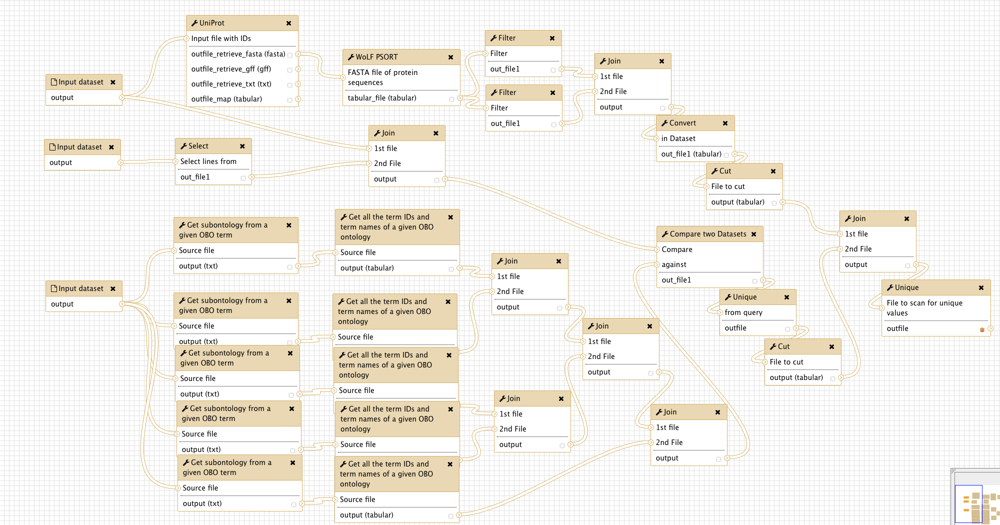

# Secretome Prediction using GO annotations and localization prediction

## Introduction

The cellular secretome contains both proteins that are secreted by cells and proteins that are shed from the cellular surface. Here, we describe an approach to predict those proteins in an input list that would be expected in the cellular secretome. This approach combines Gene Ontology (GO) annotation and the [WoLF PSORT](https://www.ncbi.nlm.nih.gov/pmc/articles/PMC1933216/) algorithm for localization prediction.

We chose to include all proteins that are annotated as, or predicted to be, lysosomal proteins. Lysosomal proteins are routinely secreted by malignant and non-malignant cells in high amounts, due to "leakiness" of the mannose-6-phosphate receptor pathway [1,2].
Furthermore, we chose to exclude proteins annotated as being part of extracellular organelles, e.g. exosomes. While exosomes are secreted by malignant and non-malignant cells, exosomal proteins are expected in the secretome at very low amounts, if not especially enriched for.

For secretome prediction, we combine localization data from the Gene Ontology database with a classical protein localization prediction algorithm (WoLF PSORT). The workflow was designed for sensitivity, i.e. a protein predicted by *at least one of the used tools* will be included in the output. To change this, follow the instructions in the box **Comment: Customizing the Workflow** below.

## Overview

The figure below gives an overview of the Galaxy workflow:

## Input

The workflow needs three input files:

  1. A tabular file, the first column containing uniprot accession numbers of the proteins of interest. [Test data](https://doi.org/10.5281/zenodo.519260)
  
		> ###  Comment: Test data
		> The provided test dataset for input 1 is a list of human proteins, identified by LC-MS/MS in the cellular supernatant of MDA-MB-231 cells. The dataset was originally published in [(Sigloch et al., BBA, 2016)](https://www.ncbi.nlm.nih.gov/pubmed/27526672).
		{: .comment}
  
  2. The complete uniprot GO database for the organism of interest, available [via FTP](ftp://ftp.ebi.ac.uk/pub/databases/GO/goa/). To download the human GOA file needed for the test input, paste the following link to the Galaxy upload tool: 'ftp://ftp.ebi.ac.uk/pub/databases/GO/goa/HUMAN/goa_human.gaf.gz'
  
		> ###  Comment: Uniprot Gene Ontology Association (GOA) files
		> - Information about different GOA file types can be found [here](https://www.ebi.ac.uk/GOA/downloads).
		> - Information about the structure of the files can be found [here](ftp://ftp.ebi.ac.uk/pub/databases/GO/goa/HUMAN/README).
	  {: .comment}  
  
  3. The complete GO Open Biomedical Ontology (OBO), i.e. "GO term tree", accessible at http://purl.obolibrary.org/obo/go/go.obo

> ###  Comment: Customizing the Workflow
> This workflow was designed for sensitivity, not for specificity. If you need to increase the specificity, you have the following possibilities, with decreasing efficiency:
> 1. Switch the setting `Output lines appearing in` of the last **Join**  (last tool before the final **Unique**  from `All lines [-a 1 -a 2]` to `Both 1st & 2nd file`. Thus, your output will contain only those proteins that are equally predicted by both methods used.
> 2. (Only after doing 1.) Adding another way of localization prediction, i.e. another database or another prediction algorithm.
> 3. Replacing **WoLF PSORT**  by a more precise localization prediction tool. If you choose this approach, remember that you will probably have to adjust the settings for all tools in the workflow that are processing the **WoLF PSORT**  output.
{: .comment}

## Citation

If you use this workflow directly, or any derivative of it, in work leading to a scientific publication,
please cite:

F.C. Sigloch, J.D. Knopf, J. Weißer, A. Gomez-Auli, M.L. Biniossek, A. Petrera, et al., Proteomic analysis of silenced cathepsin B expression suggests non-proteolytic cathepsin B functionality, Biochim. Biophys. Acta - Mol. Cell Res. 1863 (2016) 2700–2709. doi:10.1016/j.bbamcr.2016.08.005. https://www.ncbi.nlm.nih.gov/pubmed/27526672

## Literature

[1] B. Schröder, C. Wrocklage, A. Hasilik, P. Saftig, The proteome of lysosomes., Proteomics. 10 (2010) 4053–76. doi:10.1002/pmic.201000196.

[2] J. Reiser, B. Adair, T. Reinheckel, Specialized roles for cysteine cathepsins in health and disease, J. Clin. Invest. 120 (2010) 3421–3431. doi:10.1172/JCI42918.
