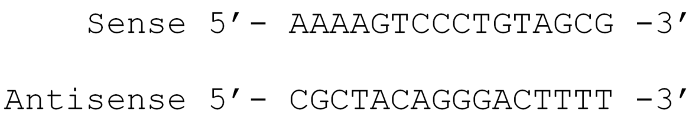

The objective of this tutorial is to learn how to clean and manage AB1 data files freshly obtained from Sanger sequencing. 
This kind of sequencing is targeting a specific sequence with short single DNA strands called primers. These primers are delimiting ends of the targeted marker.
Usually, one gets two .ab1 files for each sample, representing the sense (forward) and the antisense (reverse) strands of DNA.

Here, we'll be using raw data from .
In this article, two DNA markers are investiguated CHD8 (Chromodomain-helicase-DNA-binding protein 8) and AOPEP (Aminopeptidase O Putative).
We'll focus on CHD8 sequences but you can try to apply the same steps on the AOPEP sequences to practice after the tutorial !

In the first section of the tutorial, we'll be preparing primer's data by:
- selecting the right primer sequences with the identifier;
- removing eventual gaps included in the sequences;
- and compute the reverse-complement sequence for the antisense primer only.

In the second section of the tutorial, we'll be preparing the Sanger sequences data by:
- extracting ab1 files of the interest sequence (CHD8) and separating sense and antisense sequences in two distinct data collections;
- converting ab1 files to FASTQ to permit its use in the following tools;
- trimming low quality ends of the sequences;
- compute the reverse-complement for the antisense sequence only;
- align sense and antisense sequences;
- obtain a consensus sequence (which results the correspondance between nucleotides of the sense and the antisense sequences) for each three samples.

In the third section of the tutorial, primers and all consensus sequences are finally merged into a single file to be aligned and verified.

> <details-title>What is the reverse-complement sequence and why computing it for the antisense sequence?</details-title>
>
> Consider a double-strand DNA molecule with the following sequences:
> 
> 
> When sequencing, each strand of DNA are read separately in the 5'-3' orientation. Hence, in the sequence files each strand are provided as:
> 
>
> To get the antisense sequence in its original orientation, the reverse sequence is computed:
> 
>
> To align sense and antisense sequence, the complement sequence of the reversed antisense sequence is computed:
> 
>
> The two sequences can be aligned now:
> 
>
{: .details}

> <agenda-title></agenda-title>
>
> In this tutorial, we will cover:
>
> 1. TOC
> {:toc}
>
{: .agenda}


# Get data

Authors of  have shared openly their raw AB1 files on Zenodo.

> <hands-on-title> Data Upload </hands-on-title>
>
> 1. Create a new history for this tutorial
> 2. Import the files from [Zenodo]({{ page.zenodo_link }}) :
>
>    ```
>    https://zenodo.org/records/7104640/files/AOPEP_and_CHD8_sequences_20220907.zip
>    ```
>    
>    Change **Type (set all):** from "Auto-detect" to `zip` and click **Start**
>    
>    
>
>    
>
> 4. Create primer FASTA file, copy:
>    ```
>    >Forward_CHD8
>    GAGGTGAAAGAATCATAAATTGG
>    >Reverse_CHD8
>    CCCTGTGTACAAATAGCTTTTGT
>    >Forward_AOPEP
>    TCATGGTTCCAGGCAGAGTTATT
>    >Reverse_AOPEP
>    TGCTGTGACAAGCCAACCAATGG
>    ```
>    - Open the Galaxy Upload Manager ( on the top-right of the tool panel)
>    - Select **Paste/Fetch Data**
>    - Paste into the text field
>    - Change **Type (set all):** from "Auto-detect" to `fasta`
>    - Change the name from "New File" to "Primer file"
>    - Click **Start**
>
>      
>    Note these primer sequences were invented for the purpose of the tutorial, it is not the sequences used in the publication.
>
{: .hands_on}

# Prepare primer data

## Separate and format primers files

Primers must be separated in distinct files because sense (forward) and antisense (reverse) primers won't be subjected to the same formating.

> <hands-on-title> Create separate files for each primer </hands-on-title>
>
> 1.  with the following parameters:
>    -  *"FASTA sequences"*: `Primer file`
>    - *"Criteria for filtering on the headers"*: `Regular expression on the headers`
>        - *"Regular expression pattern the header should match"*: `Reverse_CHD8`
>    - Add tags "#Primer" and "#Reverse"
>      
>    
>
>    
>
> 2.  with the following parameters:
>    -  *"FASTA sequences"*: `Primer file`
>    - *"Criteria for filtering on the headers"*: `Regular expression on the headers`
>        - *"Regular expression pattern the header should match"*: `Forward_CHD8`
>    - Add tags "#Primer" and "#Forward"
>      
>    
>
> 3. Remove eventual gaps from primers  with the following parameters:
>    
>    
>    
>    -  *"fasta - Dataset"*: `Two Filter FASTA outputs` (outputs of **Filter FASTA** )
>
{: .hands_on}

In this previous hands-on, the step of removing eventual gaps (`-` in the FASTA files) is a precaution, there are no gaps in our primers file. However, it is important to remove gaps at this point in case you are using different data, otherwise some steps of the tutorial could fail (e.g. alignment).

This following hands-on is to be applied only on the sequence of the antisense (reverse) primer. 

> <hands-on-title> Compute Reverse-Complement of the antisense (reverse) primer </hands-on-title>
>
> 1.  the sequence antisense (reverse) primer with the following parameters:
>    -  *"Input file in FASTA or FASTQ format"*: `Degap.seqs #Reverse FASTA output` (output of **Degap.seqs** )
> 
> See in the introduction for explanations on the Reverse-Complement.
> 
{: .hands_on}

# Prepare sequence data

## Unzip data files

> <hands-on-title> Unzip </hands-on-title>
>
> 1.  with the following parameters:
>    -  *"input_file"*: `AOPEP_and_CHD8_sequences_20220907.zip?download=1`
>    - *"Extract single file"*: `All files`
>
> > <question-title></question-title>
> > How many files is there in the ZIP archive ?
> >
> > > <solution-title></solution-title>
> > > 12 (if you have a different number of files something likely went wrong)
> > >
> > {: .solution}
> >
> {: .question}
>
{: .hands_on}

From now on, we'll be working a lot on data collections:



## Filter collection to separate sense and antisense sequence files

As for primers, sense and antisense sequences will be subjected to slightly different procedures so they must be separated in distinct data collections.

> <hands-on-title> Filter </hands-on-title>
>
> 1.  with the following parameters:
>    -  *"Dataset collection"*: `output collection` (output of **Unzip** )
>
> 2.  with the following parameters:
>    -  *"Select lines from"*: `output` (output of **Extract element identifiers** )
>    - In *"Check"*:
>        -  *"Insert Check"*
>            - *"Find Regex"*: `^[A-Za-z0-9_-]+F$`
>            - *"Replacement"*: ``
>        -  *"Insert Check"*
>            - *"Find Regex"*: `^[A-Za-z0-9_-]+AOPEP[A-Za-z0-9_-]+$`
>            - *"Replacement"*: ``
>    - Tag output with "#Reverse"
>
>    
>
>    
>
> 4.  with the following parameters:
>    -  *"Select lines from"*: `output` (output of **Extract element identifiers** )
>    - In *"Check"*:
>        -  *"Insert Check"*
>            - *"Find Regex"*: `^[A-Za-z0-9_-]+R$`
>            - *"Replacement"*: ``
>        -  *"Insert Check"*
>            - *"Find Regex"*: `^[A-Za-z0-9_-]+AOPEP[A-Za-z0-9_-]+$`
>            - *"Replacement"*: ``
>    - Tag output with "#Forward"
>
>    
>
> 5.  with the following parameters:
>    -  *"Input Collection*: `output collection` (output of **Unzip** )
>    - *"How should the elements to remove be determined?"*: `Remove if identifiers are ABSENT from file`
>        -  *"Filter out identifiers absent from"*: `#Forward files list` & `#Reverse files list` (output of **Regex Find And Replace** )
>    - Tag `(filtered)` outputs with "#Forward" and "#Reverse"
>
>    
>    
>    > <comment-title> What's happening in this section? </comment-title>
>    >
>    > First step: Extracting the list of file names in the data collection
>    > Second step: Removing file names containing a "F" and "AOPEP" -> creating a list of antisense (reverse) sequence files of the marker CHD8
>    > Third step: Removing file names containing a "R" and "AOPEP" -> creating a list of sense (forward) sequence files of the marker CHD8
>    > Fourth step: Select files in the collection -> creating two distinct collections with sense (forward) sequence files on one hand and antisense (reverse) sequence file on the other hand
>    >
>    > For the second and third step, we used regular expressions (Regex):
>    > 
>    > 
>    > 
>    > With `[A-Za-z0-9_-]` meaning any character between A to Z, a to z, 0 to 9 or _ or -, the following `+` meaning that any of these characters are found once or more. 
>    > 
>    {: .comment}
>
{: .hands_on}

## Convert AB1 sequence files to FASTQ and trim low-quality ends

In Sanger sequencing, ends tend to be of low trust levels (each nucleotide has a quality score reflecting this trust level), it is important to delete these sections of the sequences to ensure wrong nucleotides aren't introduced in the sequences. 

> <hands-on-title> AB1 to FASTQ files and trim low quality ends </hands-on-title>
> 
> Do these steps twice !! We have Froward and antisense (reverse) sequence data collections, do these steps starting with each "(filtered)" data collections, this could help:
> 
> 
>
> 1.  with the following parameters:
>    -  *"Input ab1 file"*: `(filtered) output collection` (output of **Filter collection** )
>    - *"Do you want trim ends according to quality scores ?"*: `No, use full sequences.`
> 
> In this tool, it is possible to trim low-quality ends along with the conversion of the file but parametrization is less precise.
> 
> 2.  with the following parameters:
>    -  *"Input FASTA/Q file"*: `output collection` (output of **ab1 to FASTQ converter** )
>    - *"Mode for trimming FASTQ File"*: `Quality`
>        - *"Maximally trim down to INT bp"*: `0`
>
{: .hands_on}

## Compute reverse complement sequence for antisense (reverse) sequences only 

See in the introduction for explanations on the Reverse-Complement.

> <hands-on-title> Reverse complement </hands-on-title>
>
> 1.  with the following parameters:
>    -  *"File to groom"*: `#Reverse output collection` (output of **seqtk_trimfq** )
>    - *"Advanced Options"*: `Show Advanced Options`
>        - *"Summarize input data"*: `Do not Summarize Input (faster)`
>
>    > <comment-title> What is this step? </comment-title>
>    >
>    > It is a necessary step to get the right input format for the following step **Reverse-Complement** 
>    {: .comment}
>
> 2.  with the following parameters:
>    -  *"Input file in FASTA or FASTQ format"*: `#Reverse output collection` (output of **FASTQ Groomer** )
>
>
{: .hands_on}

## Merge corresponding sense and antisense sequences single files

> <hands-on-title> Sort collections </hands-on-title>
> 
> Do this step twice !! One has to make sure sense (forward) and antisense (reverse) sequences collections are in the same order to get the right sense and the right antisense sequence to be merged together
>
> 
>
> 1.  with the following parameters:
>    -  *"Input Collection"*: `Collection` (output of **seqtk_trimfq**  & output of **Reverse-Complement** )
>    - *"Sort type"*: `alphabetical`
>
{: .hands_on}

> <hands-on-title> Merge sense (forward) and antisense (reverse) sequence files </hands-on-title>
>
> 1.  with the following parameters:
>    -  *"Input FASTA/Q file #1"*: `output` (output of **Sort collection** )
>    -  *"Input FASTA/Q file #2"*: `output` (output of **Sort collection** )
>
> Check there is two sequences in each three files of the newly-created collection.
>
{: .hands_on}

## Convert FASTQ files to FASTA

> <hands-on-title> FASTQ to FASTA </hands-on-title>
>
> 1.  with the following parameters:
>    -  *"File to groom"*: `default` (output of **seqtk_mergepe** )
>    - *"Advanced Options"*: `Show Advanced Options`
>        - *"Summarize input data"*: `Do not Summarize Input (faster)`
>
>    > <comment-title> What is this step? </comment-title>
>    >
>    > It is a necessary step to get the right input format for the following step **FASTQ to FASTA** 
>    > 
>    {: .comment}
>
> 1.  with the following parameters:
>    -  *"FASTQ file to convert"*: `output collection` (output of **FASTQ Groomer** )
>    - *"Discard sequences with unknown (N) bases"*: `no`
>    - *"Rename sequence names in output file (reduces file size)"*: `no`
>    - *"Compress output FASTA"*: `No`
>
>    > <comment-title> information </comment-title>
>    >
>    > If this step doesn't work, one can try tools **FASTQ to tabular**  and **tabular to FASTA**  instead
>    {: .comment}
>
{: .hands_on}

## Align sequences and retrieve consensus for each sequence

> <hands-on-title> Align and consensus </hands-on-title>
>
> 1.  with the following parameters:
>    -  *"Input fasta file"*: `output collection` (output of **FASTQ-to-FASTA** )
>    - *"Method for aligning sequences"*: `clustalw`
>    - *"Minimum percent sequence identity to closest blast hit to include sequence in alignment"*: `0.1`
>
> 2.  with the following parameters:
>    -  *"Input fasta file with at least two sequences"*: `aligned_sequences` (output of **Align sequences** )
>    - Add tag "#Consensus"
>
> 3.  with the following parameters:
>    - *"Merge"*: `fasta files`
>        -  *"inputs - fasta"*: `output collection` (output of **Consensus sequence from aligned FASTA** )
>
{: .hands_on}

# Manage primers and sequences 

## Merge and align consensus sequences file and primer files

> <hands-on-title> Merge and format consensus sequences + primers file </hands-on-title>
>
> 1.  with the following parameters:
>    - *"Merge"*: `fasta files`
>        -  *"inputs - fasta"*: `consensus sequences` (output of **Merge.files** ), `Reverse primer` (output of **Reverse-Complement** ), `Forward primer` (output of **Degap.seqs** )
> 
>    
> 
>    - Remove tags "#Forward" and "#Reverse"
>
> 2.  with the following parameters:
>    -  *"Select lines from"*: `output` (output of **Merge.files** )
>    - In *"Check"*:
>        -  *"Insert Check"*
>            - *"Find Regex"*: `([A-Z-])>`
>            - *"Replacement"*: `\1\n>`
>
>    > <comment-title> What's going on in this second step? </comment-title>
>    >
>    > Sometimes, **Merge.files**  doesn't keep linefeed between the files, this step permits to correct it and get a FASTA file that is formatted properly.
>    > 
>    > For the second step, we used regular expressions (Regex):
>    > 
>    > 
>    > 
>    > With `[A-Z-]` meaning any character between A to Z or -, `\1` repeat the character chain between brackets in the *"Find Regex"* section, `\n` meaning a line-feed. 
>    > 
>    {: .comment}
>
{: .hands_on}

When you have the consensus sequences, you can check if any ambiguous nucleotide is to be found in the sequences. If you find such nucleotides, it means different nucleotides were found in the sense and antisense sequence at the same position, some checks are needed.

> <details-title>Ambiguous nucleotide correspondance</details-title>
>
> - Y = C or T
> - R = A or G
> - W = A or T
> - S = G or C
> - K = T or G
> - M = C or A
>
{: .details}

> <hands-on-title> Look for ambiguous nucleotides </hands-on-title>
>
> 1. Click on output of **Regex Find and Replace**  in the history to expand it
>
> 2. Click on  Visualize
>
> 3. Select **Multiple Sequence Alignment**
> 
> 4. Set color scheme to `Clustal`, ambiguous nucleotides are highlighted in dark blue
>    
> 5. There are two nucleotide positions to check, Y at 121 in sequence `consensus_B05_CHD8-III6brother-18` and W at 286 in sequence `consensus_05_CHD8-III6mother-18`
>
> 6. You need to go back to your FASTQ sequences to understand the origin of the ambiguity
>
> 7.  with the following parameters:
>    -  *"Select lines from"*: `#Consensus #Primer output` (output of **Regex Find and Replace** )
>    - In *"Check"*:
>        -  *"Insert Check"*
>            - *"Find Regex"*: `^[ACTG]+([ACTG]{20}Y)[ACTG]+$`
>            - *"Replacement"*: `\1`
>        -  *"Insert Check"*
>            - *"Find Regex"*: `^[ACTG]+([ACTG]{20}W)[ACTG]+$`
>            - *"Replacement"*: `\1`
> 
>    > <comment-title> What's going on in this step? </comment-title>
>    >
>    > We want to retrieve the 20 nucleotides before the ambiguities.
>    > 
>    > We use regular expressions (Regex):
>    > 
>    > 
>    > 
>    > With `[ACTG]` meaning any character of the four unambiguous nucleotides followed by `+` meaning "at least once in the character chain" or by {20} meaning "20 times".
>    > 
>    {: .comment}
>
>      In the output of this tool we get:
>        - the 20 nucleotides before the Y at position 121 in sequence `consensus_B05_CHD8-III6brother-18`: `CAGGCACGATGTCATCGAAT`
>        - and the 20 nuleotides before the W at position 286 in sequence `consensus_05_CHD8-III6mother-18`: `AGTCCTCTTAGTTTATAGAT`
>
> 8.  with the following parameters:
>    -  *"File to mask"*: `#Forward #Reverse collection` (output of **FASTQ groomer** )
>    - *"Mask input with"*: `Lowercase`
>    - *"Quality score"*: `10`
>      
>   This tool displays low-quality bases in lowercase to permit better detection of potential errors.
> 
> 9. Open  `B05_CHD8-III6brother-18` output of **FASTQ masker**  and ctrl+f : `CAGGCACGATGTCATCGAAT`.
>    In the sense sequence (ID ending with 18F), this fragment is followed by a `c` in low-quality, whereas in the antisense sequence it is followed by a `T` in decent quality.
>    Additionally, when looking into the  `#Consensus #Primer` output of **Regex Find and Replace** , we can see the two other consensus sequences (`consensus_05_CHD8-III6mother-18` and `consensus_07_CHD8-III6-18`) have a `T` at this same position.
>    It seems more likely that the nucleotide at position 121 in sequence `consensus_B05_CHD8-III6brother-18` is a `T`.
>     
> 10. Open  `05_CHD8-III6mother-18` outputs of **FASTQ masker**  and ctrl+f : `AGTCCTCTTAGTTTATAGAT`.
>     In the antisense sequence (ID ending with 18R), this fragment is followed by a `t` in low-quality, whereas in the sense sequence it is followed by a `A` in decent quality.
>     Additionally, when looking into the  `#Consensus #Primer` output of **Regex Find and Replace** , we can see the two other consensus sequences (`consensus_B05_CHD8-III6brother-18` and `consensus_07_CHD8-III6-18`) have a `A` at this same position.
>     It seems more likely that the nucleotide at position 286 in sequence `consensus_05_CHD8-III6mother-18` is a `A`.
>
> 11. You can now correct them by clicking on output of **Regex Find and Replace**  in the history to expand it
>
> 12. Click on  Visualize
>
> 13. Select **Editor** and:
>     - replace manually the `Y` with `T` in `consensus_B05_CHD8-III6brother-18`
>     - replace manually the `W` with `A` in `consensus_05_CHD8-III6mother-18`
>     and click on **export** 
> 
{: .hands_on}

Now, one can align its sequences with primers. Ultimately, it is common to cut sequences between primers to get the right fragment for each sequence.

> <hands-on-title> Align sequences and primers </hands-on-title>
>
> 1.  with the following parameters:
>    -  *"Input fasta file"*: `out_file1` **Regex Find And Replace (modified)**
>    - *"Method for aligning sequences"*: `mafft`
>    - *"Minimum percent sequence identity to closest blast hit to include sequence in alignment"*: `0.1`
>
{: .hands_on}

## Check your sequences belongs to the right taxonomic group by computing a BLAST on the NCBI database

> <hands-on-title> NVBI Blast </hands-on-title>
>
> 1.  with the following parameters:
>    -  *"Nucleotide query sequence(s)"*: `out_file1` (output of **Regex Find And Replace** )
>    - *"Subject database/sequences"*: `Locally installed BLAST database`
>        - *"Nucleotide BLAST database"*: select most recent `nt_` database
>    - *"Output format"*: `Tabular (select which columns)`
>        - *"Standard columns"*: `qseqid`, `pident`, `mismatch` and `gapopen`
>        - *"Extended columns"*: `gaps` and `salltitles`
>        - *"Other identifier columns"*: `saccver`
>    - *"Advanced Options"*: `Show Advanced Options`
>        - *"Maximum hits to consider/show"*: `10`
>        - *"Restrict search of database to a given set of ID's"*: `No restriction, search the entire database`
>
> > <question-title></question-title>
> > The sequences we cleaned belong to what species?
> >
> > > <solution-title></solution-title>
> > > *Homo sapiens*
> > >
> > {: .solution}
> >
> {: .question}
>
{: .hands_on}

It is a good practice to proceed to such checks, its permits to make sure the sequencing went as planned and your samples haven't been contaminated. 

# Conclusion

We successfully cleaned AB1 sequence files !

# AOPEP Sanger files

The history following the same steps but for AOPEP marker files is available: [Clean AOPEP sequences](https://usegalaxy.fr/u/coline_royaux/h/tuto-sanger-w-aopep)
