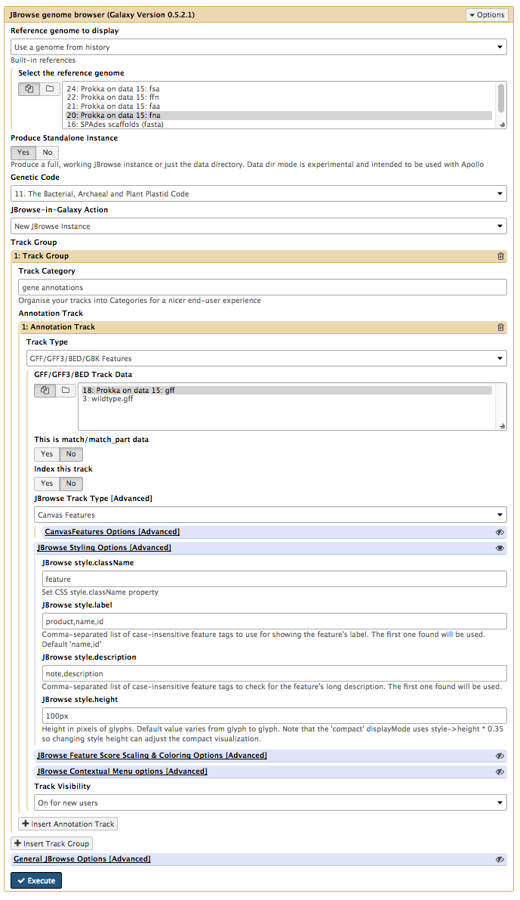
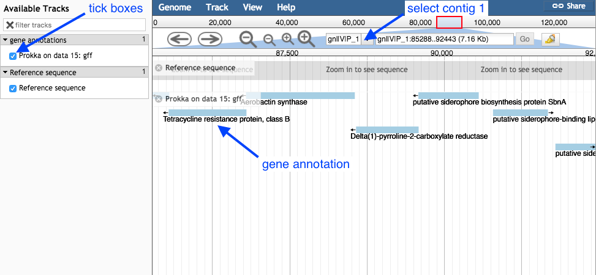

# Introduction
{:.no_toc}

In this section we will use a software tool called Prokka to annotate a draft genome sequence. Prokka is a “wrapper”; it collects together several pieces of software (from various authors), and so avoids “re-inventing the wheel”.

Prokka finds and annotates features (both protein coding regions and RNA genes, i.e. tRNA, rRNA) present on on a sequence. Note, Prokka uses a two-step process for the annotation of protein coding regions: first, protein coding regions on the genome are identified using [Prodigal](http://prodigal.ornl.gov/); second, the *function* of the encoded protein is predicted by similarity to proteins in one of many protein or protein domain databases. Prokka is a software tool that can be used to annotate bacterial, archaeal and viral genomes quickly, generating standard output files in GenBank, EMBL and gff formats. More information about Prokka can be found [here](https://github.com/tseemann/prokka).

> ### Agenda
>
> In this tutorial, we will deal with:
>
> 1. TOC
> {:toc}
>
{: .agenda}

## Import the data

Prokka requires assembled contigs.

> ###  Hands-on: Obtaining our data
>
> 1. Make sure you have an empty analysis history. Give it a name.
>
>    > ###  Starting a new history
>    >
>    > * Click the **gear icon** at the top of the history panel
>    > * Select the option **Create New** from the menu
>    {: .tip}
>
> 2. **Import Sample Data.** The data for this course may be available from a shared library in Galaxy
> (ask your instructor). If this is not the case, you can upload it yourself.
> - Option 1: From data library:
>   - Navigate to the shared data library, you should find a file called `contigs.fasta`
> - Option 2: From your computer:
>   - Obtain data directly from Zenodo: 
>   - Download `contigs.fasta`
>   - Upload the file to your history.
>   
>
{: .hands_on}

## Annotate the genome

Now we will run the tool called Prokka.

> ###  Hands-on: Annotate genome
>
> 1. **Prokka**  with the following parameters (leave everything else unchanged)
>    - contigs to annotate: `contigs.fasta`
>    - Locus tag prefix (--locustag): P
>    - Force GenBank/ENA/DDJB compliance (--compliant): No
>    - Sequencing Centre ID (--centre): V
>    - Genus Name: Staphylococcus  
>    - Species Name: aureus  
>    - Use genus-specific BLAST database: No  
>    - Your tool interface should look like this:
>    - 
>    - Click Execute
>   
{: .hands_on}

## Examine the output

Once Prokka has finished, examine each of its output files.

> ###  Hands-on: output files
>
> - The GFF and GBK files contain all of the information about the features annotated (in different formats.)
> - The .txt file contains a summary of the number of features annotated.
> - The .faa file contains the protein sequences of the genes annotated.
> - The .ffn file contains the nucleotide sequences of the genes annotated.
>   
{: .hands_on}

## View annotated features in JBrowse

Now that we have annotated the draft genome sequence, we would like to view the sequence in the JBrowse genome viewer. First, we have to make a JBrowse file. Then, we can view it within Galaxy.

> ###  Hands-on: Visualize annotation
>
> 1. **JBrowse**  with the following parameters
> - Under Reference genome to display choose *Use a genome from history*.
> - Under Select the reference genome choose Prokka on data XX:fna. This .fna sequence is the fasta nucleotide sequence, and will be the reference against which annotations are displayed.
> - For Produce a Standalone Instance select *Yes*.
> - For Genetic Code choose *11: The Bacterial, Archaeal and Plant Plastid Code*.
> - Under JBrowse-in-Galaxy Action choose *New JBrowse Instance*.
> - Click Insert Track Group
> - Under Track Category type in *gene annotations*.
> - Click Insert Annotation Track
> - For Track Type choose *GFF/GFF3/BED/GBK Features*
> - For GFF/GFF3/BED Track Data select Prokka on data XX:gff  [Note: not wildtype.gff]
> - Under JBrowse Track Type[Advanced] select *Canvas Features*.
> - Click on JBrowse Styling Options <Advanced]
> - Under JBrowse style.label add in *product*.
> - Under Track Visibility choose *On for new users*.
> - Your tool interface should look like this:
>
> - Click Execute
>   
{: .hands_on}

A new file will be created, called JBrowse on data XX and data XX - Complete. Click on the eye icon next to the file name. The JBrowse window will appear in the centre Galaxy panel.

> ###  Hands-on: Investigate the JBrowse file
>- Under Available Tracks on the left, tick the box for Prokka on data XX:gff.
> - Select contig 1 in the drop down box. You can only see one contig displayed at a time.
> 
>   
>   
> - Use the plus and minus buttons to zoom in and out, and the arrows to move left or right (or click and drag within the window to move left or right).
>   
> - Zoom in to see the reference sequence at the top.
>   
> - JBrowse displays the sequence and a 6-frame amino acid translation.
> Zoomed in view:
>   
> 
> - Right click on a gene/feature annotation (the bars on the annotation track), then select View Details to see more information.
    - gene name
    - product name
    - you can download the FASTA sequence by clicking on the disk icon.
>   
{: .hands_on}
