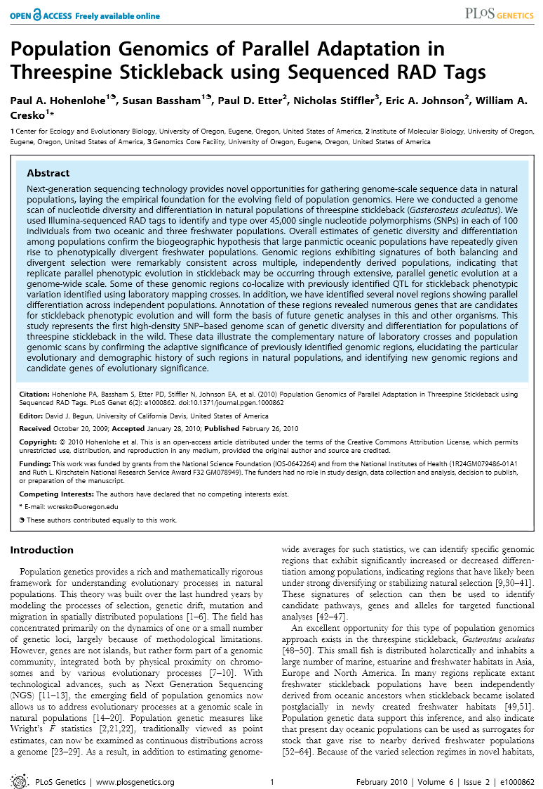
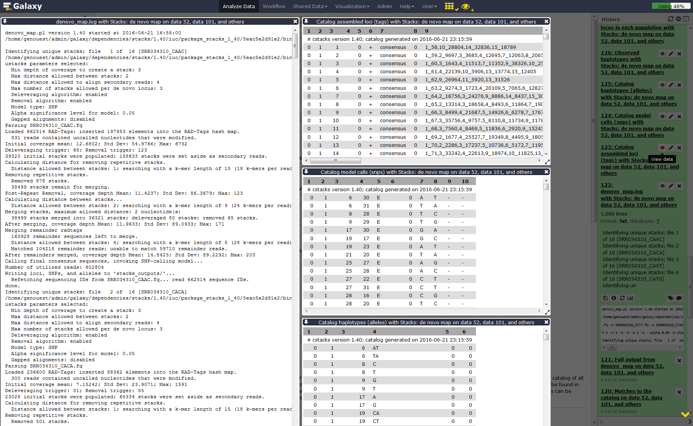
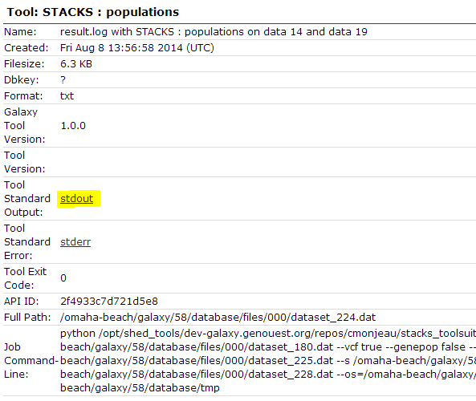
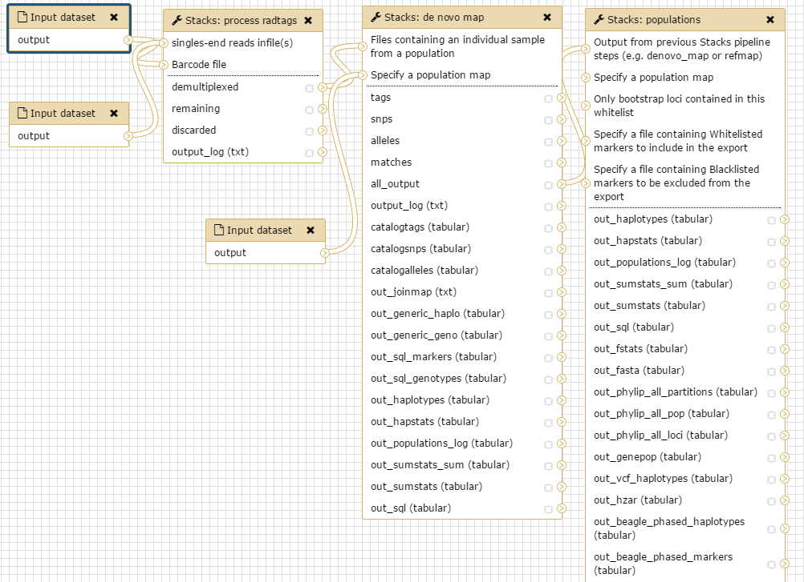

# Introduction
{:.no_toc}

In the study of [Hohenlohe *et al.* 2010](http://journals.plos.org/plosgenetics/article?id=10.1371/journal.pgen.1000862), a genome scan of nucleotide diversity and differentiation in natural populations of threespine stickleback *Gasterosteus aculeatus* was conducted. Authors used Illumina-sequenced RAD tags to identify and type over 45,000 single nucleotide polymorphisms (SNPs) in each of 100 individuals from two oceanic and three freshwater populations.



We here proposed to re-analyze these data at least until the population genomics statistics calculation step using STACKS pipeline. Existing *Gasterosteus aculeatus* draft genome will not be used here so the analysis will be performed de novo. In a de novo RAD-seq data analysis, the reads are aligned one on each other to create stacks and then clustered to build loci. A reference approach can also be conducted (see [ref_based tutorial]({{site.baseurl}}/topics/sequence-analysis/tutorials/ref-based-rad-seq/tutorial.html), allowing to work on existing assembled loci).


> ### Agenda
>
> In this tutorial, we will deal with:
>
> 1. TOC
> {:toc}
>
{: .agenda}

# Pretreatments

## Data upload

The original data is available at NCBI SRA ENA under accession number [SRR034310](https://trace.ncbi.nlm.nih.gov/Traces/sra/?run=SRR034310) as part of the NCBI SRA ENA study accession number [SRP001747](https://trace.ncbi.nlm.nih.gov/Traces/sra/?study=SRP001747).

We will look at the first run SRR034310 out of seven which includes 16 samples from 2 populations, 8 from Bear Paw (freshwater) and 8 from Rabbit Slough (oceanic). We will download the reads directly from SRA and the remaining data (i.e reference genome, population map file, and barcodes file) from [Zenodo](https://zenodo.org/record/1134547#.WkugUjfjJXI).

> ###  Hands-on: Data upload
>
> 1. Create a **new history** for this RAD-seq exercise. If you are not inspired, you can name it *STACKS RAD: population genomics without reference genome* for example...
>    
>
> 2. **EBI SRA**  with the following parameters:
>    - Select the Run from the results of the search for `SRR034310` (which will present you 1 Experiment (SRX015877) and 1 Run (SRR034310)).
>    - Click the link in the column **FASTQ files (Galaxy)** of the results table
>    - This will redirect to the Galaxy website and start the download.
>
> 3. Upload remaining training data from Zenodo:
>    ```
>    https://zenodo.org/record/1134547/files/Barcode_SRR034310.txt
>    https://zenodo.org/record/1134547/files/Details_Barcode_Population_SRR034310.txt
>    ```
>
>    
>
> 4. Make sure your fasta files are of datatype `fastqsanger`
>
>    
>
{: .hands_on}

The sequences are raw sequences from the sequencing machine, without any pretreatments. They need to be demultiplexed. To do so, we can use the Process Radtags tool from STACKS.

## Demultiplexing reads

For demultiplexing, we use the Process Radtags tool from [STACKS](https://www.g3journal.org/content/1/3/171.full) .

> ###  Hands-on: Demultiplexing reads
>
> 1. **Process Radtags**  to demultiplex the reads:
>  - *"Single-end or paired-end reads files"*: `Single-end files`
>  - *"singles-end reads infile(s)"*: `SRR034310.fastq(.gz)`
>  - *"Barcode file"*: `Barcodes_SRR034310.tabular`
>  - *"Number of enzymes"*: `One`
>  - *"Enzyme"*: `sbfI`
>  - *"Capture discarded reads to a file*": `Yes`
>  - *"Output format:"* `fastq`
>
>    > ###  Questions
>    >
>    > 1. How many reads where on the original dataset?
>    > 2. How many are kept?
>    > 3. Can you try to explain the reason why we loose a lot of reads here?
>    > 4. What kind of information does this result give concerning the upcoming data analysis and the barcodes design in general?
>    >
>    > > ###  Solution
>    > > The informations can be found in the results log file:
>    > >
>    > >  1. 8895289 total reads
>    > >  2. 8139531 retained reads
>    > >  3. There are no sequences filtered because of low quality. This is because radtags didn't apply quality related filtering since the corresponding advanced option (Discard reads with low quality scores) has not been enabled. So here, all not retained sequences are removed because of an ambiguous barcode (`626265`) or an ambiguous RAD-Tag (`129493`). This means that some barcodes are not exactly what was specified on the barcode file and that sometimes, no SbfI restriction enzyme site was found. This can be due to some sequencing problems but here, this is also due to the addition, in the original sequencing library, of RAD-seq samples from another study. This strategy is often used to avoid having too much sequences beginning with the exact same nucleotide sequence which may cause Illumina related issues during sequencing and cluster analysis
>    > >  4. Sequencing quality is essential! Each time your sequencing quality decreases, you loose data and thus essential biological information!
>    > >
>    > > In addition to the overall statistics the numbers of retained and removed reads are also given for each bar code sequence.
>    > {: .solution}
>    {: .question}
>
>    Next we will play around with the parameters a bit, to see the impact they have on the results.
>
> 2. **Process Radtags** : Re-Run playing with parameters
>    - Section **Advanced**
>      - *"Discard reads with low quality scores"*: `Yes`
>      - *"score limit"*: `20` (for example; play with this)
>      - *"Set the size of the sliding window as a fraction of the read length, between 0 and 1"*: `0.30` (for example; play with this)
>
> This sliding window parameter allows notably the user to deal with the declining quality at the 3' end of reads.
>
{: .hands_on}

> ###  Hands-on
>
> You can use the `Charts` functionality through the Visualize button reachable on the `Radtags logs` file you just generated.
>
> If like me you don't have payed attention to the organization of you file for the graphical representation you obtain a non optimal bars diagram with a not intelligent X-axis ordering. There is a lot of different manner to fix this. You can use a copy/paste "bidouille" or you can use Galaxy tools to manipulate the `radtags logs` file to generate a better graph. For example, you can use `Select lines that match an expression` tool to select rows then use the `Concatenate datasets tail-to-head` tool to reorganize these lines in a new file.
> Then we generate a graphical display of the changes:
>
> First we cut the interesting lines of each `result.log with Stacks: process radtags`
>
> 1. **Select lines that match an expression** applying `^R1.fq.gz` on the log files and then
> 2. **Replace Text in entire line** on the resulting data sets finding `R1.fq.gz` and replacing with `NoScoreLimit` or `Score10` or `Score20` depending of the case
> 3. **Select lines that match an expression** applying `File\tRetained Reads` on one of the log file to obtain you futur header
> 4. **Replace Text in entire line** on the resulting data set finding `File` and replacing with `#` to have a best display
> 5. **Concatenate datasets tail-to-head** on the resulting data sets stating from the header you just created
> 6. Finally **Convert delimiters to TAB** on the resulting data set converting all Tabs to be sure having a well formatted tabular file at the end
>
> Alternatively just copy/paste these lines on the Galaxy upload tool using Paste/fetch data section and modifying the File header by sample and filename by Score 10 / Score 20 and Lowquality for example... Before Starting the upload, you can select the `Convert spaces to tabs` option through the `Upload configuration` wheel. If you did not pay attention to the order you can just sort the file using the first column.
{: .hands_on}

You can use the `Charts` functionality through the Visualize button to plot the data.

And you obtain a file like this one, ready to generate a beautiful and smart bar stacked!

```
#		Retained Reads	Low Quality	Ambiguous Barcodes	Ambiguous RAD-Tag	Total
NoScoreLimit	8139531		0		626265			129493			8895289
Score10		7373160		766371		626265			129493			8895289
Score20		2980543		5158988		626265			129493			8895289
```

{:width="50%"}

You can further test using a filter like `clean data, remove any read with an uncalled base` and see that here, this has only little impact on the number of retained reads.

The demultiplexed sequences are raw sequences from the sequencing machine, without any pretreatments. They need to be controlled for their quality.

We propose to continue the tutorial using the dataset collection containing the demultiplexed reads obtained with Process Radtag execution made with a quality score of 10 and with the `Discard reads with low quality scores` parameter set to Yes (so containing 7373160 retained reads).

## Quality control

For quality control, we use similar tools as described in [NGS-QC tutorial]({{site.baseurl}}/topics/sequence-analysis/tutorials/quality-control/tutorial.html): [FastQC](https://www.bioinformatics.babraham.ac.uk/projects/fastqc/).

> ###  Hands-on: Quality control
>
> 1. **FastQC** : Run FastQC on FastQ files to control the quality of the reads. Warning! Don't forget you are working on data collections....
>
>    > ###  Questions
>    >
>    > 1. What is the read length?
>    >
>    > > ###  Solution
>    > > The read length is 32 bp
>    > {: .solution }
>    {: .question}
>
> 2. **MultiQC** : Run MultiQC on FastQC results to better see quality information over samples.
{: .hands_on}


# SNP calling from radtags

Run `Stacks: De novo map` Galaxy tool. This program will run ustacks, cstacks, and sstacks on the members of the population, accounting for the alignments of each read.

> ###  Comment
>
> Information on denovo_map.pl and its parameters can be found online: https://creskolab.uoregon.edu/stacks/comp/denovo_map.php.
{: .comment}


> ###  Hands-on: Stacks: De novo map
>
> 1. First we will create a population map file with the following contents:
>
>    ```
>    sample_CCCC	1
>    sample_CCAA	1
>    sample_CCTT	1
>    sample_CCGG	1
>    sample_CACA	1
>    sample_CAAC	1
>    sample_CATG	1
>    sample_CAGT	1
>    sample_CTCT	2
>    sample_CTAG	2
>    sample_CTTC	2
>    sample_CTGA	2
>    sample_GGGG	2
>    sample_GGAA	2
>    sample_GGTT	2
>    sample_GGCC	2
>    ```
>    
>
> 2. **Stacks: De novo map** : with the following parameters:
>    - *"Select your usage"*: `Population`
>    - *"Files containing an individual sample from a population"*: `The demultiplexed reads (collection)`
>    - *"Specify a population map"*: `the population map you just created`
>    - Section **Assembly options**
>      - *"Minimum number of identical raw reads required to create a stack"*: `3`
>      - *"Number of mismatches allowed between loci when building the catalog"*: `3`
>      - *"Remove, or break up, highly repetitive RAD-Tags in the ustacks program"*: `Yes`
>
> 3. Once Stacks has completed running, investigate the output files: `result.log` and `catalog.` (snps, alleles and tags).
>
>    
>
> > ###  Tip: data formatting
> >
> > If you are using a file presenting population information and individual name in a different manner than expected by STACKS, you can use Galaxy tools like `Replace Text` (for example to replace `Rabbit Slough` by a population number like `2`, `Add column` (for example to add `sample_`) or `Cut columns from a table` (to put the new `sample_` column af the first place) and finally `Regex replace` (replacing `(sample_)\t` by `\1`) to generate it...
>    {: .tip}
>
>
{: .hands_on}

# Calculate population genomics statistics

> ###  Hands-on: Calculate population genomics statistics
>
> 1. **Stacks: populations**  with the following parameters:
>    - Section **Data filtering options**
>      - *"Minimum percentage of individuals in a population required to process a locus for that population"*: `0.75`
>    - Section **Output options** (VCF and Structure) and enabling SNP and haplotype-based F statistics calculation.
>      - *"Output results in Variant Call Format (VCF)"*: `Yes`
>      - *"Output results in Structure Format"*: `Yes`
>    - *"Enable SNP and haplotype-based F statistics"*: `Yes`
>
>    
>
> 2. Now look at the output in the file `batch_1.sumstats` nammed `SNP and Haplotype-based F statistics with Stacks: populations ...` on your history. There are a large number of statistics calculated at each SNP, so use Galaxy tools like filter, cut, and sort to focus on some.
>
> > ###  Question
> >
> > 1. What is the maximum value of FST' at any SNP? Don't hesitate to look at the [STACKS manual](http://catchenlab.life.illinois.edu/stacks/manual/#files) to find where this parameter is
> > 2. What is the meaning of this FST' value compared a a classical FST one? Once again, the [STACKS manual](http://catchenlab.life.illinois.edu/stacks/manual/#files) can help you ;)
> > 3. How many SNPs reach this FST' value?
> >
> > > ###  Solution
> > > 1. 1
> > > 2. FST’ is a haplotype measure of FST that is scaled to the theoretical maximum FST value at this locus. Depending on how many haplotypes there are, it may not be possible to reach an FST of 1, so this method will scale the value to 1
> > > 2. 114
> > {: .solution }
> {: .question}
{: .hands_on}
> You can now for xample filter this dataset to only keep FST'=1 loci for further analysis...

# Conclusion
{:.no_toc}

In this tutorial, we have analyzed real RAD sequencing data to extract useful information, such as which loci are candidate regarding the genetic differentiation between freshwater and oceanic Stickelback populations. To answer these questions, we analyzed RAD sequence datasets using a de novo RAD-seq data analysis approach. This approach can be sum up with the following scheme:



