# Introduction
{:.no_toc}

Original description is reachable on a [dedicated page of the official STACKS website](http://catchenlab.life.illinois.edu/stacks/tut_gar.php). Writers describe that they developed a genetic map in the spotted gar and present here data from a single linkage group. The gar genetic map is an F1 pseudotest cross between two parents and 94 of their F1 progeny. They took the markers that appeared in one of the linkage groups and worked backwards to provide the raw reads from all of the stacks contributing to that linkage group.

We here proposed to re-analyze these data at least until genotypes determination. Data are already clean so you don't have to demultiplex it using barcode information through `Process Radtags tool`.

> ### Agenda
>
> In this tutorial, we will deal with:
>
> 1. TOC
> {:toc}
>
{: .agenda}

# Pretreatments

## Data upload

The original data is available at [STACKS website](https://creskolab.uoregon.edu/stacks/tutorial/stacks_samples.tar.gz) and the subset used here is findable on [CeSGO hub](https://cesgo.genouest.org/resources/370/supportingdocs).

> ###  Hands-on: Data upload
>
> 1. Create a new history for this RAD-seq exercise. If you are not inspired, you can name it "STACKS 1.42 RAD: genetic map" for example...
> 2. Import Fasta files from parents and 20 progenies.
>
>    > ###  Comments
>    > If you are using the [GenOuest Galaxy instance](https://galaxy.genouest.org), you can load the dataset using 'Shared Data' -> 'Data Libraries' -> '1 Galaxy teaching folder' -> 'EnginesOn' -> 'RADseq' -> 'Genetic map'
>
>    > ###  Tip: Importing data via links
>    >
>    > * Copy the link location
>    > * Open the Galaxy Upload Manager
>    > * Select **Paste/Fetch Data**
>    > * Paste the following links into the text field
>    >     * https://cesgo.genouest.org/resources/375/download/female.fa
>    >     * https://cesgo.genouest.org/resources/376/download/male.fa
>    >     * https://cesgo.genouest.org/resources/377/download/progeny_1.fa
>    >     * https://cesgo.genouest.org/resources/378/download/progeny_2.fa
>    >     * https://cesgo.genouest.org/resources/379/download/progeny_3.fa
>    >     * https://cesgo.genouest.org/resources/380/download/progeny_4.fa
>    >     * https://cesgo.genouest.org/resources/381/download/progeny_5.fa
>    >     * https://cesgo.genouest.org/resources/382/download/progeny_6.fa
>    >     * https://cesgo.genouest.org/resources/383/download/progeny_7.fa
>    >     * https://cesgo.genouest.org/resources/384/download/progeny_8.fa
>    >     * https://cesgo.genouest.org/resources/385/download/progeny_9.fa
>    >     * https://cesgo.genouest.org/resources/386/download/progeny_10.fa
>    >     * https://cesgo.genouest.org/resources/387/download/progeny_11.fa
>    >     * https://cesgo.genouest.org/resources/388/download/progeny_12.fa
>    >     * https://cesgo.genouest.org/resources/389/download/progeny_13.fa
>    >     * https://cesgo.genouest.org/resources/390/download/progeny_14.fa
>    >     * https://cesgo.genouest.org/resources/391/download/progeny_15.fa
>    >     * https://cesgo.genouest.org/resources/392/download/progeny_16.fa
>    >     * https://cesgo.genouest.org/resources/393/download/progeny_17.fa
>    >     * https://cesgo.genouest.org/resources/394/download/progeny_18.fa
>    >     * https://cesgo.genouest.org/resources/395/download/progeny_19.fa
>    >     * https://cesgo.genouest.org/resources/417/download/progeny_20.fa
>    > * Press **Start**  
>
>    As default, Galaxy takes the link as name. It also do not link the dataset to a database or a reference genome.
>

# Building loci using STACKS

Run `Stacks: De novo map` Galaxy tool. This program will run `ustacks`, `cstacks`, and `sstacks` on each individual, accounting for the alignments of each read.

> ###  Comment
>
> Information on `denovo_map.pl` and its parameters can be found online: https://creskolab.uoregon.edu/stacks/comp/denovo_map.php.

> **Stacks: De novo map** : Run Stacks selecting the Genetic map usage. Specify each parent as a sample in the appropriate box, then each of the 20 progenies and specify a CP Cross type, 3 for the Minimum number of identical raw reads required to create a stack, 3 for minimum number of identical raw reads required to create a stack in 'progeny' individuals, 3 for the number of mismatches allowed between loci when building the catalog and activate the option "remove, or break up, highly repetitive RAD-Tags in the ustacks program".
>
>    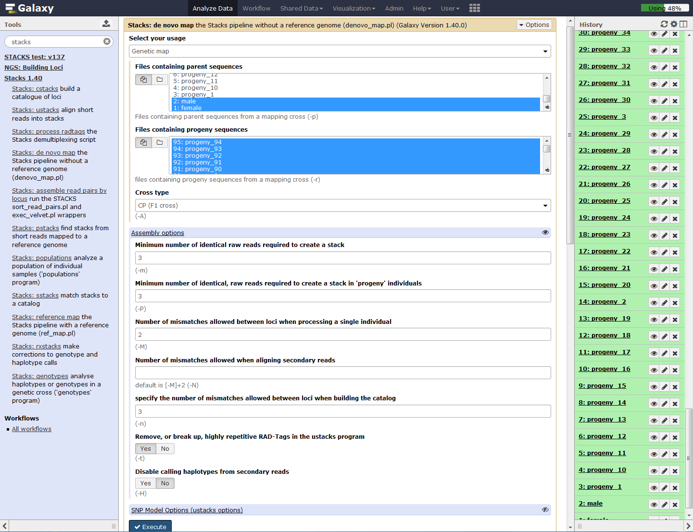

>    Once Stacks has completed running, you will see 5 new data collections and 8 datasets.
>
>    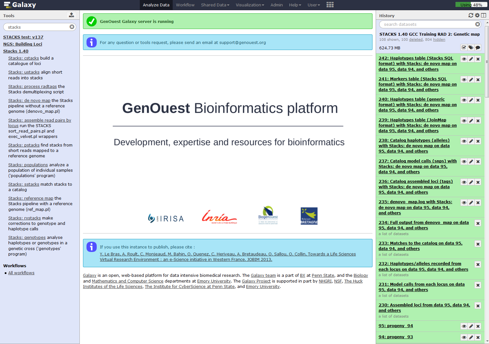
>
>    Investigate the output files: `result.log` and `catalog.*` (snps, alleles and tags).
>
>    Looking at the first file, `denovo_map.log`, you can see the command line used and the start as end execution time.
>
>    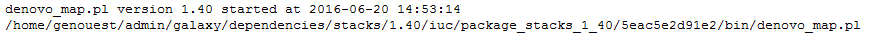
>
>    Then are the different STACKS steps:
>
>    `ustacks`
>
>    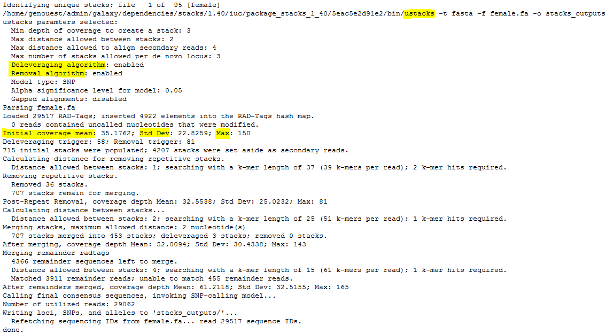
>
>    `cstacks`
>
>    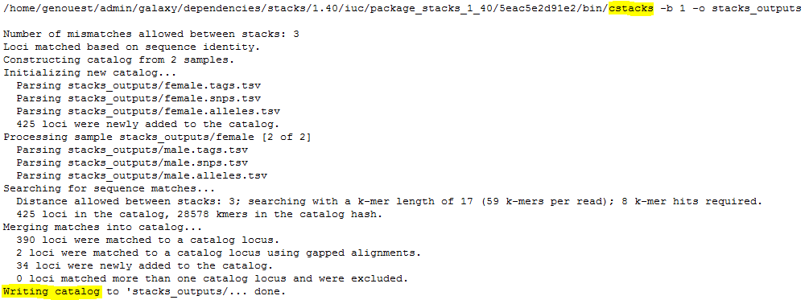
>
>
>    > ###  Question
>    >
>    > 1. Can you identify the meanning of the number 425?
>    > 2. Looking at the catalog.tags file, identify specific and shared loci from each individual. Count nuber of catalog loci coming from the first individual, from the second and thus find on both parents.
>    >
>    >    

>    >    
Click to view answers

>    >    <ol type="1">
>    >    <li> Here, the catalog is made with 459 tags, 425 coming from the "reference individual", here female. Some of these 425 can be shared with the other parent.</li>
>    >    <li>3500</li>
>    >    </ol>
>    >    

>
>    `sstacks`
>
>    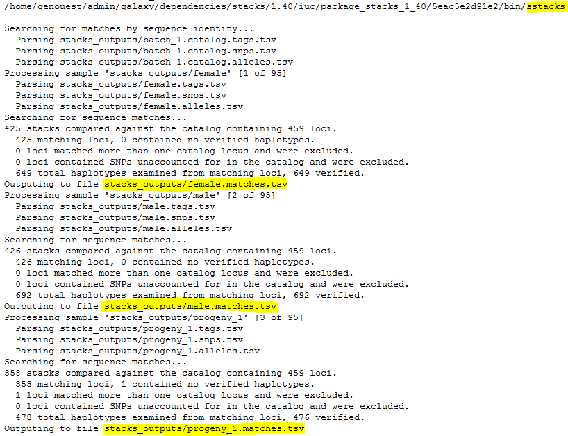
>
>
>    Endly, `genotypes` is executed. It search for markers identified on the parents and the associate progenies haplotypes. If the first parent have a GA (ex: aatggtgtGgtccctcgtAc) and AC (ex: aatggtgtAgtccctcgtCc) haplotypes, and the second parent only a GA (ex: aatggtgtGgtccctcgtAc) haplotype, STACKS declare a ab/aa marker for this locus. Genotypes program then associate GA to a and AC to b and then scan progeny to determine which haplotype is found on each of them.
>
>    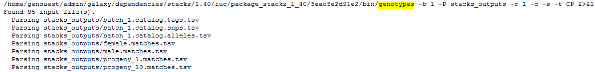
>
>
>    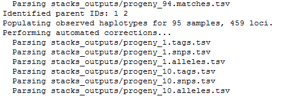
>
>
>    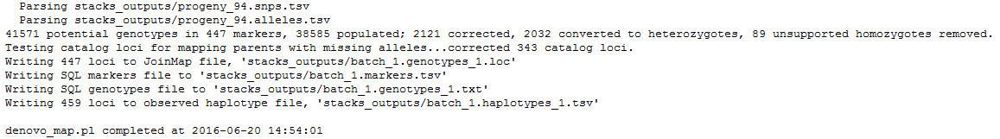
>
>    Finally, 447 loci, markers, are kept to generate the `batch_1.genotypess_1.tsv` file. 459 loci are stored on the observed haplotype file `batch_1.haplotypes_1.tsv`.
>

### Matches files
>
>    Here are `sample1.snps` (left) and `sample2.snps` (right)
>
>    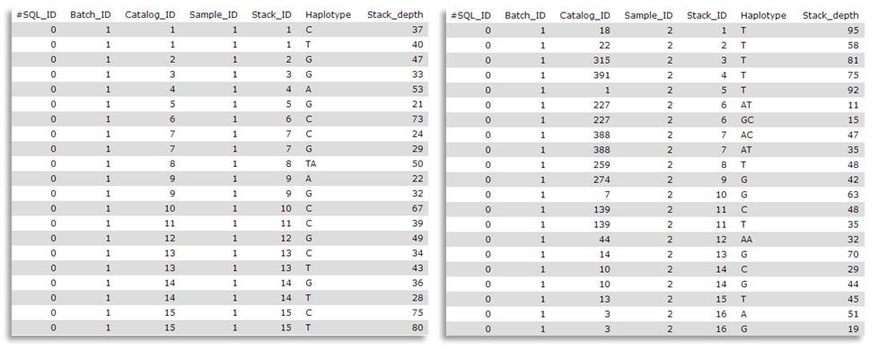
>
>    Catalog_ID (= catalog Stacks_ID) is composed by the `Stack_ID` from the "reference" individual, here sample1, but number is different from sample2 `Stack_ID`. Thus, in the `catalog.alleles.tsv`, the `Stack_ID` numbered 3 correspond to the `Stack_ID` number 16 from sample2!
>
>    Here you can observe matches files (you maybe have to change the tsv datatype into a tabular one to display correctly the datasets).
>
>    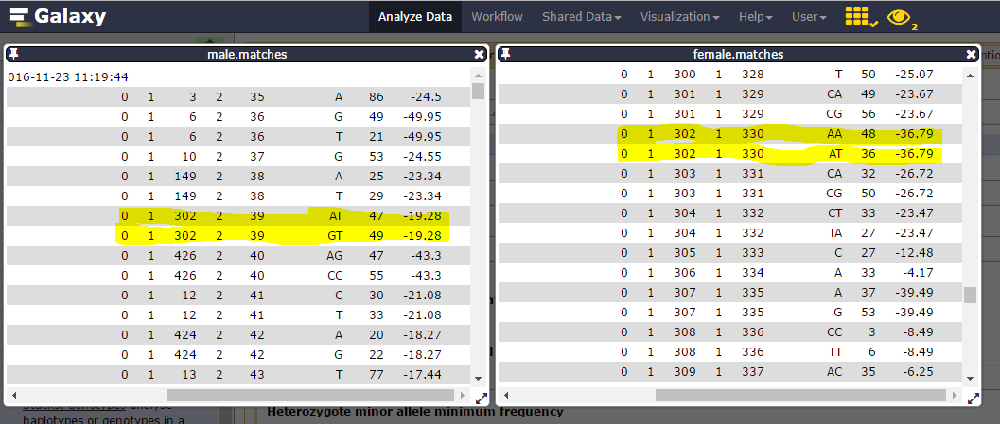
>
>    Considering catalog SNPs 27 & 28, on the 302 catalog locus:
>
>    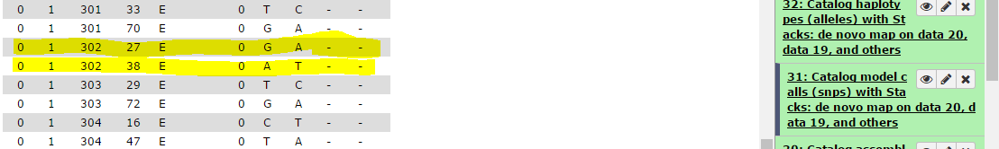
>
>   and corresponding catalog haplotypes, 3 on the 4 possible (AA, AT, GT but no GA):
>
>    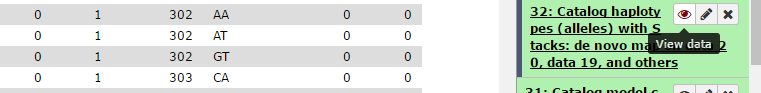
>
>    heterozygoty is observed on each parent (one ab, the other ac) and we have 19 genotypes on the 22 individuals.
>
>    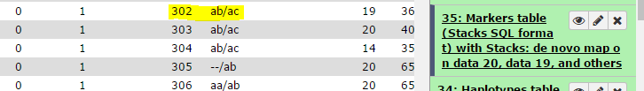
>
>    We then can see that Stack_ID 330 for female correspond to the 39 for male:
>
>
>    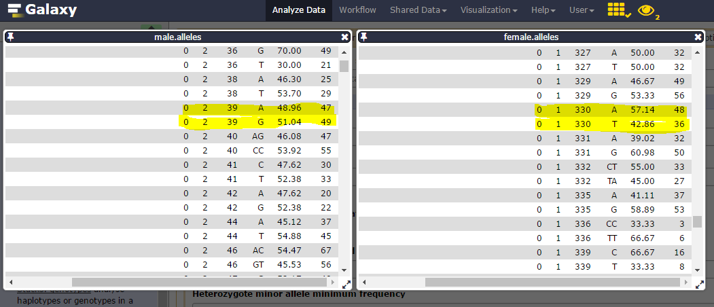
>

# Genotypes determination
> **Stacks: genotypes** : Re-Run the last step of `Stacks: De novo map` pipeline specifying more options as:
>    > 1. The genetic map type (ie F1, F2 (left figure, F1xF1), Double Haploid, Back Cross (F1xF0), Cross Pollination (right figure, F1 or F2 but resulting from the croos of pure homozygous parents))
>    >
>    >    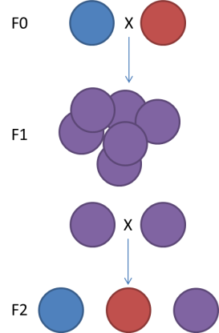    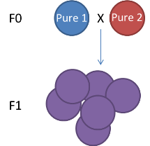
>    >
>    >
>    > 2. Genotyping informations export format for input in genetic mapper tools (ie JoinMap, R/qtl, ...). To be notice that R/qtl format for an F2 cross type can be an input for MapMaker or Carthagene.
>    >
>    > 3. Tresholds concernaing a minimal number of progeny and/or minimum stacks depth to consider a locus
>    >
>    > 4. Automatic corrections. Concerning this last option, it's possible to to ask genotypes making automatic corrections on some errors as homozygous tags verification in the progeny to be sure a SNP is missing. Thus, if SNP detection model can't identify a site as heterygous or homozygous, this site is temporarily tagged as homozygous to facilitate the search, by sstacks, of concordance with the loci catalog. If a second allele is detected on the catalog (ie, in parents) is found on a progeny with a weak frequency (<10% of a stack reads number), genotypes program can correct the genotype. Additionally, it will delete a homozygous genotype on a particular individual if locus genotype is supported by less than 5 reads. Thus corrected genotypes are marked uppercase.
>
>    Here is an example of a locus originally marke as homozygous before automatic correction because on allele is supported by less than 5 reads. After correction, this locus is marked as heterygous.
>
>    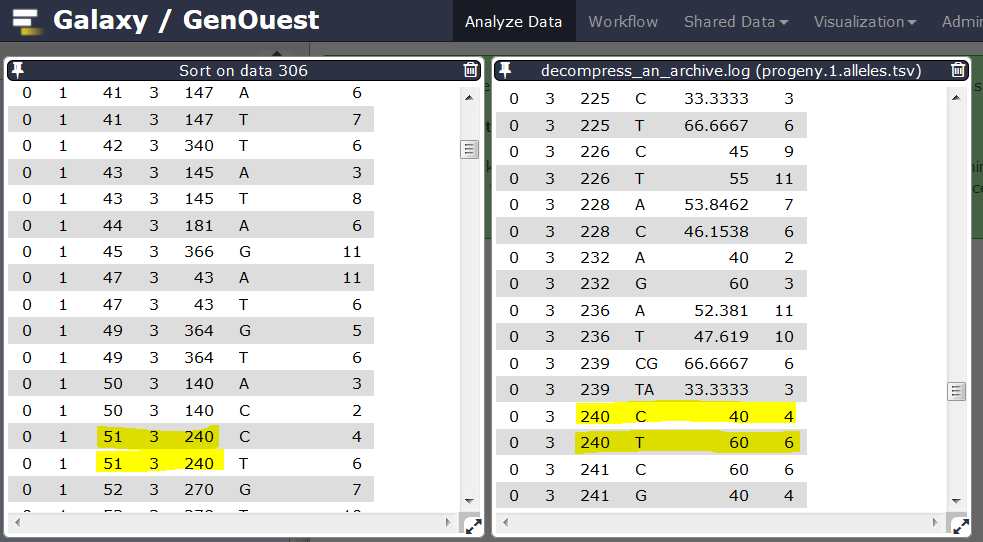
>
>    You can re-run **Stacks: genotypes** : program modifying the number of genotyped progeny to consider a marker and thus be more or less stringent. Compare results.
>
### Genotypes.tsv files
>
>    One line by locus, one column by individual (aa, ab, AB if automatic correction applied, bb, bc, ...) with observed genotype for each locus:
>
>    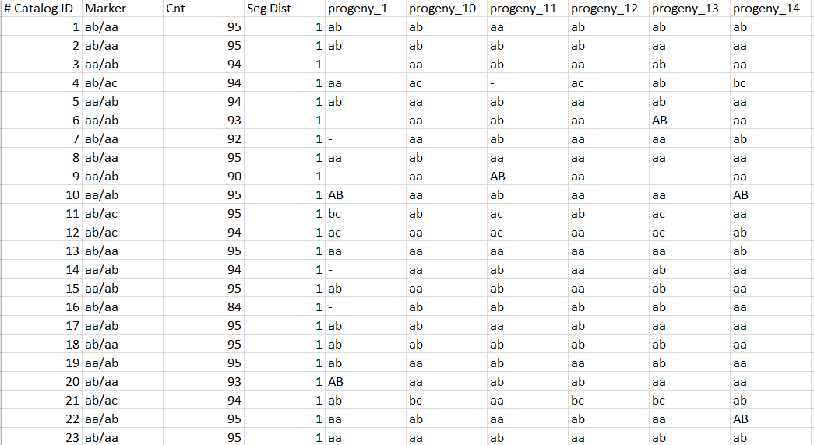
>
### Genotypes.txt files
>
>    One line by individual, and for each individual, for each catalog locus, genotype:
>
>    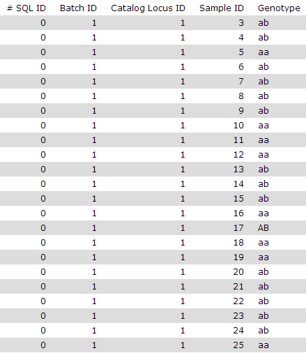
>
### Haplotypes.tsv files
>
>    One line by locus, one column by individual (aa, ab, AB if automatic correction applied, bb, bc, ...) with observed genotype for each locus:
>
>    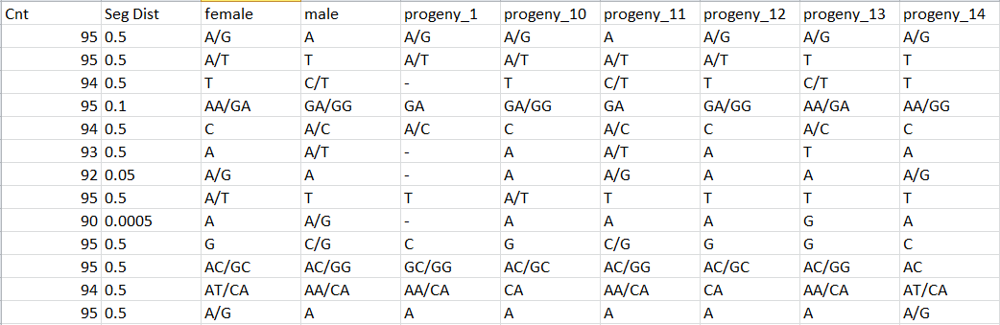

>
>    > ###  Question
>    >
>    > 1. The use of the deleverage algorithm allows to not consider loci obtained from merging more than 3 stacks. Why 3 if biologically, you are waiting something related to 2 for diploid organisms?
>    > 2. Re-execute **Stacks: De novo map** pipeline modifying the p-value treshold for the SNP model. What is the difference regarding to unverified haplotypes ?
>    >
>    >    

>    >    
Click to view answers

>    >    <ol type="1">
>    >    <li>This value of 3 is important to use if we don't want to blacklist loci for whom 99.9% of individuals have one and/or the alt allele and 0.01% have a third one, resulting of a sequencing error.</li>
>    >    <li>We see a moficiation of the number of unverified haplotypes</li>
>    >    </ol>
>    >    

# Conclusion
{:.no_toc}

In this tutorial, we have analyzed real RAD sequencing data to extract useful information, such as genotypes and haplotypes to generate input files for downstream genetic map creation. This approach can be sum up with the following scheme:

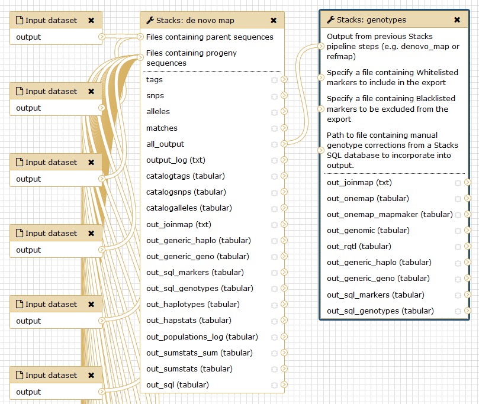
