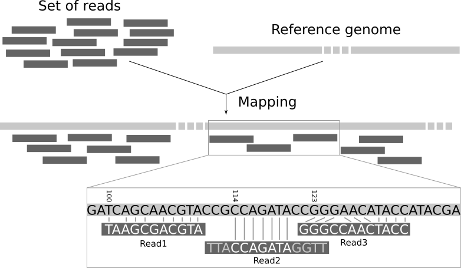

# Introduction
{:.no_toc}

Sequencing produces a collection of sequences without genomic context. We do not know to which part of the genome the sequences correspond to. Mapping the reads of an experiment to a reference genome is a key step in modern genomic data analysis. With the mapping the reads are assigned to a specific location in the genome and insights like the expression level of genes can be gained.

The short reads do not come with position information, so we do not know what part of the genome they came from. We need to use the sequence of the read itself to find the corresponding region in the reference sequence. But the reference sequence can be quite long (~3 billion bases for human), making it a daunting task to find a matching region. Since our reads are short, there may be several, equally likely places in the reference sequence from which they could have been read. This is especially true for repetitive regions.

In principle, we could do a BLAST analysis to figure out where the sequenced pieces fit best in the known genome. We would need to do that for each of the millions of reads in our sequencing data. Aligning millions of short sequences this way may, however, take a couple of weeks. And we do not really care about the exact base to base correspondence (alignment). What we are really interested in is "where these reads came from". This approach is called **mapping**.

In the following we will process a dataset with the mapper **Bowtie2** and we will visualize the data with the program **IGV**.

> ### Agenda
>
> In this tutorial, we will deal with:
>
> 1. TOC
> {:toc}
>
{: .agenda}

# Prepare the data

> ###  Hands-on: Data upload
>
> 1. Create a new history for this tutorial and give it a proper name
>
>    
>    
>
> 2. Import `wt_H3K4me3_read1.fastq.gz` and `wt_H3K4me3_read2.fastq.gz` from [Zenodo](https://zenodo.org/record/1324070) or from the data library (ask your instructor)
>
>    ```
>    https://zenodo.org/record/1324070/files/wt_H3K4me3_read1.fastq.gz
>    https://zenodo.org/record/1324070/files/wt_H3K4me3_read2.fastq.gz
>    ```
>
>    
>    
>
>    As default, Galaxy takes the link as name, so rename them.
>
> 3. Rename the files to `reads_1` and `reads_2`
>
>    
>
{: .hands_on}

We just imported in Galaxy FASTQ files corresponding to paired-end data as we could get directly from a sequencing facility.

During sequencing, errors are introduced, such as incorrect nucleotides being called. Sequencing errors might bias the analysis and can lead to a misinterpretation of the data. The first step for any type of sequencing data is to check their quality.

> ###  Check the Quality control tutorial
> The [quality control](../quality-control/tutorial.html) tutorial is explaining this step. We will not going into the details here, in particular for the parameters.
{: .comment}

> ###  Hands-on: Quality control
> 1. **FastQC**  on both datasets
> 2. **MultiQC**  on the outputs of **FastQC** 
> 3. **Trim Galore!**  on the paired-end datasets
{: .hands_on}

# Map reads on a reference genome

Read mapping is the process to align the reads on a reference genomes. A mapper takes as input a reference genome and a set of reads. Its aim is to align each read in the set of reads on the reference genome, allowing mismatches, indels and clipping of some short fragments on the two ends of the reads:



We need a reference genome to map the reads on.



Currently, there are over 60 different mappers, and their number is growing. In this tutorial, we will use [Bowtie2](http://bowtie-bio.sourceforge.net/bowtie2/), a fast and memory-efficient open-source tool particularly good at aligning sequencing reads of about 50 up to 1,000s of bases to relatively long genomes.

> ###  Hands-on: Mapping with Bowtie2
> 1. **Bowtie2**  with the following parameters
>    - *"Is this single or paired library"*: `Paired-end`
>       -  *"FASTA/Q file #1"*: `trimmed reads pair 1` (output of **Trim Galore!** )
>       -  *"FASTA/Q file #2"*: `trimmed reads pair 2` (output of **Trim Galore!** )
>       - *"Do you want to set paired-end options?"*: `No`
>
>           You should have a look at the parameters there, specially the mate orientation if you know it. They can improve the quality of the paired-end mapping.
>
>     - *"Will you select a reference genome from your history or use a built-in index?"*: `Use a built-in genome index`
>       - *"Select reference genome"*: `Mouse (Mus musculus): mm10`
>     - *"Select analysis mode"*: `Default setting only`
>
>         You should have a look at the non default parameters and try to understand them. They can have an impact on the mapping and improving it.
>
>     - *"Save the bowtie2 mapping statistics to the history"*: `Yes`
>
> 2. Inspect the `mapping stats` file by clicking on the  (eye) icon
>
>    > ###  Questions
>    >
>    > 1. What information is provided here?
>    > 2. How many reads have been mapped exactly 1 time?
>    > 3. How many reads have been mapped more than 1 time? How is it possible? What should we do with them?
>    > 4. How many pair of reads have not been mapped? What are the causes?
>    >
>    > > ###  Solution
>    > > 1. The information given here is a quantity one. We can see how many sequences are aligned. It does not tell us something about the quality.
>    > > 2. ~90% reads have been aligned exactly 1 time
>    > > 3. ~7% reads have been aligned concordantly >1 times. These are called multi-mapped reads. It can happen because of repetitions in the reference genome (multiple copies of a gene for example), specially when the reads are small. It is difficult to decide where these sequences come from so most pipelines ignores them. Always check the statistics there to be sure of not removing to much information by discarding them in any downstream analyses.
>    > > 4. ~3% pair of reads have not been mapped because
>    > >     - both reads in the pair aligned but their positions do not concord with pair of reads (`aligned discordantly 1 time`)
>    > >     - reads of these pairs are multi-mapped (`aligned >1 times` in `pairs aligned 0 times concordantly or discordantly`)
>    > >     - one read of these paires are mapped but not the paired read (`aligned exactly 1 time` in `pairs aligned 0 times concordantly or discordantly`)
>    > >     - the rest are not mapped at all
>    >  {: .solution }
>    {: .question}
>
{: .hands_on}

Checking the mapping statistics is an important step to do before continuing any analyses. There are several potential sources for errors in mapping, including (but not limited to):

- **Polymerase Chain Reaction (PCR) artifacts**: Many HTS methods involve one or multiple PCR steps. PCR errors will show as mismatches in the alignment, and especially errors in early PCR rounds will show up in multiple reads, falsely suggesting genetic variation in the sample. A related error would be PCR duplicates, where the same read pair occurs multiple times, skewing coverage calculations in the alignment.
- **Sequencing errors**: The sequencing machine can make an erroneous call, either for physical reasons (e.g. oil on an Illumina slide), or due to properties of the sequenced DNA (e.g., homopolymers). As sequencing errors are often random, they can be filtered out as singleton reads during variant calling.
- **Mapping errors**: The mapping algorithm can map a read to the wrong location in the reference. This often happens around repeats or other low-complexity regions.

So if the mapping statistics are not good, you should investigate the cause of these errors before going further in your analyses.

After that, you should have a look at the reads and inspect the BAM file where the read mappings are stored.

# Inspection of a BAM file



So the BAM file integrates many information for each read, in particular the quality of mapping.

> ###  Hands-on: Summary of mapping quality
> 1. **Stats generate statistics for BAM dataset**  with the following parameters
>    -  *"BAM file"*: `aligned reads` (output of **Bowtie2** )
>    - *"Use reference sequence"*: `Use reference`
>       - *"Choose a reference sequence for GC depth"*: `Locally cached`
>           - *"Using genome"*: `Mouse (Mus musculus): mm10 Full`
>
> 2. Inspect the  `Stats` file
>
>    > ###  Questions
>    >
>    > 1. Which proportion of mismatches are in the mapped reads when aligned to the reference genome?
>    > 2. What does the error rate represent?
>    > 3. What is the average quality? How is it represented?
>    > 4. What is the insert size average?
>    > 5. How many reads have a mapping quality score below 20?
>    >
>    > > ###  Solution
>    > > 1. There are ~21,900 mismatches for ~4,753,900 bases mapped so ~$$5 x 10^{-3}$$ mismatches per mapped bases
>    > > 2. The error rate is the proportion of mismatches per mapped bases, so the ratio computed right before
>    > > 3. The average quality is the mean quality score of the mapping. It is a Phred score, as the one used in the FASTQ file for each nucleotide. But here the score is not per nucleotide, but per read. And it represents the probability of mapping quality
>    > > 4. The insert size is the distance between the two reads in the pairs.
>    > > 5. To get the info:
>    > >      1. **Filter BAM datasets on a variety of attributes**  with a filter to keep only the reads with a mapping quality >= 20
>    > >      2. **Stats generate statistics for BAM dataset**  on the output of **Filter**
>    > >
>    > >    Before filtering: 95,412 reads - After filtering: 89,664 reads
>    >  {: .solution }
>    {: .question}
{: .hands_on}

# Visualization using a Genome Browser

The Integrative Genomics Viewer (IGV) is a high-performance visualization tool for interactive exploration of large, integrated genomic datasets. It supports a wide variety of data types, including array-based and next-generation sequence data, and genomic annotations. In the following we will use it to visualize the mapped reads.



# Conclusion
{:.no_toc}

After quality control, mapping is an important step of most analyses of sequencing data (RNA-Seq, ChIP-Seq, etc) to determine where in the genome our reads originated from and use this information for downstream analyses.
