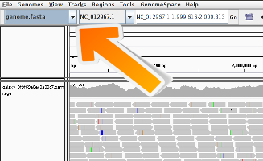

# Introduction to next generation sequencing data mapping
{:.no_toc}

To map DNA/RNA reads of an experiment to a reference genome is a key step in modern genomic data analysis. With the mapping the reads are assigned to a specific location in the genome and insights like the expression level of genes can be gained.
In the following we will process a dataset with a mapper, 'Bowtie2', and we will visualize the data with the software 'IGV'.

> ### Agenda
>
> In this tutorial, we will deal with:
>
> 1. TOC
> {:toc}
>
{: .agenda}

# Mapping
> ###  Hands-on: Mapping with Bowtie2
>
> We will process data inside Galaxy with Bowtie2 and have a look at the results.
>
> 1. Load the ['GSM461178_untreat_paired_subset_1.fastq'](https://zenodo.org/record/61771/files/GSM461178_untreat_paired_subset_1.fastq) dataset from [Zenodo](https://zenodo.org/record/61771) into Galaxy.
>    
>    > ###  Tip: Importing data via links
>    >
>    > * Copy the link location [right click on Zenodo -> Copy link location]
>    > * Open the Galaxy Upload Manager
>    > * Select **Paste/Fetch Data**
>    > * Paste the link into the text field
>    > * Press **Start**    
>    {: .tip}
>
>    > ###  Tip: Changing the file type `fastq` to `fastqsanger` once the data file is in your history
>    >
>    > * Click on the pencil button displayed in your dataset in the history
>    > * Choose **Datatype** on the top
>    > * Select `fastqsanger`
>    > * Press **save**
>    {: .tip}
>
> 2. **Bowtie2** : Search in the tool bar on the left the mapper 'bowtie2' and run the mapper with the dataset.
>
>    > ###  Tip: Search for tools
>    >
>    > * Clink into the search field on the left
>    > * Type **bowtie2**
>    > * Select **bowtie2**
>    > * Select the uploaded dataset as the fastq file
>    > * Choose as a reference genome human hg19
>    {: .tip}
>
> 3. Click on the right history panel on the Bowtie2 output. Look careful at the information which is given here:
>    
>           100000 reads; of these: 100000 (100.00%) were unpaired;
>           of these: 99407 (99.41%) aligned 0 times
>           149 (0.15%) aligned exactly 1 time
>           444 (0.44%) aligned >1 times
>           0.59% overall alignment rate
>
>
>    > ###  Questions
>    >
>    > - What information is provided here?
>    > - Is everything as expected?
>    > - Why is the mapping so bad?
>    >
>    >    

>    >    
Click to view answers

>    >    <ol type="1">
>    >    <li>The information given here is a quantity one. We can see how many sequences are aligned. It does not tell us something about the quality.</li>
>    >    <li>No, only 0.59% of all reads could be mapped.</li>
>    >    <li>We mapped against the wrong reference genome! </li>
>    >    </ol>
>    >    

>    {: .question}
>
>
> 10. **Bowtie2** : Rerun Bowtie2 with the correct reference genome 'Drosophila melanogaster' or short 'dm3'.
>
>       > ###  Comments
>       > - It is a good practice to give the datasets names that are easy to understand.
>       {: .comment}
>
{: .hands_on}

# Visualization

A general description of the user interface of the IGV browser can be read here: [IGV Browser description]({{site.baseurl}}/topics/introduction/tutorials/igv-introduction/tutorial.html)

> ###  Hands-on: Visualization with the IGV browser
>
>The Integrative Genomics Viewer (IGV) is a high-performance visualization tool for interactive exploration of large, integrated genomic datasets. It supports a wide variety of data types, including array-based and next-generation sequence data, and genomic annotations. In the following we will use it to visualize the computed mapping.
>
> 1. **IGV** : To display the result in IGV open the IGV browser local on your computer.
> 2. **Galaxy** : Click on the right history panel on the Bowtie2 item.
> 3. **Galaxy** : Choose in the history on the computed Bowtie2 results and click on 'local' at 'display with IGV'.
> 4. **IGV** : The BAM file should be opened in the IGV browser and the genome should be loaded automatically.
>
>       > ###  Tip: Get access to more genomes
>       >
>       >If the genome of your interest is not there check if its
>       >available via "More...". Is this is not the case you can add it manually via the menu
>       >"Genomes -> Load Genome from..."
>       >
>       > 
>       {: .tip}
> 5. **IGV** : The interesting part is at chromosome 4, position 86,761 to 87,907. Navigate to it.
> 6. **IGV** : There are two views:
>       - the aligned reads view
>       - the coverage view
>
>
>       > ###  Questions
>       >
>       > - What could it mean if a bar in the coverage view is colored?
>       > - What could be the reason that a read is white instead of grey?
>       > - How many reads are mapped at position chr4:87482?
>       >
>       >    

>       >    
Click to view answers

>       >    <ol type="1">
>       >    <li>If a nucleotide differs from the reference sequence in greater than 20% of quality weighted reads, IGV colors the bar in proportion to the read count of each base.</li>
>       >    <li>They have a mapping quality equal to zero. Interpretation of this mapping quality depends on the mapping aligner as some commonly used aligners use this convention to mark a read with multiple alignments. In such a case, the read also maps to another location with equally good placement. It is also possible the read could not be uniquely placed but the other placements do not necessarily give equally good quality hits.</li>
>       >    <li>There are seven reads. Six have the correct 'T', one read a 'G'.</li>
>       >    </ol>
>       >    

>       {: .question}
>
{: .hands_on}

> ###  Hands-on: Differences between a good and a bad mapping
>
> 1. **Galaxy** : To show you the difference between a good and a bad dataset we provided an additional dataset which will give you a bad mapping. Load the ['GSM461182_untreat_single_subset.fastq'](https://zenodo.org/record/61771/files/GSM461182_untreat_single_subset.fastq) dataset from [Zenodo](https://zenodo.org/record/61771) into Galaxy.
>
>    > ###  Comments
>    > If you are using the [Freiburg Galaxy instance](http://galaxy.uni-freiburg.de), you can load the dataset using 'Shared Data' -> 'Data Libraries' -> 'Galaxy Courses' -> 'RNA-Seq' -> 'fastq'
>    {: .comment}
>
> 2. **IGV** : Load the two mappings into IGV and compare them!
>
>       > ###  Questions
>       >
>       > - How IGV helps you to see that the second dataset is bad?
>       >
>       >    

>       >    
Click to view answers

>       >    <ol type="1">
>       >    <li>White/transparent reads indicate bad mapping quality. Second, IGV shows you the nucleotides in color if they are different in the reference genome.</li>
>       >    </ol>
>       >    

>       {: .question}
>
{: .hands_on}
