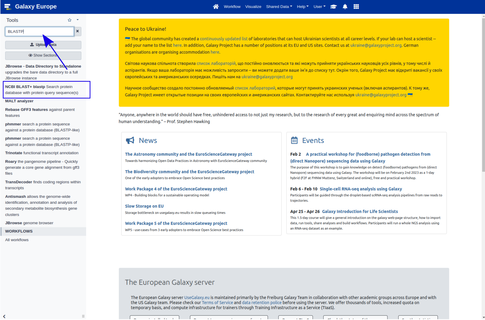
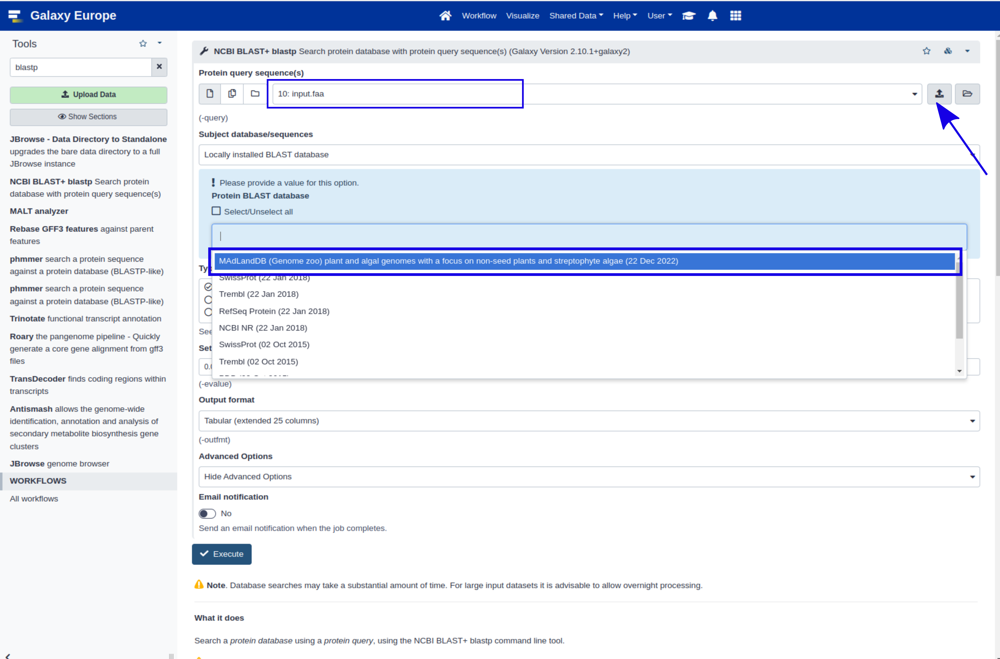

# Introduction

<!-- This is a comment. -->

MAdLand is a collection of fully sequenced plant and algal genomes with a focus on non-seed plants and streptophyte algae. It includes, for comparison, genomes of fungi, animals, SAR group, bacteria and archaea. It is developed and maintained by the [Rensing lab](http://plantco.de). The species are abbreviated by a 5 letter code, which consists of the first three letters of the genus and the first two of the species name, e.g. CHABR for Chara braunii. We add the gene ID to that and additional shortcuts, like whether it is plastome encoded (pt) or transcriptome-based (tr, in cases when no genome is available yet).

> <agenda-title></agenda-title>
>
> In this tutorial, we will cover:
>
> 1. TOC
> {:toc}
>
{: .agenda}

## Register your account on Galaxy 

If you are a first-time user of Galaxy, follow the [tutorial](https://training.galaxyproject.org/training-material/faqs/galaxy/account_create.html) to create an account and start using the Galaxy workspace.

## Search for NCBI Blast+ on Galaxy ##

After successfully logging in to the Galaxy server, go to the [Tools](https://usegalaxy.eu/) search bar at the top left corner and type in "BLASTP"; then, choose the NCBI BLAST+ blastp option as shown in the image below. for more details for BLAST analysis, we recommand you to follow the [Similarity-searches-blast](https://training.galaxyproject.org/training-material/topics/genome-annotation/tutorials/genome-annotation/tutorial.html#similarity-searches-blast) tutorial.

## Get data

> <hands-on-title> Data Upload </hands-on-title>
>
> 1.  As input file, upload the protein sequence(s) or choose from the history
> 2. Choose the protein BLAST database *MAdLandDB* 

## Sub-step with **NCBI BLAST+ blastp **

> <hands-on-title> Task description </hands-on-title>
>
> 1.  with the following parameters:
>    -  *"Protein query sequence(s)"*: `output` (Input dataset)
>    - *"Subject database/sequences"*: `Locally installed BLAST database`
>        - *"Protein BLAST database"*: `MAdLandDB`
>    - *"Output format"*: `Tabular (extended 25 columns)`
>    - *"Advanced Options"*: `Hide Advanced Options`
>
>    ***TODO***: *Check parameter descriptions*
>
>    ***TODO***: *Consider adding a comment or tip box*
>
>    > <comment-title> short description </comment-title>
>    >
>    > A comment about the tool or something else. This box can also be in the main text
>    {: .comment}
>
{: .hands_on}

***TODO***: *Consider adding a question to test the learners understanding of the previous exercise*

> <question-title></question-title>
>
> 1. Question1?
> 2. Question2?
>
> > <solution-title></solution-title>
> >
> > 1. Answer for question1
> > 2. Answer for question2
> >
> {: .solution}
>
{: .question}

## Sub-step with **NCBI BLAST+ blastx**

> <hands-on-title> Task description </hands-on-title>
>
> 1.  with the following parameters:
>    -  *"Nucleotide query sequence(s)"*: `output` (Input dataset)
>    - *"Subject database/sequences"*: `Locally installed BLAST database`
>        - *"Protein BLAST database"*: ``
>    - *"Output format"*: `Tabular (extended 25 columns)`
>    - *"Advanced Options"*: `Hide Advanced Options`
>
>    ***TODO***: *Check parameter descriptions*
>
>    ***TODO***: *Consider adding a comment or tip box*
>
>    > <comment-title> short description </comment-title>
>    >
>    > A comment about the tool or something else. This box can also be in the main text
>    {: .comment}
>
{: .hands_on}

***TODO***: *Consider adding a question to test the learners understanding of the previous exercise*

> <question-title></question-title>
>
> 1. Question1?
> 2. Question2?
>
> > <solution-title></solution-title>
> >
> > 1. Answer for question1
> > 2. Answer for question2
> >
> {: .solution}
>
{: .question}

## Re-arrange

To create the template, each step of the workflow had its own subsection.

***TODO***: *Re-arrange the generated subsections into sections or other subsections.
Consider merging some hands-on boxes to have a meaningful flow of the analyses*

# Conclusion

Sum up the tutorial and the key takeaways here. We encourage adding an overview image of the
pipeline used.