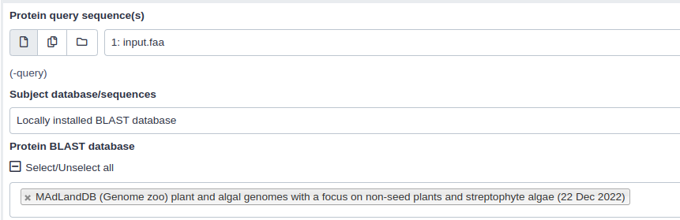

## Introduction

<!-- This is a comment. -->

MAdLandDB is a protein database comprising of a comprehensive collection of fully sequenced plant and algal genomes, with a particular emphasis on non-seed plants and streptophyte algae. Additionally, for comparative analysis, the database also includes genomes from various other organisms such as fungi, animals, the SAR group, bacteria, and archaea. The database is actively developed and maintained by the [Rensing lab](http://plantco.de), and employs a system of species abbreviation using a 5 letter code, which is constructed using the first three letters of the genus and the first two letters of the species name, for example, CHABR for Chara braunii. Furthermore, the database provides gene identification through the addition of gene ID's and supplementary information such as the encoding source of the gene, whether it is plastome encoded (pt) or transcriptome-based (tr) in cases when a genome is not yet available. The key advantage of this database is its non-redundant nature, and the fact that all sequences are predominantly from genome projects, thereby increasing their reliability.


> <agenda-title></agenda-title>
>
> In this tutorial, we will deal with:
>
> 1. TOC
> {:toc}
>
{: .agenda}

## Get data

> <hands-on-title> Data Upload </hands-on-title>
>
> 1. Create a new history for this tutorial and give it a proper name
>
>    
>    
>
> 2. Import the file `query.faa` from [Zenodo](https://doi.org/10.5281/zenodo.7524427) 
>
>    ```
>    https://zenodo.org/api/files/40445ead-6429-463c-bfa5-e1fb92095af8/query.faa
>    ```
>
>    
>   
>
{: .hands_on}

> We just imported a fasta file into Galaxy. Now, the next would be to perfrom the BLAST analysis against MAdLandDB. 

## Perform NCBI Blast+ on Galaxy

>   Since MAdLandDB is the collection of protein sequences, You can perform [BLASTp](https://usegalaxy.eu/root?tool_id=toolshed.g2.bx.psu.edu/repos/devteam/ncbi_blast_plus/ncbi_blastp_wrapper/2.10.1+galaxy2) and [BLASTx](https://usegalaxy.eu/root?tool_id=toolshed.g2.bx.psu.edu/repos/devteam/ncbi_blast_plus/ncbi_blastx_wrapper/2.10.1+galaxy2) tools.

> <hands-on-title> Similarity search against MAdLand Database </hands-on-title>
>
> 1.  OR  with the following parameters:
>    - _"Protein query sequence(s)"_: `Amino acid input sequence` (In case of BLASTp) *OR* 
>    - _"Translated nucleotide query sequence(s)"_: `Translated nucleotide input sequence` (In case of BLASTx) 
>    - _"Subject database/sequences"_: `Locally installed BLAST database`
>    - _"Protein BLAST database"_: `MadLandDB (Genome zoo) plant and algal genomes with a focus on non-seed plants and streptophyte algae (22 Dec 2022)`
>    - _"Set expectation value cutoff"_: `0.001`
>    - _"Output format"_:
>    - In _"Output Options"_: `Tabular (extended 25 columns)` 

>
{: .hands_on}

## Blast output

>  The BLAST output will be in tabular format (you can select the desired output format from the drop down menu) and include the following fields : 

>

<table>
  <tr>
    <th>Column</th>
    <th>NCBI name</th>
    <th>Description</th>
  </tr>
  <tr>
    <td>1</td>
    <td>qseqid</td>
    <td>Query Seq-id (ID of your sequence)</td>
  </tr>
  <tr>
    <td>2</td>
    <td>sseqid</td>
    <td>Subject Seq-id (ID of the database hit)</td>
  </tr>
   <tr>
    <td>3</td>
    <td>pident</td>
    <td>Percentage of identical matches</td>
  </tr>
   <tr>
    <td>4</td>
    <td>length</td>
    <td>Alignment length</td>
  </tr>
   <tr>
    <td>5</td>
    <td>mismatch</td>
    <td>Number of mismatches</td>
  </tr>
   <tr>
    <td>6</td>
    <td>gapopen</td>
    <td>Number of gap openings</td>
  </tr>
   <tr>
    <td>7</td>
    <td>qstart</td>
    <td>Start of alignment in query</td>
  </tr>
   <tr>
    <td>8</td>
    <td>qend</td>
    <td>End of alignment in query</td>
  </tr>
   <tr>
    <td>9</td>
    <td>sstart</td>
    <td>Start of alignment in subject (database hit)</td>
  </tr>
   <tr>
    <td>10</td>
    <td>send</td>
    <td>End of alignment in subject (database hit)</td>
  </tr>
    <tr>
    <td>11</td>
    <td>evalue</td>
    <td>Expectation value (E-value)</td>
  </tr>
    <tr>
    <td>12</td>
    <td>bitscore</td>
    <td>Bit score</td>
  </tr>
</table>

> The fields are separated by tabs, and each row represents a single hit. For more details for BLAST analysis and output, we recommand you to follow the [Similarity-searches-blast](https://training.galaxyproject.org/training-material/topics/genome-annotation/tutorials/genome-annotation/tutorial.html#similarity-searches-blast) tutorial.

> <details-title>Further Reading about BLAST Tools in Galaxy</details-title>
>
>
> Cock et al. (2015): [NCBI BLAST+ integrated into Galaxy](http://biorxiv.org/content/early/2015/05/04/014043.full-text.pdf+html)
>
> Cock et al. (2013): [Galaxy tools and workflows for sequence analysis with applications in molecular plant pathology](https://peerj.com/articles/167/)
> {: .details}
