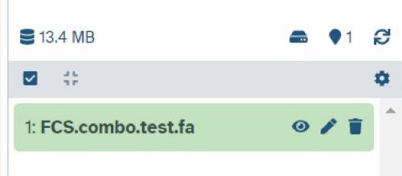
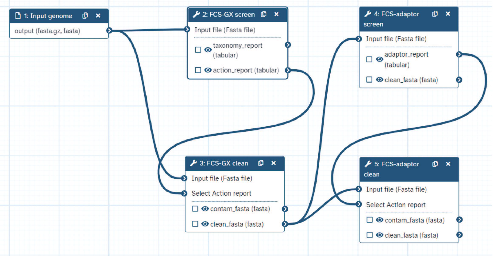

The National Center for Biotechnology Information (NCBI) performs contamination screening of genome assemblies submitted to the archival GenBank. Advances in genome sequencing have accelerated the production of genome assemblies and their submission to public databases, necessitating high-performance screening tools. Since contaminants can lead to misleading conclusions about the biology of the organism in question (e.g. gene content, gene evolution, etc.), ideally contamination screening should be performed after the initial contig assembly and prior to downstream genome analyses. 

NCBI has released a publicly-available Foreign Contamination Screen (FCS) tool suite to detect contaminants from various sources and produce a cleaned sequence set. This tutorial provides a quick example of two current FCS tools: FCS-adaptor identifies synthetic sequences used in library preparation, and FCS-GX () identifies sequences from foreign organisms assigned to discordant taxonomies compared to the user-declared source organism.


> <agenda-title></agenda-title>
>
> In this tutorial, we will cover:
>
> 1. TOC
> {:toc}
>
{: .agenda}

# Retrieving the data

FCS operates on assembled genome sequences and is not intended for use on raw reads. The following tutorial uses an assembled genome from yeast (*Saccharomyces cerevisiae*) with contaminants artificially inserted into the genome. The first step is to retrieve the genome FASTA. 

## Upload the genome FASTA from Zenodo

The following steps provide instructions to upload the test dataset into your Galaxy instance.
> <hands-on-title> Data Upload </hands-on-title>
>
> 1. Create a new history for this tutorial
>
>    
>
> 1. Copy the datasets URLs into clipboard.
>    Click on the copy button in the right upper corner of the box below.
>    ```
>    https://zenodo.org/records/10932013/files/FCS_combo_test.fa
>    ```
>
> 1. Upload `fasta.gz` dataset into Galaxy
>
>    
>
>    
>
{: .hands_on}

## Confirm dataset upload

Your data should look like this:



# Importing Workflows

Next we will import a Galaxy workflow - a chain of tools to perform a set of operations on a user-supplied input. Specificially in this workflow, we will:

1. Screen the genome for foreign organism sequences using **FCS-GX** `screen` mode.
1. Produce a cleaned set of contigs using **FCS-GX** `clean` mode.
1. Screen the genome for synthetic sequences using **FCS-adaptor** and remove identified contaminants. 
1. Produce a final set of cleaned contigs using a second iteration of **FCS-GX** `clean` mode.



> <hands-on-title> Importing Galaxy Workflows </hands-on-title>
>
> 1. Ensure you are logged in to Galaxy
>
> 1. Import the workflow into Galaxy
>
>    
>
>    > <warning-title>Log in to Galaxy</warning-title>
>    > If the workflow failed to import, it is usually because you are not logged in.
>    {: .warning}
>
{: .hands_on}

Once the workflow is loaded, your workflow page should look like this:


# Contamination screening

## Running the NCBI FCS Workflow

Next you will run the Galaxy workflow. Here you will configure the parameters for the FCS run according to the target organism.

> <hands-on-title> Running the NBCI FCS Workflow </hands-on-title>
> 1. Collect inputs
>    1. Assembled genome in `fasta/fasta.gz` format
>    1. Taxonomic information for source organism
>
> 1. Launch the Workflow
>    1. Click the Workflow menu located in the top menu bar
>    1. Click the  button located in the NCBI Foreign Contamination Screen Workflow box
>    1. Click "Expand to full workflow form." 
>    1. In the  1: Input genome menu: 
>       -  *"Input file (Fasta file)"*: `1:FCS.combo.test.fa`
>    1. In the **2: FCS-GX screen** menu:
>       - Select the appropriate taxonomic division for **Taxonomy entry**:  **div** (`fung:budding yeasts` in this example). 
>       - Set the **Advanced Options**:  **Database location** to `/cvmfs/data.galaxyproject.org/byhand/ncbi_fcs_gx/all`
>    1. In the **4: FCS-adaptor screen** menu:
>       - Select the appropriate taxonomy for  **Choose the taxonomy** (`Eukaryotes` in this example).
>    1. Run the workflow
>    1. Take a coffee break! 
{: .hands_on}

## Interpreting FCS Output

Running NCBI FCS on Galaxy is dependent on loading a large reference database on an adequate host. Currently the database is not persistent, meaning run times may vary. Most runs *should* complete in around one hour.

After the workflow is completed, you will be able to visualize tables of identified contaminants and can access FASTA files of clean sequences separated from contaminants.

> <hands-on-title> Reviewing FCS Contamination Reports </hands-on-title>
> 1. Look at the FCS-GX contamination report
>
>    1. In your Galaxy history, click the  icon for 3: **NCBI FCS GX on data 1: Action report**
>    1. Confirm that the taxonomic division you specified for the workflow run appears in the metadata in the first row of the file. It should appear as the "asserted-div" and in the list of "inferred-primary-divs".
>
>       > <warning-title> My organism's division is not in inferred-primary-divs </warning-title>
>       > If your target organism division is not in the set of inferred-primary-divs, it means that the assembly is likely heavily contaminated. FCS-GX will still call contaminants with respect to the taxonomy you define as the target organism (i.e. the primary division), but you should review the sequencing and assembly data for errors. 
>       {: .warning}
>
>    1. Review the contaminated sequence list, the suggested contamination cleanup actions, and the taxonomic divisions assigned to contaminants
>
>    > <question-title></question-title>
>    >
>    > 1. What are the major contaminants in this genome assembly?
>    > 2. When was this contamination likely introduced in the genome assembly process?
>    >
>    > > <solution-title></solution-title>
>    > >
>    > > 1. *Homo sapiens* (human) and *Pseudomonas aeruginosa*. Note that for various reasons the actual contaminating genus/species isn't reported as the top_tax_name.
>    > > 2. Contamination was likely introduced at the sample/library preparation stage. *Pseudomonas aeruginosa* can be found in multiple human tissues, including skin flora.
>    > {: .solution}
>    {: .question}
>
> 1. Look at the FCS-GX cleaned sequences
>
>    1. Click the box in your workflow history - 1: **FCS.combo.test.fa**. Note the total number of sequences.
>    1. Click the box in your workflow history - 4: **NCBI FCS GX on data 3 and data 1: Fasta for EXCLUDE entries**. Note the total number of sequences.
>    1. Click the box in your workflow history - 5: **NCBI FCS GX on data 3 and data 1: Cleaned Fasta**. Note the total number of sequences as well as Applied actions.
>    1. Confirm that Cleaned Fasta sequences (Step 5) = Total sequences (Step 1) - Contaminant sequences (Step 4)
>
> 1. Look at the FCS-adaptor contamination report
>
>    1. In your Galaxy history, click the  icon for 6: **NCBI FCS Adaptor on data 5: Adaptor report**
>    1. Review the contaminated sequence list, the suggested contamination cleanup actions, and the identity of adaptor/vector contaminants. Adaptor/vector sequences can be found on the [NCBI UniVec FTP](https://ftp.ncbi.nlm.nih.gov/pub/UniVec/UniVec) page.
>  
>    > <question-title></question-title>
>    >
>    > 1. What are the adaptor/vector contaminants in this genome assembly?
>    > 2. When was this contamination likely introduced in the genome assembly process?
>    >
>    > > <solution-title></solution-title>
>    > >
>    > > 1. Illumina PCR Primer sequence.
>    > > 2. Contamination was likely introduced during contig assembly or polishing. Often the initial contig assembly is generated using long reads alone, so the introduction of contamination via polishing with untrimmed reads is the more likely explanation.
>    > {: .solution}
>    {: .question}
>
> 1. Look at the FCS-adaptor cleaned sequences
>
>    1. Click the box in your workflow history - 5: **NCBI FCS GX on data 3 and data 1: Cleaned Fasta**. Note the total number of sequences.
>    1. Click the box in your workflow history - 8: **NCBI FCS GX on data 6 and data 5: Fasta for EXCLUDE entries**. Note the total number of sequences as well as Applied actions.
>    1. Click the box in your workflow history - 9: **NCBI FCS GX on data 6 and data 5: Cleaned Fasta**. Note the total number of sequences.
>
> > <warning-title> Two different cleaned FASTA files from FCS-adaptor step </warning-title>
> > FCS-adaptor only removes sequences that are completely/mostly adaptor (assigned `ACTION_EXCLUDE`) and adaptors near contig ends (assigned `ACTION_TRIM`). FCS-adaptor **does not remove** small internal trims in large sequences. In this example, the FASTA file in workflow history - 7: **NCBI FCS Adaptor on data 5: Cleaned Fasta** is the same as the uncleaned input FASTA. FCS-GX `clean` is required to handle these internal spans. The FASTA file in workflow history - 9: **NCBI FCS GX on data 6 and data 5: Cleaned Fasta** has the contigs seq_1 through seq_16 split into two separate contigs at the `ACTION_TRIM` sites. If you want to hardmask these regions instead, you must download the tabular adaptor report, convert `ACTION_TRIM` values to `FIX`, and run the FCS-GX `clean` tool separately.
> {: .warning}
{: .hands_on}

# Conclusion

In this example, we removed 200 contaminant sequences from non-target organisms using FCS-GX and removed 16 internal adaptor sequences using FCS-adaptor, producing a cleaned yeast genome. Following contamination detection, we can perform separate validation checks to support the removal of these sequences from our assembly. One example is to perform BLAST searches or NUCmer alignments against reference genomes of the same or closely related species.
