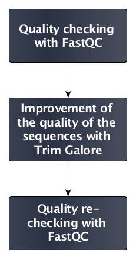

# Introduction
{:.no_toc}

During sequencing, errors are introduced, such as incorrect nucleotides being called. These are due to the technical limitations of each sequencing platform. Sequencing errors might bias the analysis, ultimately leading to a misinterpretation of the data. 

Sequence quality control is therefore an essential first step in your analysis. Catching errors early saves time later on.

> ### Agenda
>
> In this tutorial, we will deal with:
>
> 1. TOC
> {:toc}
>
{: .agenda}

# Importing sequences

> ###  Hands-on: Data upload
>
> 1. Create a new history
> 2. Import the FASTQ file: [`GSM461178_untreat_paired_subset_1`](https://zenodo.org/record/61771/files/GSM461178_untreat_paired_subset_1.fastq)
>
>    > ###  Tip: Importing data via links
>    >
>    > * Copy the link location
>    > * Open the Galaxy Upload Manager
>    > * Select **Paste/Fetch Data**
>    > * Paste the link into the text field
>    > * Press **Start**    
>    {: .tip}
>
>    > ###  Tip: Change the file type `fastq` to `fastqsanger` once the data file is in your history
>    >
>    > * Click on the pencil button displayed in your data file in the history
>    > * Choose **Datatype** on the top
>    > * Select `fastqsanger`
>    > * Press **save**
>    {: .tip}
>
>    > ###  Comments
>    >
>    > Rename the dataset to "First dataset"
>    {: .comment}
> By default, when data is imported via its link, Galaxy names it with its URL.
{: .hands_on}

# Quality check

To estimate sequence quality and how to filter raw data, different indicators can be checked:

- Quality score of the sequences with
    - Per-base sequence quality
    - Per-sequence quality scores
- Sequence content with
    - Per-base sequence content
    - Per-sequence GC content
    - Per-base N content
- Sequence length with the sequence length distribution
- Duplicated sequences
- Tag sequences with
    - Adapter contamination
    - K-mer content

[FastQC](https://www.bioinformatics.babraham.ac.uk/projects/fastqc/) is an open-source tool that provides a simple way to quality control raw sequence data. It removes reads with low quality scores, and generates graphics and estimates providing a quick overview about which data might be the source of bias in the analysis.

> ###  Hands-on: Quality check
>
> 1. **FastQC** : Run **FastQC Read Quality reports** on the imported FastQ file with default parameters
> 2. Inspect the FastQC report on its webpage output
>
>    > ###  Tip: Inspecting the content of a file in Galaxy
>    >
>    > * Click on the eye ("View data") on the right of the file name in the history
>    > * Inspect the content of the file on the middle
>    {: .tip}
>
>    > ###  Questions
>    >
>    > 1. How good are the quality scores?
>    > 2. Why is there a warning for the per-base sequence content and the per-sequence GC content graphs?
>    > 3. What needs to be done to improve the sequences?
>    >
>    > > ###  Solution
>    > > 1. The sequence scores are quite good: no warnings from FastQC, even if we can see a slight decrease of the quality at the end of the reads.
>    > > 2. In the beginning of sequences, the sequence content per base is not really good and the percentages are not equal. For the GC content, the distribution is slightly shifted on the left, and too high.
>    > > 3. We can trim the end of the sequences a little, but not too much as the sequences are already small.
>    > {: .solution }
>    {: .question}
{: .hands_on}

# Improvement of sequence quality

Based on the information provided by the quality graphs, the sequences should be treated to reduce bias in downstream analyis.

In general, quality treatments include:

- Filtering of sequences
    - with low mean quality score
    - too short
    - with too many ambiguous (N) bases
    - based on their GC content
- Cutting/Trimming/masking sequences
    - from low quality score regions
    - beginning/end of sequence
    - removing adapters

To improve the overall sequence quality, we use the [Trim Galore!](https://www.bioinformatics.babraham.ac.uk/projects/trim_galore/) tool. This tool enhances sequence quality by automating adapter trimming as well as quality control.

> ###  Hands-on: Improvement of sequence quality
>
> 1. **Trim Galore!** : Run **Trim Galore! Quality and adapter trimmer of reads** on the imported FastQ file
>
>    > ###  Questions
>    >
>    > Which parameters must be applied to follow the previous recommendations?
>    >
>    > > ###  Solution
>    > > We use the default ones:
>    > >
>    > > 1. If you know which adapter sequence was used during library preparation, provide its sequence. Otherwise use the option for automatic detection and trimming of adapter sequences.
>    > > 2. Trimming low-quality ends (below 20) from reads in addition to adapter removal
>    > > 3. Option for required overlap (in bp) with adapter sequence can be tweaked. The default value "1" is too stringent, and on average 25% of reads will be trimmed. Please set it to 5 bases to loosen the required overlap
>    > > 4. Removing reads shorter than 20 bp
>    > {: .solution }
>    {: .question}
>
> 2. **FastQC** : Re-run **FastQC Read Quality reports** on the quality controlled data, and inspect the new FastQC report
>
>    > ###  Questions
>    >
>    > 1. How many sequences have been removed?
>    > 2. Has sequence quality been improved?
>    > 3. Can you explain why the per-base sequence content is not good now?
>    >
>    > > ###  Solution
>    > > 1. Before Trim Galore, the dataset comprised 100,000 sequences. After Trim Galore, there are 99,653 sequences
>    > > 2. The per-base quality score looks better, but other indicators show bad values now. The sequence length distribution is not clear anymore because sequences have different size after the trimming operation
>    > > 3. The per-base sequence content has turned red. Again, the cause is the trimming of the end of some sequences
>    > {: .solution }
>    {: .question}
{: .hands_on}

The quality of the previous dataset was pretty good from beginning. The sequence quality treatment improved the quality score at the cost of other parameters.

# Impact of quality control

Now, we take a look at the impact of quality control and treatment on a bad dataset.

> ###  Hands-on: Impact of quality control
>
> 1. Create a new history
> 2. Import the FASTQ file: [`GSM461182_untreat_single_subset`](https://zenodo.org/record/61771/files/GSM461182_untreat_single_subset.fastq)
> 3. **FastQC** : Run **FastQC Read Quality reports** on the newly imported dataset
>
>    > ###  Questions
>    >
>    > 1. How good is this dataset?
>    > 2. What needs to be done to improve the sequences?
>    >
>    > > ###  Solution
>    > > 1. There is a red warning on the per-base sequence quality (pretty bad along the sequence but worse at the end of sequences), the per-base sequence content (bad at the beginning of the sequences), and the per-sequence GC content
>    > > 2. The end of sequences must be cut.
>    > > 3. Generally, the 5' end of each sequence read is not of bad quality unless something went wrong with the sequencng experiment itself. Here, the problem is that the sample was sequenced using the an Illumina sequencing machine, which carries out its calibration while reading fragments that are in the beginning of the flowcell. Unfortunately, the first 100k reads which we selected for the analysis are generated during the calibration, a problem that we don't have with more recent sequencing machines. However, if you adopted one of the latest sequencing machine and still experience bad quality bases at the beginning of the reads, please don't just trim them, but consider investigating the problem further.
>    > {: .solution }
>    {: .question}
>
> 4. **Trim Galore** : Run Run **Trim Galore! Quality and adapter trimmer of reads** on the new dataset to apply the decisions taken at the previous step
> 5. **FastQC** : Re-run **FastQC Read Quality reports** to check the impact of Trim Galore
>
>    > ###  Questions
>    >
>    > 1. How many sequences have been removed?
>    > 2. Has sequence quality been improved?
>    > 3. Can you explain why the per-base sequence content is not good now?
>    >
>    > > ###  Solution
>    > > 1. Before Trim Galore the dataset comprised 100,000 sequences. After Trim Galore, there are 97,644 sequences.
>    > > 2. The per-base quality score looks better (not red anymore), but the per-base sequence content, even if slightly better, is still red.
>    > {: .solution }
>    {: .question}
{: .hands_on}

# Conclusion
{:.no_toc}

In this tutorial we checked the quality of two datasets to ensure that their data looks good before inferring any further information. This step is the baseline for any pipeline analysis such as RNA-Seq, ChIP-Seq, or any other OMIC analysis relying on NGS data. Quality control steps are similar for any type of sequencing data:

