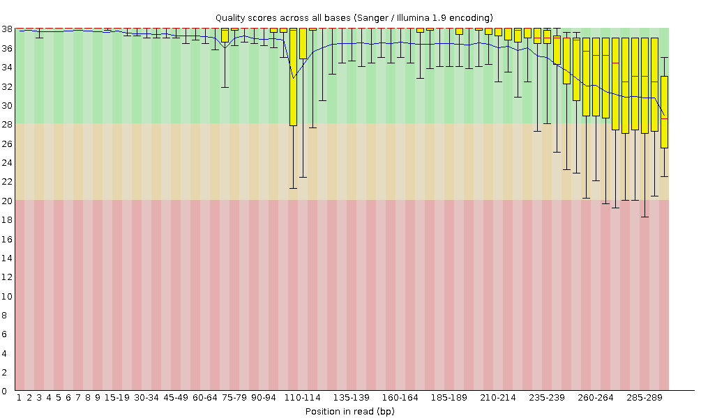
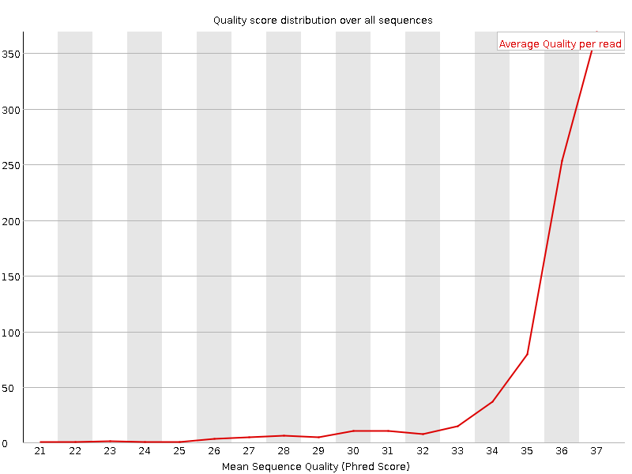
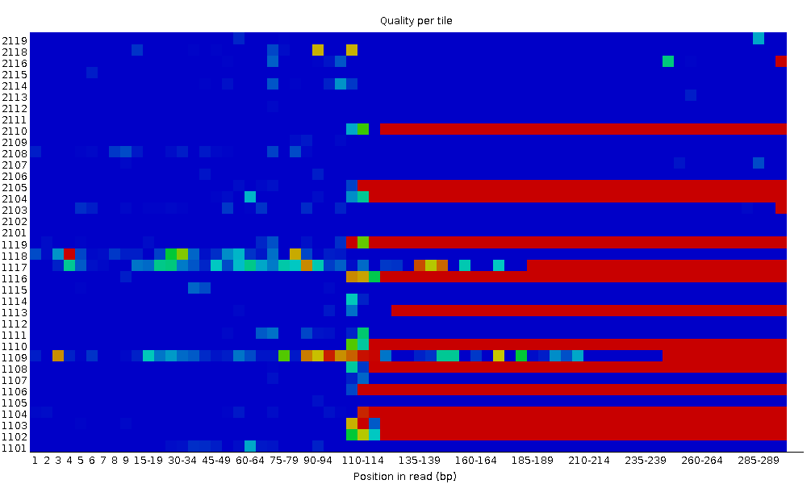
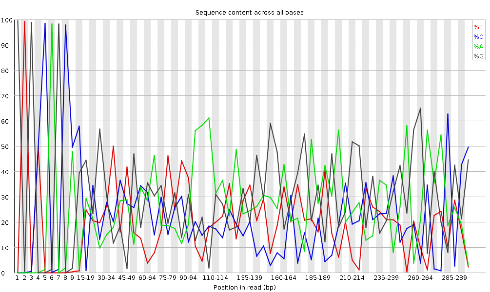
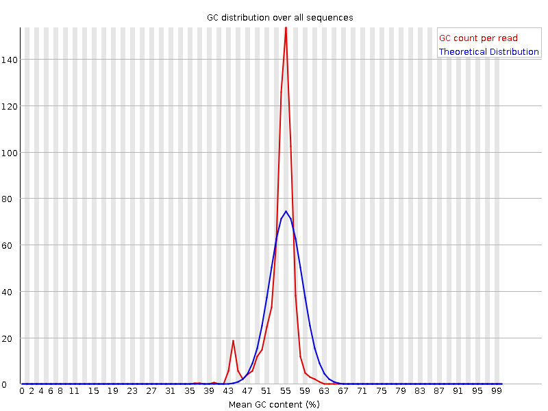
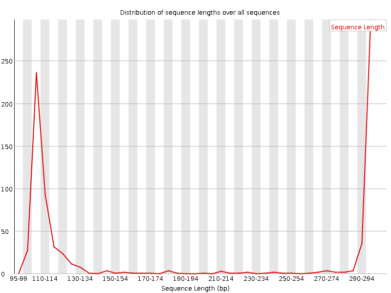
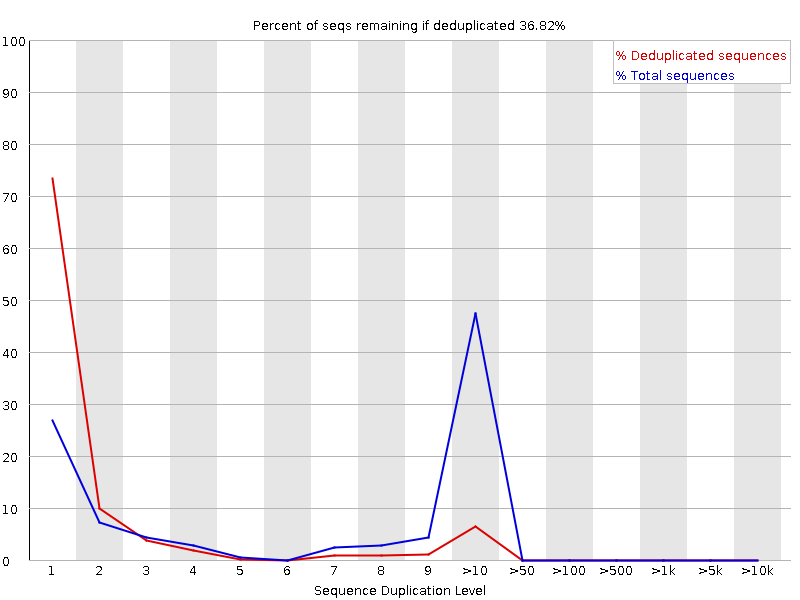
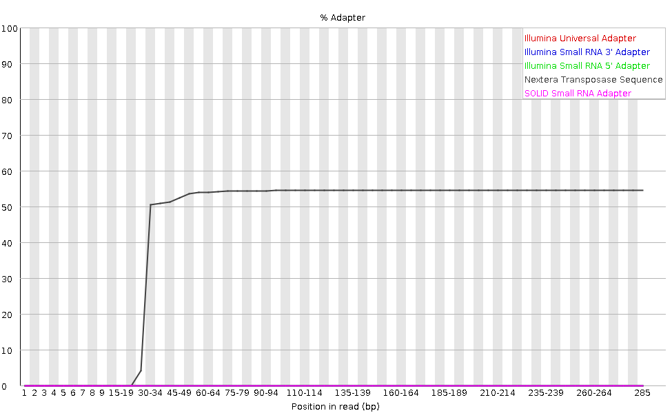

# Introduction
{:.no_toc}

During sequencing, the sequencer is sequencing each fragment of the library and generating a short sequence, also called a **read**: a succession of nucleotides.

Modern sequencing technologies can generate a massive number of sequence reads in a single experiment. However, no sequencing technology is perfect, and each instrument will generate different types and amounts of error, such as incorrect nucleotides being called. These are due to the technical limitations of each sequencing platform. 

Therefore, it is necessary to understand, identify and exclude error-types that may impact the interpretation of downstream analysis.
Sequence quality control is therefore an essential first step in your analysis. Catching errors early saves time later on.

> ### Agenda
>
> In this tutorial, we will deal with:
>
> 1. TOC
> {:toc}
>
{: .agenda}

# Inspect a raw sequence file

> ###  Hands-on: Data upload
>
> 1. Create a new history for this tutorial and give it a proper name
>
>    
>    
>
> 2. Import `GSM461178_untreat_paired_subset_1.fastq` from [Zenodo](https://zenodo.org/record/61771) or from the data library (ask your instructor)
>
>    ```
>    https://zenodo.org/record/61771/files/GSM461178_untreat_paired_subset_1.fastq
>    ```
>
>    
>    
>
>    As default, Galaxy takes the link as name, so rename them.
>
> 4. Rename the file to `reads_1`
>
>    
>
{: .hands_on}

We just imported in Galaxy a file. This file is similar to a file we could get directly from a sequencing facility: a FastQ file.

> ###  Hands-on: Inspect the FastQ file
>
> 1. Inspect the file by clicking on the  (eye) icon
>
{: .hands_on}

Although it looks complicated (and maybe it is), the FastQ format is easy to understand with a little decoding. 

Each read, representing a fragment of the library, is encoding by 4 lines:

Line  | Description
--- | ---
1 | Always begins with `@` and then information about the read
2 | The actual nucleic sequence
3 | Always begins with a `+` and sometimes the same info in line 1
4 | Has a string of characters which represent the quality scores associated to each base of the nucleic sequence; must have same number of characters as line 2

So for example, the first sequence in our file is:

```
@SRR031716.1 HWI-EAS299_4_30M2BAAXX:3:1:944:1798 length=37
GTGGATATGGATATCCAAATTATATTTGCATAATTTG
+SRR031716.1 HWI-EAS299_4_30M2BAAXX:3:1:944:1798 length=37
IIIIIIIIIIIIIIIIIIIIIIIIIIIII8IIIIIII
```

It means that the fragment named `SRR031716.1` correspond to the DNA sequence `GTGGATATGGATATCCAAATTATATTTGCATAATTTG` and this sequence has been sequenced with a quality `IIIIIIIIIIIIIIIIIIIIIIIIIIIII8IIIIIII`.

But what does this quality mean?

The quality for each sequence is a string of characters, one for each base of the nucleic sequence, used to characterize the probability of mis-indentification of each base. The score is encoding using the ASCII character table (with some historical diffences):

```
 SSSSSSSSSSSSSSSSSSSSSSSSSSSSSSSSSSSSSSSSS.....................................................  Sanger
 ..........................XXXXXXXXXXXXXXXXXXXXXXXXXXXXXXXXXXXXXXXXXXXXXX......................  Solexa
 ...............................IIIIIIIIIIIIIIIIIIIIIIIIIIIIIIIIIIIIIIIII......................  Illumina 1.3+
 .................................JJJJJJJJJJJJJJJJJJJJJJJJJJJJJJJJJJJJJJJ......................  Illumina 1.5+
 LLLLLLLLLLLLLLLLLLLLLLLLLLLLLLLLLLLLLLLLLL....................................................  Illumina 1.8+
 !"#$%&'()*+,-./0123456789:;<=>?@ABCDEFGHIJKLMNOPQRSTUVWXYZ[\]^_`abcdefghijklmnopqrstuvwxyz{|}~
 |                         |    |        |                              |                     |
33                        59   64       73                            104                   126
 0........................26...31.......40                                
                          -5....0........9.............................40 
                                0........9.............................40 
                                   3.....9.............................40 
 0.2......................26...31........41
```

So each nucleotide is assigned an ASCII character, represented its [Phred quality score](https://en.wikipedia.org/wiki/Phred_quality_score) and then the probabily of incorrect base call:

Phred Quality Score | Probability of incorrect base call | Base call accuracy
--- | --- | ---
10 | 1 in 10 | 90%
20 | 1 in 100 | 99%
30 | 1 in 1000 | 99.9%
40 | 1 in 10,000 | 99.99%
50 | 1 in 100,000 | 99.999%
60 | 1 in 1,000,000 | 99.9999%

> ###  Questions
>
> 1. What is the ASCII character corresponding to the worst Phred score for Illumina 1.8+?
> 1. What is the Phred quality score of 3rd nucleotide of the 1st sequence?
> 2. What is then the accuracy of this nucleotide?
>
> > ###  Solution
> > 1. The worst Phred score is the smallest one, so 0. For Illumina, it corresponds to the `!` character.
> > 2. The 3rd nucleotide of the 1st sequence has a ASCII character `I`, which correspond to a score of 40.
> > 3. The corresponding nucleotide `G` has then an accuracy of 99.99%
> >
> {: .solution }
{: .question}

When looking at the file in Galaxy, it looks like most the nucleotides have a high score (`I` corresponding to a score 40). Is it true for all sequences? And along the full sequence length?

# Assess the Read Quality

To estimate sequence quality along all sequences, we now use [FastQC](https://www.bioinformatics.babraham.ac.uk/projects/fastqc/).It is an open-source tool that provides a simple way to quality control raw sequence data. It provides a modular set of analyses which you can use to give a quick impression of whether your data has any problems of which you should be aware before doing any further analysis.

> ###  Hands-on: Quality check
>
> 1. Run **FastQC**  with the following parameters
>    -  *"Short read data from your current history"*: `reads_1`
>
> 2. Inspect the generated HTML files
>
{: .hands_on}

Rather than looking at quality scores for each individual read, FastQC looks at quality collectively across all reads within a sample:



On the x-axis are the base position in the read, and on the y-axis quality scores. In this example, the sample contains reads that are 37 bp long. For each position, there is a box plotted to illustrate the distribution of values (with the whiskers indicating the 90th and 10th percentile scores). The blue line represents the mean score at the postion. The plot background is color-coded to identify good (green), acceptable (yellow), and bad (red) quality scores. 

> ###  Questions
>
> 1. How is the mean score changing along the sequence?
> 2. Is this tendency represent all sequences?
>
> > ###  Solution
> > 1. The mean score over the sequence is droping at the end of the sequences. It is usual: the sequencers are incorporating more errored nucleotides at the end. But the score stays good: over 28.
> > 2. The box plots are getting wider at the end of the sequences. It means a lot of sequences have their score dropping at the end of the sequence. At after 31 nucleotides, more than 10% of the sequences have scores below 20.
> >
> {: .solution }
{: .question}

FastQC produces other diagnostic plots to assess sample quality.

> ###  More details about the other FastQC plots
> 
> The explanation is adapted from [FastQC documentation](https://www.bioinformatics.babraham.ac.uk/projects/fastqc/Help/3%20Analysis%20Modules/))
> 
> - **Per sequence quality scores**
> 
>     
> 
>     The per sequence quality score reports if a subset of the sequences have universally low quality values. It is often the case that a subset of sequences will have universally poor quality, often because they are poorly imaged (on the edge of the field of view etc), however these should represent only a small percentage of the total sequences. 
> 
> - **Per tile sequence quality**
> 
>     
> 
>      This graph will only appear for Illumina library which retains its original sequence identifiers. Encoded in these is the flowcell tile from which each read came. The graph allows to look at the quality scores from each tile across all of your bases to see if there was a loss in quality associated with only one part of the flowcell.
>      
>      The plot shows the deviation from the average quality for each tile. The colours are on a cold to hot scale, with cold colours being positions where the quality was at or above the average for that base in the run, and hotter colours indicate that a tile had worse qualities than other tiles for that base. In the example below you can see that certain tiles show consistently poor quality. A good plot should be blue all over. 
> 
> - **Per base sequence content**
> 
>     
> 
>     Per Base Sequence Content plots out the proportion of each base position in a file for which each of the four normal DNA bases has been called. 
> 
>     In a random library we would expect that there would be little to no difference between the different > bases of a sequence run, so the lines in this plot should run parallel with each other. The relative amount of each base should reflect the overall amount of these bases in the genome, but in any case they should not be hugely imbalanced from each other.
> 
>     It's worth noting that some types of library will always produce biased sequence composition, normally > at the start of the read. Libraries produced by priming using random hexamers (including nearly all RNA-Seq libraries) and those which were fragmented using transposases inherit an intrinsic bias in the positions at which reads start. This bias does not concern an absolute sequence, but instead provides enrichement of a number of different K-mers at the 5' end of the reads. Whilst this is a true technical bias, it isn't something which can be corrected by trimming and in most cases doesn't seem to adversely affect the downstream analysis. It will however produce a warning or error in this module.
> 
> - **Per sequence GC content**
> 
>     
> 
>     This plot displays the GC content across the whole length of each sequence in a file and compares it to a modelled normal distribution of GC content. 
> 
>     In a normal random library we would expect to see a roughly normal distribution of GC content where the central peak corresponds to the overall GC content of the underlying genome. Since we don't know the GC content of the genome the modal GC content is calculated from the observed data and used to build a reference distribution.
> 
>     An unusually shaped distribution could indicate a contaminated library or some other kinds of biased subset. A normal distribution which is shifted indicates some systematic bias which is independent of base position. If there is a systematic bias which creates a shifted normal distribution then this won't be flagged as an error by the module since it doesn't know what your genome's GC content should be. 
> 
> - **Per base N content**
> 
>     
> 
>     If a sequencer is unable to make a base call with sufficient confidence then it will normally substitute an N rather than a conventional base] call
> 
>     It plots out the percentage of base calls at each position for which an N was called.
> 
>     It's not unusual to see a very low proportion of Ns appearing in a sequence, especially nearer the end of a sequence. However, if this proportion rises above a few percent it suggests that the analysis pipeline was unable to interpret the data well enough to make valid base calls.  
> 
> - **Sequence length distribution**
> 
>     
> 
>     Some high throughput sequencers generate sequence fragments of uniform length, but others can contain reads of wildly varying lengths. Even within uniform length libraries some pipelines will trim sequences to remove poor quality base calls from the end.
> 
>     This graph shows the distribution of fragment sizes in the file which was analysed. In many cases this will produce a simple graph showing a peak only at one size, but for variable length FastQ files this will show the relative amounts of each different size of sequence fragment. 
> 
> - **Sequence Duplication Levels**
> 
>     
> 
>     In a diverse library most sequences will occur only once in the final set. A low level of duplication > may indicate a very high level of coverage of the target sequence, but a high level of duplication is more likely to indicate some kind of enrichment bias (eg PCR over amplification).
> 
>     FastQC counts the degree of duplication for every sequence in a library and creates a plot showing the relative number of sequences with different degrees of duplication. 
> 
>     There are two lines on the plot. The blue line takes the full sequence set and shows how its duplication levels are distributed. In the red plot the sequences are de-duplicated and the proportions shown are the proportions of the deduplicated set which come from different duplication levels in the original data.
> 
>     In a properly diverse library most sequences should fall into the far left of the plot in both the red and blue lines. A general level of enrichment, indicating broad oversequencing in the library will tend to flatten the lines, lowering the low end and generally raising other categories. More specific enrichments of subsets, or the presence of low complexity contaminants will tend to produce spikes towards the right of the plot. These high duplication peaks will most often appear in the blue trace as they make up a high proportion of the original library, but usually disappear in the red trace as they make up an insignificant proportion of the deduplicated set. If peaks persist in the blue trace then this suggests that there are a large number of different highly duplicated sequences which might indicate either a contaminant set or a very severe technical duplication. 
>
> - **Overrepresented sequences**
>
>      A normal high-throughput library will contain a diverse set of sequences, with no individual sequence making up a tiny fraction of the whole. Finding that a single sequence is very overrepresented in the set either means that it is highly biologically significant, or indicates that the library is contaminated, or not as diverse as you expected.
>      
>      FastQC lists all of the sequence which make up more than 0.1% of the total. For each overrepresented sequence FastQC will look for matches in a database of common contaminants and will report the best hit it finds. Hits must be at least 20bp in length and have no more than 1 mismatch. Finding a hit doesn't necessarily mean that this is the source of the contamination, but may point you in the right direction. It's also worth pointing out that many adapter sequences are very similar to each other so you may get a hit reported which isn't technically correct, but which has very similar sequence to the actual match.
> 
> - **Adapter Content**
> 
>     
> 
>     FastQC does a generic analysis of all of the Kmers in the library to find those which do not have even coverage through the length of your reads. This can find a number of different sources of bias in the library which can include the presence of read-through adapter sequences building up on the end of your sequences.
> 
>     The presence of any overrepresented sequences in your library (such as adapter dimers) causes the Kmer plot to be dominated by the Kmers these sequences contain, and that it's not always easy to see if there are other biases present in which you might be interested.
> 
>     The plot shows a cumulative percentage count of the proportion of your library which has seen each of the adapter sequences at each position. Once a sequence has been seen in a read it is counted as being present right through to the end of the read so the percentages you see will only increase as the read length goes on. 
> 
{: .details}


> ###  Questions
>
> Why is there a warning for the per-base sequence content and the per-sequence GC content graphs?
>
> > ###  Solution
> > In the beginning of sequences, the sequence content per base is not really good and the percentages are not equal. For the GC content, the distribution is slightly shifted on the left, and too high.
> {: .solution }
{: .question}


# Trim and filter

Based on the information provided by the quality graphs, the quality of the sequences drops at the end of the sequences. It could cause bias in downstream analyis with these potentially wrong nucleotides.

The sequences should be treated to reduce bias in downstream analyis. In general, quality treatments include:

- Filtering of sequences
    - with low mean quality score
    - too short
    - with too many ambiguous (N) bases
    - based on their GC content
- Cutting/Trimming/masking sequences
    - from low quality score regions
    - beginning/end of sequence
    - removing adapters

To accomplish this task we use the [Trim Galore!](https://www.bioinformatics.babraham.ac.uk/projects/trim_galore/) tool. This tool enhances sequence quality by automating adapter trimming as well as quality control.

> ###  Hands-on: Improvement of sequence quality
>
> 1. Run **Trim Galore!**  with the following parameters
>    - *"Is this library paired- or single-end?"*: `Single-end`
>       -  *"Reads in FASTQ format"*: `reads_1` (Input dataset)
>
>          > ###  Tip: Not selectable files?
>          > If your FASTQ files cannot be selected, you might check whether their format is FASTQ with Sanger-scaled quality values (`fastqsanger`). You can edit the data type by clicking on the pencil symbol.
>          {: .tip}
>
>       - *"Adapter sequence to be trimmed"*: `Automatic detection`
>
>          If you know which adapter sequence was used during library preparation, provide its sequence. Otherwise use the option for automatic detection and trimming of adapter sequences.
>
>    - *"Trim Galore! advanced settings"*: `Full parameter list`
>       - *"Trim low-quality ends from reads in addition to adapter removal (Enter phred quality score threshold)"*: 20
>         
>          To time low-quality ends (below 20) from reads in addition to adapter removal
>
>       - *"Overlap with adapter sequence required to trim a sequence"*: `5`
>   
>          The default value "1" is too stringent, and on average 25% of reads will be trimmed. Please set it to 5 bases to loosen the required overlap
>
>       - *"Discard reads that became shorter than length N"*: `20`
>
>          To remove reads shorter than 20 bp
>
>       - *"Generate a report file"*: `Yes`
>
> 2. Inspect the generated txt file (`report file`)
>
>    > ###  Questions
>    >
>    > 1. How many reads have been found with adapters?
>    > 2. How many basepairs has been removed from the reads because of bad quality?
>    > 3. How many sequence pairs have been removed because too short?
>    >
>    > > ###  Solution
>    > > 1. 251 reads with adapters
>    > > 2. 44,164 bp (1.3%) (`Quality-trimmed:`)
>    > > 3. 334 sequences (last line of the file)
>    > {: .solution }
>    {: .question}
> 
> 2. (Optional) **FastQC** : Re-run **FastQC Read Quality reports** on the quality controlled data, and inspect the new FastQC report
>
>    > ###  Questions
>    >
>    > 1. How many sequences have been removed?
>    > 2. Has sequence quality been improved?
>    >
>    > > ###  Solution
>    > > 1. Before Trim Galore, the dataset comprised 100,000 sequences. After Trim Galore, there are 99,666 sequences
>    > > 2. The per-base quality score looks better, but other indicators show bad values now. The sequence length distribution is not clear anymore because sequences have different size after the trimming operation
>    > {: .solution }
>    {: .question}
{: .hands_on}

The quality of the previous dataset was pretty good from beginning and we improved it with wth trimming and filtering step (in a reasonable way to not loose too much information)

> ###  Bad quality sequences
> If the quality of the reads is not good, we should always first check what is wrong and think about it: it may come from the type of sequencing or what we sequenced (high quantity of overrepresented sequences in transcriptomics data, biaised percentage of bases in HiC data).
>
> You can also ask the sequencing facility about it, specially if the quality is really bad: the quality treatments can not solve everything and you may loose too much information.
{: .comment}

# Process paired-end data

With paired-end sequencing, the initial DNA fragments (longer than the actual read length) is sequenced from both sides. This approach results in two reads per fragment, with the first read in forward orientation and the second read in reverse-complement orientation. The distance between both reads is known and therefore an additional information that can improve read mapping.

With paired-end sequencing, more of each DNA fragment can be covered than with single-end sequencing (only forward orientation sequenced):

```
    ------>
      ------>
        ------>
          ------>

    ----------------------------- [fragment]

    ------>         <------
      ------>         <------
        ------>         <------
          ------>         <------
```

The paired-end sequencing generates then 2 files:
- One file with the sequences corresponding to foward orientation of all the fragments
- One file with the sequences corresponding to reverse orientation of all the fragments

The data we analyzed in the previous step was not single-end data but the forward reads of paired-end data. We will now do the quality control on both forward and reverse reads together.

> ###  Questions
>
> Why doing the quality control on both forward and reverse reads together is important?
>
> > ###  Solution
> > During the filtering, some reads are eliminated because of their length. If one of the reverse read is removed, its corresponding forward read should be removed to. So the forward and reverse reads should be processed together.
> {: .solution }
{: .question}

Let's first have a look at the quality of our reads!

> ###  Hands-on: Assessing the quality of paired-end data
>
> 1. Import the reverse read `GSM461178_untreat_paired_subset_2.fastq` from [Zenodo](https://zenodo.org/record/61771) or from the data library (ask your instructor)
>
>    ```
>    https://zenodo.org/record/61771/files/GSM461178_untreat_paired_subset_2.fastq
>    ```
>
> 2. Rename the file to `reads_2`
> 3. **FastQC**  with the reverse reads
>
>     FastQC has already been run on the forward reads
>
> 4. **MultiQC**  with the following parameters to aggregate the FastQC reports
>      - In *"Results"*
>        - *"Which tool was used generate logs?"*: `FastQC`
>        - In *"FastQC output"*
>           - *"Type of FastQC output?"*: `Raw data`
>           -  *"FastQC output"*: `Raw data` files (output of both **FastQC** )
>
>    
>
> 5. Inspect the webpage output from MultiQC
>
>    > ###  Questions
>    >
>    > 1. What do you think of the quality of the sequences?
>    > 2. What should we do?
>    >
>    > > ###  Solution
>    > >
>    > > 1. The quality of the sequences seems worse for the reverse reads than for the forward reads: lower mean quality of the sequences and stronger decrease at the end (mean value below 28)
>    > > 2. We should trim the end of the sequences and filter them with **Trim Galore!** 
>    > >
>    > {: .solution}
>    {: .question}
> 
{: .hands_on}

It is usual that the quality of the sequences is worse for the reverse than for the forward reads. It makes then even important to treat the forward and reverse reads together.

> ###  Hands-on: Assessing the quality of paired-end dat
> 1. **Trim Galore!**  with the following parameters
>    - *"Is this library paired- or single-end?"*: `Paired-end`
>       -  *"Reads in FASTQ format"*: `reads_1` (Input dataset)
>       -  *"Reads in FASTQ format"*: `reads_2` (Input dataset)
>
>            The order is important here!
>
>       - *"Adapter sequence to be trimmed"*: `Automatic detection`
>
>          If you know which adapter sequence was used during library preparation, provide its sequence. Otherwise use the option for automatic detection and trimming of adapter sequences.
>
>    - *"Trim Galore! advanced settings"*: `Full parameter list`
>       - *"Trim low-quality ends from reads in addition to adapter removal (Enter phred quality score threshold)"*: 20
>         
>          To time low-quality ends (below 20) from reads in addition to adapter removal
>
>       - *"Overlap with adapter sequence required to trim a sequence"*: `5`
>   
>          The default value "1" is too stringent, and on average 25% of reads will be trimmed. Please set it to 5 bases to loosen the required overlap
>
>       - *"Discard reads that became shorter than length N"*: `20`
>
>          To remove reads shorter than 20 bp
>
>       - *"Generate a report file"*: `Yes`
>
> 2. Inspect the generated txt file (`report file`)
>
>    > ###  Questions
>    >
>    > 1. How many reads have been found with adapters for the both files?
>    > 2. How many basepairs has been removed from the reads because of bad quality?
>    > 3. How many sequence pairs have been removed because too short?
>    >
>    > > ###  Solution
>    > > 1. 251 reads with adapters for the forward reads (as seen before), and 229 for the reverse reads
>    > > 2. 44,164 bp (1.3%) (`Quality-trimmed:`) for the forward reads and 138,638 bp for the reverse reads.
>    > > 3. 1392 sequences have been removed because at least one read was shorter than the length cutoff (334 when only the forward reads were analyzed).
>    > {: .solution }
>    {: .question}
{: .hands_on}

# Conclusion
{:.no_toc}

In this tutorial we checked the quality of two datasets to ensure that their data looks good before inferring any further information. This step is the baseline for any pipeline analysis such as RNA-Seq, ChIP-Seq, or any other OMIC analysis relying on NGS data. Quality control steps are similar for any type of sequencing data:

- Quality assesment with a tool like **FastQC** 
- Trimming and filtering with a tool like **Trim Galore!** 
