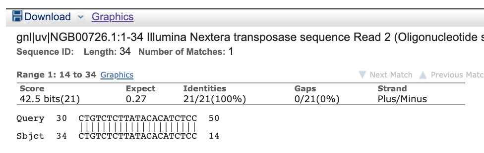
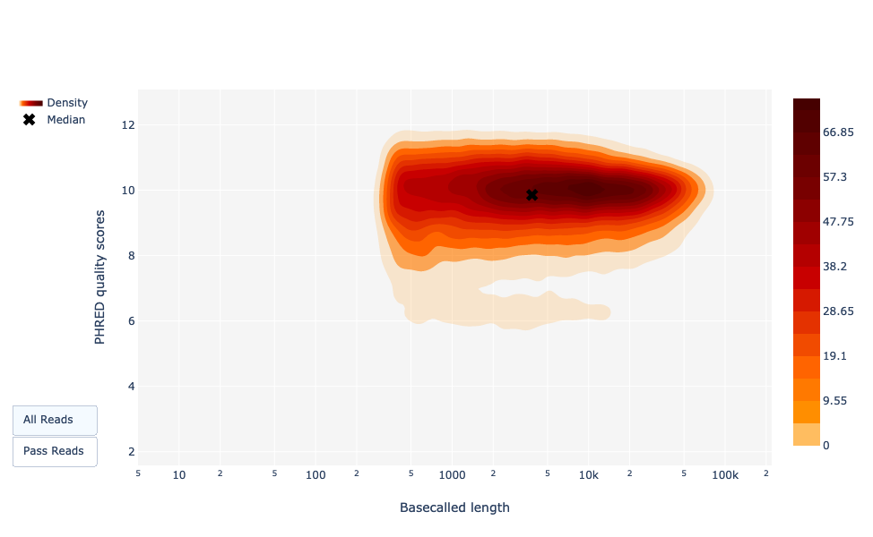

# Introduction


During sequencing, the nucleotide bases in a DNA or RNA sample (library) are determined by the sequencer. For each fragment in the library, a sequence is generated, also called a **read**, which is simply a succession of nucleotides.

Modern sequencing technologies can generate a massive number of sequence reads in a single experiment. However, no sequencing technology is perfect, and each instrument will generate different types and amount of errors, such as incorrect nucleotides being called. These wrongly called bases are due to the technical limitations of each sequencing platform.

Therefore, it is necessary to understand, identify and exclude error-types that may impact the interpretation of downstream analysis.
Sequence quality control is therefore an essential first step in your analysis. Catching errors early saves time later on.

> <agenda-title></agenda-title>
>
> In this tutorial, we will deal with:
>
> 1. TOC
> {:toc}
>
{: .agenda}

# Inspect a raw sequence file

> <hands-on-title>Data upload</hands-on-title>
>
> 1. Create a new history for this tutorial and give it a proper name
>
>    
>    
>
> 2. Import the file `female_oral2.fastq-4143.gz` from [Zenodo](https://zenodo.org/record/3977236) or from the data library (ask your instructor)
>    This is a microbiome sample from a snake .
>
>    ```
>    https://zenodo.org/record/3977236/files/female_oral2.fastq-4143.gz
>    ```
>
>    
>    
>
> 3. Rename the imported dataset to `Reads`.
{: .hands_on}

We just imported a file into Galaxy. This file is similar to the data we could get directly from a sequencing facility: a [FASTQ file](https://en.wikipedia.org/wiki/FASTQ_format).

> <hands-on-title>Inspect the FASTQ file</hands-on-title>
>
> 1. Inspect the file by clicking on the  (eye) icon
>
{: .hands_on}

Although it looks complicated (and maybe it is), the FASTQ format is easy to understand with a little decoding.

Each read, representing a fragment of the library, is encoded by 4 lines:

Line  | Description
--- | ---
1 | Always begins with `@` followed by the information about the read
2 | The actual nucleic sequence
3 | Always begins with a `+` and contains sometimes the same info in line 1
4 | Has a string of characters which represent the quality scores associated with each base of the nucleic sequence; must have the same number of characters as line 2

So for example, the first sequence in our file is:

```
@M00970:337:000000000-BR5KF:1:1102:17745:1557 1:N:0:CGCAGAAC+ACAGAGTT
GTGCCAGCCGCCGCGGTAGTCCGACGTGGCTGTCTCTTATACACATCTCCGAGCCCACGAGACCGAAGAACATCTCGTATGCCGTCTTCTGCTTGAAAAAAAAAAAAAAAAAAAACAAAAAAAAAAAAAGAAGCAAATGACGATTCAAGAAAGAAAAAAACACAGAATACTAACAATAAGTCATAAACATCATCAACATAAAAAAGGAAATACACTTACAACACATATCAATATCTAAAATAAATGATCAGCACACAACATGACGATTACCACACATGTGTACTACAAGTCAACTA
+
GGGGGGGGGGGGGGGGGGGGGGGGGGGGGGGGGGGGGGGGGGGGGGGGGGGGGGGGGGGGGFGGGFGGGGGGAFFGGFGGGGGGGGFGGGGGGGGGGGGGGFGGG+38+35*311*6,,31=******441+++0+0++0+*1*2++2++0*+*2*02*/***1*+++0+0++38++00++++++++++0+0+2++*+*+*+*+*****+0**+0**+***+)*.***1**//*)***)/)*)))*)))*),)0(((-((((-.(4(,,))).,(())))))).)))))))-))-(
```

It means that the fragment named `@M00970` corresponds to the DNA sequence `GTGCCAGCCGCCGCGGTAGTCCGACGTGGCTGTCTCTTATACACATCTCCGAGCCCACGAGACCGAAGAACATCTCGTATGCCGTCTTCTGCTTGAAAAAAAAAAAAAAAAAAAACAAAAAAAAAAAAAGAAGCAAATGACGATTCAAGAAAGAAAAAAACACAGAATACTAACAATAAGTCATAAACATCATCAACATAAAAAAGGAAATACACTTACAACACATATCAATATCTAAAATAAATGATCAGCACACAACATGACGATTACCACACATGTGTACTACAAGTCAACTA` and this sequence has been sequenced with a quality `GGGGGGGGGGGGGGGGGGGGGGGGGGGGGGGGGGGGGGGGGGGGGGGGGGGGGGGGGGGGGFGGGFGGGGGGAFFGGFGGGGGGGGFGGGGGGGGGGGGGGFGGG+38+35*311*6,,31=******441+++0+0++0+*1*2++2++0*+*2*02*/***1*+++0+0++38++00++++++++++0+0+2++*+*+*+*+*****+0**+0**+***+)*.***1**//*)***)/)*)))*)))*),)0(((-((((-.(4(,,))).,(())))))).)))))))-))-(`.

But what does this quality score mean?

The quality score for each sequence is a string of characters, one for each base of the nucleic sequence, used to characterize the probability of mis-identification of each base. The score is encoded using the ASCII character table (with [some historical differences](https://en.wikipedia.org/wiki/FASTQ_format#Encoding)):


So there is an ASCII character associated with each nucleotide, representing its [Phred quality score](https://en.wikipedia.org/wiki/Phred_quality_score), the probability of an incorrect base call:

Phred Quality Score | Probability of incorrect base call | Base call accuracy
--- | --- | ---
10 | 1 in 10 | 90%
20 | 1 in 100 | 99%
30 | 1 in 1000 | 99.9%
40 | 1 in 10,000 | 99.99%
50 | 1 in 100,000 | 99.999%
60 | 1 in 1,000,000 | 99.9999%

> <question-title></question-title>
>
> 1. Which ASCII character corresponds to the worst Phred score for Illumina 1.8+?
> 2. What is the Phred quality score of the 3rd nucleotide of the 1st sequence?
> 3. What is the accuracy of this 3rd nucleotide?
>
> > <solution-title></solution-title>
> > 1. The worst Phred score is the smallest one, so 0. For Illumina 1.8+, it corresponds to the `!` character.
> > 2. The 3rd nucleotide of the 1st sequence has a ASCII character `G`, which correspond to a score of 38.
> > 3. The corresponding nucleotide `G` has an accuracy of almost 99.99%
> >
> {: .solution }
{: .question}

> <comment-title></comment-title>
> The current lllumina (1.8+) uses Sanger format (Phred+33). If you are working with older datasets you may encounter the older scoring schemes. **FastQC** , a tool we will use later in this tutorial, can be used to try to determine what type of quality encoding is used (through assessing the range of Phred values seen in the FASTQ).
{: .comment}

When looking at the file in Galaxy, it looks like most the nucleotides have a high score (`G` corresponding to a score 38). Is it true for all sequences? And along the full sequence length?


# Assess quality with FASTQE 🧬😎 - short reads only

To take a look at sequence quality along all sequences, we can use [FASTQE](https://fastqe.com/). It is an open-source tool that provides a simple and fun way to quality control raw sequence data and print them as emoji. You can use it to give a quick impression of whether your data has any problems of which you should be aware before doing any further analysis.

> <hands-on-title>Quality check</hands-on-title>
>
> 1.  with the following parameters
>    -  *"FastQ data"*: `Reads`
>    -  *"Score types to show"*: `Mean`
>
> 2. Inspect the generated HTML file
>
{: .hands_on}

Rather than looking at quality scores for each individual read, FASTQE looks at quality collectively across all reads within a sample and can calculate the mean for each nucleotide position along the length of the reads. Below shows the mean values for this dataset.


You can see the score for each emoji [here](https://github.com/fastqe/fastqe#scale). The emojis below, with Phred scores less than 20, are the ones we hope we don't see much.

Phred Quality Score | ASCII code | Emoji
--- | --- | ---
0 | ! | 🚫
1 | " | ❌
2 | # | 👺
3 | $ | 💔
4 | % | 🙅
5 | & | 👾
6 | ' | 👿
7 | ( | 💀
8 | ) | 👻
9 | * | 🙈
10 | + | 🙉
11 | , | 🙊
12 | - | 🐵
13 | . | 😿
14 | / | 😾
15 | 0 | 🙀
16 | 1 | 💣
17 | 2 | 🔥
18 | 3 | 😡
19 | 4 | 💩


> <question-title></question-title>
>
> What is the lowest mean score in this dataset?
>
> > <solution-title></solution-title>
> > The lowest score in this dataset is 😿 13.
> {: .solution }
{: .question}


# Assess quality with FastQC - short & long reads

An additional or alternative way we can check sequence quality is with [FastQC](https://www.bioinformatics.babraham.ac.uk/projects/fastqc/). It provides a modular set of analyses which you can use to check whether your data has any problems of which you should be aware before doing any further analysis.  We can use it, for example, to assess whether there are known adapters present in the data. We'll run it on the FASTQ file.

> <hands-on-title>Quality check</hands-on-title>
>
> 1.  with the following parameters
>    -  *"Raw read data from your current history"*: `Reads`
>
> 2. Inspect the generated HTML file
>
{: .hands_on}

> <question-title></question-title>
>
> Which Phred encoding is used in the FASTQ file for these sequences?
>
> > <solution-title></solution-title>
> > The Phred scores are encoded using `Sanger / Illumina 1.9` (`Encoding` in the top table).
> {: .solution }
{: .question}

## Per base sequence quality

With FastQC we can use the per base sequence quality plot to check the base quality of the reads, similar to what we did with FASTQE.


On the x-axis are the base position in the read. In this example, the sample contains reads that are up to 296 bp long.

> <details-title>Non uniform x-axis</details-title>
>
> The x-axis is not always uniform. When you have long reads, some binning is applied to keep things compact. We can see that in our sample. It starts out with individual 1-10 bases. After that, bases are binned across a window a certain number of bases wide. Data binning means grouping and is a data pre-processing technique used to reduce the effects of minor observation errors. The number of base positions binned together depends on the length of the read. With reads >50bp, the latter part of the plot will report aggregate statistics for 5bp windows. Shorter reads will have smaller windows and longer reads larger windows. Binning can be removed when running FastQC by setting the paramter "Disable grouping of bases for reads >50bp" to Yes.
{: .details}

For each position, a boxplot is drawn with:

- the median value, represented by the central red line
- the inter-quartile range (25-75%), represented by the yellow box
- the 10% and 90% values in the upper and lower whiskers
- the mean quality, represented by the blue line

The y-axis shows the quality scores. The higher the score, the better the base call. The background of the graph divides the y-axis into very good quality scores (green), scores of reasonable quality (orange), and reads of poor quality (red).

It is normal with all Illumina sequencers for the median quality score to start out lower over the first 5-7 bases and to then rise. The quality of reads on most platforms will drop at the end of the read. This is often due to signal decay or phasing during the sequencing run. The recent developments in chemistry applied to sequencing has improved this somewhat, but reads are now longer than ever.


> <details-title>Signal decay and phasing</details-title>
>
> - Signal decay
>
>  The fluorescent signal intensity decays with each cycle of the sequencing process. Due to the degrading fluorophores, a proportion of the strands in the cluster are not being elongated. The proportion of the signal being emitted continues to decrease with each cycle, yielding to a decrease of quality scores at the 3' end of the read.
>
> - Phasing
>
>  The signal starts to blur with the increase of number of cycles because the cluster looses synchronicity. As the cycles progress, some strands get random failures of nucleotides to incorporate due to:
>
>  - Incomplete removal of the 3' terminators and fluorophores
>  - Incorporation of nucleotides without effective 3' terminators
>
>  This leads to a decrease in quality scores at the 3' end of the read.
{: .details}


> <details-title>Other sequence quality profiles</details-title>
>
> These are some per base sequence quality profiles that can indicate issues with the sequencing.
>
> - Overclustering
>
>   Sequencing facilities can overcluster the flow cells. It results in small distances between clusters and an overlap in the signals. Two clusters can be interpreted as a single cluster with mixed fluorescent signals being detected, decreasing signal purity. It generates lower quality scores across the entire read.
>
> - Instrumentation breakdown
>
>   Some issues can occasionally happen with the sequencing instruments during a run. Any sudden drop in quality or a large percentage of low quality reads across the read could indicate a problem at the facility. Some examples of such issues:
>
>    - Manifold burst
>
>      
>
>    - Cycles loss
>
>      
>
>    - Read 2 failure
>
>      
>
>    With such data, the sequencing facility should be contacted for discussion. Often, a resequencing then is needed (and from our experience also offered by the company).
>
{: .details}

> <question-title></question-title>
>
> 1. How does the mean quality score change along the sequence?
> 2. Is this tendency seen in all sequences?
>
> > <solution-title></solution-title>
> > 1. The mean quality score (blue line) drops about midway though these sequences. It is common for the mean quality to drop towards the end of the sequences, as the sequencers are incorporating more incorrect nucleotides at the end. However, in this sample there is a very large drop in quality from the middle onwards.
> > 2. The box plots are getting wider from position ~100.  It means a lot of sequences have their score dropping from the middle of the sequence. After 100 nucleotides, more than 10% of the sequences have scores below 20.
> >
> {: .solution }
{: .question}

When the median quality is below a Phred score of ~20, we should consider trimming away bad quality bases from the sequence. We will explain that process in the Trim and filter section.

#### Adapter Content


The plot shows the cumulative percentage of reads with the different adapter sequences at each position. Once an adapter sequence is seen in a read it  is counted as being present right through to the end of the read so the percentage increases with the read length. FastQC can detect some adapters by default (e.g. Illumina, Nextera), for others we could provide a contaminants file as an input to the FastQC tool.

Ideally Illumina sequence data should not have any adapter sequence present. But with long reads, some of the library inserts are shorter than the read length resulting in read-through to the adapter at the 3' end of the read. This microbiome sample has relatively long reads and we can see Nextera dapater has been detected.

> <details-title>Other adapter content profiles</details-title>
>
> Adapter content may also be detected with RNA-Seq libraries where the distribution of library insert sizes is varied and likely to include some short inserts.
>
> 
>
{: .details}

We can run an trimming tool such as Cutadapt to remove this adapter. We will explain that process in the filter and trim section.


> <tip-title>Take a shortcut</tip-title>
>
> The following sections go into detail about some of the other plots generated by FastQC. Note that some plots/modules may give warnings but be normal
> for the type of data you're working with, as discussed below and [here](https://rtsf.natsci.msu.edu/genomics/tech-notes/fastqc-tutorial-and-faq/).
> The other plots give us information to more deeply understand the quality of the data, and to see if changes could be made in the lab to get higher-quality data in the future.
> These sections are **optional**, and if you would like to skip these you can:
>   - Jump straight to the [next section](#trim-and-filter---short-reads) to learn about trimming paired-end data
{: .tip}

#### Per tile sequence quality

This plot enables you to look at the quality scores from each tile across all of your bases to see if there was a loss in quality associated with only one part of the flowcell. The plot shows the deviation from the average quality for each flowcell tile. The hotter colours indicate that reads in the given tile have worse qualities for that position than reads in other tiles. With this sample, you can see that certain tiles show consistently poor quality, especially from ~100bp onwards. A good plot should be blue all over.


This plot will only appear for Illumina library which retains its original sequence identifiers. Encoded in these is the flowcell tile from which each read came.

> <details-title>Other tile quality profiles</details-title>
>
> In some cases, the chemicals used during sequencing becoming a bit exhausted over the time and the last tiles got worst chemicals which makes the sequencing reactions a bit error-prone. The "Per tile sequence quality" graph will then have some horizontal lines like this:
>
> 
>
{: .details}

## Per sequence quality scores

It plots the average quality score over the full length of all reads on the x-axis and gives the total number of reads with this score on the y-axis:


The distribution of average read quality should be tight peak in the upper range of the plot. It can also report if a subset of the sequences have universally low quality values: it can happen because some sequences are poorly imaged (on the edge of the field of view etc), however these should represent only a small percentage of the total sequences.

## Per base sequence content


"Per Base Sequence Content" plots the percentage of each of the four nucleotides (T, C, A, G) at each position across all reads in the input sequence file. As for the per base sequence quality, the x-axis is non-uniform.

In a random library we would expect that there would be little to no difference between the four bases. The proportion of each of the four bases should remain relatively constant over the length of the read with `%A=%T` and `%G=%C`, and the lines in this plot should run parallel with each other. This is amplicon data, where 16S DNA is PCR amplified and sequenced, so we'd expect this plot to have some bias and not show a random distribution.

> <details-title>Biases by library type</details-title>
>
> It's worth noting that some library types will always produce biased sequence composition, normally at the start of the read. Libraries produced by priming using random hexamers (including nearly all RNA-Seq libraries), and those which were fragmented using transposases, will contain an intrinsic bias in the positions at which reads start (the first 10-12 bases). This bias does not involve a specific sequence, but instead provides enrichment of a number of different K-mers at the 5' end of the reads. Whilst this is a true technical bias, it isn't something which can be corrected by trimming and in most cases doesn't seem to adversely affect the downstream analysis. It will, however, produce a warning or error in this module.
>
> 
>
> ChIP-seq data can also encounter read start sequence biases in this plot if fragmenting with transposases. With bisulphite converted data, e.g. HiC data, a separation of G from C and A from T is expected:
>
> 
>
> At the end, there is an overall shift in the sequence composition. If the shift correlates with a loss of sequencing quality, it can be suspected that miscalls are made with a more even sequence bias than bisulphite converted libraries.  Trimming the sequences fixed this problem, but if this hadn't been done it would have had a dramatic effect on the methylation calls which were made.
{: .details}

> <question-title></question-title>
>
> Why is there a warning for the per-base sequence content graphs?
>
> > <solution-title></solution-title>
> > In the beginning of sequences, the sequence content per base is not really good and the percentages are not equal, as expected for 16S amplicon data.
> >
> {: .solution }
{: .question}


## Per sequence GC content


This plot displays the number of reads vs. percentage of bases G and C per read. It is compared to a theoretical distribution assuming an uniform GC content for all reads, expected for whole genome shotgun sequencing, where the central peak corresponds to the overall GC content of the underlying genome. Since the GC content of the genome is not known, the modal GC content is calculated from the observed data and used to build a reference distribution.

An unusually-shaped distribution could indicate a contaminated library or some other kind of biased subset. A shifted normal distribution indicates some systematic bias, which is independent of base position. If there is a systematic bias which creates a shifted normal distribution then this won't be flagged as an error by the module since it doesn't know what your genome's GC content should be.

But there are also other situations in which an unusually-shaped distribution may occur. For example, with RNA sequencing there may be a greater or lesser distribution of mean GC content among transcripts causing the observed plot to be wider or narrower than an ideal normal distribution.

> <question-title></question-title>
>
> Why is there a fail for the per sequence GC content graphs?
>
> > <solution-title></solution-title>
> > There are multiple peaks. This can be indicative of unexpected contamination, such as adapter, rRNA or overrepresented sequences. Or it may be normal if it is amplicon data or you have highly abundant RNA-seq transcripts.
> {: .solution }
{: .question}

#### Sequence length distribution

This plot shows the distribution of fragment sizes in the file which was analysed. In many cases this will produce a simple plot showing a peak only at one size, but for variable length FASTQ files this will show the relative amounts of each different size of sequence fragment. Our plot shows variable length as we trimmed the data. The biggest peak is at 296bp but there is a second large peak at ~100bp. So even though our sequences range up to 296bp in length, a lot of the good-quality sequences are shorter. This corresponds with the drop we saw in the sequence quality at ~100bp and the red stripes starting at this position in the per tile sequence quality plot.


Some high-throughput sequencers generate sequence fragments of uniform length, but others can contain reads of widely varying lengths. Even within uniform length libraries some pipelines will trim sequences to remove poor quality base calls from the end or the first $$n$$ bases if they match the first $$n$$ bases of the adapter up to 90% (by default), with sometimes $$n = 1$$.

## Sequence Duplication Levels

The graph shows in blue the percentage of reads of a given sequence in the file which are present a given number of times in the file:


In a diverse library most sequences will occur only once in the final set. A low level of duplication may indicate a very high level of coverage of the target sequence, but a high level of duplication is more likely to indicate some kind of enrichment bias.

Two sources of duplicate reads can be found:
- PCR duplication in which library fragments have been over-represented due to biased PCR enrichment

  It is a concern because PCR duplicates misrepresent the true proportion of sequences in the input.

- Truly over-represented sequences such as very abundant transcripts in an RNA-Seq library or in amplicon data (like this sample)

  It is an expected case and not of concern because it does faithfully represent the input.

> <details-title>More details about duplication</details-title>
>
> FastQC counts the degree of duplication for every sequence in a library and creates a plot showing the relative number of sequences with different degrees of duplication. There are two lines on the plot:
> - Blue line: distribution of the duplication levels for the full sequence set
> - Red line: distribution for the de-duplicated sequences with the proportions of the deduplicated set which come from different duplication levels in the original data.
>
> For whole genome shotgun data it is expected that nearly 100% of your reads will be unique (appearing only 1 time in the sequence data). Most sequences should fall into the far left of the plot in both the red and blue lines. This indicates a highly diverse library that was not over sequenced. If the sequencing depth is extremely high (e.g. > 100x the size of the genome) some inevitable sequence duplication can appear: there are in theory only a finite number of completely unique sequence reads which can be obtained from any given input DNA sample.
>
> More specific enrichments of subsets, or the presence of low complexity contaminants will tend to produce spikes towards the right of the plot. These high duplication peaks will most often appear in the blue trace as they make up a high proportion of the original library, but usually disappear in the red trace as they make up an insignificant proportion of the deduplicated set. If peaks persist in the red trace then this suggests that there are a large number of different highly duplicated sequences which might indicate either a contaminant set or a very severe technical duplication.
>
> It is usually the case for RNA sequencing where there is some very highly abundant transcripts and some lowly abundant. It is expected that duplicate reads will be observed for high abundance transcripts:
>
> 
>
{: .details}

## Over-represented sequences

A normal high-throughput library will contain a diverse set of sequences, with no individual sequence making up a tiny fraction of the whole. Finding that a single sequence is very over-represented in the set either means that it is highly biologically significant, or indicates that the library is contaminated, or not as diverse as expected.

FastQC lists all of the sequence which make up more than 0.1% of the total. For each over-represented sequence FastQC will look for matches in a database of common contaminants and will report the best hit it finds. Hits must be at least 20bp in length and have no more than 1 mismatch. Finding a hit doesn't necessarily mean that this is the source of the contamination, but may point you in the right direction. It's also worth pointing out that many adapter sequences are very similar to each other so you may get a hit reported which isn't technically correct, but which has a very similar sequence to the actual match.

RNA sequencing data may have some transcripts that are so abundant that they register as over-represented sequence. With DNA sequencing data no single sequence should be present at a high enough frequency to be listed, but we can sometimes see a small percentage of adapter reads.

> <question-title></question-title>
>
> How could we find out what the overrepreseented sequences are?
>
> > <solution-title></solution-title>
> > We can BLAST overrepresented sequences to see what they are. In this case, if we take the top overrepresented sequence
> > ```
> > >overrep_seq1
> > GTGTCAGCCGCCGCGGTAGTCCGACGTGGCTGTCTCTTATACACATCTCC
> > ```
> > and use [blastn](https://blast.ncbi.nlm.nih.gov/Blast.cgi) against the default Nucleotide (nr/nt) database we don't get any hits. But if we use [VecScreen](https://www.ncbi.nlm.nih.gov/tools/vecscreen/) we see it is the Nextera adapter.
> > 
> {: .solution }
{: .question}


> <details-title>More details about other FastQC plots</details-title>
>
>
> #### Per base N content
>
> 
>
> If a sequencer is unable to make a base call with sufficient confidence, it will write an "N" instead of a conventional base call. This plot displays the percentage of base calls at each position or bin for which an N was called.
>
> It's not unusual to see a very high proportion of Ns appearing in a sequence, especially near the end of a sequence. But this curve should never rises noticeably above zero. If it does this indicates a problem occurred during the sequencing run. In the example below, an error caused the instrument to be unable to call a base for approximately 20% of the reads at position 29:
>
> 
>
>
> #### Kmer Content
>
> This plot not output by default. As stated in the tool form, if you want this module it needs to be enabled using a custom Submodule and limits file. With this module, FastQC does a generic analysis of all of the short nucleotide sequences of length k (kmer, with k = 7 by default) starting at each position along the read in the library to find those which do not have an even coverage through the length of your reads. Any given kmer should be evenly represented across the length of the read.
>
> FastQC will report the list of kmers which appear at specific positions with a greater frequency than expected. This can be due to different sources of bias in the library, including the presence of read-through adapter sequences building up on the end of the sequences. The presence of any overrepresented sequences in the library (such as adapter dimers) causes the kmer plot to be dominated by the kmer from these sequences. Any biased kmer due to other interesting biases may be then diluted and not easy to see.
>
> The following example is from a high-quality DNA-Seq library. The biased kmers nearby the start of the read likely are due to slight sequence dependent efficiency of DNA shearing or a result of random priming:
>
> 
>
> This module can be very difficult to interpret. The adapter content plot and overrepesented sequences table are easier to interpret and may give you enough information without needing this plot. RNA-seq libraries may have highly represented kmers that are derived from highly expressed sequences. To learn more about this plot, please check the [FastQC Kmer Content documentation](http://www.bioinformatics.babraham.ac.uk/projects/fastqc/Help/3%20Analysis%20Modules/11%20Kmer%20Content.html).
>
{: .details}

We tried to explain here there different FastQC reports and some use cases. More about this and also some common next-generation sequencing problems can be found on [QCFAIL.com](https://sequencing.qcfail.com/)

> <details-title>Specific problem for alternate library types</details-title>
>
> #### Small/micro RNA
>
> In small RNA libraries, we typically have a relatively small set of unique, short sequences. Small RNA libraries are not randomly sheared before adding sequencing adapters to their ends: all the reads for specific classes of microRNAs will be identical. It will result in:
>
> - Extremely biased per base sequence content
> - Extremely narrow distribution of GC content
> - Very high sequence duplication levels
> - Abundance of overrepresented sequences
> - Read-through into adapters
>
> #### Amplicon
>
> Amplicon libraries are prepared by PCR amplification of a specific target. For example, the V4 hypervariable region of the bacterial 16S rRNA gene. All reads from this type of library are expected to be nearly identical. It will result in:
>
> - Extremely biased per base sequence content
> - Extremely narrow distribution of GC content
> - Very high sequence duplication levels
> - Abundance of overrepresented sequences
>
> #### Bisulfite or Methylation sequencing
>
> With Bisulfite or methylation sequencing, the majority of the cytosine (C) bases are converted to thymine (T). It will result in:
>
> - Biased per base sequence content
> - Biased per sequence GC content
>
> #### Adapter dimer contamination
>
> Any library type may contain a very small percentage of adapter dimer (i.e. no insert) fragments. They are more likely to be found in amplicon libraries constructed entirely by PCR (by formation of PCR primer-dimers) than in DNA-Seq or RNA-Seq libraries constructed by adapter ligation. If a sufficient fraction of the library is adapter dimer it will become noticeable in the FastQC report:
>
> - Drop in per base sequence quality after base 60
> - Possible bi-modal distribution of per sequence quality scores
> - Distinct pattern observed in per bases sequence content up to base 60
> - Spike in per sequence GC content
> - Overrepresented sequence matching adapter
> - Adapter content > 0% starting at base 1
>
{: .details}

> <comment-title>Bad quality sequences</comment-title>
> If the quality of the reads is not good, we should always first check what is wrong and think about it: it may come from the type of sequencing or what we sequenced (high quantity of overrepresented sequences in transcriptomics data, biased percentage of bases in HiC data).
>
> You can also ask the sequencing facility about it, especially if the quality is really bad: the quality treatments can not solve everything. If too many bad quality bases are cut away, the corresponding reads then will be filtered out and you lose them.
{: .comment}

# Trim and filter - short reads

The quality drops in the middle of these sequences. This could cause bias in downstream analyses with these potentially incorrectly called nucleotides. Sequences must be treated to reduce bias in downstream analysis. Trimming can help to increase the number of reads the aligner or assembler are able to succesfully use, reducing the number of reads that are unmapped or unassembled. In general, quality treatments include:

1. Trimming/cutting/masking sequences
    - from low quality score regions
    - beginning/end of sequence
    - removing adapters
2. Filtering of sequences
    - with low mean quality score
    - too short
    - with too many ambiguous (N) bases

To accomplish this task we will use [Cutadapt](https://cutadapt.readthedocs.io/en/stable/guide.html) , a tool that enhances sequence quality by automating adapter trimming as well as quality control.  We will:

- Trim low-quality bases from the ends. Quality trimming is done before any adapter trimming. We will set the quality threshold as 20, a commonly used threshold, see more [here](https://gatk.broadinstitute.org/hc/en-us/articles/360035531872-Phred-scaled-quality-scores).
- Trim adapter with Cutadapt. For that we need to supply the sequence of the adapter. In this sample, Nextera is the adapter that was detected. We can find the sequence of the Nextera adapter on the [Illumina website here](https://support.illumina.com/bulletins/2016/12/what-sequences-do-i-use-for-adapter-trimming.html) `CTGTCTCTTATACACATCT`. We will trim that sequence from the 3' end of the reads.
- Filter out sequences with length < 20 after trimming

> <hands-on-title>Improvement of sequence quality</hands-on-title>
>
> 1.  with the following parameters
>    - *"Single-end or Paired-end reads?"*: `Single-end`
>       -  *"Reads in FASTQ format"*: `Reads` (Input dataset)
>
>          > <tip-title>Files not selectable?</tip-title>
>          > If your FASTQ file cannot be selected, you might check whether the format is FASTQ with Sanger-scaled quality values (`fastqsanger.gz`). You can edit the data type by clicking on the pencil symbol.
>          {: .tip}
>    - In *"Read 1 Options"*:
>       - *"Insert 3' (End) Adapters"*:
>          - *"Source"*: `Enter custom sequence`
>          - *"Enter custom 3' adapter sequence"*: `CTGTCTCTTATACACATCT`
>    - In *"Filter Options"*
>       - *"Minimum length"*: `20`
>    - In *"Read Modification Options"*
>       - *"Quality cutoff"*: `20`
>    -  *"Outputs selector"*: `Report`
>
> 2. Inspect the generated txt file (`Report`)
>
>    > <question-title></question-title>
>    >
>    > 1. What % reads contain adapter?
>    > 2. What % reads have been trimmed because of bad quality?
>    > 3. What % reads have been removed because they were too short?
>    >
>    > > <solution-title></solution-title>
>    > > 1. 56.8% reads contain adapter (`Reads with adapters:`)
>    > > 2. 35.1% reads have been trimmed because of bad quality (`Quality-trimmed:`)
>    > > 3. 0 % reads were removed because they were too short
>    > {: .solution }
>    {: .question}
{: .hands_on}


> <details-title>Trimming with Cutadapt</details-title>
>
> One of the biggest advantage of Cutadapt compared to other trimming tools (e.g. TrimGalore!) is that it has a good [documentation](https://cutadapt.readthedocs.io) explaining how the tool works in detail.
>
> Cutadapt quality trimming algorithm consists of three simple steps:
>
> 1. Subtract the chosen threshold value from the quality value of each position
> 2. Compute a partial sum of these differences from the end of the sequence to each position
>    (as long as the partial sum is negative)
> 3. Cut at the minimum value of the partial sum
>
> In the following example, we assume that the 3’ end is to be quality-trimmed with a threshold of 10 and we have the following quality values
>
> ```
> 42 40 26 27 8 7 11 4 2 3
> ```
>
> 1. Subtract the threshold
>
>     ```
>     32 30 16 17 -2 -3 1 -6 -8 -7
>     ```
>
> 2. Add up the numbers, starting from the 3' end (partial sums) and stop early if the sum is greater than zero
>
>     ```
>     (70) (38) 8 -8 -25 -23 -20, -21 -15 -7
>     ```
>
>     The numbers in parentheses are not computed (because 8 is greater than zero), but shown here for completeness.
>
> 3. Choose the position of the minimum (`-25`) as the trimming position
>
> Therefore, the read is trimmed to the first four bases, which have quality values
>
> ```
> 42 40 26 27
> ```
>
> Note that therefore, positions with a quality value larger than the chosen threshold are also removed if they are embedded in regions with lower quality (the partial sum is decreasing if the quality values are smaller than the threshold). The advantage of this procedure is that it is robust against a small number of positions with a quality higher than the threshold.
>
>
> Alternatives to this procedure would be:
>
> * Cut after the first position with a quality smaller than the threshold
> * Sliding window approach
>
>     The sliding window approach checks that the average quality of each sequence window of specified length is larger than the threshold. Note that in contrast to cutadapt's approach, this approach has one more parameter and the robustness depends of the length of the window (in combination with the quality threshold). Both approaches are implemented in Trimmomatic.
{: .details}


We can examine our trimmed data with FASTQE and/or FastQC.

> <hands-on-title>Checking quality after trimming</hands-on-title>
>
> 1. : Re-run **FASTQE** with the following parameters
>    -  *"FastQ data"*: `Cutadapt Read 1 Output`
>    -  *"Score types to show"*: `Mean`
>
> 2. Inspect the new FASTQE report
>
>    > <question-title></question-title>
>    >
>    > Compare the FASTQE output to the previous one before trimming above. Has sequence quality been improved?
>    >
>    > 
>    >
>    > > <solution-title></solution-title>
>    > > Yes, the quality score emojis look better (happier) now.
>    > >
>    > > 
>    > >
>    > > 
>    > >
>    > {: .solution }
>    {: .question}
{: .hands_on}

With FASTQE we can see we improved the quality of the bases in the dataset.

We can also, or instead, check the quality-controlled data with FastQC.


> <hands-on-title>Checking quality after trimming</hands-on-title>
>
> 1.  with the following parameters
>    -  *"Short read data from your current history"*: `Cutadapt Read 1 Output`
>
> 2. Inspect the generated HTML file
>
{: .hands_on}

> <question-title></question-title>
> 1. Does the per base sequence quality look better?
> 2. Is the adapter gone?
>
> > <solution-title></solution-title>
> > 1. Yes. The vast majority of the bases have a quality score above 20 now.
> > 
> >
> > 2. Yes. No adapter is detected now.
> > 
> >
> {: .solution }
{: .question}

With FastQC we can see we improved the quality of the bases in the dataset and removed the adapter.

> <details-title>Other FastQC plots after trimming</details-title>
>
> 
> We have some red stripes as we've trimmed those regions from the reads.
>
> 
> We now have one peak of high quality instead of one high and one lower quality that we had previously.
>
> 
> We don't have equal representation of the bases as before as this is amplicon data.
>
> 
> We now have a single main GC peak due to removing the adapter.
>
> 
> This is the same as before as we don't have any Ns in these reads.
>
> 
> We now have multiple peaks and a range of lengths, instead of the single peak with had before trimming when all sequences were the same length.
>
> 
> > <question-title></question-title>
> >
> > What does the top overrepresented sequence `GTGTCAGCCGCCGCGGTAGTCCGACGTGG` correspond to?
> >
> > > <solution-title></solution-title>
> > > If we take the top overrepresented sequence
> > > ```
> > > >overrep_seq1_after
> > > GTGTCAGCCGCCGCGGTAGTCCGACGTGG
> > > ```
> > > and use [blastn](https://blast.ncbi.nlm.nih.gov/Blast.cgi) against the default Nucleotide (nr/nt) database we see the top hits are to 16S rRNA genes. This makes sense as this is 16S amplicon data, where the 16S gene is PCR amplified.
> > {: .solution }
> {: .question}
{: .details}


# Processing multiple datasets

## Process paired-end data

With paired-end sequencing, the fragments are sequenced from both sides. This approach results in two reads per fragment, with the first read in forward orientation and the second read in reverse-complement orientation. With this technique, we have the advantage to get more information about each DNA fragment compared to reads sequenced by only single-end sequencing:

```
    ------>                       [single-end]

    ----------------------------- [fragment]

    ------>               <------ [paired-end]
```
The distance between both reads is known and therefore is additional information that can improve read mapping.

Paired-end sequencing generates 2 FASTQ files:
- One file with the sequences corresponding to **forward** orientation of all the fragments
- One file with the sequences corresponding to **reverse** orientation of all the fragments

Usually we recognize these two files which belong to one sample by the name which has the same identifier for the reads but a different extension, e.g. `sampleA_R1.fastq` for the forward reads and `sampleA_R2.fastq` for the reverse reads. It can also be `_f` or `_1` for the forward reads and `_r` or `_2` for the reverse reads.

The data we analyzed in the previous step was single-end data so we will import a paired-end RNA-seq dataset to use. We will run FastQC and aggregate the two reports with MultiQC .

> <hands-on-title>Assessing the quality of paired-end reads</hands-on-title>
>
> 1. Import the paired-end reads `GSM461178_untreat_paired_subset_1.fastq` and `GSM461178_untreat_paired_subset_2.fastq` from [Zenodo](https://zenodo.org/record/61771) or from the data library (ask your instructor)
>
>    ```
>    https://zenodo.org/record/61771/files/GSM461178_untreat_paired_subset_1.fastq
>    https://zenodo.org/record/61771/files/GSM461178_untreat_paired_subset_2.fastq
>    ```
>
> 2.  with both datasets:
>    -  *"Raw read data from your current history"*: both the uploaded datasets.
>
>    
>
> 3.  with the following parameters to aggregate the FastQC reports of both forward and reverse reads
>      - In *"Results"*
>        - *"Which tool was used generate logs?"*: `FastQC`
>        - In *"FastQC output"*
>           - *"Type of FastQC output?"*: `Raw data`
>           -  *"FastQC output"*: `Raw data` files (output of both **FastQC** )
>
> 4. Inspect the webpage output from MultiQC.
>
{: .hands_on}


> <question-title></question-title>
>
> 1. What do you think about the quality of the sequences?
> 2. What should we do?
>
> > <solution-title></solution-title>
> >
> > 1. The quality of the sequences seems worse for the reverse reads than for the forward reads:
> >     - Per Sequence Quality Scores: distribution more on the left, i.e. a lower mean quality of the sequences
> >     - Per base sequence quality: less smooth curve and stronger decrease at the end with a mean value below 28
> >     - Per Base Sequence Content: stronger bias at the beginning and no clear distinction between C-G and A-T groups
> >
> >    The other indicators (adapters, duplication levels, etc) are similar.
> >
> > 2. We should trim the end of the sequences and filter them with **Cutadapt** 
> >
> {: .solution}
{: .question}

With paired-end reads the average quality scores for forward reads will almost always be higher than for reverse reads.

After trimming, reverse reads will be shorter because of their quality and then will be eliminated during the filtering step. If one of the reverse reads is removed, its corresponding forward read should be removed too. Otherwise we will get different number of reads in both files and in different order, and order is important for the next steps. Therefore **it is important to treat the forward and reverse reads together for trimming and filtering**.

> <hands-on-title>Improving the quality of paired-end data</hands-on-title>
> 1.  with the following parameters
>    - *"Single-end or Paired-end reads?"*: `Paired-end`
>       -  *"FASTQ/A file #1"*: `GSM461178_untreat_paired_subset_1.fastq` (Input dataset)
>       -  *"FASTQ/A file #2"*: `GSM461178_untreat_paired_subset_2.fastq` (Input dataset)
>
>          The order is important here!
>
>       - In *Read 1 Options* or *Read 2 Options*
>
>         No adapters were found in these datasets. When you process your own data and you know which adapter sequences were used during library preparation, you should provide their sequences here.
>
>    - In *"Filter Options"*
>       - *"Minimum length"*: `20`
>    - In *"Read Modification Options"*
>       - *"Quality cutoff"*: `20`
>    - In *"Output Options"*
>       - *"Report"*: `Yes`
>
> 2. Inspect the generated txt file (`Report`)
>
>    > <question-title></question-title>
>    >
>    > 1. How many basepairs has been removed from the reads because of bad quality?
>    > 2. How many sequence pairs have been removed because they were too short?
>    >
>    > > <solution-title></solution-title>
>    > > 1. 44,164 bp (`Quality-trimmed:`) for the forward reads and 138,638 bp for the reverse reads.
>    > > 2. 1,376 sequences have been removed because at least one read was shorter than the length cutoff (322 when only the forward reads were analyzed).
>    > {: .solution }
>    {: .question}
>
{: .hands_on}

In addition to the report, Cutadapt generates 2 files:
- Read 1 with the trimmed and filtered forward reads
- Read 2 with the trimmed and filtered reverse reads

These datasets can be used for the downstream analysis, e.g. mapping.

> <question-title></question-title>
>
> 1. What kind of alignment is used for finding adapters in reads?
> 2. What is the criterion to choose the best adapter alignment?
>
> > <solution-title></solution-title>
> >
> > 1. Semi-global alignment, i.e., only the overlapping part of the read and the adapter sequence is used for scoring.
> > 2. An alignment with maximum overlap is computed that has the smallest number of mismatches and indels.
> >
> {: .solution}
{: .question}

# Assess quality with Nanoplot - Long reads only

In case of long reads, we can check sequence quality with [Nanoplot](https://github.com/wdecoster/NanoPlot/) (). It provides basic statistics with nice plots for a fast quality control overview.

> <hands-on-title>Quality check of long reads</hands-on-title>
> 1. Create a new history for this part and give it a proper name
>
> 2. Import the PacBio HiFi reads `m64011_190830_220126.Q20.subsample.fastq.gz` from [Zenodo](https://zenodo.org/record/5730295)
>
>    ```
>    https://zenodo.org/api/files/ff9aa6e3-3d69-451f-9798-7ea69b475989/m64011_190830_220126.Q20.subsample.fastq.gz
>    ```
>
> 3.  with the following parameters
>    -  *"files"*: `m64011_190830_220126.Q20.subsample.fastq.gz`
>    - *"Options for customizing the plots created"*
>        -  *"Specify the bivariate format of the plots."*: `dot`, `kde`
>        -  *"Show the N50 mark in the read length histogram."*: `Yes`
>
> 4. Inspect the generated HTML file
>
{: .hands_on}

> <question-title></question-title>
>
> What is the mean Qscore ?
>
> > <solution-title></solution-title>
> > The Qscore is around Q32.
> > In case of PacBio CLR and Nanopore, it's around Q12 and close to Q31 for Illumina (NovaSeq 6000).
> > 
> >
> > Definition: Qscores is the average per-base error probability, expressed on the log (Phred) scale
> {: .solution }
>
> What is the median, mean and N50?
> > <solution-title></solution-title>
> > The median, the mean read length and the N50 as well are close to 18,000bp.
> > For PacBio HiFi reads, the majority of the reads are generally near this value as the library preparation includes a size selection step.
> > For other technologies like PacBio CLR and Nanopore, it is larger and mostly depends on the quality of your DNA extraction.
> {: .solution }
{: .question}

## Histogram of read lengths

This plot shows the distribution of fragment sizes in the file that was analyzed.
Unlike most of Illumina runs, long reads have a variable length and this will show the relative amounts of each different size of sequence fragment.
In this example, the distribution of read length is centered near 15kbp but the results can be very different depending of your experiment.


## Read lengths vs Average read quality plot using dots

This plot shows the distribution of fragment sizes according to the Qscore in the file which was analysed.
In general, there is no link between read length and read quality but this representation allows to visualize both information into a single plot and detect possible aberrations.
In runs with a lot of short reads the shorter reads are sometimes of lower quality than the rest.


> <question-title></question-title>
> Looking at "Read lengths vs Average read quality plot using dots plot". Did you notice something unusual with the Qscore? Can you explain it?
> > <solution-title></solution-title>
> > There is no reads under Q20.
> > The qualification for HiFi reads is:
> > - A minimal number of 3 subreads
> > - A read Qscore >=20
> > 
> {: .solution }
{: .question}

> <comment-title>Try it on!</comment-title>
> Do the quality control with **FastQC**  on `m64011_190830_220126.Q20.subsample.fastq.gz` and compare the results!
{: .comment}

# Assess quality with PycoQC - Nanopore only

[PycoQC](https://github.com/tleonardi/pycoQC) () is a data visualisation and quality control tool for nanopore data. In contrast to FastQC/Nanoplot it needs a specific sequencing_summary.txt file generated by Oxford nanopore basecallers such as Guppy or the older albacore basecaller.

One of the strengths of PycoQC is that it is interactive and highly customizable, e.g., plots can be cropped, you can zoom in and out, sub-select areas and export figures.

> <hands-on-title>Quality check of Nanopore reads</hands-on-title>
> 1. Create a new history for this part and give it a proper name
>
> 2. Import the nanopore reads `nanopore_basecalled-guppy.fastq.gz` and `sequencing_summary.txt` from [Zenodo](https://zenodo.org/record/5730295)
>
>    ```
>    https://zenodo.org/api/files/ff9aa6e3-3d69-451f-9798-7ea69b475989/nanopore_basecalled-guppy.fastq.gz
>    https://zenodo.org/api/files/ff9aa6e3-3d69-451f-9798-7ea69b475989/sequencing_summary.txt
>    ```
>
> 3.  with the following parameters
>
>    -  *"A sequencing_summary file "*: `sequencing_summary.txt`
>
> 4. Inspect the webpage output from PycoQC
>
{: .hands_on}

> <question-title></question-title>
>
> How many reads do you have in total?
> > <solution-title></solution-title>
> > ~270k reads in total (see the Basecall summary table, "All reads")
> > For most of basecalling profiles, Guppy will assign reads as "Pass" if the read Qscore is at least equal to 7.
> {: .solution }
>
> What is the median, minimum and maximum read length, what is the N50?
> > <solution-title></solution-title>
> > The median read length and the N50 can be found for all as well as for all passed reads, i.e., reads that passed Guppy quality settings (Qscore >= 7), in the basecall summary table.
> > For the minimum (195bp) and maximum (256kbp) read lengths, it can be found with the read lengths plot.
> {: .solution }
{: .question}

## Basecalled reads length

As for FastQC and Nanoplot, this plot shows the distribution of fragment sizes in the file that was analyzed.
As for PacBio CLR/HiFi, long reads have a variable length and this will show the relative amounts of each different size of sequence fragment.
In this example, the distribution of read length is quite dispersed with a minimum read length for the passed reads around 200bp and a maximum length ~150,000bp.


### Basecalled reads PHRED quality

This plot shows the distribution of the Qscores (Q) for each read. This score aims to give a global quality score for each read.
The exact definition of Qscores is: the average per-base error probability, expressed on the log (Phred) scale.
In case of Nanopore data, the distribution is generally centered around 10 or 12.
For old runs, the distribution can be lower, as basecalling models are less precise than recent models.


## Basecalled reads length vs reads PHRED quality

> <question-title></question-title>
> What do the mean quality and the quality distribution of the run look like?
> > <solution-title></solution-title>
> > The majority of the reads have a Qscore between 8 and 11 which is standard for Nanopore data.
> > Beware that for the same data, the basecaller used (Albacor, Guppy, Bonito), the model (fast, hac, sup) and the tool version can give different results.
> {: .solution }
{: .question}

As for NanoPlot, this representation give a 2D visualisation of read Qscore according to the length.



## Output over experiment time

This representation gives information about sequenced reads over the time for a single run:

- Each pic indicates a new loading of the flow cell (3 + the first load).
- The contribution in total reads for each "refuel".
- The production of reads is decreasing over time:
  - Most of the material (DNA/RNA) is sequenced
  - Saturation of pores
  - Material/pores degradation
  - ...


In this example, the contribution of each refueling is very low, and it can be considered as a bad run.
The “Cummulative” plot area (light blue) indicates that 50% of all reads and almost 50% of all bases were produced in the first 5h of the 25h experiment.
Although it is normal that yield decreases over time a decrease like this is not a good sign.


> <details-title>Other "Output over experiment time" profile</details-title>
>
> In this example, the data production over the time only slightly decreased over the 12h with a continuous increasing of cumulative data.
> This absence of a decreasing curve at the end of the run indicate that there is still biological material on the flow cell. The run was ended before all was sequenced.
> It's an excellent run, even can be considered as exceptional.
>
> 
>
{: .details}

### Read length over experiment time

> <question-title></question-title>
> Did the read length change over time? What could the reason be?
> > <solution-title></solution-title>
> > In the current example the read length increases over the time of the sequencing run.
> > One explanation is that the adapter density is higher for lots of short fragments and therefore the chance of a shorter fragment to attach to a pore is higher. Also, shorter molecules may move faster over the chip.
> > Over time, however, the shorter fragments are becoming rarer and thus more long fragments attach to pores and are sequenced.
> {: .solution }
{: .question}

The read length over experiment time should be stable.
It can slightly increase over the time as short fragments tend to be over-sequenced at the beginning and are less present over the time.


## Channel activity over time

It gives an overview of available pores, pore usage during the experiment, inactive pores and shows if the loading of the flow cell is good (almost all pores are used).
In this case, the vast majority of channels/pores are inactive (white) throughout the sequencing run, so the run can be considered as bad.

You would hope for a plot that it is dark near the X-axis, and with higher Y-values (increasing time) doesn’t get too light/white.
Depending if you chose “Reads” or “Bases” on the left the colour indicates either number of bases or reads per time interval


> <details-title>Other "Channel activity over time" profile</details-title>
>
> In this example, almost all pores are active all along the run (yellow/red profile) which indicate an excellent run.
>
> 
>
{: .details}


> <comment-title>Try it out!</comment-title>
> Do the quality control with **FastQC**  and/or **Nanoplot**  on `nanopore_basecalled-guppy.fastq.gz` and compare the results!
{: .comment}

# Conclusion


In this tutorial we checked the quality of FASTQ files to ensure that their data looks good before inferring any further information.
This step is the usual first step for analyses such as RNA-Seq, ChIP-Seq, or any other OMIC analysis relying on NGS data.
Quality control steps are similar for any type of sequencing data:

- Quality assessment with tools like:
  - *Short Reads*: 
  - *Short+Long*: 
  - *Long Reads*:  
  - *Nanopore only*: 
- Trimming and filtering for **short reads** with a tool like **Cutadapt** 
