There is a growing need for undergraduate students to learn cutting-edge concepts in genomics data science, including performing analysis on the cloud instead of a personal computer. 

This lesson aims to introduce a mutant detection bioinformatics pipeline based on a publicly available genetic sample of SARS-CoV-2. Students will be introduced to the sequencing revolution, variants, genetic alignments, and essentials of cloud computing prior to the lab activity. During the lesson, students will work hands-on with the point-and-click Galaxy interface on the AnVIL cloud computing resource to check data, perform an alignment, and visualize their results.

> <agenda-title></agenda-title>
> 
> In this tutorial we will deal with:
> 
> 1. TOC 
> {:toc}
>
{: .agenda}

# Background Concepts

## What is a Variant?

This lecture module introduces genetic variants. It provides several examples of genetic variants, background on the structure of DNA, and a review of the “Central Dogma” of molecular biology - the process of turning DNA into RNA into protein.

Learning Objectives
- Answer “what is a genetic variant?”
- Learn about the molecular structure of a variant

## The Sequencing Revolution

This lecture module introduces the history of the sequencing revolution. It highlights the enormous proliferation of genomic data that has accompanied the rapidly growing technology. It also suggests opportunities for careers in genomics, as well as an in-depth look at how some sequencing technologies actually work.

Learning Objectives
- Learn the history the sequencing revolution
- Introduce the sequencing workforce
- Explore the evolution of sequencing technology

## Alignments

This lecture module introduces the structure of genomic data and how alignments work. It touches on the “shredded book” analogy, demonstrates how short chunks of data can be compared to find variation, and reviews data files needed for alignments, including reference genomes and read data. It also reviews some diverse applications of variant detection made possible via alignment tools.

Learning Objectives
- Learn about data as “reads” & shredded books
- Become familiar with reference genomes and alignments
- Explore the file structure of genomic data and quality scoring

## Cloud Computing

This lecture module introduces cloud computing and computing architecture. It reviews the utility of cloud computing for genomics and also highlights how all modules of this activity fit together.

Learning Objectives
- Learn about different types of computers
- Answer the question “What is cloud computing?”
- Learn about cloud computing for genomics
- Revisit the big picture, from variants to alignments

# Overview

This overview video introduces the lab activity. It briefly reviews some of the essential background for the activity, highlights key areas to focus on for activity assessment questions, and provides a detailed walk-through of the steps - from starting AnVIL and Galaxy to browsing the genome and shutting down the cloud computing instance.

Learning Objectives:
- Review lecture content
- Review big steps in the analysis
- Cover the setup on AnVIL in detail

# Set Up

In the next few steps, you will walk through how to get set up to use Galaxy on the AnVIL platform. AnVIL is centered around different “Workspaces”. Each Workspace functions almost like a mini code laboratory - it is a place where data can be examined, stored, and analyzed. The first thing we want to do is to copy or “clone” a Workspace to create a space for you to experiment.

> <comment-title></comment-title>
> Because AnVIL runs on a commerical cloud provider, you will need to have set up billing for yourself or through your institution to follow along with this exercise, or you will need to be added to a billing account created for a training event.
> 
> Learn more about options for creating billing accounts at this link: https://jhudatascience.org/AnVIL_Book_Getting_Started/overview-pis.html.
{: .comment}

> <tip-title>Screen view</tip-title>
>
> * At this point, it might make things easier to open up a new window in your browser and split your screen. That way, you can follow along with this guide on one side and execute the steps on the other.
{: .tip}

> <hands-on-title>Clone the Workspace </hands-on-title>
>
> 1. Use a web browser to go to the AnVIL website. In the browser type: `anvil.terra.bio`. Log into AnVIL.
> 2. Click "View Workspaces". 
>   - Select the “Public” tab. 
>   - In the top search bar type the activity workspace `SARS-CoV-2-Genome`. You can also go directly to the following link: https://anvil.terra.bio/#workspaces/gdscn-exercises/SARS-CoV-2-Genome.
>   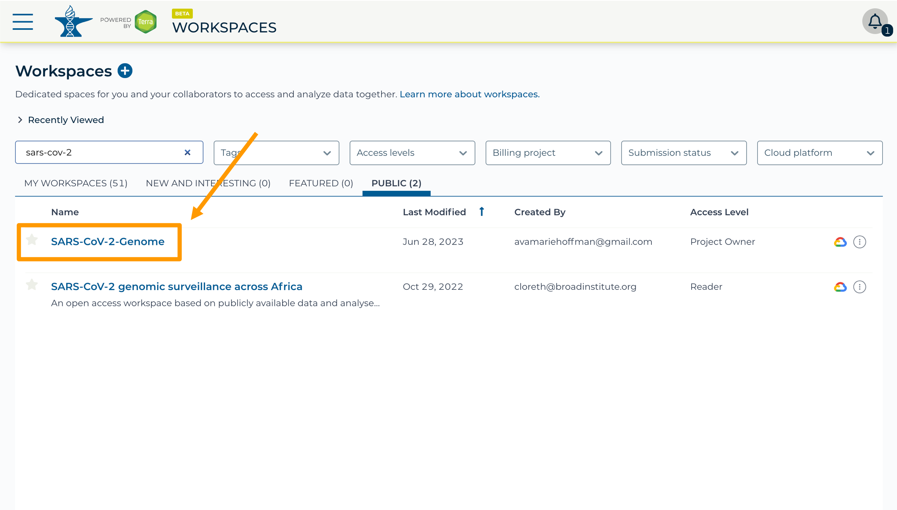
> 3. Clone the workspace by clicking the teardrop button and selecting “Clone”.
>    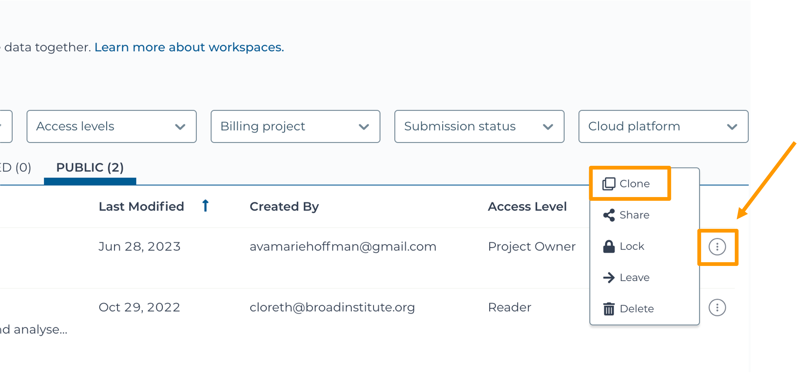
>   - In the new window, give your Workspace clone a name by adding an underscore (“_”) and your name.
>   - Next, select the Billing project provided by your instructor. 
>   - Leave the Description and Authorization Domain boxes as-is.
> 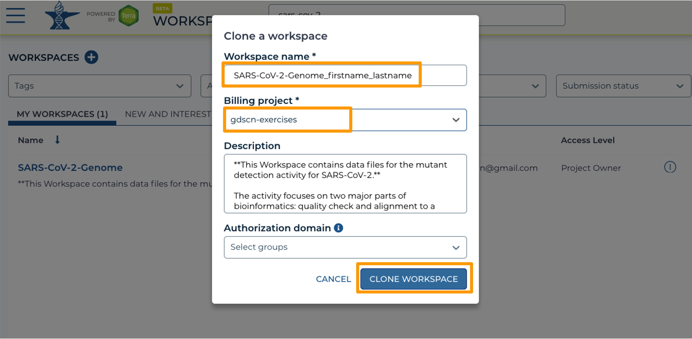
>   - Click “CLONE WORKSPACE”.
> 
{: .hands_on}

## Starting Galaxy

Galaxy is a great tool for performing bioinformatics analysis without having to update software or worry too much about coding. In order to use Galaxy, we need to create a cloud environment. This is like quickly renting a few computers from Google as the engine to power our Galaxy analysis. 

> <warning-title>Internet Browser</warning-title>
> Google Chrome is the most recommended browser to use AnVIL Galaxy cloud environments to operate as expected. Safari and Firefox may be used as well, though there may be some functionality that is not supported in these or other browsers.
{: .warning}

> <hands-on-title>Clone the Workspace </hands-on-title>
>
> 1. In your new Workspace, click on the “ANALYSES” tab. Next, click on “START”. You should see a popup window on the right side of the screen. 
> 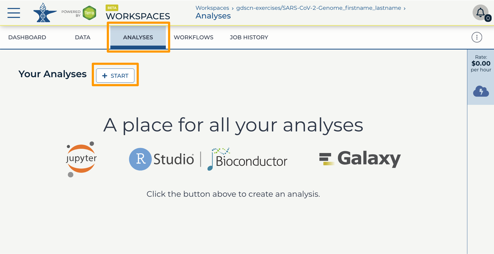
> 2. Click on the Galaxy logo to proceed.
>    - Click on “NEXT” and “CREATE” to keep all settings as-is.
>    - 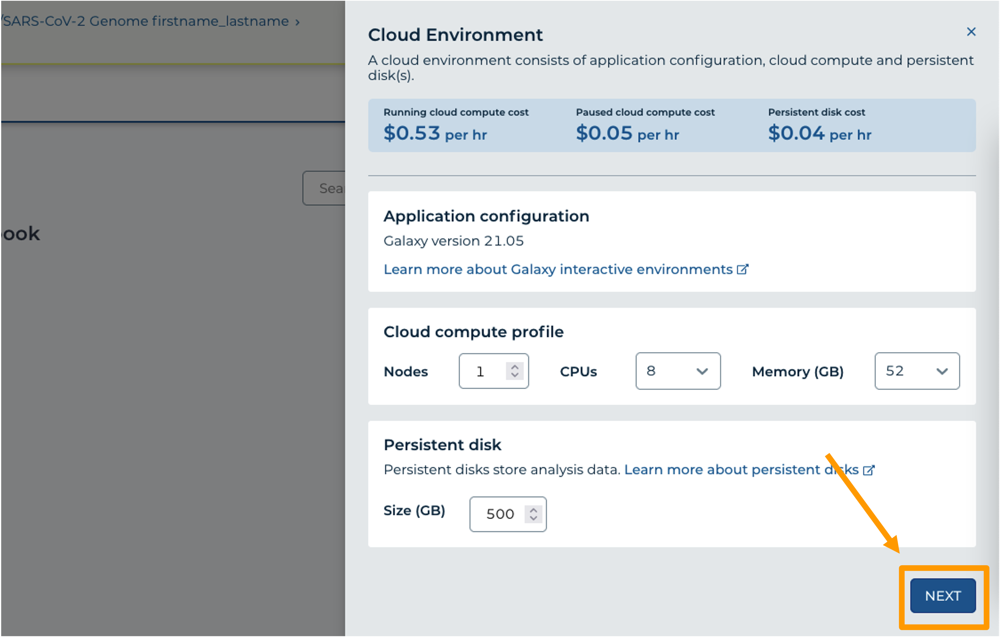
>    - 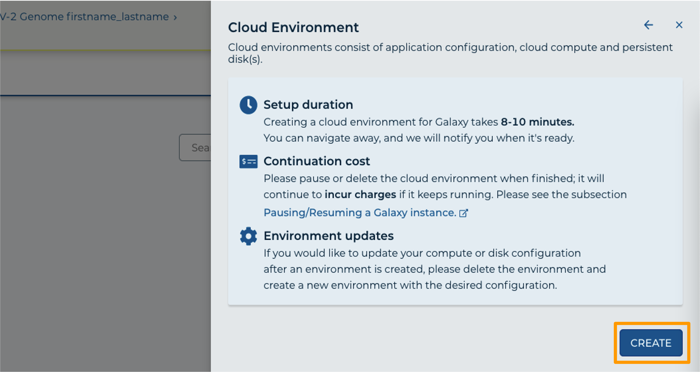
>    - Click on the Galaxy icon. You will see that the environment is still being set up. This will take 8-10 minutes. 
>    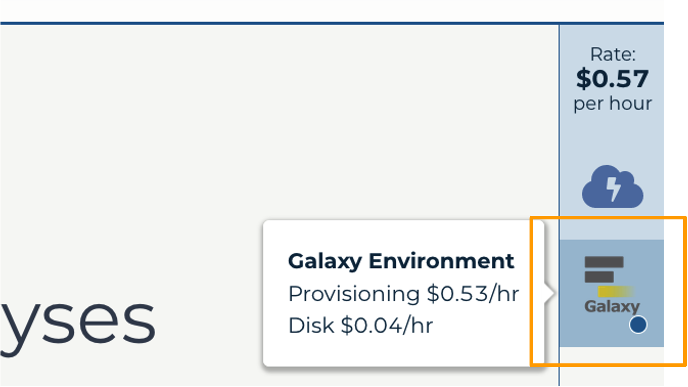
> 3. When it is done, click “Open”. You might need to refresh the page.
> 
{: .hands_on}

> <tip-title>Refresh</tip-title>
> Remember that you can refresh your browser or navigate away at any time. This is because the connection to the environment is in the cloud, not on your personal computer.
>
{: .tip}

You can also follow along with the first ~2 minutes of [this video](https://jhudatascience.org/AnVIL_Book_Getting_Started/starting-galaxy.html) to start Galaxy on AnVIL.

## Navigating Galaxy

Notice the three main sections.

**Tools** - These are all of the bioinformatics tool packages available for you to use.

**The Main Dashboard** - This contains flash messages and posts when you first open Galaxy, but when we are using data this is the main interface area.

**History** - When you start a project you will be able to see all of the documents in the project in the history. Now be aware, this can become very busy. Also the naming that Galaxy uses is not very intuitive, so you must make sure that you label your files with something that makes sense to you.

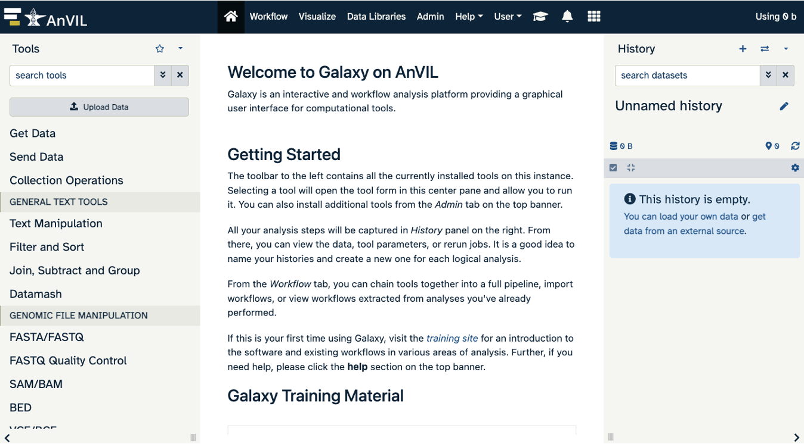

The welcome page includes links to tutorials. You may try these out on your own. If you want to try a new analysis this is a good place to start.

# Exercise One: Importing Data into Galaxy

Luckily, we linked to the original data when we cloned our Workspace! We have three files we will need for our activity. These are (1) the reference genome for SARS-CoV-2, and both forward (2) and reverse (3) reads for our sample. Our sample has two sets of reads because the scientists who collected it used paired-end sequencing. The reference genome ends in “.fasta” because it has already been cleaned up by scientists. The sample we are looking at ends in ".fastq" because it is raw data from the sequencer.

> <hands-on-title>Import Data from the Workspace</hands-on-title>
>
> 1. Click on Upload Data in the Tools pane.
> 2. Click on “Choose remote files” at the bottom of the popup. Double-click the top selection, which is the Workspace folder, then “Tables/” then “reference/”. Click the reference .fasta file so that it is highlighted in green and click “Ok”.
>    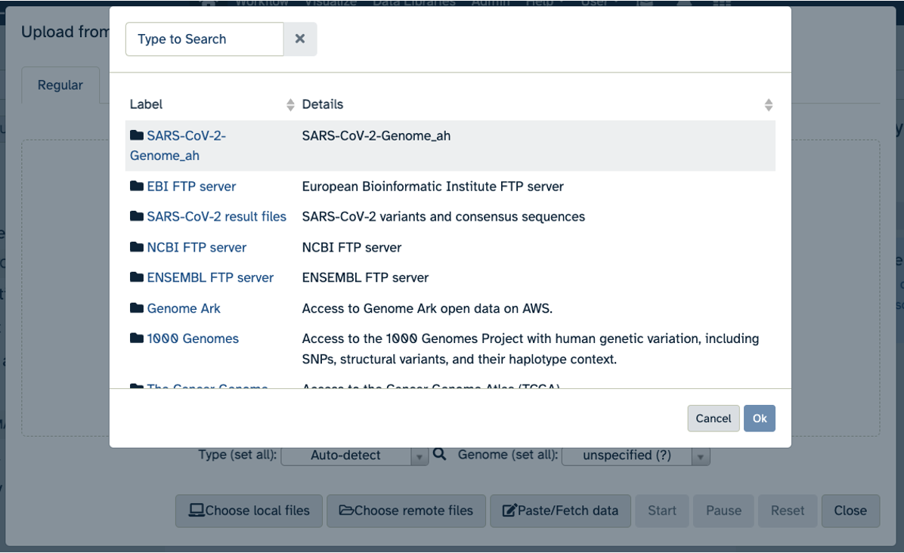
> 3. Now that your reference has been added, click “Choose remote files” again to add the two sample files. Double-click the Workspace folder, then “Tables/” then “samples/”. Click the two sample `fastq` files so that they are highlighted in green and click “OK”.
> 4. Click “Start” and once complete, you can click “Close”.
> 5. Confirm your upload worked by looking at the file names in the History pane.
> 
{: .hands_on}

# Exercise Two: Examining Files in Galaxy

Now we have some data in our account we can look at it. In this exercise we will see data in fastq format. This is the typical output from an Illumina Sequencer, but also the standard format for most alignment software.

## Examining Inputs

Use your mouse and click on the eye icon  of the first file `VA_sample_forward_reads.fastq`. In the Main screen you will see something like this:

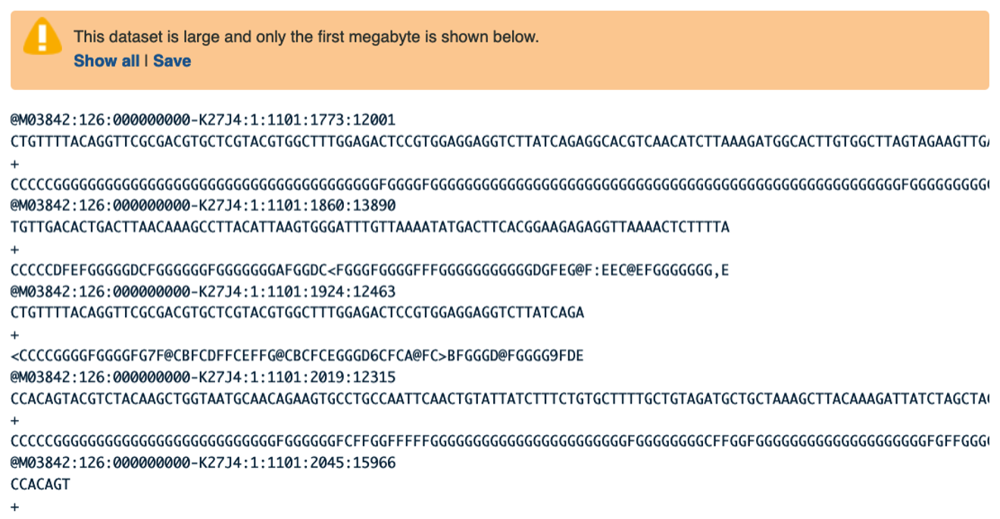

> <question-title></question-title>
>
> 1. How many lines in a .fastq file represent an individual read?
> 2. What does each line represent?
> 3. Why is the final line for each read (the quality score) important?
>
> > <solution-title></solution-title>
> >
> > 1. Four lines represent one read.
> > 2. The lines represent: 1 - A sequence identifier, 2 - The sequence (the base calls; A, C, T, G and N), 3 - A separator (not really data), 4 - The base call quality scores.
> > 3. It can help us filter out data that is wrong and/or low quality.
> >
> {: .solution}
{: .question}

## Quality Scoring

FastQC is a tool which aims to provide simple quality control checks on raw sequence data coming from high throughput sequencing pipelines. It provides a set of analyses which you can use to get a quick impression of whether your data has any problems of which you should be aware before doing any further analysis. 

> <hands-on-title>Determine the Quality of the Samples</hands-on-title>
>
> 1. Find  in the GENOMIC FILE MANIPULATION: FASTQ Quality Control tool folder.
>    -  *"Raw read data from your current history"*: `VA_sample_forward_reads.fastq`
> 2. Run the tool.
>
{: .hands_on}

The main dash will highlight in green if everything is okay. In the history, you will see the new files turn yellow, then green. If the job fails it will show an error. 

Click on the eye icon  in the new file in the history “FASTQC on data2 Webpage”. 

You will open up a summary report for the sequencing file:

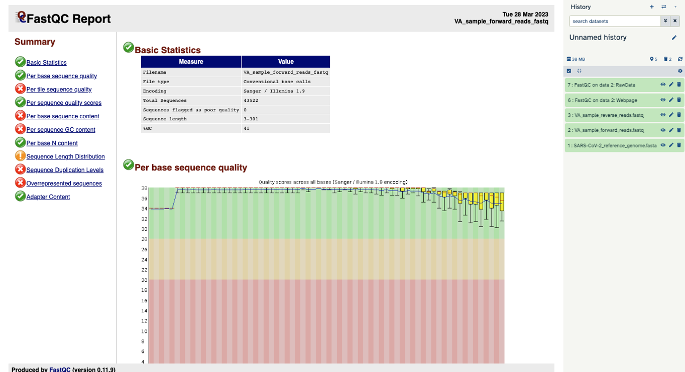

> <question-title></question-title>
>
> 1. Explore “Basic Statistics”. How many total reads are there? Have any been flagged as poor quality? What is the sequence length?
> 2. Explore “Per base sequence quality”. Based on the Basic Statistics, is 28-40 a good or bad quality score? 
> 3. Is it okay to proceed based on the per base sequence quality?
>
> > <solution-title></solution-title>
> >
> > 1. 43,522 reads. Zero flagged as poor quality. Sequence length is 3-301 base pairs.
> > 2. 28-40 is pretty good. 
> > 3. Yes, because the per base sequence quality is good (“in the green”).
> >
> {: .solution}
{: .question}



# Exercise Three: Alignment

Given that our data has passed some quality checks, we will try to align the data to the reference genome. In this case it is simple, a viral genome. A human sequencing project will generate much larger data sets. There are many aligners, but we will start off looking at a simple aligner BWA-MEM. This example uses paired data.

We will use our two SARS data files, which are ready for alignment.

- `VA_sample_forward_reads.fastq`
- `VA_sample_reverse_reads.fastq`

> <hands-on-title>Align to the Reference Dataset</hands-on-title>
>
> 1. Go to GENOMICS ANALYSIS and expand the Mapping menu. Select . This program will align your reads to your SARS reference genome. Some of our reads are >100 base pairs so we will use the MEM option. 
>    - *"Will you select a reference genome from your history or use a built-in index?"*: Use a genome from history and build index.
>    -  *"Use the following dataset as the reference sequence"*: `SARS-CoV-2_reference_genome.fasta`
>    - *"Single or Paired-end reads"*: `Paired`
>    - *"Select first set of reads"*: `VA_sample_forward_reads.fastq`
>    - *"Select second set of reads"*: `VA_sample_reverse_reads.fastq`
> 2. Run the tool.
>
{: .hands_on}

The output file is a `BAM` file, which lists where each read aligns to the reference genome and whether there are any differences. You can click the eye button to preview the results, but the results are not easy to interpret visually (much like the `fastq` files). Instead you will use a genome viewer in the next step.

> <question-title></question-title>
>
> 1. What is alignment software (for example, BWA-MEM) actually doing?
> 2. In this example, we are using paired fastq (“paired end”) data. What is an advantage of using paired data?
>
> > <solution-title></solution-title>
> >
> > 1. Alignment tools figure out the optimal positioning of the reads next to the reference genome to minimize mismatches and gaps. 
> > 2. Paired data is made up of fragments that are read twice (forward and reverse). Paired data improves data accuracy.
> >
> {: .solution}
{: .question}

# Viewing aligned data

We have aligned our data but it is currently a table of where the reads align. This is hard to read, so we will use [JBrowse](https://jbrowse.org/jbrowse1.html) to view the data.

> <hands-on-title>Visualize Reference Data</hands-on-title>
>
> 1. Scroll down in the Tools menu to STATISTICS AND VISUALIZATION. Under "Graph/Display Data", select .
>    -  *"Reference genome to display"*: `Use a genome from history` 
>    -  *"Select the reference genome"*: `SARS-CoV-2_reference_genome.fasta`
> 2. Click "Run Tool".
> 3. You should see a new JBrowse item appear in your history. Click the eye icon  to open JBrowse. 
>
{: .hands_on}

You will need to click on the magnifying glasses to zoom in, but you should see the A,C,G, and Ts and their corresponding colors that make up the SARS-CoV-2 genome!

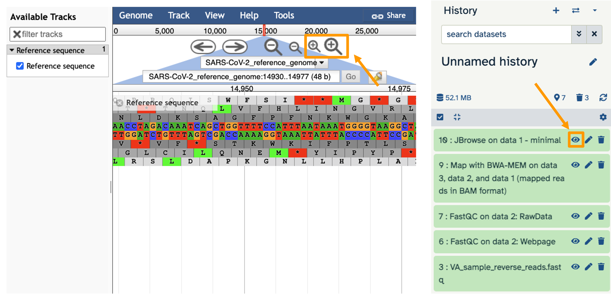

This is interesting, but it doesn’t let us compare the genome to the sample we have. We suspect there may be some differences that indicate our sample is the delta variant. 

> <hands-on-title>Visualize Aligned Data</hands-on-title>
>
> 1. Scroll down in the Tools menu to STATISTICS AND VISUALIZATION. Under "Graph/Display Data", select .
>    -  *"Reference genome to display"*: `Use a genome from history` 
>    -  *"Select the reference genome"*: `SARS-CoV-2_reference_genome.fasta`
>    -  *"+ Insert Track Group"*
>    -  *“+ Insert Annotation Track”*
>    -  *"Track Type"*: `BAM Pileups`
>    -  *"Autogenerate SNP Track"*: `Yes`
>    -  *"Maximum size of BAM chunks"*: Add one more zero: `50000000`
> 2. Click "Run Tool".
>
{: .hands_on}

You should see a new JBrowse item appear in your history. Click the eye icon  to open JBrowse. Make sure that all boxes are checked on the left side: “Available Tracks”. The tracks will show up in the order that you click on them.

> <hands-on-title>Visualize Aligned Data</hands-on-title>
>
> 1. Select the tracks from the BWA-MEM tool run.
>    -  `Map with BWA-MEM on data 9, data 8, and data 7 (mapped reads in BAM format)`
>    -  `Map with BWA-MEM on data 9, data 8, and data 7 (mapped reads in BAM format) - SNPs/Coverage`
> 2. You should see a new JBrowse item appear in your history. Click the eye icon  to open JBrowse. 
>
{: .hands_on}

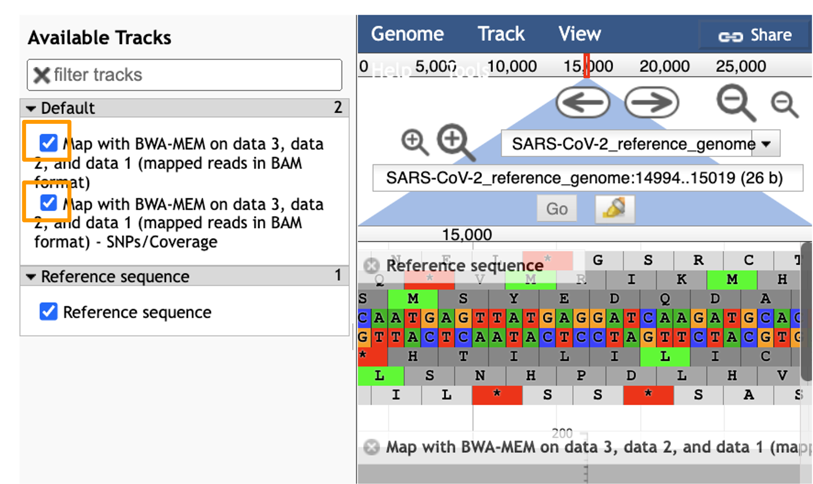

Let’s look at an example mutation in our sample. Type in the reference position “24410” and click “Go”. You should see a bunch of “A”s highlighted in green throughout our sample. The reference sequence (top line) is a “G” but all of the reads are an “A”. This means that our sample is genetically different from the established SARS-CoV-2 reference genome! Researchers often call these single base differences “SNPs” - Single Nucleotide Polymorphisms.

> <question-title></question-title>
>
> 1. How long is the SARS-CoV-2 genome? Hint: zoom out and scroll to the end of the genome.
> 2. Locate position 23,603. This is the site of an important mutation in the spike protein of the delta variant “P681R”. In this mutation, the amino acid proline is replaced by arginine. Is this mutation present at position 23,603 in our sample? Based on the evidence, do you think this sample is a delta variant?
>
> > <solution-title></solution-title>
> >
> > 1. ~29,904 bp
> > 2. Yes! C has become a G. Yes, this sample is probably a delta variant because this mutation is indicative of the delta variant.
> >
> {: .solution}
{: .question}

> <details-title>Sequencing errors</details-title>
>
> It’s possible to make mistakes in the data preparation before we get to the data analysis. Sometimes this happens when the samples are being prepared in the lab and sometimes this happens because the sequencer makes a mistake. This is one reason why quality scores are helpful. With millions of reads of data, it’s more likely that we see a “SNP” that is actually an accident. Multiple copies of the same areas of our data (“read depth”) help us be sure it’s a real SNP. When we compare across lots of aligned reads of the same area, we can determine the actual sequence by consensus. For example, we can be reasonably confident that the “G” at position 1,203 is just a sequencing or lab mistake.
>
{: .details}

# Export Your History

It’s a good idea to export your “History” so that your collaborators can see what you did. 

> <hands-on-title>Export History to Workspace</hands-on-title>
>
> 1. Click on the History Menu  and click on “Export History to File”.
>   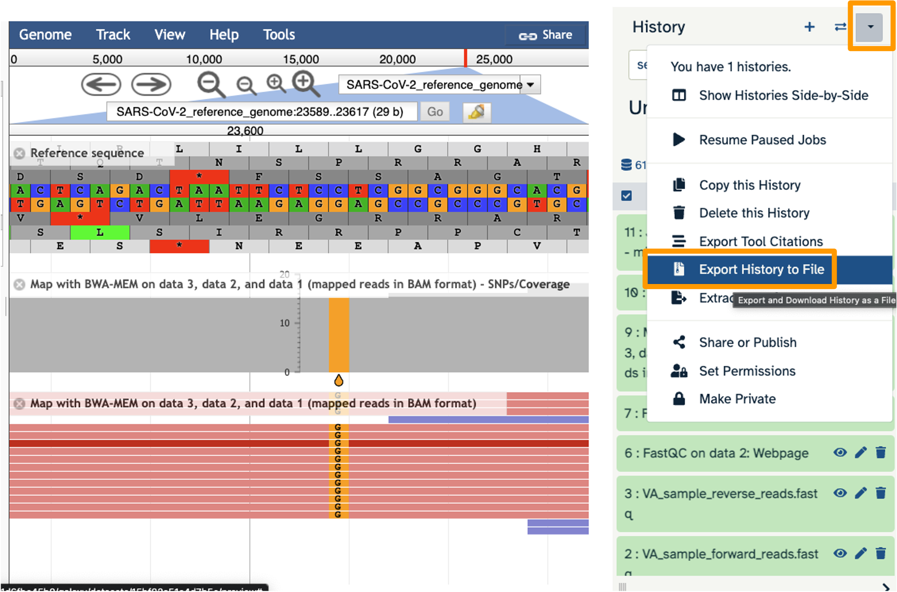
> 2. Make sure you select “to a remote file”. Then, click to select where to export your History. On the popup menu, select your Workspace name, then select “Other Data”. Finally, select “Files”. Then click “Select this folder”. Make sure the export directory looks correct. 
> 3. Next, name your history “SARS Galaxy Variant Detection” and click “Export”.
>   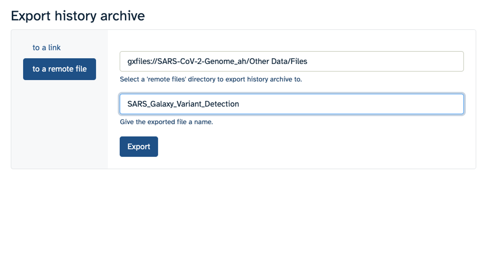
> 4. Back at your Workspace, click on the “Data” tab, and the Files folder. You should now see the History export in your files. If you click on the file, you can download it or view it in Google Cloud Storage Browser.
>   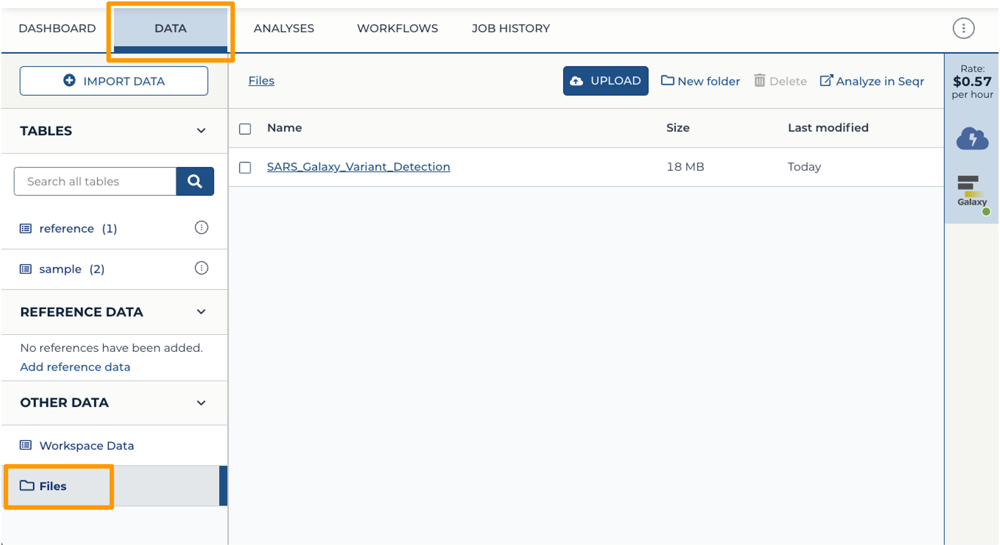
>
{: .hands_on}

# Wrap-up

Once you are done with the activity, you’ll need to shut down your Galaxy cloud environment. This frees up the cloud resources for others and minimizes computing cost. The following steps will delete your work, so make sure you are completely finished at this point. Otherwise, you will have to repeat your work from the previous steps.

> <hands-on-title>Shut Down Galaxy in AnVIL</hands-on-title>
> 1. Return to AnVIL, and find the Galaxy logo that shows your cloud environment is running. Click on the Galaxy logo.
>   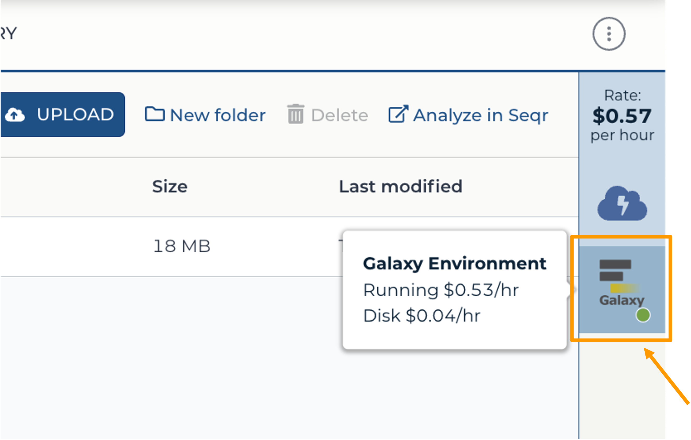
> 2. Click "Settings".
>   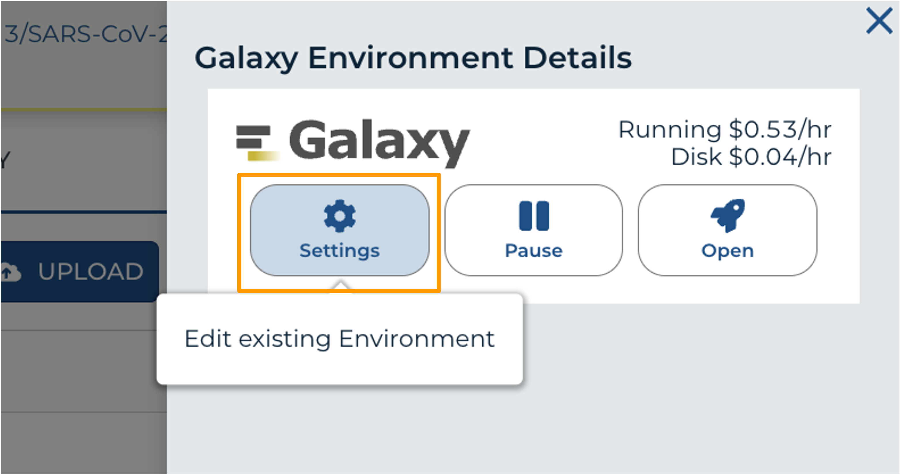
> 3. Next, scroll down and click on “DELETE ENVIRONMENT”:
>   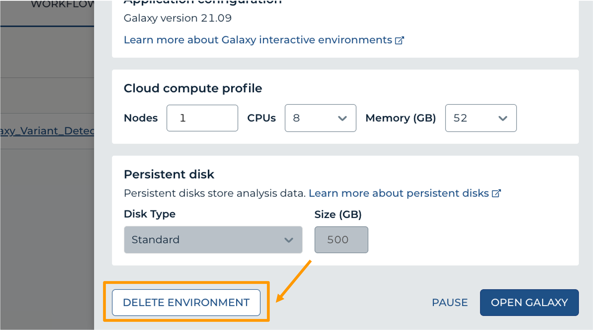
> 4. Finally, select “Delete everything, including persistent disk”. Make sure you are done with the activity and then click “DELETE”.
>    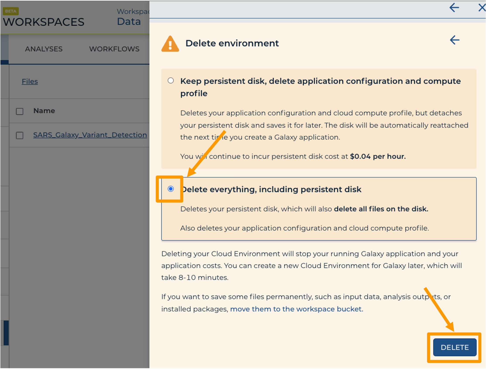
>
{: .hands_on}

# Conclusion
Congratulations! You have run your first analysis using Galaxy in the AnVIL platform!
