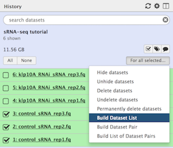
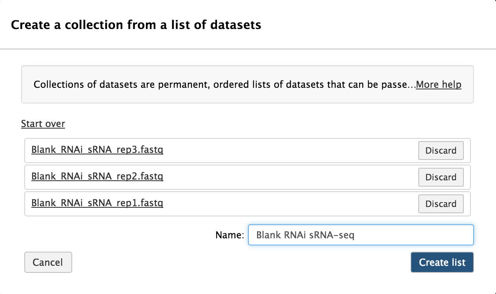
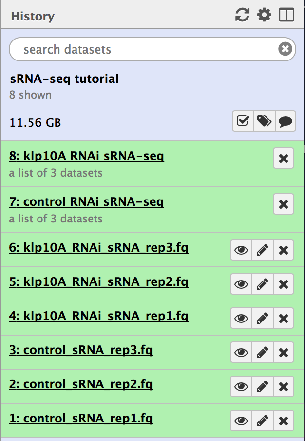

# Introduction

Small, noncoding RNA (sRNA) molecules, typically 21-31nt in length, are key features of post-transcriptional regulatory mechanisms governing gene expression. Through interactions with protein cofactors, these tiny sRNAs typically function by perfectly or imperfectly basepairing with substrate RNA molecules, and then eliciting downstream effects such as translation inhibition or RNA degradation. Different subclasses of sRNAs - e.g. microRNAs (miRNAs), Piwi-interaction RNAs (piRNAs), and endogenous short interferring RNAs (siRNAs) - exhibit unique characteristics, and their relative abundances in biological contexts can indicate whether they are active or not. In this tutorial, we will examine expression of the piRNA subclass of sRNAs and their targets in *Drosophila melanogaster*.

The data used in this tutorial are from polyphosphatase-treated sRNA sequencing (sRNA-seq) experiments in *Drosophila*. The goal of this study was to determine how piRNA and piRNA target expression changes in flies mutant for Kinesin-like protein at 10A (*klp10A*). To that end, in addition to sRNA-seq, mRNA-seq experiments were performed to determine whether targets of differentially expressed piRNAs were also differentially expressed. Because of the long processing time for the large original files - which contained 7-22 million reads each - we have downsampled the original input data to include only reads that align to the X-chromosome.

# Analysis strategy

In this exercise we will identify what small RNAs, specifically piRNAs, are present in flies treated with *klp10A* or control RNAi. In this study, biological triplicate sRNA- and mRNA-seq libraries were sequenced for both RNAi conditions. After removing contaminant ribosomal RNA (rRNA) and miRNA reads, we will quantify piRNA abundances from sequenced reads and test for differentially expressed piRNAs. We will follow a popular piRNA analysis pipeline developed by the Phillip Zamore Lab and the ZLab (Zhiping Weng) at UMass Med School called [PiPipes](https://github.com/bowhan/piPipes). Although PiPipes was developed for analysis of piRNAs, many of the basical principles can be applied to other classes of small RNAs. 

It is of note that this tutorial uses datasets that have been de-multiplexed so that the input data files are a single FASTQ formatted file for each sample. Because sRNAs are typically much smaller than fragments generated for RNA-seq or other types of deep sequencing experiments, single-end sequencing strategies are almost always used to sequence sRNAs. This tutorial uses the *Collections* feature of Galaxy to orgainze each set of replicates into a single group, making tool form submission easier.

> ### Agenda
>
> In this tutorial, we will address:
>
> 1. Data upload and organization
> 1. Read quality checking
> 1. Adaptor trimming
> 1. Hierarchical read alignment to remove rRNA/miRNA reads
> 1. Small RNA subclass distinction
> 1. piRNA abundance estimation
> 1. piRNA differential abundance testing
> 1. Small RNA and mRNA integration
> 1. Visualization
> 1. Conclusion

## Data upload and organization

Due to the large size of the original sRNA-seq datasets, we have downsampled them to only inlcude reads mapping to the *Drosophila* X-chromsome. These datasets are avaialble at [`Zenodo`](https://zenodo.org/record/####), where you can find the FASTQ files corresponding to replicate sRNA-seq and mRNA-seq libraries and additiona annotation files for the *Drosophila melanogaster* genome version dm3.

> ### :pencil2: Hands-on: Data upload and organization
>
> 1. Create a new history and name it something meaningful (*e.g.* sRNA-seq tutorial)
> 1. Open the Data Upload Manager by selecting *Get Data* from the Tool Panel and clicking *Upload File*
> 1. Select *Paste/Fetch Data*
> 1. Copy each link for the 6 read (.fq), 1 annotation (.gtf), and 2 reference sequence (.fa) files, and paste each link into a separate text field
>    - Set the datatype of the read (.fq) files to **fastq**
>    - Set the datatype of the annotation (.gtf) file to **gtf** and assign the Genome as **dm3**
>    - Set the datatype of the reference (.fa) files to **fasta** and assign the Genome as **dm3**
> 1. Click *Start*
> 1. Rename the files in your history to something meaningful (*e.g.* control_sRNA_rep1.fq)
> 1. Build a *Dataset list* for each set of replicate FASTQ files
>    - Click the *Operations on multiple datasets* check box at the top of the history panel
>    - Check the three boxes next to the control RNAi (control) sRNA-seq samples
>    - Click *For all selected...* and choose *Build dataset list*
>    - 
>    - Ensure that only the three control samples are selected, and enter a name for the new collection (*e.g.* control RNAi sRNA-seq)
>    - 
>    - Click *Create list*
>    - Repeat for the three *klp10A* RNAi samples
>    - 
>
> {: .hands_on}

## Read quality checking

Read quality scores (phred scores) in FASTQ-formatted data can be encoded by one of a few different encoding schemes. Most Galaxy tools assume that input FASTQ files are using the Sanger/Illumina 1.9 encoding scheme. If the input FASTQ files are using an alternate encoding scheme, then some tools will not interpret the quality score encodings correctly. It is good practice to confirm the quality encoding scheme of your data and then convert to Sanger/Illumina 1.9, if necessary. We can check the quality encoding scheme using the [FastQC](http://www.bioinformatics.babraham.ac.uk/projects/fastqc/) tool (further described in the [NGS-QC tutorial](../../NGS-QC/tutorials/dive_into_qc)).

> ### :pencil2: Hands-on: Quality checking
>
> 1. **FastQC** :wrench:: Run `FastQC` on each collection of FASTQ read files to assess the overall read/base quality and quality score encoding scheme using the following parameters:
>    - **Short read data from your current history**: Click the "Dataset collection" tab and then select the control RNAi sRNA-seq dataset collection
> 1. Click "Execute"
>    
> 1. Repeat for the *klp10A* RNAi dataset collection
>
>    > ### :question: Questions
>    >
>    > 1. What quality score encoding scheme is being used for each sample?
>    > 1. What is the read length for each sample?
>    > 1. What does the base/read quality look like for each sample?
>    > 1. Are there any adaptors present in these reads? Which one(s)?
>    >
>    >    

>    >    
Click to view answers

>    >    <ol type="1">
>    >    <li>All samples use the Illumina 1.5 quality encoding scheme. We will need to convert to Sanger/Illumina 1.9. </li>
>    >    <li>All samples have a read length of 51 nt. </li>
>    >    <li>The base quality across the entire length of the reads is good (phred score > 28 for the most part). </li>
>    >    <li>Yes, "Illumina Small RNA 3' Adapters" are present. </li>
>    >    </ol>
>    >    

>    {: .question}
>
>    
>
> 1. **FASTQ Groomer** :wrench:: Run `FASTQ Groomer` on each collection of FASTQ read files to convert the quality scores from Illumina 1.5 to Sanger/Illumina 1.9 encoding using the following parameters:
>    - **File to groom**: Click the "Dataset collection" tab and then select the control RNAi sRNA-seq dataset collection
>    - **Input FASTQ quality scores type**: Illumina 1.3-1.7
> 1. Click "Execute"
> 1. Repeat for the *klp10A* RNAi dataset collection
>
>    
>
> {: .hands_on}

After `FASTQ Groomer` finishes, click on the groomed control RNAi sRNA-seq dataset collection and then click on the name of one of the datasets. You should see that the format is **fastqsanger** instead of **fastq**, meaning we have successfully converted the quality score encoding scheme.

If we go back to the `FASTQC` output and scroll down to the "Adapter Content" section, we can see that Illumina Small RNA adapters are present in **~80%** of our reads. The next step is to remove these artificial adaptors because they are not part of the biological sRNAs. If a different adapter is present, you can update the **Adapter sequence to be trimmed off** in the `Trim Galore!` step.

## Adaptor trimming

sRNA-seq library preparation involves adding an artificial adaptor sequence to both the 5' and 3' ends of the small RNAs. While the 5' adaptor anchors reads to the sequencing surface and thus are not sequenced, the 3' adaptor is typically sequenced immediately following the sRNA sequence. In the example datasets here, the 3' adaptor sequence is `TGGAATTCTCGGGTG`, and needs to be removed from each read before aligning to a reference. We will be using the Galaxy tool `Trim Galore!` which implements the [`cutadapt`](https://cutadapt.readthedocs.io/en/stable/) tool for adapter trimming.

> ### :pencil2: Hands-on: Adaptor trimming
>
> 1. **Trim Galore!** :wrench:: Run `Trim Galore!` on each collection of FASTQ read files to remove Illumina adapters from the 3' ends of reads with the following parameters:
>    - **Is this library paired- or single-end?**: Single-end
>    - **Reads in FASTQ format**: Click the "Dataset collection" tab and then select the control RNAi sRNA-seq dataset
>    - **Trimming reads?**: User defined adapter trimming
>    - **Adapter sequence to be trimmed off**: TGGAATTCTCGGGTG
>    - **Trim Galore! advanced settings**: Full parameter list
>    - **Trim low-quality ends from reads in addition to adapter removal**: 0
>    - **Overlap with adapter sequence required to trim a sequence**: 6
>    - **Discard reads that became shorter than length INT**: 12
>    - **Generate a report file**: Yes
>
>    
>
> 1. Click "Execute"
> 1. Repeat for the *klp10A* RNAi dataset collection
>
>    We don't want to trim for quality because the adapter-trimmed sequences represent a full small RNA molecule, and we want to maintain the integrity of the entire molecule. We increase the minimum read length required to keep a read because small RNAs can potentially be shorter than 20 nt (the default value). We can check out the report file for any sample and see the command for the tool, a summary of the total reads processed and number of reads with an adapter identified, and histogram data of the length of adaptor trimmed. We also see that a very small percentage of low-quality bases have been trimmed
>
> 1. **FastQC** :wrench:: Run `FastQC` on each collection of trimmed FASTQ read files to assess whether adapters were successfully removed.
>
>    > ### :question: Questions
>    >
>    > 1. What is the quality encoding scheme?
>    > 1. What is the read length?
>    > 1. Are there any adaptors present in these reads? Which one(s)?
>    >
>    >    

>    >    
Click to view answers

>    >    <ol type="1">
>    >    <li>All samples are using the Sanger/Illumina 1.9 quality encoding scheme.</li>
>    >    <li>The read lengths range from 12 to 51 nt after trimming.</li>
>    >    <li>No, Illumina Small RNA 3' Adaptors are no longer present. No other adapters are present.</li>
>    >    </ol>
>    >    

>    {: .question}
>
> 
>
> {: .hands_on}

Now that we have converted to *fastqsanger* format and trimmed our reads of the Illumina Small RNA 3' adaptors, we will align our trimmed reads to reference *Drosophila* rRNA and miRNA sequences (dm3) to remove these artifacts. Interestingly, *Drosophila* have a short 2S rRNA sequence that is 30nt long and typically co-migrates with sRNA populations during gel electrophoresis. rRNAs make up a very large proportion of all non-coding RNAs, and thus need to be removed. We also want to remove any miRNA sequences, as these are not relevant to our analysis. After removing rRNA and miRNA reads, we will analyze the remaining reads as siRNA and piRNA sequences.

## Hierarchical read alignment to remove rRNA/miRNA reads

To quantify small RNA abundance and identify their putative targets, we need to know where the sequenced reads align to a reference genome. In the case of a eukaryotes, some small RNAs are transcribed from mRNA templates, which means that some small RNAs can originate from an exon-exon (spliced) boundary. Therefore, a splice-aware aligner must be used to account for this possibility. [`HISAT2`](https://ccb.jhu.edu/software/hisat2/index.shtml) is an accurate and fast tool for aligning spliced reads to a genome, and we will be using `HISAT2` for aligning to rRNA and miRNA references sequences.

> ### :pencil2: Hands-on: Heirarchical alignment to rRNA and miRNA reference sequences
>
> 1. **HISAT2** :wrench:: Run `HISAT2` on each collection of trimmed reads to align to reference rRNA sequences with the following parameters:
>    - **Single end or paired reads?**: Individual unpaired reads
>    - **Reads**: Click the "Dataset collection" tab and then select the control RNAi sRNA-seq dataset of trimmed FASTQ files
>    - **Source for the reference genome to align against**: Use a genome from history
>    - **Select the reference genome**: Dmel_rRNA_sequences.fa
>    - **Spliced alignment parameters**: Specify spliced alignment parameters
>    - **Specify strand-specific information**: First Strand (R/RF)
>
>       
>
> 1. Click "Execute"
> 1. Repeat for the *klp10A* RNAi dataset collection
>
>    We now need to extract the *unaligned* reads from the output BAM file for aligning to reference miRNA sequences. We can do this by using the `Filter SAM or BAM, output SAM or BAM` tool to obtain reads with a bit flag = 4 (meaning the read is unaligned) and then converting the filtered BAM file to FASTQ format with the `Convert from BAM to FastQ` tool.
>
> 1. **Filter SAM or BAM, output SAM or BAM** :wrench:: Run `Filter SAM or BAM, output SAM or BAM` on each collection of HISAT2 output BAM files with the following parameters:
>    - **SAM or BAM file to filter**: Click the "Dataset collection" tab and then select the control RNAi sRNA-seq dataset of aligned HISAT2 BAM files
>    - **Filter on bitwise flag**: Yes
>    - **Only output alignments with all of these flag bits set**: Check the box next to "The read in unmapped"
>
> 1. Click "Execute"
> 1. Repeat for the *klp10A* RNAi dataset collection
>
> 1. **Convert from BAM to FastQ** :wrench:: Run `Convert from BAM to FastQ` on each collection of filtered HISAT2 output BAM files with the following parameters:
>    - **Convert the following BAM file to FASTQ**: Click the "Dataset collection" tab and then select the control RNAi sRNA-seq dataset of filtered HISAT2 BAM files
>
> 1. Click "Execute"
> 1. Repeat for the *klp10A* RNAi dataset collection
>
>    Next we will align the non-rRNA reads to a known set of miRNA hairpin sequences to remove miRNA reads.
>
> 1. **HISAT2** :wrench:: Run `HISAT2` on each collection of filtered HISAT2 output FASTQ files to align non-rRNA reads to reference miRNA hairpin sequences using the following parameters:
>    - **Single end or paired reads?**: Individual unpaired reads
>    - **Reads**: Click the "Dataset collection" tab and then select the control sRNA-seq dataset of non-rRNA FASTQ files
>    - **Source for the reference genome to align against**: Use a genome from history
>    - **Select the reference genome**: Dmel_miRNA_sequences.fa
>    - **Spliced alignment parameters**: Specify spliced alignment parameters
>    - **Specify strand-specific information**: First Strand (R/RF)
> 1. Click "Execute"
> 1. Repeat for the *klp10A* RNAi dataset collection
>
>       
>
>    Again, we need to extract *unaligned* reads from the output BAM files. To do this, repeat the `Filter SAM or BAM, output SAM or BAM` and `Convert from BAM to FastQ` steps for each dataset collection. Finally, rename the converted FASTQ files something meaningful (*e.g.* "non-r/miRNA control RNAi sRNA-seq").
>
> {: .hands_on}

## Small RNA subclass distinction

In *Drosophila*, siRNAs are typically 20-22nt long while piRNAs are typically 23-29nt long. We want to analyze these sRNA subclasses independently, so next we are going to filter the non-r/miRNA reads based on length using the `Manipulate FASTQ` tool.

> 1. **Manipulate FASTQ** :wrench:: Run `Manipulate FASTQ` on each collection of non-r/miRNA reads to identify siRNAs (20-22nt) using the following parameters.
>    - **FASTQ File**: Click the "Dataset collection" tab and then select the control RNAi sRNA-seq dataset of non-r/miRNA FASTQ files
>    - **Match Reads**: Click "Insert Match Reads"
>    - **Match Reads by**: Set to "Sequence Content"
>    - **Match by**: Enter: ^.{12,19}$|^.{23,51}$
>    - **Manipulate Reads**: Click "Insert Manipulate Reads"
>    - **Manipulate Reads on**: Set to "Miscellaneous actions"
>    - **Miscellaneous Manipulation Type**: Set to "Remove Read"
> 1. Click "Execute"
> 1. Repeat for the *klp10A* RNAi dataset collection
> 1. Rename each resulting dataset collection something meaningful (*i.e.* "control RNAi - siRNA reads (202-2nt)")
>
>    The regular expression in the **Match by** parameter tells the tool to identify sequences that are length 12-19 or 23-51 (inclusive), and the **Miscellaneous Manipulation Type** parameter tells the tool to remove these sequences. What remains are sequences of length 20-22nt. We will now repeat these steps to identify 23-29nt piRNA sequences.
>
> 1. **Manipulate FASTQ** :wrench:: Run `Manipulate FASTQ` on each collection of non-r/miRNA reads to identify piRNAs (23-29nt) using the following parameters.
>    - **FASTQ File**: Click the "Dataset collection" tab and then select the control RNAi sRNA-seq dataset of non-r/miRNA FASTQ files
>    - **Match Reads**: Click "Insert Match Reads"
>    - **Match Reads by**: Set to "Sequence Content"
>    - **Match by**: Enter: ^.{12,22}$|^.{30,51}$
>    - **Manipulate Reads**: Click "Insert Manipulate Reads"
>    - **Manipulate Reads on**: Set to "Miscellaneous actions"
>    - **Miscellaneous Manipulation Type**: Set to "Remove Read"
> 1. Click "Execute"
> 1. Repeat for the *klp10A* RNAi dataset collection
> 1. Rename each resulting dataset collection something meaningful (*i.e.* "control RNAi - piRNA reads (23-29nt)")
>
> 1. **FastQC** :wrench:: Run `FastQC` on each collection of siRNA and piRNA read files to confirm the correct read lengths.
>
> {: .hands_on}

Interestingly, for the piRNA sequences (23-29nt), the "Per base sequence content" output of `FastQC` indicates a high prevalence for the T nucleotide (really U in RNA) at the first position of the reads (~70% of reads). This agrees with a known bias for 5' Us in the piRNAs that are bound by their major protein cofactor, PIWI [cite]. Additionally, we observe a less pronounced prevalence for the A nucleotide at position 10 of the reads (~35% of reads), which agrees with a known bias for 10A in secondary piRNAs [cite].

The next step in our analysis pipeline is to identify which RNA features the siRNAs and piRNAs align to. Most fly piRNAs originate from and thus align to transposable elements (TEs) but some also originate from genome piRNA clusters or protein-coding genes. Ultimately, we want to know whether a feature (TE, cluster, pcRNA, etc.) has fewer or more piRNAs targeting it. To determine this, we will use `salmon` to simultaneously align and quantify piRNA reads against known target sequences to estimate piRNA abundance per target. For the remainder of the tutorial we will be focusing on piRNAs, but similar approaches can be done for siRNAs.

## piRNA abundance estimation

We want to identify which piRNAs are differentially abundance between the control and *klp10A* RNAi conditions. To do this we will implement a counting approach using `Salmon` to quantify piRNAs per genome feature (TEs in this case). Then we will provide this information to `DESeq2` to generate normalized counts and significance testing for differential expression.

> ### :pencil2: Hands-on: piRNA abundance estimation
>
> **TODO**
>
> 1. **Salmon** :wrench:: Run `Salmon` on each collection of piRNA reads (23-29nt) to quantify the abundance of piRNAs at relevant targets. We will focus on abundance of piRNAs on transposable elements
>    - **Select a reference transcriptome from your history or use a built-in index?**: Use one from the history
>    - **Select the reference transcriptome**: Select the reference TE fasta file
>    - **The size should be odd number**: 21
>    - **FASTQ/FASTA file**: Click the "Dataset collection" tab and then select the control RNAi piRNA (23-29nt) reads
>    - **Specify the strandedness of the reads**: read 1 (or single-end read) comes from the reverse strand (SR)
> 1. Click "Execute"
> 1. Repeat for the *klp10A* RNAi piRNA (23-29nt) reads dataset collection
>
> {: .hands_on}

## piRNA differential abundance testing

[`DESeq2`](https://bioconductor.org/packages/release/bioc/html/DESeq2.html) is a great tool for differential expression analysis. It takes unnormalized estimated read counts produced by `Salmon` and applies size factor normalization. Salmon provides estimate read counts which sometimes are reported as fractions. `DESeq2` expectes rounded integers as input, so we need to do two text manipulation steps to prepare our `Salmon` output for use with `DESeq2`.

> ### :pencil2: Hands-on: piRNA abundance estimation
>
> 1. **Compute** :wrench:: Run `Compute` to add column of rounded estimate Counts
> 1. **Cut** :wrench:: Run `cut` to select just the first (feature_id) and last (rounded_counts) columns
> 1. **DESeq2** :wrench:: Run `DESeq2` to test for differential abundance of piRNAs at the TE features
> 1. **Filter** :wrench:: Run `Filter` to extract feature with a significantly higher piRNA abundance (adjusted *p*-value less than 0.05, log2FC greater than 0) in the *klp10A* RNAi condition.
> 1. **Filter** :wrench:: Run `Filter` to extract feature with a significantly lower piRNA abundance (adjusted *p*-value less than 0.05, log2FC less than 0) in the *klp10A* RNAi condition.
>
>    > ### :question: Question
>    >
>    > How many features have a significant increase and decrease in piRNA abundance in the *klp10A* RNAi condition?
>    >
>    > 

>    > 
Click to view answers

>    > To filter, use "c7 lessthan 0.05". And we get ## features with a significant change in mapped small RNAs.
>    > 

>    {: .question}
>
> {: .hands_on}

For more information about `DESeq2` and its outputs, you can have a look at [`DESeq2` documentation](https://www.bioconductor.org/packages/release/bioc/manuals/DESeq2/man/DESeq2.pdf).

## Small RNA and mRNA integration

**TODO**

## Visualization

Now that we have a list of transcript expression levels and their differential expression levels, it is time to visually inspect our transcript structures and the reads they were predicted from. It is a good practice to visually inspect (and present) loci with transcripts of interest. Fortuantely, there is a built-in genome browser in Galaxy, **Trackster**, that make this task simple (and even fun!).

In this last section, we will convert our aligned read data from BAM format to bigWig format to simplify observing where our stranded RNA-seq data aligned to. We will then initiate a session on Trackster, load it with our data, and visually inspect our interesting loci.

> ### :pencil2: Hands-on: Visualizing data on genome browser
>
> 1. **bamCoverage** :wrench:: Run `bamCoverage` on each dataset collection `HISAT` output with the following parameters:
>
>    - **TODO**
>
> 1. **Viz** :wrench:: On the center console at the top of the Galaxy interface, choose " Visualization" -> "New track browser"
>
>    - **TODO**
>
> {: .hands_on}

## Conclusion

**TODO**

