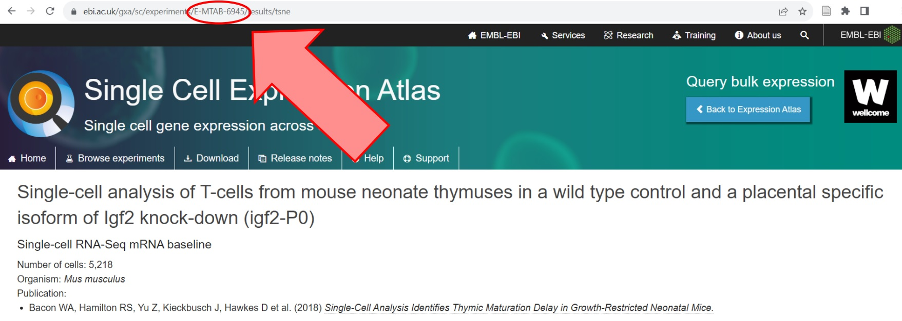
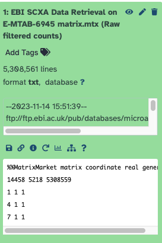
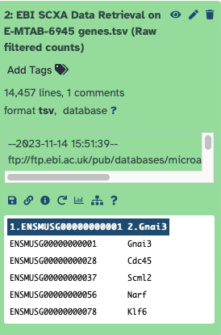
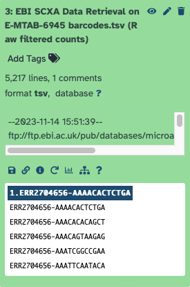
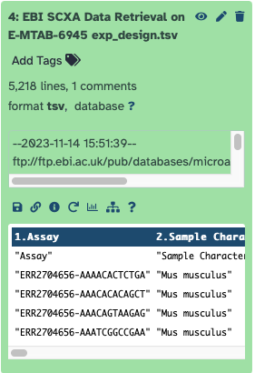
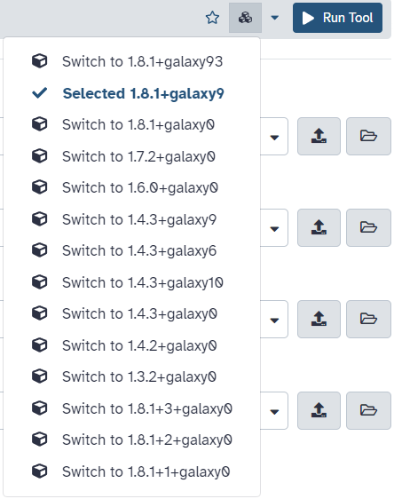
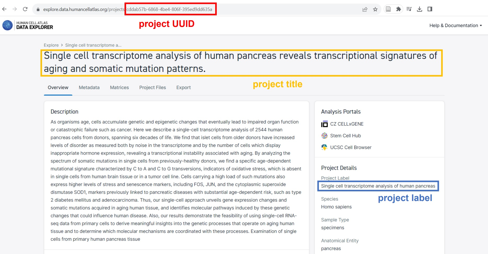

# Introduction

Public single cell datasets seem to accumulate by the second. Well annotated, quality datasets are slightly trickier to find, which is why projects like the [Single Cell Expression Atlas](https://www.ebi.ac.uk/gxa/sc/home) (SCXA) exist - to curate datasets for public use. Here, we will guide you through transforming data imported from the SCXA repository into the input file required for the [Filter, Plot, Explore tutorial]() and we will also show how to use the public atlases for your own research. 

> <agenda-title></agenda-title>
>
> In this tutorial, we will cover:
>
> 1. TOC
> {:toc}
>
{: .agenda}

# Getting data from the Single Cell Expression Atlas

Galaxy has a specific tool for importing data from the SCXA (), which combines all the preprocessing steps shown in [the corresponding tutorial]() into one! For this tutorial, the dataset can be seen [at the EBI](https://www.ebi.ac.uk/gxa/sc/experiments/E-MTAB-6945/downloads) with experiment ID of `E-MTAB-6945`.

> <details-title> How to access other experiments? </details-title>
>
> You can search datasets according to various criteria either using search box in **Home** tab or choosing kingdom, experiment collection, technology type (and others) in **Browse experiments** tab. When you find the experiment you are interested in, just click on it and the experiment ID will be displayed in the website URL, as shown below.
>
> 
>
> Once you know the experiment ID, you can use EBI SCXA Data Retrieval tool in Galaxy!
> 
{: .details}

> <hands-on-title>Retrieving data from Single Cell Expression Atlas</hands-on-title>
>
> 1.  with the following parameters:
>      - *"SC-Atlas experiment accession"*: `E-MTAB-6945`
>      - *"Choose the type of matrix to download"*: `Raw filtered counts`
>
{: .hands_on}

It's important to note that this matrix is processed somewhat through the SCXA pipeline, which is quite similar to the pre-processing that has been shown in this case study tutorial series. The resultant datasets contain any and all metadata provided by the SCXA pipeline as well as the metadata contributed by the original authors (for instance, more cell or gene annotations). So while the AnnData object generated at the end of this tutorial will be similar to that generated using the [Alevin workflows]() on the original FASTQ files, some of the metadata will be slightly different. Relevant results and interpretation will not change, however!

## Examine the imported files

> <question-title></question-title>
>
> 1. What format has this tool imported?
>
> > <tip-title></tip-title>
> >
> > Selecting the title of each resultant dataset will expand the dataset in the Galaxy history.
> {: .tip}
> > <solution-title></solution-title>
> >
> > Matrix Market Format! We can tell this because our first file helpfully says `MatrixMarket` in the first line.
> > 
> >
> > This  `matrix.mtx` file, in Matrix Market format, contains a column referring to each gene (column 1), to each cell (column 2), and the expression values themselves in the final column. To be useful, then, we need to know which genes and cells the numbers are referring to. That's why this format comes with two more files.
> >
> > 
> >
> > The  `genes.tsv` file lists each EnsemblID and its gene name. The lines (14,457) corresponds with the 14458 in the Matrix file...but the 14458 contains a header, so that's why it has one more than the genes file!
> >
> > 
> >
> > The  `barcodes.tsv` file lists each barcode. The lines (5,217) again correspond with the 5,218 lines in the Matrix file...which adds in the header again!
> >
> > 
> >
> > Finally, and helpfully, the tool also includes cell metadata where the `Assay` column corresponds with the barcodes in the  `barcodes.tsv` file. While this is not a required file to create an AnnData object from the three matrix market files, it is extremely necessary for actually interpreting the data. Imagine not knowing which barcodes came from which sample!
> >
> {: .solution}
{: .question}

## Metadata manipulation

At this point you might want to do some modifications in the files before downstream analysis. That can include re-formating the cell metadata or changing the names of the column headers, it all depends on your dataset and how you want to perfrom your analysis. It's also fine to transform those files straight away. Here, we will show an extended version of metadata manipulation which allows us to create an input file consistent with [the next tutorial]() workflow.

Before creating an AnnData object, we need to make a small modification in experimental design table. The dataset contains information about the 7 experimental samples (N701 – N707). However, in the  `exp_design.tsv` dataset, which contains the cell metadata, these samples are just numbered from 1 to 7.

> <details-title>How did we know this?</details-title>
>
> You can preview this column in the the  `exp_design.tsv` dataset by selecting the  in the  Galaxy history. If you scroll to the right, and move to the column `Sample Characteristic[individual]`, you will find the batch information. Don't worry, we're about to rename and reformat this whole dataset to more useful titles. Make a note of the number of that column - number 12 - as we will need it to change the batch number to a batch name shortly.
>
{: .details}

The plotting tool that we will use later will fail if the entries are integers and not categorical values, so we will change `1` to `N01` and so on.

> <hands-on-title> Change batch numbers into names </hands-on-title>
>
> 1. Change the datatype of  `EBI SCXA Data Retrieval on E-MTAB-6945 exp_design.tsv` to `tabular`:
>
>    
>
> 2.  with the following parameters:
>    -  *"Select cells from"*: `EBI SCXA Data Retrieval on E-MTAB-6945 exp_design.tsv`
>    - *"using column"*: `Column: 12`
>    - In *"Check"*:
>        -  *"Insert Check"*
>            - *"Find Regex"*: `1`
>            - *"Replacement"*: `N01`
>        -  *"Insert Check"*
>            - *"Find Regex"*: `2`
>            - *"Replacement"*: `N02`
>        -  *"Insert Check"*
>            - *"Find Regex"*: `3`
>            - *"Replacement"*: `N03`
>        -  *"Insert Check"*
>            - *"Find Regex"*: `4`
>            - *"Replacement"*: `N04`
>        -  *"Insert Check"*
>            - *"Find Regex"*: `5`
>            - *"Replacement"*: `N05`
>        -  *"Insert Check"*
>            - *"Find Regex"*: `6`
>            - *"Replacement"*: `N06`
>        -  *"Insert Check"*
>            - *"Find Regex"*: `7`
>            - *"Replacement"*: `N07`
>
{: .hands_on}

While we're renaming things, let's also fix our titles.

> <hands-on-title> Change cell metadata titles </hands-on-title>
>
> 1.  with the following parameters:
>    -  *"Select lines from"*: output from **Column Regex and Replace** 
>    - In *"Find and Replace"*:
>        - *"Find pattern"*: `"Sample Characteristic[genotype]"`
>        - *"Replace with"*: `genotype`
>    -  *"Insert Find and Replace"*
>        - *"Find pattern"*: `"Sample Characteristic[individual]"`
>        - *"Replace with"*: `batch`
>    -  *"Insert Find and Replace"*
>        - *"Find pattern"*: `"Sample Characteristic[sex]"`
>        - *"Replace with"*: `sex`
>    -  *"Insert Find and Replace"*
>        - *"Find pattern"*: `"Sample Characteristic[cell type]"`
>        - *"Replace with"*: `cell_type`
> 2. Rename  output `Cell metadata`
{: .hands_on}

## Check mitochondrial gene name format

We might like to flag mitochondrial genes. They can be identified quite easily since - depending on the species and formatting convention - their names often start with `mt`. Since tools for flagging mitochondrial genes are often case-sensitive, it might be a good idea to check the formatting of the mitochondrial genes in our dataset.

> <hands-on-title> Check the format of mitochondrial genes names </hands-on-title>
>
> 1.  with the following parameters:
>    -   *"Select lines from"*: `EBI SCXA Data Retrieval on E-MTAB-6945 genes.tsv (Raw filtered counts)`
>    - *"that"*: `Match`
>    - *"Regular Expression"*: `mt`
>    - *"Match type"*: `case insensitive`
>    - *"Output"*: `Highlighted HTML (for easier viewing)`
> 3. Rename  output `Mito genes check`
>
{: .hands_on}

If you click on that dataset, you will see all the genes containing `mt` in their name. We can now clearly see that mitochondrial genes in our dataset start with `mt-`. Keep that in mind, we might use it in a moment!

Now we can create our single cell object!



 

## Creating the AnnData object

We will do several modifications within the AnnData object so that you can follow [the next tutorial]().

> <hands-on-title> Create the AnnData Object </hands-on-title>
>
> 1. 
> 2. Make sure you are using version **1.8.1+galaxy9** of the tool (change by clicking on  Versions button):
>   
>
> 3. Set the following parameters:
>    -  *"Expression matrix in sparse matrix format (.mtx)"*: `EBI SCXA Data Retrieval on E-MTAB-6945 matrix.mtx (Raw filtered counts)`
>    - *"Gene table"*:  `EBI SCXA Data Retrieval on E-MTAB-6945 genes.tsv (Raw filtered counts)`
>    - *"Barcode/cell table"*: `EBI SCXA Data Retrieval on E-MTAB-6945 barcodes.tsv (Raw filtered counts)`
>    - *"Cell metadata table"*: `Cell metadata`
> 4. Rename  output `AnnData object`
>
{: .hands_on}

## AnnData manipulation

We will now change the header of the column containing gene names from `gene_symbols` to `Symbol`. This edit is only needed to make our AnnData object compatible with this tutorial's workflow. We will also flag the mitochondrial genes.

And the good news is that we can do both those steps using only one tool!

> <hands-on-title> Modify AnnData object </hands-on-title>
>
> 1. 
> 2. Make sure you are using version **1.8.1+galaxy92** of the tool (change by clicking on  Versions button)
> 3. Set the following parameters:
>    -  In *"Input object in hdf5 AnnData format"*: `AnnData object`
>    - In *"Change field names in AnnData var"*:
>        -  *"Insert Change field names in AnnData var"*
>            - *"Original name"*: `gene_symbols`
>            - *"New name"*: `Symbol`
>    - *"Gene symbols field in AnnData"*: `Symbol`
>    - In *"Flag genes that start with these names"*:
>        -  *"Insert Flag genes that start with these names"*
>            - *"Starts with"*: `mt-`
>            - *"Var name"*: `mito`
> 4. Rename  output `Mito-counted AnnData for downstream analysis`
>
{: .hands_on}

And that's all! What's even more exciting about the  **AnnData Operations** tool is that it automatically calculates a bunch of metrics, such as `log1p_mean_counts`, `log1p_total_counts`, `mean_counts`, `n_cells`, `n_cells_by_counts`, `n_counts`, `pct_dropout_by_counts`, and `total_counts`. Amazing, isn't it?

## Conclusion
Now you can use this object as input for the [Filter, Plot, Explore tutorial]() and its associated workflow!

Even though this tutorial was designed specifically to modify the AnnData object to be compatible with the subsequent tutorial, it also shows useful tools that you can use for your own, independent data analysis. You can find the [workflow](https://singlecell.usegalaxy.eu/u/j.jakiela/w/workflow-constructed-from-history-ebi-workflow) and the [answer key history](https://singlecell.usegalaxy.eu/u/j.jakiela/h/ebi-scxa---anndata-scanpy-or-seurat-object-1). However, if you want to use the workflow from this tutorial, you have to keep in mind that different datasets may have different column names. So you have to check them first, and only then you can modify them.

## Creating the Seurat Object

> <hands-on-title> Create the Seurat Object </hands-on-title>
>
> 1. 
> 2. Set the following parameters:
>    -  *"Expression matrix in sparse matrix format (.mtx)"*: `EBI SCXA Data Retrieval on E-MTAB-6945 matrix.mtx (Raw filtered counts)`
>    - *"Gene table"*:  `EBI SCXA Data Retrieval on E-MTAB-6945 genes.tsv (Raw filtered counts)`
>    - *"Barcode/cell table"*: `EBI SCXA Data Retrieval on E-MTAB-6945 barcodes.tsv (Raw filtered counts)`
>    - *"Cell metadata"*: `Cell metadata`
> 3. Rename  output `Seurat object`
>
> You can also choose if you want to create Seurat object, Loom or Single Cell Experiment by selecting your option in *"Choose the format of the output"*.
> 
{: .hands_on}

## Conclusion
And you're there! You now have a usable Seurat object for analysis with Seurat tools in your history!  Congrats!

<!---
HCA doesn't work well for other datasets for now...
https://github.com/galaxyproject/training-material/issues/4567 
-->

# Human Cell Atlas Matrix Downloader

Another public atlas that you can use to access the datasets is [Human Cell Atlas data portal](https://data.humancellatlas.org/). We will show you the tool in Galaxy which allows to retrieve expression matrices and metadata for any public experiment available in that repository. 

To use it, simply set the project title, project label or project UUID, which can be found at the [HCA data browser](https://data.humancellatlas.org/explore/projects), and select the desired matrix format (Matrix Market or Loom).

For projects that have more than one organism, one needs to be specified. Otherwise, there is no need to set the species.

Let's use the suggested example of the project *Single cell transcriptome analysis of human pancreas*. If you check this project in HCA, you'll find out that it's actually its label. But it should work well if you enter the title or UUID! 

> <hands-on-title>Create AnnData object</hands-on-title>
>
>  with the following parameters:
>    - *"Human Cell Atlas project name/label/UUID"*: `Single cell transcriptome analysis of human pancreas`
>    - *"Choose the format of matrix to download"*:  `Matrix Market`
{: .hands_on}

> <warning-title>Errors that you might encounter</warning-title>
>  If your dataset turns red, there might be several reasons for that, for example:
>    - "There are too many connected users" - please be patient and re-run the step later, as it is advised
>    - "Project identifier was not found in the database" - double check the spelling, try entering project title, project label or project UUID. 
>
{: .warning}

> <details-title>What will be the output?</details-title>
>
> When "Matrix Market" is seleted, outputs are in 10X-compatible Matrix Market format:
> - **Matrix (txt)**: Contains the expression values for genes (rows) and cells (columns) in raw counts. This text file is formatted as a Matrix Market file, and as such it is accompanied by separate files for the gene identifiers and the cells identifiers.
> - **Genes (tsv)**: Identifiers (column repeated) for the genes present in the matrix of expression, in the same order as the matrix rows.
> - **Barcodes (tsv)**: Identifiers for the cells of the data matrix. The file is ordered to match the columns of the matrix.
> - **Experiment Design file (tsv)**: Contains metadata for the different cells of the experiment.
>
> When "Loom" is selected, output is a single Loom HDF5 file:
> - **Loom (h5)**: Contains expression values for genes (rows) and cells (columns) in raw counts, cell metadata table and gene metadata table, in a [single HDF5 file](http://linnarssonlab.org/loompy/format/index.html).
>
{: .details}

If you chose **Loom** format and you need to convert your file to other datatype, you can use  (more details in the next section). If you chose **Matrix Market** format, you can then transform the output to AnnData or Seurat, as shown in the EBI SCXA example above. Below, you will find an example of transforming the output to AnnData object. 

> <hands-on-title>Create AnnData object</hands-on-title>
>
>  with the following parameters:
>  Make sure you are using version **1.8.1+galaxy9** of the tool (change by clicking on  Versions button)
>    - *"Expression matrix in sparse matrix format (.mtx)"*: `Human Cell Atlas Matrix Downloader on matrix.mtx`
>    - *"Gene table"*:  `Human Cell Atlas Matrix Downloader on genes.tsv`
>    - *"Barcode/cell table"*: `Human Cell Atlas Matrix Downloader on barcodes.tsv`
>    - *"Cell metadata table"*: `Human Cell Atlas Matrix Downloader on exp_design.tsv`
{: .hands_on}

> <tip-title>Flagging genes by using AnnData Operations</tip-title>
>
> After you create AnnData file, you can additionally use the  tool (note the version **1.8.1+galaxy92**) before downstream analysis. It's quite a useful tool since not only does it flag mitochondrial genes, but also automatically calculates a bunch of metrics, such as `log1p_mean_counts`, `log1p_total_counts`, `mean_counts`, `n_cells`, `n_cells_by_counts`, `n_counts`, `pct_dropout_by_counts`, and `total_counts`.
>
> When you use it to flag mitochondrial genes, here are some formatting tips:
> - Remember to check the name of the column with gene symbols
> - This tool is case sensitive
> - No parentheses needed when typing in the values
> - Including a dash is important to identify mitochondrial genes (eg. **MT-**)
{: .tip}

You can have a look at the [answer history](https://singlecell.usegalaxy.eu/u/j.jakiela/h/hca-downloader---example-files-1) of performing those three quick steps. 
