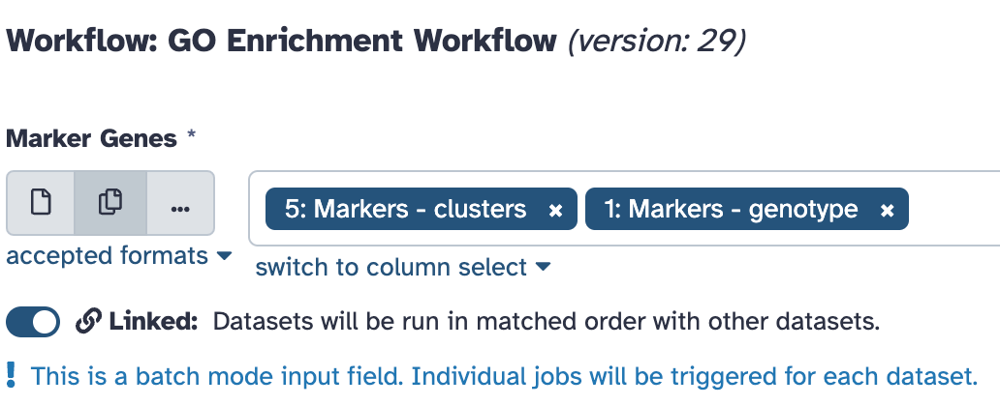

> <agenda-title></agenda-title>
>
> In this tutorial, we will cover:
>
> 1. TOC
> {:toc}
>
{: .agenda}

# Introduction

In the tutorial [Filter, plot and explore single-cell RNA-seq data with Scanpy](https://training.galaxyproject.org/training-material/topics/single-cell/tutorials/scrna-case_basic-pipeline/tutorial.html), we took an important step in our single-cell RNA sequencing analysis by identifying marker genes for each of the clusters in our dataset. These marker genes are crucial, as they help us distinguish between different cell types and states, giving us a clearer picture of the cellular diversity within our samples.
However, simply identifying marker genes is just the beginning. To truly understand what makes each cluster unique, we need to dive deeper into the biological functions these genes are involved in. This is where Gene Ontology (GO) enrichment analysis comes into play.

# Data description

In this tutorial will use the following datasets:

**[A] Marker Genes:**

We'll start with two input datasets of marker genes (Study sets):
  * **Marker genes per cell cluster:** This dataset lists the genes that are significantly different in each cell cluster.
  * **Marker genes per condition (wt and ko):** This dataset lists the genes that are significantly different between the wild-type (wt) and knockout (ko) conditions.

**[B] GO Enrichment Files:**

We'll also use three additional files for GO enrichment analysis. 
  * **Gene Ontology file:** This file contains information about Gene Ontology terms.
  * **GO Annotations file:** This file maps genes to their corresponding GO terms.
  * **Population set file:** This file provides a list of all genes involved in the experiment and is used as a background gene set for the analysis.

*Note:* There are several online databases available for downloading GO and GO Annotations files, including the Gene Ontology website, Ensembl, and the UCSC Genome Browser.
  
>  <comment-title>Concept behind GO Enrichment Analysis</comment-title>
>
>  The goal of GO enrichment analysis is to interpret the biological significance of long lists of **marker genes**. By summarizing these genes into a shorter list of enriched **GO terms**. The analysis works by comparing each GO term between your list of marker genes and a **background gene set**. Statistical tests are then used to calculate a p-value that indicates whether a particular GO term is significantly enriched in the marker gene list compared to the background.
{: .comment}

# Get data

You can access the data for this tutorial in multiple ways:

1. **Importing from a history** - You can import [this history](https://usegalaxy.eu/u/mennagamal/h/go-enrichment-analysis-on-scrna-seq-data)

   

2. **Uploading from Zenodo** (see below)

> <hands-on-title> Data Upload from Zenodo </hands-on-title>
>
> 1. Create a new history for this tutorial
> 2. Import the files from [Zenodo]({{ page.zenodo_link }}) 
>
>    ```
>    {{ page.zenodo_link }}/files/Galaxy3-[GO].obo
>    {{ page.zenodo_link }}/files/Galaxy2-[GO_annotations_Mus_musculus].tabular
>    {{ page.zenodo_link }}/files/Galaxy5-[Markers_-_clusters].tabular
>    {{ page.zenodo_link }}/files/Galaxy4-[Background_gene_set].tabular
>    {{ page.zenodo_link }}/files/Galaxy1-[Markers_-_genotype_].tabular
>    ```
>
>    
>
>    
>
> 3. Rename the datasets
> 4. Check that the datatype is `tabular`
>
>    
>
{: .hands_on}

## Important tips for easier analysis








# Data processing

To perform GO enrichment analysis on each cell cluster individually, we need to separate our "Markers_clusters Dataset" into seven files, one for each cluster and the "Markers_genotype Dataset" into 2 files, one for each condition. We'll use the "Split file" tool for this step. 

> <hands-on-title>File splitting</hands-on-title>
>
> 1.  with the following parameters:
>    -  *"File to select"*: `Markers_cluster` (Input dataset)
>    - *"on column"*: `c1`
>    - *"Include the header in all splitted files?"*: `Yes`
>
>
>    > <comment-title> Input Dataset </comment-title>
>    >
>    > As we have two datasets, one with the marker genes for all the seven clusters and one with the marker genes for the knockout (KO) and wild-type (WT) conditions. Make sure to repeat the analysis twice for the two different datasets. Alternatively, you can run this [workflow](https://usegalaxy.eu/u/mennagamal/w/unnamed-workflow) for parallel analysis of the datasets, under Marker genes choose the second icon to select multiple datasets as shown in the below image.
>    {: .comment}
> 
>
{: .hands_on}

Next, we need to isolate the Ensembl gene IDs column from each file. We'll use the "Cut Columns" tool to achieve this.

> <hands-on-title> Extract Ensembl IDs </hands-on-title>
>
> 1.  with the following parameters:
>    - *"Cut columns"*: `c4`
>    -  *"From"*: `split_output` (output of **Split file** )
>
>
>    > <comment-title> The gene format to use </comment-title>
>    >
>    In this example we extract column 4 because it contains the Ensembl gene IDs on which the subsequent steps are ideally working. While there are other gene formats like gene symbols, Entrez gene IDs, and more, make sure to check the specific format accepted by the tool you are using. There are also tools available to convert between different gene formats if needed. 
>    {: .comment}
>
{: .hands_on}


# GO Analysis using **GOEnrichment** tool

Now we will perform the GO Enrichment analysis on the list of ensembl gene IDs.

> <hands-on-title> GOEnrichment </hands-on-title>
>
> 1.  with the following parameters:
>    -  *"Gene Ontology File"*: `GO` (Input dataset)
>    -  *"Gene Product Annotation File"*: `GO annotations Mus musculus` (Input dataset)
>    -  *"Study Set File"*: `out_file1` (output of **Cut** )
>    -  *"Population Set File (Optional)"*: `Background gene set` (Input dataset)
>
>
>    > <comment-title> Population Set File Selection for GO Enrichment </comment-title>
>    >
>    > When choosing a background for GO enrichment analysis (Population Set File), it's important to consider the context of your data. While using a broad background (like all genes in the organism) is common, it might be more informative to limit the background to genes expressed in the specific tissue or cell type being profiled. In this tutorial we used only genes involved in the experiment before selecting the marker genes.
>    {: .comment}
>
{: .hands_on}


> <question-title></question-title>
>
> 1. Take a look at the enriched terms forthe different clusters, Can you find any GO terms that are specific to cluster 7?
> 2. Can we perform manual anntation of cluster 7 based on GO enrichment results?
>
> > <solution-title></solution-title>
> >
> > 1. Cluster 7 is enriched for terms like "regulation of cell death", "T cell mediated cytotoxicity", and "peptidase activator activity involved in apoptotic process".
> > 2. By looking at the most enriched functions and using our biological knowledge, we can figure out the cell types for many clusters. For example, since the data comes from thymus tissue, we already have an idea of the cell types we might find. The enriched terms in cluster 7 confirm that the cell type is macrophages, which support thymocyte maturation by cleaning up dead cells and debris.
> >
> {: .solution}
>
{: .question}

# GO Analysis using **gProfiler GOSt** tool

The gProfiler GOSt (Gene Ontology Sequential Testing) is another popular tool used to perform gene ontology (GO) enrichment analysis. In addition to providing enrichment results for the standard GO categories of Biological Process (BP), Cellular Component (CC), and Molecular Function (MF), the tool also analyzes enrichment across several other functional annotation databases, including: KEGG Pathways, Reactome Pathways, WikiPathways and TF Targets. It also gives a plot to better visualize the results.

> <hands-on-title> gProfiler GOSt </hands-on-title>
>
> 1.  with the following parameters:
>    -  *"Input is whitespace-separated list of genes, proteins, probes, term IDs or chromosomal regions."*: `out_file1` (output of **Cut** )
>    - *"Organism"*: `Common organisms`
>        - *"Common organisms"*: `Mus musculus (Mouse)`
>    - In *"Tool settings"*:
>        - *"Export plot"*: `Yes`
>
>
>    > <comment-title> Picking the right species matter </comment-title>
>    >
>    > The species you select should match the species your genes come from. If you choose the wrong species, the tool might use incorrect information, leading to inaccurate results. For example, human genes behave differently from mouse genes, so selecting the correct species ensures the analysis is relevant to your data.
>    {: .comment}
>
{: .hands_on}


> <question-title></question-title>
>
> 1. Can you find enriched GO terms that are inline with the [published study](https://www.frontiersin.org/journals/immunology/articles/10.3389/fimmu.2018.02523/full) findings in KO results file?
> 2. What might be happening to the stem cells in the KO mice compared to the WT mice?
>
> > <solution-title></solution-title>
> >
> > 1. In the KO g:GOSt result file, enrichment for the GO term "Negative regulation of stem cell differentiation" is found.
> > 2. This suggests that the KO condition is causing a delay in the differentiation of stem cells into mature T cells in the thymus which is inline with the study findings.
> >
> {: .solution}
>
{: .question}

# Conclusion

In this tutorial we have performed GO enrichment analysis on the differentially expressed genes between 2 different conditions and between different cell types. This analysis provided valuable insights into the biological processes, molecular functions, and cellular components associated with the gene sets, enhancing our understanding of the underlying mechanisms involved in the studied conditions.
