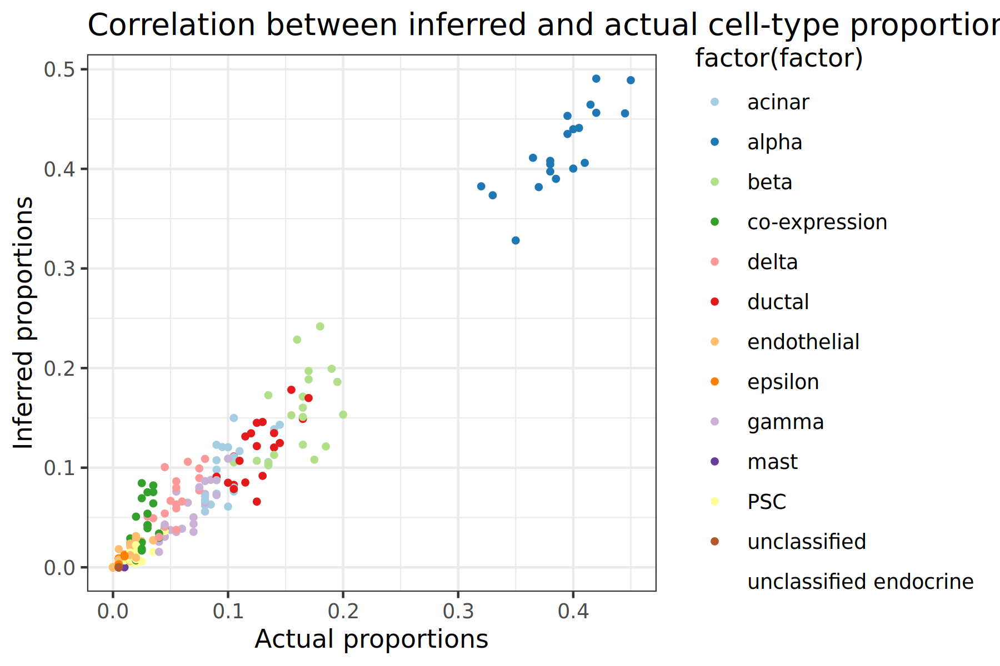
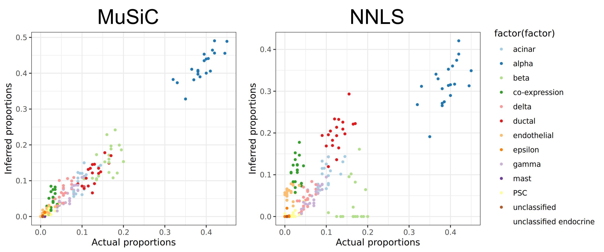
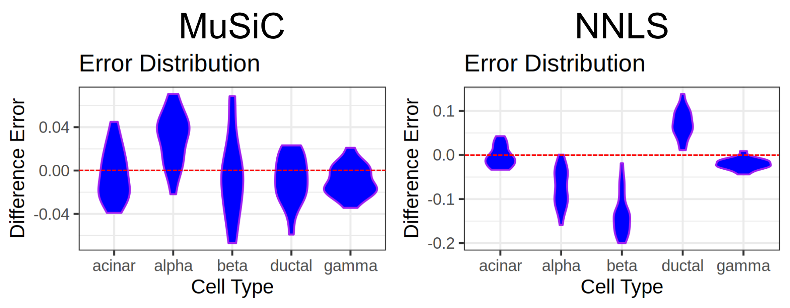

There are various methods to estimate the proportions of cell types in bulk RNA data. Since the actual cell proportions of the data are unknown, how do we know if our tools are producing accurate results?

In this tutorial we will be using single-cell data with known cell-type proportions in order to create pseudo-bulk RNA data. We will then estimate the cell-type proportions of this pseudo-bulk data using the currently available deconvolution tools within Galaxy. Since we know the true proportions values, we will be able to measure and compare the accuracy of the tools.

> <agenda-title></agenda-title>
>
> In this tutorial, we will cover:
>
> 1. TOC
> {:toc}
>
{: .agenda}

# Get the single-cell data

First we need to create a new history in Galaxy and load in our single-cell data. We are going to use the single-cell dataset from a previous deconvolution tutorial found here: [https://training.galaxyproject.org/training-material/topics/single-cell/tutorials/bulk-music/tutorial.html](https://training.galaxyproject.org/training-material/topics/single-cell/tutorials/bulk-music/tutorial.html).

> <hands-on-title>Data upload</hands-on-title>
>
> 1. Create a new history for this tutorial *"Deconvolution: Evaluating Reference Data"*
> 2. Import the files from [Zenodo]({{ page.zenodo_link }}) or from
>    the shared data library (`GTN - Material` -> `{{ page.topic_name }}`
>     -> `{{ page.title }}`):
>
>    * Human pancreas single-cell RNA datasets (tag: `#scrna`)
>      ```
>      https://zenodo.org/record/5719228/files/EMTABesethealthy.expression.tabular
>      https://zenodo.org/record/5719228/files/EMTABesethealthy.phenotype.tabular
>      ```
>
>    
>
>    
>
> 4. Check the datatypes are `tabular`
>
>    
>
> 5. Add a `#metadata` tag to `EMTABesethealthy.phenotype.tabular` and a `#expression` tag to `EMTABesethealthy.expression.tabular`
>
>    
>
{: .hands_on}

## Inspecting the single-cell data

Before continuing lets quickly inspect our single-cell data. We can find all of the cell types present in the data alongside their proportions by using the count tool to count the occurrence of each cell type category in the metadata file.

> <hands-on-title>Get cell counts</hands-on-title>
>
> 1.  with the following parameters:
>    -  *"from dataset"*: `EMTABesethealthy.phenotype.tabular`
>    - *"Count occurrences of values in column(s)"*: `Column 5`
>    - *"Delimited by"*: `Tab`
>    - *"How should the results be sorted?"*: `With the most common value first`
>
> 2. **Rename**  output `Cell Type Counts`
>
{: .hands_on}

We can see from the output table below, there are various cell types present in the data. Note that many of the cell types have very low proportion values, this should be kept in mind later on as cell types that appear only a hand full of times (or even just once!) in the data may not be very useful and only add noise. 

| Cell Type               | Count |
|-------------------------|-------|
| alpha                   | 443   |
| beta                    | 171   |
| ductal                  | 135   |
| acinar                  | 112   |
| gamma                   | 75    |
| delta                   | 59    |
| unclassified endocrine  | 29    |
| co-expression           | 26    |
| PSC                     | 23    |
| endothelial             | 13    |
| epsilon                 | 5     |
| mast                    | 4     |
| unclassified            | 1     |
| MHC class II            | 1     |

> <question-title>Inspecting the single-cell data</question-title>
>
> 1. How many cells are in the single-cell data?
> 2. How many cell types are present in the data?
>
> > <solution-title></solution-title>
> >
> > 1. Inspecting the general information of `EMTABesethealthy.expression.tabular` we can see that there are **1,097** cells in the data as there are 1,098 columns (subtracting 1 for the header).
columns (minus 1 for the header), with each column being a cell.
> > 2. Looking at the output of the  tool (or the above table), there are **14** distinct cell types in the data.
> >
> {: .solution}
>
{: .question}

# Process the single-cell data

In order to get a good understanding of the accuracy of our deconvolution tools, we are going to run our evaluations multiple times. This approach ensures that a single good or bad evaluation does not disproportionately represent the tool's overall performance.

However, instead of running all of our tools multiple times for each evaluation (which would be quite time consuming!), we will leverage "batch computation" in Galaxy. By storing our data in collections, any tools or workflows that use those collections will automatically run multiple times (once for each element in the collection). We will now perform some pre-processing of our data to get it into the right format.

## Transpose expression matrix

If we inspect the expression data file downloaded earlier, we can see that currently the rows represent genes and columns represent cells. However, this needs to be swapped for the later workflows. To fix this we will transpose the expression matrix.

> <hands-on-title>Transpose expression matrix</hands-on-title>
>
> 1.  with the following parameters:
>    -  *"Input tabular dataset"*: `EMTABesethealthy.expression.tabular`
>
> 2. **Rename**  output `Transposed expression matrix`
>
{: .hands_on}

## Generate batch mode collections

For this tutorial we will run the evaluations **20** times, this will both help improve the sample size and allow us to determine the consistency of the tools, whilst being small enough to run in a reasonable amount of time!

We will now duplicate our single-cell data 20 times and store it in a collection. This will be done for both the expression data and metadata files.

> <hands-on-title>Generate collections from data</hands-on-title>
>
> 1.  with the following parameters:
>    -  *"Input Dataset"*: `EMTABesethealthy.phenotype.tabular`
>    - *"Size of output collection"*: `20`
>
> 2. **Rename**  output `Metadata`
>
> 3.  with the following parameters:
>    -  *"Input Dataset"*: `Transposed expression matrix`
>    - *"Size of output collection"*: `20`
>
> 4. **Rename**  output `Expression data`
>
{: .hands_on}

## Generate expression set objects

Next we will need to use the single-cell data to build an expression set object, this will be used later in the evaluation when we perform the actual deconvolution. 

**Note: We are using the original imported data here, not the transposed data or collections.**

> <hands-on-title>Build the Expression Set object</hands-on-title>
>
> 1.  with the following parameters:
>    -  *"Assay Data"*: `EMTABesethealthy.expression.tabular` (Input dataset)
>    -  *"Phenotype Data"*: `EMTABesethealthy.phenotype.tabular` (Input dataset)
>
>    > <comment-title></comment-title>
>    >
>    > An ExpressionSet object has many data slots, the principle of which are the experiment data (*exprs*), the phenotype data (*pData*), as well metadata pertaining to experiment information and additional annotations (*fData*).
>    {: .comment}
>
{: .hands_on}

Similar to the expression data, this ExpressionSet object needs to be duplicated 20 times into a collection for later batch processing.

> <hands-on-title>Generate ESet collection</hands-on-title>
>
> 1.  with the following parameters:
>    -  *"Input Dataset"*: `ESet Object` (output of **Construct Expression Set Object** )
>    - *"Size of output colection"*: `20`
>
> 2. **Rename**  output `ESet Object`
>
{: .hands_on}


# Create pseudo-bulk and actual cell proportions

We are now going to run our first workflow! This workflow will extract a subsample from the data containing 200 random cells. The workflow will then perform two things with this subsample:

1. Count the cell types and proportions of the data in order to be used as reference later against the predicted proportion values
2. Remove the cell types and convert the single-cell data into pseudo-bulk data to be later inputted into the deconvolution tools.

The above will be done twice to emulate multiple "subjects". Since the deconvolution tools will be expecting the bulk-RNA data to comprise of at least 2 subjects (each with their own bulk data). For this tutorial our subjects will simply be called **A** and **B**. However, in the real world these subjects could be different patients, tissue samples, diseased/healthy, etc. 

**Remember** since we have a collection of 20 inputs, the output of this workflow will be a collection of 20 elements, each corresponding to the input elements. Each output will have its own random selection of 200 cells.

> <comment-title>Inputting multiple datasets</comment-title>
>
> In order to upload the input collections into the workflow, you first need to set the input type to **Multiple datasets** in the input file selection.
> 
> 
{: .comment}

> <hands-on-title>Run pseudo-bulk and actual proportions workflow</hands-on-title>
>
> 1. **Import the workflow** into Galaxy
>    - Copy the URL (e.g. via right-click) of [this workflow]({{ site.baseurl }}{{ page.dir }}workflows/qc_report.ga) or download it to your computer.
>    - Import the workflow into Galaxy
>
>    
>
> 2. Run **Workflow pseudobulk and actual proportions**  using the following parameters:
>    -  *"Metadata"*: `metadata collection`
>    -  *"Expression Data"*: `expression data collection`
>
>    
> 3. Rename output collections / add tags?
>
> 4. Inspect `cell type counts`
{: .hands_on}

The output of this workflow will be the psuedo-bulk and actual cell proportions for both samples A and B. If you inspect one of the elements in the `Actual Cell Proportions` collection, you should see a table similar to the following:
(**Note:** your cell-types and values will differ slightly since these subtypes are random)

|                         | A_actual   |
|-------------------------|------------|
| acinar                  | 0.090000   |
| alpha                   | 0.415000   |
| beta                    | 0.170000   |
| co-expression           | 0.050000   |
| delta                   | 0.070000   |
| ductal                  | 0.105000   |
| endothelial             | 0.015000   |
| gamma                   | 0.050000   |
| mast                    | 0.010000   |
| unclassified endocrine  | 0.025000   |

Comparing the above table with the cell-type counts of the original single-cell data, does this look correct? Well the top 3 cell-types with the highest proportion in the single-cell data are: alpha, beta, ductal. Which aligns with the proportion values of the above data! There may be some variance due to the randomly selected cells. Also note that some of the lesser common cell types (like `MHC class II`) aren't present in the above table, again this is due to the 200 randomly selected cells for this specific sample and isn't of concern.

# Perform deconvolution on the pseudo-bulk data

Now that we have our pseudo-bulk data alongside the actual proportion values. Our next step is to run deconvolution to get predicted cell-type proportions! Currently, Galaxy contains two tools for performing deconvolution: **MuSiC** and **NNLS**. We will use both of these tools in this tutorial and compare their results together.

The following workflow will take the two pseudo-bulk samples (A and B), as well as the original single-cell data as reference and output the deconvolution results for both samples and deconvolution methods. Thus producing 4 output collections. The pdf results of the deconvolution tools will also be outputted from the workflow but won't be needed for the tutorial.

> <hands-on-title>Run inferring cellular proportions workflow</hands-on-title>
>
> 1. **Import the workflow** into Galaxy
>    - Copy the URL (e.g. via right-click) of [this workflow]({{ site.baseurl }}{{ page.dir }}workflows/qc_report.ga) or download it to your computer.
>    - Import the workflow into Galaxy
>
>    
>
> 2. Run **Workflow inferring cellular proportions**  using the following parameters:
>    -  *"Subsample_A - matrix"*: `expression data - A`
>    -  *"Subsample_B - matrix"*: `expression data - B`
>    -  *"ESet Reference scRNA-seq"*: `ESet Object`
>    - *"Cell Types Label from scRNA dataset"*: `cellType`
>    - *"Samples Identifier from scRNA dataset"*: `sampleID`
>    - *"Cell types to use from scRNA dataset"*:`acinar,alpha,beta,delta,ductal,gamma`
>    -  *"B_actuals"*: `actual - B`
>    -  *"A_actuals"*: `actual - A`
>
>    
> 3. Rename output collections / add tags?
{: .hands_on}

# Visualise results

Now that we have our deconvolution results, the next step is to analyse the predictions and determine how accurate our tools are given our reference data. Since our pseudo-subjects **A** and **B** come from the same data, there isn't much point inspecting them both. So for the rest of the tutorial we will just focus our analysis on subject **A**.

In order to determine if our tools have produced accurate results, we will create various plots and compute different metrics to visualise and quantify the outputs of our tools.

## Pre-process the output results

Before visualising or inspecting the outputs of the deconvolution tools, we first need to perform some pre-processing. Up until now we have been working with collections in order to perform our evaluations multiple times in parallel. However, for analysing our data collections will be a bit messy and are no longer needed. The following workflow will combine all the collections of the MuSiC and NNLS outputs into two tables:

1. A results table presenting the predicted and actual proportion values of each cell-type for each subsample
2. An error table showing the difference between the actual and predicted values. This table will be used shortly for a plot representing the tool errors.

> <hands-on-title>Run visualisation pre-processing workflow</hands-on-title>
>
> 1. **Import the workflow** into Galaxy
>    - Copy the URL (e.g. via right-click) of [this workflow]({{ site.baseurl }}{{ page.dir }}workflows/qc_report.ga) or download it to your computer.
>    - Import the workflow into Galaxy
>
>    
>
> 2. Run **Workflow preprocess visualisations**  using the following parameters:
>    -  *"Cell Proportions"*: `Music Results`
>
> 3. Run **Workflow preprocess visualisations**  using the following parameters:
>    -  *"Cell Proportions"*: `NNLS Results`
>
>    
{: .hands_on}

The following table shows a snippet of the `Results Table` for the MuSiC tool. A header has been added for better reading but has been omitted in the workflow output as it will interfere with the visualisation tools. Another reminder that the output in this tutorial will differ to your own since random cells were selected for the subsamples!

| Cell Type      | Actual Proportion   | Predicted Proportion   |
|----------------|---------------------|------------------------|
| acinar         | 0.090000            | 0.0814442584577275     |
| alpha          | 0.415000            | 0.427718807911522      |
| beta           | 0.170000            | 0.256954867012044      |
| co-expression  | 0.050000            | 0                      |
| delta          | 0.070000            | 0.0929840465107452     |
| ...            | ...                 | ...                    |

Already at first glance we can see some interesting results! Firstly we can see that the tool is able to make predictions close to the actual values such as with acinar, alpha, delta. We also see the tool failing to make any type of prediction for co-expression cells with a predicted proportion value of 0. This however isn't a compete surprise since co-expression cells are of small proportion in the bulk and reference data. 

But this is only a small sample of the results. Lets create some visualisations to see the whole picture!

## Plot scatter plots of the results

The first type of visualisation we will do is a scatter plot. This plot will compare the actual and predicted proportion values for each cell across each subsample. We will also colour each point on the plot to indicate which cell type each data point belongs to. Let's do that now for both the MuSiC and NNLS results.

> <hands-on-title>Plot the actual and inferred data</hands-on-title>
>
> 1.  with the following parameters:
>    -  *"Input in tabular format"*: `Results Table (Music)`
>    - *"Column to plot on x-axis"*: `2`
>    - *"Column to plot on y-axis"*: `3`
>    - *"Plot title"*: `Correlation between inferred and actual cell-type proportions`
>    - *"Label for x axis"*: `Actual proportions`
>    - *"Label for y axis"*: `Inferred proportions`
>    - In *"Advanced options"*:
>       - *"Plotting multiple groups"*: `Plot multiple groups of data on one plot`
>           - *"column differentiating the different groups"*: `1`
>           - *"Color schemes to differentiate your groups"*: `Paired - predefined color pallete (discrete, max=12 colors)`
>           - *"Reverse color scheme"*: `Default order of color scheme`
>    - In *"Output options"*:
>       - *"width of output"*: `5.0`
>       - *"height of output"*: `3.0`
>
> 2. **Rename**  output `Scatter plot - Music`
>
> 3.  with the following parameters:
>    -  *"Input in tabular format"*: `Results Table (NNLS)`
>    - *"Column to plot on x-axis"*: `2`
>    - *"Column to plot on y-axis"*: `3`
>    - *"Plot title"*: `Correlation between inferred and actual cell-type proportions`
>    - *"Label for x axis"*: `Actual proportions`
>    - *"Label for y axis"*: `Inferred proportions`
>    - In *"Advanced options"*:
>       - *"Plotting multiple groups"*: `Plot multiple groups of data on one plot`
>           - *"column differentiating the different groups"*: `1`
>           - *"Color schemes to differentiate your groups"*: `Paired - predefined color pallete (discrete, max=12 colors)`
>           - *"Reverse color scheme"*: `Default order of color scheme`
>    - In *"Output options"*:
>       - *"width of output"*: `5.0`
>       - *"height of output"*: `3.0`
>
> 4. **Rename**  output `Scatter plot - NNLS`
>
{: .hands_on}



> <question-title>Interpreting the Scatter Plots</question-title>
>
> 1. Which method has the most accurate results?
> 2. Which cell type has the biggest proportion in the dataset?
> 3. Are there any cell types the tools fail to predict?
>
> 
>
> > <solution-title></solution-title>
> >
> > 
> >
> > 1. Comparing scatter plots, the MuSiC tool has the most accurate results since the points fall closer onto the x=y line
> > 2. Both scatter plots show alpha cells having the highest proportion by a large margin
> > 3. In both plots, only the top 6 cell types are predicted accurately, the rest are predicted as 0. This is likely due to how small the proportions of these cell types are
> >
> {: .solution}
>
{: .question}


## Plot violin plots of the errors

Next we will plot the distribution of errors between the predicted and actual cellular proportions for a select number of cell types. We could plot all cell types in the output, however too many will cause the visualisations to be messy and difficult to interpret.

We can see that most cell types have very low proportions, so for this visualisation we will only look at 5 cell types with the highest proportion values. For the above table these cell types are: `alpha, beta, gamma, ductal, acinar`. Before we visualise the data we first need to extract only these cell types from the error table.

> <hands-on-title>Extract Cell Types</hands-on-title>
>
> 1.  with the following parameters:
>    -  *"File to cut"*: `Error Table (Music)`
>    - *"Operation"*: `Keep`
>    - *"Cut by"*: `fields`
>       - *"Delimited by"*: `Tab`
>       - *"Is there a header for the data's columns ?"*: `Yes`
>           - *"List of Fields"*: `Select the columns containing: alpha, beta, gamma, ductal, acinar`
>
> 2. **Rename**  output `Music Errors`
>
> 3.  with the following parameters:
>    -  *"File to cut"*: `Error Table (NNLS)`
>    - *"Operation"*: `Keep`
>    - *"Cut by"*: `fields`
>       - *"Delimited by"*: `Tab`
>       - *"Is there a header for the data's columns ?"*: `Yes`
>           - *"List of Fields"*: `Select the columns containing: alpha, beta, gamma, ductal, acinar`
>
> 4. **Rename**  output `NNLS Errors`
>
{: .hands_on}

> <hands-on-title>Plot violin plots</hands-on-title>
>
> 1.  with the following parameters:
>    -  *"Input in tabular format"*: `Music Errors`
>    - *"Plot title"*: `Error Distribution`
>    - *"Label for x axis"*: `Cell Type`
>    - *"Label for y axis"*: `Difference Error`
>    - In *"Advanced Options"*:
>       - *"Violin border options"*: `Purple`
>    - In *"Output Options"*:
>       - *"width of output"*: `3.0`
>       - *"height of output"*: `2.0`
>
> 2. **Rename**  output `Violin Plot - Music`
>
> 3.  with the following parameters:
>    -  *"Input in tabular format"*: `NNLS Errors`
>    - *"Plot title"*: `Error Distribution`
>    - *"Label for x axis"*: `Cell Type`
>    - *"Label for y axis"*: `Difference Error`
>    - In *"Advanced Options"*:
>       - *"Violin border options"*: `Purple`
>    - In *"Output Options"*:
>       - *"width of output"*: `3.0`
>       - *"height of output"*: `2.0`
>
> 4. **Rename**  output `Violin Plot - NNLS`
>
{: .hands_on}


> <question-title>Interpreting the Violin Plots</question-title>
>
> 1. Which method has a tendency to overestimate proportions?
> 2. Which cell types roughly have the most and least accurate predictions in MuSiC?
> 3. Which is the most overestimated cell type in NNLS?
>
> 
>
> > <solution-title></solution-title>
> >
> > 
> >
> > 1. Comparing the two violin plots, MuSiC overestimates a lot on alpha, beta, and delta cells. Most of NNLS's results are quite uniform in over/under estimations, with the exception of ductal cells.
> > 2. Whilst it's difficult to know which cell types are exactly the best predicted from the plot alone, it can be seen that delta and gamma cells have the narrowest margin of error in Music, whilst alpha, beta, and ductal have more spread out errors across all 20 samples.
> > 3. Most of the cell types in NNLS evenly over and under estimate the cell proportions, however from the violin plot it can be seen that ductal cells are greatly overestimated.
> >
> {: .solution}
>
{: .question}


# Compute accuracy metrics

Visualisations are a great tool for getting an intuitive overview of the data. However, some of the interpretations from visualisations can be subjective. Having quantitative results alongside visualisations can offer concrete and precise values about the data that can more easily be compared. We will use two different quantitative metrics in this tutorial; Pearson correlation and RMSE.

## Pearson Correlation

The Pearson correlation coefficient is a statistical value that represents the direction and correlation between two variables, the value of this metric ranges between -1 and 1, where:

- -1 = negative correlation
- 0 = no correlation
- 1 = positive correlation

The equation for calculating the Pearson correlation can be seen below, the workflow to compute this metric breaks down this formula into smaller steps.


Where
- `x` = actual proportion values
- `x̄` = mean of actual proportion values
- `y` = predicted proportion values
- `ȳ` = mean of predicted proportion values

## Root Mean Squared Error (RMSE)

Root Mean Squared Error or RMSE is a common error metric for measuring a tools prediction accuracy. This metric calculates the average error between the predicted and actual values for each prediction then takes the mean and square root of the error to produce a final value. Lower RMSE values (close to 0) indicate accurate predictions similar to the actual value, as the value increases the accuracy score is worse.

The equation for calculating this metric is seen below, the implementation of this calculation is in the workflow alongside the Pearson correlation.


Where
- `n` = number of samples
- `y` = actual proportion
- `ŷ` = predicted proportion


## Compute metrics

With a basic understanding of some useful metrics, we will now compute these to get quantitative values alongside our visualisation results. The following workflow needs to be run for both the MuSiC and NNLS results table.

> <hands-on-title>Run metrics workflow</hands-on-title>
>
> 1. **Import the workflow** into Galaxy
>    - Copy the URL (e.g. via right-click) of [this workflow]({{ site.baseurl }}{{ page.dir }}workflows/qc_report.ga) or download it to your computer.
>    - Import the workflow into Galaxy
>
>    
>
> 2. Run **Workflow compute metrics**  using the following parameters:
>    -  *"Cell Proportions"*: `Music Results`
>
> 3. Run **Workflow compute metrics**  using the following parameters:
>    -  *"Cell Proportions"*: `NNLS Results`
>
>    
{: .hands_on}

After running the workflow on both the MuSiC and NNLS results we should have the Pearson and RMSE metrics for both tools. The below table summarises these scores.

| Tool  | Pearson Correlation | RMSE  |
|-------|---------------------|-------|
| MuSiC | 0.982               | 0.030 |
| NNLS  | 0.954               | 0.037 |

From the table we can now see concrete values representing the error and correlation between the predictions and actual proportion values. We can see from the table that the MuSiC tool has a better accuracy with a higher correlation score and lower error compared to NNLS.
