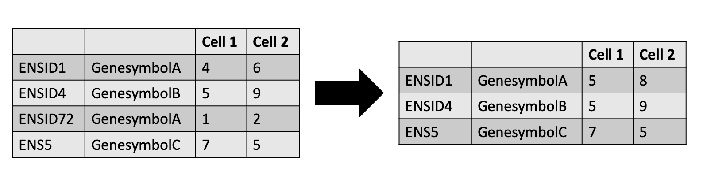

# Introduction

After completing the [MuSiC](https://xuranw.github.io/MuSiC/articles/MuSiC.html)  deconvolution tutorial, you are hopefully excited to apply this analysis to data of your choice. Annoyingly, getting data in the right format is often what prevents us from being able to successfully apply analyses. This tutorial is all about reformatting a raw scRNA-seq dataset pulled from a public resource (the EMBL-EBI single cell expression atlas . Let's get started!

> <agenda-title></agenda-title>
>
> In this tutorial, we will cover:
>
> 1. TOC
> {:toc}
>
{: .agenda}

# Metadata Manipulation

First, we will tackle the metadata. We are roughly following the same concept as in the previous bulk deconvolution tutorial, by comparing human pancreas data across a disease variable (type II diabetes vs healthy), but using public datasets to do it.

## Find the data
We explored the [single cell expression atlas](https://www.ebi.ac.uk/gxa/sc/experiments), browsing experiments in order to find a pancreas dataset (). You can [explore this dataset](https://www.ebi.ac.uk/gxa/sc/experiments/E-MTAB-5061/results/tsne) using their browser. These cells come from 6 healthy individuals and 4 individuals with Type II diabetes, so we will create reference Expression Set objects for the total as well as separating out by phenotype, as you may have reason to do this in your analysis (or you may not!).



Galaxy has a specific tool for ingesting data from the Single cell expression atlas, so there are no uploads for this tutorial.

> <hands-on-title>Data retrieval</hands-on-title>
>
> 1.  with the following parameters:
>    - *"SC-Atlas experiment accession"*: `E-MTAB-5061`
>
> Data management is going to be key in this analysis, so trust me now to start adding tags.
> 5. Add to the **EBI SCXA Data Retrieval on E-MTAB-5061 exp_design.tsv** file the following tags: `#ebi #metadata #singlecell`
>
>    
{: .hands_on}

This tool will retrieve four files: a barcodes list, a genes list, an experimental design file, and a matrix market format (where columns refer to genes, cells, and quantities). We (mostly) only need the experimental design file, but keep in mind this will have data on all the cells reported by the authors.

> <question-title></question-title>
>
> 1. How many cells are in the sample?
> 2. How many cells were submitted by the authors?
>
> > 
<button type="button" aria-controls="solution-1-contents" aria-expanded="true" aria-label="Toggle solution box: "><i class="far fa-eye" aria-hidden="true"></i> Solution</button>

> >
> > 1. If you select the  **barcodes.tsv** file, you'll find that it contains 2914 lines - this corresponds to the 2914 cells, because each cell is given a barcode.
> > 2. The nature of public repositories is that they ingest data from many places, which means they usually apply a uniform analysis to samples. This rarely means they yield the same cell numbers as the original authors. If you check the  **exp_design.tsv** file, which refers to the data submitted by the authors, you'll find it contains 3514 lines - referring to 3514 cells submitted by authors. It's important to know that (currently) these files differ.
> >
> {: .solution}
{: .question}

## Prepare the experimental design file

Let's get rid of a bunch of repetitive columns in the metadata we don't need. You can find out what each column is by inspecting the dataset  in the history window.

> <hands-on-title>Cutting necessary metadata columns</hands-on-title>
>
> 1.  with the following parameters:
>    - *"Cut columns"*: `c1,c4,c6,c8,c10,c14,c20,c24,c26,c30,c32,c34`
>    -  *"From"*: `design_tsv` (output of **EBI SCXA Data Retrieval** )
>
{: .hands_on}

You can inspect the dataset  to see that it's full of annoying "" everywhere, and overly long descriptions of each columns.

Now, there might be a better way to do this in Galaxy (or you might consider downloading the file locally and changing it in a spreadsheet application or something), but this is what will work to reformat all that annoying text.

> <hands-on-title>Reformatting the metadata</hands-on-title>
>
> 1.  with the following parameters:
>    -  *"Select lines from"*: `out_file1` (output of **Cut** )
>    - In *"Check"*:
>        -  *"Insert Check"*
>            - *"Find Regex"*: `"Sample Characteristic\[individual\]"`
>            - *"Replacement"*: `Individual`
>        -  *"Insert Check"*
>            - *"Find Regex"*: `"Sample Characteristic\[sex\]"`
>            - *"Replacement"*: `Sex`
>        -  *"Insert Check"*
>            - *"Find Regex"*: `"Sample Characteristic\[age\]"`
>            - *"Replacement"*: `Age`
>        -  *"Insert Check"*
>            - *"Find Regex"*: `"Sample Characteristic\[body mass index\]"`
>            - *"Replacement"*: `BMI`
>        -  *"Insert Check"*
>            - *"Find Regex"*: `kilogram per square meter`
>        -  *"Insert Check"*
>            - *"Find Regex"*: `HbA1c `
>        -  *"Insert Check"*
>            - *"Find Regex"*: `"Sample Characteristic\[clinical information\]"`
>            - *"Replacement"*: `HbA1c`
>        -  *"Insert Check"*
>            - *"Find Regex"*: `%`
>        -  *"Insert Check"*
>            - *"Find Regex"*: `"Sample Characteristic\[disease\]"`
>            - *"Replacement"*: `Disease`
>        -  *"Insert Check"*
>            - *"Find Regex"*: `"Sample Characteristic\[single cell quality\]"`
>            - *"Replacement"*: `Single cell quality`
>        -  *"Insert Check"*
>            - *"Find Regex"*: `"Sample Characteristic\[submitted single cell quality\]"`
>            - *"Replacement"*: `"Submitted single cell quality"`
>        -  *"Insert Check"*
>            - *"Find Regex"*: `"Factor Value\[inferred cell type - ontology labels\]"`
>            - *"Replacement"*: `Inferred cell type - ontology label`
>        -  *"Insert Check"*
>            - *"Find Regex"*: `"Factor Value\[inferred cell type - authors labels\]"`
>            - *"Replacement"*: `Inferred cell type - author labels`
>        -  *"Insert Check"*
>            - *"Find Regex"*: `""`
>            - *"Replacement"*: 
>        -  *"Insert Check"*
>            - *"Find Regex"*: `"`
>            - *"Replacement"*: 
>
>    > <comment-title></comment-title>
>    >
>    > What's with the `\` everywhere? That's because the `[]` symbols usually call the code to do something, rather than just read it as a normal character. the `\` prevents this.
>    {: .comment}
>
> 2. Change the datatype to tabular.
>
>    
>
{: .hands_on}

Great, this file is now ready to go! But, it contains all those extra cells that didn't pass filtration with the EBI pipeline and therefore won't exist in the matrix. We need to remove them for future steps to work. We can use our barcodes list to remove the extra cells.

## Prepare the barcodes file

> <hands-on-title>Adding a header</hands-on-title>
>
> 1.  with the following parameters:
>    - *"text to add"*: `Cell`
>    -  *"input file"*: `barcode_tsv` (output of **EBI SCXA Data Retrieval** )
> 
> 2. Change the datatype to tabular.
>
>    
> 
>    > <comment-title></comment-title>
>    >
>    > This is an annoying step we have to do to get the right format, otherwise future steps won't work.
>    {: .comment}
>
{: .hands_on}

## Use the barcodes list to filter out cells in the experimental design file

> <hands-on-title>Joining datasets</hands-on-title>
>
> 1.  with the following parameters:
>    -  *"Join"*: `outfile` (output of **Add line to file** )
>    - *"using column"*: `c1`
>    -  *"with"*: `out_file1` (output of **Regex Find And Replace** )
>    - *"and column"*: `c1`
>    - *"Fill empty columns"*: `No`
>    - *"Keep the header lines"*: `Yes`
>    > <comment-title></comment-title>
>    >
>    > Make sure that you join the files in the same order as above - put the output of Add line to file in first - otherwise your columns will be in a different order for the next step. Everything will still work, but you would need to change the number of the column you remove using Advanced Cut. 
>    {: .comment}
{: .hands_on}

> <question-title></question-title>
>
> 1. How many cells are now in your table?
> 2. Is your table ready to go?
>
> > 
<button type="button" aria-controls="solution-1-contents" aria-expanded="true" aria-label="Toggle solution box: "><i class="far fa-eye" aria-hidden="true"></i> Solution</button>

> >
> > 1. If you select the output dataset in your history, you will find `2915` lines, corresponding to 2914 cells and a header. Success!
> > 2. Not quite - notice how you have two identical columns `Cell` and `Assay`? Let's get rid of one.
> >
> {: .solution}
{: .question}

> <hands-on-title>Remove duplicate columns</hands-on-title>
>
> 1.  with the following parameters:
>    -  *"File to cut"*: `out_file1` (output of **Join two Datasets** )
>    - *"Operation"*: `Discard`
>    - *"Cut by"*: `fields`
>        - *"List of Fields"*: `c1`
>        
>    > <comment-title></comment-title>
>    >
>    > Advanced cut works slightly differently in a workflow versus running the tool independently. Independently, there is a list and you can click through the list to note your columns, while in a workflow it appears as a text option and you put each column on a different line. The point is, each number above represents a column, so remove them!
>    {: .comment}
{: .hands_on}

Fantastic! You've completed part 1 - making the single cell metadata file. It should now look like this:

You can use the [workflow for this portion of the tutorial](https://usegalaxy.eu/u/wendi.bacon.training/w/music-deconvolution-data-generation--sc--metadata), and access an [example history](https://usegalaxy.eu/u/wendi.bacon.training/h/music-deconvolution-data-generation--sc--metadata).

# Manipulate the expression matrix

Currently, the matrix data is in a 3-column format common in 10x outputs, where you need the barcodes and the genes files to interpret the matrix. What you actually need is an expression matrix with cells on one axis and genes on another. While we aren't running a Scanpy analysis, we can still use our Scanpy tools to get this format.

## Reformat the matrix

> <hands-on-title>Task description</hands-on-title>
>
> 1.  with the following parameters:
>    -  *"Expression matrix in sparse matrix format (.mtx)"*: `matrix_mtx` (output of **EBI SCXA Data Retrieval** )
>    -  *"Gene table"*: `genes_tsv` (output of **EBI SCXA Data Retrieval** )
>    -  *"Barcode/cell table"*: `barcode_tsv` (output of **EBI SCXA Data Retrieval** )
>    - *"Format of output object"*: `AnnData format (h5 for older versions)`
>
> 2. Change the datatype to `h5ad`
>
>    
>
{: .hands_on}

Now your precious matrix is stored in the 10x AnnData object. Let's retrieve it!

> <hands-on-title>Inspect the matrix</hands-on-title>
>
> 1.  with the following parameters:
>    -  *"Annotated data matrix"*: `output_h5` (output of **Scanpy Read10x** )
>    - *"What to inspect?"*: `The full data matrix`
>
{: .hands_on}

> <question-title></question-title>
>
> 1. Which are currently the rows in your matrix, cells or genes?
>
> > 
<button type="button" aria-controls="solution-1-contents" aria-expanded="true" aria-label="Toggle solution box: "><i class="far fa-eye" aria-hidden="true"></i> Solution</button>

> >
> > 1. You may remember from earlier that the sample should have `2914 cells` in it. If you inspect the dataset in your history, you will find that it contains `2915` lines (1 for the header), which means that rows correspond to cells. Unfortunately... that's not what you need.
> >
> {: .solution}
{: .question}

> <hands-on-title>Transpose the matrix</hands-on-title>
>
> 1.  with the following parameters:
>    -  *"Input tabular dataset"*: `X` (output of **Inspect AnnData** )
>
>
{: .hands_on}

> <question-title></question-title>
>
> 1. How many genes are in your sample?
>
> > 
<button type="button" aria-controls="solution-1-contents" aria-expanded="true" aria-label="Toggle solution box: "><i class="far fa-eye" aria-hidden="true"></i> Solution</button>

> >
> > 1. You should have `30,416` lines in it, meaning your sample has `30,415` genes.
> >
> {: .solution}
{: .question}

## Collapse EnsemblIDs

Ok, real talk here. Technically, the best way of analysing anything is by using the EnsemblIDs for any given RNA transcript, because they are more specific than gene names and also cover more of the transcriptome than our gene names...
But...
As biologists, it's very difficult to interpret ENSIDs. And it's an awful shame to get to the end of the MuSiC deconvolution and have all our plots show sad ENS IDs. So, courtesy of the excellent @mtekman, we steal his workflow to collapse the ENS IDs into gene names.

> <hands-on-title>Convert from Ensembl to GeneSymbol using workflow</hands-on-title>
>
> 1. Import this [workflow](https://usegalaxy.eu/u/wendi.bacon.training/w/convert-from-ensembl-to-genesymbol-summing-duplicate-genes).
>
>    
>
> 2. Run the workflow on your sample with the following parameters:
>    - *"Organism"*: `Human`
>    -  *"Expression Matrix (Gene Rows)"*: `output_h5` (output of **Transpose** )
>
>    
>
{: .hands_on}

The output will likely be called **Text transformation** and will look like this:

# Construct Expression Set Objects

We're nearly there! We have three more tasks to do: first, we need to create the expression set object with all the phenotypes combined. Then, we also want to create two separate objects - one for healthy and one for diseased as references.

> <hands-on-title>Creating the combined object</hands-on-title>
>
> 1.  with the following parameters:
>    -  *"Assay Data"*: `out_file` #matrix (output of **Text transformation** )
>    -  *"Phenotype Data"*: `output` (output of **Advanced Cut** )
>
> 2. Remove the `#metadata #matrix` tags from the output **RData ESet Object**
>
> 3. Add the tag `#combined` to the output **RData ESet Object**
>
>
{: .hands_on}

> <question-title></question-title>
>
> 1. How many genes are in your sample now?
>
> > 
<button type="button" aria-controls="solution-1-contents" aria-expanded="true" aria-label="Toggle solution box: "><i class="far fa-eye" aria-hidden="true"></i> Solution</button>

> >
> > 1. If you select the  of the output **General Info** dataset in the history, you will find it contains 21671 features and 2914 samples, or rather, `21671` genes and `2914` cells. That's a huge reduction in genes thanks to the ENS ID collapsing!
> >
> {: .solution}
{: .question}

> <hands-on-title>Creating the disease-only object</hands-on-title>
>
> 1.  with the following parameters:
>    -  *"Expression Set Dataset"*: `out_rds` (output of **Construct Expression Set Object** )
>    - *"Concatenate other Expression Set objects?"*: `No`
>    - *"Subset the dataset?"*: `Yes`
>        - *"By"*: `Filter Samples and Genes by Phenotype Values`
>            - In *"Filter Samples by Condition"*:
>                -  *"Insert Filter Samples by Condition"*
>                    - *"Name of phenotype column"*: `Disease`
>                    - *"List of values in this column to filter for, comma-delimited"*: `type II diabetes mellitus`
>
> 2. Remove the `#combined` tag from the output **RData ESet Object**
>
> 3. Add the tag `#T2D` to the output **RData ESet Object**
>
>
>
{: .hands_on}

You can either re-run this tool or set it up again to create the healthy-only object.

> <hands-on-title>Creating the healthy-only object</hands-on-title>
>
> 1.  with the following parameters:
>    -  *"Expression Set Dataset"*: `out_rds` (output of **Construct Expression Set Object** )
>    - *"Concatenate other Expression Set objects?"*: `No`
>    - *"Subset the dataset?"*: `Yes`
>        - *"By"*: `Filter Samples and Genes by Phenotype Values`
>            - In *"Filter Samples by Condition"*:
>                -  *"Insert Filter Samples by Condition"*
>                    - *"Name of phenotype column"*: `Disease`
>                    - *"List of values in this column to filter for, comma-delimited"*: `normal`
>
> 2. Remove the `#combined` tag from the output **RData ESet Object**
>
> 3. Add the tag `#healthy` to the output **RData ESet Object**
>
{: .hands_on}

> <question-title></question-title>
>
> 1. Why are you making a healthy-only and diseased-only reference objects?
>
> > 
<button type="button" aria-controls="solution-1-contents" aria-expanded="true" aria-label="Toggle solution box: "><i class="far fa-eye" aria-hidden="true"></i> Solution</button>

> >
> > 1. We could imagine that the cells will express different transcript levels, but that the deconvolution tools will have to take some sort of average. Perhaps it might be more accurate to infer like from like, i.e. healthy from healthy? Or perhaps that is skewing the data through a more 'supervised' approach. We're not   quite sure, and it likely depends on the biology, so we're covering all our bases by making sure you can do this every way. (We've tested it on our dataset in all the ways and got the same results, so it doesn't make much of a difference as far as we can tell!)
> >
> {: .solution}
{: .question}

# Conclusion

You have successfully performed, essentially, three workflows. You can find the [workflows for generating the ESet object](https://usegalaxy.eu/u/wendi.bacon.training/w/music-deconvolution-data-generation--sc--matrix--eset) and the [answer key history for this entire tutorial](https://usegalaxy.eu/u/wendi.bacon.training/h/music-deconvolution-data-generation--sc--matrix--eset).

With these workflows, you've created three Expression Set objects, capable of running in the MuSiC Compare tutorial. Now you just need the bulk RNA-seq Expression Set objects!

This tutorial is part of the [https://singlecell.usegalaxy.eu](https://singlecell.usegalaxy.eu) portal ().
