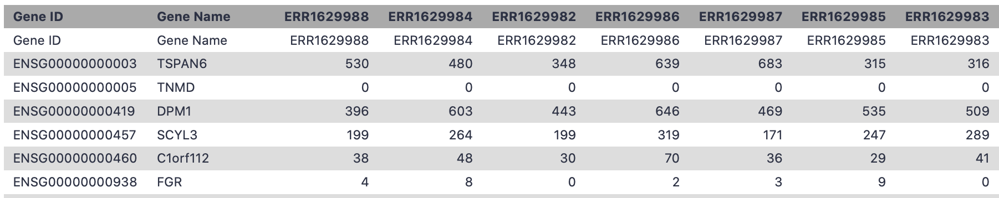

# Introduction
{:.no_toc}

<!-- This is a comment. -->

After completing the [MuSiC](https://xuranw.github.io/MuSiC/articles/MuSiC.html  deconvolution tutorial, you are hopefully excited to apply this analysis to data of your choice. Annoyingly, getting data in the right format is often what prevents us from being able to successfully apply analyses. This tutorial is all about reformatting a raw bulk RNA-seq dataset pulled from a public resource (the EMBL-EBI Expression atlas .  Let's get started!

> ### Agenda
>
> In this tutorial, we will cover:
>
> 1. TOC
> {:toc}
>
{: .agenda}

# Metadata Manipulation

Just as in our scRNA-dataset preparation tutorial, we will tackle the metadata first. We are roughly following the same concept as in the previous bulk deconvolution tutorial, by comparing human pancreas data across a disease variable (type II diabetes vs healthy), but using public datasets to do it.

## Find the data
We explored the [expression atlas](https://www.ebi.ac.uk/gxa/experiments), browsing experiments in order to find a bulk RNA-seq pancreas dataset: . You can [explore this dataset here](https://www.ebi.ac.uk/gxa/experiments/E-MTAB-5060/Results) using their browser. These cells come from 7 healthy individuals and 4 individuals with Type II diabetes, so we will create reference Expression Set objects for the total as well as separating out by phenotype, as you may have reason to do this in your analysis (or you may not!). This dataset is from the same lab that we built our scRNA-seq reference from, so we should get quite accurate results given the same lab made both datasets!

> ###  Hands-on: Data upload
>
> 1. Create a new history for this tutorial
> 2. Import the files from [Zenodo]({{ page.zenodo_link }}) or from
>    the shared data library (`GTN - Material` -> `{{ page.topic_name }}`
>     -> `{{ page.title }}`):
>
>    ```
>    {{ page.zenodo_link }}/files/E-MTAB-5060-experiment-design.tsv
>    ```
>    
>
> 3. Rename the datasets as needed
> 4. Check that the datatype
>
>    
>
5 6. Add to `experiment-design` the tags `#metadata`, `#bulk`, `#ebi`
>
>    
>
{: .hands_on}

As before, the metadata object annoyingly has a bunch of unnecessary columns. You can examine this with the  in the Galaxy history. Let's remove them!

![Columns in a table where some contain run info or Sample Characteristic[age] while others are empty.](../../images/bulk-music/bulk-metadata-annoying.png "Ridiculous metadata columns and labels")

> ###  Hands-on: Remove unnecessary columns
>
> 1.  with the following parameters:
>    -  *"File to cut"*: `output` (Input dataset)
>    - *"Operation"*: `Discard`
>    - *"Cut by"*: `fields`
>        - *"List of Fields"*: `3
5
7
8
9
10
11
12
13
15
16
17
18`
>
>    ***TODO***: *Check parameter descriptions*
>
>    ***TODO***: *Consider adding a comment or tip box*
>
>    > ###  Comment
>    >
>    > Advanced cut works slightly differently in a workflow versus running the tool independently. Independently, there is a list and you can click through the list to note your columns, while in a workflow it appears as a text option and you put each column on a different line. The point is, each number above represents a column, so remove them!
>    {: .comment}
>
{: .hands_on}

Now let's take care of the excessively wordy header titles - and note that oftentimes various programmes struggle with titles or cells that have any spaces ` ` in them, so removing those now often saves hassle later. 

> <comment-title></comment-title>
> You might also remember in the MuSiC tutorial that we can analyse numeric parameters in the metadata (in that case, hbac1c content). Reformatting to ensure numerical values in these columns (i.e. taking the ` years` out of an age cell) is helpful then too.
{: .comment}

> ###  Hands-on: Fixing titles
>
> 1.  with the following parameters:
>    -  *"Select lines from"*: `output` (output of **Advanced Cut** )
>    - In *"Check"*:
>        -  *"Insert Check"*
>            - *"Find Regex"*: `Sample Characteristic\[age\]`
>            - *"Replacement"*: `Age`
>        -  *"Insert Check"*
>            - *"Find Regex"*: ` year`
>        -  *"Insert Check"*
>            - *"Find Regex"*: `Sample Characteristic\[body mass index\]`
>            - *"Replacement"*: `BMI`
>        -  *"Insert Check"*
>            - *"Find Regex"*: `Sample Characteristic\[disease\]`
>            - *"Replacement"*: `Disease`
>        -  *"Insert Check"*
>            - *"Find Regex"*: `Sample Characteristic\[individual\]`
>            - *"Replacement"*: `Individual`
>        -  *"Insert Check"*
>            - *"Find Regex"*: `Sample Characteristic\[sex\]`
>            - *"Replacement"*: `Sex`
>
{: .hands_on}

Now examine  your resultant metadata file in the Galaxy history. Better, right?


This is ready to go, so now we'll reformat the matrix!

# Manipulate the expression matrix

Let's upload the dataset.

> ###  Hands-on: Data upload
>
> 1. Create a new history for this tutorial
> 2. Import the files from [Zenodo]({{ page.zenodo_link }}) or from
>    the shared data library (`GTN - Material` -> `{{ page.topic_name }}`
>     -> `{{ page.title }}`):
>
>    ```
>    {{ page.zenodo_link }}/files/E-MTAB-5060-raw-counts.tsv
>    ```
>    
>
> 3. Rename the dataset as needed
> 4. Check that the datatype
>
>    
>
> 5. Add to `raw-counts` the tags `#matrix`, `#bulk`, `#ebi`
>
>    
>
{: .hands_on}

Now examine  your raw counts file in the Galaxy history.

> <question-title></question-title>
>
> 1. Are cells in the rows or columns?
>
> > <div id="solution-1" class="box-title"><button type="button" aria-controls="solution-1-contents" aria-expanded="true" aria-label="Toggle solution box: "><i class="far fa-eye" aria-hidden="true"></i><span class="visually-hidden"></span> Solution<span role="button" class="fold-unfold fa fa-minus-square"></span></button></div>
> > 
> > 
> > 
> > 1. By examining the matrix, you can find that genes are the rows while cells are the `columns`.
> >
> {: .solution}
{: .question}

While it's awesome that there's a gene name column, unfortunately the gene names will be duplicated - different ENS IDs can refer to the same Gene Name. This going to be a problem later. So we need to get this in a format to collapse the ENS IDs, just as we did previously in the scRNA-seq data reference preparation. Sadly, we'll start by removing the column of gene names to prepare for the ENS ID collapse.

> ###  Hands-on: Remove gene names
>
> 1.  with the following parameters:
>    -  *"Tabular file"*: `raw-counts` (Input dataset)
>    - In *"Select Columns"*:
>        -  *"Insert Select Columns"*
>            - *"Header name"*: `Gene Name`
>
{: .hands_on}


> ###  Questions
>
> 1. Question1?
> 2. Question2?
>
> > ###  Solution
> >
> > 1. Answer for question1
> > 2. Answer for question2
> >
> {: .solution}
>
{: .question}

## Sub-step with **Advanced Cut**


***TODO***: *Consider adding a question to test the learners understanding of the previous exercise*

> ###  Questions
>
> 1. Question1?
> 2. Question2?
>
> > ###  Solution
> >
> > 1. Answer for question1
> > 2. Answer for question2
> >
> {: .solution}
>
{: .question}

## Sub-step with **annotateMyIDs**

> ###  Hands-on: Task description
>
> 1.  with the following parameters:
>    -  *"File with IDs"*: `output_tabular` (output of **Remove columns** )
>    - *"File has header?"*: `Yes`
>    - *"Output columns"*: ``
>
>    ***TODO***: *Check parameter descriptions*
>
>    ***TODO***: *Consider adding a comment or tip box*
>
>    > ###  Comment
>    >
>    > A comment about the tool or something else. This box can also be in the main text
>    {: .comment}
>
{: .hands_on}

***TODO***: *Consider adding a question to test the learners understanding of the previous exercise*

> ###  Questions
>
> 1. Question1?
> 2. Question2?
>
> > ###  Solution
> >
> > 1. Answer for question1
> > 2. Answer for question2
> >
> {: .solution}
>
{: .question}

## Sub-step with **Regex Find And Replace**


***TODO***: *Consider adding a question to test the learners understanding of the previous exercise*

> ###  Questions
>
> 1. Question1?
> 2. Question2?
>
> > ###  Solution
> >
> > 1. Answer for question1
> > 2. Answer for question2
> >
> {: .solution}
>
{: .question}

## Sub-step with **Construct Expression Set Object**

> ###  Hands-on: Task description
>
> 1.  with the following parameters:
>    -  *"Phenotype Data"*: `out_file1` (output of **Regex Find And Replace** )
>
>    ***TODO***: *Check parameter descriptions*
>
>    ***TODO***: *Consider adding a comment or tip box*
>
>    > ###  Comment
>    >
>    > A comment about the tool or something else. This box can also be in the main text
>    {: .comment}
>
{: .hands_on}

***TODO***: *Consider adding a question to test the learners understanding of the previous exercise*

> ###  Questions
>
> 1. Question1?
> 2. Question2?
>
> > ###  Solution
> >
> > 1. Answer for question1
> > 2. Answer for question2
> >
> {: .solution}
>
{: .question}

## Sub-step with **Manipulate Expression Set Object**

> ###  Hands-on: Task description
>
> 1.  with the following parameters:
>    -  *"Expression Set Dataset"*: `out_rds` (output of **Construct Expression Set Object** )
>    - *"Concatenate other Expression Set objects?"*: `No`
>    - *"Subset the dataset?"*: `Yes`
>        - *"By"*: `Filter Samples and Genes by Phenotype Values`
>            - In *"Filter Samples by Condition"*:
>                -  *"Insert Filter Samples by Condition"*
>                    - *"Name of phenotype column"*: `Disease`
>                    - *"List of values in this column to filter for, comma-delimited"*: `normal`
>
>    ***TODO***: *Check parameter descriptions*
>
>    ***TODO***: *Consider adding a comment or tip box*
>
>    > ###  Comment
>    >
>    > A comment about the tool or something else. This box can also be in the main text
>    {: .comment}
>
{: .hands_on}

***TODO***: *Consider adding a question to test the learners understanding of the previous exercise*

> ###  Questions
>
> 1. Question1?
> 2. Question2?
>
> > ###  Solution
> >
> > 1. Answer for question1
> > 2. Answer for question2
> >
> {: .solution}
>
{: .question}

## Sub-step with **Manipulate Expression Set Object**

> ###  Hands-on: Task description
>
> 1.  with the following parameters:
>    -  *"Expression Set Dataset"*: `out_rds` (output of **Construct Expression Set Object** )
>    - *"Concatenate other Expression Set objects?"*: `No`
>    - *"Subset the dataset?"*: `Yes`
>        - *"By"*: `Filter Samples and Genes by Phenotype Values`
>            - In *"Filter Samples by Condition"*:
>                -  *"Insert Filter Samples by Condition"*
>                    - *"Name of phenotype column"*: `Disease`
>                    - *"List of values in this column to filter for, comma-delimited"*: `type II diabetes mellitus`
>
>    ***TODO***: *Check parameter descriptions*
>
>    ***TODO***: *Consider adding a comment or tip box*
>
>    > ###  Comment
>    >
>    > A comment about the tool or something else. This box can also be in the main text
>    {: .comment}
>
{: .hands_on}

***TODO***: *Consider adding a question to test the learners understanding of the previous exercise*

> ###  Questions
>
> 1. Question1?
> 2. Question2?
>
> > ###  Solution
> >
> > 1. Answer for question1
> > 2. Answer for question2
> >
> {: .solution}
>
{: .question}


## Re-arrange

To create the template, each step of the workflow had its own subsection.

***TODO***: *Re-arrange the generated subsections into sections or other subsections.
Consider merging some hands-on boxes to have a meaningful flow of the analyses*

# Conclusion
{:.no_toc}

Sum up the tutorial and the key takeaways here. We encourage adding an overview image of the
pipeline used.