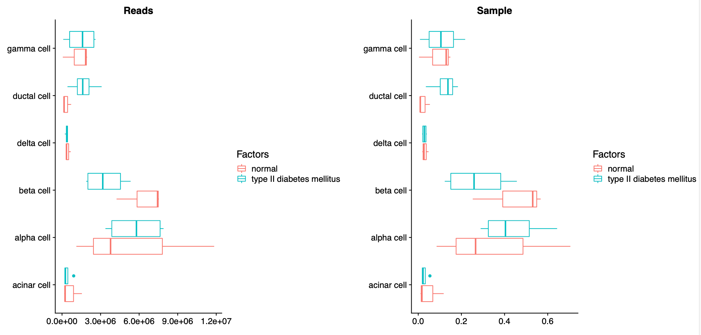
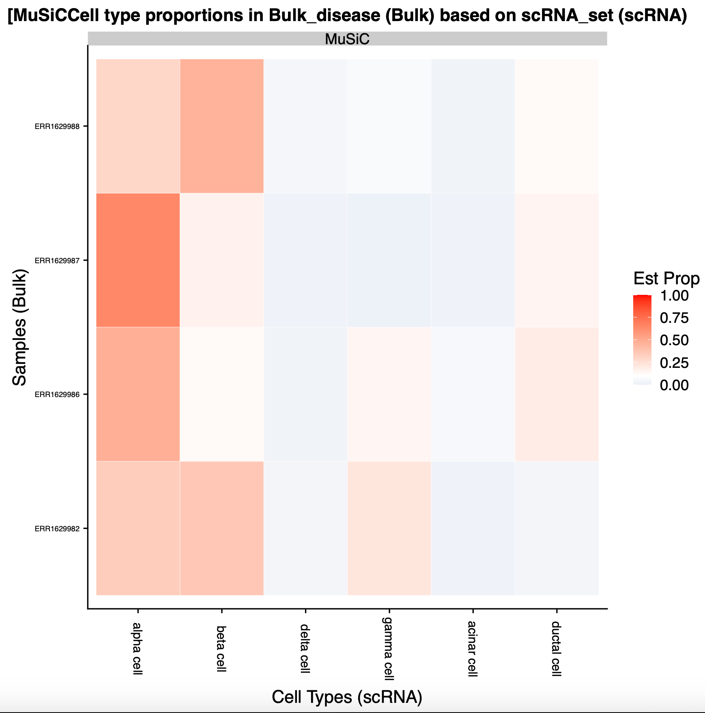

# Introduction
{:.no_toc}

<!-- This is a comment. -->

The goal of this tutorial is to apply bulk RNA deconvolution techniques to a problem with multiple variables - in this case, a model of diabetes is compared with its healthy counterparts. All you need to compare inferred cell compositions are well-annotated, high quality reference scRNA-seq datasets, transformed into MuSiC-friendly Expression Set objects, and your bulk RNA-samples of choice (also transformed into MuSiC-friendly Expression Set objects). For more information on how MuSiC works, you can check out their github site [MuSiC](https://xuranw.github.io/MuSiC/articles/MuSiC.html) or published article 


> ### Agenda
>
> In this tutorial, we will cover:
>
> 1. TOC
> {:toc}
>
{: .agenda}


# Data

In the standard MuSiC tutorial, we used human pancreas data. We will now use the same single cell reference dataset  withits 10 samples of 6 healthy subjects and 4 with Type-II diabetes (T2D), as well as the bulk RNA-samples from the same lab (3 healthy, 4 diseased). Both of these datasets were accessed from the public EMBL-EBI repositories and transformed into Expression Set objects in the previous two tutorials. For both the single cell reference and the bulk samples of interest, you have generated Expression Set objects with only T2D samples, only healthy samples, and a final everything-combined sample for the scRNA reference. The plan is to analyse this data in three ways: using a combined reference (altogether); using only the healthy single cell reference (healthyscref); or using a healthy and combined reference separately (like4like), all to identify differences in cellular composition. 


## Get data

> ###  Hands-on: Data upload
>
> 1. Create a new history for this tutorial *"Deconvolution: Compare"*
> 2. Import the files from [Zenodo]({{ page.zenodo_link }})
>
>    * Human single cell RNA ESet objects (tag: `#singlecell`)
>
>      ```
>    {{ page.zenodo_link }}/files/ESet_object_sc_combined.rdata
>    {{ page.zenodo_link }}/files/ESet_object_sc_T2D.rdata
>    {{ page.zenodo_link }}/files/ESet_object_sc_healthy.rdata
>      ```
>
>    * Human bulk RNA ESet objects (tag: `#bulk`)
>      ```
>    {{ page.zenodo_link }}/files/ESet_object_bulk_healthy.rdata
>    {{ page.zenodo_link }}/files/ESet_object_bulk_T2D.rdata
>      ```
>
>    
>
> 3. Rename the datasets
>
> 5. Add to each file a tag corresponding to `#bulk` and `#scrna`
>
>    
>
{: .hands_on}

# Infer cellular composition & compare

It's finally time!

## Altogether: Deconvolution with a combined sc reference

> <hands-on-title> Comparing: altogether </hands-on-title>
>
> 1.  with the following parameters:
>    - In *"New scRNA Group"*:
>        -  *"Insert New scRNA Group"*
>            - *"Name of scRNA Dataset"*: `scRNA_set`
>            -  *"scRNA Dataset"*: `ESet_object_sc_combined.rdata` (Input dataset)
>            - In *"Advanced scRNA Parameters"*:
>                - *"Cell Types Label from scRNA dataset"*: `Inferred cell type - author labels`
>                - *"Samples Identifier from scRNA dataset"*: `Individual`
>                - *"Comma list of cell types to use from scRNA dataset"*: `alpha cell,beta cell,delta cell,gamma cell,acinar cell,ductal cell`
>            - In *"Bulk Datasets in scRNA Group"*:
>                -  *"Insert Bulk Datasets in scRNA Group"*
>                    - *"Name of Bulk Dataset"*: `Bulk_set`
>                    -  *"Bulk RNA Dataset"*: `ESet_object_bulk_combined.rdata` (Input dataset)
>                    - *"Factor Name"*: `Disease`
>
{: .hands_on}

There are four sets of output files.
1. *Summarised Plots* <- This is the most interesting output, because it has the pretty pictures!
2. *Individual Heatmaps* <- This kind of does what standard (non-Comparing) MuSiC does for each sample, rather than combining them.
3. *Stats* <- This will be very handy if you want to make any statistical calculations, as it contains medians and quartiles
4. *Tables* <- This contains the cell proportions found within each sample as well as the number of reads.

### Summarised Plots

Examine  the output file *Summarised Plots (MuSiC)*. Now the first few pages are pretty standard stuff, similar to the standard deconvolution tool. Page 4 starts to get interesting, with some comparisons between the normal and T2D samples. Page 5, however, contains what we're looking for - a comparison of inferred cell proportions across disease.



Here we can see that the bulk-RNA seq samples from the T2D patients contain markedly fewer beta cells as compared with their healthy counterparts. This makes sense, so that's good!

### Individual Heatmaps

Examine  the output file *Individual heatmaps (MuSiC)*. This shows the cell distribution across each of the individual samples, but isn't terribly informative about our disease variable.



### Stats

If you select the *Stats* dataset, you'll find it contains two sets of data, `Bulk_set: Read Props` and `Bulk_set: Sample Props`. Examine  the file `Bulk_set: Sample Props`. This contains summary statistics (Min, quartiles, median, mean, etc.) for the bulk sample, overall. Again, this does not distinguish between healthy and disease so is not particularly helpful.


### Tables

Finally, if you select the *Tables* dataset, you'll find it contains three sets of data, `Data Table`, `Matrix of Cell Type Read Counts`, and `Matrix of Cell Type Sample Proportions`. 

Examine  the file `Data Table`. This contains the inferred proportions and reads associated with each sample and cell type, alongwith its important factor of interest (Disease). In this tutorial, we tend to use sample proportions rather than read count, but either works.

Finally


KEEP GOING HERE

, examine  the file `Data Table`. 

summary statistics (Min, quartiles, median, mean, etc.) for the bulk sample, overall. Again, this does not distinguish between healthy and disease so is not particularly helpful.


## Altogether: Deconvolution of healthy samples with a healthy reference and diseased samples with a diseased reference

> <hands-on-title> Like4like Inferrence </hands-on-title>
>
> 1.  with the following parameters:
>    - In *"New scRNA Group"*:
>        -  *"Insert New scRNA Group"*
>            - *"Name of scRNA Dataset"*: `scRNA_set:Normal`
>            - In *"Advanced scRNA Parameters"*:
>                - *"Cell Types Label from scRNA dataset"*: `Inferred cell type - author labels`
>                - *"Samples Identifier from scRNA dataset"*: `Individual`
>                - *"Comma list of cell types to use from scRNA dataset"*: `alpha cell,beta cell,delta cell,gamma cell,acinar cell,ductal cell`
>            - In *"Bulk Datasets in scRNA Group"*:
>                -  *"Insert Bulk Datasets in scRNA Group"*
>                    - *"Name of Bulk Dataset"*: `Bulk_set:Normal`
>                    -  *"Bulk RNA Dataset"*: `output` (Input dataset)
>                    - *"Factor Name"*: `Disease`
>        -  *"Insert New scRNA Group"*
>            - *"Name of scRNA Dataset"*: `scRNA_set:T2D`
>            - In *"Advanced scRNA Parameters"*:
>                - *"Cell Types Label from scRNA dataset"*: `Inferred cell type - author labels`
>                - *"Samples Identifier from scRNA dataset"*: `Individual`
>                - *"Comma list of cell types to use from scRNA dataset"*: `alpha cell,beta cell,delta cell,gamma cell,acinar cell,ductal cell`
>            - In *"Bulk Datasets in scRNA Group"*:
>                -  *"Insert Bulk Datasets in scRNA Group"*
>                    - *"Name of Bulk Dataset"*: `bulk_set:T2D`
>                    -  *"Bulk RNA Dataset"*: `output` (Input dataset)
>                    - *"Factor Name"*: `Disease`
>
>    ***TODO***: *Check parameter descriptions*
>
>    ***TODO***: *Consider adding a comment or tip box*
>
>    > <comment-title> short description </comment-title>
>    >
>    > A comment about the tool or something else. This box can also be in the main text
>    {: .comment}
>
{: .hands_on}

***TODO***: *Consider adding a question to test the learners understanding of the previous exercise*

> <question-title></question-title>
>
> 1. Question1?
> 2. Question2?
>
> > <solution-title></solution-title>
> >
> > 1. Answer for question1
> > 2. Answer for question2
> >
> {: .solution}
>
{: .question}

## healthyscref: Deconvolution using only healthy cells as a reference

> <hands-on-title> Healthy sc reference only inferrence </hands-on-title>
>
> 1.  with the following parameters:
>    - In *"New scRNA Group"*:
>        -  *"Insert New scRNA Group"*
>            - *"Name of scRNA Dataset"*: `scRNA_set:Normal`
>            - In *"Advanced scRNA Parameters"*:
>                - *"Cell Types Label from scRNA dataset"*: `Inferred cell type - author labels`
>                - *"Samples Identifier from scRNA dataset"*: `Individual`
>                - *"Comma list of cell types to use from scRNA dataset"*: `alpha cell,beta cell,delta cell,gamma cell,acinar cell,ductal cell`
>            - In *"Bulk Datasets in scRNA Group"*:
>                -  *"Insert Bulk Datasets in scRNA Group"*
>                    - *"Name of Bulk Dataset"*: `Bulk_set:Normal`
>                    -  *"Bulk RNA Dataset"*: `output` (Input dataset)
>                    - *"Factor Name"*: `Disease`
>                -  *"Insert Bulk Datasets in scRNA Group"*
>                    - *"Name of Bulk Dataset"*: `Bulk_set:T2D`
>                    - *"Factor Name"*: `Disease`
>
>    ***TODO***: *Check parameter descriptions*
>
>    ***TODO***: *Consider adding a comment or tip box*
>
>    > <comment-title> short description </comment-title>
>    >
>    > A comment about the tool or something else. This box can also be in the main text
>    {: .comment}
>
{: .hands_on}

***TODO***: *Consider adding a question to test the learners understanding of the previous exercise*

> <question-title></question-title>
>
> 1. Question1?
> 2. Question2?
>
> > <solution-title></solution-title>
> >
> > 1. Answer for question1
> > 2. Answer for question2
> >
> {: .solution}
>
{: .question}

## Re-arrange

To create the template, each step of the workflow had its own subsection.

***TODO***: *Re-arrange the generated subsections into sections or other subsections.
Consider merging some hands-on boxes to have a meaningful flow of the analyses*

# Conclusion

Sum up the tutorial and the key takeaways here. We encourage adding an overview image of the
pipeline used.