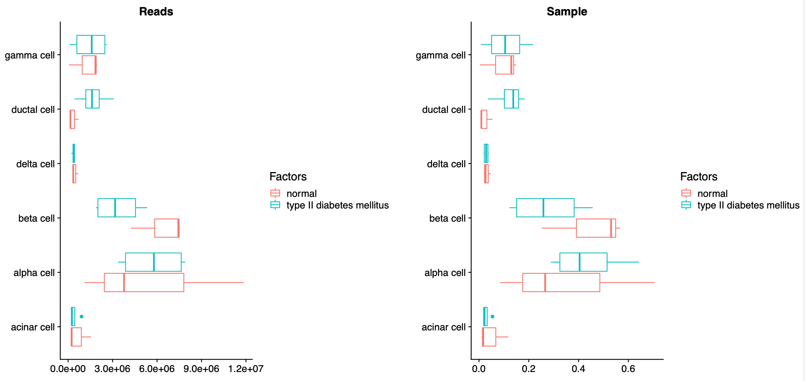
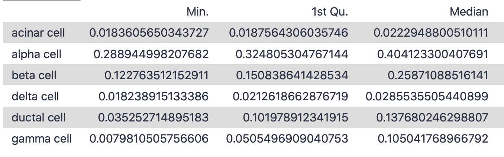

# Introduction

The goal of this tutorial is to apply bulk RNA deconvolution techniques to a problem with multiple variables - in this case, a model of diabetes is compared with its healthy counterparts. All you need to compare inferred cell compositions are well-annotated, high quality reference scRNA-seq datasets, transformed into MuSiC-friendly Expression Set objects, and your bulk RNA-samples of choice (also transformed into MuSiC-friendly Expression Set objects). For more information on how MuSiC works, you can check out their github site [MuSiC](https://xuranw.github.io/MuSiC/articles/MuSiC.html) or published article ().

> <comment-title>Research question</comment-title>
> - How does variable X impact the cell distributions in my samples?
> - Needs: scRNA-seq reference dataset; bulk RNA-seq samples of interest to compare
{: .comment}

> <agenda-title></agenda-title>
>
> In this tutorial, we will cover:
>
> 1. TOC
> {:toc}
>
{: .agenda}


# Data

In the standard MuSiC tutorial, we used human pancreas data. We will now use the same single cell reference dataset  with its 10 samples of 6 healthy subjects and 4 with Type-II diabetes (T2D), as well as the bulk RNA-samples from the same lab (3 healthy, 4 diseased). Both of these datasets were accessed from the public EMBL-EBI repositories and transformed into Expression Set objects in the previous two tutorials. For both the single cell reference and the bulk samples of interest, you have generated Expression Set objects with only T2D samples, only healthy samples, and a final everything-combined sample for the scRNA reference. We won't need the combined bulk RNA dataset. The plan is to analyse this data in three ways: using a combined reference (altogether); using only the healthy single cell reference (healthyscref); or using a healthy and combined reference separately (like4like), all to identify differences in cellular composition.


If you have followed the previous tutorials to create your own bulk and single cell expression sets, then you can copy these into a new history now. Otherwise, follow the steps below to import the datasets you'll need. 



## Get data

> <hands-on-title>Data upload</hands-on-title>
>
> 1. Create a new history for this tutorial *"Deconvolution: Compare"*
> 2. Import the files from [Zenodo]({{ page.zenodo_link }})
>
>    * Human single cell RNA ESet objects (tag: `#singlecell`)
>
>      ```
>    {{ page.zenodo_link }}/files/ESet_object_sc_combined.rdata
>    {{ page.zenodo_link }}/files/ESet_object_sc_T2D.rdata
>    {{ page.zenodo_link }}/files/ESet_object_sc_healthy.rdata
>      ```
>
>    * Human bulk RNA ESet objects (tag: `#bulk`)
>      ```
>    {{ page.zenodo_link }}/files/ESet_object_bulk_healthy.rdata
>    {{ page.zenodo_link }}/files/ESet_object_bulk_T2D.rdata
>      ```
>
>    
>
> 3. Rename the datasets as needed
>
> 4. Add to each file a tag corresponding to `#bulk` and `#scrna`
>
>    
>
{: .hands_on}

# Infer cellular composition & compare

It's finally time!

## Altogether: Deconvolution with a combined sc reference



> <hands-on-title> Comparing: altogether </hands-on-title>
>
> 1.  with the following parameters:
>    - In *"New scRNA Group"*:
>        -  *"Insert New scRNA Group"*
>            - *"Name of scRNA Dataset"*: `scRNA_set`
>            -  *"scRNA Dataset"*: `ESet_object_sc_combined.rdata` (Input dataset)
>            - In *"Advanced scRNA Parameters"*:
>                - *"Cell Types Label from scRNA dataset"*: `Inferred cell type - author labels`
>                - *"Samples Identifier from scRNA dataset"*: `Individual`
>                - *"Comma list of cell types to use from scRNA dataset"*: `alpha cell,beta cell,delta cell,gamma cell,acinar cell,ductal cell`
>            - In *"Bulk Datasets in scRNA Group"*:
>                -  *"Insert Bulk Datasets in scRNA Group"*
>                    - *"Name of Bulk Dataset"*: `Bulk_set:Normal`
>                    -  *"Bulk RNA Dataset"*: `ESet_object_bulk_healthy.rdata` (Input dataset)
>                    - *"Factor Name"*: `Disease`
>                -  *"Insert Bulk Datasets in scRNA Group"*
>                    - *"Name of Bulk Dataset"*: `Bulk_set:T2D`
>                    -  *"Bulk RNA Dataset"*: `ESet_object_bulk_T2D.rdata` (Input dataset)
>                    - *"Factor Name"*: `Disease`
>
> 2. To each of the outputs, add the `#altogether` tag.
>
{: .hands_on}

There are four sets of output files.
1. *Summarised Plots* <- This is the most interesting output, because it has the pretty pictures!
2. *Individual Heatmaps* <- This kind of does what standard (non-Comparing) MuSiC does for each sample, rather than combining them.
3. *Stats* <- This will be very handy if you want to make any statistical calculations, as it contains medians and quartiles
4. *Tables* <- This contains the cell proportions found within each sample as well as the number of reads.

### Summarised Plots

Examine  the output file *Summarised Plots (MuSiC)*. Now the first few pages are similar to the standard deconvolution tool, but now comparing across the factor of interest (disease). Among the myriad of visualisations available, our favourite is on page 5 - a comparison of inferred cell proportions across disease.



Here we can see that the bulk-RNA seq samples from the T2D patients contain markedly fewer beta cells as compared with their healthy counterparts. This makes sense, so that's good!

### Individual Heatmaps

Examine  the output file *Individual heatmaps (MuSiC)*. This shows the cell distribution across each of the individual samples, separated out by disease factor into two separate plots, but ultimately isn't particularly informative.


### Stats

If you select the *Stats* dataset, you'll find it contains four sets of data, `Bulk_disease: Read Props`, `Bulk_disease: Sample Props`, `Bulk_healthy: Read Props` and `Bulk_healthy: Sample Props`. Examine  the file `Bulk_disease: Sample Props`. This contains summary statistics (Min, quartiles, median, mean, etc.) for each phenotype. This could be quite helpful if you're trying to statistically identify differences across samples.



### Tables

Finally, if you select the *Tables* dataset, you'll find it contains three sets of data, `Data Table`, `Matrix of Cell Type Read Counts`, and `Matrix of Cell Type Sample Proportions`.

Examine  the file `Data Table`. This contains the inferred proportions and reads associated with each sample and cell type, along with its important factor of interest (Disease). In this tutorial, we tend to use sample proportions rather than read count, but either works. The two other matrix files are just portions of this data table.


> <question-title></question-title>
>
> 1. Why does the data table contain 42 rows?
>
> > <solution-title></solution-title>
> >
> > 1. The data table contains a row for each cell type within each sample. Since there are 6 cell types and 7 samples, `6*7 = 42` rows.
> >
> {: .solution}
>
{: .question}

Hopefully, this has been illuminating! Now let's try two other ways of inferring from a reference and see if it makes a difference.

## Like4like: Deconvolution of healthy samples with a healthy reference and diseased samples with a diseased reference

> <hands-on-title> Like4like Inference </hands-on-title>
>
> 1.  with the following parameters:
>    - In *"New scRNA Group"*:
>        -  *"Insert New scRNA Group"*
>            - *"Name of scRNA Dataset"*: `scRNA_set:Normal`
>            -  *"scRNA Dataset"*: `ESet_object_sc_healthy.rdata` (Input dataset)
>            - In *"Advanced scRNA Parameters"*:
>                - *"Cell Types Label from scRNA dataset"*: `Inferred cell type - author labels`
>                - *"Samples Identifier from scRNA dataset"*: `Individual`
>                - *"Comma list of cell types to use from scRNA dataset"*: `alpha cell,beta cell,delta cell,gamma cell,acinar cell,ductal cell`
>            - In *"Bulk Datasets in scRNA Group"*:
>                -  *"Insert Bulk Datasets in scRNA Group"*
>                    - *"Name of Bulk Dataset"*: `Bulk_set:Normal`
>                    -  *"Bulk RNA Dataset"*: `ESet_object_bulk_healthy.rdata` (Input dataset)
>                    - *"Factor Name"*: `Disease`
>        -  *"Insert New scRNA Group"*
>            - *"Name of scRNA Dataset"*: `scRNA_set:T2D`
>            -  *"scRNA Dataset"*: `ESet_object_sc_T2D.rdata` (Input dataset)
>            - In *"Advanced scRNA Parameters"*:
>                - *"Cell Types Label from scRNA dataset"*: `Inferred cell type - author labels`
>                - *"Samples Identifier from scRNA dataset"*: `Individual`
>                - *"Comma list of cell types to use from scRNA dataset"*: `alpha cell,beta cell,delta cell,gamma cell,acinar cell,ductal cell`
>            - In *"Bulk Datasets in scRNA Group"*:
>                -  *"Insert Bulk Datasets in scRNA Group"*
>                    - *"Name of Bulk Dataset"*: `bulk_set:T2D`
>                    -  *"Bulk RNA Dataset"*: `ESet_object_bulk_T2D.rdata` (Input dataset)
>                    - *"Factor Name"*: `Disease`
>
> 2. Add the `#like4like` tag to each of the outputs.
>
{: .hands_on}

> <question-title></question-title>
>
> 1. How have the cell inferences changed, now that we have changed the scRNA references used?
>
> > <solution-title></solution-title>
> >
> > 
> > 1. Overall, our interpretation here is that the differences are less pronounced. It's interesting to conjecture whether this is an artefact of analysis, or whether - possibly - the beta cells in the diseased samples are not only fewer, but also contain fewer beta-cell specific transcripts (and thereby inhibited beta cell function), thereby lowering the bar for the inference of a beta cell and leading to a higher proportion of interred B-cells.
> >
> {: .solution}
>
{: .question}

Let's try one more inference - this time, we'll use only healthy cells as a reference, to (theoretically) make a more consistent analysis across the two phenotypes.

## healthyscref: Deconvolution using only healthy cells as a reference

> <hands-on-title> Healthy sc reference only inference </hands-on-title>
>
> 1.  with the following parameters:
>    - In *"New scRNA Group"*:
>        -  *"Insert New scRNA Group"*
>            - *"Name of scRNA Dataset"*: `scRNA_set:Normal`
>            -  *"scRNA Dataset"*: `ESet_object_sc_healthy.rdata` (Input dataset)
>            - In *"Advanced scRNA Parameters"*:
>                - *"Cell Types Label from scRNA dataset"*: `Inferred cell type - author labels`
>                - *"Samples Identifier from scRNA dataset"*: `Individual`
>                - *"Comma list of cell types to use from scRNA dataset"*: `alpha cell,beta cell,delta cell,gamma cell,acinar cell,ductal cell`
>            - In *"Bulk Datasets in scRNA Group"*:
>                -  *"Insert Bulk Datasets in scRNA Group"*
>                    - *"Name of Bulk Dataset"*: `Bulk_set:Normal`
>                    -  *"Bulk RNA Dataset"*: `ESet_object_bulk_healthy.rdata` (Input dataset)
>                    - *"Factor Name"*: `Disease`
>                -  *"Insert Bulk Datasets in scRNA Group"*
>                    - *"Name of Bulk Dataset"*: `Bulk_set:T2D`
>                    -  *"Bulk RNA Dataset"*: `ESet_object_bulk_T2D.rdata` (Input dataset)
>                    - *"Factor Name"*: `Disease`
>
> 2. Add the `#healthyscref` tag to each of the outputs.
>
{: .hands_on}

> <question-title></question-title>
>
> 1. How have the cell inferences changed this time?
>
> > <solution-title></solution-title>
> >
> > > > 
> >
> > 1. If using a like4like inference reduced the difference between the phenotype, aligning both phenotypes to the same (healthy) reference exacerbated them - there are even fewer beta cells in the output of this analysis.
> >
> {: .solution}
>
{: .question}

Overall, it's important to remember how the inference changes depending on the reference used - for example, a combined reference might have majority healthy samples or diseased samples, so that would impact the inferred cellular compositions.

# Conclusion

Congrats! You've made it to the end of this suite of deconvolution tutorials! You've learned how to find quality data for reference and for analysis, how to reformat it for deconvolution using MuSiC, and how to compare cellular inferences using multiple kinds of reference datasets. You can find the [workflow for this tutorial](https://usegalaxy.eu/u/wendi.bacon.training/w/music-deconvolution-compare-1) and an [example history](https://usegalaxy.eu/u/wendi.bacon.training/h/music-deconvolution-comparisons--final).

 We hope this helps you in your research!


This tutorial is part of the [https://singlecell.usegalaxy.eu](https://singlecell.usegalaxy.eu) portal ().
