# Introduction


<!-- using info from here: https://xuranw.github.io/MuSiC/articles/MuSiC.html -->

Bulk RNA-seq data contains a mixture of transcript signatures from several types of cells. We wish to deconvolve this mixture to obtain estimates of the proportions of cell types within the bulk sample. To do this, we can use single cell RNA-seq data as a reference for estimating the cell type proportions within the bulk data.

In this tutorial, we will use bulk and single-cell RNA-seq data, including matrices of similar tissues from different sources, to illustrate how to infer cell type abundances from bulk RNA-seq.

> <agenda-title></agenda-title>
>
> In this tutorial, we will cover:
>
> 1. TOC
> {:toc}
>
{: .agenda}

## Bulk RNA-seq Cell Type Deconvolution

The heterogeneity that exists in the cellular composition of bulk RNA-seq can add bias to the results from differential expression analysis. In order to circumvent this limitation, RNA-seq deconvolution aims to infer cell type abundances by modelling the gene expressions levels as 'weighted sums' of cell type specific expression profiles.

> <details-title>More details on 'Sums'</details-title>
>
> **So...** You fancy some maths do you? Good! This is important, as you'll see variations of the phrase 'weighted sums' if you ever look at any papers in the field! Let's think about just the 'sums' here.
> If we think about the total expression of a given gene you might get from bulk RNA-seq, you could also think about it as the sum of the expression of each cell, for example,
>
> *Total = cell<sub>a</sub> expression + cell<sub>b</sub> expression ... (and so forth)*
>
> This is a *'sum'*, because we're adding up all the cells. If we now think about how we expect similar expression from similar cell types, we could change this to the following:
>
> *Total = cell_type<sub>a</sub> expression + cell_type<sub>b</sub> expression*  ... (and so forth)
>
> **BUT WAIT!** That's not strictly true, because the cell types are not all in equal proportion (if only!). So we have to take into account another variable, the proportion a given cell type takes up in a sample. So we now have:
>
> *Total = Proportion<sub>a</sub> x cell_type<sub>a</sub> expression + Proportion<sub>b</sub> x cell_type<sub>b</sub> expression*
>
> So now, we are using the sums of expression based off of the cell proportion. And if you're a mathematician, you might instead put this as
>
> **T = C x P**
> or some fancier formulas...(read more [in-depth here](https://academic.oup.com/bioinformatics/article/34/11/1969/4813737) if you like!)
>
> The point is, if we have an idea of what the average expression should be for each gene (what we can get from single cell RNA-seq data, *C*), and we have the total expression (from the bulk RNA-seq, *T*), then we can infer the cell proportions (*P*).
>
{: .details}

Many different computational methods have been developed to estimate these cell type proportions, but in this tutorial we will be using the [MuSiC](https://xuranw.github.io/MuSiC/articles/MuSiC.html) tool suite () to estimate the proportion of individual cell types in our bulk RNA-seq datasets.

### MusiC

MuSiC uses cell-type specific gene expression from single-cell RNA seq data to characterize cell type compositions (proportions) from bulk RNA-seq data in complex tissues. By appropriate weighting of genes showing cross-subject (sample to sample) and cross-cell (cells of the same cell type within a sample) consistency, MuSiC enables the transfer of cell type-specific gene expression information from one dataset to another.

> <question-title></question-title>
>
> 1. What is a weighted sum? *Hint*: What kinds of genes would be best for distinguishing cell types, and what kinds of genes would make it difficult?
>
> > <solution-title></solution-title>
> >
> > 1. So you know what the *Sum* is from above - the total expression of a given gene in a bulk RNA-seq sample depends on the proportion of cell types and the average expression level of each of those cell types (**T = C x P**). However, single cell RNA-seq data is highly variable. Cell-type specific expression in genes with lower variation from sample to sample (i.e. person to person or organism to organism) and cell to cell (i.e. within a sample) will be the most useful for distinguishing cells, while genes that vary heavily (i.e. high in cell type<sub>a</sub> in one sample, but low in cell type<sub>a</sub> in another sample) will be the least useful in accurately distinguishing cells. Therefore, to accurately use the mean expression level in a cell_type, MusiC weights the sums, favouring more consistently expressed genes in cell types.
> >
> {: .solution}
{: .question}

Solid tissues often contain closely related cell types that are difficult to distinguish from one another, a phenomenon known as *"collinearity"*. To deal with collinearity, MuSiC can also employ a tree-guided procedure that recursively zooms in on closely related cell types. Briefly, MuSic first groups similar cell types into the same cluster and estimates cluster proportions, then recursively repeats this procedure within each cluster.

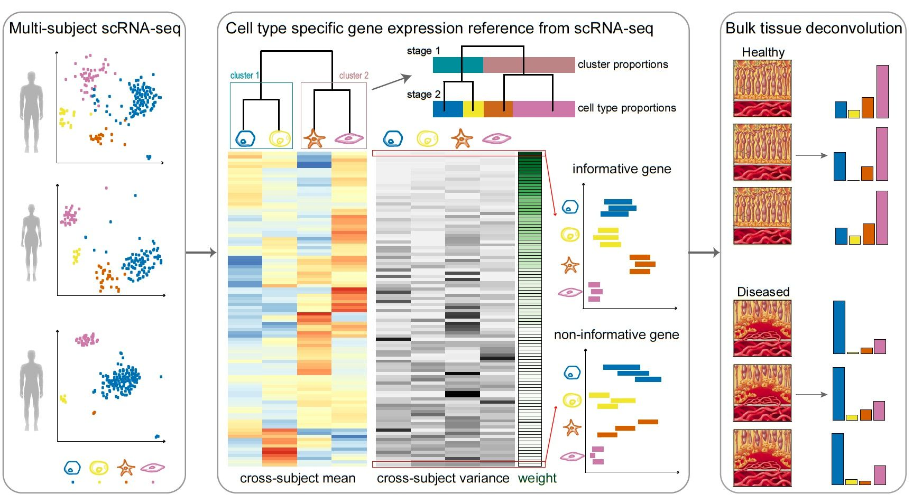

# Cell Proportion Estimation

Here we will extract cell proportions from a bulk data of human pancreas data from  concerning 56 638 genes across 89 samples, using a single cell human pancreas dataset from  containing 25 453 genes across 2209 cells, clustered into 14 cell types, from 6 healthy subjects and 4 with Type-II diabetes (T2D). If the deconvolution is good, and the datasets are compatible with sufficient enough overlap, we should be able to identify the same cell types from the bulk data.

## Get data

> <hands-on-title>Data upload</hands-on-title>
>
> 1. Create a new history for this tutorial *"Deconvolution: Cell Type inference of Human Pancreas Data"*
> 2. Import the files from [Zenodo]({{ page.zenodo_link }}) or from
>    the shared data library (`GTN - Material` -> `{{ page.topic_name }}`
>     -> `{{ page.title }}`):
>
>    * Human pancreas bulk RNA datasets (tag: `#bulk`)
>
>      ```
>      https://zenodo.org/record/5719228/files/GSE50244bulkeset.expression.tabular
>      https://zenodo.org/record/5719228/files/GSE50244bulkeset.phenotype.tabular
>      ```
>    * Human pancreas single-cell RNA datasets (tag: `#scrna`)
>      ```
>      https://zenodo.org/record/5719228/files/EMTABesethealthy.expression.tabular
>      https://zenodo.org/record/5719228/files/EMTABesethealthy.phenotype.tabular
>      ```
>
>    
>
>    
>
> 3. Rename the datasets
>
> 4. Check the datatype
>
>    
>
> 5. Add to each `expression` file a tag corresponding to `#bulk` and `#scrna`
>
>    
>
{: .hands_on}

### Exploring the Datasets

  We are told before we download the data, that:
  * The bulk human pancreas dataset is 89 samples across 56 638 genes
  * The single cell human pancreas datasets is 2209 cells across 24 453 genes.

  But what does this actually look like in the data?

> <comment-title>Inspecting Datasets</comment-title>
>
> Note that at any time you can visually inspect the input datasets yourself by either:
> * Expanding the dataset in the history panel clicking on the name of the dataset
> * Or clicking on  icon to load them into the main window.
{: .comment}

Let's start exploring the datasets.

> <hands-on-title>Exploring the Datasets</hands-on-title>
>
> 1. Inspect the `#scrna` expression file
>
>    > <question-title></question-title>
>    >
>    > 1. What do the rows and columns correspond to?
>    > 2. What do the values at each position mean?
>    > 3. Has the data been normalised?
>    > 4. Why are there so many zeroes?
>    >
>    > > <solution-title></solution-title>
>    > >
>    > > 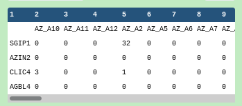
>    > >
>    > > 1. Rows correspond to gene names, and columns to cell identifiers
>    > > 2. These are the number of reads or counts for each gene for each cell
>    > > 3. The data has not been normalised since the counts are integer and not decimal
>    > > 4. Single-cell datasets can be very sparse for a variety of reasons relating to dropouts and biological factors. For more information, please see the [introduction single-cell RNA-seq slides#41](../../tutorials/scrna-intro/slides.html).
>    > >
>    > {: .solution}
>    {: .question}
>
> 2. Inspect the `#bulk` expression file
>
>    > <question-title></question-title>
>    >
>    > 1. What do the rows and columns correspond to?
>    > 2. In which field is there likely to be overlap with the `#scrna` dataset?
>    >
>    > > <solution-title></solution-title>
>    > >
>    > > 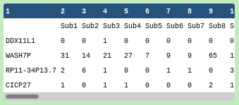
>    > >
>    > > 1. As before with the `#scrna` dataset, rows correspond to gene names and columns to sample identifiers.
>    > > 2. The sample identifiers and the cell identifiers are completely different, but the gene names appear to be using the same symbols as the `#scrna` dataset, so the gene field is the common factor here.
>    > >
>    > {: .solution}
>    {: .question}
>
> 3. Inspect the `#scrna` phenotype file
>
>    > <question-title></question-title>
>    >
>    > 1. Does the phenotypes file describe genes or cells?
>    > 2. What does the `SubjectName` field describe?
>    > 3. What does the `cellType` field describe?
>    >
>    > > <solution-title></solution-title>
>    > >
>    > > 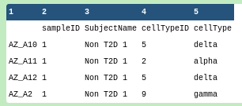
>    > >
>    > > 1. The first column is the index column, which uses the cell identifiers in the header of the `#scrna` expression file, so the phenotypes file describes the cells.
>    > > 2. `SubjectName` tells us whether the cell (on that row) is labelled as Type-II diabetes or not, "Non T2D" or "T2D" respectively.
>    > > 3. `cellType` tells us which cell type the cell was assigned to. This could be the result of prior-clustering and then labelling, or the cells could be labelled before analysis.
>    > >
>    > {: .solution}
>    {: .question}
>
> 4. Inspect the `#bulk` phenotype file
>
>    > <question-title></question-title>
>    >
>    > 1. Does the phenotypes file describe genes or samples?
>    > 2. Is the `SubjectName` field related to the `SubjectName` field in the `#scrna` phenotypes file?
>    > 3. What other factors are in the phenotypes file?
>    > 4. Is the `tissue` field related to the `cellType` field in the `#scrna` phenotypes file?
>    >
>    > > <solution-title></solution-title>
>    > >
>    > > 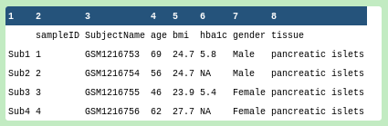
>    > >
>    > > 1. The first column is the index column, which uses the sample identifiers in the header of the `#bulk` expression file, so the phenotypes file describes the samples.
>    > > 2. The `SubjectName` column uses a completely different set of identifiers from the `#scrna` phenotypes file so they should be assumed to be unrelated.
>    > > 3. We see `age`, `bmi`, `hba1c`, `gender`, `tissue`. HbA1c appears to be a gene of interest related to a known phenotype.
>    > > 4. **This is the question we wish to answer in the deconvolution**. Visually, there appears to be no overlap, but the "pancreatic islets" tissue likely consists of several cell types that show expressions profiles with some affinity  to the single cell types described in the `#scrna` phenotypes file.
>    > >
>    > {: .solution}
>    {: .question}
>
{: .hands_on}

   The bulk RNA-seq phenotype file lists the main factors of interest, and HbA1c appears to be a specific gene associated with a phenotype. It is well known that the beta cell proportions are related to T2D disease status. In the progress of T2D, the number of beta cells decreases. One of the most important tests for T2D is the HbA1c (hemoglobin A1c) test. When the HbA1c level is greater than 6.5%, the patient is diagnosed as T2D. We will look later at the beta cell proportions relationship with HbA1c level in this deconvolution analysis.

## Building the Expression Set objects



For now we need to construct our Expression set objects that will be consumed by MuSiC.

> <details-title>Expression Set</details-title>
>
> 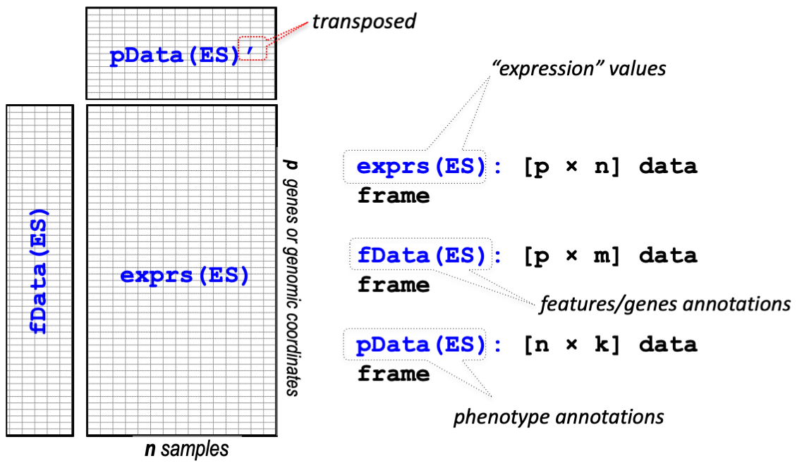
>
>
> *Expression Set* objects are a container for high-throughput assays and experimental metadata. The *ExpressionSet* class is derived from *eSet*, and requires a matrix named *exprs*.
>
> The *ExpressionSet* class is designed to combine several different sources of information into a single convenient structure. An *ExpressionSet* can be manipulated (e.g., subsetted, copied) conveniently, and is the input or output from many Bioconductor functions.
>
> The data in an *ExpressionSet* is complicated, consisting of:
> - expression data (*exprs*, or assayData; assayData is used to hint at the methods used to access different data components, as we will see below);
> - metadata describing samples in the experiment (phenoData, *pData*)
> - information related to the protocol used for processing each sample and usually extracted from manufacturer files (protocolData);
> - annotations and metadata about the features on the chip or technology used for the experiment (featureData, annotation, *fData*);
> - and a flexible structure to describe the experiment (experimentData).
>
> The ExpressionSet class coordinates all of this data, so that you do not usually have to worry about the details.
>
> For more information please [read the specification](http://www.bioconductor.org/packages/release/bioc/vignettes/Biobase/inst/doc/ExpressionSetIntroduction.pdf) as well as the [image source](https://montilab.github.io/BS831/articles/docs/ExpressionSet.html).
>
{: .details}

Here we shall build two ExpressionSet objects corresponding to the bulk and single-cell datatypes.

### **Construct Expression Set Object**

> <hands-on-title>Build the Expression Set inputs</hands-on-title>
>
> 1.  with the following parameters:
>    -  *"Assay Data"*: `GSE50244bulkeset.expression.tabular` (Input dataset)
>    -  *"Phenotype Data"*: `GSE50244bulkeset.phenotype.tabular` (Input dataset)
>
>    > <comment-title></comment-title>
>    >
>    > An ExpressionSet object has many data slots, the principle of which are the experiment data (*exprs*), the phenotype data (*pData*), as well metadata pertaining to experiment information and additional annotations (*fData*).
>    {: .comment}
>
> 2.  with the following parameters:
>    -  *"Assay Data"*: `EMTABesethealthy.expression.tabular` (Input dataset)
>    -  *"Phenotype Data"*: `EMTABesethealthy.phenotype.tabular` (Input dataset)
>
{: .hands_on}

#### **Inspect Expression Set Object**

We will now inspect these objects we just created to see what information we can extract out of them, and how these multiple datasets are summarized within the object.

> <hands-on-title>Inspect and Describe the scRNA ExpressionSet Object</hands-on-title>
>
> 1. Obtain General Info about the data set
>    -  Click on the `#scrna` *General Info* dataset in the history view (output of **Construct Expression Set Object** )
> 1. Obtain Feature Information about the data set
>    -  with the following parameters:
>         > <warning-title>Danger: This tool has needs!</warning-title>
>         > You may need to click the dataset from your history and drag it into the input of this tool. Some browsers don't allow this.
>         {: .warning}
>       -  *"ESet Dataset"*: `#scrna` (output of **Construct Expression Set Object** )
>       - *"Inspect"*: `Feature Data Table`
>         > <comment-title>Features or Genes?</comment-title>
>         >
>         > "Features" are synonymous with "Genes" in a genomic setting, but data scientists tend to prefer to use the former term, as it can be used in other non-genomic settings.
>         >
>         {: .comment}
> By inspecting the `Feature Data Table`, you should see a list of gene names.
>
> 1. Obtain the dimensions of the data set
>    -  with the following parameters:
>      -  *"ESet Dataset"*: `#scrna` (output of **Construct Expression Set Object** )
>      - *"Inspect"*: `Dimension`
>
{: .hands_on}

> <question-title></question-title>
>
> 1. How many samples are in the dataset, and how many genes?
> 2. Does this agree with the original input tabular expression data set?
>
> > <solution-title></solution-title>
> >
> > 1. 1097 samples and 25 453 genes
> > 2. Yes!
> >
> {: .solution}
>
{: .question}


## Estimating Cell Type proportions

<!-- Maybe this goes in a comment? -->
Instead of selecting marker genes, MuSiC gives weights to each gene. The weighting scheme is based on cross-subject variation, by up-weighing genes with low variation and down-weighing genes with high variation in a cell type. Here we demonstrate this step-by-step with the human pancreas datasets.

The deconvolution of 89 subjects from  is performed with the bulk data GSE50244 expression set and single cell reference EMTAB. The estimation was constrained on 6 major cell types: alpha, beta, delta, gamma, acinar and ductal, which make up over 90% of the whole islet.

### Cell Type estimation with **MuSiC**

The deconvolution process can be performed by simply inputting the bulk RNA-seq & scRNA-seq datasets and then hitting execute. However, in this section we will be tracing the effect of a disease phenotype across both datasets.

Here we will use one of the factors from the bulk RNA-seq phenotypes related to the T2D disease status. Any bulk RNA-seq sample coming from a patient with the `HbA1c` factor above 6.5% would be clinically classified as having T2D, so we want to compare these datasets with non-diseased samples. As diabetes affects Beta cells, we're particularly interested in these cells proportions - mostly to prove that the deconvolution has worked well!

It's also important that input scRNA-seq datasets (ideally) have some representation of cell populations from diseased patients.

> <question-title></question-title>
>
> 1. Why should the scRNA-seq dataset contain diseased cells and healthy cells?
>
> > <solution-title></solution-title>
> >
> > 1. For instance, there might be a weird extra cell type that appears in the disease phenotype. Or perhaps there is a missing cell type in the disease phenotype. Without both healthy & diseased datasets, the cells in the bulk datasets might not be fully identifiable. Saying that, such datasets are not always available - something to keep in mind when interpreting the results!
> >
> {: .solution}
>
{: .question}


> <hands-on-title>Task description</hands-on-title>
>
> 1.  with the following parameters:
>    - *MuSiC sometimes does not show up from the tool search box. You may need to look for it under the **Single Cell** heading
>    -  *"scRNA Dataset"*: `#scrna` (output of **Construct Expression Set Object** )
>    -  *"Bulk RNA Dataset"*: `#bulk` (output of **Construct Expression Set Object** )
>    - *"Purpose"*: `Estimate Proportions`
>        - *"Methods to use"*: `MuSiC` and `NNLS`
>        - *"Cell Types Label from scRNA dataset"*: `cellType`
>        - *"Samples Identifier from scRNA dataset"*: `sampleID`
>        - *"Comma list of cell types to use from scRNA dataset"*: `alpha,beta,delta,gamma,acinar,ductal`
>        - *"Phenotype factors"*: `(leave blank)`
>        - *"Excluded phenotype factors"*: `sampleID,SubjectName`
>        - Under *"Show proportions of a disease factor?"*: `Yes`
>          - *"scRNA Phenotype Cell Target"*: `beta`
>          - *"Bulk Phenotype Target"*: `hba1c` (**Factor from Bulk Phenotype**)
>          - *"Bulk Phenotype Target Threshold"*: `6.5`
>          - *"scRNA Sample Disease Group"*: `T2D` (**Ideally a Factor from scRNA Phenotype**)
>          - *"scRNA Sample Disease Group (Scale)"*: `5`
>
>    > <comment-title></comment-title>
>    >
>    > It's important to set a phenotype target threshold, otherwise no cells will be matched for the phenotype target. In this case, when the HbA1c level is greater than 6.5%, the patient is diagnosed as T2D.
>    {: .comment}
>
{: .hands_on}

The estimated proportions are normalized such that the proportions of cell types within each sample sum to 1. MuSic compares itself against a previous method of deconvolution known as Non-negative Least-Squares (NNLS), which MuSic supercededs via its Weighted Non-negative Least-Squares (W-NNLS) methodology. You can remove this if you wish from within the tool parameters when running.

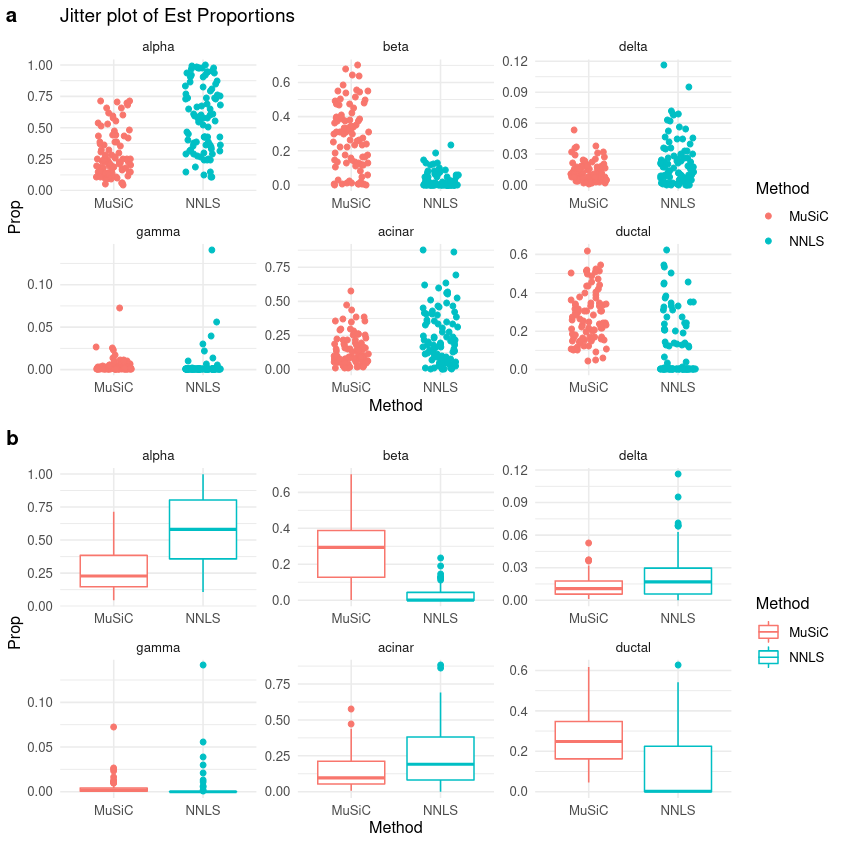

In the above image you can see (a) the estimated proportion of cells for each of the 6 declared types, as calculated by MuSiC and the NNLS methods, respectively. In the (b) section, this information is better represented as a box plot to show you the distribution of cell type proportions.

 Cell type proportions by disease factor, and (bottom) HbA1c factor expression against beta cell type proportion")

As stated previously, it is well known that the beta cell proportions are related to T2D disease status. As T2D progresses, the number of beta cells decreases. In the above image we can see in (a) that we have the same information as previous, but we also distinguish between cells that from patients with T2D status over the Normal cell phenotypes. Section (b) further explores this with a linear regression showing the cell type proportion of cells with HbA1c expression, where we see that there is a significant negative correlation between HbA1c level and beta cell proportions.


> <comment-title></comment-title>
>
>  We can extract the coefficients of this fitting by looking at the `Log of Music Fitting Data` in the `Summaries and Logs` output collection:
>
>  ```
>  Coefficients:
>               Estimate Std. Error t value Pr(>|t|)
>  (Intercept)  0.797148   0.194757   4.093  0.00011 ***
>  age          0.002639   0.001772   1.489  0.14087
>  bmi         -0.013620   0.007276  -1.872  0.06529 .
>  hba1c       -0.061396   0.025403  -2.417  0.01819 *
>  genderMale   0.079874   0.039274   2.034  0.04566 *
>
>  ```
>
>  In addition to HbA1c levels, gender has also correlated with beta cell proportions. This is unsurprising, as more men have diabetes than women and sex is known to impact HbA1c levels.
>
{: .comment}

### Proportions of Cell Type to each Bulk RNA sample

One question we might wish to ask is: what affinity did each of the 6 single cell types have to each of the 89 subjects in the bulk data? For this we can look at the raw data  `MuSiC Estimated Proportions of Cell Types` in the `Proportion Matrices`, to get a glimpse of cell type compositions on a bulk RNA sample level.

Both the MuSiC and the NNLS calculations of this data is best represented in the below heatmap, with RNA samples as rows and cell types as columns:

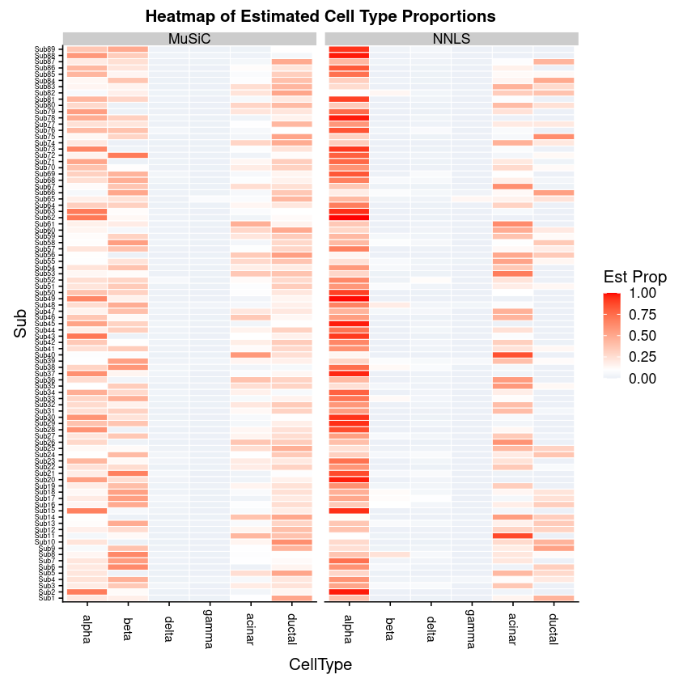

> <question-title></question-title>
>
> 1. Which cell types are under-represented in the NNLS method?
> 2. Which cell types do not appear to be present in both?
>
> > <solution-title></solution-title>
> >
> > 1. Here it is evident that the previous NNLS method over-represents the Alpha cell type compared to the MuSiC method which gives more weight to the Beta and Ductal cell types, which were under-represented in the NNLS method.
> > 2. The Delta and Gamma cell types appear empty in both.
> >
> {: .solution}
>
{: .question}


# Estimation of cell type proportions with pre-grouping of cell types

  In the previous section we estimated cell types under the assumption that that the gene expression between cell types was largely independent. However, solid tissues often contain closely related cell types. This correlation of gene expression between these cell types is termed 'collinearity', which makes it difficult to resolve their relative proportions in bulk data.

  To deal with collinearity, MuSiC can also employ a tree-guided procedure that recursively zooms in on closely related cell types.

  Briefly, similar cell types are grouped into the same cluster and their cluster proportions are estimated, then this procedure is recursively repeated within each cluster. At each recursion stage, only genes that have low within-cluster variance are used, as they should be consistent within a cell type. This is critical as the mean expression estimates of genes with high variance are affected by the pervasive bias in cell capture of scRNA-seq experiments, and thus cannot serve as reliable reference.

  To perform this analysis, we will use mouse kidney single-cell RNA-seq data from  described by 16 273 genes over a trimmed subset of 10 000 cells, giving 16 unique cell type (2 of which are novel) across 7 subjects. The bulk RNA-seq dataset is from  and contains mouse kidney tissue described by 19 033 genes over 10 samples.

## Get data

> <hands-on-title>Data upload</hands-on-title>
>
> 1. Create a new history for this tutorial *"Deconvolution: Dendrogram of Mouse Data"*
> 2. Import the files from [Zenodo]({{ page.zenodo_link }}) or from
>    the shared data library (`GTN - Material` -> `{{ page.topic_name }}`
>     -> `{{ page.title }}`):
>
>    * Mouse kidney bulk RNA datasets (tag: `#bulk`)
>
>      ```
>      https://zenodo.org/record/5719228/files/Mousebulkeset.expression.tabular
>      https://zenodo.org/record/5719228/files/Mousebulkeset.phenotype.tabular
>      ```
>    * Mouse kidney single-cell RNA datasets (tag: `#scrna`)
>      ```
>      https://zenodo.org/record/5719228/files/Mousesubeset.expression.tabular
>      https://zenodo.org/record/5719228/files/Mousesubeset.phenotype.tabular
>      ```
>
>    
>
>    
>
> 3. Rename the datasets
>
> 4. Check that the datatype
>
>    
>
> 5. Add to each `expression` file a tag corresponding to `#bulk` and `#scrna`
>
>    
>
{: .hands_on}

> <details-title>Exploring the Datasets</details-title>
>
> As before, you may choose to explore the bulk and scrna datasets and try to determine their factors from the phenotypes as well as any overlapping fields that will be used to guide the deconvolution.
>
{: .details}

You will need to again create ExpressionSet objects, as before.

### **Construct Expression Set Object**

> <hands-on-title>Build the Expression Set inputs</hands-on-title>
>
> 1.  with the following parameters:
>    -  *"Assay Data"*: `Mousebulkeset.expression.tabular` (Input dataset)
>    -  *"Phenotype Data"*: `Mousebulkeset.phenotype.tabular` (Input dataset)
>
>    > <comment-title></comment-title>
>    >
>    > An ExpressionSet object has many data slots, the principle of which are the experiment data (*exprs*), the phenotype data (*pData*), as well metadata pertaining to experiment information and additional annotations (*fData*).
>    {: .comment}
>
> 2.  with the following parameters:
>    -  *"Assay Data"*: `Mousesubeset.expression.tabular` (Input dataset)
>    -  *"Phenotype Data"*: `Mousesubeset.phenotype.tabular` (Input dataset)
>
{: .hands_on}

### Colinearity Dendrogram with **MuSiC** to determine cell type similarities

 Determining cell type similarities requires first producing a design matrix as well as a cross-subject mean of relative abundance, using a tree-based clustering method of the cell types we wish to cluster.

> <hands-on-title>Task description</hands-on-title>
>
> 1.  with the following parameters:
>    -  *"scRNA Dataset"*: `#scrna` (output of **Construct Expression Set Object** )
>    -  *"Bulk RNA Dataset"*: `#bulk` (output of **Construct Expression Set Object** )
>    - *"Purpose"*: `Compute Dendrogram`
>        - *"Cell Types Label from scRNA Dataset"*: `cellType`
>        - *"Cluster Types Label from scRNA dataset"*: `clusterType`
>        - *"Samples Identifier from scRNA dataset"*: `sampleID`
>        - *"Comma list of cell types to use from scRNA dataset"*:
>           `Endo,Podo,PT,LOH,DCT,CD-PC,CD-IC,Fib,Macro,Neutro,B lymph,T lymph,NK`
>
{: .hands_on}

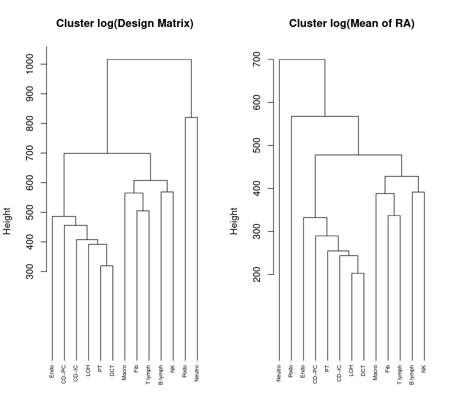

> <question-title></question-title>
>
> 1. What do you notice about the cells clustering?
> 2. How many clusters can you see with a height threshold above 650 in the "Cluster log(Design Matrix)"?
>
> > <solution-title></solution-title>
> >
> > 1. The immune cells are clustered together and the kidney specific cells are clustered together. Notice that DCT and PT are within the same high-level grouping.
> > 2. The cut-off of 650. Here we cut 13 cell types into 4 groups:
> >
> >    ```
> >    C1: Neutro
> >    C2: Podo
> >    C3: Endo, CD-PC, CD-IC, LOH, DCT, PT
> >    C4: Fib, Macro, NK, B lymph, T lymph
> >    ```
> >
> {: .solution}
>
{: .question}


### Heatmap of Cell Type Similarities using **MuSiC**

We shall use the 4 cell type groups determined by the cut off threshold in the above question box. To guide the clustering, we shall upload known epithelial and immune cell markers to improve the more diverse collection of cell types in the C3 and C4 groups.

> <hands-on-title>Upload marker genes and generate heatmap</hands-on-title>
> 1. Import the files from [Zenodo]({{ page.zenodo_link }}) or from
>    the shared data library (`GTN - Material` -> `{{ page.topic_name }}`
>     -> `{{ page.title }}`):
>
>    ```
>    https://zenodo.org/record/5719228/files/epith.markers
>    https://zenodo.org/record/5719228/files/immune.markers
>    ```
>    
>
>    
>
> 2.  with the following parameters:
>    - **Note**
>      > <warning-title>Shortcut!</warning-title>
>      >
>      > Here we need to re-use all the inputs from the previous **MuSiC**  step, plus add a few extra. To speed this up, you can simply click on the re-run icon  under any of its outputs.
>      {: .warning}
>
>    -  *"scRNA Dataset"*: `#scrna` (output of **Construct Expression Set Object** )
>    -  *"Bulk RNA Dataset"*: `#bulk` (output of **Construct Expression Set Object** )
>    - *"Purpose"*: `Compute Dendrogram`
>        - *"Cell Types Label from scRNA Dataset"*: `cellType`
>        - *"Cluster Types Label from scRNA dataset"*: `clusterType`
>        - *"Samples Identifier from scRNA dataset"*: `sampleID`
>        - *"Comma list of cell types to use from scRNA dataset"*:
>           `Endo,Podo,PT,LOH,DCT,CD-PC,CD-IC,Fib,Macro,Neutro,B lymph,T lymph,NK`
>        - In *"Cluster Groups"*:
>            -  *"Insert Cluster Groups"*
>                - *"Cluster ID"*: `C1`
>                - *"Comma list of cell types to use from scRNA dataset"*: `Neutro`
>            -  *"Insert Cluster Groups"*
>                - *"Cluster ID"*: `C2`
>                - *"Comma list of cell types to use from scRNA dataset"*: `Podo`
>            -  *"Insert Cluster Groups"*
>                - *"Cluster ID"*: `C3`
>                - *"Comma list of cell types to use from scRNA dataset"*:
>                   `Endo,CD-PC,LOH,CD-IC,DCT,PT`
>                - *"Marker Gene Group Name"*:`Epithelial`
>                -  *"List of Gene Markers"*: `epith.markers` (Input dataset)
>            -  *"Insert Cluster Groups"*
>                - *"Cluster ID"*: `C4`
>                - *"Comma list of cell types to use from scRNA dataset"*:
>                   `Macro,Fib,B lymph,NK,T lymph`
>                - *"Marker Gene Group Name"*:`Immune`
>                -  *"List of Gene Markers"*: `immune.markers` (Input dataset)
>
>    > <comment-title></comment-title>
>    >
>    > The C1 (Neutrophil) and C2 (Podocyte) clusters do not use marker genes for the dendrogram clustering in this dataset.
>    {: .comment}
>
{: .hands_on}


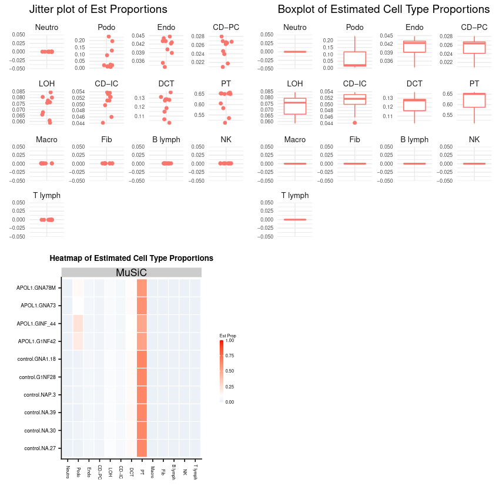

> <question-title></question-title>
>
> Most of the expression in the above plot appears to be derived from one cell type.
>
> 1. Which cell type dominates the plot?
> 2. What does this tell you about the bulk RNA?
>
> > <solution-title></solution-title>
> >
> > 1. The PT cells appear to dominate.
> > 2. Most of the expression in the bulk RNA dataset is derived solely from the PT cells, and could be a monogenic cell line.
> >
> {: .solution}
>
{: .question}


# Conclusion


In this tutorial we constructed ExpressionSet objects, inspected and annotated them, and then finally processed them with the MuSiC RNA-Deconvolution analysis suite.

Below is an overview of the workflow that was used throughout this tutorial.

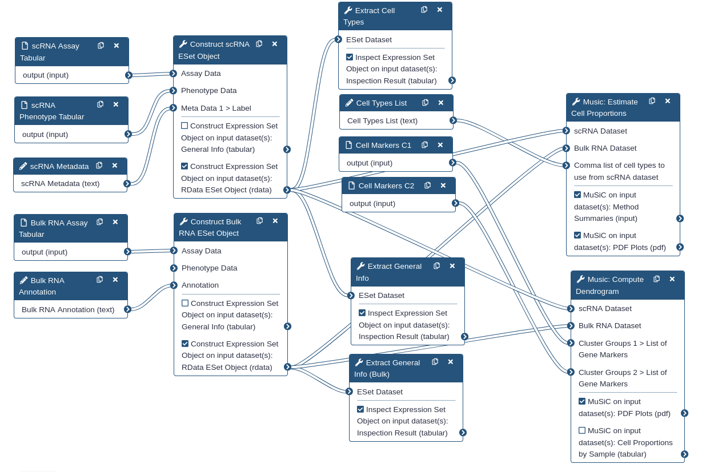

Note how two ExpressionSet objects are constructed: one from bulk RNA-seq tabular assay data, and the other from single-cell RNA-seq tabular assay data. A blind analysis of cell proportion estimation is performed first. Then in the second half of the tutorial, we performed a guided analysis using pre-grouped cell types.


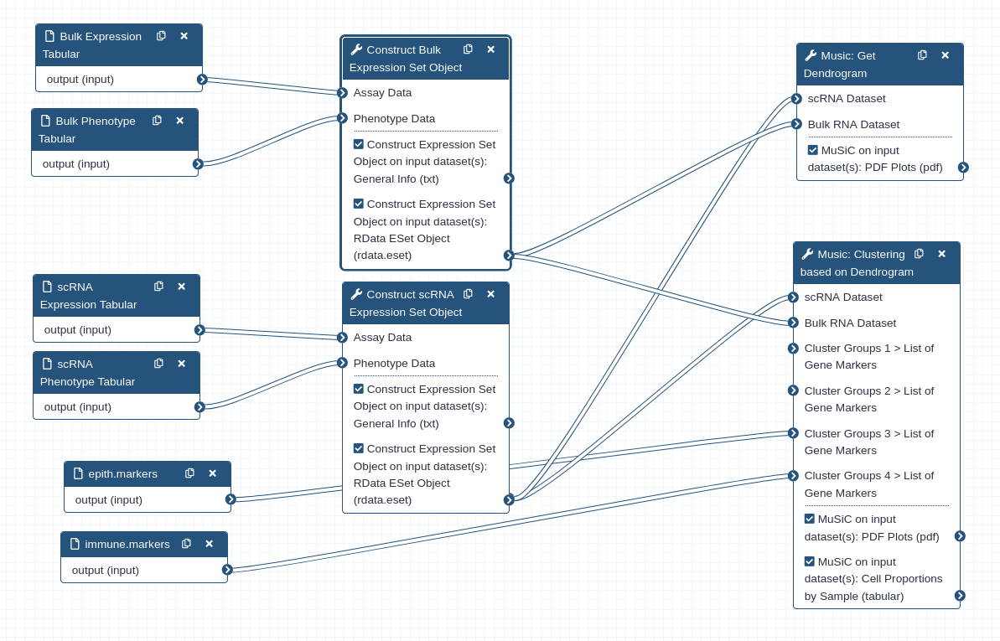

This tutorial is part of the [https://singlecell.usegalaxy.eu](https://singlecell.usegalaxy.eu) portal ().
