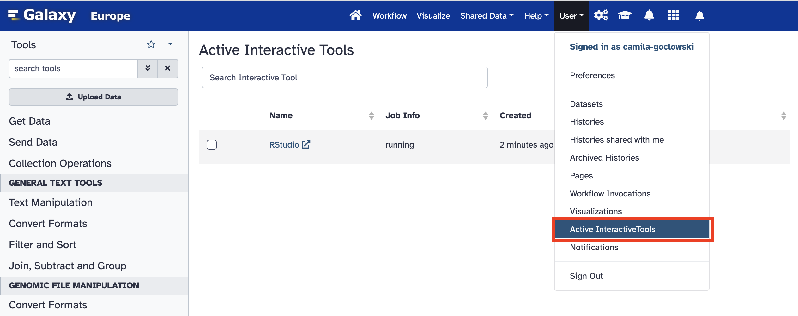
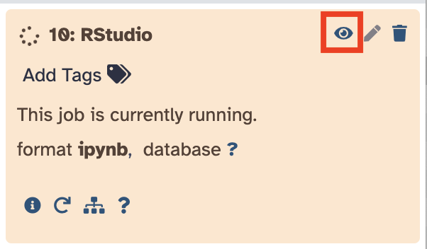

# Introduction
> <comment-title></comment-title>
> This tutorial is significantly based on the Seurat documentation() as well as Seurat's vignette entitled [Using Seurat with multimodal data](https://satijalab.org/seurat/articles/multimodal_vignette).
{: .comment}

> <agenda-title> Getting to RStudio</agenda-title>
>
> In this tutorial, we will cover:
>
> 1. TOC
> {:toc}
> [Or skip ahead to analyses in RStudio](#skipahead)
{: .agenda}

Multiomic analyses are a new and exciting way to understand the world of biology through bioinformatics! Cite-Seq () is one example of such multimodal technologies. Cite-Seq enables us to measure single cell transcriptomes and cell surface proteins simultaneously. Transcriptomic measurements are achieved via RNA sequencing techniques and the surface protein abundance measurements are quantified via DNA barcoded antibodies. As of current, Cite-Seq boasts the ability to tag up to 125 surface proteins at a time!

Seurat has kept up to date with the capacities of multimodal technologies such as Cite-Seq, which means once you've familiarized yourself with Seurat, you can seamlessly continue to use the package to analyze and explore many other types multimodal single-cell datasets.

> <details-title>Further Galaxy Seurat resources</details-title>
>
> Check out [Filter, Plot, and Explore with Seurat]() to start doing so in RStudio with an scRNA-seq dataset!
>
{: .details}

Before we can start exploring, we'll process our transcriptomic and surface protein measurements into a Seurat object. The hardworking Galaxy programmers have kindly optimized the Seurat tool to include Cite-Seq functionality. This enables us to input our raw csv files and the tool will output Seurat objects, which are much easier to explore.

><details-title>What exactly does Seurat do?</details-title>
>
>If you're interested in what the Seurat tool is doing behind the scenes, check out Seurat's [Using Seurat with multimodal data](https://satijalab.org/seurat/articles/multimodal_vignette) vignette.
>
{: .details}


# Get Your Data
For this tutorial, we'll use a publicly available dataset of 8,617 cord blood mononuclear cells (CBMCs) which have been sequenced for transcriptomic measurements as well as 11 surface proteins ().

><comment-title></comment-title>
>
>A quick note on nomenclature when working with Cite-Seq:
>
>**Antibody derived tag (ADT)** refers to the cell surface protein abundance measurements
>
> **RNA** represents the transcriptomic measurements
>
{: .comment}

First, we need to import our csv files. You can do this in a couple of ways:

## Option 1: Uploading Data via Link  

> <hands-on-title></hands-on-title>
>
> 1. Create a new history for this tutorial
> 2. Import the csv files object from NCBI:
>  To retrive the ADT file:
>    ```
>    ftp://ftp.ncbi.nlm.nih.gov/geo/series/GSE100nnn/GSE100866/suppl/GSE100866_CBMC_8K_13AB_10X-ADT_umi.csv.gz
>    ```
>  To retrieve the RNA file:
>    ```
>    ftp://ftp.ncbi.nlm.nih.gov/geo/series/GSE100nnn/GSE100866/suppl/GSE100866_CBMC_8K_13AB_10X-RNA_umi.csv.gz
>    ```
>    
{: .hands_on}

## Option 2: Import a History

You can access [this history](https://usegalaxy.eu/u/camila-goclowski/h/citeseqseurattooltutorial) by clicking on the link provided.



# Cite-Seq Enabled Seurat Tool

Now we'll run those csv files through the Seurat toolkit with the following parameters:
> <hands-on-title></hands-on-title>
> Run  with the following parameters:
> - *"Which Seurat method should be run"*: `Cite-seq`
> -  *"RNA counts file"*: `1: GSE100866_CBMC_8K_13AB_10X-RNA_umi.csv.gz`
> -  *"Protein counts file"*: `2: GSE100866_CBMC_8K_10X-ADT_umi.csv.gz`
> - *"Minimum cells"*: `5`
> - *"Minimum genes"*: `10`
> - *"Low threshold for filtering cells"*: `1500`
> - *"High threshold for filtering cells"*: `30000`
>  - *"Number of PCs to use in plots"*: `15`
>  - *"Resolution parameter"*: `0.8`
>  - *"Include UMAP and TSNE plots"*: `Yes`
>  - *"Output seurat object after TSNE and UMAP analysis"*: `No`
>  - *"Include heatmaps of markers"*: `Yes`
>  - *"Output marker data"*: `Yes`
>  - *"Output list of cite-seq markers"*: `Yes`
>  - *"Compare top RNA and protein features graphicaly against themselves and one another"*: `No`
{: .hands_on}

><details-title>Can I change parameters?</details-title>
>Note that the parameters listed above are just one way you may use this super useful, one step tool. Feel free to play around with different parameters to see how it affects the data!
>
>If you're hoping to follow this tutorial step by step, word for word, be aware that changing any of the above parameters may change the data you get to explore shortly in RStudio.
{: .details}

# Moving to RStudio
Now that we have some explorable data (a Seurat object) in our Galaxy history, let's move into RStudio and keep investigating:
> <hands-on-title>Open RStudio in Galaxy</hands-on-title>
> Run 
{: .hands_on}

><comment-title>Next Step</comment-title>
> The interactive RStudio tool should begin to load now. Make your way over to your Active Interactive Tools page (User (in the top bar of the usegalaxy page) > Active Interactive Tools > RStudio)
> 
>
>Alternatively, you can use the view (eye) icon in your Galaxy History to open the interactive RStudio environment.
> 
{: .comment}

It may be a good time to explore some of these output files that are now in your history. Take a look at some of the previews and see if you can get a grasp of what's what. If not, no worries at all, we'll start looking more closely once we've made it into RStudio!
