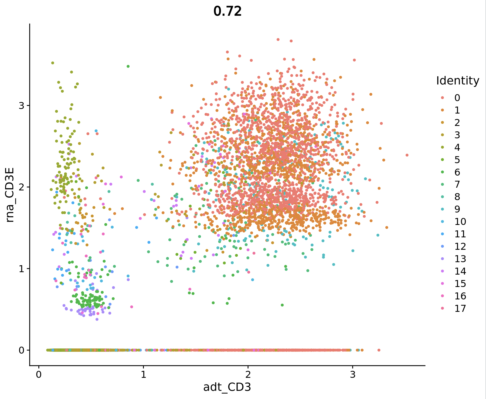


<a name="skipahead"></a>
> <agenda-title> In RStudio</agenda-title>
>
> In the rest of this tutorial, we'll cover:
>
> 1. TOC
> {:toc}
>
{: .agenda}

Before we can do any real biological investigation, we need to understand what each of the outputs from our Seurat tool are. Maybe you've already begun to dissect what's what, but just in case, let's run through each of the datasets together.

# Datasets we'll review
1. [RNA Matrix](#rnamatrix)
2. [ADT Matrix](#adtmatrix)
3. [Protein Markers](#proteinmarkers)
4. [RNA Markers](#rnamarkers)
5. [Processed Seurat Object](#processedseuratobject)
6. [Combined RNA & Protein Markers](#combinedmarkers)



## RNA Matrix <a name="rnamatrix"></a>
To take a look at the pre analysis RNA-seq matrix, use the following commands:
```r
gx_get(1)
RNA<-read.csv('/import/1')
```
It's worth mentioning that the dataset we are using contains ~5% mouse cells, which the Seurat tutorial suggests we can use as negative controls for the cell surface protein measurements. As such, the RNA expression matrix initially has "HUMAN_" or "MOUSE_" appended to each gene.

Now let's take a look at what's in here.
```r
View(RNA)
```


If you're familiar with scRNA-seq matrices, this may look familiar to you. That's because it is exactly that: an RNA-seq matrix. In these matrices, we have genes as row names and cell barcodes as column names. The values within the matrix denote the number of transcripts from a given gene within a given cell.

You may have noticed there are lots of zero values in this matrix. You may also be thinking, "Won't that create noise in the dataset??" The answer is yes, and removing these zeros is one of the first tasks that the Seurat preprocessing tool will perform.

This matrix, with these values shown, are *not* what we will be analyzing later on in this tutorial. We are simply taking a look to get an understanding of what the data looks like *before* preprocessing.

## ADT (Protein) Matrix <a name="adtmatrix"></a>
We can do the same thing with the pre-analysis protein matrix. We'll call it the ADT matrix for now, since that is how Seurat recognizes it.
```r
gx_get(2)
ADT<-read.csv('/import/2')
```
Again, let's take a look at what's in here:
```r
View(ADT)
```


Looks shockingly similar, doesn't it?

In the ADT matrix, we have cell surface proteins (instead of gene names) as row names and the same cell barcodes as column names.

><warning-title>Run Log Available (In History)</warning-title>
>If you ran the same parameters as I did, the next output (number 3 in our history) will be Seurat's run log.
>This is unfortunately not super easy to import into RStudio since it comes as an html format. It contains all of the run information from the background coding done by the tool. Any warnings, errors, or progress bars will be present in here and are often useful for troubleshooting in case something goes awry.
>Because of the html formatting, we will not look at this output together, but feel free to explore it on your own using the view (eye) icon in your history.
>
{: .warning}


## Protein Markers <a name="proteinmarkers"></a>
The next output in my galaxy history are protein markers, let's take a look:
```r
gx_get(4)
protein_markers<-read.table('/import/4', header = T)
view(protein_markers)
```


There are tons of markers in this list and if you dig through them all, you'll likely see that some are not statistically significant. Let's take care of that and filter out any marker that has an adjusted p-value above 0.045:
```r
protein_markers<-subset(protein_markers, p_val_adj < 0.045)
```
Doesn't look like there were actually any insignifcant markers in that list! Although we got lucky this time, I have found that it is in everyone's best interest to always attempt this filter, especially when working with bigger, messier datasets!

Now we have a statistically signficant list of protein markers per cluster! There are a number of statistics that are included in these dataframes, if you're interested in better understanding them, take a look at [Seurat's documentation of FindAllMarkers] (https://satijalab.org/seurat/reference/findallmarkers) for more details.

## RNA Markers <a name="rnamarkers"></a>
The next dataset in our history should be RNA markers. Let's import them, remove any statistically insignifcant ones, and take a look:
```r
gx_get(5)
rna_markers<-read.table('/import/5', header = T)
rna_markers<-subset(rna_markers, p_val_adj < 0.045)
view(rna_markers)
```


Just like the RNA and ADT matrices looked quite similar, the protein and RNA markers will as well. This is because Seurat is interpretting and analyzing the RNA and ADT assays in the same manner, with the same tools. So once again, if you're interested in what some of the statistic on the rna_markers file mean, take a look at the [Seurat documentation of FindAllMarkers] (https://satijalab.org/seurat/reference/findallmarkers).

## Processed Seurat Object <a name="processedseuratobject"></a>
The next dataset in our history is arguably the most important--the processed Seurat object. This is the dataset we will be further processing and exploring.

Before we can import the object, we'll need to call the Seurat packages:
```r
library(Seurat)
library(SeuratObject)
```
This library() function tells RStudio to prepare an installed package for use. If you don't call up the package, RStudio will not recognize your commands using that package.

Now that Seurat is loaded, we can import and open the processed object:
```r
gx_get(6)
srt<-readRDS('/import/6')
```

Now the processed Seurat object, containing both RNA and ADT data, has been loaded into your RStudio environment! We'll come back to this object in a moment for further processing and investigation!

## Combined Protein & RNA Markers <a name="combinedmarkers"></a>
The final dataset that I have in my history now is a combined marker list. Let's import and filter this marker list:
```r
gx_get(8)
markers<-read.table('/import/8', header = T)
markers<-subset(markers, p_val_adj < 0.045)
```

We now have a comprehensive list of statistically significant markers.

# A Bit More Processing
Now that we have reviewed all of the datasets that were output by our Seurat Cite-Seq Tool, there's one last step before we can start asking some biological questions: normalization.

Currently, the Seurat tool's functionality does not allow it to normalize the ADT counts. This option will likely be added shortly, and when it is, this tutorial will be updated as well! For now, let's manually normalize the ADT data and get to the science!

```r
srt <- NormalizeData(srt, normalization.method = "CLR", margin = 2, assay = "ADT")
```

# Basic Visualizations
Now, let's get visualizing. Call up the ggplot2 package so RStudio is ready to plot:
```r
library(ggplot2)
```
## FeaturePlots
Say you want to know how these CBMCs' CD19 protein expression compares to it's RNA expression... To visualize this let's first start with plotting the protein expression:
```r
DefaultAssay(srt)<-"ADT"
adt_cd19<-FeaturePlot(srt, features = "CD19", order = T) + ggtitle("CD19 Protein")
```
Take a look:
```r
view(adt_cd19)
```


Next, we'll plot the RNA expression:
```r
DefaultAssay(srt)<-"RNA"
rna_cd19<-FeaturePlot(srt, features = "CD19", order = T) + ggtitle("CD19 RNA")
```


Finally, we can plot them side by side for more effective comparison:
```r
adt_cd19|rna_cd19
```


# Alternative FeaturePlot Method
As always with Seurat, there are a couple of different ways we can get the same output. Instead of swapping the DefaultAssay back and forth like we did in the above example, we can use specific assay keys.

Let's find out what the RNA key is:
```r
Key(srt[["RNA"]])
```
What about the ADT:
```r
Key(srt[["ADT"]])
```

Now that we've identified what the keys are, we can just include that in the feature name when we ask for a FeaturePlot like follows:

```r
cd19_adt<-FeaturePlot(srt, features = "adt_CD19") + ggtitle("CD19 Protein")
cd19_rna<-FeaturePlot(srt, features = "rna_CD19") + ggtitle("CD19 RNA")
cd19_adt|cd19_rna
```


Voila! The same plot but in two different ways! This may feel repetetive, but finding these alternative means of accomplishing the same goal has been one of my biggest aids in troubleshooting these kinds of analyses. Quite often a function will break, be retired, or simply no longer be compatible with your workflow. When these situations arise it is important to not panic and just remember: there is *always* another way.

# FeatureScatter
We can also plot scatter plots of the cell surface protein expression. These will be functionally similar to biaxial plots used for FACS!
```r
FeatureScatter(srt, feature1 = "adt_CD19", feature2 = "adt_CD3")
```


We can even visualize the RNA vs. protein differences in a scatterplot format:
```{r}
FeatureScatter(srt, feature1 = "adt_CD3", feature2 = "rna_CD3E")
```


# Further Analysis Options
There are endless options for continuing to explore your multimodal data from here. In their own [vignette](https://satijalab.org/seurat/articles/multimodal_vignette), Seurat describes future directions of analysis you might be interested in pursuing.

Congratulations on completing this tutorial!
