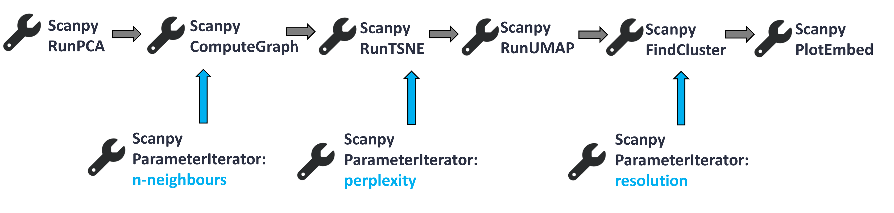
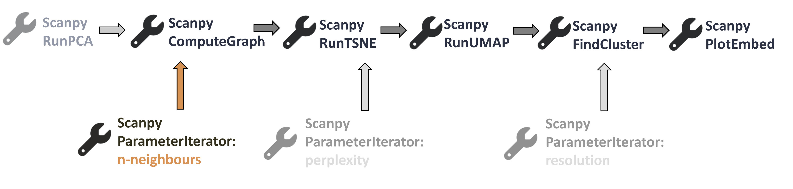
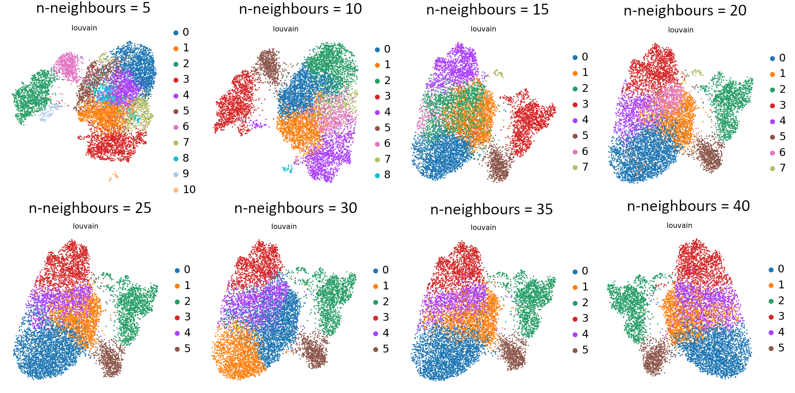
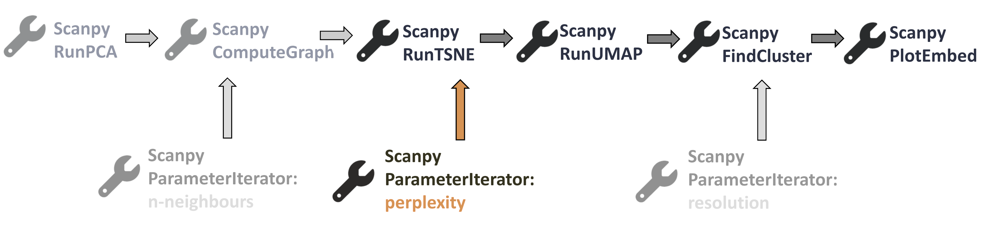
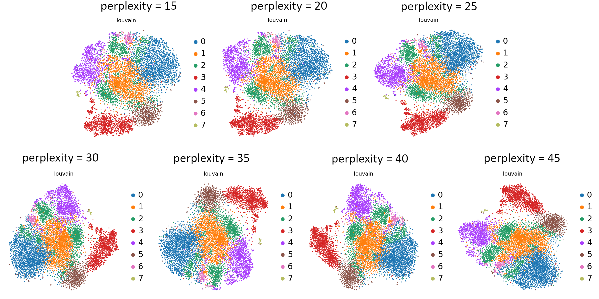
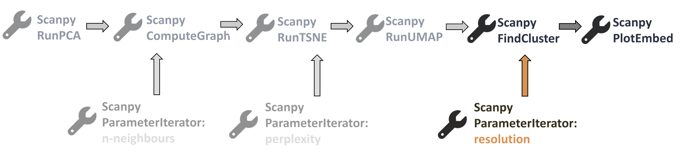
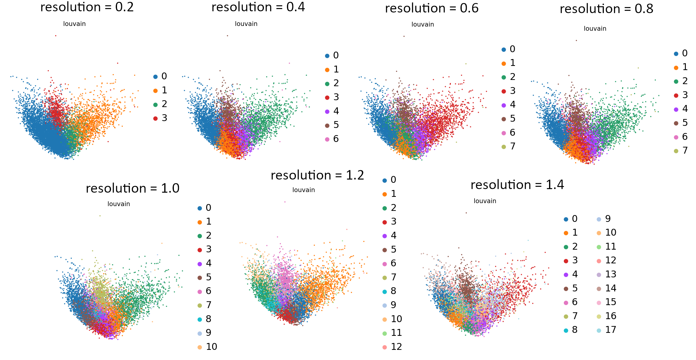
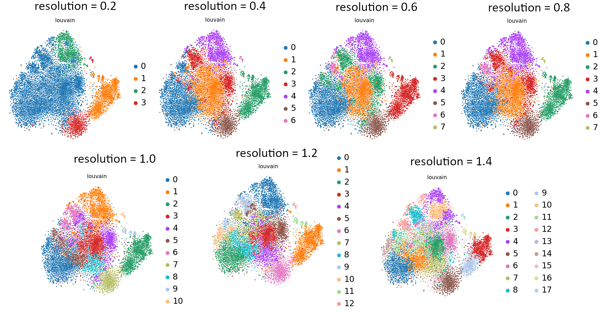
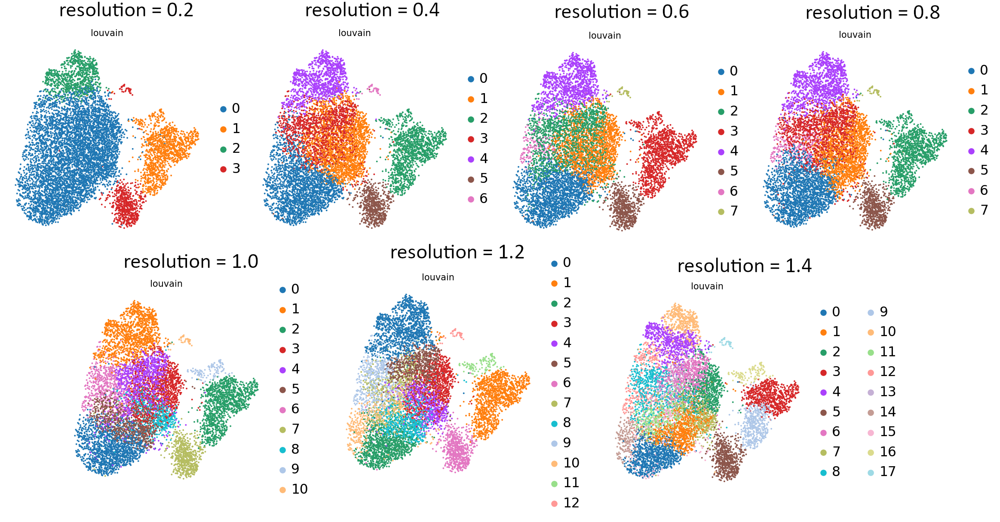

The magic of bioinformatic analysis is that we use maths, statistics and complicated algorithms to deal with huge amounts of data to help us investigate biology. However, analysis is not always straightforward – each tool has various parameters to select. Eventually, we can end up with very different outcomes depending on the values we choose. With analysing scRNA-seq data, it’s almost like you need to know about 75% of your data, then make sure your analysis shows that, for you to then be able to identify the 25% new information.

Given the vast array of values that we can specify in the tool parameters, how can we know if the values we choose are the most optimal ones - or at least good enough? Well, we can try different values in our workflow and then compare the outputs to see which is consistent with our understanding of the underlying biology. But can we do this efficiently, at scale, to test multiple values?

And here the Parameter Iterator comes in – it allows us to test different variables quickly and easily. This tutorial will show you how to use Parameter Iterator to generate multiple outputs with different parameter values in one go.




> <agenda-title></agenda-title>
>
> In this tutorial, we will cover:
>
> 1. TOC
> {:toc}
>
{: .agenda}

# Get Data
The data used in this tutorial is from a mouse dataset of fetal growth restriction (). You can download the dataset below or import the history with the starting data.

Here are several ways of getting our toy dataset – choose whichever you like!

> <hands-on-title>Option 1: Data upload - Import history</hands-on-title>
>
> 1. Import history from: [example input history](https://usegalaxy.eu/u/j.jakiela/h/scanpy-parameter-iterator-1)
>
>
>    
>
> 2. **Rename**  the the history to your name of choice.
>
{: .hands_on}

> <hands-on-title>Option 2: Data upload - Add to history</hands-on-title>
>
> 1. Create a new history for this tutorial
>
> 2. Import the files from [Zenodo]({{ page.zenodo_link }})
>
>    ```
>    {{ page.zenodo_link }}/files/Scanpy_RunPCA_AnnData_object.h5ad
>    ```
>
>    
>    
>
> 3. Rename the dataset if you wish: `Scanpy RunPCA: AnnData object`
>
>    
>
> 4. Check that the datatype is `h5ad`
>
>    
>
{: .hands_on}


# Workflow

This tutorial is an extension of the full analysis shown in [Filter, Plot and Explore Single-cell RNA-seq Data]() tutorial in the Single-cell RNA-seq: Case Study series. So if you've been working through it, you can use your dataset from that tutorial here. If you haven’t completed it but you’re interested in how we get to this point, feel free to have a look at the mentioned tutorial.

Our starting data will be the output of **Scanpy RunPCA** . It is part of the full analysis tutorial, but we will only focus on a smaller and shortened bit of the [full workflow](https://usegalaxy.eu/u/j.jakiela/w/copy-of-filter-plot-and-explore-single-cell-rna-seq-data-imported-from-uploaded-file-3) to show the application of the Parameter Iterator. Our workflow consists of the following steps:



\
For the detailed explanation of the tools presented above, check out [this tutorial]().


# Inputs
Scanpy ParameterIterator tool currently works only for the following parameters:
1.	Number of neighbours to derive kNN graph (for **Scanpy ComputeGraph** )
2.	Perplexity (for **Scanpy RunTSNE** )
3.	Resolution (for **Scanpy FindCluster** )

There are two formats of the input values:
1.	List of all parameter values to be iterated
2.	Step increase values to be iterated


# Number of neighbours to derive kNN graph (for **Scanpy ComputeGraph** )

We will now use **Scanpy ComputeGraph**  to derive the k-nearest neighbour (kNN) graph from our PCA values. We can use the Parameter Iterator to check how the different k values of nearest neighbours will affect the final outcome. It is important that **k neighbours is an integer**.

> <warning-title>Float vs integer</warning-title>
> Using ‘Step increase values to be iterated’ as the format of the input values automatically generates float values instead of integers. Float, or floating point numbers, are values with a 'floating' decimal point. To avoid float values, you must use ‘List of all parameter values to be iterated’ as your chosen values.
{: .warning}

The kNN graph will be needed for plotting a UMAP. According to the [UMAP developers](https://github.com/lmcinnes/umap): “Larger neighbor values will result in more global structure being preserved at the loss of detailed local structure. In general this parameter should often be in the range 5 to 50, with a choice of 10 to 15 being a sensible default”. Therefore, let’s pick some values bigger and smaller than 15 to check how it changes the final UMAP. This is where the Parameter Iterator comes in!

> <hands-on-title> Set your values in Parameter Iterator </hands-on-title>
>
> 1.  with the following parameters:
>    - *"Parameter type"*: `n-neighbours`
>    - *"Choose the format of the input values"*: `List of all parameter values to be iterated`
>    - *"User input values"*: `5,10,15,20,25,30,35,40`
>
> 2. **Rename**  the resulting list of datasets: `Parameter iterated - n-neighbours` (you have to first click on the collection so that you see the datasets, and then rename it)
>
> 3. **Tag**  each dataset with its corresponding value:
>    - navigate to *Show hidden* ( icon)
>    - add tags accordingly - *n-neighbours_10*: `#n-neighbours_10` etc.
>    - If you want to refresh your memory on how to add tags to datasets, have a look here:
>
>    
>
{: .hands_on}


The output of the Parameter Iterator is the list of datasets. We will be working on dataset collections quite a lot, so if you want to gain more understanding of collection operations, visit the [corresponding tutorial]().

> <hands-on-title> Derive kNN graph with iterated parameter </hands-on-title>
>
> 1.  with the following parameters:
>    -  *"Input object in AnnData/Loom format"*: `Scanpy RunPCA: AnnData object`
>    - *"Use programme defaults"*:  `No`
>    - *"File with n_neighbours, use with parameter iterator. Overrides the n_neighbors setting"*:
>       - Click on  (*Dataset collection*)
>       - Choose `Parameter iterated - n-neighbours`
>    - *"Use the indicated representation"*: `X_pca`
>    - *"Number of PCs to use"*: `20`
>
> 2. **Rename**  the resulting list of datasets: `Scanpy ComputeGraph on collection X: Graph object AnnData (n-neighbours)` (you have to first click on the collection so that you see the datasets, and then rename it)
>
{: .hands_on}

You should now see the output is also a collection. If you click on that, you will see Anndata files, differing only by the n-neighbour value.

Now you have two options, either:
 - pick one of the generated output files and proceed to the next tool with another parameter iteration; or
 - continue with the current collection of datasets.

We choose the second option as only then you will be able to see the effect of using different nearest neighbour values. However, the disadvantage of this option is that you have to select only one value for the subsequent parameters in the workflow in order to see the changes in the final plots.

> <comment-title>Why only one Parameter Iteration at a time?</comment-title>
> Iterating the parameters within one tool will give you a list with X datasets: each dataset is the output with the given parameter value. However, if you want to use Parameter Iterator again within another tool, specifying Y parameter values, you **will not** get X x Y datasets as you might expect. Therefore you have to choose **just one** output file to be passed on to the next tool which will use Parameter Iterator again. Alternatively, you can use Parameter Iterator once and run the rest of the tools on dataset collection with just one parameter value.
{: .comment}

Where are we now in our workflow?


> <hands-on-title> Complete the workflow </hands-on-title>
>
> 1.  with the following parameters:
>    -  *"Input object in AnnData/Loom format"* (make sure you choose *Dataset collection*): `Scanpy ComputeGraph on collection X: Graph object AnnData (n-neighbours)`
>    - *"Use the indicated representation"*: `X_pca`
>    - *"Use programme defaults"*:  `No`
>    - *"The perplexity is related to the number of nearest neighbours, select a value between 5 and 50"*: `30`
>
> 1A. **Rename**  the Anndata object collection output: `Scanpy RunTSNE on collection X: tSNE object AnnData (n-neighbours)` (you have to first click on the collection so that you see the datasets, and then rename it)
>
> 2.  with the following parameters:
>    -  *"Input object in AnnData/Loom format"* (make sure you choose *Dataset collection*): `Scanpy RunTSNE on collection X: tSNE object AnnData (n-neighbours)`
>    - *"Use programme defaults"*:  `Yes`
>
> 2A. **Rename**  the Anndata object collection output: `Scanpy RunUMAP on collection X: UMAP object AnnData (n-neighbours)` (you have to first click on the collection so that you see the datasets, and then rename it)
>
> 3.  with the following parameters:
>    -  *"Input object in AnnData/Loom format"* (make sure you choose *Dataset collection*): `Scanpy RunUMAP on collection X: UMAP object AnnData`
>    - *"Use programme defaults"*:  `No`
>    - *"Resolution, high value for more and smaller clusters"*: `0.6`
>
> 3A. **Rename**  the Anndata object collection output: `Scanpy FindCluster on collection X: Clusters AnnData (n-neighbours)` (you have to first click on the collection so that you see the datasets, and then rename it)
>
{: .hands_on}

The differences will only appear in the UMAP embedding, so we’ll plot only them. However, when you run your own analysis, you might want to check if there are changes in other embeddings as well.

> <hands-on-title> Plot UMAP embedding </hands-on-title>
>
> 1.  with the following parameters:
>    -  *"Input object in AnnData/Loom format"* (make sure you choose *Dataset collection*): `Scanpy FindCluster on collection X: Clusters AnnData (n-neighbours)`
>    - *"name of the embedding to plot"*: `umap`
>    - *"color by attributes, comma separated texts"*: `louvain`
>    - *"Use raw attributes if present"*: `No`
>
{: .hands_on}

If you click on the resulting collection you will see several plots. Click on  to see how they differ. Galaxy's  Window Manager, which you can enable (and disable again) from the menu bar can be very helpful for comparing multiple datasets.



If you compare the UMAP graphs, you can see the differences that were caused by changing the value of k nearestneighbours. Relying on your biological knowledge, you can now choose which parameter value works best and use it for further analysis.

We will go forward with k value equal to 15. But hang on, we’ve been working on a collection and not a single dataset! How can we access that one dataset with the n-neighbour = 15?

Here is the answer: The datasets that are included in the collections can be accessed separately if you go to your history and click on *Show hidden* ( icon). You can bring each individual dataset to the visible and active datasets by clicking *Unhide*.

> <hands-on-title> Unhide the dataset of interest </hands-on-title>
> 1. In *Show hidden* find the dataset `Scanpy ComputeGraph on data X and data Y: Graph object AnnData` with the tag `#n-neighbours_15` (or any value that you want to go forward with).
> 2. Click on *Unhide*
> 3. Your chosen dataset is now visible amongst the active datasets in your history!
>
{: .hands_on}


# Perplexity (for **Scanpy RunTSNE** )

Let’s have another look at our wee workflow.



The next tool in our workflow is Scanpy RunTSNE, which contains the perplexity parameter. Although the tool description says that this value should be an integer, we tested it with float values and it works. Therefore, you can use ‘Step increase values to be iterated’. Keep in mind that perplexity should take values between 5 and 50. Let’s run the Parameter Iterator again.

> <hands-on-title> Set your values in Parameter Iterator </hands-on-title>
>
> 1.  with the following parameters:
>    - *"Parameter type"*: `perplexity`
>    - *"Choose the format of the input values"*: `Step increase values to be iterated`
>    - *"Starting value"*: `15`
>    - *"Step"*: `5`
>    - *"Ending value"*: `45`
>
> 2. **Rename**  the resulting list of datasets: `Parameter iterated - perplexity` (you have to first click on the collection so that you see the datasets, and then rename it)
>
> 3. **Tag**  each dataset with its corresponding value:
>    - navigate to *Show hidden* ( icon)
>    - add tags accordingly - *perplexity_15*: `#perplexity_15` etc.
>    - If you want to refresh your memory on how to add tags to datasets, have a look here:
>
>    
>
>    
{: .hands_on}

> <hands-on-title> RunTSNE with iterated parameter </hands-on-title>
> 1.  with the following parameters:
>    -  *"Input object in AnnData/Loom format"*: `Scanpy ComputeGraph on data X and data Y: Graph object AnnData` with the tag `#n-neighbours_15`
>    - *"Use the indicated representation"*: `X_pca`
>    - *"Use programme defaults"*:  `No`
>    - *"The perplexity is related to the number of nearest neighbours"*:
>       - Click on  (*Dataset collection*)
>       - Choose `Parameter iterated - perplexity`
>
> 2. **Rename**  the Anndata object collection output: `Scanpy RunTSNE on collection X: tSNE object AnnData (perplexity)` (you have to first click on the collection so that you see the datasets, and then rename it)
>
{: .hands_on}

Changing the value of perplexity will only affect the tSNE graphs, so we can complete the workflow and compare the tSNE plots to choose the best value for further analysis.

> <hands-on-title> Complete the workflow </hands-on-title>
> 1.  with the following parameters:
>    -  *"Input object in AnnData/Loom format"* (make sure you choose *Dataset collection*): `Scanpy RunTSNE on collection X: tSNE object AnnData (perplexity)`
>    - *"Use programme defaults"*:  `Yes`
>
> 1A. **Rename**  the Anndata object collection output: `Scanpy RunUMAP on collection X: UMAP object AnnData (perplexity)` (you have to first click on the collection so that you see the datasets, and then rename it)
>
> 2.  with the following parameters:
>    -  *"Input object in AnnData/Loom format"* (make sure you choose *Dataset collection*): `Scanpy RunUMAP on collection X: UMAP object AnnData (perplexity)`
>    - *"Use programme defaults"*:  `No`
>    - *"Resolution, high value for more and smaller clusters"*: `0.6`
>
> 3A. **Rename**  the Anndata object collection output: `Scanpy FindCluster on collection X: Clusters AnnData (perplexity)` (you have to first click on the collection so that you see the datasets, and then rename it)
>
{: .hands_on}

> <warning-title></warning-title>
> In *Use programme defaults* you can specify *Additional suffix to the name of the slot to save the embedding* – if it’s included, PERPLEXITY will be substituted with the value of the perplexity setting. However, in that case you will get an error when using **Scanpy PlotEmbed**: due to the value included in the entry name, the tool will not recognise the correct embedding. Therefore, we leave that box unfilled even though it would make it easier to differentiate between datasets.
{: .warning}


> <hands-on-title> Plot tSNE embedding </hands-on-title>
>
> 1.  with the following parameters:
>    -  *"Input object in AnnData/Loom format"* (make sure you choose *Dataset collection*): `Scanpy FindCluster on collection X: Clusters AnnData (perplexity)`
>    - *"name of the embedding to plot"*: `tsne`
>    - *"color by attributes, comma separated texts"*: `louvain`
>    - *"Use raw attributes if present"*: `No`
>
{: .hands_on}

Can you see those differences?



What do you think about those plots? Which value would you choose? Perplexity is probably the least intuitive or consistently functioning parameter, so feel free to learn more from [this nifty blog post](https://apiumhub.com/tech-blog-barcelona/dimensionality-reduction-tsne/#:~:text=.tensorflow.org%2F-,Perplexity,are%20between%205%20and%2050.). We will go forward with a perplexity value equal to 30.

# Resolution (for **Scanpy FindCluster** )

Where is **Scanpy FindCluster**  in our workflow?



The input data for the **Scanpy FindCluster**  is the output of **Scanpy RunUMAP** , so let’s get this single dataset with the parameter values (from previous tools) of our choice, that is n-neighbours=15 and perplexity=30.


> <hands-on-title> Unhide the dataset of interest </hands-on-title>
> 1. In *Show hidden* find the dataset `Scanpy RunUMAP on data X: UMAP object AnnData` with the tags `#n-neighbours_15` and `#perplexity_30` (or any value that you want to go forward with).
> 2. Click on *Unhide*
> 3. Your chosen dataset is now visible amongst the active datasets in your history!
>
{: .hands_on}

The last tool that we can use Parameter Iterator for is **Scanpy FindCluster** . We will iterate over the resolution values. In this case, those values can be floats, so you can use either ‘List of all parameter values to be iterated’ or ‘Step increase values to be iterated’. Keep in mind that when it comes to the resolution, a high value means more and smaller clusters.

> <hands-on-title> Set your values in Parameter Iterator </hands-on-title>
>
> 1.  with the following parameters:
>    - *"Parameter type"*: `resolution`
>    - *"Choose the format of the input values"*: `Step increase values to be iterated`
>    - *"Starting value"*: `0.2`
>    - *"Step"*: `0.2`
>    - *"Ending value"*: `1.4`
>
> 2. **Rename**  the resulting list of datasets: `Parameter iterated - resolution` (you have to first click on the collection so that you see the datasets, and then rename it)
>
> 3. **Tag**  each dataset with its corresponding value:
>    - navigate to *Show hidden* ( icon)
>    - add tags accordingly - *resolution_0.2*: `#resolution_0.2` etc.
>    - If you want to refresh your memory on how to add tags to datasets, have a look here:
>
>    
>    
{: .hands_on}

> <hands-on-title> FindCluster with iterated parameter </hands-on-title>
> 1.  with the following parameters:
>   -  *"Input object in AnnData/Loom format"*: `Scanpy RunUMAP on data X: UMAP object AnnData` with the tags `#n-neighbours_15` and `#perplexity_30`
>    - *"Use programme defaults"*:  `No`
>    - *"File with resolution, use with parameter iterator. Overrides the resolution setting"*:
>       - Click on  (*Dataset collection*)
>       - Choose `Parameter iterated - resolution`
>
> 2. **Rename**  the Anndata object collection output: `Scanpy FindCluster on collection X: Clusters AnnData (resolution)` (you have to first click on the collection so that you see the datasets, and then rename it)
>
{: .hands_on}

You can see the effect of resolution parameter on all embeddings: UMAP, tSNE and PCA so you can plot them all and compare the granularity of the clusters. It is also useful to see how the equal increments affect the clustering and what is the rate of change of the granularity.

> <hands-on-title> Plot the embeddings </hands-on-title>
>
> 1.  with the following parameters:
>    -  *"Input object in AnnData/Loom format"* (make sure you choose *Dataset collection*): `Scanpy FindCluster on collection X: Clusters AnnData (resolution)`
>    - *"name of the embedding to plot"*: `pca`
>    - *"color by attributes, comma separated texts"*: `louvain`
>    - *"Use raw attributes if present"*: `No`
> *You can re-run  the same tool again, but change `pca` to `tsne` and then finally to `umap` in order to skip the following two steps.*
>
> 2.  with the following parameters:
>    -  *"Input object in AnnData/Loom format"* (make sure you choose *Dataset collection*): `Scanpy FindCluster on collection X: Clusters AnnData (resolution)`
>    - *"name of the embedding to plot"*: `tsne`
>    - *"color by attributes, comma separated texts"*: `louvain`
>    - *"Use raw attributes if present"*: `No`
>
> 3.  with the following parameters:
>    -  *"Input object in AnnData/Loom format"* (make sure you choose *Dataset collection*): `Scanpy FindCluster on collection X: Clusters AnnData (resolution)`
>    - *"name of the embedding to plot"*: `umap`
>    - *"color by attributes, comma separated texts"*: `louvain`
>    - *"Use raw attributes if present"*: `No`
{: .hands_on}

That’s the last tool in our workflow which uses Parameter Iterator! Let’s have a final look at the generated plots.







> <comment-title></comment-title>
> Still not sure which value works best? For more explanation and in-depth analysis, please read through [this tutorial](). Hopefully it will give you more insight into interpretation of the resulting plots.
{: .comment}


# Additional steps
- It may happen that some of the values you choose will give an error, but some will work fine. In that case, you can use  **Filter failed datasets** tool to remove datasets with errors from a collection.

- If you still haven’t found an answer that would help you with the parameter iteration in your own analysis, check out [another workflow](https://usegalaxy.eu/published/workflow?id=8f677efac7100097) which has some extra steps, not directly related to our analysis. But it might contain steps that would be helpful for you.


# Conclusion
You might want to compare your results with this [control history](https://usegalaxy.eu/u/j.jakiela/h/scanpy-parameter-iterator-updated), or check out the [workflow](https://usegalaxy.eu/u/j.jakiela/w/scanpy-parameter-iterator-workflow) for this tutorial. You can also continue to analyse this data by returning to the [Filter, Plot and Explore]() tutorial.


 You have finished the tutorial! You have learned how to use the Parameter Iterator with the nearest neighbours, perplexity and resolution parameters. You also compared multiple outputs resulting from the analysis using different values at three different steps (Scanpy ComputeGraph, Scanpy RunTSNE and Scanpy FindCluster). Hopefully this tool will help you more quickly assess parameter values, ultimately helping you choose values that both confirm prior knowledge as well as offer new insights on biological data.


