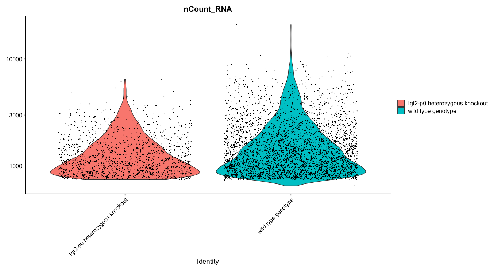
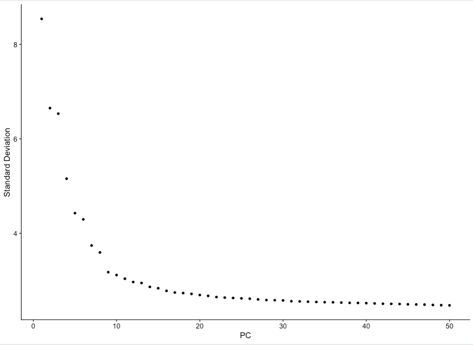
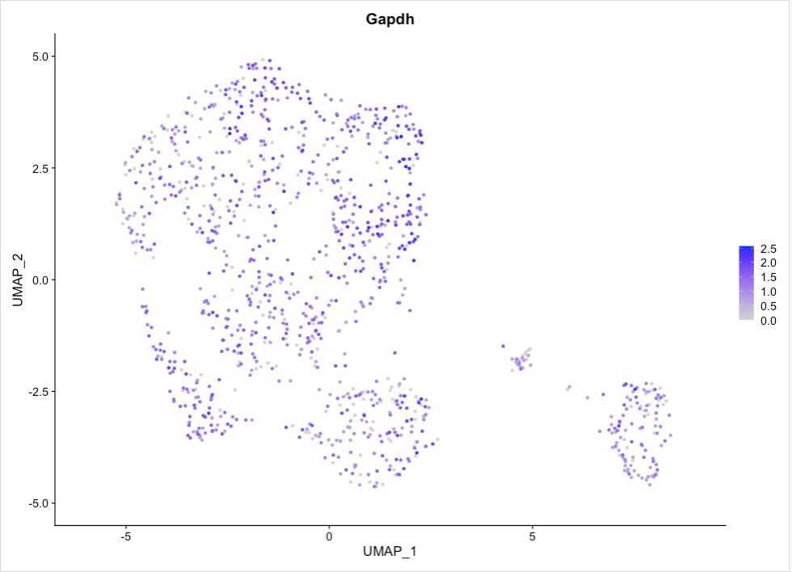
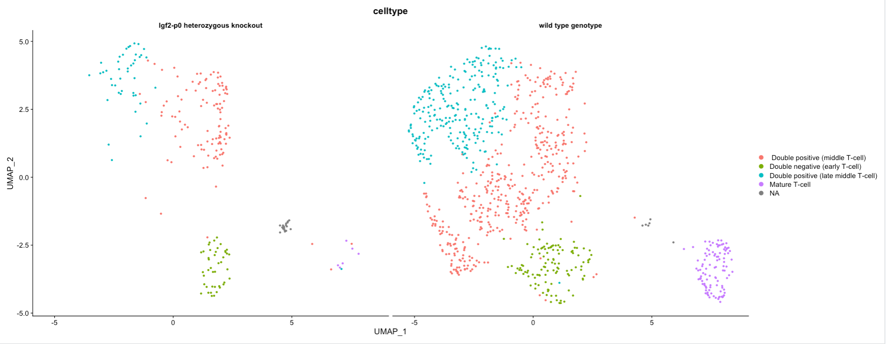

# Introduction

# Setting your environment
First thing's first, we need to load the packages we will be using. In order to use any functions of a package, we must first call the library of that package. In your console (likely in the lower left corner of your RStudio window), run the following lines of code to do so:

```{r}
library(Matrix)
library(Seurat)
library(dplyr)
```

The packages are called--now let's get our data files moved from our Galaxy history and into our RStudio enviornment so that we can create a Seurat object.

# Upload, view and modify the files
Now that we've made it into RStudio, and called the packages we'll use, let's begin moving datasets from Galaxy and into our RStudio environment. Galaxy helps us with this by providing the gx_get() function, which will tell us the file paths for the datasets currently occupying our Galaxy histories.

So, for example, our matrix was the first to be imported. As such, we will ask for the file path of the first piece of data in our history: we will tell gx_get() the number of the dataset in our history that we are interested in, and the function will output the path we need to bring that dataset into R.

```{r}
gx_get(1)  #get the file path for matrix.mtx: #1 in Galaxy history
```

Now we have the file path! We can use the Matrix package, specifically their readMM() function, to read our counts matrix into our environment, using our file path to let it know where to find the matrix.

```{r}
matrix.mtx<-readMM("/import/1")
```
Now we will do the same thing with the feature, barcode, and experimental design files.

:::{.warning}
<div class="box-title warning-title" id="warning-don-t-skip-ahead"><i class="fas fa-exclamation-triangle" aria-hidden="true" ></i> Warning: Don't skip ahead!</div>
Don't try to skip ahead and fill in the position of the dataset, reading in the files very often will not work without having used the gx_get() function--if it does, well, lucky you.

:::

We'll run the same command, simply replacing the data number in order to ask for the file path to data in an alternative slot in our Galaxy history. Then, we will use the read.delim() function in read in the list of genes, cells, and cell annotations provided to us  by the researchers:
```{r}
gx_get(2) #genes.tsv
genes.tsv<-read.delim("/import/2", header = FALSE)

gx_get(3) #barcodes.tsv
barcodes.tsv<-read.delim("/import/3", header = FALSE)

gx_get(4) #exp_design.tsv
exp_design.tsv<-read.delim("/import/4")
```
The format of the experimental design dataset contains cell barcodes as the first column of data with simply numbered (1-n) row names. In order for Seurat to properly use this dataset, we will need to make the cell barcodes the row names. This can be accomplished by running the following line of code:

```{r}
rownames(exp_design.tsv)<-exp_design.tsv$Assay
```

Now, in our RStudio environment, we should have all of the data sets necessary to create a Seurat Object: the matrix, a file with feature (gene) names, a file with cell barcodes, and an optional, but highly useful, experimental design file containing sample (cell-level) metadata.

# Generating a Seurat object
Next we will add row and column names to our matrix. In the end, this will leave us with a matrix whose rows are genes, columns are cell barcodes, and each value in the matrix represent the expression value of a given gene in a given cell.

:::{.tip}
<div class="box-title tip-title" id="tip-about-seurat-objects"><button class="gtn-boxify-button tip" type="button" aria-controls="tip-about-seurat-objects" aria-expanded="true"><i class="far fa-lightbulb" aria-hidden="true" ></i> Tip: About Seurat Objects<span class="fold-unfold fa fa-minus-square"></span></button></div>
The order of the dimensions, such that genes are the first and cells are the second is a set characteristic of Seurat objects.

You will recieve an error if you try to label the first dimension with cell barcodes or the second with genes. This is because the Dimname slots are like empty fill in the blanks: if the number of labels input doesn't match the number of blanks in that dimension, that is the number of labels don't match the number of cells/genes, Seurat will not accept the labels.
:::

```{r}
dimnames(matrix.mtx) <- list(genes.tsv$V2, barcodes.tsv$V1)
```

In a more typical Seurat pipeline, or on a local version of RStudio, this step would be replaced with a Read10x() step. Read10x() is Seurat's function to create a matrix and add in feature and barcode names simultaneously. However, due to the nature of how Galaxy's histories and interactive environments communicate with one another, we'll use this manual method.

:::{.tip}
<div class="box-title tip-title" id="tip-how-to-use-read10x"><button class="gtn-boxify-button tip" type="button" aria-controls="tip-how-to-use-read10x" aria-expanded="true"><i class="far fa-lightbulb" aria-hidden="true" ></i> Tip: How to Use Read10X<span class="fold-unfold fa fa-minus-square"></span></button></div>
The only necessary parameter of Seurat's Read10X() fucntion is the file path to the directory (folder) containing the matrix.mtx, barcodes.tsv, and genes.tsv (sometimes also called features.tsv) files.

So if the EBI SCXA Retrieval tool were to have output a data directory in the sixth history position, the following code would be able to import a labelled counts matrix called "labelled matrix" into our RStudio environment:
```{r}
gx_get(6) #get the file path
labelled_matrix<-Read10X(dir = "/import/6")
```

:::

Now we will create a Seurat object using our newly labelled counts matrix! Make sure you have called the Seurat library, first, or RStudio will not recognize the function.

```{r}
srt<-CreateSeuratObject(counts = matrix.mtx)
```

You've created a Seurat object, congratulations!

# Adding Cell Level Metadata

 Now that we have an object, we can add in our metadata from our experimental design dataframe (table). This will be useful to us shortly as we begin to visualize our data!

```{r}
srt$Sex<-exp_design.tsv$Sample.Characteristic.sex.
srt$Organism<-exp_design.tsv$Sample.Characteristic.organism.
srt$Strain<-exp_design.tsv$Sample.Characteristic.strain.
srt$Developmental.Stage<-exp_design.tsv$Sample.Characteristic.developmental.stage.
srt$Age<-exp_design.tsv$Sample.Characteristic.age.
srt$Individual<-exp_design.tsv$Sample.Characteristic.individual.
srt$Disease<-exp_design.tsv$Sample.Characteristic.disease.
srt$Genotype<-exp_design.tsv$Sample.Characteristic.genotype.
srt$Organism.Part<-exp_design.tsv$Sample.Characteristic.organism.part.
srt$Cell.Type<-exp_design.tsv$Sample.Characteristic.cell.type.
srt$Factor.Value.Genotype<-exp_design.tsv$Factor.Value.genotype.
```
:::{.tip}
<div class="box-title tip-title" id="tip-syntax-lesson"><button class="gtn-boxify-button tip" type="button" aria-controls="tip-syntax-lesson" aria-expanded="true"><i class="far fa-lightbulb" aria-hidden="true" ></i> Tip: Syntax Lesson<span class="fold-unfold fa fa-minus-square"></span></button></div>
The code preceding the left pointing arrow will indicate where to put your metadata (the name of your new metadata column: object$new_metadata_columnname), and the code following the arrow will denote where to find that metadata information (metadata_table$columnname)

:::

Now that we have our almost fully annotated object, we will add one more metadata column: percent mitochondrial (perc.mt). This metadata column will denote what percentage of a cell's feature (gene) expression is mitochondrial--which will be useful to us shortly as we begin to filter our data.

```{r}
srt <- PercentageFeatureSet(srt, pattern = "^mt-", col.name = "perc.mt")
```

For the sake of this data set, and many others, the mitochondrial genes will all be marked with an "mt" as the prefix, so that is how we have asked Seurat's PercentageFeatureSet() function to search for mitochondrial genes in the line of code above.

With that being said, when you are analyzing your own data, it is highly recommended that you identify how your data set has labelled mitochondrial genes to ensure that you are calculating the correct percentages.

:::{.warning}
<div class="box-title warning-title" id="warning-careful"><i class="fas fa-exclamation-triangle" aria-hidden="true" ></i> Warning: Careful</div>
The "mt" prefix may not always include all mitochondrial genes depending on how your dataset has been labelled.

Sometimes the labels may be done via a capital prefix ("^MT") and in some cases, mitochondrial genes must be identified via feature-level metadata like a GTF file.
:::


# QC Plots
Now that we have a complete Seurat object, we can begin the filtering process.

There will  be a number of ‘cells’ that are actually just empty droplets or low-quality. There will also be genes that could be sequencing artifacts or that appear with such low frequency that statistical tools will fail to accurately analyse them.

This background noise of both cells and genes not only makes it harder to distinguish real biological information from artifacts, but also makes it computationally demanding to analyze.

We want to filter our cells, but first we need to know what our data looks like. There are a number of subjective decisions to make within scRNA-seq analysis, for instance we now need to make informed decisions about where to set our thresholds (more on that soon!).

We’re going to plot our data a few different ways. Different bioinformaticians might prefer to see the data in different ways, and here we are only generating a few of the plots you can use. Ultimately you need to go with what makes the most sense to you.

So let's generate some QC plots. First off, let's check our dataset for batch effect:

```{r}
VlnPlot(srt, group.by = "Individual",
  features = "nCount_RNA",
  log = TRUE)
```
<a href="../../images/scrna-SeuratRStudio/plot1.png" rel="noopener noreferrer"><figure id="figure-1" style="max-width: 90%; margin:auto;"><figcaption><span class="figcaption-prefix"><strong>Figure 1</strong>:</span> Violin Plot of counts split by Individual.</figcaption></figure></a>

This plot shows us the number of cells split by the individual (mouse) from which the cells came from. Now, depending on your experimental design, batch may be represented by something other than individual--like timepoint or even the wet lab researcher who isolated the cells.

Ideally, we would like to see a relatively even distribution of counts for each individual (or batch) but if there isn’t, fear not, we can regress this variable out in a later step.

:::{.tip}
<div class="box-title tip-title" id="tip-syntax-lesson-1"><button class="gtn-boxify-button tip" type="button" aria-controls="tip-syntax-lesson-1" aria-expanded="true"><i class="far fa-lightbulb" aria-hidden="true" ></i> Tip: Syntax Lesson<span class="fold-unfold fa fa-minus-square"></span></button></div>
In order to accurately assess potential batch effects, use the "group.by" parameter to indicate the variable which differed across experiments.

:::

Now let's get an idea of how different variables, like the sex or genotype of the mice, might be represented across our dataset.

1. Sex?
    ```{r}
    VlnPlot(srt, group.by = "Sex",features = "nCount_RNA",log = TRUE)
    ```
    <a href="../../images/scrna-SeuratRStudio/plot2.png" rel="noopener noreferrer"><figure id="figure-2" style="max-width: 90%; margin:auto;"><figcaption><span class="figcaption-prefix"><strong>Figure 2</strong>:</span> Violin Plot of counts split by Sex.</figcaption></figure></a>

2. Genotype?
    ```{r}
    VlnPlot(srt, group.by = "Genotype", features = "nCount_RNA", log = TRUE)
    ```
    <a href="../../images/scrna-SeuratRStudio/plot3.png" rel="noopener noreferrer"><figure id="figure-3" style="max-width: 90%; margin:auto;"><figcaption><span class="figcaption-prefix"><strong>Figure 3</strong>:</span> Violin Plot of counts split by Genotype--Mutant versus Control.</figcaption></figure></a>

# Finding Our Filtering Parameters
Now that we have a better understanding of what our data looks like, we can begin identifying those spurious reads and low quality cells and then remove them. First, we'll plot the percent mito (perc.mt) against the cell count (nCount_RNA) to get an idea of what threshold we should set for nCount:

```{r}
plot(x = srt$nCount_RNA, y = srt$perc.mt, main = "UMI Counts x Percent Mito", xlab = "UMI_count", ylab = "percent mito")
```
<a href="../../images/scrna-SeuratRStudio/plot4.png" rel="noopener noreferrer"><figure id="figure-4" style="max-width: 90%; margin:auto;"><figcaption><span class="figcaption-prefix"><strong>Figure 4</strong>:</span> UMI counts x Percent mito.</figcaption></figure></a>
We are looking for cell counts with high mitochondrial percentages in their feature expression.

:::{.comment}
<div class="box-title comment-title" id="comment-high-mitochondrial-reads"><i class="far fa-comment-dots" aria-hidden="true" ></i> Comment: High Mitochondrial Reads</div>
High mito expression will typically indicate stressed out cells (often due to the extraction, sorting, or sample prep protocols).

:::

These cells won't tell us much biologically, rather, they will contribute noise that we'll aim to filter out of our data. With that being said, there is a level of metabolic activity that is expected but will be specific to your samples/tissue/organism--so it is worth looking into what that might look like when it comes time to analyze your own data.

We can also zoom in on the x-axis to get a better idea of what threshold to set by adjusting the xlim parameter:

```{r}
plot(x = srt$nCount_RNA, y = srt$perc.mt, main = "UMI Counts x Percent Mito", xlab = "UMI_count", ylab = "percent mito", xlim = c(0,1750))
```
<a href="../../images/scrna-SeuratRStudio/plot5.png" rel="noopener noreferrer"><figure id="figure-5" style="max-width: 90%; margin:auto;"><figcaption><span class="figcaption-prefix"><strong>Figure 5</strong>:</span> UMI counts x Percent mito-Zoomed in on X.</figcaption></figure></a>

:::{.comment}
<div class="box-title comment-title" id="comment-interpretations"><i class="far fa-comment-dots" aria-hidden="true" ></i> Comment: Interpretations</div>
It looks like just before nCount_RNA = 1750, the perc.mito peaks above 2 percent--a conservative threshold.

:::

Now we can take a closer look at the y-axis to decide on a mito threshold to set. Once more, we want to get rid of as few cells as possible while still removing those with unexpectedly high mito percentages.

```{r}
plot(x = srt$nCount_RNA, y = srt$perc.mt, main = "UMI Counts x Percent Mito", xlab = "UMI_count", ylab = "percent mito", ylim = c(0,3))
```
<a href="../../images/scrna-SeuratRStudio/plot6.png" rel="noopener noreferrer"><figure id="figure-6" style="max-width: 90%; margin:auto;"><figcaption><span class="figcaption-prefix"><strong>Figure 6</strong>:</span> UMI counts x Percent mito-Zoomed in on Y.</figcaption></figure></a>

:::{.comment}
<div class="box-title comment-title" id="comment-interpretations-1"><i class="far fa-comment-dots" aria-hidden="true" ></i> Comment: Interpretations</div>
We can see a clear trend wherein cells that have around 3 percent mito counts or higher also have far fewer total counts. These cells are low quality, will muddy our data, and are likely stressed or ruptured prior to encapsulation in a droplet.

:::

Take a look at what proportion of cells those thresholds will include and disclude from our dataset:

```{r}
prop.table(table(srt@meta.data$nCount_RNA > 1750))
prop.table(table(srt@meta.data$perc.mt > 3))
```

If we are happy with those thresholds for cells and percent mito, we can look at the the gene count threshold next.

:::{.comment}
<div class="box-title comment-title" id="comment-otherwise"><i class="far fa-comment-dots" aria-hidden="true" ></i> Comment: Otherwise</div>
If not, repeat the preceding steps to hone in on a threshold more suited to your needs.

:::

To set a threshold for gene count, let's plot the gene counts (nFeature_RNA) against the percent mito (perc.mt):

```{r}
plot(x = srt$nFeature_RNA, y = srt$perc.mt, main = "Gene Counts x Percent Mito", xlab = "gene_count", ylab = "percent mito")
```
<a href="../../images/scrna-SeuratRStudio/plot7.png" rel="noopener noreferrer"><figure id="figure-7" style="max-width: 90%; margin:auto;"><figcaption><span class="figcaption-prefix"><strong>Figure 7</strong>:</span> Gene counts x Percent mito.</figcaption></figure></a>

Once again, let's zoom in on the x-axis, but this time to get an idea of which nFeature_RNA threshold to set:

```{r}
plot(x = srt$nFeature_RNA, y = srt$perc.mt, main = "Gene Counts x Percent Mito", xlab = "gene_count", ylab = "percent mito", xlim = c(0,1275))
```
<a href="../../images/scrna-SeuratRStudio/plot8.png" rel="noopener noreferrer"><figure id="figure-8" style="max-width: 90%; margin:auto;"><figcaption><span class="figcaption-prefix"><strong>Figure 8</strong>:</span> Gene counts x Percent mito zoomed in.</figcaption></figure></a>

:::{.comment}
<div class="box-title comment-title" id="comment-interpretations-2"><i class="far fa-comment-dots" aria-hidden="true" ></i> Comment: Interpretations</div>
You can see how cells with nFeature_RNA up to around, perhaps 575 genes, often have high perc.mt. The same can be said for cells with nFeature_RNA above 1275.

We could also use the violin plots to come up with these thresholds, and thus also take batch into account. It’s good to look at the violins as well, because you don’t want to accidentally cut out an entire sample (i.e. N703 and N707 which both have cell counts on the lower side).

:::

Now let's take a look at what those nFeature_RNA thresholds will include and disclude from our data.

```{r}
prop.table(table(srt@meta.data$nFeature_RNA > 1275 | srt@meta.data$nFeature_RNA < 575))
```

# Applying our Thresholds
Once we are happy with our filtering thresholds, it’s time to apply them to our data!

:::{.tip}
<div class="box-title tip-title" id="tip-create-a-new-object"><button class="gtn-boxify-button tip" type="button" aria-controls="tip-create-a-new-object" aria-expanded="true"><i class="far fa-lightbulb" aria-hidden="true" ></i> Tip: Create a new object<span class="fold-unfold fa fa-minus-square"></span></button></div>
You will notice in the next line of code, we have indicated a new object name for this filtered (subset) data. This is good practice  so that you don't have to start all over in case you decide to change your filtering parameters, which you likely will, or if something goes awry.

:::

```{r}
subset_srt<-subset(srt, nCount_RNA > 1750 & nFeature_RNA > 1275 & perc.mt < 3 | nFeature_RNA < 600)
```

In this step we are also creating a new object (notice the new object name preceding the subset() function you just ran) so that we may compare back and forth between our unfiltered and filtered data set if we please.

Next, we want to filter out genes that no longer show any expression in the remaining, high quality cells in our filtered dataset. In order to do so we will extract the filtered matrix from our filtered object.

```{r}
subset_matrix<-GetAssayData(subset_srt)
```

Since you’ve removed a whole heap of cells, and the captured genes are sporadic (i.e. a small percentage of the overall transcriptome per cell) this means there are a number of genes in your matrix that are not expressed in any of the cells left in our filtered matrix.

Genes that do not appear in any cell, or even in only 1 or 2 cells, may break some analytical tools and will generally not be biologically informative. So let’s remove them!

We can use the filtered matrix we just extracted to create a new Seurat object, this time including the argument: min.cells = 3. This will remove any genes from our matrix that have less than 3 cells expressing them.

:::{.tip}
<div class="box-title tip-title" id="tip-more-thresholds"><button class="gtn-boxify-button tip" type="button" aria-controls="tip-more-thresholds" aria-expanded="true"><i class="far fa-lightbulb" aria-hidden="true" ></i> Tip: More Thresholds<span class="fold-unfold fa fa-minus-square"></span></button></div>
Note that 3 is not necessarily the best number, rather it is a fairly conservative threshold. You could go as high as 10 or more.

:::

```{r}
filtered_srt <- CreateSeuratObject(counts = subset_matrix, meta.data = subset_srt@meta.data, min.cells = 3)
```

Now that we have filtered out both noisy "cells" and genes from our dataset, let's clean up our environment. Remove objects that we no longer need to ensure that we stay organized and RStudio has enough memory capacity to perform downstream analyses. This likely will not be an issue while doing this tutorial, but in practice it will help things run smoothly.

```{r}
rm(subset_matrix, subset_srt)
```

# Processing
Currently, we still have quite big data. We have two issues here
 1. We already saw in our filtering plots that there are differences in how many transcripts and genes have been counted per cell. This technical variable could, and likely would, distract us from identifying true biological differences.
 2. We like to plot things on 2-dimensional X/Y plots. So, for instance, Gapdh could be on one axis, and Actin could be on another, and then each cell is plotted onto that 2D axis based on how many of each transcript they possess.

Although that would be fine, adding in a 3rd dimension (or, indeed, in our case, a dimension for each of the thousands of genes), is a bit trickier.

So, our next steps will be to transform our big data object into something that is easy to analyse and easy to visualize.

We will run SCTransform, a combinatorial function by Seurat that normalizes the data, finds variable features, and then scales the data. In their initial workflow, and in the Scanpy version of this tutorial, these steps are run individually. However, with the second version of SCTransform comes time efficiency and optimization for downstream analyses.

```{r}
filtered_srt<- SCTransform(filtered_srt, vars.to.regress = c("perc.mt", "nFeature_RNA", "nCount_RNA"), verbose = TRUE, return.only.var.genes = FALSE, seed.use = 1448145)
```
:::{.comment}
<div class="box-title comment-title" id="comment-what-is-normalization"><i class="far fa-comment-dots" aria-hidden="true" ></i> Comment: What is Normalization?</div>
Normalisation helps reduce the differences between gene and UMI counts by fitting total counts across cells in our data to be comparable to one another. SCTransform regularizes the gene expression profiles via a negative binomial regression while also controlling for overfitting of the data. This step can also be done using Seurat's NormalizeData() function, but would need to be followed by FindVariableFeatures() and ScaleData().

:::


We also have loads of genes, but not all of them vary in expression from cell to cell. For instance, housekeeping genes are defined as not changing much from cell to cell, so we could remove these from our data to simplify our analyses.

The find variable features step within SCTransform (or Seurat's FindVariableFeatures() function) will flag genes that do vary across cells to expedite future analyses and ensure that we, and Seurat, don't waste time looking for meaningful differences where they don't exist.

Then, SCTransform (or Seurat's ScaleData() function) will scale the data so that all genes have the same variance and a zero mean.

This is an important step to set up our data for further dimensionality reduction. It also helps negate sequencing depth differences between samples, since the gene levels across the cells become comparable.

:::{.comment}
<div class="box-title comment-title" id="comment-don-t-worry"><i class="far fa-comment-dots" aria-hidden="true" ></i> Comment: Don't Worry!</div>
Note, that the differences from scaling etc. are not the values you have at the end - i.e. if your cell has average GAPDH levels, it will not appear as a ‘0’ when you calculate gene differences between clusters.

:::

Although we've made our expression values comparable to one another and our overall dataset less computationally demanding, we still have way too many dimensions (n cells x n genes!).

Transcript changes are not usually singular--which is to say, genes function and exist in pathways and groups. It would be easier to analyse our data if we could group these differences. To address this we will run principal component analysis (PCA).

:::{.comment}
<div class="box-title comment-title" id="comment-what-is-pca"><i class="far fa-comment-dots" aria-hidden="true" ></i> Comment: What is PCA?</div>
Principal components (PCs) are calculated from highly dimensional data to find the most representative spread in the dataset. So in our highly variable gene dimensions, there will be one line (axis) that yields the most spread and variation across the cells. That will be our first principal component.
:::

We can calculate the first handful of principal components in our data to drastically reduce the number of dimensions:

:::{.tip}
<div class="box-title tip-title" id="tip-running-computationally-demanding-steps-on-variable-features"><button class="gtn-boxify-button tip" type="button" aria-controls="tip-running-computationally-demanding-steps-on-variable-features" aria-expanded="true"><i class="far fa-lightbulb" aria-hidden="true" ></i> Tip: Running Computationally Demanding Steps on Variable Features<span class="fold-unfold fa fa-minus-square"></span></button></div>
You'll notice that the RunPCA() function is run using the variable features from the previous step. This signficantly decreases the number of genes, and their expression changes, that must be grouped into principal components by this step.
:::

```{r}
filtered_srt <- RunPCA(filtered_srt, features = VariableFeatures(object = filtered_srt))
```

To visualize how our principal components (PCs) represent our data, let's create an elbow plot:

```{r}
ElbowPlot(filtered_srt, ndims = 50)
```
<a href="../../images/scrna-SeuratRStudio/plot9.png" rel="noopener noreferrer"><figure id="figure-9" style="max-width: 90%; margin:auto;"><figcaption><span class="figcaption-prefix"><strong>Figure 9</strong>:</span> Elbow Plot: Varianvce Explained x PC.</figcaption></figure></a>

:::{.comment}
<div class="box-title comment-title" id="comment-interpretations-3"><i class="far fa-comment-dots" aria-hidden="true" ></i> Comment: Interpretations</div>
We can see that there is really not much variation explained past the 9th PC. So we might save ourselves a great deal of time and muddied data by focusing on the top 10 PCs.
:::

You can also think about it like choosing a threshold of variance explained. Conservatively, 2.5 standard deviations are explained by about 10 of the PCs.

We’re still looking at around 10 dimensions at this point--likely not the easiest to visualize. To make our lives easier, we need to identify how similar a cell is to another cell, across every cell across each of these dimensions.

For this, we will use the k-nearest neighbor (kNN) graph, to identify which cells are close together and which are not.

The kNN graph plots connections between cells if their distance (when plotted in this 10 dimensional space!) is amongst the k-th smallest distances from that cell to other cells. This will be crucial for identifying clusters, and is necessary for plotting a UMAP--which is what will ultimately allow us to visualize our data in 2 dimensions.

:::{.comment}
<div class="box-title comment-title" id="comment-from-umap-developers"><i class="far fa-comment-dots" aria-hidden="true" ></i> Comment: From UMAP developers:</div>
“Larger neighbor values will result in more global structure being preserved at the loss of detailed local structure. In general this parameter should often be in the range 5 to 50, with a choice of 10 to 15 being a sensible default”.
:::

Let's now use the 10 PC threshold we chose from the Elbowplot and apply it to find neighbors:

```{r}
filtered_srt <- FindNeighbors(filtered_srt, dims = 1:10)
```

Now we can use the neighborhood graph to identify clusters of cells whose transcriptional profiles appear most similar to one another.

```{r}
filtered_srt <- FindClusters(filtered_srt, resolution = 0.5)
```

Unfortunately, identifying clusters is not as majestic as biologists often think - the math doesn’t necessarily identify true cell clusters. Every algorithm for identifying cell clusters falls short of a biologist knowing their data, knowing what cells should be there, and proving it in the lab.

So, we’re going to make the best of it as a starting point and see what happens! We will define clusters from the kNN graph, based on how many connections cells have with one another. Roughly, this will depend on a resolution parameter for how granular you want to be.

:::{.tip}
<div class="box-title tip-title" id="tip-on-clustering-resolution"><button class="gtn-boxify-button tip" type="button" aria-controls="tip-on-clustering-resolution" aria-expanded="true"><i class="far fa-lightbulb" aria-hidden="true" ></i> Tip: On Clustering Resolution<span class="fold-unfold fa fa-minus-square"></span></button></div>
The resolution parameter available in the FindClusters() function allows for you, the bioinformatician, to dictate the granularity of the clusters.

For example, a higher clustering resolution dictates increased granularity, and more stringent clusters. That is--cells must more closely resemble one another in order to be grouped into the same cluster than at a lower clustering resolution.

In general, I find it easiest to think of a higher resolution producing more clusters and conversely, a lower resolution will produce less clusters. This parameter is a useful one that you will use often to help decipher how many true populations of cells are present in your data!
:::

Now that we have made note within our object of which cells cluster together, we can start to visualize our data! Two major visualizations for this data type are tSNE and UMAP. We can calculate the coordinates for both prior to visualization. For tSNE, the parameter perplexity can be changed to best represent the data, while for UMAP the main change would be to change the kNN graph above itself, via the FindNeighbors() function.

:::{.tip}
<div class="box-title tip-title" id="tip-on-umap"><button class="gtn-boxify-button tip" type="button" aria-controls="tip-on-umap" aria-expanded="true"><i class="far fa-lightbulb" aria-hidden="true" ></i> Tip: On UMAP<span class="fold-unfold fa fa-minus-square"></span></button></div>
UMAP is the most recently developed, and most widely used dimensionality reduction for visualization of principal component data. It has been optimized since tSNE to better preserve global structure and is less computationally demanding.

:::

```{r}
filtered_srt <- RunUMAP(filtered_srt, dims = 1:10, seed.use = 1323)
```

# Let's Take a Look
Now that we have run dimensionality reduction on our dataset, it is ready for visualization. Let's take a look at what our cells look like in a UMAP projection:

```{r}
DimPlot(filtered_srt, reduction = "umap", label = TRUE, label.box = TRUE)+ NoLegend()
```
<a href="../../images/scrna-SeuratRStudio/plot10.png" rel="noopener noreferrer"><figure id="figure-10" style="max-width: 90%; margin:auto;"><figcaption><span class="figcaption-prefix"><strong>Figure 10</strong>:</span> DimPlot colored by 0.5 resolution cluster.</figcaption></figure></a>
Good work! It looks like with a clustering resolution of 0.5, we are able to identify 7 clusters of cells in our data.

We can also look for expression of particular genes and see how those map to our UMAP projection. This is often useful in getting an initial understanding of which clusters might be representative of which cell types.

```{r}
FeaturePlot(filtered_srt, features = "Gapdh", order = TRUE)
```
<a href="../../images/scrna-SeuratRStudio/plot11.png" rel="noopener noreferrer"><figure id="figure-11" style="max-width: 90%; margin:auto;"><figcaption><span class="figcaption-prefix"><strong>Figure 11</strong>:</span> FeaturePlot: Gapdh</figcaption></figure></a>

We just plotted a housekeeping gene, Gapdh, so the broad expression we observe is expected.

:::{.tip}
<div class="box-title tip-title" id="tip-weird-scale"><button class="gtn-boxify-button tip" type="button" aria-controls="tip-weird-scale" aria-expanded="true"><i class="far fa-lightbulb" aria-hidden="true" ></i> Tip: Weird scale?<span class="fold-unfold fa fa-minus-square"></span></button></div>
If the scale of your data looks weird, it may be due to the DefaultAssay of your object. When we ran SCTransform, the function creates an entirely new assay within our Seurat object that includes scaled and normalized count values. This SCT Assay is what we want to visualize our expression values off of. So, if your scale is super broad, or goes negative, try running the following command before attempting to plot again:
```{r}
DefaultAssay(filtered_srt)<-"SCT"
```
:::

In practice, it is helpful to plot known markers of cell types you expect to be in your dataset. This will give you a first look at how your cells are clustered.

For example, we can plot early T-cell marker Il2ra and get an idea of which cells and/or clusters might resemble the early T-cells:

```{r}
FeaturePlot(filtered_srt, features = "Il2ra", order = TRUE)
```
<a href="../../images/scrna-SeuratRStudio/plot12.png" rel="noopener noreferrer"><figure id="figure-12" style="max-width: 90%; margin:auto;"><figcaption><span class="figcaption-prefix"><strong>Figure 12</strong>:</span> FeaturePlot: Il2ra</figcaption></figure></a>

It is a good idea, when analyzing your own data, to plot some markers of cell types you expect to be present. Later on we can also use these FeaturePlots to visualize manual annotation of clusters.

# Differential Expression Testing: Finding Markers
Because each cluster of cells was grouped based on similar transcriptome profiles, each cluster will inherently differ from one another based on a set of "marker" genes.

Following an initial look at the DimPlots and FeaturePlots, we can take an even closer look at which genes are driving the clustering.

In order to do so we can run cluster level differential expression tests. First, we will need to set our object's active identity to be the clusters. This will ensure that when Seurat's differential expression function is run, the groupings of cells across which it will compare are the clusters.

:::{.tip}
<div class="box-title tip-title" id="tip-what-are-identities"><button class="gtn-boxify-button tip" type="button" aria-controls="tip-what-are-identities" aria-expanded="true"><i class="far fa-lightbulb" aria-hidden="true" ></i> Tip: What are Identities?<span class="fold-unfold fa fa-minus-square"></span></button></div>
Identities are, at their core, categorical metadata values. They are columns of cell-level metadata that somehow group the cells together. Examples of identities could be cluster number, cell type if/once known, genotype, etc.

:::

```{r}
Idents(filtered_srt)<- filtered_srt$seurat_clusters
```

:::{.tip}
<div class="box-title tip-title" id="tip-syntax-lesson-2"><button class="gtn-boxify-button tip" type="button" aria-controls="tip-syntax-lesson-2" aria-expanded="true"><i class="far fa-lightbulb" aria-hidden="true" ></i> Tip: Syntax Lesson<span class="fold-unfold fa fa-minus-square"></span></button></div>
There are often many different ways to get the same job done in R, but especially when manipulating Seurat objects. We could alternatively set the active identity of our object with the following line of code too:

```{r}
filtered_srt<-SetIdent(object = filtered_srt, value = "seurat_clusters")
```
:::

Then, we'll run Seurat's FindAllMarkers function, which will compare each identity (in this case cluster) against every other identity within its class (all the other clusters). This function of marker finding is particularly useful in identifying up, or down, regulated genes that drive differences in identity/cluster.

```{r}
cluster_markers<-FindAllMarkers(object = filtered_srt)
View(cluster_markers)
```

We'll use these marker lists later on to label our cell types.

We can also see which genes are differentially expressed across other variables in our metadata. For example, you can see which genes are up or down regulated across the different genotypes present in our dataset. To do so, let's first get a list of all the identity classes in our data. This information is kept in the metadata column, and any categorical variable will do. Here, let's pick genotype.

```{r}
metadata<-as.data.frame(filtered_srt@meta.data)
filtered_srt<-SetIdent(object = filtered_srt, value = "Genotype")
```

The "metadata" object now in your environment is a dataframe with column names representing the different identities you may choose to group your cells by when running differential expression. The second line of code above will set the object's identity class to be the genotype from which the cell came from.

Now, let's see what genes differentiate our wildtype from our mutant cells. First, we can identify how many different genotypes are in our data:

```{r}
unique(filtered_srt$Genotype)
```

This output helpfully shows us what the genotypes are, and how they are labelled in our metadata. The small details, like capitalization, are important for referencing metadata information--our references must perfectly match the labelling in the object, otherwise they will not be recognized by the functions.

Now that we know how our wildtype and mutant cells are labelled, we can use that information to directly compare the two. This time we will use a pairwise comparison method by using Seurat's FindMarkers() function (not to be confused with FindAllMarkers which has a comprehensive comparison approach):

```{r}
markers<-FindMarkers(object = filtered_srt, ident.1 = "wild type genotype", ident.2 = "Igf2-p0 heterozygous knockout", test.use = "wilcox")
```

The above function will find all of the differentially expressed genes between ident.1 (wildtype) and ident.2 (mutant) using the Wilcoxon test. The resulting output will show genes with positive fold changes (denoting a higher expression in the first identity--wildtype) and negative fold changes (denoting a higher expression value in the second identity--mutant).

:::{.comment}
<div class="box-title comment-title" id="comment-on-finding-markers"><i class="far fa-comment-dots" aria-hidden="true" ></i> Comment: On Finding Markers</div>
This same test of differential expression can be run using any identity class and any two identities within the same class. As this is a more fine tuned comparison than FindAllMarkers, it can be useful to uncover differences across specific samples.
:::

# Biological Interpretations
Now it’s the fun bit! We can see where genes are expressed, and start considering and interpreting the biology of it. At this point, it’s really about what information you want to get from your data--the following is only the tip of the iceberg. However, a brief exploration is good, because it may help give you ideas going forward for your own data. Let's start interrogating our data!

Let's take another look at what our clusters look like:

```{r}
DimPlot(object = filtered_srt, reduction = "umap", label = TRUE, label.box = TRUE, group.by = "seurat_clusters") + NoLegend()
```
<a href="../../images/scrna-SeuratRStudio/plot10.png" rel="noopener noreferrer"><figure id="figure-13" style="max-width: 90%; margin:auto;"><figcaption><span class="figcaption-prefix"><strong>Figure 13</strong>:</span> DimPlot colored by 0.5 resolution cluster.</figcaption></figure></a>

:::{.comment}
<div class="box-title comment-title" id="comment-on-cluster-numbering"><i class="far fa-comment-dots" aria-hidden="true" ></i> Comment: On Cluster Numbering</div>
Note that Seurat's cluster numbering is based on size alone, so clusters 0 and 1 are not necessarily related, they are just the clusters containing the most cells.
:::

It would be nice to know what these cells are. This analysis (googling all of the marker genes, both checking where the ones you know are and then going through marker tables we generated) is a fun task for any individual experiment, so we’re going to speed past that and nab the assessment from the original paper!

| Clusters | Markers                 | Cell Type                           |
|----------|-------------------------|-------------------------------------|
| 3        | Il2ra                   | Double negative (early T-cell)      |
| 1,2,5    | Cd8b1, Cd8a, Cd4        | Double positive (middle T-cell)     |
| 0        | Cd8b1, Cd8a, Cd4 - high | Double positive (late middle T-cell)|
| 4        | Itm2a                   | Mature T-cell                       |

Feel free to plot these markers onto our dataset to see where they fall. This is generally a useful method of discerning cell types and can be useful for initial annotations.

:::{.tip}
<div class="box-title tip-title" id="tip-plotting-markers"><button class="gtn-boxify-button tip" type="button" aria-controls="tip-plotting-markers" aria-expanded="true"><i class="far fa-lightbulb" aria-hidden="true" ></i> Tip: Plotting Markers<span class="fold-unfold fa fa-minus-square"></span></button></div>
To do so, simply use the same FeaturePlot() function we used above, but replace the feature parameter with your new marker of interest.
```{r}
FeaturePlot(object = filtered_srt, features = c("Il2ra", "Cd8b1", "Cd8a", "Cd4", "Itm2a"), order = T, ncol = 3)
```
<a href="../../images/scrna-SeuratRStudio/plot21.png" rel="noopener noreferrer"><figure id="figure-14" style="max-width: 90%; margin:auto;"><figcaption><span class="figcaption-prefix"><strong>Figure 14</strong>:</span> FeaturePlots of our known cell type markers</figcaption></figure></a>
:::

We can then manually label the clusters in whatever way we please. [Dplyr](https://dplyr.tidyverse.org/reference/mutate.html)'s mutate() function allows us to incorporate conditional metadata. That is to say, we can ask the function to label cells based on the cluster in which they have been assigned:

```{r}
filtered_srt@meta.data<- mutate(filtered_srt@meta.data, celltype = case_when(
  seurat_clusters %in% c(3) ~ "Double negative (early T-cell)",
  seurat_clusters %in% c(1,2,5) ~ " Double positive (middle T-cell)",
  seurat_clusters %in% c(0) ~ "Double positive (late middle T-cell)",
  seurat_clusters %in% c(4) ~ "Mature T-cell"
))
```
Once we have labelled our clusters, we can visualize what our cell types actually look like:

```{r}
DimPlot(object = filtered_srt, reduction = "umap", group.by = "celltype")
```
<a href="../../images/scrna-SeuratRStudio/plot13.png" rel="noopener noreferrer"><figure id="figure-15" style="max-width: 90%; margin:auto;"><figcaption><span class="figcaption-prefix"><strong>Figure 15</strong>:</span> DimPlot colored by assigned cell type</figcaption></figure></a>

Now we can begin to feel a bit more oriented in exploring our data. The clusters are labelled with cell types, and our object has been processed enough such that we may now begin to answer some real biological questions! Now that we know what we’re dealing with, let’s examine the effect of our variable, real science!

## Keep Digging
Are there any differences in genotype? Or in biological terms, is there an impact of growth restriction on T-cell development in the thymus? We can begin to answer this question visually by using the "split.by" parameter in Seurat's plot functions.

```{r}
DimPlot(object = filtered_srt, reduction = "umap", group.by = "celltype", split.by = "Genotype")
```
<a href="../../images/scrna-SeuratRStudio/plot14.png" rel="noopener noreferrer"><figure id="figure-16" style="max-width: 90%; margin:auto;"><figcaption><span class="figcaption-prefix"><strong>Figure 16</strong>:</span> DimPlot colored by assigned cell typesplit by genotype</figcaption></figure></a>

We can see that there seems to be a decrease in cellcounts across the celltypes in the het mutant... INTERESTING! What next? We might look further at the transcripts present in both those populations, and perhaps also look at the genotype marker table… So much to investigate! But before we set you off to explore to your heart’s delight, let’s also look at this a bit more technically.

# Technical Assessment
Is our analysis real? Is it right? Well, we can assess that a little bit.

First thing's first, is there a batch effect?

```{r}
DimPlot(object = filtered_srt, reduction = "umap", group.by = "Individual")
```
<a href="../../images/scrna-SeuratRStudio/plot15.png" rel="noopener noreferrer"><figure id="figure-17" style="max-width: 90%; margin:auto;"><figcaption><span class="figcaption-prefix"><strong>Figure 17</strong>:</span> DimPlot colored by assigned cell types split by individual/batch</figcaption></figure></a>

While some differences across batch are expected and nothing to be concerned about, the immature T-cells looks to be mainly comprised of Individual 3. There might be a bit of batch effect, so you could consider using batch correction on this dataset. However, if we focus our attention on the other cluster - mature T-cells - where there is batch mixing, we can still assess this biologically even without batch correction.

Additionally, we will also look at the confounding effect of sex:

```{r}
DimPlot(object = filtered_srt, reduction = "umap", group.by = c("Sex", "Individual", "Genotype"))
```
<a href="../../images/scrna-SeuratRStudio/plot16.png" rel="noopener noreferrer"><figure id="figure-18" style="max-width: 90%; margin:auto;"><figcaption><span class="figcaption-prefix"><strong>Figure 18</strong>:</span> DimPlot colored by Sex, Individual, and Genotype</figcaption></figure></a>


We note that the one female sample - unfortunately one of merely three knockout samples - seems to be distributed in the same areas as the knockout samples at large, so luckily, this doesn’t seem to be a confounding factor and we can still learn from our data. Ideally, this experiment would be re-run with either more female samples all around or swapping out this female from the male sample.

Are there any clusters or differences being driven by sequencing depth, a technical and random factor?

```{r}
FeaturePlot(object = filtered_srt, reduction = "umap", features = "nCount_SCT")
```
<a href="../../images/scrna-SeuratRStudio/plot17.png" rel="noopener noreferrer"><figure id="figure-19" style="max-width: 90%; margin:auto;"><figcaption><span class="figcaption-prefix"><strong>Figure 19</strong>:</span> FeaturePlot colored by counts</figcaption></figure></a>


There doesn't visually appear to be any differences in sequencing depth across the clusters, but let's check out some of those other variables we grouped by:

```{r}
FeaturePlot(object = filtered_srt, reduction = "umap", features = "nCount_SCT", split.by = "Individual")
```
<a href="../../images/scrna-SeuratRStudio/plot18.png" rel="noopener noreferrer"><figure id="figure-20" style="max-width: 90%; margin:auto;"><figcaption><span class="figcaption-prefix"><strong>Figure 20</strong>:</span> FeaturePlot colored by counts split by Individual</figcaption></figure></a>

There we go! This might explain the dramatic shift in early to middle T-Cell between wildtype and knockout cells--the leftmost early to middle T-cells simply have a higher sequencing depth represented by Individual 3 (UMIs/cell) than the ones on the right side. Well, that explains some of the sub-cluster that we’re seeing in that splurge (specifically this likely accounts for the discernment between clusters 1, 2, and 5).

Luckily, and importantly, we don’t see the double negative or mature T-cells being similarly affected. So, although, this variable of sequencing depth, or moreso, Individual, might be something to regress out somehow, it doesn’t seem to be impacting our dataset such that we cannot draw meaningful insights.


:::{.tip}
<div class="box-title tip-title" id="tip-overprocessing"><button class="gtn-boxify-button tip" type="button" aria-controls="tip-overprocessing" aria-expanded="true"><i class="far fa-lightbulb" aria-hidden="true" ></i> Tip: Overprocessing<span class="fold-unfold fa fa-minus-square"></span></button></div>
The less you can regress/modify your data, in general, the better--you want to stay as true as you can to the raw data, and only use maths to correct your data when you really need to (and not to create insights where there are none!).
:::


Do you think we processed these samples well enough? We have seen in the previous images that these clusters are not very tight or distinct, so we could consider stronger filtering. Let's take a look at gene expression of a gene we know should not be expressed in tCells as a sanity check:

```{r}
FeaturePlot(object = filtered_srt, reduction = "umap", features = "Hba-a1")
```
<a href="../../images/scrna-SeuratRStudio/plot19.png" rel="noopener noreferrer"><figure id="figure-21" style="max-width: 90%; margin:auto;"><figcaption><span class="figcaption-prefix"><strong>Figure 21</strong>:</span> FeaturePlot of Hemoglobin</figcaption></figure></a>


Hemoglobin--a red blood cell marker that should NOT be found in T-cells--appears throughout the entire dataset in low numbers and as a likely marker of Cluster 6. This suggests that some background noise may have been introduced by the media the cells were in. We might consider in the wet lab trying to get a purer, happier sample, with less background or in the dry lab, we can take advantage of techniques such as SoupX or others to remove this technical noise.

:::{.tip}
<div class="box-title tip-title" id="tip-removing-noise"><button class="gtn-boxify-button tip" type="button" aria-controls="tip-removing-noise" aria-expanded="true"><i class="far fa-lightbulb" aria-hidden="true" ></i> Tip: Removing Noise<span class="fold-unfold fa fa-minus-square"></span></button></div>
Adjusting the filtering settings (increasing minimum counts/cell, etc.) is often the place to start in these scenarios.
:::

Do you think the clustering is appropriate? i.e. are there single clusters that you think should be separate, and multiple clusters that could be combined?

```{r}
CellType_DimPlot<-DimPlot(object = filtered_srt, reduction = "umap", group.by = "celltype")
Cd4_FeaturePlot<-FeaturePlot(object = filtered_srt, reduction = "umap", features = "Cd4")
CellType_DimPlot | Cd4_FeaturePlot
```
<a href="../../images/scrna-SeuratRStudio/plot20.png" rel="noopener noreferrer"><figure id="figure-22" style="max-width: 90%; margin:auto;"><figcaption><span class="figcaption-prefix"><strong>Figure 22</strong>:</span> Double Positive differentiation?</figcaption></figure></a>

Important to note, lest all bioinformaticians combine forces to attack the biologists: just because a cluster doesn’t look like a cluster by eye is NOT enough to say it’s not a cluster! But looking at the biology here, we struggled to find marker genes to distinguish the double positive populations, which we know are also affected by depth of sequencing. That’s a reasonable argument that Clusters 1, 2, and 5 might not be all that different. Maybe we need more depth of sequencing across all those cells, or to compare these explicitly to each other (consider variations on FindMarkers!).

However, the late double positive cluster is both seemingly leaving the larger body of clusters and also has fewer knockout cells, so we might go and look at what those cells are expressing in the marker genes. If we look at the mature T-cells further, we can see that their marker gene--Itm2a--is only expressed in half of the cluster. You might consider sub-clustering this to investigate further, either through changing the resolution or through analysing this cluster alone.

If we look at the differences between genotypes alone (so the pseudo-bulk), we can see that many, if not most, of the genes in that list are actually ribosomal. This could be a housekeeping background, it might be cell cycle related, it may be biological, or some combination of all three. You might consider investigating the cycling status of the cells, or even regressing this out (which is what the authors did).

Ultimately, there are quite a lot ways to analyse your single-cell data, both within the confines of this tutorial (the many parameters that could be changed throughout) and outside of it (batch correction, sub-clustering, cell-cycle scoring, inferred trajectories, etc.) Most analyses will still yield the same general output, though: there are fewer knockout cells in the mature T-cell population, suggesting some sort of abberant development of T-cells in the Igf2-p0 hets.

Finally, we can export plots and objects from RStudio back into Galaxy. To do so, we'll use the gx_put() function provided to us by Galaxy. Let's save our Seurat object and the cell type labelled DimPlot!

```{r}
gx_put(filtered_srt)
gx_put(CellType_DimPlot)
```

The above functions will export your object and the plot into your Galaxy history!

Congratulations! You have interpreted your plots in several important ways!

# References

<div id="refs"></div>

# Key Points

- Being able to switch between Galaxy and RStudio when analyzing datasets can be useful when looking to adjust default parameters within Seurat's functions and workflow.
- Seurat in RStudio gives more flexibility and specificity of analyses, but Galaxy offers great reproducibility and ease of analysis.
- Beginning to learn the syntax and use of R will expand your

# Congratulations on successfully completing this tutorial!

Please [fill out the feedback on the GTN website](https://training.galaxyproject.org/training-material/topics/single-cell/tutorials/scrna-case_FilterPlotandExploreRStudio/tutorial.html#feedback) and check there for further resources!