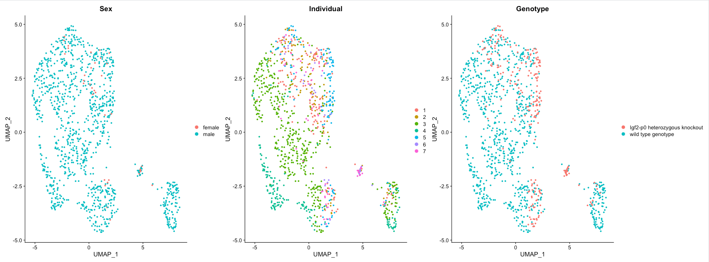
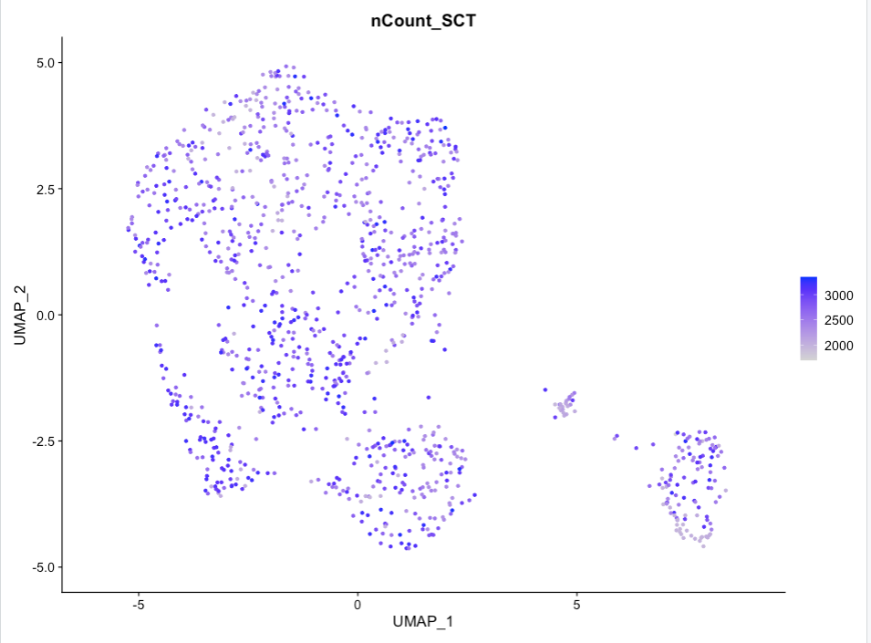
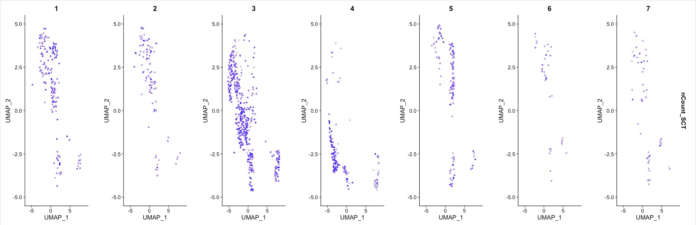
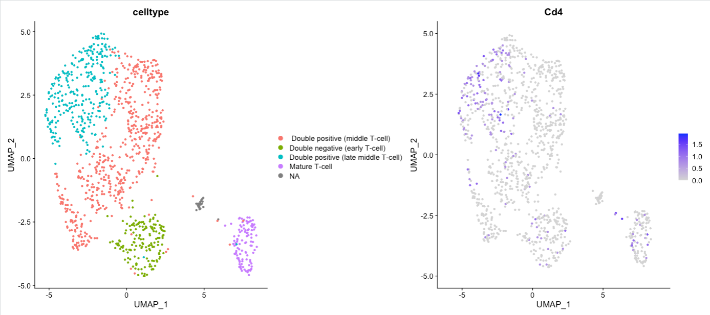

# Introduction

You’ve previously done all the work to make a single cell matrix. Now it’s time to fully process our data using Seurat: remove low quality cells, reduce the many dimensions of data that make it difficult to work with, and ultimately try to define clusters and find some biological meaning and insights! There are many packages for analysing single cell data - Seurat (), Scanpy (), Monocle (), Scater (), and many more. We’re working with Seurat because it is well updated, broadly used, and highly trusted within the field of bioinformatics.

> <comment-title></comment-title>
> This tutorial is significantly based on the Seurat documentation() as well as [Seurat's Guided Clustering Tutorial](https://satijalab.org/seurat/articles/pbmc3k_tutorial.html).
{: .comment}

> <agenda-title></agenda-title>
>
> In this tutorial, we will cover:
>
> 1. TOC
> {:toc}
>
{: .agenda}

We’ll provided you with experimental data to analyse from a mouse dataset of fetal growth restriction (). This is the full dataset generated from [this tutorial]().

# Get Data onto Galaxy
To start, let's get our dataset loaded into Galaxy.

You can access the data for this tutorial in multiple ways:
1. **EBI Data Retrieval** - You may retrieve that files necessary to construct a Seurat Object in this way.Doing to will alleviate the necessity to convert AnnData (Python) objects into Seurat (R) objects:

> <hands-on-title>GetData</hands-on-title>
>
> Run with the following parameters:
> - *"SC-Atlas experiment accession"*: `E-MTAB-6945`
> - *"Choose the type of matrix to download"*: `Raw filtered counts`
{: .hands_on}

2. **Importing from a history** - You can import [this history](https://dev.gvl.org.au/u/cgoclowski/h/fpe-buttons-take-13)

   
This also alleviates the necessity to convert the AnnData object into a Seurat one.

3. **Uploading from Zenodo** (see below)

> <hands-on-title>Option 3: Uploading from Zenodo</hands-on-title>
>
> 1. Create a new history for this tutorial
> 2. Import the AnnData object from [Zenodo]({{ page.zenodo_link }})
>
>    ```
>    {{ page.zenodo_link }}/files/Mito-counted_AnnData
>    ```
>
>    
>
> 3. **Rename**  the datasets `Mito-counted AnnData`
> 4. Check that the datatype is `h5ad`
>
>    
>
{: .hands_on}

><tip-title>AnnData to Seurat</tip-title>
>If you have uploaded your data from Zenodo, and it came in AnnData format, we will need to convert this to a Seurat Object. This can be easily accomplished using the Seurat FilterCells tool.
>Simply run the tool without any actual filtering thresholds and with the following parameters: 
>
>> <hands-on-title>Filter Cells</hands-on-title>
>>
>> Run with the following parameters:
>> - *"Choose the format of the input"*: `AnnData`
>> - *"RDS file"*: `Seurat Read10x on data 4, data 3, and other: Seurat RDS`
>> - *"Name of Parameter to filter on"*: `nCount_RNA`
>> - *"Min value"*: `0`
>> - *"Max value"*: `0`
>> - *"Choose the format of the output"*: `RDS with a Seurat object`
> {: .hands_on}
{: .tip}

# Generating a Seurat object
You now should have imported the `matrix.mtx`, `genes.tsv`, `barcodes.tsv`, and `exp_design.tsv` files into your Galaxy history. In order for Seurat tools to work, we will have to convert the data into a format that Seurat recognizes. To do so, we will add row and column names to our matrix. In the end, this will leave us with a matrix whose rows are gene names, columns are cell barcodes, and each value in the matrix represent the expression value of a given gene in a given cell.

This can be accomplished via the Read10x() step. Read10x() is Seurat's function to create a matrix and add in feature and barcode names simultaneously: 

> <hands-on-title>Read10X</hands-on-title>
>
> Run with the following parameters:
> - *"Expression matrix in sparse matrix format (.mtx)"*: `matrix.mtx.gz`
> - *"Gene table"*: `features.tsv.gz`
> - *"Barcode/cell table"*: `barcodes.tsv.gz`
> - *"Cell Metadata"*: `exp_design.tsv`
> - *"Minimum cells to include features"*: `5`
> - *"Choose the format of the output"*: `RDS with a Seurat object`
{: .hands_on}

The output of this tool will result in a Seurat object with row/column names as described above. You've created a Seurat object, congratulations!

# QC Plots
Now that we have a complete Seurat object, we can begin the filtering process.

There will  be a number of ‘cells’ that are actually just empty droplets or low-quality. There will also be genes that could be sequencing artifacts or that appear with such low frequency that statistical tools will fail to accurately analyse them.

This background noise of both cells and genes not only makes it harder to distinguish real biological information from artifacts, but also makes it computationally demanding to analyze.

We want to filter our cells, but first we need to know what our data looks like. There are a number of subjective decisions to make within scRNA-seq analysis, for instance we now need to make informed decisions about where to set our thresholds (more on that soon!).

We’re going to plot our data a few different ways. Different bioinformaticians might prefer to see the data in different ways, and here we are only generating a few of the plots you can use. Ultimately you need to go with what makes the most sense to you.

So let's generate some QC plots. First off, let's visualize the spread of our data:

> <hands-on-title>Visualize Counts</hands-on-title>
>
> Run with the following parameters:
> - *"Choose the format of the input"*: `RDS with a Seurat object`
> - *"RDS file"*: `Seurat Read10x on data 4, data 3, and other: Seurat RDS`
> - *"Plot_type_selector"*: `VlnPlot`
> - *"Features"*: `nCount_RNA`
> - *"Slot"*: `data`
> - *"Fill by"*: `Feature`
{: .hands_on}


This plot will show us the spread of cells in our data containing a given number of counts (or transcripts). We can use this plot, and others like it in a moment, to help filter out the uninformative cells. 

In a similar fashion we can visualize the spread of cells in our data expressing a given number of features (or genes): 

> <hands-on-title>Visualize Features</hands-on-title>
>
> Run with the following parameters:
> - *"Choose the format of the input"*: `RDS with a Seurat object`
> - *"RDS file"*: `Seurat Read10x on data 4, data 3, and other: Seurat RDS`
> - *"Plot_type_selector"*: `VlnPlot`
> - *"Features"*: `nFeature_RNA`
> - *"Slot"*: `data`
> - *"Fill by"*: `Feature`
{: .hands_on}


Now, we could just pick filtering thresholds based on these plots, and in a typical pipeline we would also plot the proportion of features that map to the mitochondrial genome (a tool coming soon to do so!). In the meantime, let's do some QC checks. 

We can, and should, ask a number of questions about the quality of our data before conducting any actual analyses. Batch effect, for example carries the potential to alter the conclusions we make. Let's take a look at whether this may be the case here:  

> <hands-on-title>Visualize Counts Split by Individual</hands-on-title>
>
> Run with the following parameters:
> - *"Choose the format of the input"*: `RDS with a Seurat object`
> - *"RDS file"*: `Seurat Read10x on data 4, data 3, and other: Seurat RDS`
> - *"Plot_type_selector"*: `VlnPlot`
> - *"Features"*: `nCount_RNA`
> - *"Group by"*: `Sample.Characteristic.individual`
> - *"Split by"*: `Sample.Characteristic.individual`
> - *"Log"*: `Yes`
> - *"Slot"*: `data`
> - *"Fill by"*: `ident`
{: .hands_on}


This plot shows us the number of cells split by the individual (mouse) from which the cells came from. Now, depending on your experimental design, batch may be represented by something other than individual--like timepoint or even the wet lab researcher who isolated the cells.

Ideally, we would like to see a relatively even distribution of counts for each individual (or batch) but if there isn’t, fear not, we can regress this variable out in a later step.

><tip-title>Plotting Lesson</tip-title>
>In order to accurately assess potential batch effects, use the "group.by" parameter to indicate the variable which differed across experiments. 
>If you are analyzing your own data, try plotting another variable which you know differed across experiments or even just samples.
>
{: .tip}

Now let's get an idea of how other variables, like  sex or genotype of the mice, might be represented across our dataset.

1. Sex?
   > <hands-on-title>Visualize Counts Split by Sex</hands-on-title>
  >
  > Run with the following parameters:
  > - *"Choose the format of the input"*: `RDS with a Seurat object`
  > - *"RDS file"*: `Seurat Read10x on data 4, data 3, and other: Seurat RDS`
  > - *"Plot_type_selector"*: `VlnPlot`
  > - *"Features"*: `nCount_RNA`
  > - *"Group by"*: `Sample.Characteristic.sex`
  > - *"Split by"*: `Sample.Characteristic.sex`
  > - *"Log"*: `Yes`
  > - *"Slot"*: `data`
  > - *"Fill by"*: `ident`
  {: .hands_on}


2. Genotype?
  > <hands-on-title>Visualize Counts Split by Genotype</hands-on-title>
  >
  > Run with the following parameters:
  > - *"Choose the format of the input"*: `RDS with a Seurat object`
  > - *"RDS file"*: `Seurat Read10x on data 4, data 3, and other: Seurat RDS`
  > - *"Plot_type_selector"*: `VlnPlot`
  > - *"Features"*: `nCount_RNA`
  > - *"Group by"*: `Sample.Characteristic.genotype`
  > - *"Split by"*: `Sample.Characteristic.genotype`
  > - *"Log"*: `Yes`
  > - *"Slot"*: `data`
  > - *"Fill by"*: `ident`
  {: .hands_on}
  

# Finding Our Filtering Parameters
Now that we have a better understanding of what our data looks like, we can begin identifying those spurious reads and low quality cells and then remove them. 

In a standard workflow, we would plot the percent mito (perc.mt) against the transcript count (nCount_RNA) and gene count (nFeature_RNA) to get an idea of our thresholds. 

><comment-title>High Mitochondrial Reads</comment-title>
>High mito expression will typically indicate stressed out cells (often due to the extraction, sorting, or sample prep protocols).
>
{: .comment}

However, this is not always necessary, and in fact, filtering based on counts and features (indeed, even just counts alone) will often remove the cells with spuriously high mitochondrial transcripts. These tools (and this tutorial) will soon be updated to allow us to do so--in the meantime, please see [Filter, Plot, and Explore single cell RNA-seq data (Seurat, R)]() [Filter, plot and explore single-cell RNA-seq (Scanpy)](), or [Filter, plot and explore single-cell RNA-seq data (Scanpy, Python)]() if you hope to include perc.mt in your own data analysis adventures. 

For now, we will use just transcript and gene counts to filter our data. Let's take a look back at our nFeature Violin Plot to pick our gene threshold: 


><comment-title>Interpretations</comment-title>
>You can see that very few cells in the dataset contain fewer than ~500 genes. Biologically, this makes sense, and the cells appear to be outliers in the data. As such, we will set our lower threshold of genes (nFeature) at 500. 
{: .comment}

Now, what about transcripts (nCount)? Let's take a look: 


><comment-title>Interpretations</comment-title>
>This one is a bit more difficult to visualize but we see a severe drop off in the number of cells that contain fewer than 500 and more than 10,000 transcripts. These will be our nCount thresholds that we filter based on. 
{: .comment}

These cells won't tell us much biologically, rather, they will contribute noise that we'll want to filter out of the data. With that being said, filtering scRNA-seq data will always be an iterative process--so label your work well and be ready to revisit these thresholds if your analyses seem strange down the line.

# Applying our Thresholds
It’s time to filter our cells by applying the above thresholds!

In order to include more than one parameter by which to filter, use the "Insert Subsets used to filter cells" button below the first parameter box.

> <hands-on-title>Filter Cells</hands-on-title>
>
> Run with the following parameters:
> - *"Choose the format of the input"*: `RDS with a Seurat object`
> - *"RDS file"*: `Seurat Read10x on data 4, data 3, and other: Seurat RDS`
> - *"Name of Parameter to filter on"*: `nCount_RNA`
> - *"Min value"*: `500.0`
> - *"Max value"*: `10000`
>
> - *"Name of Parameter to filter on"*: `nFeature_RNA`
> - *"Min value"*: `500.0`
> - *"Max value"*: `1000000000.0`
>
> - *"Choose the format of the output"*: `RDS with a Seurat object`
{: .hands_on}

In this step we are creating a new Seurat object (notice that the selected output of this tool will be an RDS file as opposed to the png plots we have thus far been creating).

Now, genes that do not appear in any cell, or even in only 1 or 2 cells, may break some analytical tools and will generally not be biologically informative.

Since you’ve removed a whole heap of cells, and the captured genes are sporadic (i.e. a small percentage of the overall transcriptome per cell) this means there are a number of genes still present in your matrix that are not expressed in any of the cells.

The removal of these genes is by no means necessary, but will speed up your analyses. The developers are currently working to enable a means of doing this through the Seurat Tools, but, in the meantime if you are analyzing your own data and would like to filter genes--please see [Filter, Plot, and Explore single cell RNA-seq data (Seurat, R)]() [Filter, plot and explore single-cell RNA-seq (Scanpy)](), or [Filter, plot and explore single-cell RNA-seq data (Scanpy, Python)](). 

# Processing
Currently, we still have quite big data. We have two issues here
 1. We already saw in our filtering plots that there are differences in how many transcripts and genes have been counted per cell. This technical variable could, and likely will, distract us from identifying true biological differences.
 2. We like to plot things on 2-dimensional X/Y plots. So, for instance, Gapdh could be on one axis, and Actin could be on another, and then each cell is plotted onto that 2D axis based on how many of each transcript they possess.

Although that would be fine, adding in a 3rd dimension (or, indeed, in our case, a dimension for each of the thousands of genes), is a bit trickier.

So, our next steps will be to transform our big data object into something that is easy to analyse and easy to visualize: this is commonly referred to as preprocessing of the data and a typical scRNA-seq preprocessing pipeline will include the following steps: 

1. Normalization 

What is Normalization?

Normalisation helps reduce the differences between gene and UMI counts by fitting total counts across cells in our data to be comparable to one another. SCTransform regularizes the gene expression profiles via a negative binomial regression while also controlling for overfitting of the data. 

> <hands-on-title>Normalize Data</hands-on-title>
>
> Run with the following parameters:
> - *"Choose the format of the input"*: `RDS with a Seurat object`
> - *"RDS file"*: `Seurat FilterCells on data 5: Seurat RDS`
> - *"Normalisation method"*: `Log Normalise`
{: .hands_on}

2. Identifying Variable Genes

What are variable genes? 

The datasets have loads of genes, but not all of them vary in expression from cell to cell. For instance, housekeeping genes are defined as not changing much from cell to cell, so we could remove these from our data to simplify our analyses.

The find variable genes step flags genes that *do* vary across cells to expedite future analyses and ensure that we, and Seurat, don't waste time looking for meaningful differences where they don't exist.

> <hands-on-title>Find Vairable Genes</hands-on-title>
>
> Run with the following parameters:
> - *"Choose the format of the input"*: `RDS with a Seurat object`
> - *"RDS file"*: `Seurat NormaliseData in data 11: Seurat RDS`
> - *"Choose the format of the output"*: `RDS with a Seurat object`
{: .hands_on}

This tool will output two new pieces of data into our Galaxy history: a new Seurat object with variable features identified and flagged, and a tabular file with a list of these variable genes. 

This gene list may be used as a sneak peak into understanding what the dataset will look like! We can begin to understand which genes are going to be driving downstream clustering of our cells and maybe even make some decisions about whether we are happy with our filtering based on this list. 

3. Scale Data 

Now we will scale the data.

What is scaling?

This is an important step to set up our data for further dimensionality reduction. It will transform the dataset such that all genes have the same variance and a zero mean. It helps negate sequencing depth differences between samples, since the gene levels across the cells become comparable.

><comment-title>Don't Worry!</comment-title>
> Note, that the differences from scaling etc. are not the values you have at the end - i.e. if your cell has average GAPDH levels, it will not appear as a ‘0’ when you calculate gene differences between clusters.
>
{: .comment}

> <hands-on-title>Scale Data </hands-on-title>
>
> Run with the following parameters:
> - *"Choose the format of the input"*: `RDS with a Seurat object`
> - *"RDS file"*: `Seurat FindVariableGenes on data 12: Seurat RDS`
> - *"Choose the format of the output"*: `RDS with a Seurat object`
> - *"Genes to use"*: `Seurat FindVariableGenes on data 12: Variable genes tabular file`
> - *"Vars to regress"*: `nCount_RNA`
> - *"Statistical model"*: `Linear model`
{: .hands_on}

You now have a preprocessed Seurat object! 

><comment-title>Regressing Variables</comment-title>
> Take note of the "Vars to regress" argument in the above tool. This function allow us to mitigate the effects of confounding factors in our dataset.
> In true research practice, I often regress out multiple variables including but not limited to perc.mt, cell cycle scoring, and feature count. 
> As currently written, this tool only allows us to regress out a single variable: so feel free to pick another to regress and see how it changes the downstream analyses!
{: .comment}


# Dimensionality Reduction 
Although we've made our expression values comparable to one another and our overall dataset less computationally demanding, we still have way too many dimensions (n cells x n genes!).

Transcript changes are not usually singular--which is to say, genes function and exist in pathways and groups. It would be easier to analyse our data if we could group these differences. To address this we will run principal component analysis (PCA).

><comment-title>What is PCA?</comment-title>
>Principal components (PCs) are calculated from highly dimensional data to find the most representative spread in the dataset. So in our highly variable gene dimensions, there will be one line (axis) that yields the most spread and variation across the cells. That will be our first principal component.
{: .comment}

We can calculate the first handful of principal components in our data to drastically reduce the number of dimensions:

><tip-title>Running Computationally Demanding Steps on Variable Features </tip-title>
>You'll notice that the RunPCA() function is run using the variable features from the previous step. This signficantly decreases the number of genes, and their expression changes, that must be grouped into principal components by this step.
{: .tip}

```r
filtered_srt <- RunPCA(filtered_srt, features = VariableFeatures(object = filtered_srt))
```

To visualize how our principal components (PCs) represent our data, let's create an elbow plot:

```r
ElbowPlot(filtered_srt, ndims = 50)
```


><comment-title>Interpretations</comment-title>
>We can see that there is really not much variation explained past the 9th PC. So we might save ourselves a great deal of time and muddied data by focusing on the top 10 PCs.
{: .comment}

You can also think about it like choosing a threshold of variance explained. Conservatively, 2.5 standard deviations are explained by about 10 of the PCs.

We’re still looking at around 10 dimensions at this point--likely not the easiest to visualize. To make our lives easier, we need to identify how similar a cell is to another cell, across every cell across each of these dimensions.

For this, we will use the k-nearest neighbor (kNN) graph, to identify which cells are close together and which are not.

The kNN graph plots connections between cells if their distance (when plotted in this 10 dimensional space!) is amongst the k-th smallest distances from that cell to other cells. This will be crucial for identifying clusters, and is necessary for plotting a UMAP--which is what will ultimately allow us to visualize our data in 2 dimensions.

><comment-title>From UMAP developers:</comment-title>
>“Larger neighbor values will result in more global structure being preserved at the loss of detailed local structure. In general this parameter should often be in the range 5 to 50, with a choice of 10 to 15 being a sensible default”.
{: .comment}

Let's now use the 10 PC threshold we chose from the Elbowplot and apply it to find neighbors:

```r
filtered_srt <- FindNeighbors(filtered_srt, dims = 1:10)
```

Now we can use the neighborhood graph to identify clusters of cells whose transcriptional profiles appear most similar to one another.

```r
filtered_srt <- FindClusters(filtered_srt, resolution = 0.5)
```

Unfortunately, identifying clusters is not as majestic as biologists often think - the math doesn’t necessarily identify true cell clusters. Every algorithm for identifying cell clusters falls short of a biologist knowing their data, knowing what cells should be there, and proving it in the lab.

So, we’re going to make the best of it as a starting point and see what happens! We will define clusters from the kNN graph, based on how many connections cells have with one another. Roughly, this will depend on a resolution parameter for how granular you want to be.

><tip-title>On Clustering Resolution</tip-title>
>The resolution parameter available in the FindClusters() function allows for you, the bioinformatician, to dictate the granularity of the clusters.
>
>For example, a higher clustering resolution dictates increased granularity, and more stringent clusters. That is--cells must more closely resemble one another in order to be grouped into the same cluster than at a lower clustering resolution.
>
>In general, I find it easiest to think of a higher resolution producing more clusters and conversely, a lower resolution will produce less clusters. This parameter is a useful one that you will use often to help decipher how many true populations of cells are present in your data!
{: .tip}

Now that we have made note within our object of which cells cluster together, we can start to visualize our data! Two major visualizations for this data type are tSNE and UMAP. We can calculate the coordinates for both prior to visualization. For tSNE, the parameter perplexity can be changed to best represent the data, while for UMAP the main change would be to change the kNN graph above itself, via the FindNeighbors() function.

><tip-title>On UMAP</tip-title>
>UMAP is the most recently developed, and most widely used dimensionality reduction for visualization of principal component data. It has been optimized since tSNE to better preserve global structure and is less computationally demanding.
>
{: .tip}

```r
filtered_srt <- RunUMAP(filtered_srt, dims = 1:10, seed.use = 1323)
```

# Let's Take a Look
Now that we have run dimensionality reduction on our dataset, it is ready for visualization. Let's take a look at what our cells look like in a UMAP projection:

```r
DimPlot(filtered_srt, reduction = "umap", label = TRUE, label.box = TRUE)+ NoLegend()
```

Good work! It looks like with a clustering resolution of 0.5, we are able to identify 7 clusters of cells in our data.

We can also look for expression of particular genes and see how those map to our UMAP projection. This is often useful in getting an initial understanding of which clusters might be representative of which cell types.

```r
FeaturePlot(filtered_srt, features = "Gapdh", order = TRUE)
```


We just plotted a housekeeping gene, Gapdh, so the broad expression we observe is expected.

><tip-title>Weird scale?</tip-title>
> If the scale of your data looks weird, it may be due to the DefaultAssay of your object. When we ran SCTransform, the function creates an entirely new assay within our Seurat object that includes scaled and normalized count values. This SCT Assay is what we want to visualize our expression values off of. So, if your scale is super broad, or goes negative, try running the following command before attempting to plot again:
>```r
>DefaultAssay(filtered_srt)<-"SCT"
>```
{: .tip}

In practice, it is helpful to plot known markers of cell types you expect to be in your dataset. This will give you a first look at how your cells are clustered.

For example, we can plot early T-cell marker Il2ra and get an idea of which cells and/or clusters might resemble the early T-cells:

```r
FeaturePlot(filtered_srt, features = "Il2ra", order = TRUE)
```


It is a good idea, when analyzing your own data, to plot some markers of cell types you expect to be present. Later on we can also use these FeaturePlots to visualize manual annotation of clusters.

# Differential Expression Testing: Finding Markers
Because each cluster of cells was grouped based on similar transcriptome profiles, each cluster will inherently differ from one another based on a set of "marker" genes.

Following an initial look at the DimPlots and FeaturePlots, we can take an even closer look at which genes are driving the clustering.

In order to do so we can run cluster level differential expression tests. First, we will need to set our object's active identity to be the clusters. This will ensure that when Seurat's differential expression function is run, the groupings of cells across which it will compare are the clusters.

><tip-title>What are Identities?</tip-title>
> Identities are, at their core, categorical metadata values. They are columns of cell-level metadata that somehow group the cells together. Examples of identities could be cluster number, cell type if/once known, genotype, etc.
>
{: .tip}

```r
Idents(filtered_srt)<- filtered_srt$seurat_clusters
```

><tip-title>Syntax Lesson</tip-title>
> There are often many different ways to get the same job done in R, but especially when manipulating Seurat objects. We could alternatively set the active identity of our object with the following line of code too:
>
>```r
>filtered_srt<-SetIdent(object = filtered_srt, value = "seurat_clusters")
>```
{: .tip}

Then, we'll run Seurat's FindAllMarkers function, which will compare each identity (in this case cluster) against every other identity within its class (all the other clusters). This function of marker finding is particularly useful in identifying up, or down, regulated genes that drive differences in identity/cluster.

```r
cluster_markers<-FindAllMarkers(object = filtered_srt)
View(cluster_markers)
```

We'll use these marker lists later on to label our cell types.

We can also see which genes are differentially expressed across other variables in our metadata. For example, you can see which genes are up or down regulated across the different genotypes present in our dataset. To do so, let's first get a list of all the identity classes in our data. This information is kept in the metadata column, and any categorical variable will do. Here, let's pick genotype.

```r
metadata<-as.data.frame(filtered_srt@meta.data)
filtered_srt<-SetIdent(object = filtered_srt, value = "Genotype")
```

The "metadata" object now in your environment is a dataframe with column names representing the different identities you may choose to group your cells by when running differential expression. The second line of code above will set the object's identity class to be the genotype from which the cell came from.

Now, let's see what genes differentiate our wildtype from our mutant cells. First, we can identify how many different genotypes are in our data:

```r
unique(filtered_srt$Genotype)
```

This output helpfully shows us what the genotypes are, and how they are labelled in our metadata. The small details, like capitalization, are important for referencing metadata information--our references must perfectly match the labelling in the object, otherwise they will not be recognized by the functions.

Now that we know how our wildtype and mutant cells are labelled, we can use that information to directly compare the two. This time we will use a pairwise comparison method by using Seurat's FindMarkers() function (not to be confused with FindAllMarkers which has a comprehensive comparison approach):

```r
markers<-FindMarkers(object = filtered_srt, ident.1 = "wild type genotype", ident.2 = "Igf2-p0 heterozygous knockout", test.use = "wilcox")
```

The above function will find all of the differentially expressed genes between ident.1 (wildtype) and ident.2 (mutant) using the Wilcoxon test. The resulting output will show genes with positive fold changes (denoting a higher expression in the first identity--wildtype) and negative fold changes (denoting a higher expression value in the second identity--mutant).

><comment-title>On Finding Markers</comment-title>
> This same test of differential expression can be run using any identity class and any two identities within the same class. As this is a more fine tuned comparison than FindAllMarkers, it can be useful to uncover differences across specific samples.
{: .comment}

# Biological Interpretations
Now it’s the fun bit! We can see where genes are expressed, and start considering and interpreting the biology of it. At this point, it’s really about what information you want to get from your data--the following is only the tip of the iceberg. However, a brief exploration is good, because it may help give you ideas going forward for your own data. Let's start interrogating our data!

Let's take another look at what our clusters look like:

```r
DimPlot(object = filtered_srt, reduction = "umap", label = TRUE, label.box = TRUE, group.by = "seurat_clusters") + NoLegend()
```


><comment-title>On Cluster Numbering</comment-title>
>Note that Seurat's cluster numbering is based on size alone, so clusters 0 and 1 are not necessarily related, they are just the clusters containing the most cells.
{: .comment}

It would be nice to know what these cells are. This analysis (googling all of the marker genes, both checking where the ones you know are and then going through marker tables we generated) is a fun task for any individual experiment, so we’re going to speed past that and nab the assessment from the original paper!

| Clusters | Markers                 | Cell Type                           |
|----------|-------------------------|-------------------------------------|
| 3        | Il2ra                   | Double negative (early T-cell)      |
| 1,2,5    | Cd8b1, Cd8a, Cd4        | Double positive (middle T-cell)     |
| 0        | Cd8b1, Cd8a, Cd4 - high | Double positive (late middle T-cell)|
| 4        | Itm2a                   | Mature T-cell                       |

Feel free to plot these markers onto our dataset to see where they fall. This is generally a useful method of discerning cell types and can be useful for initial annotations.

><tip-title>Plotting Markers</tip-title>
>To do so, simply use the same FeaturePlot() function we used above, but replace the feature parameter with your new marker of interest.
>```r
>FeaturePlot(object = filtered_srt, features = c("Il2ra", "Cd8b1", "Cd8a", "Cd4", "Itm2a"), order = T, ncol = 3)
>```
>
{: .tip}

We can then manually label the clusters in whatever way we please. [Dplyr](https://dplyr.tidyverse.org/reference/mutate.html)'s mutate() function allows us to incorporate conditional metadata. That is to say, we can ask the function to label cells based on the cluster in which they have been assigned:

```r
filtered_srt@meta.data<- mutate(filtered_srt@meta.data, celltype = case_when(
  seurat_clusters %in% c(3) ~ "Double negative (early T-cell)",
  seurat_clusters %in% c(1,2,5) ~ " Double positive (middle T-cell)",
  seurat_clusters %in% c(0) ~ "Double positive (late middle T-cell)",
  seurat_clusters %in% c(4) ~ "Mature T-cell"
))
```
Once we have labelled our clusters, we can visualize what our cell types actually look like:

```r
DimPlot(object = filtered_srt, reduction = "umap", group.by = "celltype")
```


Now we can begin to feel a bit more oriented in exploring our data. The clusters are labelled with cell types, and our object has been processed enough such that we may now begin to answer some real biological questions! Now that we know what we’re dealing with, let’s examine the effect of our variable, real science!

## Keep Digging
Are there any differences in genotype? Or in biological terms, is there an impact of growth restriction on T-cell development in the thymus? We can begin to answer this question visually by using the "split.by" parameter in Seurat's plot functions.

```r
DimPlot(object = filtered_srt, reduction = "umap", group.by = "celltype", split.by = "Genotype")
```


We can see that there seems to be a decrease in cellcounts across the celltypes in the het mutant... INTERESTING! What next? We might look further at the transcripts present in both those populations, and perhaps also look at the genotype marker table… So much to investigate! But before we set you off to explore to your heart’s delight, let’s also look at this a bit more technically.

# Technical Assessment
Is our analysis real? Is it right? Well, we can assess that a little bit.

First thing's first, is there a batch effect?

```r
DimPlot(object = filtered_srt, reduction = "umap", group.by = "Individual")
```


While some differences across batch are expected and nothing to be concerned about, the immature T-cells looks to be mainly comprised of Individual 3. There might be a bit of batch effect, so you could consider using batch correction on this dataset. However, if we focus our attention on the other cluster - mature T-cells - where there is batch mixing, we can still assess this biologically even without batch correction.

Additionally, we will also look at the confounding effect of sex:

```r
DimPlot(object = filtered_srt, reduction = "umap", group.by = c("Sex", "Individual", "Genotype"))
```



We note that the one female sample - unfortunately one of merely three knockout samples - seems to be distributed in the same areas as the knockout samples at large, so luckily, this doesn’t seem to be a confounding factor and we can still learn from our data. Ideally, this experiment would be re-run with either more female samples all around or swapping out this female from the male sample.

Are there any clusters or differences being driven by sequencing depth, a technical and random factor?

```r
FeaturePlot(object = filtered_srt, reduction = "umap", features = "nCount_SCT")
```



There doesn't visually appear to be any differences in sequencing depth across the clusters, but let's check out some of those other variables we grouped by:

```r
FeaturePlot(object = filtered_srt, reduction = "umap", features = "nCount_SCT", split.by = "Individual")
```


There we go! This might explain the dramatic shift in early to middle T-Cell between wildtype and knockout cells--the leftmost early to middle T-cells simply have a higher sequencing depth represented by Individual 3 (UMIs/cell) than the ones on the right side. Well, that explains some of the sub-cluster that we’re seeing in that splurge (specifically this likely accounts for the discernment between clusters 1, 2, and 5).

Luckily, and importantly, we don’t see the double negative or mature T-cells being similarly affected. So, although, this variable of sequencing depth, or moreso, Individual, might be something to regress out somehow, it doesn’t seem to be impacting our dataset such that we cannot draw meaningful insights.


><tip-title>Overprocessing</tip-title>
>The less you can regress/modify your data, in general, the better--you want to stay as true as you can to the raw data, and only use maths to correct your data when you really need to (and not to create insights where there are none!).
{: .tip}


Do you think we processed these samples well enough? We have seen in the previous images that these clusters are not very tight or distinct, so we could consider stronger filtering. Let's take a look at gene expression of a gene we know should not be expressed in tCells as a sanity check:

```r
FeaturePlot(object = filtered_srt, reduction = "umap", features = "Hba-a1")
```


Hemoglobin--a red blood cell marker that should NOT be found in T-cells--appears throughout the entire dataset in low numbers and as a likely marker of Cluster 6. This suggests that some background noise may have been introduced by the media the cells were in. We might consider in the wet lab trying to get a purer, happier sample, with less background or in the dry lab, we can take advantage of techniques such as SoupX or others to remove this technical noise.

><tip-title>Removing Noise</tip-title>
>Adjusting the filtering settings (increasing minimum counts/cell, etc.) is often the place to start in these scenarios.
{: .tip}

Do you think the clustering is appropriate? i.e. are there single clusters that you think should be separate, and multiple clusters that could be combined?

```r
CellType_DimPlot<-DimPlot(object = filtered_srt, reduction = "umap", group.by = "celltype")
Cd4_FeaturePlot<-FeaturePlot(object = filtered_srt, reduction = "umap", features = "Cd4")
CellType_DimPlot | Cd4_FeaturePlot
```


Important to note, lest all bioinformaticians combine forces to attack the biologists: just because a cluster doesn’t look like a cluster by eye is NOT enough to say it’s not a cluster! But looking at the biology here, we struggled to find marker genes to distinguish the double positive populations, which we know are also affected by depth of sequencing. That’s a reasonable argument that Clusters 1, 2, and 5 might not be all that different. Maybe we need more depth of sequencing across all those cells, or to compare these explicitly to each other (consider variations on FindMarkers!).

However, the late double positive cluster is both seemingly leaving the larger body of clusters and also has fewer knockout cells, so we might go and look at what those cells are expressing in the marker genes. If we look at the mature T-cells further, we can see that their marker gene--Itm2a--is only expressed in half of the cluster. You might consider sub-clustering this to investigate further, either through changing the resolution or through analysing this cluster alone.

If we look at the differences between genotypes alone (so the pseudo-bulk), we can see that many, if not most, of the genes in that list are actually ribosomal. This could be a housekeeping background, it might be cell cycle related, it may be biological, or some combination of all three. You might consider investigating the cycling status of the cells, or even regressing this out (which is what the authors did).

Ultimately, there are quite a lot ways to analyse your single-cell data, both within the confines of this tutorial (the many parameters that could be changed throughout) and outside of it (batch correction, sub-clustering, cell-cycle scoring, inferred trajectories, etc.) Most analyses will still yield the same general output, though: there are fewer knockout cells in the mature T-cell population, suggesting some sort of abberant development of T-cells in the Igf2-p0 hets.

Finally, we can export plots and objects from RStudio back into Galaxy. To do so, we'll use the gx_put() function provided to us by Galaxy. Let's save our Seurat object and the cell type labelled DimPlot!

```r
gx_put(filtered_srt)
gx_put(CellType_DimPlot)
```

The above functions will export your object and the plot into your Galaxy history!

Congratulations! You have interpreted your plots in several important ways!
