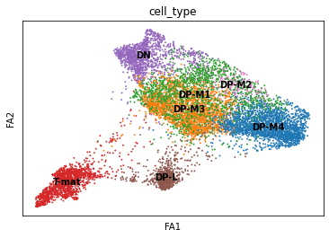
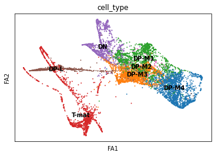
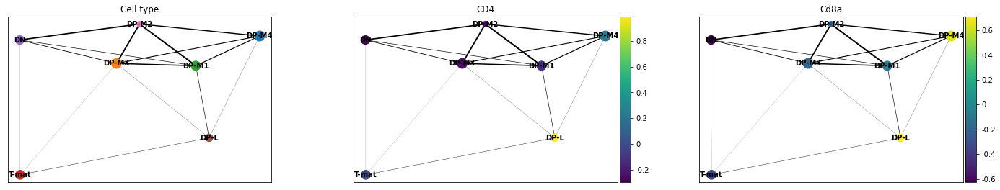
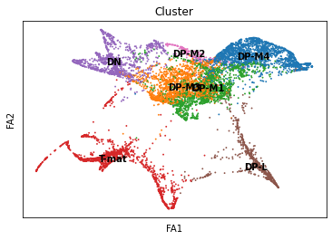
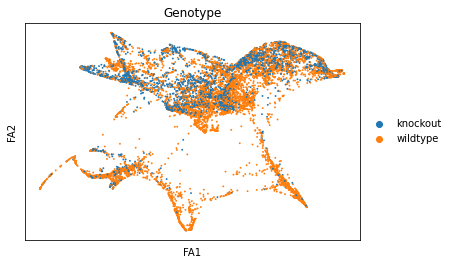
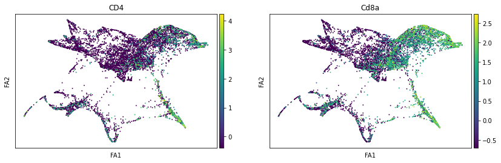
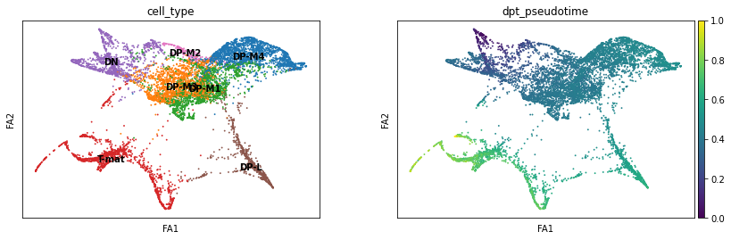

# Introduction


You've done all the hard work of preparing a single cell matrix, processing it, plotting it, interpreting it, finding lots of lovely genes, all within the glorious Galaxy interface. Now you want to infer trajectories, or relationships between cells... and you've been threatened with learning Python to do so! Well, fear not. If you can have a run-through of a basic python coding introduction such as [this one](https://www.w3schools.com/python/), then that will help you make more sense of this tutorial, however you'll be able to make and interpret glorious plots even without understanding the Python coding language. This is the beauty of Galaxy - all the 'set-up' is identical across computers, because it's browser based. So fear not!

Traditionally, we thought that differentiating or changing cells jumped between discrete states, so 'Cell A' became 'Cell B' as part of its maturation. However, most data shows otherwise, that generally there is a spectrum (a 'trajectory', if you will...) of small, subtle changes along a pathway of that differentiation. Trying to analyse cells every 10 seconds can be pretty tricky, so 'pseudotime' analysis takes a single sample and assumes that those cells are all on slightly different points along a path of differentiation. Some cells might be slightly more mature and others slightly less, all captured at the same 'time'. We 'assume' or 'infer' relationships between cells.

We will use the same sample from the previous three tutorials, which contains largely T-cells in the thymus. We know T-cells differentiate in the thymus, so we would assume that we would capture cells at slightly different time points within the same sample. Furthermore, our cluster analysis alone showed different states of T-cell. Now it's time to look further!

> <agenda-title></agenda-title>
>
> In this tutorial, we will cover:
>
> 1. TOC
> {:toc}
>
{: .agenda}

## Get data

We've provided you with experimental data to analyse from a mouse dataset of fetal growth restriction . This is the full dataset generated from [this tutorial]() (see the [study in Single Cell Expression Atlas](https://www.ebi.ac.uk/gxa/sc/experiments/E-MTAB-6945/results/tsne) and the [project submission](https://www.ebi.ac.uk/arrayexpress/experiments/E-MTAB-6945/)). You can find the final dataset in this [input history](https://usegalaxy.eu/u/wendi.bacon.training/h/cs4inferred-trajectory-analysis-using-python-jupyter-notebook-in-galaxy---input) or download from Zenodo below.

> <hands-on-title>Data upload</hands-on-title>
>
> 1. Create a new history for this tutorial
> 2. Import the AnnData object from [Zenodo]({{ page.zenodo_link }})
>
>    ```
>    {{ page.zenodo_link }}/files/Trajectories_Instructions.ipynb
>    {{ page.zenodo_link }}/files/Final_cell_annotated_object.h5ad
>    ```
>
>    
>
> 3. **Rename**  the .h5ad object as `Final cell annotated object`
>
>    
>
> 4. Check that the datatype is `h5ad`
>
>    
>
> 5. **Rename**  the .ipynb object as `Trajectories_Instructions.ipynb`
>
> 6. Check that the datatype is `.ipynb`
>
{: .hands_on}

## Filtering for T-cells

One problem with our current dataset is that it's not just T-cells: we found in the previous tutorial that it also contains macrophages. This is a problem, because trajectory analysis will generally try to find relationships between all the cells in the sample. We need to remove those cell types to analyse the trajectory.



> <hands-on-title>Removing macrophages</hands-on-title>
>
> 1.  with the following parameters:
>    -  *"Annotated data matrix"*: `Final cell annotated object`
>    - *"Function to manipulate the object"*: `Filter observations or variables`
>    - *"What to filter?"*: `Observations (obs)`
>    - *"Type of filtering?"*: `By key (column) values`
>    - *"Key to filter"*: `cell_type`
>    - *"Type of value to filter"*: `Text`
>    - *"Filter"*: `not equal to`
>    - *"Value"*: `Macrophages`
>
> 3. **Rename**  output h5ad `T-cell_object.h5ad`
>
{: .hands_on}

You should now have `8569` cells, as opposed to the `8605` you started with. You've only removed a few cells (the contaminants!), but it makes a big difference in the next steps.

Take note of what # this dataset is in your history, as you will need that shortly!

## Launching Jupyter

> <warning-title>Data uploads and Jupyter</warning-title>
> There are a few ways of importing and uploading data in Jupyter. You might find yourself accidentally doing this differently than the tutorial, and that's ok. There are a few key steps where you will call files from a location - if these don't work from you, check that the file location is correct and change accordingly!
{: .warning}

JupyterLab is a bit like RStudio but for other coding languages. What, you've never heard of [RStudio](https://www.rstudio.com/products/rstudio/features/)? Then don't worry, just follow the instructions!

 Please note: this is only currently available on the [usegalaxy.eu](https://usegalaxy.eu) and [usegalaxy.org](https://usegalaxy.org) sites.

> <hands-on-title>Downloading the tutorial notebook</hands-on-title>
>
> 1. You will need to download the tutorial notebook locally to your own computer. Do this by going here: [Download the notebook](https://zenodo.org/record/7054806/files/Trajectories_Instructions.ipynb?download=1)
{: .hands_on}

> <hands-on-title>Launching JupyterLab</hands-on-title>
>
> 1.  with the following parameters:
>    - *"Do you already have a notebook?"*: `Start with a fresh notebook`
>
>    This may take a moment, but once the `Executed notebook` in your dataset is orange, you are up and running!
>
> 2. Either click on the blue `User menu`, or go to the top of the screen and choose `User` and then `Active InteractiveTools`
>
> 3. Click on the newest `JupyTool interactive tool`.
>
{: .hands_on}

Welcome!

> <warning-title>Danger: You can lose data!</warning-title>
> Do NOT delete or close this notebook dataset in your history. YOU WILL LOSE IT!
{: .warning}

> <hands-on-title>Creating a notebook</hands-on-title>
>
> 1. Click the **Python 3** icon under **Notebook**
>
>   
>
> 2. Save your file (**File**: **Save**, or click the  Save icon at the top left)
>
> 3. If you right click on the file in the folder window at the left, you can rename your file `whateveryoulike.ipynb`
>
{: .hands_on}

Cool! Now you know how to create a file! Helpfully, however, we have created one for you, and you've downloaded it onto your computer already!

> <hands-on-title>Uploading the tutorial notebook</hands-on-title>
>
> 1. In the folder window,  Upload the `Trajectories_Instructions.ipynb` from your computer. It should appear in the file window.
>
> 2. Open it by double clicking it in the file window.
>
{: .hands_on}

> <warning-title>You should <b>Save</b> frequently!</warning-title>
> This is both for good practice and to protect you in case you accidentally close the browser. Your environment will still run, so it will contain the last saved notebook you have. You might eventually stop your environment after this tutorial, but ONLY once you have saved and exported your notebook (more on that at the end!) Note that you can have multiple notebooks going at the same time within this JupyterLab, so if you do, you will need to save and export each individual notebook. You can also download them at any time.
{: .warning}

# Run the tutorial!

At this point, to prevent you having to switch back and forth between browsers, the directions for the rest of tutorial are all in the notebook you input! You may have to change certain numbers in the code blocks, so do read carefully. You will be able to run each step be clicking on the code block and pressing the  *Run the selected cells and advance* step. You will want to keep a tab open with your Galaxy history showing (so just launch another browser of your usegalaxy.eu instance), so that you can see when your files appear there. The tutorial is adapted from the [Scanpy Trajectory inference tutorial](https://scanpy-tutorials.readthedocs.io/en/latest/paga-paul15.html).

# Tutorial Plot Answers

Just in case, we've put the plots you should generate in the tutorial here. If things have gone wrong, you can also download this [answer key tutorial]({{ page.zenodo_link }}/files/Trajectories_AnswerKey.ipynb).















# After Jupyter

 Congratulations! You've made it through Jupyter!

> <hands-on-title>Closing JupyterLab</hands-on-title>
>
> 1. Click **User**: **Active Interactive Tools**
>
> 2. Tick  the box of your Jupyter Interactive Tool, and click **Stop**
>
{: .hands_on}

If you want to run this notebook again, or share it with others, it now exists in your history. You can use this 'finished' version just the same way as you downloaded the directions file and uploaded into the Jupyter environment.

# Conclusion


 Congratulations! You've made it to the end! You might be interested in the [Answer Key History](https://usegalaxy.eu/u/wendi.bacon.training/h/cs4inferring-trajectories-using-python-in-galaxyanswer-key) or the [Answer Key Jupyter Notebook](https://zenodo.org/record/7054806/files/Trajectories_Answer_Key.ipynb?download=1).

In this tutorial, you moved from called clusters to inferred relationships and trajectories using pseudotime analysis. You found an alternative to PCA (diffusion map), an alternative to tSNE (force-directed graph), a means of identifying cluster relationships (PAGA), and a metric for pseudotime (diffusion pseudotime) to identify early and late cells. If you were working in a group, you found that such analysis is slightly more sensitive to your decisions than the simpler filtering/plotting/clustering is. We are inferring and assuming relationships and time, so that makes sense!

To discuss with like-minded scientists, join our Gitter channel for all things Galaxy-single cell!
[](https://gitter.im/Galaxy-Training-Network/galaxy-single-cell?utm_source=badge&utm_medium=badge&utm_campaign=pr-badge)
