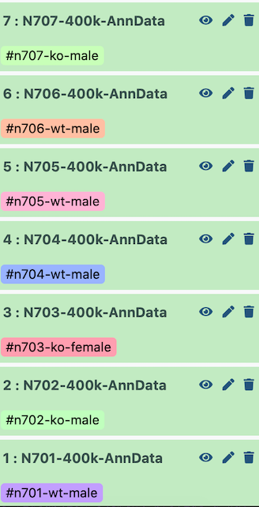
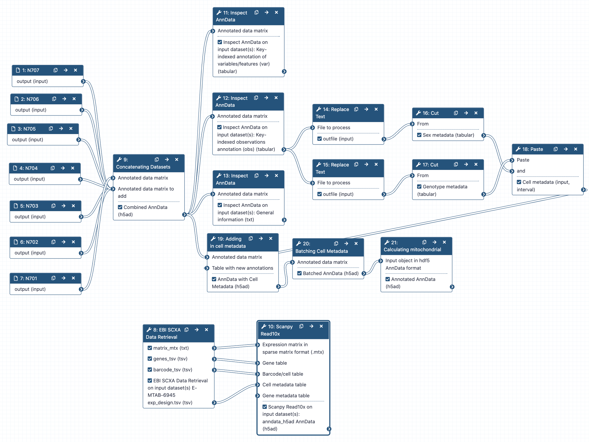

# Introduction

<!-- This is a comment. -->

This tutorial will take you from the multiple AnnData outputs of the [previous tutorial](https://humancellatlas.usegalaxy.eu/training-material/topics/transcriptomics/tutorials/scrna-case_alevin/tutorial.html) to a single, combined  AnnData object, ready for all the fun downstream processing. We will also look at how to add in metadata (for instance, SEX or GENOTYPE) for analysis later on.

> <agenda-title></agenda-title>
>
> In this tutorial, we will cover:
>
> 1. TOC
> {:toc}
>
{: .agenda}


## Get Data
The sample data is a subset of the reads in a mouse dataset of fetal growth restriction  (see the [study in Single Cell Expression Atlas](https://www.ebi.ac.uk/gxa/sc/experiments/E-MTAB-6945/results/tsne) and the [project submission](https://www.ebi.ac.uk/arrayexpress/experiments/E-MTAB-6945/)). Each of the 7 samples (N701 --> N707) has been run through the workflow from the [Alevin tutorial](https://humancellatlas.usegalaxy.eu/training-material/topics/transcriptomics/tutorials/scrna-case_alevin/tutorial.html).

You can access the data for this tutorial in multiple ways:

1. **Your own history** - If you're feeling confident that you successfully ran a workflow on all 7 samples from the previous tutorial, and that your resulting 7 AnnData objects look right (you can compare with the [answer key history](https://usegalaxy.eu/u/wendi.bacon.training/h/cs2combining-datasets-after-pre-processing---input-1)), then you can use those! To avoid a million-line history, I recommend dragging the resultant datasets into a fresh history

   

2. **Importing from a history** - You can import [this history](https://usegalaxy.eu/u/wendi.bacon.training/h/cs2combining-datasets-after-pre-processing---input-1)

   

3. **Uploading from Zenodo** (see below)


> <hands-on-title>Data upload for 7 files</hands-on-title>
>
> 1. Create a new history for this tutorial (if you're not importing the history above)
> 2. Import the different AnnData files and the experimental design table from [Zenodo](https://zenodo.org/record/7075635).
>
>    ```
>    {{ page.zenodo_link }}/files/Experimental_Design.tsv
>    {{ page.zenodo_link }}/files/N701-400k.h5ad
>    {{ page.zenodo_link }}/files/N702-400k.h5ad
>    {{ page.zenodo_link }}/files/N703-400k.h5ad
>    {{ page.zenodo_link }}/files/N704-400k.h5ad
>    {{ page.zenodo_link }}/files/N705-400k.h5ad
>    {{ page.zenodo_link }}/files/N706-400k.h5ad
>    {{ page.zenodo_link }}/files/N707-400k.h5ad
>    ```
>
>    
>
> 3. Rename the datasets
> 4. Check that the datatype is `h5ad`, otherwise you will need to change each file to `h5ad`!
>
>    
>
{: .hands_on}

Inspect the  `Experimental Design` text file. This shows you how each `N70X` corresponds to a sample, and whether that sample was from a male or female. This will be important metadata to add to our sample, which we will add very similarly to how you added the `gene_name` and `mito` metadata previously!

# Important tips for easier analysis



> <comment-title></comment-title>
> - The Galaxy tool search panel sometimes doesn't find the tools we need from the thousands available.
> - You'll have a much easier time selecting tools from the panel (if you aren't using tutorial mode!) if you are on the [https://humancellatlas.usegalaxy.eu](https://humancellatlas.usegalaxy.eu)
{: .comment}

## Concatenating objects



> <hands-on-title>Concatenating AnnData objects</hands-on-title>
>
> 1.  with the following parameters:
>    -  *"Annotated data matrix"*: `N701-400k`
>    - *"Function to manipulate the object"*: `Concatenate along the observations axis`
>    -  *"Annotated data matrix to add"*: `Select all the other matrix files from bottom to top, N707 to N702`
>
>    > <warning-title>N707 to N702!</warning-title>
>    > You are adding files to N701, so do not add N701 to itself!
>    {: .warning}
>
>    - *"Join method"*: `Intersection of variables`
>    - *"Key to add the batch annotation to obs"*: `batch`
>    - *"Separator to join the existing index names with the batch category"*: `-`
> 2. Rename  output `Combined Object`
{: .hands_on}

Now let's look at what we've done! Unfortunately, AnnData objects are quite complicated, so the  won't help us too much here. Instead, we're going to use a tool to look into our object from now on.

> <hands-on-title>Inspecting AnnData Objects</hands-on-title>
>
> 1.  with the following parameters:
>    -  *"Annotated data matrix"*: `Combined object`
>    - *"What to inspect?"*: `General information about the object`
> 2.  with the following parameters:
>    -  *"Annotated data matrix"*: `Combined object`
>    - *"What to inspect?"*: `Key-indexed observations annotation (obs)`
> 3.  with the following parameters:
>    -  *"Annotated data matrix"*: `Combined object`
>    - *"What to inspect?"*: `Key-indexed annotation of variables/features (var)`
{: .hands_on}

Now have a look at the three  **Inspect AnnData** outputs.

> <question-title></question-title>
>
> 1. How many cells do you have now?
> 2. Where is `batch` information stored?
>
> > <solution-title></solution-title>
> >
> > 1. If you look at the **General information**  output, you can see there are now `338 cells`, as the matrix is now 338 cells x 35734 genes. You can see this as well in the **obs**  (cells) and **var**  (genes) file sizes.
> > 2. Under **Key-indexed observations annotation (obs)**. Different versions of the Manipulate tool will put the `batch` columns in different locations. The tool version in this course puts `batch` in the `8th` column. Batch refers to the order in which the matrices were added. The files are added from the bottom of the history upwards, so be careful how you set up your histories when running this (i.e. if your first dataset is N703 and the second is N701, the `batch` will call N703 `0` and N701 `1`!)
> {: .solution}
>
{: .question}

# Adding batch metadata

I set up the example history with the earliest indices at the bottom.



Therefore, when it is all concatenated together, the `batch` appears as follows:

| Index | Batch | Genotype | Sex |
|------ |--------------------|
| N701 | 0    | wildtype    | male    |
| N702 | 1    | knockout   | male    |
| N703 | 2    | knockout   | female    |
| N704 | 3    | wildtype    | male    |
| N705 | 4    | wildtype    | male    |
| N706 | 5    | wildtype    | male    |
| N707 | 6    | knockout    | male    |

If you used Zenodo to import files, they may not have imported in order (i.e. N701 to N707, ascending). In that case, you will need to tweak the parameters of the next tools appropriately to label your batches correctly!

The two critical pieces of metadata in this experiment are **sex** and **genotype**. I will later want to color my cell plots by these parameters, so I want to add them in now!

> <hands-on-title>Labelling sex</hands-on-title>
>
> 1.  with the following parameters:
>    -  *"File to process"*: output of **Inspect AnnData: Key-indexed observations annotation (obs)** )
>    - *"1. Replacement"*
>
>         - *"in column"*: `Column: 8` - or whichever column `batch` is in
>         - *"Find pattern"*: `0|1|3|4|5|6`
>         - *"Replace with"*: `male`
>    - **+ Insert Replacement**
>    - *"2. Replacement"*
>
>         - *"in column"*: `Column: 8`
>         - *"Find pattern"*: `2`
>         - *"Replace with"*: `female`
>    - **+ Insert Replacement**
>    - *"3. Replacement"*
>
>         - *"in column"*: `Column: 8`
>         - *"Find pattern"*: `batch`
>         - *"Replace with"*: `sex`
>
>    Now we want only the column containing the sex information - we will ultimately add this into the cell annotation in the AnnData object.
>
> 2.  with the following parameters:
>    - *"Cut columns"*: `c8`
>    - *"Delimited by"*: `Tab`
>    -  *"From"*: output of **Replace text** 
>
> 3. Rename  output `Sex metadata`
{: .hands_on}

That was so fun, let's do it all again but for genotype!

> <hands-on-title>Labelling genotype</hands-on-title>
>
> 1.  with the following parameters:
>    -  *"File to process"*: output of **Inspect AnnData: Key-indexed observations annotation (obs)** 
>    - *"1. Replacement"*
>
>         - *"in column"*: `Column: 8`
>         - *"Find pattern"*: `0|3|4|5`
>         - *"Replace with"*: `wildtype`
>    - **+ Insert Replacement**
>    - *"2. Replacement"*
>
>         - *"in column"*: `Column: 8`
>         - *"Find pattern"*: `1|2|6`
>         - *"Replace with"*: `knockout`
>    - **+ Insert Replacement**
>    - *"3. Replacement"*
>
>         - *"in column"*: `Column: 8`
>         - *"Find pattern"*: `batch`
>         - *"Replace with"*: `genotype`
>
>    Now we want only the column containing the genotype information - we will ultimately add this into the cell annotation in the AnnData object.
>
> 2.  with the following parameters:
>    - *"Cut columns"*: `c8`
>    - *"Delimited by"*: `Tab`
>    -  *"From"*: output of **Replace text** 
>
> 3. Rename  output `Genotype metadata`
{: .hands_on}

You might want to do this with all sorts of different metadata - which labs handled the samples, which days they were run, etc. Once you've added all your metadata columns, we can add them together before plugging them into the AnnData object itself.

> <hands-on-title>Combining metadata columns</hands-on-title>
>
> 1.  with the following parameters:
>    -  *"Paste"*: `Genotype metadata`
>    -  *"and"*: `Sex metadata`
>    - *"Delimit by"*: `Tab`
> 2. Rename  output `Cell Metadata`
{: .hands_on}

Let's add it to the AnnData object!

> <hands-on-title>Adding metadata to AnnData object</hands-on-title>
>
> 1.  with the following parameters:
>    -  *"Annotated data matrix"*: `Combined object`
>    - *"Function to manipulate the object"*: `Add new annotation(s) for observations or variables`
>    - *"What to annotate?"*: `Observations (obs)``
>    -  *"Table with new annotations"*: `Cell Metadata`
{: .hands_on}

Woohoo! We're there! You can run an  to check now, but I want to clean up this AnnData object just a bit more first. It would be a lot nicer if 'batch' meant something, rather than 'the order in which the Manipulate AnnData tool added my datasets'.

> <hands-on-title>Labelling batches</hands-on-title>
>
> 1.  with the following parameters:
>    -  *"Annotated data matrix"*: output of **Manipulate AnnData - Add new annotations** 
>    - *"Function to manipulate the object"*: `Rename categories of annotation`
>    - *"Key for observations or variables annotation"*: `batch`
>    - *"Comma-separated list of new categories"*: `N701,N702,N703,N704,N705,N706,N707`
> 2. Rename  output `Batched Object`
{: .hands_on}


Huzzah! We are JUST about there. However, while we've been focussing on our cell metadata (sample, batch, genotype, etc.) to relabel the 'observations' in our object...

# Mitochondrial reads

Do you remember when we mentioned mitochondria early on in this tutorial? And how often in single cell samples, mitochondrial RNA is often an indicator of stress during dissociation? We should probably do something with our column of true/false in the gene annotation that tells us information about the cells. You will need to do this whether you have combined FASTQ files or are analysing just one.

> <hands-on-title>Calculating mitochondrial RNA in cells</hands-on-title>
>
> 1.  with the following parameters:
>    -  *"Input object in hdf5 AnnData format"*: `Batched Object`
>    - *"Format of output object"*: `AnnData format`
>    - *"Gene symbols field in AnnData"*: `NA.`
>    - *"Flag genes that start with these names"*: `Insert Flag genes that start with these names`
>    - *"Starts with"*: `True`
>    - *"Var name"*: `mito`
> 2. Rename  output `Annotated Object`
{: .hands_on}

Well done!  I strongly suggest have a play with the **Inspect AnnData**  on your final `Pre-processed object` to see the wealth of information that has been added. You are now ready to move along to further filtering! There is a cheat that may save you time in the future though...

# Pulling single cell data from public resources

If you happen to be interested in analysing publicly available data, particularly from the [Single Cell Expression Atlas](https://www.ebi.ac.uk/gxa/sc/home), you may be interested in the following tool  which combines all these steps into one! For this tutorial, the dataset can be seen [at the EBI](https://www.ebi.ac.uk/gxa/sc/experiments/E-MTAB-6945/downloads) with experiment id of `E-MTAB-6945`.

> <hands-on-title>Retrieving data from Single Cell Expression Atlas</hands-on-title>
>
> 1.  with the following parameters:
>      - *"SC-Atlas experiment accession"*: `E-MTAB-6945`
>      - *"Choose the type of matrix to download"*: `Raw filtered counts`
>
>    Now we need to transform this into an AnnData objects
>
> 2.  with the following parameters:
>    - *"Expression matrix in sparse matrix format (.mtx)"*: `EBI SCXA Data Retrieval on E-MTAB-6945 matrix.mtx (Raw filtered counts)`
>    - *"Gene table"*:  `EBI SCXA Data Retrieval on E-MTAB-6945 genes.tsv (Raw filtered counts)`
>    - *"Barcode/cell table"*: `EBI SCXA Data Retrieval on E-MTAB-6945 barcodes.tsv (Raw filtered counts)`
>    - *"Cell metadata table"*: `EBI SCXA Data Retrieval on E-MTAB-6945 exp_design.tsv`
{: .hands_on}

It's important to note that this matrix is processed somewhat through the SCXA pipeline, which is quite similar to this tutorial, and it contains any and all metadata provided by their pipeline as well as the authors (for instance, more cell or gene annotations).

# Conclusion



You've reached the end of this session!
You may be interested in seeing an [example history](https://usegalaxy.eu/u/wendi.bacon.training/h/cs2combining-datasets-answerkey) and [workflow](https://usegalaxy.eu/u/wendi.bacon.training/w/cs2combining-datasets-after-pre-processing-1). Note that the workflow will require changing of the `column` containing the batch metadata depending on how you are running it. The final object containing the total the reads can be found in [this Galaxy History on UseGalaxy EU](https://usegalaxy.eu/u/wendi.bacon.training/h/cs2combining-datasets-after-pre-processing--total-processed-to-single-object).

 To discuss with like-minded scientists, join our Gitter channel for all things Galaxy-single cell!
 [](https://gitter.im/Galaxy-Training-Network/galaxy-single-cell?utm_source=badge&utm_medium=badge&utm_campaign=pr-badge)
