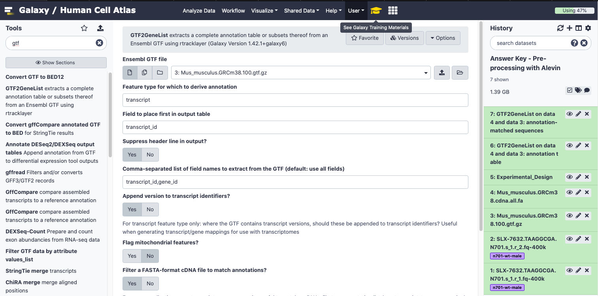
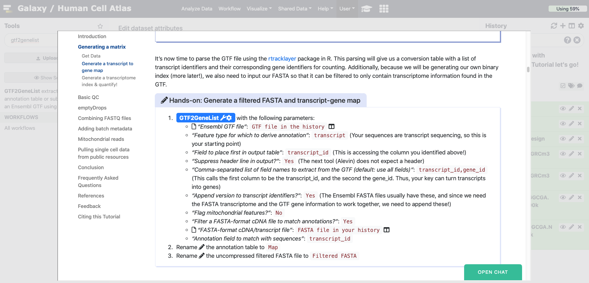
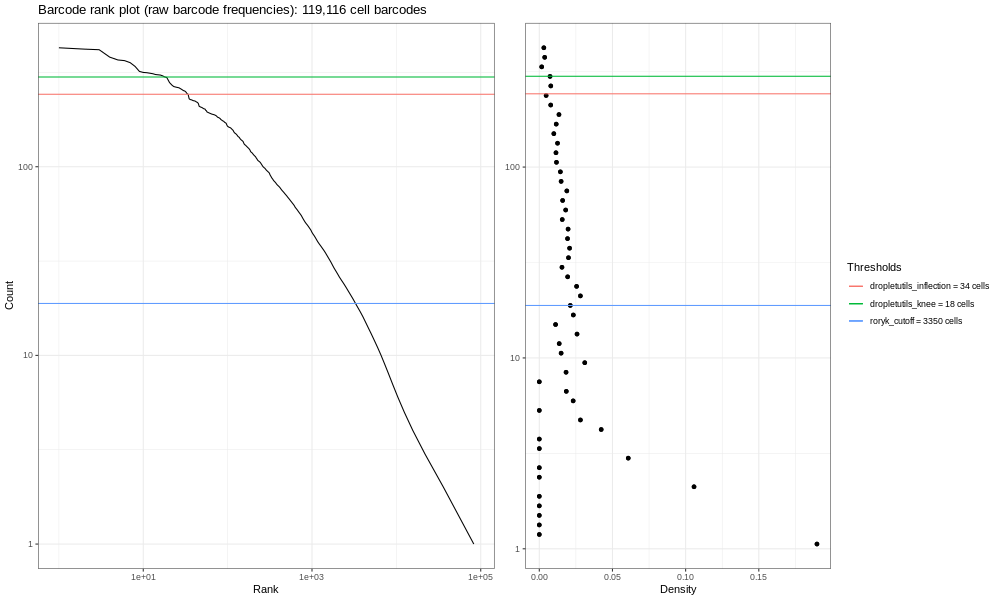
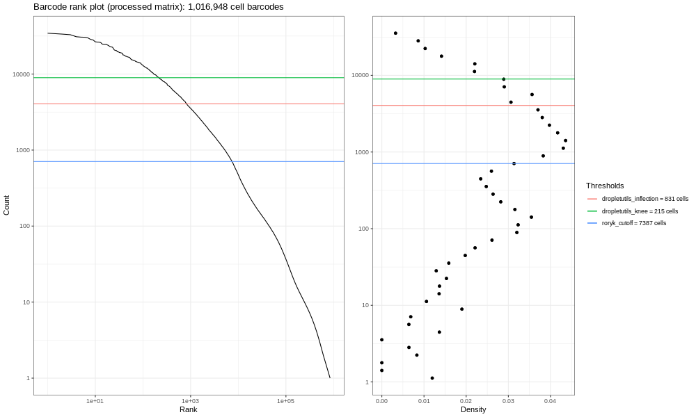
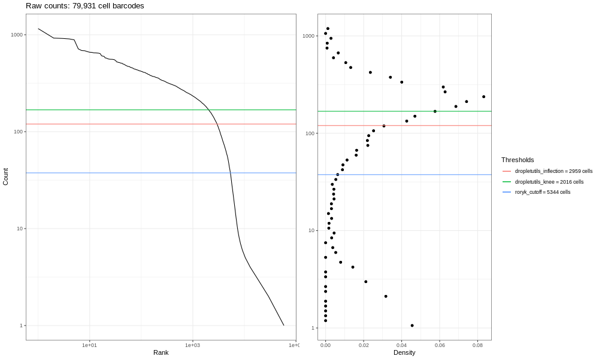
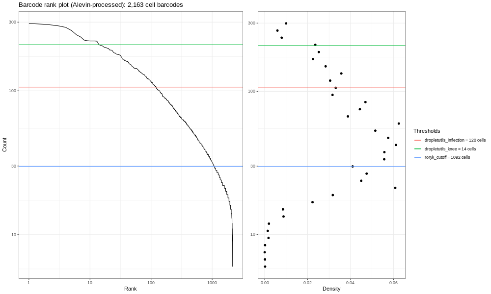
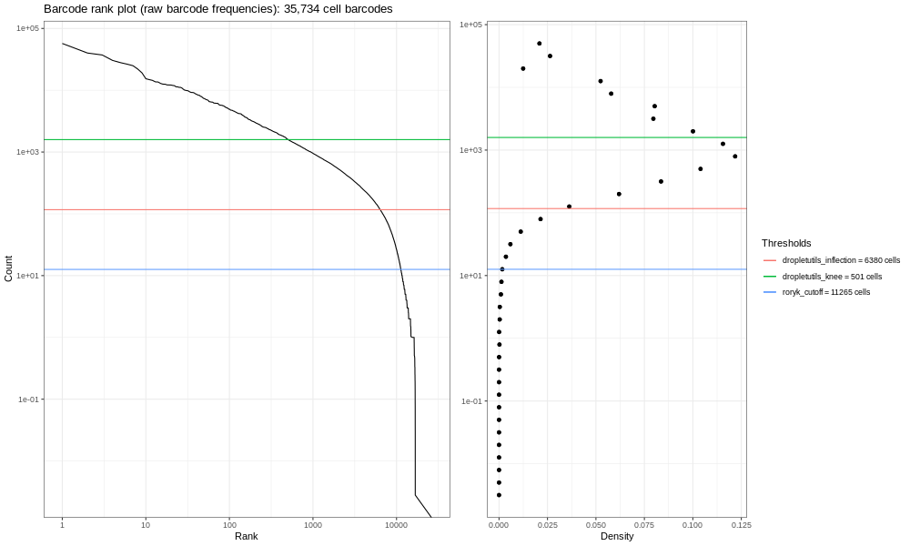
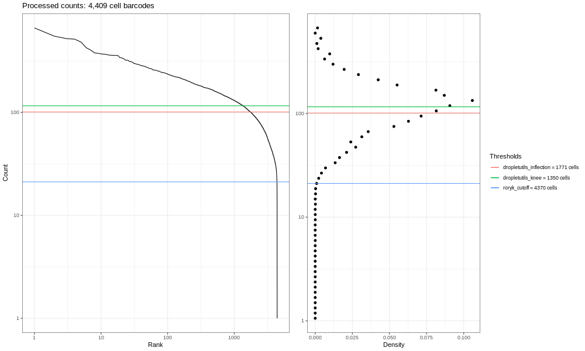
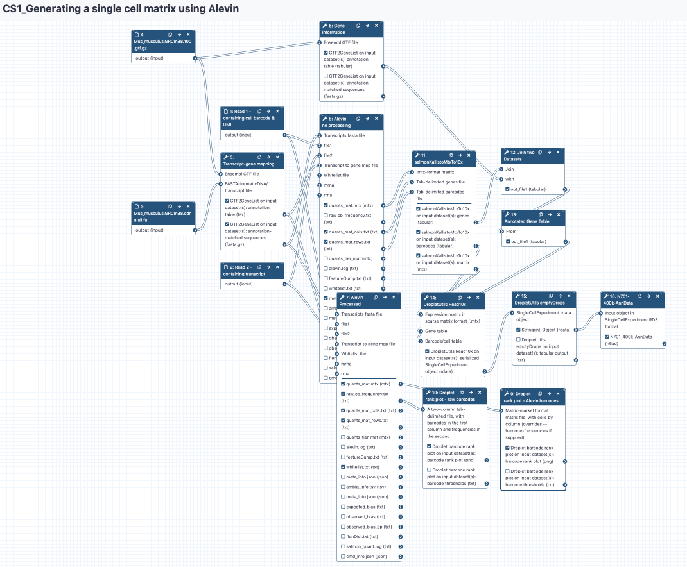
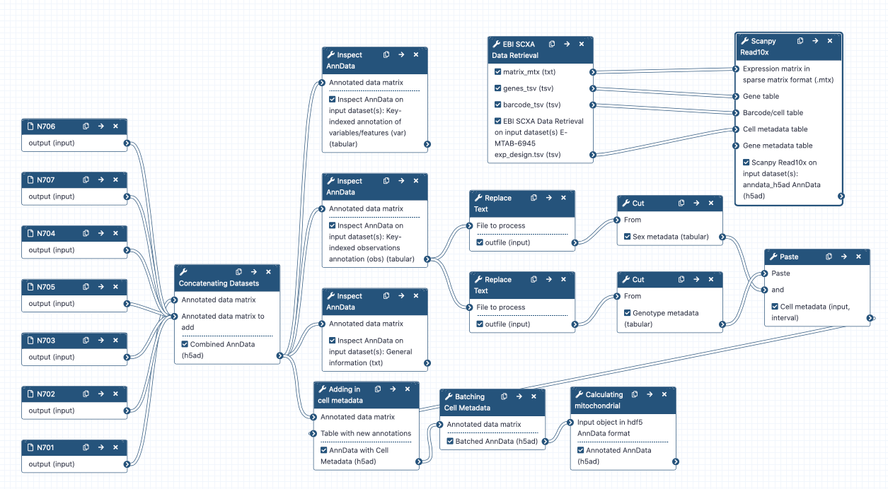

# Introduction

<!-- This is a comment. -->

Este tutorial te ayudará a pasar de datos crudos de secuenciación en archivos FASTQ a una matriz de datos en formato AnnData donde cada célula es una fila y cada gen es una columna. Pero, ¿Qué es una matriz de datos y cuál es el formato AnnData? Lo averiguaremos a su debido tiempo. Enfatizamos que este es el primer paso para procesar datos de secuenciación de células únicas para poder realizar su análisis.

De momento, en tus archivos de secuenciación tienes un montón de cadenas del tipo `ATGGGCTT`, etc. y lo que necesitas saber es cuántas células tienes y qué genes aparecen en ellas. En la segunda parte de este tutorial abordaremos la combinación de archivos FASTQ y el cómo añadir metadatos (por ejemplo, SEXO o GENOTIPO) para análisis posteriores. Estos son los pasos que requieren más recursos computacionales en los análisis de células únicas, ya que partimos de cientos de millones de lecturas, cada una de ellas con cuatro líneas de texto. Posteriormente, en el análisis, estos datos se convertirán en simples conteos de genes, por ejemplo ‘La célula A tiene 4 GAPDHs’ (‘Cell A has 4 GAPDHs’), que es mucho más sencillo de almacenar.

Debido a la enorme cantidad de datos, hemos reducido la resolución de los archivos FASTQ para poder acelerar el análisis. Una vez que hemos aclarado este punto, todavía tienes que mapear enormes cantidades de lecturas al inmenso genoma murino, así que ¡ve por una taza de café y prepárate para iniciar el análisis!


> <agenda-title></agenda-title>
>
> En este tutorial abordaremos:
>
> 1. TOC
> {:toc}
>
{: .agenda}

# Generar una matriz

En esta sección te mostraremos los principios de la fase inicial del análisis de Secuenciación de ARN de células únicas, que se basa en generar mediciones de expresión en una matriz. Por simplicidad, nos referiremos a este análisis por sus siglas en inglés scRNA-Seq (single-cell RNA-Seq). Nos concentramos en la metodología basada en goteo (en lugar de las metodologías basadas en placas), ya que es el proceso con más diferencias con respecto a los enfoques convencionales desarrollados para secuenciación de ARN general.

Los datos provenientes de metodologías de goteo están constituidos por tres componentes: códigos de barras, identificadores únicos moleculares (Unique molecular Identifier, o UMIs por sus siglas en inglés) y lecturas de ADN codificante (proveniente de ADN complementario o cDNA). Para poder generar cuantificaciones a nivel celula necesitaremos:


 * Procesar los códigos de barras, identificar cuáles corresponden a células ‘reales’, cuáles son meros artefactos, y posiblemente corregir códigos de barras que pudiesen ser producto de errores de secuenciación por medio de comparaciones con secuencias de mayor frecuencia.
 * Mapear secuencias biológicas a su genoma o transcriptoma de referencia.
 * Eliminar duplicados usando UMIs.

 Este solía ser un proceso complejo que involucraba múltiples algoritmos, o que se realizaba con métodos dedicados a tecnologías específicas (como la herramienta ‘Cellranger’ para 10X); pero ahora el proceso es más simple gracias al surgimiento de otros métodos. En el momento de seleccionar una metodología para tu proyecto podrías considerar las siguientes herramientas:


 * [STARsolo](https://github.com/alexdobin/STAR) - una variante del popular método de alineamiento de genoma ‘STAR’ que es específica para el análisis de datos de secuenciación de ARN de células únicas basados en técnicas de goteos (dscRNA-Seq). Produce resultados muy cercanos a los de Cellranger (que a su vez utiliza STAR en parte de sus procesos).
 * [Kallisto/ bustools](https://www.kallistobus.tools/) - desarrollado por los creadores del método de cuantificación de transcriptoma, Kallisto.
 * [Alevin](https://salmon.readthedocs.io/en/latest/alevin.html) - otro método de análisis de transcriptoma desarrollado por los autores de la herramienta ‘Salmon’.

Utilizaremos Alevin  con propósitos demostrativos, sin embargo no avalamos ningún método en particular.

> <comment-title>Comentario</comment-title>
> - Notas sobre la traducción y uso de términos técnicos
En este tutorial manejaremos algunos términos en el idioma original ya que simplificará la búsqueda posterior de información sobre el tema. Estas notas aparecerán en este tipo de recuadros y los términos estarán listados con la viñeta “•”.
> * scRNA-Seq,	secuenciación de ARN de células únicas
> * dscRNA-Sea, secuenciación de ARN de células únicas
> * basados en técnicas de goteos
> * RNA-Seq,	Secuenciación de ARN
> * UMIs,		Identificadores únicos moleculares
{: .comment}

## Obtener datos

Hemos puesto a tu disposición un conjunto de datos de muestra para que practiques con ellos. Estos datos son un subconjunto de lecturas de datos provenientes de ratones con restricción de crecimiento fetal  (ver [aquí](https://www.ebi.ac.uk/gxa/sc/experiments/E-MTAB-6945/results/tsne) el estudio de células únicas disponible en la base de datos ‘Expression Atlas’ y [aquí](https://www.ebi.ac.uk/arrayexpress/experiments/E-MTAB-6945/) la remisión del proyecto a la plataforma ArrayExpress).

Utilizamos la tecnología Drop-seq para este estudio. Sin embargo, el análisis que abordaremos en este tutorial es casi idéntico al que se realiza al utilizar la tecnología 10x. Estos datos no han sido curados meticulosamente, los datos del tutorial son algo caóticos ya que provienen de un experimento real. Necesitan filtrado urgentemente ya que contienen ARNs que le agregan ruido de fondo, sin embargo, te darán la oportunidad de practicar un análisis como si fuera el tuyo propio.

Puedes descargar las lecturas de muestra y su anotación asociada desde el repositorio Zenodo. También puedes importar [este historial de ejemplo](https://humancellatlas.usegalaxy.eu/u/wendi.bacon.training/h/input---pre-processing-with-alevin). ¿Cómo bajamos la resolución de estos archivos FASTQ? ¡Descubre aquí [la historia](https://humancellatlas.usegalaxy.eu/u/wendi.bacon.training/h/pre-processing-with-alevin---part-1---how-to-downsample) de cómo se llevó esto a cabo!
Adicionalmente, necesitarás un transcriptoma (en formato FASTA) contra el cual podrás mapear tus lecturas, así como la información génica de cada transcrito (en un archivo tipo GTF). Adicionalmente, estos archivos están disponibles en el historial anteriormente mencionado, al igual que en los enlaces de Zenodo mostrados en la parte inferior de este párrafo, así que puede que tarden un buen rato en importarse. Puedes acceder a [Ensembl si deseas bajar datos](https://www.ensembl.org/info/data/ftp/index.html) para tu especie de interés.

> <hands-on-title>Cargar datos - Parte 1</hands-on-title>
>
> 1. Crear un historial nuevo para este tutorial
> 2. Importar la tabla de diseño experimental, las lecturas de secuenciación 1 y 2, y los archivos GTF y fasta desde [Zenodo]({{ page.zenodo_link }})
>
>    ```
>    {{ page.zenodo_link }}/files/Experimental_Design.tabular
>    {{ page.zenodo_link }}/files/Mus_musculus.GRCm38.100.gtf.gff
>    {{ page.zenodo_link }}/files/Mus_musculus.GRCm38.cdna.all.fa.fasta
>    {{ page.zenodo_link }}/files/SLX-7632.TAAGGCGA.N701.s_1.r_1.fq-400k.fastq
>    {{ page.zenodo_link }}/files/SLX-7632.TAAGGCGA.N701.s_1.r_2.fq-400k.fastq
>    ```
>
>    
>
> 3. Cambiar el nombre  de los conjuntos de datos
>
{: .hands_on}

> <question-title>Preguntas</question-title>
>
> Dale un vistazo a los archivos que ahora están en tu historial.
> 1. ¿Cuál de los archivos FASTQ crees que contiene las secuencias de los códigos de barras?
> 2. Dada la metodología química que implica este estudio, ¿tienen las lecturas de códigos de barras/UMIs la longitud correcta?
> 3. ¿A que se refiere el término ‘N701’?
>
> > <solution-title>Soluciones</solution-title>
> >
> > 1. La lectura 1 (SLX-7632.TAAGGCGA.N701.s_1.r_1.fq-400k)  contiene el código de barras de la célula y el UMI ya que es significativamente más corta (¡solo 20pb!), en comparación con r_2 que es la lectura más larga de transcrito. Cambiaremos de nombre a estos archivos y los llamaremos N701-Read1 y N701-Read2 para hacer más claro el análisis.
> > 2. Puedes ver que la lectura 1 solo tiene 20pb de longitud, ya que el código de barras de Drop-Seq es de 12pb de longitud y el UMI de 8pb. ¡Esto es correcto! Pero ten precaución, la tecnología 10x Chromiun (y muchas otras) cambian sus reactivos (y longitudes de cebadores y adaptadores) con el paso del tiempo. En particular, ten esto en cuenta cuando accedas a datos públicos, verifica y asegurate de que estés utilizando los números correctos.
> > 3. El término ‘N701’ se refiere al índice de la lectura. Esta muestra se tomó junto con otras seis, cada una de ellas se denotó con un índice Nextera (N70X). Posteriormente, esto te proporcionará información del lote del que provienen. Observa el archivo ‘Diseno experimental’ (‘Experimental design’), notarás que la muestra N701 proviene del timo de neonato macho tipo normal (‘wild-type’).
> {: .solution}
{: .question}


## Generar un mapa de correspondencia de transcritos a genes

En el análisis de Secuenciación de ARN de células únicas tomamos por defecto la cuantificación a nivel génico, en lugar de a nivel transcrito. Esto significa que los niveles de expresión de una molécula de ARN con splicing alternativo son combinados con el propósito de generar valores a nivel génico. Las técnicas de scRNA-Seq basadas en goteo solo muestrean un extremo de cada transcrito, por tanto carecen de cobertura completa de moléculas, la cual es requerida para poder cuantificar con exactitud las diversas isoformas de los transcritos.

Para poder generar las cuantificaciones a nivel génico con base en la cuantificación de transcriptoma, la herramienta Alevin y otras similares requieren de la conversión entre identificadores de transcritos e identificadores de genes. Podemos derivar una conversión transcritos-genes a partir de anotaciones génicas disponibles en plataformas de recursos genómicos como Ensembl. Los transcritos en este tipo de listas necesitan coincidir con los que usaremos posteriormente para construir un índice binario de transcriptoma. Si estás utilizando controles tipo ‘spike-in’ necesitarás añadirlos al transcriptoma y al mapeo de transcritos a genes.

Notarás en tus datos de ejemplo que la anotación de referencia murina se obtuvo en formato GTF desde Ensembl. Esta anotación contiene genes, exones, transcritos y todo tipo de información adicional de las secuencias. Utilizaremos esta información para generar el mapeo de correspondencia transcrito/genes. Esto lo haremos por medio del traspaso de información a una herramienta que extrae exclusivamente los identificadores de transcrito que necesitamos.

> <comment-title>Comentario</comment-title>
> Nota sobre la traducción y uso de términos técnicos
>  * Spike-in,	transcrito de ARN de cantidad y secuencia conocida utilizado para calibrar mediciones en ensayos de hibridación de ARN. Nos referiremos a este control con su nombre en el idioma inglés ya que su traducción no es utilizada comúnmente.
{: .comment}

> <question-title>Preguntas</question-title>
>
> ¿Cuál de los ‘atributos’ en la última columna de los archivos GTF contiene los identificadores de transcrito y de gen?
>
>
>   > <tip-title>Una pequeña pista</tip-title>
>   >
>   > El archivo está organizado de tal modo que la última columna (con el nombre ‘Group’ en el encabezado) contiene una gran cantidad de información: attribute1 “información asociada con el atributo1”;attribute2 “información asociada con el atributo 2” etc.
>   {: .tip}
>
> > <solution-title>Solución</solution-title>
> > A gene_id y transcript_id les sigue “ensembl gene_id” y “ensembl transcript_id”
> {: .solution}
{: .question}

Ahora es el momento de analizar el archivo GTF utilizando el paquete de R [rtracklayer](https://bioconductor.org/packages/release/bioc/html/rtracklayer.html). Este análisis proporcionará una tabla de conversión con un listado de identificadores de transcritos y sus genes correspondientes para hacer conteos. Adicionalmente, ya que generaremos nuestro propio índice binario (más sobre esto en secciones posteriores), también necesitaremos proporcionar nuestro archivo FASTA para que pueda ser filtrado y que al final solo contenga la información del transcriptoma que está contenida en el archivo GTF.

> <hands-on-title>Generar un archivo FASTA filtrado y un mapa de correspondencia de transcritos a genes</hands-on-title>
>
> 1. Ejecutar la herramienta GTF2GeneList  utilizando los siguiente parámetros:
>    -  *"Ensembl GTF file"*: `GTF file in the history` 
>    - *"Feature type for which to derive annotation"*: `transcript` (Tus secuencias provienen de secuenciación de transcriptoma, por tanto este es tu punto inicial)
>    - *"Field to place first in output table"*: `transcript_id` (Esto da acceso a la columna que identificaste en la parte anterior)
>    - *"Suppress header line in output?"*: `Yes` (La siguiente herramienta (Alevin) no toma encabezados)
>    - *"Comma-separated list of field names to extract from the GTF (default: use all fields)"*: `transcript_id,gene_id` (Esto hace que la primera columna sea transpript_id, y la segunda sea gene_id. Por tanto, tu clave puede convertir transcritos a genes)
>    - *"Append version to transcript identifiers?"*: `Yes` (Por lo general el archivo FASTA de Ensembl contiene esta información, y ya que necesitaremos que el transcriptoma en formato FASTA y la información de genes del archivo GTF trabajen en conjunto, necesitaremos añadir la información de uno al final del otro)
>    - *"Flag mitochondrial features?"*: `No`
>    - *"Filter a FASTA-format cDNA file to match annotations?"*: `Yes`
>    -  *"FASTA-format cDNA/transcript file"*: `FASTA file in your history` 
>    - *"Annotation field to match with sequences"*: `transcript_id`
> 2. Cambiar el nombre  de la tabla de anotación a `Map`
>
> 3. Cambiar el nombre  del archivo FASTA filtrado - no comprimido a `Filtered FASTA`
{: .hands_on}

## Generar el índice de un transcriptoma y cuantificar

Alevin reduce a un solo proceso los pasos requeridos para realizar dscRNA-Seq. Dichas herramientas requieren comparar las secuencias de tu muestra a una referencia que contenga todas las secuencias probables de transcritos (un ‘transcriptoma). Esto contendrá las secuencias biológicas de los transcritos conocidos en una especie determinada, y quizás también contendrá secuencias técnicas como ‘spike ins’.

> <details-title>¿Cómo trabaja Alevin?</details-title>
>
> Alevin necesita convertir las secuencias de texto contenidas dentro del formato FASTA a algo con lo que pueda realizar búsquedas rápidamente dentro del transcriptoma, ese ‘algo’ es un archivo llamado ‘índice’ (‘index’). El índice es un archivo binario (un tipo de archivos optimizados para el uso de ordenadores y que no es legible ‘por humanos’), pero permite que Alevin realice búsquedas rápidas. El índice puede variar entre experimentos debido al tipo de secuencias técnicas y biológicas que necesitamos incluir en él, y ya que frecuentemente queremos utilizar las referencias más actualizadas, ya sea que provengan de Ensembl o NCBI, a menudo pudiésemos terminar reconstruyendo los índices. El generar estos índices requiere mucho tiempo. Échale un vistazo al archivo FASTA no comprimido para que veas cómo es la estructura inicial.
>
{: .details}

Ahora tenemos:

* Lecturas de códigos de barras/UMIs
* Lecturas de cDNA
* Mapeo de correspondencias de transcritos a genes
* Archivo FASTA filtrado

Ahora podemos ejecutar Alevin. Esta herramienta no aparecerá en las búsquedas dentro de algunas de las instancias públicas. Si esto sucede, haz click sobre la pestaña Single Cell en la parte izquierda de la pantalla y desplázate hacia abajo hasta encontrar la herramienta Alevin. Consejo: Si haces click sobre las herramientas (tools) dentro de la opción ‘tutorial’ de Galaxy siempre tendrás la versión correcta de la herramienta. En este caso: Galaxy Version 1.3.0+galaxy2 - debe ser la versión por defecto; si no lo es, haz click sobre ‘Versiones’ (‘Versions’) y escoge dicha versión.





> <hands-on-title>Practica: Ejecutando Alevin</hands-on-title>
>
> 1. 
>
>     > <question-title>Preguntas</question-title>
>     >
>     > Intenta dar valores a los parámetros de Alevin utilizando lo que sabes por el momento.
>     >
>     >   > <tip-title>Sobre la direccionalidad de las cadenas de RNA (Strandness)</tip-title>
>     >   >
>     >   > La documentación sobre ‘Tipos de bibliotecas de fragmentos’ (‘Fragment Library Types‘) de de la herramienta salmón, el ejecutar el comando de Alevin ([salmon.readthedocs.io/en/latest/library_type.html](https://salmon.readthedocs.io/en/latest/library_type.html]) y [salmon.readthedocs.io/en/latest/alevin.html](https://salmon.readthedocs.io/en/latest/alevin.html)) nos serán de ayuda en este caso; aunque ten en cuenta que la imagen ahí se dibuja con el ARN 5’ en la parte superior, mientras que en este protocolo de scRNA-Seq el segmento polyA es capturado por su extremo 3’, y, por lo tanto, efectivamente la hebra inferior o inversa.)
>     >   {: .tip}
>     >
>     >   > <solution-title>Solución: valores de los parámetros</solution-title>
>     >   >    - *"Select a reference transcriptome from your history or use a built-in index?"*: `Use one from the history`
>     >   >       - Vas a generar el índice binario utilizando tu archivo FASTA filtrado
>     >   >    -  *"Transcripts FASTA file"*: `Filtered FASTA`
>     >   >    - *"Single or paired-end reads?"*: `Paired-end`
>     >   >    -  *"file1"*: `N701-Read1`
>     >   >    -  *"file2"*: `N701-Read2`
>     >   >    - *"Relative orientation of reads within a pair"*: `Mates are oriented towards each other (IR)`
>     >   >    - *"Specify the strandedness of the reads"*: `read comes from the reverse strand (SR)`
>     >   >    - *"Protocol"*: `DropSeq Single Cell protocol`
>     >   >    -  *"Transcript to gene map file"*: `Map`
>     >   >    - *"Retrieve all output files"*: `Yes`
>      - In *"Optional commands"*:
>          - *"dumpFeatures"*: `Yes`
>          - *"dumpMTX"*: `Yes`
>     >   {: .solution}
>     {: .question}
{: .hands_on}

> <comment-title>Comentario</comment-title>
> Notas sobre la traducción de algunos de los valores de los parámetros:
En este tutorial manejaremos algunos términos en el idioma original ya que simplificará la búsqueda posterior de información sobre el tema. Estas notas aparecerán en estos recuadros y los términos estarán listados con la viñeta “•”.
> * “Select a reference transcriptome from your history or use a built-in index?”: Use one from the history
> - * “¿Seleccionar un transcriptoma de referencia desde tu historial o utilizar un índice pre-integrado?”: `Utilizar uno del historial`
> * “Transcripts FASTA file”: `Filtered FASTA`
> - * “Archivo FASTA de transcritos”: `FASTA filtrado`
> * “Single or paired-end reads?”: `Paired-end`
> - * “¿Lecturas single-end o paired-end?”: `Paired-end`
> * “Relative orientation of reads within a pair”: `Mates are oriented towards each other (IR)``
> - * “Orientación relativa de las lecturas dentro de un par”: `Las lecturas pares están orientadas unas hacia las otras (IR)``
> * “Specify the strandedness of the reads”: `read comes from the reverse strand (SR)``
> - * “Especificar la direccionalidad de las lecturas”: `las lecturas provienen de las cadenas inversas (SR)``
> * “Retrieve all output files”: `Yes`
> - * “Recobrar todos los archivos de salida”: `Sí``
{: .comment}

> <comment-title>¿Qué sucede si estoy procesando una muestra 10x??</comment-title>
>
> En Alevin, "Protocol" (Protocolo) es el parámetro principal que debe cambiarse para una muestra 10X Chromium. Simplemente selecciona los reactivos correspondientes a la química de 10x en lugar de Drop-seq.
{: .comment}

Esta herramienta tomará algo de tiempo para ejecutarse. Alevin produce muchos archivos de salida, no utilizaremos todos estos archivos. Puedes consultar la [documentación de Alevin](https://salmon.readthedocs.io/en/latest/alevin.html) si deseas saber más sobre estos archivos, sin embargo, los archivos que más nos interesan son:

* La matriz generada (quants_mat.mtx.gz - el conteo de genes y células)
* Los identificadores de fila `cell/ barcode` (quants_mat_rows.txt), y
* Las etiquetas en la columna `gene` (quants_mat_cols.txt).

Este es el formato “matrix market” (MTX).

> <question-title>Preguntas</question-title>
>
> Echa un vistazo a los diversos archivos generados después de ejecutar Alevin. ¿Puedes localizar las siguientes dos cosas?...
> 1. ¿Cuál es la tasa de mapeo?
> 2. ¿Cuántas células están presentes en la matriz de salida?
>
> > <solution-title>Solución</solution-title>
> >
> > 1. Inspecciona  el archivo  meta_info.json. Puedes ver que la tasa de mapeo es un insignificante `24.75%`. Esta tasa es terrible. ¿Por qué sucede esto? Recuerda que este archivo fue submuestreado, siendo específicos, solo tomamos las últimas 400,000 lecturas del archivo FASTQ. La tasa general de mapeo del archivo es de alrededor del 50%, que sigue siendo una tasa muy baja, pero en general se pueden esperar tasas de mapeos ligeramente menores para muestras que fueron procesadas durante los inicios de las técnicas Drop-Seq y la secuenciación de ARN de células únicas. Actualmente las muestras procesadas con la técnica 10x son mucho mejores. Después de todo, los datos que estamos utilizando son reales, no son datos de prueba.
> > 2. Inspecciona  el archivo  'quants_mat_rows.txt', y podrás ver que contiene `2163` líneas. Las filas hacen referencia a las células en la matriz de correspondencia de células a genes. Según esta estimación (aproximada), tu muestra contiene 2163 células.
> >
> {: .solution}
>
{: .question}

> <warning-title>¡Precaucion!: De aquí en adelante selecciona la entrada apropiada.</warning-title>
> Asegurate de usar el archivo **quants_mat.mtx.gz**, NO EL ARCHIVO *quants_tier.mtx.gz*.
{: .warning}

 Felicidades - ¡has generado una matriz de expresión! Podríamos terminar en este punto, pero es necesario verificar la calidad de los datos, y una de las cosas que podemos hacer es visualizar un gráfico de rangos de los códigos de barras.

# Control de calidad básico

La pregunta que buscamos contestar aquí es: “En su mayoría, ¿tenemos una sola célula por gota?”. Este es el principal objetivo, pero no es del todo sencillo obtener exactamente una sola célula por cada gota. En algunas ocasiones casi ninguna célula logra depositarse en las gotas, en otras ocasiones tenemos demasiadas células por gota. Cuando menos deberíamos poder distinguir fácilmente las gotas que contienen células de las que no las contienen.

> <hands-on-title>Generar un gráfico inicial de control de calidad (QC)</hands-on-title>
>
> 1.  Gráfico de rangos de códigos de barras obtenido por técnicas de goteo (Droplet barcode rank plot) con los siguientes parámetros:
>    - *"Input MTX-format matrix?"*: `No`
>    -  *"A two-column tab-delimited file, with barcodes in the first column and frequencies in the second"*: `raw_cb_frequencies.txt`
>    - *"Label to place in plot title"*: `Barcode rank plot (raw barcode frequencies)`
>
> 2. Cambiar el nombre  a la imagen de salida `Barcode Plot - raw barcode frequencies`
{: .hands_on}



La imagen aquí generada (4000k) no es muy informativa - pero ten en cuenta que tan solo estás manejando una fracción de las lecturas. Si procesas la muestra completa (que involucra los mismos pasos mencionados en la parte superior, pero que tardaría mucho más tiempo) obtendrás la imagen siguiente.



Esta es la formulación del gráfico de código de barras que basamos en una [discusión](https://github.com/COMBINE-lab/salmon/issues/362#issuecomment-490160480) que entablamos con miembros de la comunidad científica. Los gráficos de líneas suaves de la izquierda son los principales; estos gráficos muestran, clasificados de los más bajos a los más altos, los conteos de UMIs para códigos de barras individuales. Esperamos una fuerte caída entre las gotas que contienen células y las gotas vacías o que solo contienen restos celulares. Este no es un conjunto de datos ideal, así que en perspectiva, en un mundo ideal un conjunto de datos muy limpio proveniente de procesados 10x, los datos se asemejarían un poco más a la siguiente imagen del atlas de pulmón (ver [aquí](https://www.ebi.ac.uk/gxa/sc/experiments/E-MTAB-6653/results/tsne) el estudio del Atlas de Expresión de Células Únicas y la remisión del proyecto [aquí](https://www.ebi.ac.uk/arrayexpress/experiments/E-MTAB-6653/)).



En este gráfico puedes ver más claramente una flexión tipo “rodilla”, mostrando el corte entre las gotas vacías y las gotas que contienen células.

A la derecha encontramos los gráficos de densidad de la primera, y los umbrales generados ya sea utilizando [dropletUtils](https://bioconductor.org/packages/release/bioc/html/DropletUtils.html) o por medio del método descrito en la discusión que se mencionó con anterioridad (en la parte superior). Podremos utilizar cualquiera de estos umbrales para seleccionar células, asumiendo que cualquier medición con conteos menores es una célula válida. Alevin hace algo similar por defecto, y podemos aprender algo de esto graficando únicamente los códigos de barras que retiene Alevin.

> <hands-on-title>Obtener el gráfico de código de barras de Alevin</hands-on-title>
>
> 1.  Genera el gráfico de código de barras basado en goteos utilizando los siguientes parámetros:
>    - *"Input MTX-format matrix?"*: `Yes`
>    - *"Matrix-market format matrix file, with cells by column (overrides --barcode-frequencies if supplied)"*: `quants_mat.mtx`
>    - *"For use with --mtx-matrix: force interpretation of matrix to assume cells are by row, rather than by column (default)"*: `Yes`
>    - *"Label to place in plot title"*: `Barcode rank plot (Alevin-processed)`
>    - *"Number of bins used in barcode count frequency distribution"*: `50`
>    - *"Above-baseline multiplier to calculate roryk threshold"*: `1.5`
>
> 2. Cambiar el nombre  de la imagen de salida `Barcode Plot - Alevin processed barcodes`
{: .hands_on}



Y la muestra completa se ve como la siguiente figura:



Y concluyendo, he aquí el gráfico del atlas de pulmón.



Debes ver una caída casi vertical de la curva, que es donde Alevin truncó la distribución (después de haber excluido muchos códigos de barra celulares que tuvieron <10 UMI, Alevin posteriormente selecciona un umbral basándose en la curva y elimina los códigos de barras con menos UMIs)

Este método de 'detección intensa’ funciona relativamente bien en experimentos con características relativamente sencillas. Pero algunas poblaciones presentan dificultades (¡como en nuestra muestra!). Por ejemplo, si nos basamos únicamente en los conteos de códigos de barras, puede ocurrir que subpoblaciones de células pequeñas no se puedan distinguir de las gotas vacías. Algunas bibliotecas producen múltiples flexiones tipo “rodilla” para múltiples subpoblaciones. El método [emptyDrops](https://genomebiology.biomedcentral.com/articles/10.1186/s13059-019-1662-y) se ha convertido en una forma popular de lidiar con este problema. EmptyDrops retiene los códigos de barras con conteos altos, pero también añade los códigos de barras que pueden ser estadísticamente diferenciados de los perfiles ambientales, incluso si los conteos totales son similares. Para que podamos ejecutar emptyDrops (o cualquier herramienta de tu elección que logre aplicar umbrales biológicamente relevantes), primero necesitamos volver a ejecutar Alevin, pero previniendo que este aplique sus propios umbrales, ya que no son los óptimos.

Para poder utilizar emptyDrops de manera efectiva, necesitamos regresar y volver a ejecutar Alevin previniendo que aplique sus propios umbrales. Haz click sobre el icono de ‘volver a ejecutar’ en cualquier salida de Alevin dentro de tu historial ya que casi todos los parámetros son los mismos que antes, con la excepción de que necesitas cambiar los valores siguientes:


## Generar una matriz sin procesamiento en un formato utilizable

> <hands-on-title>Prevenir que Alevin utilice sus propios umbrales</hands-on-title>
> 1.  (Haz clic sobre la última salida de Alevin para volver a ejecutar)
>    - *"Optional commands"*
>    - *"keepCBFraction"*: '1' - por ejemplo conservarlos todos
>    - *"freqThreshold"*: '3' - Esto solo eliminará los códigos de barras celulares que tengan una frecuencia menor de 3, un criterio bajo de aceptación, pero es una forma útil de evitar procesar un monton de códigos de barras que es casi seguro que estan vacíos.
>
> 
{: .hands_on}

> <question-title>Pregunta</question-title>
>
> ¿Cuántas células hay ahora en la salida?
>
> > <solution-title>Solución</solution-title>
> >
> > 1. ¡Ahora hay `22539` células en quants_mat_rows! Muchas más que las `2163` que Alevin filtró. ¡Esto necesita ser filtrado en serio con emptyDrops!
> >
> {: .solution}
>
{: .question}

Alevin da salida a un formato MTX, el cual puede ser la entrada del paquete dropletUtils y procesarse en emptyDrops. Desafortunadamente la matriz tiene una orientación equivocada. La matriz no puede ser procesada por herramientas cuya entrada son archivos como los que produce el software 10X. Necesitamos ‘transformar’ la matriz de tal forma que las células esten en columnas y los genes en filas.

> <warning-title>¡Precaucion!</warning-title>
> ¡No mezcles los archivos de distintas ejecuciones de Alevin! Utiliza la última ejecución, la cual tiene los números más altos en el historial.
{: .warning}

> <hands-on-title>Transformación de la matriz</hands-on-title>
>
> 1.  con los siguientes parámetros:
>    -  *".mtx-format matrix"*: `quants_mat.mtx.gz` (la salida de la herramienta **Alevin** )
>    -  *"Tab-delimited genes file"*: `quants_mat_cols.txt` (la salida de la herramienta **Alevin** )
>    -  *"Tab-delimited barcodes file"*: `quants_mat_rows.txt` (la salida de la herramienta **Alevin** )
>
> 2. Cambiar el nombre  de 'salmonKallistoMtxTo10x....:genes' a `Gene table`
> 3. Cambiar el nombre  de 'salmonKallistoMtxTo10x....:barcodes' a `Barcode table`
> 4. Cambiar el nombre  de 'salmonKallistoMtxTo10x....:matrix' a `Matrix table`
{: .hands_on}

La salida es una matriz que contendrá la orientación correcta para poder ser utilizada por las herramientas en el análisis subsecuente. Sin embargo, nuestra matriz se ve un poco dispersa, por ejemplo, haz clic en `Gene table`. No se tú, pero a mí me costaría entablar una buena discusión biológica utilizando únicamente los gene_ids de Ensembl. Lo que en realidad me gustaría es tener información más ‘humanamente entendible’, como la del tipo ‘GAPDH’ o con otro tipo de acrónimos de genes; también me gustaría tener información sobre genes mitocondriales para poder evaluar si mis células están bajo algún tipo de estrés o no. Con el objetivo de preparar nuestros datos para meterlos a emptyDrops, vamos a combinar esta información y depositarla en un objeto; ahora es más sencillo añadir dicha información.

## Añadir metadatos de genes

> <question-title>Pregunta</question-title>
>
> ¿Dónde podemos encontrar esta información sobre los genes?
>
> > <solution-title>Solución</solution-title>
> >
> > Dentro de un archivo GTF, nuestro viejo amigo.
> >
> {: .solution}
>
{: .question}

> <question-title>Pregunta</question-title>
>
> ¿Cual de los ‘atributos’ dentro de la última columna del archivo contiene el acrónimo de los genes?
>
> > <solution-title>Solución</solution-title>
> >
> > gene_name
> >
> {: .solution}
>
{: .question}

Ahora vamos a volver a ejecutar la herramienta que extrae información contenida dentro de nuestro archivo GTF.

> <hands-on-title>Generar información de genes</hands-on-title>
>
> 1.  con los siguientes parámetros:
>    - *"Feature type for which to derive annotation"*: `gene`
>    - *"Field to place first in output table"*: `gene_id`
>    - *"Suppress header line in output?"*: `Yes`
>    - *"Comma-separated list of field names to extract from the GTF (default: use all fields)"*: `gene_id,gene_name,mito`
>    - *"Append version to transcript identifiers?"*: `Yes`
>    - *"Flag mitochondrial features?"*: `Yes` - nota, esto va a rellenar automáticamente campos con un montón de genes asociados a la mitocondria (que se encontraron en el archivo GTF). ¡Esto es bueno!
>    - *"Filter a FASTA-format cDNA file to match annotations?"*: `No` - - no lo necesitamos, ¡hemos terminado con nuestro archivo FASTA!
> 2. Verifica que el archivo de salida sea del tipo `tabular`. Si no lo es, cambia el tipo de archivo haciendo click sobre 'Editar atributos' que está en el historial del conjunto de datos (como si estuvieras cambiando el nombre al archivo). Después haz click sobre `Datatypes` y teclea `tabular`. Haz clic sobre `Change datatype`.)
> 2. Cambiar el nombre  de la tabla de anotación a `Gene Information`
{: .hands_on}

Inspecciona  el objeto **Gene Information** del historial. Ahora has incluido un nuevo campo para gene_id, esto incluye el nombre de los genes y una columna para información mitocondrial (false = not mitochondrial, true = mitochondrial). Necesitamos añadir esta información a la tabla de salida 'Gene table' proveniente de la herramienta salmonKallistoMtxto10x. Sin embargo, necesitamos mantener la tabla 'Gene table' en el mismo orden, ya que se hace referencia a ella en las filas de la tabla 'Matrix table'.

> <hands-on-title>Combinar la tabla de genes MTX con la información de los genes</hands-on-title>
>
> 1.  con los siguientes parámetros:
>    - *"Join"*: `Gene Table`
>    - *"Using column"*: `Column: 1`
>    - *"with"*: `Gene Information`
>    - *"and column"*: `Column: 1`
>    - *"Keep lines of first input that do not join with second input"*: `Yes`
>    - *"Keep lines of first input that are incomplete"*: `Yes`
>    - *"Fill empty columns"*: `No`
>    - *"Keep the header lines"*: `No`
>
>
>    Si inspeccionas  el objeto, verás que hemos unido estas tablas y que ahora tiene algunos pocos gene_id repetidos. Eliminemos estas repeticiones manteniendo a su vez el orden original de la tabla 'Gene Table'.
>
>
> 2.   con los siguientes parámetros:
>    - *"Cut columns"*: `c1,c4,c5`
>    - *"Delimited by"*: `Tab`
>    - *"From"*: la salida de la herramienta **Join two Datasets** 
>
> 3. Cambiar el nombre  de la salida a `Annotated Gene Table`
{: .hands_on}

Inspecciona  tu tabla `Annotated Gene Table`. ¡Esto es más parecido a lo que buscamos! Tenemos `gene_id`, `gene_name`, y `mito`. ¡Ahora regresemos a nuestro trayecto inicial con rumbo hacia emptyDrops y su forma sofisticada de utilizar umbrales para detectar gotas vacías!

# emptyDrops

La herramienta emptyDrops  trabaja con un tipo específico de objeto R llamado SingleCellExperiment. Necesitamos convertir nuestros archivos transformados MTX a este tipo de objetos, esto lo haremos utilizando la herramienta Read10x de DropletUtils:

> <hands-on-title>Convertir al formato SingleCellExperiment</hands-on-title>
>
> 1.  con los siguientes parámetros:
>    -  *"Expression matrix in sparse matrix format (.mtx)"*: `Matrix table`
>    -  *"Gene Table"*: `Annotated Gene Table`
>    -  *"Barcode/cell table"*: `Barcode table`
>    - *"Should metadata file be added?"*: `No`
>
> 2. Cambiar el nombre  de salida: `SCE Object`
{: .hands_on}

¡Fantástico! Ya hemos convertido la matriz en el objeto que ocupamos, siendo más específicos, la hemos convertido al formato SingleCellExperiment, ¡Ahora podemos ejecutar emptyDrops! Pero primero deshagámonos de esas gotas que no contienen células.

> <hands-on-title>emptyDrops</hands-on-title>
>
> 1.  con los siguientes parámetros:
>    -  *"SingleCellExperiment rdata object"*: `SCE Object`
>    - *"Should barcodes estimated to have no cells be removed from the output object?"*: `Yes`
>
> 2. Cambiar el nombre  de la salida de `serialised SingleCellExperiment` a `Stringent-Object`
>
> 3. Cambiar el nombre  de `tabular output` a `Stringent-Tabular Output`
{: .hands_on}

> <question-title>Pregunta</question-title>
>
> ¿Cuántos códigos de barras de células quedan después de procesar emptyDrops? ¿Por qué será esto?
>
>   > <tip-title>Pista</tip-title>
>   > Si haces clic sobre el `Stringent-Object` en el historial , el texto de la ventana dice `22 barcodes` o algo similar.  ¿Por qué es tan bajo?
>   > Toma en consideración, ¿Es este un conjunto de datos completo?
>   {: .tip}
>
>
> > <solution-title>Solución</solution-title>
> >
> > Recuerda que este conjunto de datos está submestreado. Si observas detenidamente los parámetros de emptyDrops, verás que la herramienta estableció un umbral mínimo de 100 UMI. Analizando los gráficos de códigos de barras mostrados en este tutorial, para la muestra de 400k lecturas, verás que este umbral es demasiado riguroso para la muestra submuestreada. Saliendo de dudas, este umbral mínimo daría como resultado `3011` códigos de barras para la muestra total.
> >
> {: .solution}
>
{: .question}

Ejecutemos de nuevo y cambiemos parámetros; volvamos a ejecutar la herramienta con un umbral mínimo más laxo.

> <details-title>¿Estás trabajando en equipo? ¡Hora de tomar decisiones!</details-title>
> Si estáis trabajando en equipo en este punto tenéis la oportunidad de tomar diversas rutas, la primera utilizando un control y el resto variando números para que podáis comparar resultados a lo largo de los tutoriales.
> - Variable: **UMI count lower bound**
> - Control:  `5`
> - Todos los demás: Tomad en consideración los gráficos de rangos de códigos de barras y seleccionad diversos límites inferiores.
{: .details}

> <hands-on-title>emptyDrops - ¡Intentemoslo de nuevo!</hands-on-title>
>
> 1.  con los siguiente parámetros:
>    -  *"SingleCellExperiment rdata object"*: `SCE Object`
>    - *"UMI count lower bound"*: `5` - aquí puedes usar diversos valores y ver que sucede
>    - *"Should barcodes estimated to have no cells be removed from the output object?"*: `Yes`
>
> 2. Cambiar el nombre  de la salida `serialised SingleCellExperiment` a `<pon tu número aquí>UMI-Object`
>
> 3. Cambiar el nombre  de la salida `tabular output` a `<pon tu número aquí>UMI-Tabular Output`
{: .hands_on}

¡En este punto debes tener `111` códigos de barras! Ahora tienes una matriz de expresión anotada y lista para los procesos y análisis subsecuentes, ¡Bien hecho! Sin embargo, en los siguientes tutoriales nos vincularemos al uso de una herramienta llamada Scanpy. Por tanto, necesitarás convertir este objeto SingleCellExperiment a un formato llamado `annData`, el cual es una variante de un archivo que utiliza un formato llamado `hdf5`.

> <hands-on-title>Conversión al formato AnnData</hands-on-title>
>
> 1.  con los siguientes parámetros:
>    - *"Direction of conversion"*: `SingleCellExperiment to AnnData`
>    -  *"Input object in SingleCellExperiment RDS format"*: `<pon tu número aquí>UMI-Object`
>    - *"Name of the assay to be transferred as main layer"*: `counts`
>
> 2. Cambiar el nombre  de la salida a `N701-400k-AnnData`
>
{: .hands_on}

 ¡Felicidades! Tu objeto está listo para el pipeline de Scanpy. Ahora puedes verificar tu trabajo comparándolo con el mostrado en este [historial de ejemplo](https://humancellatlas.usegalaxy.eu/u/wendi.bacon.training/h/pre-processing-with-alevin---part-1---answer-key).

Sin embargo, quizá quieras combinar este objeto con otros parecidos a él. Por ejemplo, es posible que hayas procesado 5 muestras, y que hayas empezado a partir de 10 archivos FASTQ...

# Combinar archivos FASTQ

Esta muestra es una de siete iniciales. Entonces, puedes utilizar un [flujo de trabajo](https://humancellatlas.usegalaxy.eu/u/wendi.bacon.training/w/pre-processing-with-alevin---part-1-imported-from-uploaded-file) para procesar los otros [12 archivos FASTQ submuestreados](https://humancellatlas.usegalaxy.eu/u/wendi.bacon.training/h/alevin-tutorial---all-samples---400k). Nota que, por desgracia, la muestra submuestreada N705 contiene mayormente lecturas chatarra; por tanto, emptyDrops no funciona. Debido a esto, yo la procesé con Alevin. Por supuesto, la muestra completa funciona bien con emptyDrops. Va a tomar un buen rato el procesado de todas estas muestras, así que mientras tanto ve por uno, o varios cafecitos… O aún mejor, [yo ya procesé las muestras](https://humancellatlas.usegalaxy.eu/u/wendi.bacon.training/h/pre-processing-with-alevin---part-2---input-generation), y las deposité en un [nuevo historial](https://humancellatlas.usegalaxy.eu/u/wendi.bacon.training/h/pre-processing-with-alevin---part-2---input) para que lo puedas importar y empezar con un historial limpio. Alternativamente, puedes obtener estos datos desde el repositorio Zenodo.

## Datos

> <hands-on-title>Cargar datos - Combinar archivos</hands-on-title>
>
> 1. Crear un historial huevo para este tutorial (si es que no estás importando el historial mencionado en la parte superior)
> 2. Importar los diversos archivos AnnData y la tabla de diseño experimental
 desde [Zenodo](https://zenodo.org/record/4574153#.YD56YS-l2uU)
>
>    ```
>    {{ page.zenodo_link }}/files/Experimental_Design.tabular
>    {{ page.zenodo_link }}/files/N701-400k-AnnData.h5ad
>    {{ page.zenodo_link }}/files/N702-400k-AnnData.h5ad
>    {{ page.zenodo_link }}/files/N703-400k-AnnData.h5ad
>    {{ page.zenodo_link }}/files/N704-400k-AnnData.h5ad
>    {{ page.zenodo_link }}/files/N705-400k-AnnData.h5ad
>    {{ page.zenodo_link }}/files/N706-400k-AnnData.h5ad
>    {{ page.zenodo_link }}/files/N707-400k-AnnData.h5ad
>    ```
>
>    
>
> 3. Cambiar de nombre al conjunto de datos
> 4. Verifica que el tipo de datos sea `h5ad` de lo contrario ¡Necesitarás cambiar cada tipo de datos al formato `h5ad`!
>
>    
>
{: .hands_on}

Inspecciona  el archivo de texto `Experimental Design`. Este muestra cómo cada `N70X`  corresponde a una muestra, y si dicha muestra proviene de un macho o hembra. Estos serán metadatos importantes para agregar a nuestra muestra, los cuales añadiremos de forma similar a la forma en que añadiste los metadatos `gene_name` y `mito` en secciones anteriores.

## Concatenación de objetos
> <hands-on-title>Concatenación de objetos AnnData</hands-on-title>
>
> 1.  con los siguientes parámetros:
>    -  *"Annotated data matrix"*: `N701-400k-AnnData`
>    - *"Function to manipulate the object"*: 'Concatenate along the observations axis'
>    -  *"Annotated data matrix to add"*: 'Select all the other matrix files from bottom to top'
>    - *"Join method"*: `Intersection of variables`
>    - *"Key to add the batch annotation to obs"*: `batch`
>    - *"Separator to join the existing index names with the batch category"*: `-`
{: .hands_on}

¡Demos un vistazo a lo que hemos hecho! Desafortunadamente, los objetos AnnData son bastante complicados, así que aquí el icono del ojo  no nos será de mucha ayuda. En lugar de esto, de aquí en adelante vamos a utilizar una herramienta para visualizar nuestro objeto.

> <hands-on-title>Inspección de objetos AnnData</hands-on-title>
>
> 1.  con los siguiente parámetros:
>    -  *"Annotated data matrix"*: la salida de la herramienta **Manipulate AnnData** 
>    - *"What to inspect?"*: `General information about the object`
> 2.   con los siguiente parámetros:
>    -  *"Annotated data matrix"*: la salida de la herramienta **Manipulate AnnData** 
>    - *"What to inspect?"*: `Key-indexed observations annotation (obs)`
> 3.   con los siguiente parámetros:
>    -  *"Annotated data matrix"*: la salida de la herramienta **Manipulate AnnData** 
>    - *"What to inspect?"*: `Key-indexed annotation of variables/features (var)`
{: .hands_on}

Ya hemos visualizado las tres salidas de  **Inspect AnnData**.

> <question-title>Preguntas</question-title>
>
> 1. ¿Cuántas células tienes ahora?
> 2. ¿Dónde está almacenada la información del lote (`batch`)?
>
> > <solution-title>Soluciones</solution-title>
> >
> > 1. Si verificas la salida **General information** , podrás ver que ahora tienes `4079 células`, ya que la matriz ahora tiene 4079 células y 35,734 genes. También puedes observar esto en los tamaños de los archivos **obs**  (células) and **var**  (genes).
> > 2. En la anotación de observaciones indexadas por clave **Key-indexed observations annotation (obs)**. Las diferentes versiones de la herramienta ‘Manipulate’ colocarán las columnas del lote (`batch`) en diferentes ubicaciones. La versión de la herramienta utilizada en este curso asigna a la novena columna (`9`) en la posición de más a la derecha, la cual determina el ‘lote’ (`batch`). Lote (batch) se refiere al orden en que se agregaron las matrices. Los archivos se agregan desde la parte inferior del historial hacia arriba, ¡Así que ten cuidado en cómo configuras tus historiales al ejecutar esto!
> {: .solution}
>
{: .question}

# Añadir el lote de metadatos (batch metadata)

Configura el historial de ejemplo con los índices más antiguos en la parte inferior.


Por tanto, cuando se concatenan, el lote (`batch`) aparece de la siguiente manera:

| Index | Batch | Genotype | Sex |
|------ |--------------------|
| N701 | 0    | wildtype    | male    |
| N702 | 1    | knockout   | male    |
| N703 | 2    | knockout   | female    |
| N704 | 3    | wildtype    | male    |
| N705 | 4    | wildtype    | male    |
| N706 | 5    | wildtype    | male    |
| N707 | 6    | knockout    | male    |

Puede ser que los índices no se hayan importado en orden si utilizaste Zenodo para importar tus archivos (por ejemplo, N701 a N707, ascendentes). En ese caso necesitarás manipular de forma apropiada los parámetros de las siguientes herramientas para etiquetar tus lotes correctamente.

Los dos metadatos más críticos en este experimento son `sex` y `genotype`. Posteriormente, vamos a colorear nuestros gráficos de células según los valores de estos parámetros, así que vamos a añadirlos ya.

> <hands-on-title>Etiquetas de sexo</hands-on-title>
>
> 1.  con los siguientes parámetros:
>    -  *"File to process"*: la salida de la herramienta **Inspect AnnData: Key-indexed observations annotation (obs)** )
>    - *"1. Replacement"*
>
>         - *"in column"*: `Column: 9` - or whichever column `batch` is in
>         - *"Find pattern"*: `0|1|3|4|5|6`
>         - *"Replace with"*: `male`
>    - **+ Insert Replacement**
>    - *"2. Replacement"*
>
>         - *"in column"*: `Column: 9`
>         - *"Find pattern"*: `2`
>         - *"Replace with"*: `female`
>    - **+ Insert Replacement**
>    - *"3. Replacement"*
>
>         - *"in column"*: `Column: 9`
>         - *"Find pattern"*: `batch`
>         - *"Replace with"*: `sex`
>
>    Ahora queremos únicamente la columna que contiene la información de sexo -  al final agregaremos esto en la anotación celular del objeto AnnData
>
> 2.  con los siguientes parámetros:
>    - *"Cut columns"*: `c9`
>    - *"Delimited by"*: `Tab`
>    -  *"From"*: la salida de la herramienta **Replace text** 
>
> 3. Cambiar el nombre  de la salida a `Sex metadata`
{: .hands_on}

Estuvo divertido, ahora hagámoslo de nuevo pero para el genotipo.

> <hands-on-title>Etiquetas de genotipo</hands-on-title>
>
> 1.  con los siguientes parámetros:
>    -  *"File to process"*: la salida de la herramienta **Inspect AnnData: Key-indexed observations annotation (obs)** 
>    - *"1. Replacement"*
>
>         - *"in column"*: `Column: 9`
>         - *"Find pattern"*: `0|3|4|5`
>         - *"Replace with"*: `wildtype`
>    - **+ Insert Replacement**
>    - *"2. Replacement"*
>
>         - *"in column"*: `Column: 9`
>         - *"Find pattern"*: `1|2|6`
>         - *"Replace with"*: `knockout`
>    - **+ Insert Replacement**
>    - *"3. Replacement"*
>
>         - *"in column"*: `Column: 9`
>         - *"Find pattern"*: `batch`
>         - *"Replace with"*: `genotype`
>
>    Ahora queremos únicamente la columna que contiene la información de genotipo -  al final agregaremos esto en la anotación celular del objeto AnnData.
>
> 2.  con los siguientes parámetros:
>    - *"Cut columns"*: `c9`
>    - *"Delimited by"*: `Tab`
>    -  *"From"*: la salida de la herramienta **Replace text** 
>
> 3. Cambiar el nombre  de la salida a `Genotype metadata`
{: .hands_on}

Es posible que desees hacer esto con distintos tipos de metadatos - qué laboratorios manejaron las muestras, en qué día se procesaron, etc. Una vez que hayas agregado todas tus columnas de metadatos, podemos entonces adherirlas unas a otras antes de conectarlas al objeto AnnData.

> <hands-on-title>Combinar las columnas de metadatos</hands-on-title>
>
> 1.  con los siguientes parámetros:
>    -  *"Paste"*: `Genotype metadata`
>    -  *"and"*: `Sex metadata`
>    - *"Delimit by"*: `Tab`
> 2. Cambiar el nombre  de la salida a `Cell Metadata`
{: .hands_on}

¡Agrégalo al objeto AnnData!

> <hands-on-title>Añadir los metadatos al objeto AnnData</hands-on-title>
>
> 1.  con los siguientes parámetros:
>    -  *"Annotated data matrix"*: la salida de la herramienta **Manipulate AnnData** 
>    - *"Function to manipulate the object"*: `Add new annotation(s) for observations or variables`
>    - *"What to annotate?"*: `Observations (obs)``
>    -  *"Table with new annotations"*: `Cell Metadata`
{: .hands_on}

¡Perfecto! Ahora puedes ejecutar **Inspect AnnData** para verificación, pero primero limpiemos un poco más este objeto. Sería mucho mejor si "lote" (`batch`) significara algo, en lugar de "el orden en el que la herramienta ‘Manipulate AnnData’ agregó mis conjuntos de datos".

> <hands-on-title> Etiquetado de lotes</hands-on-title>
>
> 1.  con los siguientes parámetros:
>    -  *"Annotated data matrix"*: la salida de la herramienta **Manipulate AnnData - Add new annotations** 
>    - *"Function to manipulate the object"*: `Rename categories of annotation`
>    - *"Key for observations or variables annotation"*: `batch`
>    - *"Comma-separated list of new categories"*: `N701,N702,N703,N704,N705,N706,N707`
{: .hands_on}

¡Ya casi llegamos a donde queremos! Sin embargo, mientras que nos hemos enfocado en los metadatos de nuestras células (muestra, lote, genotipo, etc.) para etiquetar las ‘observaciones’ en nuestro objeto...

# Lecturas mitocondriales

¿Recuerdas cuando mencionamos mitocondrias en los inicios de este tutorial? Y en muestras de células únicas, ¿Cómo de frecuente el ARN mitocondrial es un indicador de estrés durante la disociación? Probablemente deberíamos hacer algo con nuestra columna de verdadero/falso (true/false) en la anotación de genes, la cual nos provee información sobre las células. Ya sea que hayas combinado los archivos FASTQ o que estés analizando solo un archivo necesitarás hacer esto (saltándose así las secciones 4 y 5).

> <hands-on-title>Calculando el ARN mitocondrial en las células</hands-on-title>
>
> 1.  con los siguientes parámetros:
>    -  *"Input object in hdf5 AnnData format"*: la salida de la herramienta **Manipulate AnnData - Rename categories** 
>    - *"Format of output object"*: `AnnData format`
>    - *"Copy AnnData to .raw"*: `No`
>    - *"Gene symbols field in AnnData"*: `NA.`
>    - *"Flag genes that start with these names"*: `Insert Flag genes that start with these names`
>    - *"Starts with"*: `True`
>    - *"Var name"*: `mito`
>    - *"Number of top genes"*: `50`
{: .hands_on}

 ¡Bien hecho! Te sugiero encarecidamente que juegues un poco e inspecciones tu objeto **Inspect AnnData**  final preprocesado de AnnData (`Pre-processed object`) para que puedas ver la gran cantidad de información que ha sido agregada. ¡Ya está todo listo para continuar con el filtrado! Sin embargo, hay un truco que puede ahorrarte tiempo en el futuro...

# Extraer datos de secuenciación de ARN de células únicas desde bases de datos públicas

Si te interesa analizar datos de acceso público, particularmente del [Single Cell Expression Atlas](https://www.ebi.ac.uk/gxa/sc/home), quizá te interese la herramienta , la cual más bien reduce estos pasos en uno. [Aquí](https://www.ebi.ac.uk/gxa/sc/experiments/E-MTAB-6945/downloads)  puedes encontrar el conjunto de datos para este tutorial, el cual tiene el número de identificación de experimento `E-MTAB-6945`.

> <hands-on-title>Obtener datos de el Atlas de Expresión de Células Únicas</hands-on-title>
>
> 1.  con los siguientes parámetros:
>      - *"SC-Atlas experiment accession"*: `E-MTAB-6945`
>      - *"Choose the type of matrix to download"*: `Raw filtered counts`
>
>    Ahora necesitamos transformar estos datos en un objeto tipo AnnData
>
> 2.  con los siguientes parámetros:
>    - *"Expression matrix in sparse matrix format (.mtx)"*: `EBI SCXA Data Retrieval on E-MTAB-6945 matrix.mtx (Raw filtered counts)`
>    - *"Gene table"*:  `EBI SCXA Data Retrieval on E-MTAB-6945 genes.tsv (Raw filtered counts)`
>    - *"Barcode/cell table"*: `EBI SCXA Data Retrieval on E-MTAB-6945 barcodes.tsv (Raw filtered counts)`
>    - *"Cell metadata table"*: `EBI SCXA Data Retrieval on E-MTAB-6945 exp_design.tsv`
{: .hands_on}

Es importante tener en cuenta que esta matriz es procesada de cierto modo por medio del pipeline SCXA, que es muy similar a este tutorial, y que contiene todos y cada uno de los metadatos proporcionados por su pipeline, así como sus autores (por ejemplo, más anotaciones celulares o de genes).

# Conclusion





¡Has llegado al final de esta sesión! Quizá te interese echarle un vistazo a un [ejemplo de un historial](https://humancellatlas.usegalaxy.eu/u/wendi.bacon.training/h/pre-processing-with-alevin---part-2---answer-key-1) y a la [Parte 2 del flujo de trabajo](https://humancellatlas.usegalaxy.eu/u/wendi.bacon.training/w/pre-processing-with-alevin---part-2). Nota que según la forma en que ejecutes el flujo de trabajo este requerirá que cambies la columna (`column`) que contiene el lote de metadatos. [Aquí](https://humancellatlas.usegalaxy.eu/u/wendi.bacon.training/h/pre-processing-with-alevin---part-2---total-anndata-example) puedes encontrar el objeto final que contiene todas las lecturas.

Hemos:

* Tomado lecturas crudas, anotaciones y los archivos de entrada necesarios para cuantificación.
* Ejecutado Alevin con dos distintas configuraciones de parámetros, ambas permitiendo que la herramienta tome sus propias decisiones sobre qué es lo que constituyen las gotas vacías y, hemos aplicado emptyDrops en su lugar.
* Desplegado gráficos de rangos de códigos de barras para valorar de manera rápida las señales presentes en los conjuntos de datos generados por técnicas de goteo.
* Aplicado las conversiones necesarias para pasar estos datos a los procesos subsecuentes.
* Obtenido datos con análisis parciales desde el Single Cell Expression Atlas.

¡Únete a nuestro canal de Gitter de secuenciación de ARN de células únicas para tomar parte en discusiones con científicos con ideas afines a las tuyas! [](https://gitter.im/Galaxy-Training-Network/galaxy-single-cell?utm_source=badge&utm_medium=badge&utm_campaign=pr-badge)
