# Introduction


You've done all the work to make a single cell matrix, with gene counts and mitochondrial counts and buckets of cell metadata from all your variables of interest. Now it's time to fully process our data, to remove low quality cells, to reduce the many dimensions of data that make it difficult to work with, and ultimately to try to define our clusters and to find our biological meaning and insights! There are many packages for analysing single cell data - Seurat , Scanpy , Monocle , Scater , and so forth. We're working with Scanpy, because currently Galaxy hosts the most Scanpy tools of all of those options.

> <comment-title>Tutorials everywhere?</comment-title>
> This tutorial is similar to another fantastic tutorial: [Clustering 3k PBMC](). That tutorial will go into much further depth on the analysis, in particular the visualisation and science behind identifying marker genes. Their experimental data is clean and well annotated, which illustrates the steps beautifully. Here, we work more as a case study with messier data, to help empower you in making choices during the analysis. We highly recommend you work through all the galaxy single cell tutorials to build confidence and expertise! For trainers, note that there are small-group options in this tutorial.
{: .comment}

> <agenda-title></agenda-title>
>
> In this tutorial, we will cover:
>
> 1. TOC
> {:toc}
>
{: .agenda}

## Get data

We've provided you with experimental data to analyse from a mouse dataset of fetal growth restriction . This is the full dataset generated from [this tutorial]() if you used the full FASTQ files rather than the subsampled ones (see the [study in Single Cell Expression Atlas](https://www.ebi.ac.uk/gxa/sc/experiments/E-MTAB-6945/results/tsne) and the [project submission](https://www.ebi.ac.uk/arrayexpress/experiments/E-MTAB-6945/)). You can find this dataset in this [input history](https://usegalaxy.eu/u/wendi.bacon.training/h/cs3-answerkey) or download from Zenodo below.

You can access the data for this tutorial in multiple ways:

1. **Your own history** - If you're feeling confident that you successfully ran a workflow on all 7 samples from the previous tutorial, and that your resulting 7 AnnData objects look right (you can compare with the [answer key history](https://usegalaxy.eu/u/wendi.bacon.training/h/cs2combining-datasets-after-pre-processing---input-1)), then you can use those! To avoid a million-line history, I recommend dragging the resultant datasets into a fresh history

   

2. **Importing from a history** - You can import [this history](https://usegalaxy.eu/u/wendi.bacon.training/h/cs3-answerkey)

   

3. **Uploading from Zenodo** (see below)

> <hands-on-title>Option 3: Uploading from Zenodo</hands-on-title>
>
> 1. Create a new history for this tutorial
> 2. Import the AnnData object from [Zenodo]({{ page.zenodo_link }})
>
>    ```
>    {{ page.zenodo_link }}/files/Mito-counted_AnnData
>    ```
>
>    
>
> 3. **Rename**  the datasets `Mito-counted AnnData`
> 4. Check that the datatype is `h5ad`
>
>    
>
{: .hands_on}

# Important tips for easier analysis



> <comment-title></comment-title>
> - The Galaxy tool search panel sometimes doesn't find the tools we need from the thousands available.
> - You'll have a much easier time selecting tools from the panel (if you aren't using tutorial mode!) if you are on the [https://humancellatlas.usegalaxy.eu](https://humancellatlas.usegalaxy.eu)
{: .comment}

# Filtering

You have generated an annotated AnnData object from your raw scRNA-seq fastq files. However, you have only completed a 'rough' filter of your dataset - there will still be a number of 'cells' that are actually just background from empty droplets or simply low-quality. There will also be genes that could be sequencing artifacts or that appear with such low frequency that statistical tools will fail to analyse them. This background garbage of both cells and genes not only makes it harder to distinguish real biological information from the noise, but also makes it computationally heavy to analyse. These spurious reads take a lot of computational power to analyse! First on our agenda is to filter this matrix to give us cleaner data to extract meaningful insight from, and to allow faster analysis.



> <question-title></question-title>
>
> 1. What information is stored in your AnnData object? The last tool to generate this object counted the mitochondrial associated genes in your matrix. Where is that data stored?
> 2. While you are figuring that out, how many genes and cells are in your object?
>
>   > <tip-title>Hint</tip-title>
>   > You want to use the same tool you used in the previous tutorial to examine your AnnData, since it's not necessarily as simple as examining the Anndata dataset in the history!
>   >
>   >   > <hands-on-title>Inspecting AnnData Objects</hands-on-title>
>   >   >
>   >   > 1.  with the following parameters:
>   >   >    -  *"Annotated data matrix"*: `Mito-counted AnnData`
>   >   >    - *"What to inspect?"*: `General information about the object`
>   >   > 2.  with the following parameters:
>   >   >    -  *"Annotated data matrix"*: `Mito-counted AnnData`
>   >   >    - *"What to inspect?"*: `Key-indexed observations annotation (obs)`
>   >   > 3.  with the following parameters:
>   >   >    -  *"Annotated data matrix"*: `Mito-counted AnnData`
>   >   >    - *"What to inspect?"*: `Key-indexed annotation of variables/features (var)`
>   >   {: .hands_on}
>   {: .tip}
> > <solution-title></solution-title>
> >
> > 1. If you examine your AnnData object, you'll find a number of different quality control metrics for both cells  **obs** and  genes **var**.
> >   - For instance, you can see a `n_cells` under **var**, which counts the number of cells that gene appears in.
> >   - In the **obs**, you have both discrete and log-based metrics for `n_genes`, how many genes are counted in a cell, and `n_counts`, how many UMIs are counted per cell. So, for instance, you might count multiple GAPDHs in a cell. Your `n_counts` should thus be higher than `n_genes`.
> >   - But what about the mitochondria?? Within the cells information **obs**, the `total_counts_mito`,  `log1p_total_counts_mito`, and `pct_counts_mito` has been calculated for each cell.
> > 2. You can see in the  **General information about the object** output that the matrix is `31178 x 35734`. This is `obs x vars`, or rather, `cells x genes`, so there are `31178 cells` and `35734 genes` in the matrix.
> >
> {: .solution}
>
{: .question}

 **Top time-saving advice** - turn the 3 **Inspect AnnData** outputs above into a workflow for quick access!



## Generate QC Plots

We want to filter our cells, but first we need to know what our data looks like. There are a number of subjective choices to make within scRNA-seq analysis, for instance we now need to make our best informed decisions about where to set our thresholds (more on that soon!). We're going to plot our data a few different ways. Different bioinformaticians might prefer to see the data in different ways, and here we are only generating some of the myriad of plots you can use. Ultimately you need to go with what makes the most sense to you.

 **Top time-saving advice** - turn the following QC plots into a workflow so you can re-run it easily throughout analysing your own data!.

### Creating the plots

> <hands-on-title>Making QC plots</hands-on-title>
>
> 1.  with the following parameters:
>    -  *"Annotated data matrix"*: `Mito-counted AnnData`
>    - *"Method used for plotting"*: `Generic: Violin plot, using 'pl.violin'`
>        - *"Keys for accessing variables"*: `Subset of variables in 'adata.var_names' or fields of '.obs'`
>            - *"Keys for accessing variables"*: `log1p_total_counts,log1p_n_genes_by_counts,pct_counts_mito`
>        - *"The key of the observation grouping to consider"*: `genotype`
>
> 2. **Rename**  output `Violin - genotype - log`
>
> 3.  with the following parameters:
>    -  *"Annotated data matrix"*: `Mito-counted AnnData`
>    - *"Method used for plotting"*: `Generic: Violin plot, using 'pl.violin'`
>        - *"Keys for accessing variables"*: `Subset of variables in 'adata.var_names' or fields of '.obs'`
>            - *"Keys for accessing variables"*: `log1p_total_counts,log1p_n_genes_by_counts,pct_counts_mito`
>        - *"The key of the observation grouping to consider"*: `sex`
>
> 4. **Rename**  output `Violin - sex - log`
>
> 5.  with the following parameters:
>    -  *"Annotated data matrix"*: `Mito-counted AnnData`
>    - *"Method used for plotting"*: `Generic: Violin plot, using 'pl.violin'`
>        - *"Keys for accessing variables"*: `Subset of variables in 'adata.var_names' or fields of '.obs'`
>            - *"Keys for accessing variables"*: `log1p_total_counts,log1p_n_genes_by_counts,pct_counts_mito`
>        - *"The key of the observation grouping to consider"*: `batch`
>
> 6. **Rename**  output `Violin - batch - log`
>
> 7.  with the following parameters:
>    -  *"Annotated data matrix"*: `Mito-counted AnnData`
>    - *"Method used for plotting"*: `Generic: Scatter plot along observations or variables axes, using 'pl.scatter'`
>        - *"Plotting tool that computed coordinates"*: `Using coordinates`
>            - *"x coordinate"*: `log1p_total_counts`
>            - *"y coordinate"*: `pct_counts_mito`
>
> 6. **Rename**  output `Scatter - mito x UMIs`
>
> 7.  with the following parameters:
>    -  *"Annotated data matrix"*: `Mito-counted AnnData`
>    - *"Method used for plotting"*: `Generic: Scatter plot along observations or variables axes, using 'pl.scatter'`
>        - *"Plotting tool that computed coordinates"*: `Using coordinates`
>            - *"x coordinate"*: `log1p_n_genes_by_counts`
>            - *"y coordinate"*: `pct_counts_mito`
>
> 8. **Rename**  output `Scatter - mito x genes`
>
> 9.  with the following parameters:
>    -  *"Annotated data matrix"*: `Mito-counted AnnData`
>    - *"Method used for plotting"*: `Generic: Scatter plot along observations or variables axes, using 'pl.scatter'`
>        - *"Plotting tool that computed coordinates"*: `Using coordinates`
>            - *"x coordinate"*: `log1p_total_counts`
>            - *"y coordinate"*: `log1p_n_genes_by_counts`
>            - *"Color by"*: `pct_counts_mito`
>
> 10. **Rename**  output `Scatter - genes x UMIs`
>
{: .hands_on}

## Analysing the plots

That's a lot of information! Let's attack this in sections and see what questions these plots can help us answer. The *scratchbook*  may help here to look at the different plots at the same time!



> <question-title>Batch Variation</question-title>
>
> Are there differences in sequencing depth across the samples?
> 1. Which plot(s) addresses this?
> 2. How do you interpret it?
>
> > <solution-title></solution-title>
> >
> > 1. The plot `violin - batch - log` will have what you're looking for!
> >     ")
> > 2. Keeping in mind that this is a log scale - which means that small differences can mean large differences - the violin plots probably look pretty similar.
> >    - `N703` and `N707` might be a bit lower on genes and counts (or UMIs), but the differences aren't catastrophic.
> >    - The `pct_counts_mito` looks pretty similar across the batches, so this also looks good.
> >    - Nothing here would cause us to eliminate a sample from our analysis, but if you see a sample looking completely different from the rest, you would need to question why that is and consider eliminating it from your experiment!
> >
> {: .solution}
>
{: .question}

> <question-title>Biological Variables</question-title>
>
> Are there differences in sequencing depth across sex? Genotype?
> 1. Which plot(s) addresses this?
> 2. How do you interpret the `sex` differences?
> 3. How do you interpret the `genotype` differences?
>
> > <solution-title></solution-title>
> >
> > 1. Similar to above, the plots `violin - sex - log` and `violin - genotype - log` will have what you're looking for!
> >      ")
> >      ")
> > 2. There isn’t a major difference in sequencing depth across sex, I would say - though you are welcome to disagree!
> >    - It is clear there are far fewer female cells, which makes sense given that only one sample was female. *Note - that was an unfortunate discovery made long after generating libraries. It's quite hard to identify the sex of a neonate in the lab! In practice, try hard to not let such a confounding factor into your data! You could consider re-running all the following analysis without that female sample, if you wish.*
> > 3. In `Violin - genotype - log`, however, we can see there is a difference. The `knockout` samples clearly have fewer genes and counts. From an experimental point of view, we can consider, does this make sense?
> >    - Would we biologically expect that those cells would be smaller or having fewer transcripts? Possibly, in this case, given that these cells were generated by growth restricted neonatal mice, and in which case we don’t need to worry about our good data, but rather keep this in mind when generating clusters, as we don’t want depth to define clusters, we want biology to!
> >    - On the other hand, it may be that those cells didn’t survive dissociation as well as the healthy ones (in which case we’d expect higher mitochondrial-associated genes, which we don’t see, so we can rule that out!).
> >    - Maybe we unluckily poorly prepared libraries for specifically those knockout samples. There are only three, so maybe those samples are under-sequenced.
> >    - So what do we do about all of this?
> >        - Ideally, we consider re-sequencing all the samples but with a higher concentration of the knockout samples in the library. Any bioinformatician will tell you that the best way to get clean data is in the lab, not the computer! Sadly, absolute best practice isn’t necessarily always a realistic option in the lab - for instance, that mouse line was long gone! - so sometimes, we have to make the best of it. There are options to try and address such discrepancy in sequencing depth. Thus, we’re going to take these samples forward and see if we can find biological insight despite the technical differences.
> >
> {: .solution}
>
{: .question}

Now that we've assessed the differences in our samples, we will look at the libraries overall to identify appropriate thresholds for our analysis.

> <question-title>Filter Thresholds</question-title>
>
> What threshold should you set for `log1p_n_genes_by_counts`?
> 1. Which plot(s) addresses this?
> 2. What number would you pick?
>
> > <solution-title></solution-title>
> >
> > 1. Any plot with `log1p_n_genes_by_counts` would do here, actually! Some people prefer scatterplots to violins.
> > ")
> >
> > 2. In `Scatter - mito x genes` you can see how cells with `log1p_n_genes_by_counts` up to around, perhaps, `5.7` (around 300 genes) often have high `pct_counts_mito`.
> >   - You can plot this as just `n_counts` and see this same trend at around 300 genes, but with this data the log format is clearer so that's how we're presenting it.
> >   - You could also use the violin plots to come up with the threshold, and thus also take batch into account. It's good to look at the violins as well, because you don't want to accidentally cut out an entire sample (i.e. N703 and N707).
> >   - Some bioinformaticians would recommend filtering each sample individually, but this is difficult in larger scale and in this case (you're welcome to give it a go! You'd have to filter separately and then concatenate), it won't make a notable difference in the final interpretation.
> >
> {: .solution}
>
> What threshold should you set for `log1p_total_counts`?
> 1. Which plot(s) addresses this?
> 2. What number would you pick?
>
> > <solution-title></solution-title>
> >
> > 1. As before, any plot with `log1p_total_counts` will do! Again, we'll use a scatterplot here, but you can use a violin plot if you wish!
> > ")
> >
> > 2. We can see that we will need to set a higher threshold (which makes sense, as you'd expect more UMI's per cell rather than unique genes!). Again, perhaps being a bit aggressive in our threshold, we might choose `6.3`, for instance (which amounts to around 500 counts/cell).
> >   - In an ideal world, you'll see a clear population of real cells separated from a clear population of debris. Many samples, like this one, are under-sequenced, and such separation would likely be seen after deeper sequencing!
> >
> {: .solution}
>
> What threshold should you set for `pct_counts_mito`?
> 1. Which plot(s) addresses this?
> 2. What number would you pick?
>
> > <solution-title></solution-title>
> >
> > 1. Any plot with `pct_counts_mito` would do here, however the scatterplots are likely the easiest to interpret. We'll use the same as last time.
> > ")
> >
> > 2. We can see a clear trend wherein cells that have around 5% mito counts or higher also have far fewer total counts. These cells are low quality, will muddy our data, and are likely stressed or ruptured prior to encapsulation in a droplet. While 5% is quite a common cut-off, this is quite messy data, so just for kicks we'll go more aggressive with a `4.5%`.
> >    - In general, you must adapt all cut-offs to your data - metabolically active cells might have higher mitochondrial RNA in general, and you don't want to lose a cell population because of a cut-off.
> >
> {: .solution}
{: .question}

## Apply the thresholds

It's now time to apply these thresholds to our data! First, a reminder of how many cells and genes are in your object: `31178 cells` and `35734 genes`. Let's see how that changes each time!

> <details-title>Working in a group? Decision-time!</details-title>
> If you are working in a group, you can now divide up a decision here with one *control* and the rest varied numbers so that you can compare results throughout the tutorials.
> - Control
>      - **log1p_n_genes_by_counts** > `5.7`
>      - **log1p_total_counts** > `6.3`
>      - **pct_counts_mito** < `4.5%`
> - Everyone else: Choose your own thresholds and compare results!
{: .details}

> <hands-on-title>Filter cells by log1p_n_genes_by_counts</hands-on-title>
>
> 1.  with the following parameters:
>    -  *"Input object in AnnData/Loom format"*: `Mito-counted AnnData`
>    - In *"Parameters to select cells to keep"*:
>        -  *"Insert Parameters to select cells to keep"*
>            - *"Name of parameter to filter on"*: `log1p_n_genes_by_counts`
>            - *"Min value"*: `5.7`
>            - *"Max value"*: `20.0`
>
> 2. **Rename**  output as `Genes-filtered Object`
>
> 3.  with the following parameters:
>    -  *"Annotated data matrix"*: `Genes-filtered Object`
>    - *"Method used for plotting"*: `Generic: Violin plot, using 'pl.violin'`
>        - *"Keys for accessing variables"*: `Subset of variables in 'adata.var_names' or fields of '.obs'`
>            - *"Keys for accessing variables"*: `log1p_total_counts,log1p_n_genes_by_counts,pct_counts_mito`
>        - *"The key of the observation grouping to consider"*: `genotype`
>
> 4. **Rename**  output `Violin - Filterbygenes`
>
> 5.  with the following parameters:
>    -  *"Annotated data matrix"*: `Genes-filtered Object`
>    - *"What to inspect?"*: `General information about the object`
>
> 6. **Rename**  output `General - Filterbygenes`
{: .hands_on}

Note that the  **Scanpy Filtercells** allows you to put  multiple parameters at the same time (i.e. filter `log1p_total_counts`, `log1p_n_genes_by_counts`,and `pct_counts_mito`) in the same step. The only reason we aren't doing that here is so you can see what each filter accomplishes. As such, examine your plot and general information.

> <question-title></question-title>
>
> 1. Interpret the violin plot
> 2. How many genes & cells do you have in your object now?
>
> > <solution-title></solution-title>
> >
> > 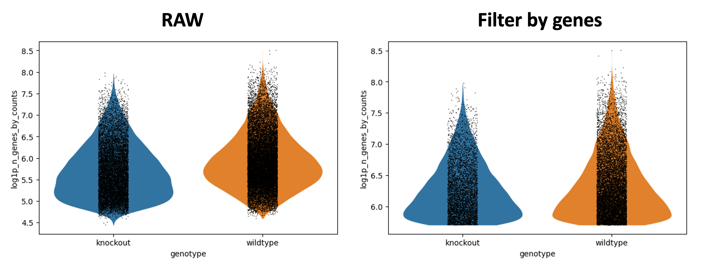
> > 1. The only part that seems to change is the `log1p_n_genes_by_counts`.  You can see a flatter bottom to the violin plot - this is the lower threshold set. Ideally, this would create a beautiful violin plot because there would be a clear population of low-gene number cells. Sadly not the case here, but still a reasonable filter.
> > 2. In `General - Filterbygenes`, you can see you now have `17,040 cells x 35,734 genes`.
> >
> {: .solution}
>
{: .question}

> <hands-on-title>Filter cells by log1p_total_counts</hands-on-title>
>
> 1.  with the following parameters:
>    -  *"Input object in AnnData/Loom format"*: `Genes-filtered Object`
>    - In *"Parameters to select cells to keep"*:
>        -  *"Insert Parameters to select cells to keep"*
>            - *"Name of parameter to filter on"*: `log1p_total_counts`
>            - *"Min value"*: `6.3`
>            - *"Max value"*: `20.0`
>
> 2. **Rename**  output as `Counts-filtered Object`
>
> 3.  with the following parameters:
>    -  *"Annotated data matrix"*: `Counts-filtered Object`
>    - *"Method used for plotting"*: `Generic: Violin plot, using 'pl.violin'`
>        - *"Keys for accessing variables"*: `Subset of variables in 'adata.var_names' or fields of '.obs'`
>            - *"Keys for accessing variables"*: `log1p_total_counts,log1p_n_genes_by_counts,pct_counts_mito`
>        - *"The key of the observation grouping to consider"*: `genotype`
>
> 4. **Rename**  output `Violin - Filterbycounts`
>
> 5.  with the following parameters:
>    -  *"Annotated data matrix"*: `Counts-filtered Object`
>    - *"What to inspect?"*: `General information about the object`
>
> 6. **Rename**  output `General - Filterbycounts`
{: .hands_on}

> <question-title></question-title>
>
> 1. Interpret the violin plot
> 2. How many genes & cells do you have in your object now?
>
> > <solution-title></solution-title>
> >
> > 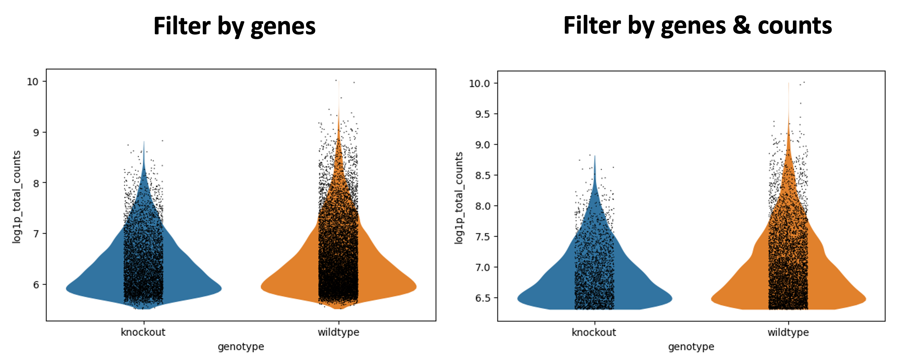
> > 1. We will focus on the `log1p_total_counts` as that shows the biggest change. Similar to above, the bottom of the violin shape has flattered due to the threshold.
> > 2. In `General - Filterbycounts`, you can see you now have `8,678 cells x 35,734 genes`.
> >
> {: .solution}
>
{: .question}

> <hands-on-title>Filter cells by pct_counts_mito</hands-on-title>
>
> 1.  with the following parameters:
>    -  *"Input object in AnnData/Loom format"*: `Counts-filtered Object`
>    - In *"Parameters to select cells to keep"*:
>        -  *"Insert Parameters to select cells to keep"*
>            - *"Name of parameter to filter on"*: `pct_counts_mito`
>            - *"Min value"*: `0`
>            - *"Max value"*: `4.5`
>
> 2. **Rename**  output as `Mito-filtered Object`
>
> 3.  with the following parameters:
>    -  *"Annotated data matrix"*: `Mito-filtered Object`
>    - *"Method used for plotting"*: `Generic: Violin plot, using 'pl.violin'`
>        - *"Keys for accessing variables"*: `Subset of variables in 'adata.var_names' or fields of '.obs'`
>            - *"Keys for accessing variables"*: `log1p_total_counts,log1p_n_genes_by_counts,pct_counts_mito`
>        - *"The key of the observation grouping to consider"*: `genotype`
>        - In *"Violin plot attributes"*:
>            - *"Add a stripplot on top of the violin plot"*: `Yes`
>                - *"Add a jitter to the stripplot"*: `Yes`
>            - *"Display keys in multiple panels"*: `No`
>
> 4. **Rename**  output `Violin - Filterbymito`
>
> 5.  with the following parameters:
>    -  *"Annotated data matrix"*: `Mito-filtered Object`
>    - *"What to inspect?"*: `General information about the object`
>
> 6. **Rename**  output `General - Filterbymito`
{: .hands_on}

> <question-title></question-title>
>
> 1. Interpret the violin plot
> 2. How many genes & cells do you have in your object now?
>
> > <solution-title></solution-title>
> >
> > 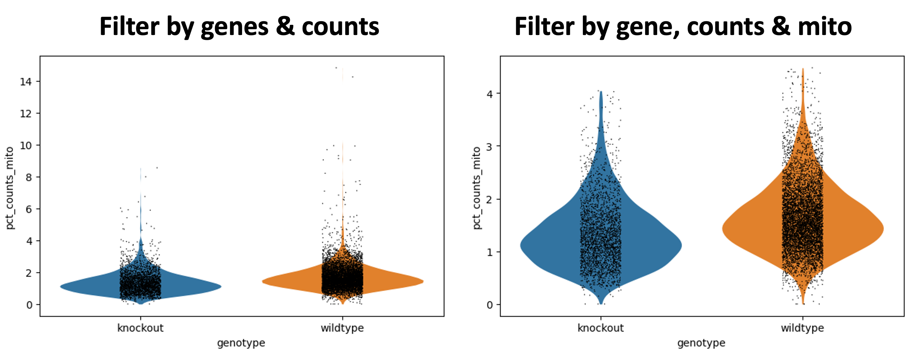
> > 1. If we carefully check the axes, we can see that the `pct_counts_mito` has shrunk.
> > 2. In `General - Filterbymito`, you can see you now have `8,605 cells x 35,734 genes`.
> >
> {: .solution}
>
{: .question}

Here's a quick overall summary for easy visualisation if you fancy it.
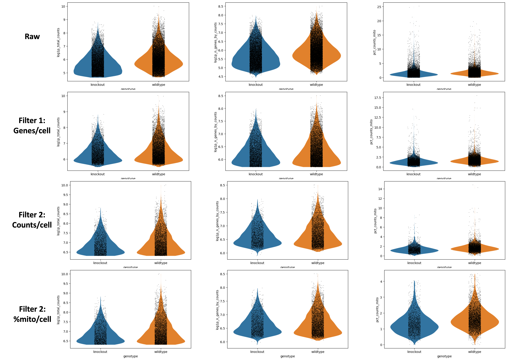

Fantastic work! However, you've now removed a whole heap of cells, and since the captured genes are sporadic (i.e. a small percentage of the overall transcriptome per cell) this means there are a number of genes in your matrix that are currently not in any of the remaining cells. Genes that do not appear in any cell, or even in only 1 or 2 cells, will make some analytical tools break and overall will not be biologically informative. So let's remove them! Note that `3` is not necessarily the best number, rather it is a fairly conservative threshold. You could go as high as 10 or more.

> <details-title>Working in a group? Decision-time!</details-title>
> If you are working in a group, you can now divide up a decision here with one *control* and the rest varied numbers so that you can compare results throughout the tutorials.
> - Variable: **n_cells**
> - Control > `3`
> - Everyone else: Choose your own thresholds and compare results! Note if you go less than 3 (or even remove this step entirely), future tools are likely to fail due to empty gene data.
{: .details}


> <hands-on-title>Filter genes</hands-on-title>
>
> 1.  with the following parameters:
>    -  *"Input object in AnnData/Loom format"*: `Mito-filtered Object`
>    - In *"Parameters to select genes to keep"*:
>        -  *"Insert Parameters to select genes to keep"*
>            - *"Name of parameter to filter on"*: `n_cells`
>            - *"Min value"*: `3`
>            - *"Max value"*: `1000000000`
>
> 2. **Rename**  output as `Filtered Object`
>
> 3.  with the following parameters:
>    -  *"Annotated data matrix"*: `Filtered Object`
>    - *"What to inspect?"*: `General information about the object`
>
> 4. **Rename**  output `General - Filtered object`
{: .hands_on}

In practice, you'll likely choose your thresholds then set up all these filters to run without checking plots in between each one. But it's nice to see how they work!

Using the final `General - Filtered object`, we can summarise the results of our filtering:

|       | Cells | Genes |
|------ |--------------------|
| Raw | 31178    | 35734    |
| Filter genes/cell | 17040    | 35734    |
| Filter counts/cell | 8678    | 35734    |
| Filter mito/cell | 8605   | 35734    |
| Filter cells/gene | 8605    | 15395    |

 Congratulations! You have filtered your object! Now it should be a lot easier to analyse.

# Processing

So currently, you have a matrix that is 8605 cells by 15395 genes. This is still quite big data. We have two issues here - firstly, you already know there are differences in how many transcripts and genes have been counted per cell. This technical variable can obscure biological differences. Secondly, we like to plot things on x/y plots, so for instance *Gapdh* could be on one axis, and *Actin* can be on another, and you plot cells on that 2-dimensional axis based on how many of each transcript they possess. While that would be fine, adding in a 3rd dimension (or, indeed, in this case, 15393 more dimensions), is a bit trickier! So our next steps are to transform our big data object into something that is easy to analyse and easy to visualise.

> <hands-on-title>Normalisation</hands-on-title>
>
> 1.  with the following parameters:
>    -  *"Input object in AnnData/Loom format"*: `Filtered Object`
{: .hands_on}

Normalisation helps reduce the differences between gene and UMI counts by fitting total counts to 10,000 per cell. The inherent log-transform (by log(count+1)) aligns the gene expression level better with a normal distribution. This is fairly standard to prepare for any future dimensionality reduction.

Now we need to look at reducing our gene dimensions. We have loads of genes, but not all of them are different from cell to cell. For instance, housekeeping genes are defined as not changing much from cell to cell, so we could remove these from our data to simplify the dataset. We will flag genes that vary across the cells for future analysis.

> <hands-on-title>Find variable genes</hands-on-title>
>
> 1.  with the following parameters:
>    -  *"Input object in AnnData/Loom format"*: `output_h5ad` (output of **Scanpy NormaliseData** )
>    - *"Flavor of computing normalised dispersion"*: `Seurat`
>    - *"Number of top variable genes to keep, mandatory if flavor='seurat_v3'"*: `` (remove the automated 2000 here and leave the space blank)
>
> 2. **Rename**  plot output `Use_me_FVG`
{: .hands_on}

Next up, we're going to scale our data so that all genes have the same variance and a zero mean. This is important to set up our data for further dimensionality reduction. It also helps negate sequencing depth differences between samples, since the gene levels across the cells become comparable. Note, that the differences from scaling etc. are not the values you have at the end - i.e. if your cell has average GAPDH levels, it will not appear as a '0' when you calculate gene differences between clusters.

> <hands-on-title>Scaling data</hands-on-title>
>
> 1.  with the following parameters:
>    -  *"Input object in AnnData/Loom format"*: `Use_me_FVG` (output of **Scanpy FindVariableGenes** )
>    - *"Truncate to this value after scaling"*: `10.0`
> 2. **Rename**  plot output `Use_me_Scaled`
{: .hands_on}

 Congratulations! You have processed your object!

# Preparing coordinates

We still have too many dimensions. Transcript changes are not usually singular - which is to say, genes were in pathways and in groups. It would be easier to analyse our data if we could more easily group these changes.

## Principal components
Principal components are calculated from highly dimensional data to find the most spread in the dataset. So in our, `3248` highly variable gene dimensions, there will be one line (axis) that yields the most spread and variation across the cells. That will be our first principal component. We can calculate the first `x` principal components in our data to drastically reduce the number of dimensions.

> <comment-title>3248???</comment-title>
> Where did the `3248` come from? The quickest way to figure out how many highly variable genes you have, in my opinion, is to re-run  the **Scanpy FindVariableGenes** tool and select the parameter to *Remove genes not marked as highly variable*. Then you can Inspect your resulting object and you'll see only 3248 genes. The following processing steps will use only the highly variable genes for their calculations, but I strongly suggest you keep even the nonvariable genes in (i.e., use the original output of your FindVariableGenes tool with way more than 3248 genes!), as a general rule. This tutorial will not work at the end plotting stage if you only take forward the 3248 or 2000 (if you set a limit on it) highly variable genes.
{: .comment}

> <warning-title>Check your AnnData object!</warning>
> Your AnnData object should have far more than 3248 genes in it (if you followed our settings and tool versions, you'd have a matrix 8605 × 15395 (cells x genes). Make sure to use that AnnData object output from FindVariableGenes, rather than the 3248 or 2000 output from your testing in the section above labelled '3248'.
{: .warning}

> <hands-on-title>Calculate Principal Components</hands-on-title>
>
> 1.  with the following parameters:
>    -  *"Input object in AnnData/Loom format"*: `Use_me_Scaled` (output of **Scanpy ScaleData** )
>    - *"Number of PCs to produce"*: `50`
>
> 2.   with the following parameters:
>    -  *"Annotated data matrix"*: `output_h5ad` (output of **Scanpy RunPCA** )
>    - *"Method used for plotting"*: `PCA: Scatter plot in PCA coordinates, using 'pl.pca_variance_ratio'`
>        - *"Number of PCs to show"*: `50`
>
> 3. **Rename**  plot output `PCA Variance`
{: .hands_on}

Why 50 principal components you ask? Well, we're pretty confident 50 is an over-estimate. Examine `PCA Variance`.

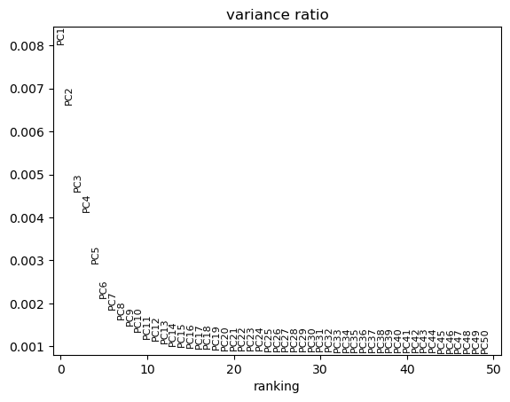

We can see that there is really not much variation explained past component 19. So we might save ourselves a great deal of time and muddied data by focusing on the top `20` PCs.

## Neighborhood graph

We're still looking at around 20 dimensions at this point. We need to identify how similar a cell is to another cell, across every cell across these dimensions. For this, we will use the k-nearest neighbor (kNN) graph, to identify which cells are close together and which are not. The kNN graph plots connections between cells if their distance (when plotted in this 20 dimensional space!) is amonst the k-th smallest distances from that cell to other cells. This will be crucial for identifying clusters, and is necessary for plotting a UMAP. From [UMAP developers](https://github.com/lmcinnes/umap): "Larger neighbor values will result in more global structure being preserved at the loss of detailed local structure. In general this parameter should often be in the range 5 to 50, with a choice of 10 to 15 being a sensible default".

> <details-title>Working in a group? Decision-time!</details-title>
> If you are working in a group, you can now divide up a decision here with one *control* and the rest varied numbers so that you can compare results throughout the tutorials.
> - Control
>      - **Number of PCs to use** = `20`
>      - **Maximum number of neighbours used** = `15`
> - Everyone else: Use the PC variance plot to pick your own PC number, and choose your own neighbour maximum as well!b
{: .details}

> <hands-on-title>ComputeGraph</hands-on-title>
>
> 1.  with the following parameters:
>    -  *"Input object in AnnData/Loom format"*: `output_h5ad` (output of **Scanpy RunPCA** )
>    - *"Use programme defaults"*:  `No`
>    - *"Maximum number of neighbours used"*: `15`
>    - *"Use the indicated representation"*: `X_pca`
>    - *"Number of PCs to use"*: `20`
{: .hands_on}

## Dimensionality reduction for visualisation

Two major visualisations for this data are tSNE and UMAP. We must calculate the coordinates for both prior to visualisation. For tSNE, the parameter [**perplexity**](https://www.nature.com/articles/s41467-019-13056-x) can be changed to best represent the data, while for UMAP the main change would be to change the kNN graph above itself, by changing the **neighbours**.

> <details-title>Working in a group? Decision-time!</details-title>
> If you are working in a group, you can now divide up a decision here with one *control* and the rest varied numbers so that you can compare results throughout the tutorials.
> - Control
>      - **Perplexity** = `30`
> - Everyone else: Choose your own perplexity, between 5 and 50!
{: .details}

> <hands-on-title>Calculating tSNE & UMAP</hands-on-title>
>
> 1.  with the following parameters:
>    -  *"Input object in AnnData/Loom format"*: `output_h5ad` (output of **Scanpy ComputeGraph** )
>    - *"Use the indicated representation"*: `X_pca`
>    - *"Use programme defaults"*:  `No`
>    - *"The perplexity is related to the number of nearest neighbours, select a value between 5 and 50"*: `30`
>
> 2.  with the following parameters:
>    -  *"Input object in AnnData/Loom format"*: `output_h5ad` (output of **Scanpy RunTSNE** )
>    - *"Use programme defaults"*:  `Yes`
{: .hands_on}

 Congratulations! You have prepared your object and created neighborhood coordinates. We can now use those to call some clusters!

# Cell clusters & gene markers

> <question-title></question-title>
>
> Let's take a step back here. What is it, exactly, that you are trying to get from your data? What do you want to visualise, and what information do you need from your data to gain insight?
>
> > <solution-title></solution-title>
> >
> > Really we need two things - firstly, we need to make sure our experiment was set up well. This is to say, our biological replicates should overlap and our variables should, ideally, show some difference. Secondly, we want insight - we want to know which cell types are in our data, which genes drive those cell types, and in this case, how they might be affected by our biological variable of growth restriction. How does this affect the developing cells, and what genes drive this? So let's add in information about cell clusters and gene markers!
> >
> {: .solution}
>
{: .question}

Finally, let's identify clusters! Unfortunately, it's not as majestic as biologists often think - the maths doesn't necessarily identify true cell clusters. Every algorithm for identifying cell clusters falls short of a biologist knowing their data, knowing what cells should be there, and proving it in the lab. Sigh. So, we're going to make the best of it as a starting point and see what happens! We will define clusters from the kNN graph, based on how many connections cells have with one another. Roughly, this will depend on a **resolution** parameter for how granular you want to be.

> <details-title>Working in a group? Decision-time!</details-title>
> Oh yes, yet another decision! Single cell analysis is sadly not straight forward.
> - Control
>      - **Resolution, high value for more and smaller clusters** = `0.6`
>      - **Clustering algorithm** = `Louvain`
> - Everyone else: Pick your own number. If it helps, this sample should have a lot of very similar cells in it. It contains developing T-cells, so you aren't expecting massive differences between cells, like you would in, say, an entire embryo, with all sorts of unrelated cell types.
> - Everyone else: Consider the newer **Leiden** clustering method. Note that in future parameters, you will likely need to specify 'leiden' rather than 'louvain', which is the default, if you choose this clustering method.
{: .details}

> <hands-on-title>FindClusters</hands-on-title>
>
> 1.  with the following parameters:
>    -  *"Input object in AnnData/Loom format"*: `output_h5ad` (output of **Scanpy RunUMAP** )
>    - *"Use programme defaults"*:  `No`
>    - *"Resolution, high value for more and smaller clusters"*: `0.6`
{: .hands_on}

Nearly plotting time! But one final piece is to add in SOME gene information. Let's focus on genes driving the clusters.

## FindMarkers

> <hands-on-title>FindMarkers</hands-on-title>
>
> 1.  with the following parameters:
>    -  *"Input object in AnnData/Loom format"*: `output_h5ad` (output of **Scanpy FindClusters** )
>
> 2. **Rename**  output table (not h5ad) `Markers - cluster`
>
> 3. **Rename**   output h5ad file `Final object`
>
> But we are also interested in differences across genotype, so let's also check that (note that in this case, it's turning it almost into bulk RNA-seq, because you're comparing all cells of a certain genotype against all cells of the other)
>
> 3.  with the following parameters:
>    -  *"Input object in AnnData/Loom format"*: `Final object`
>    - *"The sample grouping/clustering to use"*: `genotype`
>    - *"Use programme defaults"*:  `Yes`
>
> 4. **Rename**  output table (not h5ad) `Markers - genotype`
>
> 5. Do not **Rename** the output AnnData object (in fact, you can delete it!). You have the genotype marker table to enjoy, but we want to keep the cluster comparisons, rather than gene comparisons, stored in the AnnData object for later.
>
{: .hands_on}

Now, there's a small problem here, which is that if you  inspect the output marker tables, you won't see gene names, you'll see Ensembl IDs. While this is a more bioinformatically accurate way of doing this (not every ID has a gene name!), we might want to look at more well-recognised gene names, so let's pop some of that information in!

> <hands-on-title>Adding in Gene Names</hands-on-title>
>
> 1.  with the following parameters:
>    -  *"Annotated data matrix"*: `Final object`
>    - *"What to inspect?"*: `Key-indexed annotation of variables/features (var)`
>
> This gives us our table of all the possible genes with their names.
>
> 2.  with the following parameters:
>    -  *"Join"*:  Select multiple files: `Markers - cluster` and `Markers - genotype`
>    - *"using column"*: `Column: 4`
>    -  *"with"*: `var` (output of **Inspect AnnData** )
>    - *"and column"*: `Column: 2`
>    - *"Keep lines of first input that do not join with second input"*: `Yes`
>    - *"Keep lines of first input that are incomplete"*: `Yes`
>    - *"Fill empty columns"*: `No`
>    - *"Keep the header lines"*: `Yes`
>
> We have lots of extra information we don't need in our marker gene tables, so...
>
> 3.  with the following parameters:
>    - *"Cut columns"*: `c1,c2,c3,c4,c11,c5,c6,c7,c8`
>    -  *"From"*:  Select multiple files: `out_file1` and `output_file2` (outputs of **Join two Datasets** )
>
> 4. **Rename**  output tables `Markers - cluster - named` and `Markers - genotype - named`
{: .hands_on}

 Well done! It's time for the best bit, the plotting!

# Plotting!

It's time! Let's plot it all!
But first, let's pick some marker genes from the `Markers-cluster` list that you made as well. I'll be honest, in practice, you'd now be spending a lot of time looking up what each gene does (thank you google!). There are burgeoning automated-annotation tools, however, so long as you have a good reference (a well annotated dataset that you'll use as the ideal). In the mean time, let's do this the old-fashioned way, and just copy a bunch of the markers in the original paper.

> <hands-on-title>Plot the cells!</hands-on-title>
>
> 1.  with the following parameters:
>    -  *"Input object in AnnData/Loom format"*: `Final object`
>    - *"name of the embedding to plot"*: `pca`
>    - *"color by attributes, comma separated texts"*: `louvain,sex,batch,genotype,Il2ra,Cd8b1,Cd8a,Cd4,Itm2a,Aif1,log1p_total_counts`
>    - *"Field for gene symbols"*: `Symbol`
>    - *"Use raw attributes if present"*: `No`
>    -  *You can re-run  the same tool again, but change `pca` to `tsne` and then finally to `umap` in order to skip the following two steps.*
>
> 2.  with the following parameters:
>    -  *"Input object in AnnData/Loom format"*: `Final object`
>    - *"name of the embedding to plot"*: `tsne`
>    - *"color by attributes, comma separated texts"*: `louvain,sex,batch,genotype,Il2ra,Cd8b1,Cd8a,Cd4,Itm2a,Aif1,log1p_total_counts`
>    - *"Field for gene symbols"*: `Symbol`
>    - *"Use raw attributes if present"*: `No`
>
> 3.  with the following parameters:
>    -  *"Input object in AnnData/Loom format"*: `Final object`
>    - *"name of the embedding to plot"*: `umap`
>    - *"color by attributes, comma separated texts"*: `louvain,sex,batch,genotype,Il2ra,Cd8b1,Cd8a,Cd4,Itm2a,Aif1,log1p_total_counts`
>    - *"Field for gene symbols"*: `Symbol`
>    - *"Use raw attributes if present"*: `No`
{: .hands_on}

 Congratulations! You now have plots galore!

# Insights into the beyond

Now it's the fun bit! We can see where genes are expressed, and start considering and interpreting the biology of it. At this point, it's really about what information you want to get from your data - the following is only the tip of the iceberg. However, a brief exploration is good, because it may help give you ideas going forward with for your own data. Let us start interrogating our data!

## Biological Interpretation

> <question-title>Appearance is everything</question-title>
>
> Which visualisation is the most useful for getting an overview of our data, *pca*, *tsne*, or *umap*?
> 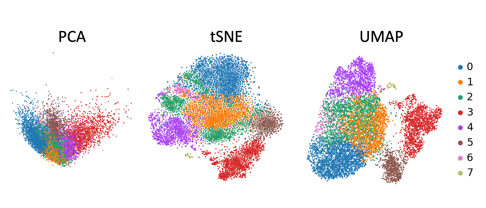
>
> > <solution-title></solution-title>
> >
> > You can see why a PCA is generally not enough to see clusters in samples - keep in mind, you're only seeing components 1 and 2! - and therefore why the tSNE and UMAP visualisation dimensionality reductions are so useful. But there is not necessarily a clear winner between tSNE and UMAP, but I think UMAP is slightly clearer with its clusters, so we'll stick with that for the rest of the analysis.
> >
> {: .solution}
>
{: .question}

Note that the cluster numbering is based on size alone - clusters 0 and 1 are not necessarily related, they are just the clusters containing the most cells. It would be nice to know what exactly these cells are. This analysis (googling all of the marker genes, both checking where the ones you know are as well as going through the marker tables you generated!) is a fun task for any individual experiment, so we're going to speed past that and nab the assessment from the original paper!

| Clusters | Marker | Cell type |
|------ |--------------------|
| 4 | Il2ra    | Double negative (early T-cell)    |
| 0,1,2,6 | Cd8b1, Cd8a, Cd4    | Double positive (middle T-cell)|
| 5 | Cd8b1, Cd8a, Cd4 - high | Double positive (late middle T-cell)
| 3 | Itm2a    | Mature T-cell
| 7 | Aif1    | Macrophages    |

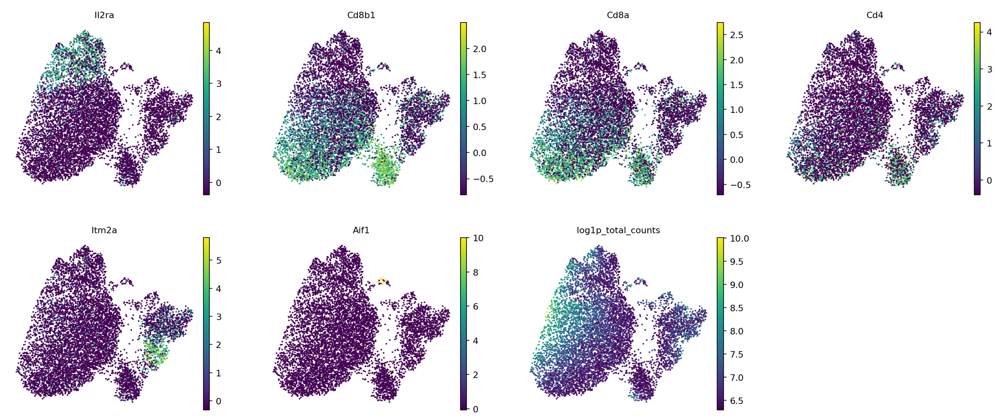

The authors weren't interested in further annotation of the DP cells, so neither are we. Sometimes that just happens. The maths tries to call similar (ish) sized clusters, whether it is biologically relevant or not. Or, the question being asked doesn't really require such granularity of clusters.

> <details-title>Working in a group? Important!</details-title>
> If you have deviated from any of the original parameters in this tutorial, you will likely have a different number of clusters. You will, therefore, need to change the 'Annotating clusters' *"Comma-separated list of new categories"* accordingly. Best of luck!
>
{: .details}

### Annotating Clusters

> <hands-on-title>Annotating clusters</hands-on-title>
>
> 1.  with the following parameters:
>    -  *"Annotated data matrix"*: `Final object`
>    - *"Function to manipulate the object"*: `Rename categories of annotation`
>    - *"Key for observations or variables annotation"*: `louvain`
>    - *"Comma-separated list of new categories"*: `DP-M4,DP-M3,DP-M1,T-mat,DN,DP-L,DP-M2,Macrophages`
>    - Hang on here, though. This unfortunately deletes the original cluster numbering. Just in case you might want this back, we can add that annotation back in.
>
> 2.  with the following parameters:
>    -  *"Input object in hdf5 AnnData format"*: `Final object`
>    - *"Copy observations (such as clusters)"*:  *Yes*
>    - **Keys from obs to copy**
>    - *"+ Insert Keys from obs to copy"*
>    - *"Key contains"*: `louvain`
>    -  *"AnnData objects with obs to copy"*: (output of **Manipulate AnnData** )
>
>    - You've added the new cell annotations in, now titled `louvain_0`. What, that's not good enough? You want to change the title as well? So be it.
>
> 3.   with the following parameters:
>    -  *"Input object in hdf5 AnnData format"*: (output of **AnnData Operations** )
>    - **Change field names in AnnData observations**
>    -  *"+ Insert Change field names in AnnData observations"*
>    - **1: Change field names in AnnData observations**
>    - *"Original name"*: `louvain_0`
>    - *"New name"*: `cell_type`
>
> 4. **Rename**  output h5ad `Final cell annotated object`
>   -  Time to re-plot!  Feel free to re-run  the **Scanpy PlotEmbed** tool  on the new object plotting `cell_type` to speed this up. Otherwise...
> 5.  with the following parameters:
>    -  *"Input object in AnnData/Loom format"*: `Final cell annotated object`
>    - *"name of the embedding to plot"*: `umap`
>    - *"color by attributes, comma separated texts"*: `sex,batch,genotype,Il2ra,Cd8b1,Cd8a,Cd4,Itm2a,Aif1,Hba-a1,log1p_total_counts,cell_type`
>    - *"Field for gene symbols"*: `Symbol`
>    - *"Use raw attributes if present"*: `No`
>
{: .hands_on}

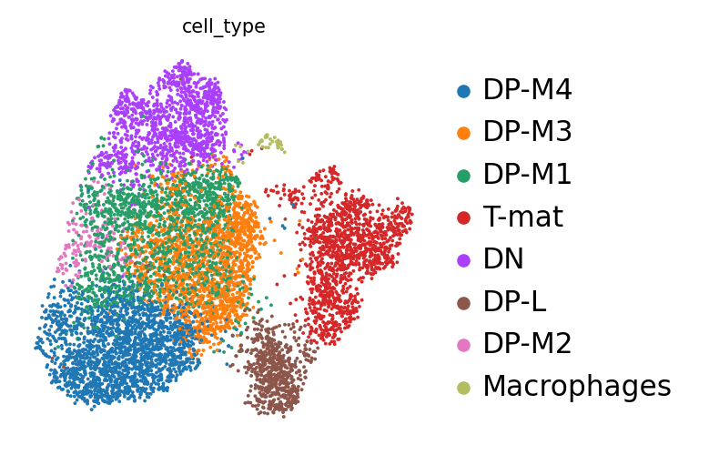

Now that we know what we're dealing with, let's examine the effect of our variable, proper science!

> <question-title>Genotype</question-title>
>
> Are there any differences in genotype? Or in biological terms, is there an impact of growth restriction on T-cell development in the thymus?
>
> 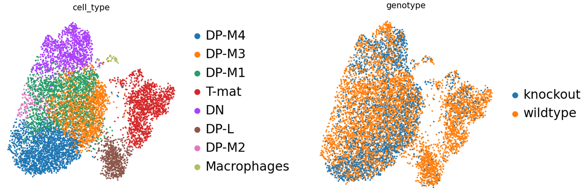
>
> > <solution-title></solution-title>
> >
> > We can see that DP-L, which seems to be extending away from the DP-M bunch, as well as the mature T-cells (or particularly the top half) are missing some knockout cells. Perhaps there is some sort of inhibition here? INTERESTING! What next? We might look further at the transcripts present in both those populations, and perhaps also look at the genotype marker table... So much to investigate! But before we set you off to explore to your heart's delight, let's also look at this a bit more technically.
> >
> {: .solution}
>
{: .question}

## Technical Assessment

Is our analysis real? Is it right? Well, we can assess that a little bit.

> <question-title>Batch effect</question-title>
>
> Is there a batch effect?
>
> 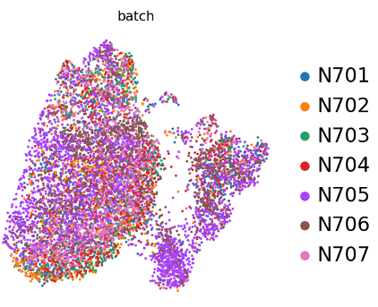
>
> > <solution-title></solution-title>
> >
> > While some shifts are expected and nothing to be concerned about, DP-L looks to be mainly comprised of N705. There might be a bit of batch effect, so you could consider using batch correction on this dataset. However, if we focus our attention on the other cluster - mature T-cells -  where there is batch mixing, we can still assess this biologically even without batch correction.
> > Additionally, we will also look at the confounding effect of sex.
> >
> > 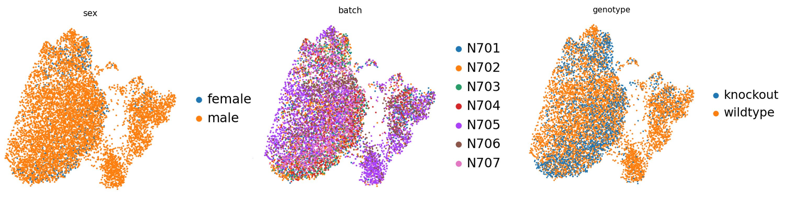
> >
> > We note that the one female sample - unfortunately one of the mere three knockout samples - seems to be distributed in the same areas as the knockout samples at large, so luckily, this doesn't seem to be a confounding factor and we can still learn from our data. Ideally, this experiment would be re-run with either more female samples all around or swapping out this female from the male sample.
> >
> {: .solution}
>
{: .question}

> <question-title>Depth effect</question-title>
>
> Are there any clusters or differences being driven by sequencing depth, a technical and random factor?
>
> 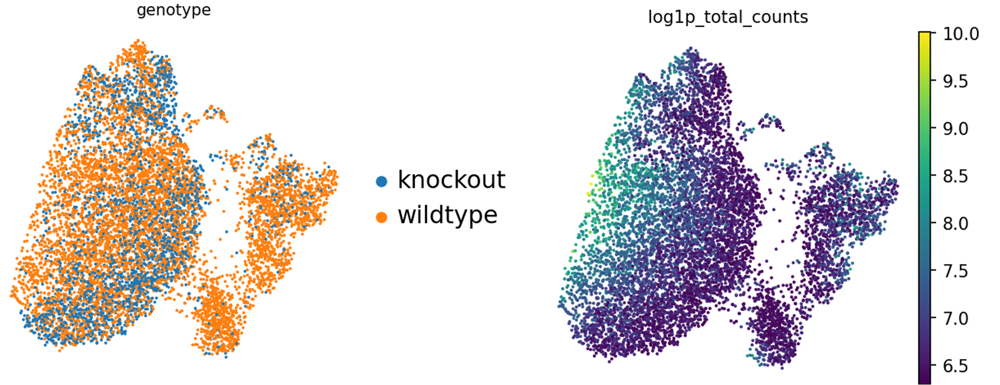
>
> > <solution-title></solution-title>
> >
> > Eureka! This explains the odd DP shift between wildtype and knockout cells - the left side of the DP cells simply have a higher sequencing depth (UMIs/cell) than the ones on the right side. Well, that explains some of the sub-cluster that we're seeing in that splurge. Importantly, we don't see that the DP-L or (mostly) the mature T-cell clusters are similarly affected. So, whilst again, this variable of sequencing depth might be something to regress out somehow, it doesn't seem to be impacting our dataset. The less you can regress/modify your data, in general, the better - you want to stay as true as you can to the raw data, and only use maths to correct your data when you really need to (and not to create insights where there are none!).
> >
> {: .solution}
>
{: .question}

> <question-title>Sample purity</question-title>
>
> Do you think we processed these samples good enough?
>
> 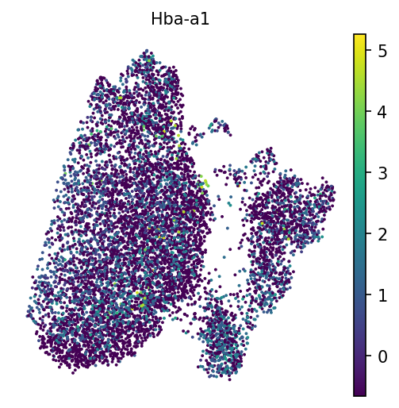
>
> > <solution-title></solution-title>
> >
> > We have seen in the previous images that these clusters are not very tight or distinct, so we could consider stronger filtering. Additionally, hemoglobin - a red blood cell marker that should NOT be found in T-cells - appears throughout the entire sample in low numbers. This suggests some background in the media the cells were in, and we might consider in the wet lab trying to get a purer, happier sample, or in the dry lab, techniques such as SoupX or others to remove this background. Playing with filtering settings (increasing minimum counts/cell, etc.) is often the place to start in these scenarios.
> >
> {: .solution}
>
{: .question}

> <question-title>Clustering resolution</question-title>
>
> Do you think the clustering is appropriate? i.e. are there single clusters that you think should be separate, and multiple clusters that could be combined?
>
> 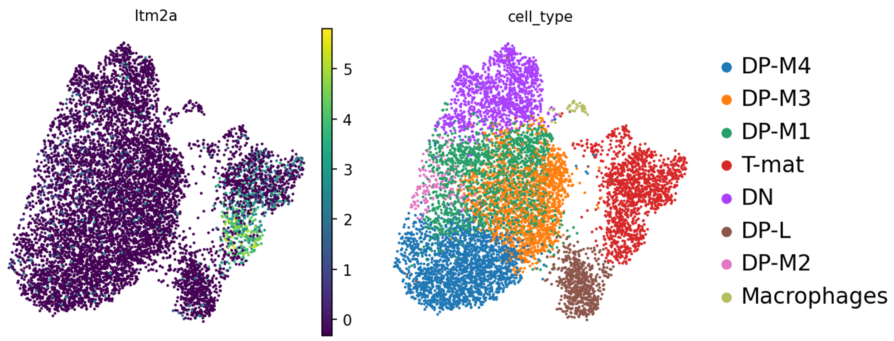
>
> > <solution-title></solution-title>
> >
> > Important to note, lest all bioinformaticians combine forces to attack the biologists: just because a cluster doesn't look like a cluster by eye is NOT enough to say it's not a cluster! But looking at the biology here, we struggled to find marker genes to distinguish the DP population, which we know is also affected by depth of sequencing. That's a reasonable argument that DP-M1, DP-M2, and DP-M3 might not be all that different. Maybe we need more depth of sequencing across all the DP cells, or to compare these explicitly to each other (consider variations on FindMarkers!). However, DP-L is both seemingly leaving the DP cluster and also has fewer knockout cells, so we might go and look at what DP-L is expressing in the marker genes. If we look at T-mat further, we can see that its marker gene - Itm2a - is only expressed in half of the cluster. You might consider sub-clustering this to investigate further, either through changing the resolution or through analysing this cluster alone.
> > If we look at the differences between genotypes alone (so the pseudo-bulk), we can see that most of the genes in that list are actually ribosomal. This might be a housekeeping background, this might be cell cycle related, this might be biological, or all three. You might consider investigating the cycling status of the cells, or even regressing this out (which is what the authors did).
> {: .solution}
>
{: .question}

Ultimately, there are quite a lot ways to analyse the data, both within the confines of this tutorial (the many parameters that could be changed throughout) and outside of it (batch correction, sub-clustering, cell-cycle scoring, inferred trajectories, etc.) Most analyses will still yield the same general output, though: there are fewer knockout cells in the mature T-cell population.

 Congratulations! You have interpreted your plots in several important ways!

# Interactive visualisations

Before we leave you to explore the unknown, you might have noticed that the above interpretations are only a few of the possible options. Plus you might have had fun trying to figure out which sample is which genotype is which sex and flicking back and forth between plots repeatedly. Figuring out which plots will be your *final publishable* plots takes a lot of time and testing. Luckily, there is a helpful interactive viewer  export tool  that can help you explore without having to produce new plots over and over!

> <hands-on-title>Cellxgene</hands-on-title>
>
> 1.  with the following parameters:
>    -  *"Concatenate dataset"*: `Final cell annotated object`
>
> 2. When ready, you will see a message
>    -  *There is an InteractiveTool result view available, click here to display* <---- Click there!
>
> Sometimes this link can aggravate a firewall or something similar. It should be fine to go to the site. You will be asked to `name your annotation`, so do so to start playing around!
>
> 3. You can also access it by going to `User` in the top menu of Galaxy, then selecting `Active Interactive Tools`
>
> 4. You will need to `STOP` this active environment in Galaxy by going to `User`, `Interactive Tools`, selecting the environment, and selecting `Stop`. You may also want to delete the dataset in the history, because otherwise it continues appearing as if it's processing.
{: .hands_on}

Be warned - this visualisation tool is a powerful option for exploring your data, but it takes some time to get used to. Consider exploring it as your own tutorial for another day!

# Conclusion


> <details-title>Working in a group? The finale!</details-title>
> Hopefully, no matter which pathway of analysis you took, you found the same general interpretations. If not, this is a good time to discuss and consider with your group why that might be - what decision was 'wrong' or 'ill-advised', and how would you go about ensuring you correctly interpreted your data in the future? Top tip - trial and error is a good idea, believe it or not, and the more ways you find the same insight, the more confident you can be! But nothing beats experimental validation...
> For those that did not take the 'control' options, please
> 1. **Rename** your history (by clicking on the history title) as `DECISION-Filtering and Plotting Single-cell RNA-seq Data`
> 2. Add a history annotation  that includes which parameters you changed/steps you changed from the *control*
> 
>    
> 
> 3. Feel free to explore any other similar histories
{: .details}

 Congratulations! You've made it to the end! You might find this [example control history](https://usegalaxy.eu/u/wendi.bacon.training/h/cs3filter-plot-and-explore-single-cell-rna-seq-data---answer-key-2) helpful to compare with, or this [workflow](https://usegalaxy.eu/u/wendi.bacon.training/w/cs3filter-plot-and-explore-single-cell-rna-seq-data).

In this tutorial, you moved from technical processing to biological exploration. By analysing real data - both the exciting and the messy! - you have, hopefully, experienced what it's like to analyse and question a dataset, potentially without clear cut-offs or clear answers. If you were working in a group, you each analysed the data in different ways, and most likely found similar insights. One of the biggest problems in analysing scRNA-seq is the lack of a clearly defined pathway or parameters. You have to make the best call you can as you move through your analysis, and ultimately, when in doubt, try it multiple ways and see what happens!

To discuss with like-minded scientists, join our Gitter channel for all things Galaxy-single cell!
[](https://gitter.im/Galaxy-Training-Network/galaxy-single-cell?utm_source=badge&utm_medium=badge&utm_campaign=pr-badge)
