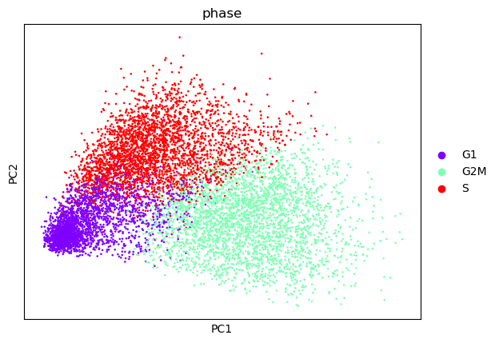
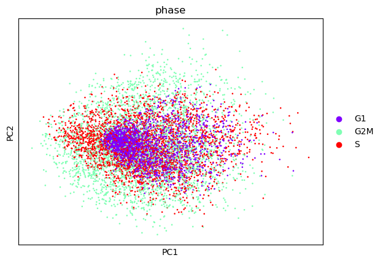

# Introduction

Single-cell RNA sequencing can be sensitive to both biological and technical variation, which is why preparing your data carefully is an important part of the analysis. You want the results to reflect the interesting differences in expression between cells that relate to their type or state. Other sources of variation can conceal or confound this, making it harder for you to see what is going on. 

One common biological confounder is the cell cycle (). Cells express different genes during different parts of the cell cycle, depending on whether they are in their growing phase (G1), duplicating their DNA (the S or Synthesis phase), or dividing in two (G2/M or Mitosis phase). If these cell cycle genes are having a big impact on your data, then you could end up with separate clusters that actually represent cells of the same type that are just at different stages of the cycle. 

In this tutorial, we will identify the genes whose expression is known to vary during the cell cycle so that we can use them to regress out (or remove) the effects of the cell cycle on the data. 

> <comment-title>Other Scanpy and Seurat tutorials</comment-title>
>
> This tutorial is based on the Scanpy cell cycle regression tutorial (), which was itself based on the Seurat vignette addressing the same issue (). However, we will be using a different dataset for this tutorial. 
{: .comment}

> <agenda-title></agenda-title>
>
> In this tutorial, we will cover:
>
> 1. TOC
> {:toc}
>
{: .agenda}

## Get Data

The data used in this tutorial is from a mouse dataset of fetal growth restriction (). You can download the dataset below.

If you've been working through the Single-cell RNA-seq: Case Study then you can use your dataset from the [Filter, Plot and Explore Single-cell RNA-seq Data]() tutorial here. Cell cycle regression should be performed after the data has been filtered, normalised, and scaled, so you should use the dataset that was renamed as `Use_me_Scaled` in that tutorial. You should rename that dataset `Processed_Anndata` now to avoid confusion later. At the end of this tutorial, you can return to the main tutorial to plot and explore your data with reduced effects from the cell cycle. 


> <hands-on-title>Data upload</hands-on-title>
>
> 1. Create a new history for this tutorial
>
> 2. Import the AnnData object from [Zenodo]({{ page.zenodo_link }})
>
>    ```
>    {{ page.zenodo_link }}files/Processed_AnnData.h5ad
>    ```
>
>    
>
> 3. Rename the dataset `Processed_Anndata`
>
>    
>
> 4. Check that the datatype is `h5ad`
>
>    
>
{: .hands_on}

In addition to the scRNA-seq dataset, we will also need lists of the genes that are known to be expressed at different points in the cell cycle. The lists used in this tutorial are part of the HBC tinyatlas and can be downloaded from Zenodo below . Between them, they include 97 genes that are expressed during the S and G2/M phases. Make sure that the file type is tabular (not just the name of the file) - you can choose this when you download the files or change it after the files are in your history. 

> <hands-on-title>Data upload</hands-on-title>
>
> 1. Import the files from [Zenodo]({{ page.zenodo_link }}) 
>
>    ```
>    {{ page.zenodo_link }}/files/sPhase.tabular
>    {{ page.zenodo_link }}/files/g2mPhase.tabular
>    ```
>
>    
>
>
> 2. Rename the datasets `sPhase` and `g2mPhase` respectively - be careful not to mix them up!
>
>    
>
> 3. Check that the datatype for both is `tabular`
>
>    
>
{: .hands_on}

The easiest way to find the tools you will need during this tutorial is to use tutorial mode or to run the analysis in the [HCA Galaxy](https://humancellatlas.usegalaxy.eu/). 



# Cell Cycle Scoring

The first step towards reducing the effects of the cell cycle on our dataset is cell cycle scoring. The cell cycle scoring algorithm will look at each cell in turn and calculate an S score based on the difference in the mean expression of the S Phase genes and a random sample of the same number of non-cell cycle genes from the same cell. It will do the same for the G2M genes in order to calculate the G2M score. The cells will then be assigned to the most likely phase: S, G2M, or G1. Three columns will be added to the AnnData dataset: `S_score`, `G2M_score` and `phase`. 

> <comment-title>When should we regress out the effects of the cell cycle?</comment-title>
>  Cell cycle regression can be particularly important if we are planning to do trajectory analysis down the line or if we have a dataset that is very strongly influenced by the cell cycle . However, it isn't always appropriate to remove the effects of the cell cycle - sometimes they can be useful for distinguishing between dividing and non-dividing cell types. When you are analysing your own data, you might need to try it both ways to determine if the effects of the cell cycle are helpful or not. You could also check whether the cell cycle genes are among the top scoring genes expressed by your cell clusters to get an idea of how strong the effects are. 
{: .comment}

> <hands-on-title>Score the cell cycle genes</hands-on-title>
>
> 1.  with the following parameters:
>    -  *"Annotated data matrix"*: `Processed_Anndata` (Input dataset)
>    - *"Method used for inspecting"*: `Score cell cycle genes, using 'tl.score_genes_cell_cycle'`
>        - *"Format for the list of genes associated with S phase"*: `File`
>            -  *"File with the list of genes associated with S phase"*: `sPhase` (Input dataset)
>        - *"Format for the list of genes associated with G2M phase"*: `File`
>            -  *"File with the list of genes associated with G2M phase"*: `g2mPhase` (Input dataset)
>
> 2. Rename the output `CellCycle_Annotated`
>
> > <question-title></question-title>
> >
> > 1. Why don't we need a list of genes expressed in the G1 Phase?
> >
> > > <solution-title></solution-title>
> > >
> > > 1. Since we know which genes are expressed in the S and G2/M phases, we can classify cells that are expressing these genes into the S and G2/M phases respectively. Cells that aren't expressing either the S or G2/M genes must be in the other phase of the cell cycle, so we can classify them as in G1 phase. 
> > >
> > {: .solution}
> {: .question}
{: .hands_on}

# Cell Cycle Regression

The second step after scoring the cell cycle genes is to use these scores to regress out the effects of the cell cycle. Now that we know which phase each of our cells is in, we can work out how this is affecting gene expression in our cells. We can subtract these effects from our data so that they won't influence our later analyses. You will need to type the `phase` variable in to the  tool to enable it to regress out the cell cycle effects. 

> <details-title>How does cell cycle regression work?</details-title>
> 
>The  tool will create a linear model of the relationship between gene expression and the cell cycle scores we assigned in the previous step. Basically, this model is a line that shows how gene expression changes as the S or G2M score changes. Each gene will have its own line, so for any S score or G2M score, we could look at the corresponding point on the line to see the expected expression level of that gene. 
>
> will then regress out or remove this expected effect for the genes expressed by each cell, according to the cell's S and G2M scores. The expected effect is subtracted from the expression data, leaving behind the difference between the expected position on the line and the actual position of each data point. The data points won't sit exactly on the line because their expression levels aren't determined completely by the cell cycle - the linear model only tells us what we would expect based on the cell cycle scores alone. 
>
> Understanding how the regression works should help you to see why we're not just deleting the cell cycle genes from the dataset. We are using these genes that are known to be expressed during different phases to calculate the cell cycle scores and determine the phase each cell is in. We then use this information to work out the effect of the cell cycle on all of the other genes expressed by the cells. Even if they are not cell cycle genes, their expression can still be affected by the cycle. Finally, we remove or regress out the effect of the cell cycle on all the genes, leaving behind the variation that we're interested in. 
>
{: .details}


> <hands-on-title>Regress out the effects of the cell cycle</hands-on-title>
>
> 1.  with the following parameters:
>    -  *"Input object in AnnData/Loom format"*: `CellCycle_Annotated` (output of **Inspect and manipulate** )
>    - *"Variables to regress out"*: `phase`
>
>
>  2. Rename the output `CellCycle_Regressed` 
> 
{: .hands_on}

# Plotting the Effects of Cell Cycle Regression

Your data is now ready for further analysis, so you can return to the [Filter, Plot and Explore Single-cell RNA-seq Data]() tutorial and move on to the Preparing coordinates step there. Make sure that you use the `CellCycle_Regressed` dataset (you may want to rename it as `Use_me_Scaled` as that is the name used in the main tutorial). However, if you want to understand how cell cycle regression has affected your data then you can work through the following steps first. 

The easiest way to see what is happening is to focus on the cell cycle genes as these will be the ones most affected by the regression. A large part of their expression depends on the cell cycle, which is why we have chosen them to help us work out the phase of each cell. 

In order to look at the cell cycle genes, we first need to label them in our AnnData dataset so that we can select them for plotting. To add a new annotation to the genes or variables, we need a column with entries for each gene, in the same order as in the dataset, and with a header at the top that will become the key for identifying these entries in the AnnData dataset. We want to end up with a column that reads `TRUE` for the 97 cell cycle genes and `FALSE` for all the other genes.

You might find it easier to create this new column using a spreadsheet and then upload it as a tabular dataset, but it is possible to complete all the steps on Galaxy. 

## Prepare a table of cell cycle genes

If we're going to mark all the cell cycle genes, we'll need a single list of all 97 genes instead of the two separate lists for S Phase and G2/M Phase. We'll combine the two lists into a single column with 97 entries. We'll then add a second column that simply reads `TRUE` in every row, which we'll use later to mark these as cell cycle genes in the main dataset. 

> <hands-on-title>Create a list of all cell cycle genes</hands-on-title>
>
> 1.  with the following parameters:
>    -  *"Concatenate Dataset"*: `sPhase` (Input dataset)
>    - In *"Dataset"*:
>        -  *"Insert Dataset"*
>            -  *"Select"*: `g2mPhase` (Input dataset)
>
> 
> 2.  with the following parameters:
>    - *"Add this value"*: `TRUE`
>    -  *"to Dataset"*: `out_file1` (output of **Concatenate datasets** )
>
> 
> 3. Rename the dataset `CC_Genes`
{: .hands_on}

## Create an ordered list of gene names

Next, we'll need a list of all the genes in our dataset, so that we can mark the ones that are in our cell cycle list. We'll also add a column of numbers as this will help us keep the gene names in order.

> <hands-on-title>Get the gene names from your dataset</hands-on-title>
>
> 1.  with the following parameters:
>    -  *"Annotated data matrix"*: `CellCycle_Regressed` (Input dataset)
>    - *"What to inspect?"*: `Key-indexed annotation of variables/features (var)`
>
> 
> 2.  with the following parameters:
>    - *"Input Single or Multiple Tables"*: `Single Table`
>        -  *"Table"*: `var` (output of **Inspect AnnData** )
>        - *"Type of table operation"*: `Drop, keep or duplicate rows and columns`
>            - *"List of columns to select"*: `1`
>            - *"List of rows to select"*: `2:15396`
>    - *"Output formatting options"*: ``
>    
>
>    > <comment-title>Selecting the right rows</comment-title>
>    >
>    > Since we don't want to keep the header, we select the rows from `2` to the end of the dataset. If you were using a dataset of a different size, you would need to change this parameter to include all the genes. 
>    {: .comment}
>
> 
> 3.  with the following parameters:
>    -  *"to Dataset"*: `table` (output of **Table Compute** )
>    - *"Iterate?"*: `YES`
>    
>
>    > <comment-title>Keeping the genes in order</comment-title>
>    >
>    > Adding these numbers will enable us to keep the genes in their original order. This is essential for adding the cell cycle gene annotation back into the AnnData dataset. 
>    {: .comment}
>    
> 
> 4. Rename the output `Dataset_Genes`
{: .hands_on}


## Mark the cell cycle genes

We can now combine our table of cell cycle genes `CC_genes` with the table of gene names `Dataset_Genes`. 

> <hands-on-title>Combine the two tables</hands-on-title>
>
> 1.  with the following parameters:
>    -  *"1st file"*: `CC_Genes` (output of **Add column** )
>    - *"Column to use from 1st file"*: `c1`
>    -  *"2nd File"*: `Dataset_Genes` (output of **Add column** )
>    - *"Column to use from 2nd file"*: `c1`
>    - *"Output lines appearing in"*: `All lines [-a 1 -a 2]`
>    - *"Value to put in unpaired (empty) fields"*: `FALSE`
>
>
>    > <comment-title>How the cell cycle genes are marked</comment-title>
>    >
>    > When we join the two tables, we'll ask for any empty fields to be filled in with `FALSE`. The cell cycle gene table has an extra column where they are all marked as `TRUE` - they will retain these entries when we join the tables, but since there are no entries for the rest of the genes in this column, their rows will be filled in as `FALSE`. This will enable us to pick out the cell cycle genes later.
>    {: .comment}
>
> 
> 2.  with the following parameters:
>    -  *"Sort Dataset"*: `output` (output of **Join** )
>    - *"on column"*: `c2`
>    - *"everything in"*: `Ascending order`
>
>
>    > <comment-title>Putting the genes in order again</comment-title>
>    >
>    > Sorting the genes using the column of numbers we added earlier will put them back in their original order - make sure to sort them in ascending order, otherwise they'll end up the opposite way around. 
>    {: .comment}
>
{: .hands_on}

> <question-title></question-title>
>
> 1. What would happen if any of the cell cycle genes were not present in the dataset?
> 2. How would we remove these genes from the table?
>
> > <solution-title></solution-title>
> >
> > 1. Any cell cycle genes that weren't in the dataset would have an empty field in the numbered column, which would be filled in with `FALSE` when we created the table with the  tool. These rows would appear at the top of the table after it was sorted. 
> > 2. We should check the first rows of the table for any unnumbered genes and then cut these rows out in the next step. 
> >
> {: .solution}
{: .question}

## Create the annotation column 

We now have a table with all the gene names in the same order as the main dataset and a column indicating which ones are cell cycle genes. If we cut this column out of the table, then we can add it as a new annotation to the main dataset. We'll also need to add a column header, which will be used as the key for this annotation in the AnnData dataset. 

> <hands-on-title>Create the cell cycle annotation column</hands-on-title>
>
> 1.  with the following parameters:
>    - *"Input Single or Multiple Tables"*: `Single Table`
>        -  *"Table"*: `out_file1` (output of **Sort** )
>        - *"Type of table operation"*: `Drop, keep or duplicate rows and columns`
>            - *"List of columns to select"*: `3`
>            - *"List of rows to select"*: `1:15395`
>    - *"Output formatting options"*: ``
>
>
>    > <comment-title>Removing rows for missing genes </comment-title>
>    >
>    > If there were any cell cycle genes that weren't present in the main dataset, we could remove them at this stage by excluding them from the List of rows to select. As before, if we were using a dataset of a different size, we would need to change this parameter to include all the rest of the rows. 
>    {: .comment}
> 
> 
> 2. Create a new **tabular** file from the following
> 
>     ```
>     CC_genes
>     ```
>     
>    
>    
> 
> 3.  with the following parameters:
>    -  *"Concatenate Dataset"*: `Pasted Entry` dataset
>    - In *"Dataset"*:
>        -  *"Insert Dataset"*
>            -  *"Select"*: `table` (output of **Table Compute** )
>
{: .hands_on}


## Add an annotation to the AnnData

We will need to add the annotation to both the annotated dataset `CellCycle_Annotated` and to the one that we created by regressing out the cell cycle genes `CellCycle_Regressed`. This will allow us to plot the cell cycle genes before and after regression. We can do this using the  tool and selecting the correct function from the dropdown menu. 

> <hands-on-title>Add the new annotations</hands-on-title>
>
> 1.  with the following parameters:
>    -  *"Annotated data matrix"*: `CellCycle_Annotated` (output of **Inspect and manipulate** )
>    - *"Function to manipulate the object"*: `Add new annotation(s) for observations or variables`
>        -  *"Table with new annotations"*: `out_file1` (output of **Concatenate datasets** )
>
> 
> 2. Rename the output `CellCycle_Annotated_CC`
>
> 
> 3.  with the following parameters:
>    -  *"Annotated data matrix"*: `CellCycle_Regressed` (output of **Scanpy RegressOut** )
>    - *"Function to manipulate the object"*: `Add new annotation(s) for observations or variables`
>        -  *"Table with new annotations"*: `out_file1` (output of **Concatenate datasets** )
>        
> 
> 4. Rename the output `CellCycle_Regressed_CC`
>
{: .hands_on}

## Filter the cell cycle genes

For both the newly annotated datasets, we can now filter out the cell cycle genes (the ones that have `TRUE` in their new `CC_genes` annotation). The filtered datasets will only include expression data for these 97 genes, so we'll be able to use them to clearly visualise what happens when the cell cycle genes are regressed out.  

> <hands-on-title>Filter the AnnData datasets</hands-on-title>
>
> 1.  with the following parameters:
>    -  *"Annotated data matrix"*: `CellCycle_Annotated_CC` (output of **Manipulate AnnData** )
>    - *"Function to manipulate the object"*: `Filter observations or variables`
>        - *"Type of filtering?"*: `By key (column) values`
>            - *"Key to filter"*: `CC_genes`
>            - *"Type of value to filter"*: `Boolean`
>            
> 
> 2. Rename the output `CellCycle_Annotated_CC_Only`
> 
> 
> 3.  with the following parameters:
>    -  *"Annotated data matrix"*: `CellCycle_Regressed_CC` (output of **Manipulate AnnData** )
>    - *"Function to manipulate the object"*: `Filter observations or variables`
>        - *"Type of filtering?"*: `By key (column) values`
>            - *"Key to filter"*: `CC_genes`
>            - *"Type of value to filter"*: `Boolean`
>            
> 
> 4. Rename the output `CellCycle_Regressed_CC_Only`
> 
{: .hands_on}

## Plot the cell cycle genes before regression

Now that we have a dataset that only includes the cell cycle genes, we can visualise their effects in a PCA plot. We first calculate the PCA coordinates, which are a measure of how similar each pair of cells is in terms of the expression of the 97 cell cycle genes we've included in the filtered dataset. We will then visualise the cells on a PCA plot where the axes represent the principal components, which reflect the genes (or groups of genes) that had the biggest impact in these calculations. 

You will learn more about plotting your data in the [Filter, Plot and Explore]() tutorial. For now, it is enough to know that each dot on the plot represents a cell and the closer two cells are together, the more similar they are. 

> <hands-on-title>Create a PCA Plot of cell cycle genes </hands-on-title>
>
> 1.  with the following parameters:
>    -  *"Annotated data matrix"*: `CellCycle_Annotated_CC_Only` (output of **Manipulate AnnData** )
>    - *"Method used"*: `Computes PCA (principal component analysis) coordinates, loadings and variance decomposition, using 'tl.pca'`
>        - *"Type of PCA?"*: `Full PCA`
>        
> 
> 2.  with the following parameters:
>    -  *"Annotated data matrix"*: `anndata_out` (output of **Cluster, infer trajectories and embed** )
>    - *"Method used for plotting"*: `PCA: Plot PCA results, using 'pl.pca_overview'`
>        - *"Keys for annotations of observations/cells or variables/genes"*: `phase`
>        - In *"Plot attributes"*:
>            - *"Colors to use for plotting categorical annotation groups"*: `rainbow (Miscellaneous)`
>
>
>    > <comment-title>Plot all the genes </comment-title>
>    >
>    > Make sure that you de-select the option for the  tool to use highly variable genes only - some of the cell cycle genes are also HVGs, but we want our plots to include the cell cycle genes that aren't HVGs too.  
>    {: .comment}
>
{: .hands_on}

> <question-title></question-title>
>
> 1. Does the plot look as you expected?
> 2. What would happen if we plotted all of the genes from the main dataset?
>
> > <solution-title></solution-title>
> >
> > 1. The PCA plot shows that the three groups of cells are separated out according to what phase of the cell cycle they are in. This is what we would expect to see as we are only looking at the cell cycle genes, which by definition are expressed during particular phases.
> >
> > 
> >
> > 2. If we created a PCA plot using all of the genes (not just the cell cycle ones) and coloured the cells according to their phase, we wouldn't expect to see such clear distinctions between the groups. Although the cell cycle genes can have a significant effect on many datasets, these wouldn't be as obvious when other genes were also being taken into account. If you continue analysing your data in the [Filter, Plot and Explore]() tutorial then you will be creating some more plots - you could try colouring these according to cell phase to see what happens. 
> >
> {: .solution}
{: .question}

## Plot the cell cycle genes after regression

We will now repeat the same steps to create a PCA plot of the filtered dataset after the effects of the cell cycle have been regressed out. 

> <hands-on-title>Recreate the PCA plot of cell cycle genes after regression </hands-on-title>
>
> 1.  with the following parameters:
>    -  *"Annotated data matrix"*: `CellCycle_Regressed_CC_Only` (output of **Manipulate AnnData** )
>    - *"Method used"*: `Computes PCA (principal component analysis) coordinates, loadings and variance decomposition, using 'tl.pca'`
>        - *"Type of PCA?"*: `Full PCA`
>
>
> 2.  with the following parameters:
>    -  *"Annotated data matrix"*: `anndata_out` (output of **Cluster, infer trajectories and embed** )
>    - *"Method used for plotting"*: `PCA: Plot PCA results, using 'pl.pca_overview'`
>        - *"Keys for annotations of observations/cells or variables/genes"*: `phase`
>        - In *"Plot attributes"*:
>            - *"Colors to use for plotting categorical annotation groups"*: `rainbow (Miscellaneous)`
>
{: .hands_on}

> <question-title></question-title>
>
> 1. Does the plot look as you expected?
> 2. What impact do you think the cell cycle regression will have when you analyse the whole dataset? 
>
> > <solution-title></solution-title>
> >
> > 1. The cells in different phases are now all mixed up together. This makes sense because we are only plotting the cell cycle genes, but the previously strong effects of the cell cycle on these genes have now been regressed out. There are still some differences between the cells (they don't all end up at the same point on the PCA chart) because the regression only removes the expected effects of the cell cycle, leaving behind any individual variation in the expression of the cell cycle genes.
> >
> > 
> >
> > 2. The cell cycle genes aren't having a coordinated effect on the data now that the effects of the cell cycle have been regressed out - the cells don't separate according to phase in this PCA plot. When we analyse the whole `CellCycle_Regressed` dataset, this could allow other differences in gene expression to become more apparent. We can run the regressed dataset through the rest of the [Filter, Plot and Explore]() tutorial to find out how much of an impact this will have. We should see some differences in the plots, but the extent of these differences will depend on how strong the effects of the cell cycle are in this particular dataset. 
> >
> {: .solution}
{: .question}

Comparing the before and after plots, we can clearly see that the effects of the cell cycle have been removed. Although you wouldn't usually need to filter out the cell cycle genes or create these plots when analysing your own data, hopefully you have found doing it now to be helpful for understanding the impact of cell cycle regression.

# Conclusion

In this tutorial, you have annotated and scored the cell cycle genes and regressed out the effects of the cell cycle. You have also created PCA plots of the data before and after regression to visualise the effects. 

You can now continue to analyse this data by returning to the Preparing coordinates step in the [Filter, Plot and Explore]() tutorial. If you use the `CellCycle_Regressed` dataset (which you may now want to rename as `Use_me_Scaled` since that is the name used in the main tutorial), you should notice some differences in your results compared to those shown there because the effects of the cell cycle have been regressed out. 
