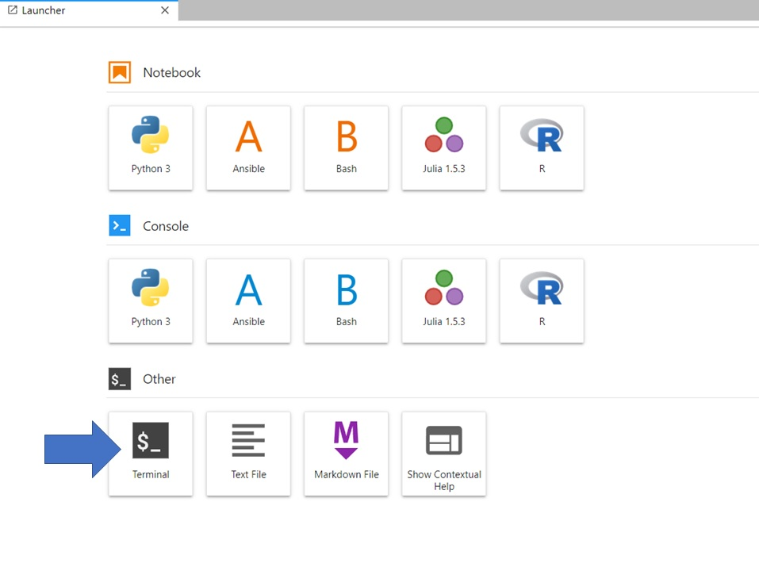

# Introduction

This tutorial is the next one in the [Single-cell RNA-seq: Case Study]() series. This tutorial focuses on trajectory analysis using [monocle3](https://cole-trapnell-lab.github.io/monocle3/), similar to the [Monocle3 in Galaxy tutorial](). However, in this tutorial we will use the R programming language that hides behind the user-friendly Galaxy tools. Sometimes you might encounter limitations when working with Galaxy tools, or you might want to make a wee modification that has to be done manually. It is therefore useful to be able to switch to R. If you do not feel confident using R, [this tutorial]() is a good place to start. However, our tutorial is quite straightforward to follow and at the end you will feel like a programmer! On the other hand, if you are not confident with the biological or statistical theory behind trajectory analysis, check out the [slide deck](). With those resources (including the previous case study tutorials) you are well-equipped to go through this tutorial with ease. Let’s get started!

> <comment-title></comment-title>
> This tutorial is significantly based on the [Monocle3 documentation](https://cole-trapnell-lab.github.io/monocle3/docs/introduction/).
{: .comment}

## Optional: Get data into a Galaxy history
In the [Monocle3 in Galaxy tutorial](), we showed that Monocle3 works great with annotated data, but what if your data is not annotated yet? Is it still possible to use Monocle? The answer is yes, Monocle can annotate cells according to their type.

First, we need to retrieve the appropriate data. We will continue to work on the case study data from a mouse model of fetal growth restriction  (see [the study in Single Cell Expression Atlas](https://www.ebi.ac.uk/gxa/sc/experiments/E-MTAB-6945/results/tsne) and [the project submission](https://www.ebi.ac.uk/arrayexpress/experiments/E-MTAB-6945/)). We will use the filtered AnnData object, before normalisation and annotation, generated in the [filtering tutorial]() as step `20: Filtered Object`. However for this tutorial, you don't have to download any files on your computer or even import files to Galaxy! We will show you the whole analysis in R, starting from AnnData object. However, if you'd like to examine the datasets in a history, the instructions are below.

> <hands-on-title>Optional data upload into Galaxy history</hands-on-title>
>
> You have three options for importing the input data into a Galaxy history.
> 
> 1. You can import a history from: [input history](https://usegalaxy.eu/u/wendi.bacon.training/h/cs4trajectories--monocle3--rstudio---input); Import the files from [Zenodo]({{ page.zenodo_link }}); or Import the files from the shared data library (`GTN - Material` -> `{{ page.topic_name }}`
>     -> `{{ page.title }}`):
>
>    
>
>    ```
>    {{ page.zenodo_link }}/files/AnnData_filtered.h5ad
>    ```
>
>    
>    
>
> 2. Check that the datatype is `h5ad`
>
>    
>
> 3. **Rename**  the history to your name of choice.
>
{: .hands_on}


## Launching JupyterLab

 Please note: this is only currently available on the [usegalaxy.eu](https://usegalaxy.eu) site.

> <warning-title>Data uploads & JupyterLab</warning-title>
> There are a few ways of importing and uploading data into JupyterLab. You might find yourself accidentally doing this differently than the tutorial, and that's ok. There are a few key steps where you will call files from a location - if these don't work from you, check that the file location is correct and change accordingly!
{: .warning}

JupyterLab is a bit like RStudio but for other coding languages. What, you've never heard of [RStudio](https://www.rstudio.com/products/rstudio/features/)? Then don't worry, just follow the instructions! Saying that, for those that are confident with the R programming language and want to run this locally in the RStudio programming environment, we have included some extra details throughout that helped us run the code locally in RStudio. This tutorial is built to run in JupyterLab, however.

> 

Welcome to JupyterLab!

> <warning-title>Danger: You can lose data!</warning-title>
> Do NOT delete or close this notebook dataset in your history. YOU WILL LOSE IT!
{: .warning}

## Open the notebook

You have two options for how to proceed with this JupyterLab tutorial - you can run the tutorial from a pre-populated notebook, or you can copy and paste the code for each step into a fresh notebook and run it. The initial instructions for both options are below.

> <hands-on-title>Option 1: Open the notebook directly in JupyterLab</hands-on-title>
>
> 1. Open a `Terminal` in JupyterLab with File -> New -> Terminal
>
>   
>
> 2. Run
>    ```
>    wget {{ ipynbpath }}
>    ```
>
> 3. Select the notebook that appears in the list of files on the left.
>
>
> Remember that you can also download this  [Jupyter Notebook]({{ ipynbpath }}) from the  Supporting Materials in the Overview box at the beginning of this tutorial.
{: .hands_on}

> <hands-on-title>Option 2: Creating a notebook</hands-on-title>
>
> 1. Select the **R** icon under **Notebook**
>
>   
>
> 2. Save your file (**File**: **Save**, or click the  Save icon at the top left)
>
> 3. If you right click on the file in the folder window at the left, you can rename your file `whateveryoulike.ipynb`
>
{: .hands_on}

> <warning-title>You should <b>Save</b> frequently!</warning-title>
> This is both for good practice and to protect you in case you accidentally close the browser. Your environment will still run, so it will contain the last saved notebook you have. You might eventually stop your environment after this tutorial, but ONLY once you have saved and exported your notebook (more on that at the end!) Note that you can have multiple notebooks going at the same time within this JupyterLab, so if you do, you will need to save and export each individual notebook. You can also download them at any time.
{: .warning}

Let's crack on!

## Installation

If you followed the  tip above, you should already have your JupyterLab instance open. Before we start working on the tutorial notebook, we need to install required packages.

><hands-on-title>Installing the packages</hands-on-title>
>
> 1. Navigate back to the `Terminal`
> 2. In the Terminal tab open, write the following, one line at a time:
> ```
>conda install -y -c conda-forge -c bioconda r-monocle3
>```
>```
>conda install -y -c conda-forge -c bioconda anndata
>```
>```
>conda install -y -c conda-forge r-viridislite
>```
>```
>conda install -y -c conda-forge bioconductor-biomart
>```
> 3. If you are asked at any point `Proceed ([y]/n)?`, type `y` - surely we want to proceed!
>
{: .hands_on}


Installation will take a while, so in the meantime, when it's running, you can open the notebook and follow the rest of this tutorial there!

><tip-title>Installation for RStudio users</tip-title>
>
> Monocle 3 runs in the R statistical computing environment. You will need R version 4.1.0 or higher, Bioconductor version 3.14, and monocle3 1.2.7 or higher to have access to the latest features. Here is the original code that you should run to install BiocManager and monocle3.
>```r
># Install Bioconductor and some of its dependencies
>if (!requireNamespace("BiocManager", quietly = TRUE))
>install.packages("BiocManager")
>BiocManager::install(version = "3.14")
>BiocManager::install(c('BiocGenerics', 'DelayedArray', 'DelayedMatrixStats',
                       'limma', 'lme4', 'S4Vectors', 'SingleCellExperiment',
                       'SummarizedExperiment', 'batchelor', 'HDF5Array',
                       'terra', 'ggrastr'))
>
># Install monocle3 through the cole-trapnell-lab GitHub:
>install.packages("devtools")
>devtools::install_github('cole-trapnell-lab/monocle3')
>library(monocle3)
>```
> > <warning-title>Installation errors</warning-title>
> > It may happen that you will encounter some problems with installation of monocle3 when using RStudio Galaxy instance or RStudio Cloud. It might be due to using older versions of R or required packages or lack of required dependencies. If it happens, you would need to carefully read the error messages and follow the suggestions. If you are facing any difficulties with installation process, it is recommended that you consult additional online resources. It is more likely that RStudio Cloud or Galaxy tool would fail rather than local RStudio. To make your analysis stress-free, you can follow the Jupyter Notebook instead, which should not give you installation issues.
> {: .warning}
>
{: .tip}
