# Introduction

## Setting up the environment and file upload
Once the installation is done, we should load the needed packages into our notebook. Navigate back to your `notebook`. If you are using our prepopulated notebook, you can follow the tutorial from there. Otherwise, input the following into your fresh notebook.

```{r}
install.packages("Rcpp")    # needed for reduce_dimension to avoid AnnoyAngular error; library(Rcpp) might work as well depending on the version
```

```{r}
library(monocle3)
library(biomaRt)
library(magrittr)     # needed for %>%
library(viridisLite)
```

```{r}
install.packages("anndata")
```

Alright, the libraries are here - so now let's get our AnnData file.

## Upload, view and modify the files

We can download the file into Jupyter notebook also using a Zendo link. The first argument is the download link and the second one is the name under which the downloaded file is saved:
```{r}
download.file('https://zenodo.org/record/7455590/files/AnnData_filtered.h5ad', 'AnnData.h5ad')
```
Then we have to read in this h5ad file:
```{r}
ann <- anndata::read_h5ad('AnnData.h5ad')
```
Now we store all the information we need in AnnData object. However, Monocle uses *cell_data_set class* to hold expression data, which requires three input files: `expression_matrix`, `cell_metadata` and `gene_metadata`. Therefore, we have to somehow 'transfer' that information from our AnnData object to Monocle's cell_data_set (cds). AnnData stores a data matrix `X` together with annotations of observations `obs` and variables `var`, so we can extract those parameters and use them for further analysis.

```{r}
expression_matrix <- ann$X
cell_metadata <- ann$obs
gene_metadata <- ann$var
```

:::{.tip}
<div class="box-title tip-title" id="tip-uploading-files-from-your-computer-is-also-an-option"><button class="gtn-boxify-button tip" type="button" aria-controls="tip-uploading-files-from-your-computer-is-also-an-option" aria-expanded="true"><i class="far fa-lightbulb" aria-hidden="true" ></i> Tip: Uploading files from your computer is also an option!<span class="fold-unfold fa fa-minus-square"></span></button></div>

If you already have files containing the expression matrix, genes and cells metadata, you can upload them to JupyLab and generate a cds file from them instead. For example, if you first downloaded the files from Galaxy, your files will have the `.tabular` extension. In this case, we will use the `read.delim()` function to read them in. In this function, the first argument is the file path - in our case, the files are in the same folder as the notebook, so the file path is the same as the file name. You can always check that by right-clicking on the file and choosing `Copy path`. The second argument, `row.names=1` takes the column number of the data file from which to take the row names.
```{r}
# read in the files
cell_metadata <- read.delim('cells.tabular', row.names=1)
gene_metadata <- read.delim('genes.tabular', row.names=1)
expression_matrix <- read.delim('expression.tabular', row.names=1)
```

:::{.question}
<div class="box-title question-title" id="question"><i class="far fa-question-circle" aria-hidden="true" ></i> Question</div>

Why should we set `row.names=1`?

> <div class="box-title solution-title" id="solution"><button class="gtn-boxify-button solution" type="button" aria-controls="solution" aria-expanded="true"><i class="far fa-eye" aria-hidden="true" ></i> Solution<span class="fold-unfold fa fa-minus-square"></span></button></div>
>
> This allows us to ensure that the expression value matrix has the same number of columns as the `cell_metadata` has rows and the same number of rows as the `gene_metadata` has rows. Importantly, the row names of the `cell_metadata` object should match the column names of the expression matrix and the row names of the `gene_metadata` object should match the row names of the expression matrix.
>
{: .solution}
:::

:::


:::{.tip}
<div class="box-title tip-title" id="tip-reading-in-the-files-for-rstudio-users"><button class="gtn-boxify-button tip" type="button" aria-controls="tip-reading-in-the-files-for-rstudio-users" aria-expanded="true"><i class="far fa-lightbulb" aria-hidden="true" ></i> Tip: Reading in the files for RStudio users<span class="fold-unfold fa fa-minus-square"></span></button></div>

If you are working in RStudio Cloud, you have to click on ‘Upload’ button in the right bottom window toolbar and choose already downloaded data files to upload. You should now see all three files in this window. You might want to rename the files to make their names shorter.

<a href="../../images/scrna-casestudy-monocle/r_files_tab.png" rel="noopener noreferrer"><figure id="figure-1" style="max-width: 90%; margin:auto;">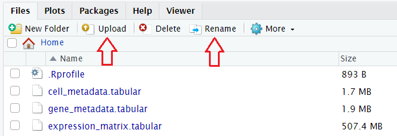<figcaption><span class="figcaption-prefix"><strong>Figure 1</strong>:</span> The view of the Files tab with uploaded files and highlighted relevant buttons.</figcaption></figure></a>

If you are using RStudio Galaxy tool, you can get data directly from your history by running:
```
# get the files from Galaxy history
file.copy(gx_get(2), "cell_metadata")
file.copy(gx_get(3), "gene_metadata")
file.copy(gx_get(4), "expression_matrix")
```
The number in the brackets corresponds to the dataset number in your history, so make sure you put the right number for the corresponding file. We can specify the name of the fetched files in the quotation marks, as shown above. All three files should appear in the Files tab window.

If you are using RStudio locally, then you don’t have to bother about uploading the files – just run `file.choose()` and choose the corresponding file which you want to get path to:
```
# get the file path
cells_path <- file.choose()
genes_path <- file.choose()
expression_path <- file.choose()
```
You should now see the new variables in the Environment tab window.

:::


According to the [Monocle3 documentation](https://cole-trapnell-lab.github.io/monocle3/docs/starting/), the `expression_matrix` should have genes as rows and cells as columns. Let's check if that's the case here.
```{r}
head(expression_matrix,c(5, 5))           # preview the content of the file by calling its the first 5 rows by 5 columns
```
We can see that in our matrix rows are cells and genes are columns, so we have to transpose the matrix simply using function `t()`. But before doing so, we will change its type from dataframe to matrix - this is Monocle's requirement to generate cell_data_set afterwards.
```{r}
expression_matrix <- as.matrix(expression_matrix)   # change the type to matrix
expression_matrix <- t(expression_matrix)           # transpose the matrix
```
Another condition we have to satisfy is that one of the columns of the `gene_metadata` should be named "gene_short_name", which represents the gene symbol for each gene. Some functions won't work without that. Do we have such a column? Let's check.
```{r}
head(gene_metadata)             # preview the top ten rows of the file to check the name of the column containing gene symbols
```

The second column indeed contains gene symbols, but is called "Symbol" instead of "gene_short_name". That can be easily changed by a simple assignment, as long as we know the number of the column that we want to modify. In our case the gene symbols are stored in column 2. We can access the column names by `colnames()`.
```{r}
colnames(gene_metadata)[2] <- 'gene_short_name'     # change the column name
colnames(gene_metadata)                             # see the changes
```

## Generating CDS object
Now let’s store our files in one object – the `cell_data_set`. This is the main class used by Monocle to hold single cell expression data. The class is derived from the Bioconductor SingleCellExperiment class. Similar to Python's AnnData, the cell_data_set stores a data matrix together with annotations of observations and variables. There are three ways of creating CDS object in monocle:
-	Using ```new_cell_data_set() ``` function with three data frames as arguments (not their paths!): expression matrix (can also be a sparseMatrix), cell metadata and gene metadata
-	Using ```load_cellranger_data() ``` function providing the path to the folder containing 10X Genomics Cell Ranger output files. This function takes an argument `umi_cutoff` that determines how many reads a cell must have to be included
-	Using ```load_mm_data() ``` function providing the paths to matrix file and two metadata files (features and cell information).

In this tutorial we will use the first option:
```{r}
# create CDS object
cds <- new_cell_data_set(expression_matrix, cell_metadata, gene_metadata)
```
We are now ready to process our data!

:::{.details}
<div class="box-title details-title" id="details-format-conversion"><button class="gtn-boxify-button details" type="button" aria-controls="details-format-conversion" aria-expanded="true"><i class="fas fa-info-circle" aria-hidden="true" ></i> Details: Format conversion<span class="fold-unfold fa fa-minus-square"></span></button></div>

Since Monocle’s CDS object is analogous to Python's AnnData, why don’t we use some kind of conversion between those two formats? There is indeed a package called `sceasy` that helps easy conversion of different single-cell data formats to each other. However, when we tested this conversion on our dataset and then used Monocle to plot the expression of genes, the plots were not correct – the expression was shown to be identical throughout the sample. For comparison, Seurat did well when plotting gene expression of the same converted object! Although conversion functions are very handy, you have to be aware that their output might be interpreted differently by certain packages. Therefore, to make sure that the analysis is reliable, we decided to generate CDS object directly using Monocle’s function.
<a href="../../images/scrna-casestudy-monocle/monocle_seurat.png" rel="noopener noreferrer"><figure id="figure-2" style="max-width: 90%; margin:auto;">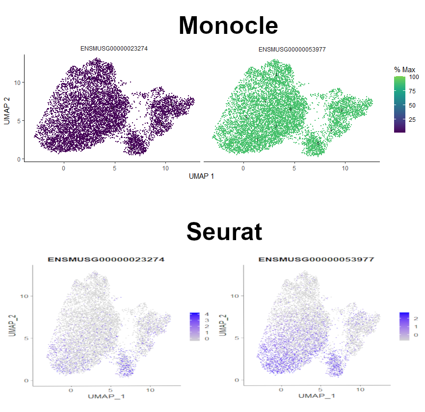<figcaption><span class="figcaption-prefix"><strong>Figure 2</strong>:</span> Comparison between plots of gene expression generated by Monocle and Seurat using the CDS object that was converted from AnnData using SCEasy tool.</figcaption></figure></a>

:::

# Additional step: adding genes symbols based on their IDs
:::{.warning}
<div class="box-title warning-title" id="warning-additional-step"><i class="fas fa-exclamation-triangle" aria-hidden="true" ></i> Warning: Additional step</div>
This step is not necessary for the dataset we are working on but some users might find it helpful when analysing their own data.

:::

If you remember the very first tutorial in the case study, we started with gene IDs and added gene symbols based on the Ensembl GTF file.  
But what if we didn’t have the genes symbols in our CDS object and wanted to add them now? Of course - it's possible! We will also base this annotation on Ensembl - the genome database – with the use of the library BioMart. We will use the same archive as in the Alevin tutorial (Genome assembly GRCm38) to get the gene names. Please note that the updated version (GRCm39) is available, but some of the gene IDs are not in that EnsEMBL database. The code below is written in a way that it will work for the updated dataset too, but will produce ‘NA’ where the corresponding gene name couldn’t be found.
```{r}
cds_extra <- cds                                        # assign our CDS to a new object for the demonstration purpose
head(rownames(fData(cds_extra)))                        # preview of the gene IDs as rownames
```
```{r}
# get relevant gene names
library("biomaRt")                                      # load the BioMart library
ensembl.ids <- rownames(fData(cds_extra))               # fData() allows to access cds rowData table
mart <- useEnsembl(biomart = "ENSEMBL_MART_ENSEMBL")    # connect to a specified BioMart database and dataset hosted by Ensembl
ensembl_m = useMart("ensembl", dataset="mmusculus_gene_ensembl", host='https://nov2020.archive.ensembl.org') 	

# The line above connects to a specified BioMart database and dataset within this database.
# In our case we choose the mus musculus database and to get the desired Genome assembly GRCm38,
# we specify the host with this archive. If you want to use the most recent version of the dataset, just run:
# ensembl_m = useMart("ensembl", dataset="mmusculus_gene_ensembl")
```
```{r}
genes <- getBM(attributes=c('ensembl_gene_id','external_gene_name'),
               filters = 'ensembl_gene_id',
               values = ensembl.ids,
               mart = ensembl_m)

# The line above retrieves the specified attributes from the connected BioMart database;
# 'ensembl_gene_id' are genes IDs,
# 'external_gene_name' are the genes symbols that we want to get for our values stored in ‘ensembl.ids’.
```
```{r}
# see the resulting data
head(genes)                          
```
```{r}
# replace IDs for gene names
gene_names <- ensembl.ids	 
count = 1 	 
for (geneID in gene_names)
{
 index <- which(genes==geneID)    # finds an index of geneID in the genes object created by getBM()
 if (length(index)==0)            # condition in case if there is no corresponding gene name in the chosen dataset
  {
    gene_names[count] <- 'NA'
  }
  else
  {
    gene_names[count] <- genes$external_gene_name[index] 	# replaces gene ID by the corresponding gene name based on the found geneID’s index
  }
 count = count + 1                # increased count so that every element in gene_names is replaced
}
```
```{r}
# store the gene names in our CDS object in a new column gene_short_name_extra
fData(cds_extra)$gene_short_name_extra <- gene_names
```
```{r}
# see the changes
fData(cds_extra)                    
```

If you are working on your own data and it’s not mouse data, you can check available datasets for other species and just use relevant dataset in `useMart()` function.
```{r}
listDatasets(mart)                # available datasets
```

:::{.warning}
<div class="box-title warning-title" id="warning-ensembl-connection-problems"><i class="fas fa-exclamation-triangle" aria-hidden="true" ></i> Warning: Ensembl connection problems</div>
Sometimes you may encounter some connection issues with Ensembl. To improve performance Ensembl provides several mirrors of their site distributed around the globe. When you use the default settings for useEnsembl() your queries will be directed to your closest mirror geographically. In theory this should give you the best performance, however this is not always the case in practice. For example, if the nearest mirror is experiencing many queries from other users it may perform poorly for you. In such cases, the other mirrors should be chosen automatically.

:::

# Monocle workflow
Do you remember the Monocle workflow introduced in the previous tutorial? Here is a recap:
<a href="../../images/scrna-casestudy-monocle/monocle3_new_workflow.png" rel="noopener noreferrer"><figure id="figure-3" style="max-width: 90%; margin:auto;">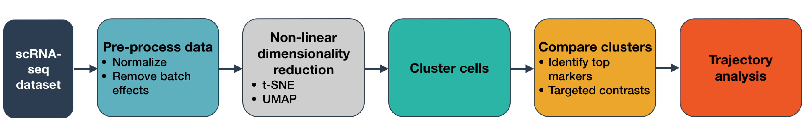<figcaption><span class="figcaption-prefix"><strong>Figure 3</strong>:</span> Workflow provided by Monocle3 documentation</figcaption></figure></a>

## Pre-processing
Let’s start with normalisation and pre-processing that can be performed using the function `preprocess_cds()`. The argument `num_dim` is the number of principal components that will be used. You can check that you're using enough PCs to capture most of the variation in gene expression across all the cells in the data set. Note that “PCA” is the default method of pre-processing in Monocle3, so although we can specify this in our function, we don’t have to.

Note that this step can take awhile - around 5 or so minutes due to the high number of PCs calculated. Feel free to use a `num_dim` value around 100 to accelerate preprocessing and compare the results.

```{r}
# PCA pre-processing with 210 principal components
cds_preprocessing <- preprocess_cds(cds, method = "PCA", num_dim = 210)
```
```{r}
 # plot the variation in gene expression vs PCA components
plot_pc_variance_explained(cds_preprocessing)                              		                            
```

<a href="../../images/scrna-casestudy-monocle/pca_plot.jpg" rel="noopener noreferrer"><figure id="figure-4" style="max-width: 90%; margin:auto;">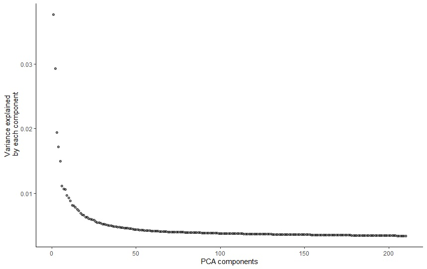<figcaption><span class="figcaption-prefix"><strong>Figure 4</strong>:</span>  Plot of variation in gene expression vs PCA components.</figcaption></figure></a>

The plot shows that actually using more than ~100 PCs captures only a small amount of additional variation. However, if we look at how the cells are plotted on 2D graph when using different values of PCs, it is easier to visualise how the `num_dim` actually affects the output. We will use the value of 210, which, compared to the results from the previous tutorial, makes the most sense for our dataset.

<a href="../../images/scrna-casestudy-monocle/num_dim.jpg" rel="noopener noreferrer"><figure id="figure-5" style="max-width: 90%; margin:auto;">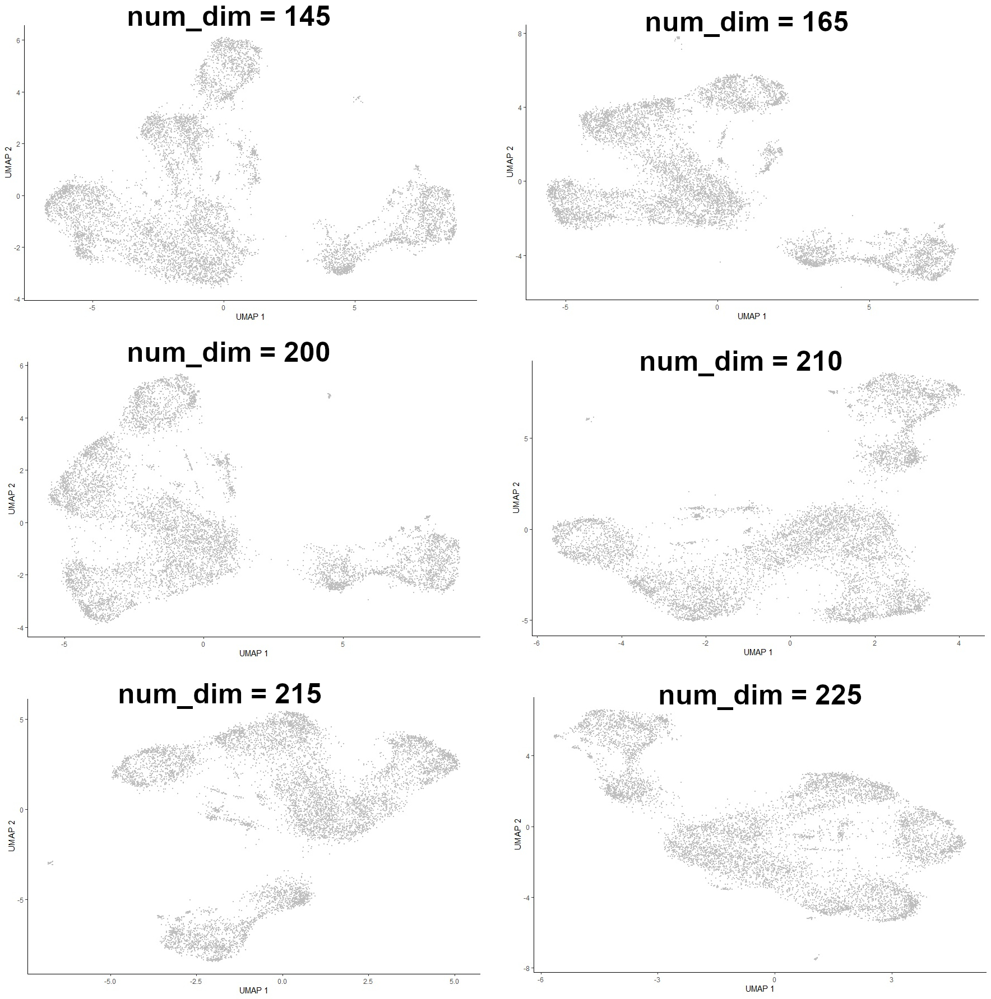<figcaption><span class="figcaption-prefix"><strong>Figure 5</strong>:</span> The "shape" of the plot showing how the cells are clustered depending on the 'num_dim' argument.</figcaption></figure></a>

## Batch correction and Dimensionality reduction
Our dataset actually comprises data from 7 samples, so there is a risk that batch effects will impact analysis. Batch effects are systematic differences in the transcriptome of cells measured in different experimental batches. However, we can use Monocle to deal with that!
First, let’s check how our dataset looks in terms of batch effects. We can do that by colouring the cells by batch.  This information is stored in our CDS object from the `cell_metadata` file. Before asking Monocle to plot anything, let’s check the exact column name of the batch information column.
```{r}
colnames(colData(cds_preprocessing)) 	          # check column names
```
In our case it’s indeed ‘batch’, but your data might have another name (eg. "plate", etc.), so make sure you put the correct argument value.

In order to plot our cells on a 2D graph, we need to reduce the numbers of dimensions. The [previous tutorial](/training-material/topics/single-cell/tutorials/scrna-case_monocle3-trajectories/tutorial.html) introduced the methods of dimensionality reduction in Monocle. You can replicate what we did in Galaxy to compare the output of dimensionality reduction using different methods, simply by changing the `reduction_method` argument. Options currently supported by Monocle are "UMAP", "tSNE", "PCA", "LSI", and "Aligned". However, as for now, let’s just recall that UMAP gave the best results, so we will use UMAP here as well.
```{r}
# reduce dimension first
cds_preprocessing_UMAP <- reduce_dimension(cds_preprocessing, reduction_method = "UMAP", preprocess_method = "PCA")
```
```{r}
# then produce a plot to check for batch effects
plot_cells(cds_preprocessing_UMAP, color_cells_by="batch", label_cell_groups=FALSE)
```

We can see that upper and lower right branches mostly consist of N705 and N706, so indeed batch correction might be helpful. Let’s run this.
```{r}
# perform batch correction
cds_batch <- align_cds(cds_preprocessing_UMAP, preprocess_method = "PCA", alignment_group = "batch")
```

To see the changes, we have to run UMAP again, but this time on the aligned dataset. We will specify that `preprocess_method ` as "Aligned" and not “PCA". Monocle would use the "Aligned" argument automatically if no `preprocess_method` was specified.
```{r}
# dimensionality reduction after alignment
cds_red_dim <- reduce_dimension(cds_batch, preprocess_method = "Aligned", reduction_method = "UMAP")  
```
```{r}
# see the batch correction effect on a plot
plot_cells(cds_red_dim, color_cells_by="batch", label_cell_groups=FALSE)		
```

<a href="../../images/scrna-casestudy-monocle/batch_correction.png" rel="noopener noreferrer"><figure id="figure-6" style="max-width: 90%; margin:auto;">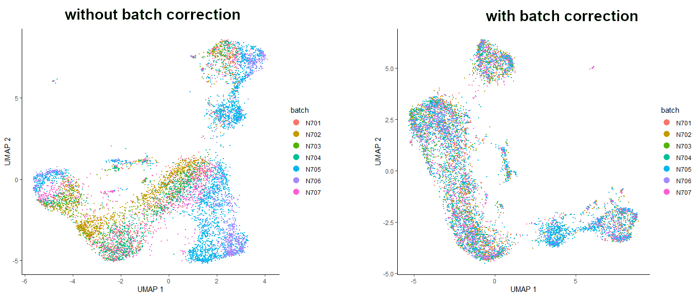<figcaption><span class="figcaption-prefix"><strong>Figure 6</strong>:</span> Comparison of the dataset before and after batch correction.</figcaption></figure></a>

:::{.question}
<div class="box-title question-title" id="question-1"><i class="far fa-question-circle" aria-hidden="true" ></i> Question</div>

Does your plot look the same as the one in the Figure?

:::{.solution}
<div class="box-title solution-title" id="solution-1"><button class="gtn-boxify-button solution" type="button" aria-controls="solution-1" aria-expanded="true"><i class="far fa-eye" aria-hidden="true" ></i> Solution<span class="fold-unfold fa fa-minus-square"></span></button></div>

Your plot might be slightly different to the one shown in the Figure but this is fine, as long as you see analogical patterns. Some libraries that you're using might have been updated, giving non-identical output. However, the principle behind the analysis is still the same, so you can peacefully follow the tutorial. Just keep your eyes open and... THINK!

:::

:::

Do you see this? It’s amazing! Batch correction did a great job here! Now the dataset is nicely aligned, and the cells from all the samples are evenly spread throughout the whole dataset. It is worth mentioning that removing batch effects was done using mutual nearest neighbor alignment, a technique introduced by John Marioni's lab (@Haghverdi_2018) and supported by Aaron Lun's package [batchelor](https://bioconductor.org/packages/release/bioc/html/batchelor.html). Also, due to the machine learning elements of the code of this technique - as well as the fact that packages are updated regularly - your plots may not look identical to the ones pictured here. Nevertheless, the interpretation should be the same - the batch corrected plot should show better batch distribution than the uncorrected one.

Now we can move to the next step and perform dimensionality reduction.


:::{.tip}
<div class="box-title tip-title" id="tip-plotting-labels-vs-legend"><button class="gtn-boxify-button tip" type="button" aria-controls="tip-plotting-labels-vs-legend" aria-expanded="true"><i class="far fa-lightbulb" aria-hidden="true" ></i> Tip: Plotting: labels vs legend<span class="fold-unfold fa fa-minus-square"></span></button></div>

When creating graphs, we sometimes use labels and sometimes just a legend. You can choose whichever you think makes the data clear and readable.

If you want to use a legend, then specify an argument `label_cell_groups=FALSE` in the function `plot_cells()`.

The labels are set automatically, but if you want to change their size (default labels are tiny), use the argument `group_label_size`.
:::


## Clustering: clusters
We want to get some information about cell types, don’t we? In order to do so, we have to cluster our cells first.
Monocle uses a technique called "community detection" (@Traag_2019) to group cells. This approach was introduced by @Levine_2015 as part of the phenoGraph algorithm.
Monocle also divides the cells into larger, more well separated groups called partitions, using a statistical test from @Wolf_2019, introduced as part of their [PAGA](https://github.com/theislab/paga) algorithm.

:::{.details}
<div class="box-title details-title" id="details-clusters-vs-partitions"><button class="gtn-boxify-button details" type="button" aria-controls="details-clusters-vs-partitions" aria-expanded="true"><i class="fas fa-info-circle" aria-hidden="true" ></i> Details: Clusters vs partitions<span class="fold-unfold fa fa-minus-square"></span></button></div>

Clusters are particularly useful while trying to assign cells to a certain type, because they are based on the similarity in gene expression. The relationships between different clusters are analysed to identify possible trajectories.

Partitions, meanwhile, are larger groups of cells that usually contain several clusters. Trajectory inference is performed only within one partition, so it is essential that all the cells that we want to analyse in pseudotime belong to the same partition.

:::

Therefore, let’s perform clustering and visualise the resulting clusters.
```{r}
# clustering
cds_auto_cluster <- cluster_cells(cds_red_dim, reduction_method = "UMAP")
```
```{r}
# see the clusters
plot_cells(cds_auto_cluster, reduction_method = "UMAP", color_cells_by = 'cluster', group_label_size = 5)     
```

When using standard igraph louvain clustering, the value of resolution parameter is by default set to NULL, which means that it is determined automatically. Although the resulting clusters are OK, it would be nice to get some more granularity to identify cell types more specifically. The higher the resolution value, the more clusters we get. We will set the resolution value to 0.0002, but you are very welcome to try different values to see the changes.

```{r}
# clustering with changed resolution value
cds_clustered <- cluster_cells(cds_red_dim, reduction_method = "UMAP", resolution = 0.0002)
```
```{r}
# see the new clusters
plot_cells(cds_clustered, reduction_method = "UMAP", color_cells_by = 'cluster', group_label_size = 5) 	
```

<a href="../../images/scrna-casestudy-monocle/clusters_compare.png" rel="noopener noreferrer"><figure id="figure-7" style="max-width: 90%; margin:auto;">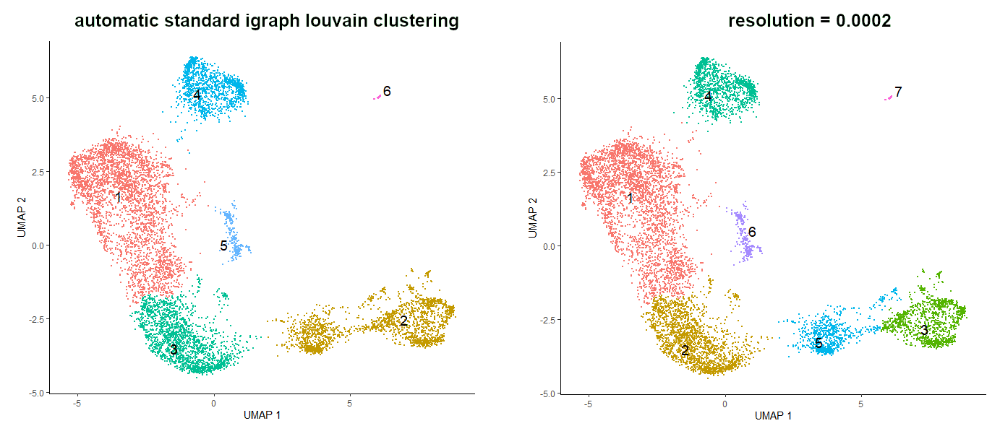<figcaption><span class="figcaption-prefix"><strong>Figure 7</strong>:</span> Comparison of the clusters formed using standard igraph louvain clustering and using resolution argument set to 0.0002.</figcaption></figure></a>


## Clustering: partitions
OK, what about partitions? They were also created during the clustering step and it’s important to check them before calculating the trajectory because it is performed only within one partition. It is essential that all the cells that we want to analyse in pseudotime belong to the same partition.
```{r}
# see the partitions
plot_cells(cds_clustered, reduction_method = "UMAP", color_cells_by = 'partition', label_cell_groups=FALSE)
```

While your plot might be slightly different due to package updates, we can see that there are 3 partitions identified in `cds_clustered` object. Ideally, we would like to combine partitions 1 and 2 to draw a trajectory through all those cells (we can ignore cells in outlier partition). Sometimes using the default values might result in multiple partitions while you only need one. Then you would have to change the q-value cutoff in `partition_qval`. The default is 0.05 and by increasing this value you can increase the span of partitions, meaning that you would get fewer partitions. When trying different values of q-value, you also have to check if the clusters didn't change. It's all about finding a balance between the value of `resolution` and `partition_qval` so that both clusters and partitions are satisfactory enough for downstream analysis. Let's try that on our dataset.

```{r}
# changing the partition q-value
cds_clustered <- cluster_cells(cds_red_dim, reduction_method = "UMAP", resolution = 0.0002, partition_qval = 1)
```
```{r}
# see the partitions with the changed q-value
plot_cells(cds_clustered, reduction_method = "UMAP", color_cells_by = 'partition', label_cell_groups=FALSE)
```
```{r}
# check if clusters didn't change
plot_cells(cds_clustered, reduction_method = "UMAP", color_cells_by = 'cluster', label_cell_groups=FALSE)
```

:::{.question}
<div class="box-title question-title" id="question-2"><i class="far fa-question-circle" aria-hidden="true" ></i> Question</div>

Have the clusters change after changing the partition q-value?

:::{.solution}
<div class="box-title solution-title" id="solution-2"><button class="gtn-boxify-button solution" type="button" aria-controls="solution-2" aria-expanded="true"><i class="far fa-eye" aria-hidden="true" ></i> Solution<span class="fold-unfold fa fa-minus-square"></span></button></div>

It might be the case that after changing partition q-value, you will notice that additional clusters appeared. In that situation, you might either play around the `resolution` and `partition_qval` values, go forward with the current clustering (adjusting the parameters accordingly), or check the other method of assigning cells to one partition given below.

:::

:::

Now we have cells of interest in one partition, we still have reasonable clusters, so now we can learn the trajectory. However, in some cases even this method might not be enough. Then, there is a last resort… assigning cells to a partition manually.

## Additional step: assigning cells to one partition
:::{.warning}
<div class="box-title warning-title" id="warning-additional-step-1"><i class="fas fa-exclamation-triangle" aria-hidden="true" ></i> Warning: Additional step</div>
This step is not necessary for the dataset we are working on but some users might find it helpful when analysing their own data.

:::

Let’s assume we have 4 partitions that cannot be extended to one big partition using `partition_qval` (it might sound unreasonable but it does happen!) and we are desperate to have all the cells in one partition to draw a trajectory through all of them. We can simulate the initial dataset by setting `partition_qval` value to 0.0001.
```{r}
# simulate the dataset
cds_partitions_extra <- cluster_cells(cds_red_dim, reduction_method = "UMAP", partition_qval = 0.0001)		
```
```{r}
# see the simulated partitions
plot_cells(cds_partitions_extra, reduction_method = "UMAP", color_cells_by = 'partition', label_cell_groups=FALSE)
```
```{r}
# store ‘1’ the number of times equal to the number of cells
big_partition <- c(rep(1,length(cds_partitions_extra@colData@rownames))) 	
```
```{r}
# take the barcode of each cell and assign ‘1’ to each of them (now the ‘ones’ are named)
names(big_partition) <- cds_partitions_extra@colData@rownames 	
```
```{r}
# convert from numeric to factor
big_partition <- as.factor(big_partition)
```
```{r}
# assign the created barcodes-partition list to the location where information about partitions is stored in CDS object
cds_partitions_extra@clusters$UMAP$partitions <- big_partition 	
```
```{r}
# see the new partition assignment
plot_cells(cds_partitions_extra, reduction_method = "UMAP", color_cells_by = 'partition', label_cell_groups=FALSE)
```

<a href="../../images/scrna-casestudy-monocle/partitions_compare.png" rel="noopener noreferrer"><figure id="figure-8" style="max-width: 90%; margin:auto;">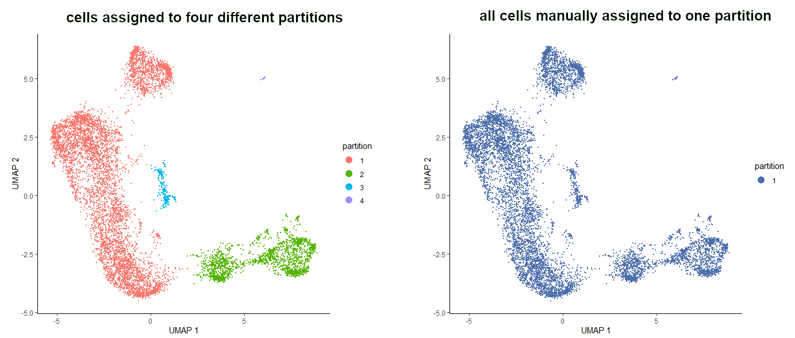<figcaption><span class="figcaption-prefix"><strong>Figure 8</strong>:</span> The result of the manual assignment of all the cells to one partition.</figcaption></figure></a>


:::{.details}
<div class="box-title details-title" id="details-and-operators"><button class="gtn-boxify-button details" type="button" aria-controls="details-and-operators" aria-expanded="true"><i class="fas fa-info-circle" aria-hidden="true" ></i> Details: @ and $ operators<span class="fold-unfold fa fa-minus-square"></span></button></div>

As you saw above, we used `@` and `$` operators to navigate in CDS object. What is the difference between them? `$` operator is used to access one variable/column, while `@` extracts the contents of a slot in an object with a formal (S4) class structure. If you use `View()` function on our CDS object, you will see the elements of type "S4" that you can access using `@` operator. The suggestion list of elements that can be accessed should also pop up as you type the name of the object followed by the corresponding operator.

:::

# Assigning cell types
There are two main approaches to assigning cell types to clusters that we’ve just identified – supervised and unsupervised, both based on gene expression in each cluster.

## Supervised approach
The supervised approach relies on prior knowledge of which cell types to expect. We can simply check the expression of marker genes specific to the expected cell types. Let’s then check the markers mentioned in the original paper @Bacon2018.

| Marker | Cell type |
|--------------------|
| Il2ra    | Double negative (early T-cell)    |
| Cd8b1, Cd8a, Cd4    | Double positive (middle T-cell)|
| Cd8b1, Cd8a, Cd4 - high | Double positive (late middle T-cell)|
| Itm2a    | Mature T-cell |
| Aif1    | Macrophages    |
| Hba-a1    | RBC    |

To plot the expression of all those genes across our dataset in one go, we will pass a vector with the names of those markers into a parameter `genes` in the `plot_cells` function.
```{r}
# expression of marker genes across the sample
plot_cells(cds_clustered, genes=c('Il2ra','Cd8b1','Cd8a','Cd4','Itm2a','Aif1','Hba-a1'), reduction_method = "UMAP")
```

<a href="../../images/scrna-casestudy-monocle/genes.png" rel="noopener noreferrer"><figure id="figure-9" style="max-width: 90%; margin:auto;">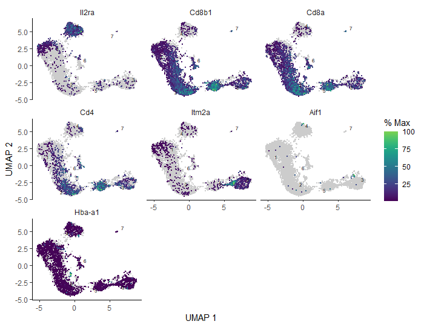<figcaption><span class="figcaption-prefix"><strong>Figure 9</strong>:</span> Expression of the reference marker genes across analysed sample.</figcaption></figure></a>


:::{.question}
<div class="box-title question-title" id="question-genes-cell-types-and-clusters"><i class="far fa-question-circle" aria-hidden="true" ></i> Question: Genes, cell types and clusters</div>
Based on the gene expression graph that we just generated, the table above and your knowledge from the previous tutorials, how would you assign the clusters?

:::{.solution}
<div class="box-title solution-title" id="solution-3"><button class="gtn-boxify-button solution" type="button" aria-controls="solution-3" aria-expanded="true"><i class="far fa-eye" aria-hidden="true" ></i> Solution<span class="fold-unfold fa fa-minus-square"></span></button></div>

Keep in mind that these results refer to our numbered clusters, while yours might be slightly different.
- `Il2ra` (DN): mostly expressed in cluster 4
- `Cd8b1, Cd8a` (DP middle): expressed in clusters 1, 6, and highly in cluster 2
- `Cd4` (DP late): average expression in clusters 1, 6, 2 and high expression in cluster 5
- `Itm2a` (T-mat): expressed in cluster 3
- `Aif1` (macrophages): barely anything here, minimal expression spread across the sample with some more cells in cluster 4 and 3 – not enough to form a distinct cluster though). In theory, we shouldn’t have any macrophages in our sample. If you remember from the previous tutorials, we actually filtered out macrophages from the sample during the processing step, because we worked on annotated data. When analysing unannotated data, we could only assign macrophages and then filter them out, provided that Monocle clusters them into a separate group. As you can see, it’s not the case here, so we will just carry on with the analysis, interpreting this as a contamination.
- `Hba-a1` (RBC): appears throughout the entire sample in low numbers suggesting some background contamination of red blood cell debris in the cell samples during library generation, but also shows higher expression in a distinct tiny bit of cluster 3, at the border between clusters 1 and 5. However, it’s too small to be clustered into a separate group and filtered out in this case.
If you remember, this gene was found to be expressed in the previous Scanpy tutorial also in low numbers across the sample, and in the other Monocle tutorial (using Galaxy tools and annotated data) algorithms allowed us to gather the cells expressing that gene into a distinct group. Our result now sits somewhere in between.
<a href="../../images/scrna-casestudy-monocle/hb_all.png" rel="noopener noreferrer"><figure id="figure-10" style="max-width: 90%; margin:auto;">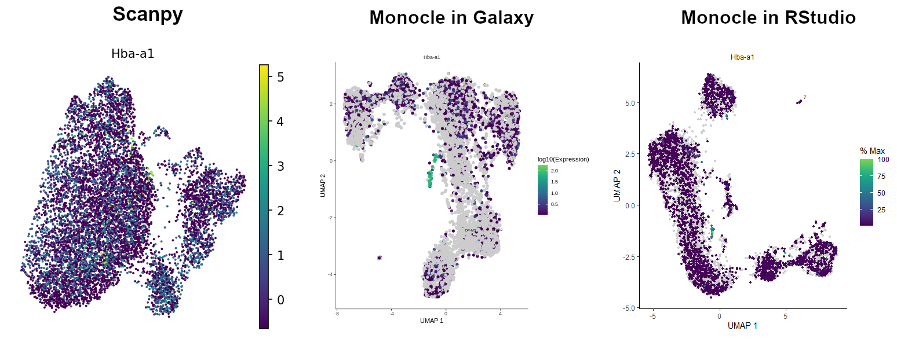<figcaption><span class="figcaption-prefix"><strong>Figure 10</strong>:</span> Hemoglobin across clusters - comparison between Scanpy, Monocle using Galaxy tools and Monocle run in RStudio.</figcaption></figure></a>

:::
:::

Having identified which cluster corresponds to a specific cell type, we can finally run some code to add the annotation to our CDS object. First, we will create a new column called `cell_type`  in `colData()` - this is where the information about the cells is stored (eg. batch, genotype, sex, etc) - and initialize it with the values of clusters. Then, we will get the `dplyr` package which will be used for cluster annotation.

```{r}
# just to keep the objects tidy and not overwrite them so that you can come back to any point of the analysis
cds_annotated <- cds_clustered 	
```
```{r}
# create a new column ‘cell_type’ and initialise it with clusters values
colData(cds_annotated)$cell_type <- as.character(clusters(cds_annotated)) 	
```
```{r}
# annotate clusters
colData(cds_annotated)$cell_type <- dplyr::recode(colData(cds_annotated)$cell_type,
                                                       '1'='DP-M1',   # double positive – middle T-cell (1st cluster)
                                                       '2'='DP-M2',	  # double positive – middle T-cell (2nd cluster)
                                                       '3'='T-mat',	  # mature T-cell
                                                       '4'='DN',		  # double negative – early T-cell
                                                       '5'='DP-L',	  # double positive – late middle T-cell
                                                       '6'='DP-M3',	  # double positive – middle T-cell (3rd cluster)
                                                       '7'='Unknown') # no info for now, so call it ‘Unknown’
                                                       '8'='Unknown') # no info for now, so call it ‘Unknown’
```
```{r}
# check the annotation
plot_cells(cds_annotated, color_cells_by="cell_type", label_cell_groups=FALSE)    
```

<a href="../../images/scrna-casestudy-monocle/annotated.png" rel="noopener noreferrer"><figure id="figure-11" style="max-width: 90%; margin:auto;">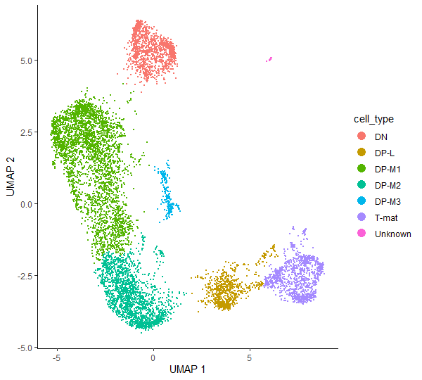<figcaption><span class="figcaption-prefix"><strong>Figure 11</strong>:</span> Our annotated dataset.</figcaption></figure></a>

## Unsupervised approach
But what if we don’t have any reference that we can use to assign our clusters? In that case, we will turn to the mentioned unsupervised approach - we will check what are the specifically expressed genes for each cluster. Then we can identify the cell types by looking up what cell types contain those genes. That’s a more tedious process, but sometimes can lead to exciting and unexpected results.
We will use Monocle’s function `top_markers()` and store the information about specifically expressed genes for each cluster in the data frame `marker_test`.
```{r}
# find top marker genes in each cluster
marker_test <- top_markers(cds_clustered, group_cells_by="cluster", reduction_method = "UMAP", reference_cells=1000, cores=8)
```
You can group the cells by any categorical variable in `colData(cds_clustered)`. The parameter `reference_cells` is used to accelerate the marker significance test at some cost in sensitivity. It works by randomly selecting a specified number of cells and performing the marker significance test against a chosen set of cells. If your dataset is not massively big, you might skip this parameter as it wouldn’t help much.

:::{.question}
<div class="box-title question-title" id="question-3"><i class="far fa-question-circle" aria-hidden="true" ></i> Question</div>

What are the variables stored in `marker_test` data frame and what do they mean?

:::{.solution}
<div class="box-title solution-title" id="solution-4"><button class="gtn-boxify-button solution" type="button" aria-controls="solution-4" aria-expanded="true"><i class="far fa-eye" aria-hidden="true" ></i> Solution<span class="fold-unfold fa fa-minus-square"></span></button></div>

Those are 10 variables that you can check easily either using colnames(marker_test) or `View(marker_test)` which will also display all the corresponding values.
- `gene_id` - Ensembl gene ID
- `gene_short_name` - short name of the gene corresponding to its ID
- `cell_group` - a group to which the cell belongs, specified in the `group_cells_by` argument
- `marker_score` - numeric vector of marker scores as the fraction expressing scaled by the specificity. The value ranges from 0 to 1
- `mean_expression` -  numeric vector of mean normalized expression of the gene in the cell group
- `fraction_expressing` - numeric vector of fraction of cells expressing the gene within the cell group
- `specificity` - numeric vector of a measure of how specific the gene's expression is to the cell group based on the Jensen-Shannon divergence. The value ranges from 0 to 1.
- `pseudo_R2` - numeric vector of pseudo R-squared values, a measure of how well the gene expression model fits the categorical data relative to the null model. The value ranges from 0 to 1.
- `marker_test_p_value` - numeric vector of likelihood ratio p-values; p-value is an area in the tail of a distribution that tells you the odds of a result happening by chance
- `marker_test_q_value` -  numeric vector of likelihood ratio q-values; q-value is a p-value that has been adjusted for the False Discovery Rate (FDR)

:::

:::

We can now use data in `marker_test` to rank the cells based on one of the specificity metrics and take the top gene(s) for each cluster. We will filter the expressing cells that constitute more than 10% of the cell group and we will take one gene in each cluster with the highest `pseudo_R2` value (you can of course modify this value and choose more genes to be selected).

```{r}
# filter the ‘marker_test’ data frame
top_specific_markers <- marker_test %>%
                            dplyr::filter(fraction_expressing >= 0.10) %>%       # set the fraction of expressing cells
                            dplyr::group_by(cell_group) %>%                      # set a group to which the cells belong
                            dplyr::top_n(1, pseudo_R2)                           # set the number of top genes and the variable from 'marker_test' to rank by
```
```{r}
# store the names of the marker genes
# you can also use IDs, the conversion to gene names should happen automatically when plotting
top_marker_names <- unique(top_specific_markers %>% dplyr::pull(gene_short_name))
```

Now we have all elements to plot the expression and fraction of cells that express found markers in each group.

```{r}
plot_genes_by_group(cds_clustered,                    # our CDS object
                    top_marker_names,                 # a list of gene names to show in the plot
                    group_cells_by="cluster",         # how to group cells when labeling
                    ordering_type="maximal_on_diag")  # how to order the genes / groups on the dot plot
```

:::{.tip}
<div class="box-title tip-title" id="tip-unexpectedly-too-many-genes-on-y-axis"><button class="gtn-boxify-button tip" type="button" aria-controls="tip-unexpectedly-too-many-genes-on-y-axis" aria-expanded="true"><i class="far fa-lightbulb" aria-hidden="true" ></i> Tip: Unexpectedly too many genes on y-axis?<span class="fold-unfold fa fa-minus-square"></span></button></div>

If you notice that on your dot plot any cluster has more genes than you specified (here we set one gene per cluster `top_n(1, pseudo_R2)`), go back to the code and create a new cell, right after assigning `top_specific_markers` object and just before `top_marker_names`. In the new cell, paste and execute the following:

```{r}
top_specific_markers <- top_specific_markers %>%
dplyr::distinct(pseudo_R2, .keep_all=TRUE)     # select only one row if there are multiple rows with the same value in 'pseudo_R2' column
```
Then you can execute `top_marker_names` again and see how the plot looks like now. Better, right?
This problem may arise when several genes in one cluster have the same values of specific variable from 'marker_test' (in our case we chose `pseudo_R2`). It might likely happen in small and quite unsignificant clusters.
:::


<a href="../../images/scrna-casestudy-monocle/gene_group.png" rel="noopener noreferrer"><figure id="figure-12" style="max-width: 90%; margin:auto;">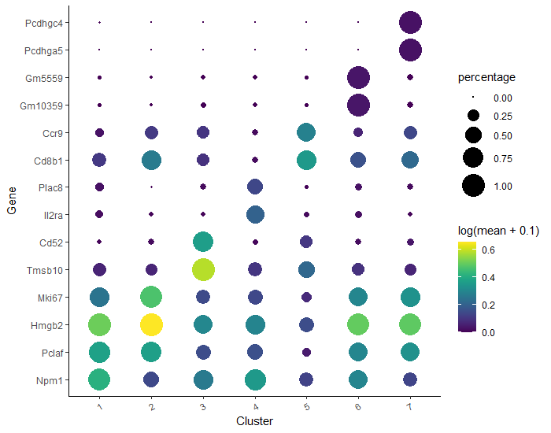<figcaption><span class="figcaption-prefix"><strong>Figure 12</strong>:</span> A plot of the expression and fraction of cells that express found markers in each group. Here, the two top genes from each cluster were plotted on diagonal beased on the highest pseudo_R2 score. Shown is the result of changing the value from 1 to 2 in "top_n(1, pseudo_R2)" in the code above.</figcaption></figure></a>

Look at this – we have identified some more marker genes specific to each cluster! However, sometimes it happens that the found genes are not as specific as one would expect, and they appear across the whole sample. Therefore, it is a good idea to plot all those marker genes and check how they appear in the bigger picture.

```{r}
# plot the identified genes to check their expression
plot_cells(cds_clustered, genes=c('Pcdhgc4','Pcdhga5','Gm5559','Gm10359','Ccr9','Cd8b1','Plac8', 'Il2ra', 'Cd52', 'Tmsb10', 'Mki67', 'Hmgb2', 'Pclaf', 'Npm1'), reduction_method = "UMAP")
```

<a href="../../images/scrna-casestudy-monocle/markers_plot.png" rel="noopener noreferrer"><figure id="figure-13" style="max-width: 90%; margin:auto;">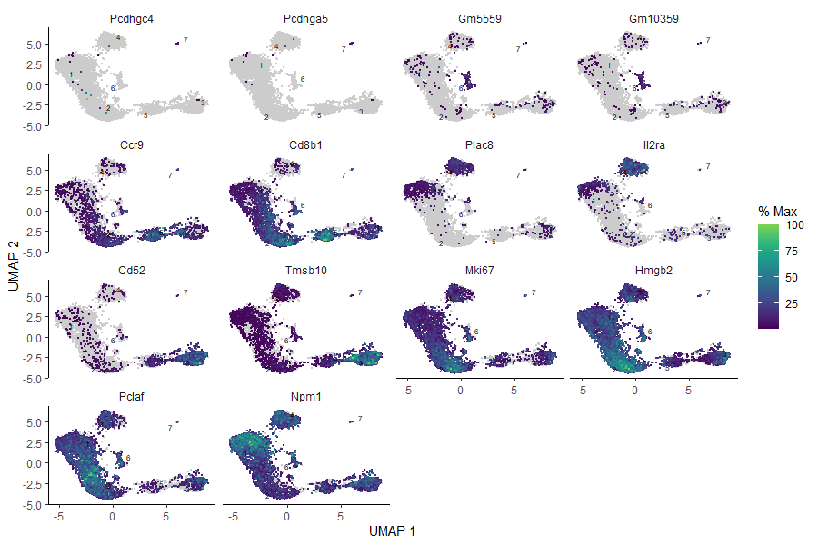<figcaption><span class="figcaption-prefix"><strong>Figure 13</strong>:</span> Plots of the expression of marker genes across the sample.</figcaption></figure></a>

Further steps from now would include reviewing literature and checking what cell types correspond to the genes expressed in each cluster. Then you can annotate your clusters in the same way as shown above. Once you have your clusters annotated, Monocle can generate a file of marker genes for the identified cell types. This file can be then used with [Garnett](https://cole-trapnell-lab.github.io/garnett/), a software toolkit for automatically annotating cells. We will not go through this in the current tutorial, but we will generate the file of marker genes.

```{r}
# use ‘top_markers()’ again, now grouping cells by the assigned cell type
assigned_marker_test <- top_markers(cds_annotated,
                                             group_cells_by="cell_type",
                                             reference_cells=1000,
                                             cores=8)
```
```{r}
# filter these markers according to how stringent you want to be
garnett_markers <- assigned_marker_test %>%
                        dplyr::filter(marker_test_q_value < 0.05 & specificity >= 0.25) %>%
                        dplyr::group_by(cell_group) %>%
                        dplyr::top_n(5, marker_score)
```
```{r}
# exclude genes that are good markers for more than one cell type:
garnett_markers_filtered <- garnett_markers %>%
                        dplyr::group_by(gene_short_name) %>%
                        dplyr::filter(dplyr::n() == 1)
```
```{r}
# generate a file of marker genes
generate_garnett_marker_file(garnett_markers_filtered, file="./marker_file.txt")
```

A new file should appear in the ‘Files’ window. If you click on it, you will see the cell types and their corresponding marker genes, satisfying your chosen conditions.

:::{.tip}
<div class="box-title tip-title" id="tip-marker-genes-file"><button class="gtn-boxify-button tip" type="button" aria-controls="tip-marker-genes-file" aria-expanded="true"><i class="far fa-lightbulb" aria-hidden="true" ></i> Tip: Marker genes file<span class="fold-unfold fa fa-minus-square"></span></button></div>

Note that you can use the above block of code to generate file with the marker genes for unannotated CDS object to help you identify and check specifically expressed genes – you’d only have to change `group_cells_by` parameter from "cell_type" to “cluster”.
:::


:::{.tip}
<div class="box-title tip-title" id="tip-only-for-users-of-local-rstudio"><button class="gtn-boxify-button tip" type="button" aria-controls="tip-only-for-users-of-local-rstudio" aria-expanded="true"><i class="far fa-lightbulb" aria-hidden="true" ></i> Tip: Only for users of local RStudio<span class="fold-unfold fa fa-minus-square"></span></button></div>

If you are working in RStudio locally, you might want to try a great function `choose_cells()`, which allows you to make a subset of the CDS object containing only cells of interest to investigate certain clusters more in-depth. It only works in interactive mode, so can be only used locally - when you call it, then a pop-up window will appear where you can choose cells to subset.
```{r}
# create a CDS subset
cds_subset <- choose_cells(cds_clustered)
```
Now the chosen cluster is stored as a separate CDS object and you can analyse it independently, using the methods described above.

:::

# Trajectory inference
It’s time to perform trajectory analysis! First, let’s learn the trajectory graph. With an argument `use_partition` we can specify if we want to learn a disjoint graph (value TRUE - default) in each partition, or to learn a single graph (value FALSE) across all partitions. The thing is, we can visualise the cells in pseudotime only if they belong to one partition. This is why it is important to make sure that all the cells that you want to analyse in pseudotime belong to one partition.

In one of the previous sections we've already prepared the partitions for trajectory inference - we assigned all the cells of interest into one partition by changing the q-value. As a result, we got two partitions – one containing only the cells that we labeled as ‘Unknown’ and another including all other cells. That is a perfect assignment – we’d like to focus only on maturation of T-cells, so we don’t want to connect those two partitions (therefore we specify `use_partition=TRUE` to get a disjoint graph) and we will work downstream only on the graph going through annotated T-cells.

```{r}
# learn trajectory graph
cds_trajectory <- learn_graph(cds_annotated, use_partition=TRUE)
```
```{r}
# visualise the learned trajectory
plot_cells(cds_trajectory,
           color_cells_by = "cell_type",
           label_cell_groups=FALSE,
           label_groups_by_cluster=FALSE,
           label_leaves=FALSE,
           label_branch_points=FALSE)
```

<a href="../../images/scrna-casestudy-monocle/learned_trajectory_r.png" rel="noopener noreferrer"><figure id="figure-14" style="max-width: 90%; margin:auto;"><figcaption><span class="figcaption-prefix"><strong>Figure 14</strong>:</span> Learned trajectory graph.</figcaption></figure></a>

We have to tell Monocle where to start ordering the cells, ie. when we expect the analysed biological process to begin. Thanks to our biological knowledge, we know that the beginning of the trajectory should be at DN cluster.
There are a couple of ways to specify the root cells:

## Option 1: Root nodes
Here, you will use `root_pr_nodes` argument in `order_cells()` function.

To find the names of the principal points, you have to plot the learned trajectory again, specifying `label_principal_points = TRUE`
```{r}
# specifying root cells: `root_pr_nodes` argument - check the principal points
plot_cells(cds_trajectory,
          color_cells_by = "cell_type",
          label_cell_groups=FALSE,
          label_groups_by_cluster=FALSE,
          label_leaves=FALSE,
          label_branch_points=FALSE,
          label_principal_points = TRUE,       # set this to TRUE
          graph_label_size=3)
```
You can see now the principal points and their labels in the form `Y_number`. Pick the principal point in the cluster that you expect to be the beginning of the trajectory and type its name in the `root_pr_nodes` argument when calling `order_cells()` function.

```{r}
# specifying root cells: `root_pr_nodes` argument - use the relevant principal point
cds_order_1 <- order_cells(cds_trajectory, root_pr_nodes='Y_14')
```

There is also a helper function to identify the root principal points based on the annotated cell types. This function uses `pr_graph_cell_proj_closest_vertex` which is just a matrix with a single column that stores for each cell, the ID of the principal graph node it's closest to.

```{r}
# a helper function to identify the root principal points
get_correct_root_state <- function(cds, cell_phenotype, root_type){
      cell_ids <- which(pData(cds)[, cell_phenotype] == root_type)

      closest_vertex <- cds@principal_graph_aux[["UMAP"]]$pr_graph_cell_proj_closest_vertex
      closest_vertex <- as.matrix(closest_vertex[colnames(cds), ])
      root_pr_nodes <- igraph::V(principal_graph(cds)[["UMAP"]])$name[as.numeric(names
                                                                    (which.max(table(closest_vertex[cell_ids,]))))]       
      root_pr_nodes
      }
```
```{r}
# call the function to automatically find the node in the principal graph where our DN cells reside
DN_node_id = get_correct_root_state(cds_trajectory, cell_phenotype = 'cell_type', "DN")

DN_node_id      # check the node found
```
```{r}
# order cells using the helper function output
cds_order_1_helper <- order_cells(cds_trajectory, root_pr_nodes = DN_node_id)
```

## Option 2: Root cells
Here, you will use `root_cells` argument in `order_cells()` function.

Specify a vector of starting cell IDs. You can provide only one cell as well as all cells of a given type.

```{r}
# find the names of all cells belonging to a certain type, identified as a beginning of a trajectory
starting_cell_type <- 'DN'
index <- which(cds_trajectory@colData$cell_type == starting_cell_type)
DN_cells <- colnames(cds_trajectory)[index]
```
```{r}
# alternatively, if you work on unannotated data, you can use the number of the cluster that should be used as the beginning of the trajectory and pass it in the ‘root_cells’ argument
starting_cluster <- colnames(cds_trajectory[,clusters(cds_trajectory) == 4])
```
```{r}
# order cells
cds_order_2 <- order_cells(cds_trajectory, root_cells = DN_cells)
```

:::{.tip}
<div class="box-title tip-title" id="tip-only-for-users-of-local-rstudio-1"><button class="gtn-boxify-button tip" type="button" aria-controls="tip-only-for-users-of-local-rstudio-1" aria-expanded="true"><i class="far fa-lightbulb" aria-hidden="true" ></i> Tip: Only for users of local RStudio<span class="fold-unfold fa fa-minus-square"></span></button></div>

If you are working in RStudio locally, you can use `order_cells()` function in the interactive mode. The pop-up window should appear and then you can simply select root nodes in the cluster with the cell type identified as the beginning of the trajectory.

```{r}
# specifying root cells: pop up window
cds_order_1 <- order_cells(cds_trajectory)
```

:::

# Plotting in pseudotime

You can use any `cds_order` object for the downstream analysis. Let’s pick one and assign it to an object with a shorter and more general name.
```{r}
cds_order <- cds_order_1_helper
```

The function `order_cells()` calculates pseudotime for each cell, so we can now visualise the T-cell maturation process in pseudotime! Additionally, we can access it and store in our CDS object for further analysis.

```{r}
# plot cells in pseudotime
plot_cells(cds_order,
           color_cells_by = "pseudotime",
           label_cell_groups=FALSE,
           label_leaves=FALSE,
           label_branch_points=FALSE)
```
```{r}
# access pseudotime calculated for each cell and store it alongside cell metadata
pseudotime <- pseudotime(cds_order) 	
cds_order@colData$pseudotime <- pseudotime 		 
```

<a href="../../images/scrna-casestudy-monocle/pseudotime_r.png" rel="noopener noreferrer"><figure id="figure-15" style="max-width: 90%; margin:auto;">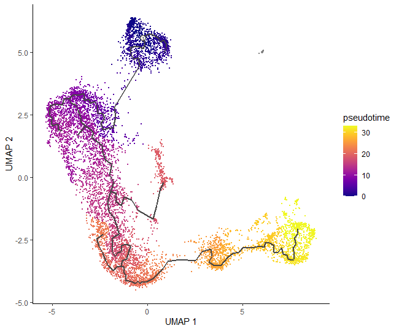<figcaption><span class="figcaption-prefix"><strong>Figure 15</strong>:</span> Cells ordered in pseudotime.</figcaption></figure></a>

We can now see how our hard work has come together to give a final pseudotime trajectory analysis, which starts at double negative cells, then gently switches to double positives: from middle to late T-cells, and ends up on mature T-cells.

# Differential expression analysis
There are two approaches for more advanced differential analysis in Monocle:
- Regression analysis: using `fit_models()`, you can evaluate whether each gene depends on variables such as time, treatments, etc.
- Graph-autocorrelation analysis: using `graph_test()`, you can find genes that vary over a trajectory or between clusters.

In this section, for some examples, we will work on the subset of our CDS object because the computation time for the whole dataset would take quite some time. Let’s make the subset CDS containing the information about the genes listed in the table in the previous section, so instead having 15395 elements, it will have only 7.
```{r}
# make the subset CDS
test_genes=c('Il2ra','Cd8b1','Cd8a','Cd4','Itm2a','Aif1','Hba-a1')
cds_subset <- cds_order[rowData(cds_order)$gene_short_name %in% test_genes,]
```

## Some more plotting
Monocle also provides some easy ways to plot the expression of a small set of genes grouped by the factors you use during differential analysis.
For example `plot_genes_violin()` allows us to create violin plots which are quite common in the field. Therefore let’s visualise how the gene expression changes between the cell types.
```{r}
# produce violin plots
plot_genes_violin(cds_subset, group_cells_by="cell_type", ncol=2)
```

<a href="../../images/scrna-casestudy-monocle/violin_plots.png" rel="noopener noreferrer"><figure id="figure-16" style="max-width: 90%; margin:auto;">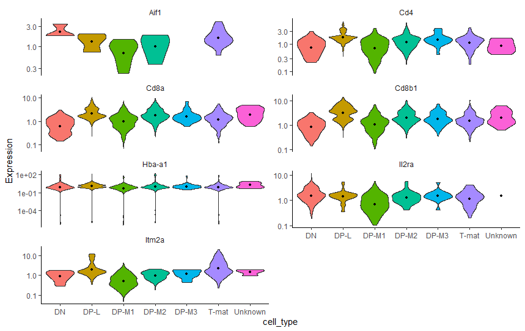<figcaption><span class="figcaption-prefix"><strong>Figure 16</strong>:</span>  Violin plots of the expression of the specified genes in each assigned cell type.</figcaption></figure></a>

When analysing the above violin plots, we will realise that the results are consistent with the detailed analysis in the previous tutorials, as well as findings in current tutorial.

Another great function `plot_genes_in_pseudotime()` takes a small set of genes and shows their dynamics as a function of pseudotime.
```{r}
plot_genes_in_pseudotime(cds_subset, color_cells_by="cell_type", min_expr=0.5)
```

<a href="../../images/scrna-casestudy-monocle/genes_in_pseudotime.png" rel="noopener noreferrer"><figure id="figure-17" style="max-width: 90%; margin:auto;"><figcaption><span class="figcaption-prefix"><strong>Figure 17</strong>:</span>  A visualisation of how specified genes change in the pseudotime.</figcaption></figure></a>


## Regression analysis - advanced
We will use a function which fits a generalized linear model for each gene in a CDS object. We have to specify the model formula which is any term that exists as a column in `colData()`. We want to test genes that differ between cell types and batches, so we will use "~cell_type + batch" argument. Then, we extract a table of coefficients from each model. `coefficient_table()` tests whether each coefficient differs significantly from zero under the [Wald test](https://en.wikipedia.org/wiki/Wald_test).

```{r}
# fit a generalized linear model for each gene
gene_fits <- fit_models(cds_subset, model_formula_str = "~cell_type + batch")
```
```{r}
# extract a table of coefficients
fit_coefs <- coefficient_table(gene_fits) 	
```
```{r}
# preview the content of 'fit_coefs'
head(fit_coefs)
```
If you inspect the `fit_coefs` object, you will notice that the table includes one row for each term of each gene's model. We generally don't care about the intercept term, so we can filter it out. In this way, we will be able to control for the chosen factors. To focus on only one variable, you have to check the `term` column in the `fit_coefs` and pass this as an argument for filtering. Then, you should also filter the results with q_value < 0.05 to control the false discovery rate.

```{r}
# filter out Intercept term
no_intercept_coefs <- fit_coefs %>% dplyr::filter(term != "(Intercept)") 	
```
```{r}
# extract results for DP-M1 cells only
DP_M1_coefs <- fit_coefs %>% dplyr::filter(term == "cell_typeDP-M1") 	
```
```{r}
# control the false discovery rate and choose only several variables to store
DP_M1_coefs_filtered <- DP_M1_coefs %>% dplyr::filter (q_value < 0.05) %>%
  dplyr::select(gene_short_name, term, q_value, estimate)		
```
```{r}
# view the resulting table
DP_M1_coefs_filtered
```
The resulting table shows the genes that differ depending on the chosen term. Maybe this function is not very helpful in the case of our dataset, but may be useful when analysing unannotated data or choosing another term from `colData()`.

## Graph-autocorrelation analysis - advanced
Alongside regression analysis, Monocle also provides another way of finding genes that vary between groups of cells. The function `graph_test()` uses a statistic from spatial autocorrelation analysis called [Moran's I](https://en.wikipedia.org/wiki/Moran%27s_I), which @Cao_2019 showed to be effective in finding genes that vary in single-cell RNA-seq datasets. Let’s try to perform this step on our full dataset (be patient!).
```{r}
# run autocorrelation test
graph_test_res <- graph_test(cds_order, neighbor_graph="knn", cores=8)
```

The output data frame has a bunch of statistical values that you can use to rank the genes by, for example `morans_I` column, which ranges from -1 to +1. A value of 0 indicates no effect, while +1 indicates perfect positive autocorrelation and suggests that nearby cells have very similar values of a gene's expression.

We will now try to associate genes with clusters by grouping genes into modules that have similar patterns of expression. You can call `find_gene_modules()`, which essentially runs UMAP on the genes (as opposed to the cells) and then groups them into modules using Louvain community analysis.

```{r}
# get gene IDs for which q-value < 0.05
pr_deg_ids <- row.names(subset(graph_test_res, q_value < 0.05)) 	
```
```{r}
# group genes into modules
gene_module_df <- find_gene_modules(cds_order[pr_deg_ids,], resolution=1e-2) 	
```
Now we can show the aggregate expression of all genes in each module across all the clusters. Monocle provides a simple utility function called `aggregate_gene_expression` for this purpose:

```{r}
# aggregate expression of genes in each module
cell_group_df <- tibble::tibble(cell=row.names(colData(cds_order)),
                                cell_group=clusters(cds_order)[colnames(cds_order)])
agg_mat <- aggregate_gene_expression(cds_order, gene_module_df, cell_group_df)
row.names(agg_mat) <- stringr::str_c("Module ", row.names(agg_mat))
colnames(agg_mat) <- stringr::str_c("Cluster ", colnames(agg_mat))
```
We can now use this data to create a heatmap. Don't worry if yours look a little bit different that the one shown in this tutorial. The general features should be maintained though.
```{r}
# create a heatmap
pheatmap::pheatmap(agg_mat, cluster_rows=TRUE, cluster_cols=TRUE,
                   scale="column", clustering_method="ward.D2",
                   fontsize=6)
```
<a href="../../images/scrna-casestudy-monocle/heatmap.png" rel="noopener noreferrer"><figure id="figure-18" style="max-width: 90%; margin:auto;">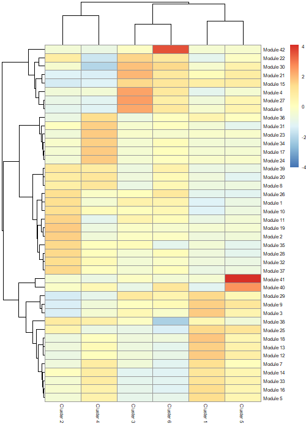<figcaption><span class="figcaption-prefix"><strong>Figure 18</strong>:</span> Heatmap showing modules of co-regulated genes across the clusters.</figcaption></figure></a>

You can also visualise the modules using `plot_cells()` function. We've chosen some modules to see how the differences on a heatmap correlate with the expression shown on our starting plot.

:::{.question}
<div class="box-title question-title" id="question-4"><i class="far fa-question-circle" aria-hidden="true" ></i> Question</div>

Which modules to plot?

:::{.solution}
<div class="box-title solution-title" id="solution-5"><button class="gtn-boxify-button solution" type="button" aria-controls="solution-5" aria-expanded="true"><i class="far fa-eye" aria-hidden="true" ></i> Solution<span class="fold-unfold fa fa-minus-square"></span></button></div>

This is totally up to you! It might be the case that you got different numbering of modules, so then using the numbers specified in the code below won't make much sense. Just look at your heatmap, compare the differences between modules and think which ones would be the most interesing to visualise.

:::

:::

```{r}
# see the chosen modules across the whole sample
plot_cells(cds_order,
           genes=gene_module_df %>% dplyr::filter(module %in% c(40, 39, 36, 17)),
           group_cells_by="cluster",
           color_cells_by="cluster",
           show_trajectory_graph=FALSE)
```
<a href="../../images/scrna-casestudy-monocle/modules_plot.png" rel="noopener noreferrer"><figure id="figure-19" style="max-width: 90%; margin:auto;">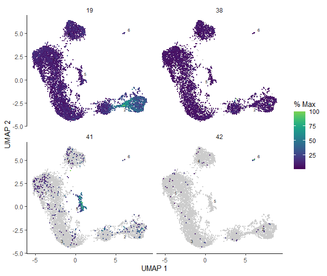<figcaption><span class="figcaption-prefix"><strong>Figure 19</strong>:</span> Plots of expression of the genes belonging to specified modules across whole sample.</figcaption></figure></a>

With the visualisation methods above, you can now come back to the generated data frame `gene_module_df`, filter genes that belong to the module of interest and check their functions to get some more evidence for the correct biological interpretation.


# 3D plotting
Let’s have some fun at the end! That was quite a long and insightful analysis – you definitely deserve to look at some nice, rotatable, cool plot now!
Essentially the workflow is the same as we followed in two dimensions. The crucial part is to specify the dimensionality of the reduced space with the `max_components` parameter in `reduce_dimension()` function. The default is 2, but if we want to see our data in 3D, we will change that value to 3. From there, you can just repeat the next steps in 3D… or just reward yourself for completing this tutorial by toggling this beautiful 3D plot!

```{r}
# reduce dimension to 3D
cds_3d <- reduce_dimension(cds_order, preprocess_method = 'Aligned', max_components = 3)
```
```{r}
# see the resulting 3D plot
plot_cells_3d(cds_3d, color_cells_by="cell_type")
```

# Export your data, figures, and notebook

Don’t forget to save and export your data! First, we will get Jupyter to see those as files.

## Export plots
If you want to export your plot, you have to make sure that you assigned it to an object. For example, if you want to save the plot of cells in pseudotime, simply assign the function you used to generate this plot to an object. Here we call this object `plot_pseudotime`, like so:

```{r}
plot_pseudotime <- plot_cells(cds_order,
           color_cells_by = "pseudotime",
           label_cell_groups=FALSE,
           label_leaves=FALSE,
           label_branch_points=FALSE)
```

Then, if you want to save the plot as PDF:

```{r}
pdf("plot_pseudotime.pdf")             # open the graphical device and specify the directory and the name of the output pdf file
plot_pseudotime                        # specify the object that your plot is assigned to
dev.off()                              # close the graphical device
```

The procedure is very similar if you want to export the file as PNG (or analogically JPEG – just replace png with jpeg):
```{r}
png("plot_pseudotime.png",            # open the graphical device and specify the directory and the name of the output png file
width=600, height=400)                # optionally you can specify the width and height of the final plot
plot_pseudotime                       # specify the object that your plot is assigned to
dev.off()                             # close the graphical device
```

However, it often happens that the quality of the exported PNG and JPEG files is not perfect. For best results, we recommend exporting to SVG:
```{r}
svg("plot_pseudotime.svg")             # open the graphical device and specify the directory and the name of the output svg file
plot_pseudotime                        # specify the object that your plot is assigned to
dev.off()                              # close the graphical device
```

You can do the same with any plot that you want to save! You will find the saved figures in the left panel of your JupyterLab. You can right-click on them and download directly onto your computer. You can also push them into your Galaxy history. To do so, you have to change Kernel to Python3 (either click on `Kernel` -> `Change Kernel...` in the upper left corner of your JupyterLab or click on the displayed current kernel in the upper right corner and change it).
<a href="../../images/scrna-casestudy-monocle/switch_kernel.jpg" rel="noopener noreferrer"><figure id="figure-20" style="max-width: 90%; margin:auto;"> `Change Kernel...` and another arrow pointing to the right corner, showing the icon of the current kernel. The pop-up window asks which kernel should be chosen instead."  width="1760" height=580 loading="lazy"><figcaption><span class="figcaption-prefix"><strong>Figure 20</strong>:</span> Two ways of switching kernel.</figcaption></figure></a>

Check in the upper right corner that selected kernel is Python3, and run the following:
```python
put("marker_file.txt")
put("plot_pseudotime.pdf")
put("plot_pseudotime.png")
```

In this way you can push all the files you've saved into your Galaxy history. You can also do the same with this notebook. The cell below will only work if you haven’t changed the name of the notebook. If you renamed it, simply type its new name in the parenthesis.
```python
put("single-cell-scrna-case_monocle3-rstudio.ipynb")
```

Now you can go check your Galaxy history to make sure your files have all made it back into your Galaxy history.


# After Jupyter

Congratulations! You've made it through Jupyter!

:::{.hands_on}
<div class="box-title hands-on-title" id="hands-on-closing-jupyterlab"><i class="fas fa-pencil-alt" aria-hidden="true" ></i> Hands-on: Closing JupyterLab</div>
1. Click **User**: **Active Interactive Tools**
2. Tick the box of your Jupyter Interactive Tool, and click **Stop**
:::

If you want to run this notebook again, or share it with others, it now exists in your history. You can use this 'finished' version just the same way as you downloaded the directions file and uploaded it into the Jupyter environment.


# Conclusion

If you’re following the Case Study tutorials from the beginning, you have already experienced what it’s like to analyse and question a dataset, potentially without clear cut-offs or clear answers. The [Monocle in Galaxy tutorial](/training-material/topics/single-cell/tutorials/scrna-case_monocle3-trajectories/tutorial.html) was focused more on explaining each step of the trajectory analysis and interpreting the results in the biological context. The current tutorial aims at showing the variety of methods that can be used when Galaxy's Monocle tools are not enough. It shows the potential of batch correction, differential expression analysis and flexibility when using different functions. It's also a guide for those who would like to understand what is happening 'behind the scenes' when clicking on Galaxy buttons.

# References

<div id="refs"></div>

# Key Points

- Monocle3 in R gives more flexibility when it comes to differential expression analysis and plotting, but Galaxy offers great reproducibility and ease of analysis.
- Comparing the output of several different methods applied on the same dataset might be useful to confirm the results, to ensure that the findings are reliable and even sometimes to find a new piece of information.

# Congratulations on successfully completing this tutorial!

Please [fill out the feedback on the GTN website](https://training.galaxyproject.org/training-material/topics/single-cell/tutorials/scrna-case_monocle3-rstudio/tutorial.html#feedback) and check there for further resources!