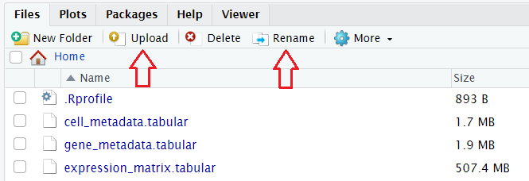

# Working in RStudio

## Uploading files

If you are working in RStudio Cloud, you have to download the generated files from your history first. To do so, just click on the  save icon for `Cell metadata (obs)`, `Gene metadata (var)` and `Expression matrix`. Then, return to the RStudio and click on ‘Upload’ button in the right bottom window toolbar and choose already downloaded files to upload. You should now see all three filed in this window. You might want to rename the files to make their names shorter.



If you are using RStudio Galaxy tool, you can get data directly from your history by running:
```r
file.copy(gx_get(2), "cell_metadata")
file.copy(gx_get(3), "gene_metadata")
file.copy(gx_get(4), "expression_matrix")
```
The number in the brackets corresponds to the dataset number in your history, so make sure you put the right number for the corresponding file. We can specify the name of the fetched files in the quotation marks, as shown above. All three files should appear in the Files tab window.

> <question-title></question-title>
>
> What is the datatype of the uploaded files?
>
> > <solution-title></solution-title>
> >
> > If you first downloaded the files from Galaxy and then uploaded them into RStudio, you should be able to see the extension `.tabular`. You might not see it if you fetched data directly from your history, but you can easily check the type of data in Galaxy, and - what's more - change it there. But today we're focusing on coding!
> >
> {: .solution}
>
{: .question}

Once we have our data loaded, let's specify paths to access the files. There is a strightforward way of getting the correct path without the concern of making typos or getting the path wrong. Just run `file.choose()` and choose the corresponding file which you want to get path to:
```r
cells_path <- file.choose() 
genes_path <- file.choose() 
expression_path <- file.choose() 
```
You should now see the new variables in the Environment tab window. 

As mentioned above, the datatype of our files is tabular, so we will use ```read.delim()``` function to read them in. The first argument is the file path and the second one, `row.names=1` takes the column number of the data file from which to take the row names. 
```r
cell_metadata <- read.delim(cells_path, row.names=1)
gene_metadata <- read.delim(genes_path, row.names=1)
expression_matrix <- read.delim(expression_path, row.names=1)
```

We have now three dataframes that we will use to generate cell_data_set object.

> <question-title></question-title>
>
> Why should we set `row.names=1`?
>
> > <solution-title></solution-title>
> >
> > This allows us to ensure that the expression value matrix has the same number of columns as the `cell_metadata` has rows and the same number of rows as the `gene_metadata` has rows. Importantly, row names of the `cell_metadata` object should match the column names of the expression matrix and row names of the `gene_metadata` object should match row names of the expression matrix.
> >
> {: .solution}
>
{: .question}

## View and modify files

According to [Monocle3 documentation](https://cole-trapnell-lab.github.io/monocle3/docs/starting/), `expression_matrix` should have genes as rows and cells as columns. Let's check if that's the case here.
```r
View(expression_matrix)
```
`View()` opens a new tab with a preview of the content of the file. We can see that in our matrix rows are cells and genes are columns, so we have to transpose the matrix simply using function `t()`. But before doing so, we will change its type from dataframe to matrix - this is Monocle's requirement to generate cell_data_set afterwards.
```r
expression_matrix <- as.matrix(expression_matrix)
expression_matrix <- t(expression_matrix)
```
Another condition we have to satisfy if that one of the columns of the `gene_metadata` should be named "gene_short_name", which represents the gene symbol for each gene. Some functions won't work without that. Do we have such a column? Let's check.
```r
View(gene_metadata)
```

The second column indeed contains gene symbols, but is called "Symbol" instead of "gene_short_name". That can be easily changed by a simple assignment, as long as we know the number of the column that we want to modify. We can access the column names by `colnames()`
```r
colnames(gene_metadata)[2] <- 'gene_short_name'
```

You can now switch to the `gene_metadata` tab and check if the name has changed. 

However, if you remember the very first tutorial, we were starting with gene IDs and adding gene symbols was one of the pre-processing steps. What if we hadn't added the genes symbols before and wanted to do it now? Of course - it's possible! 


# Hands-on Sections
Below are a series of hand-on boxes, one for each tool in your workflow file.
Often you may wish to combine several boxes into one or make other adjustments such
as breaking the tutorial into sections, we encourage you to make such changes as you
see fit, this is just a starting point :)

Anywhere you find the word "***TODO***", there is something that needs to be changed
depending on the specifics of your tutorial.

have fun!

><hands-on-title> Data upload </hands-on-title>
>
> 1. Create a new history for this tutorial
> 2. Import the files from
>
{: .hands_on}


## Re-arrange

To create the template, each step of the workflow had its own subsection.

***TODO***: *Re-arrange the generated subsections into sections or other subsections.
Consider merging some hands-on boxes to have a meaningful flow of the analyses*

# Conclusion

Sum up the tutorial and the key takeaways here. We encourage adding an overview image of the
pipeline used.
