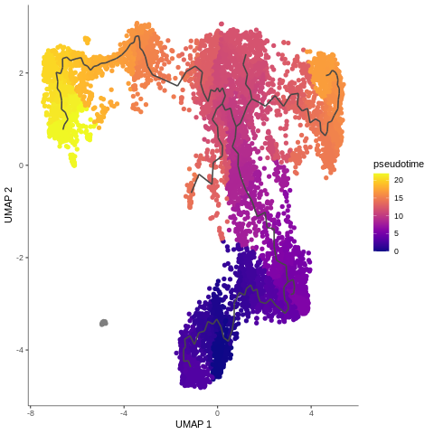

# Introduction

This tutorial is a follow-up to the ['Single-cell RNA-seq: Case Study'](). We will use the same sample from the previous tutorials. If you haven’t done them yet, it’s highly recommended that you go through them to get an idea how to [prepare a single cell matrix](), [combine datasets]() and [filter, plot and process scRNA-seq data]() to get the data in the form we’ll be working on today.

In this tutorial we will perform trajectory analysis using [monocle3](https://cole-trapnell-lab.github.io/monocle3/). You can find out more about the theory behind trajectory analysis in our [slide deck](). We have already analysed the trajectory of our sample using the ScanPy toolkit in another tutorial: [Trajectory Analysis using Python (Jupyter Notebook) in Galaxy](). However, trajectory analysis is quite sensitive and some methods work better for specific datasets. In this tutorial, you will perform the same steps but using a different method for inferring trajectories. You will then compare the results, usability and outcomes! Sounds exciting, let’s dive into that!




## Get data
We will continue to work on the case study data from a mouse model of fetal growth restriction  (see [the study in Single Cell Expression Atlas](https://www.ebi.ac.uk/gxa/sc/experiments/E-MTAB-6945/results/tsne) and [the project submission](https://www.ebi.ac.uk/arrayexpress/experiments/E-MTAB-6945/)).
Monocle3 works great with annotated data, so we will make use of our annotated AnnData object, generated in the previous [tutorial](). So you see - all the hard work of processing data was not in vain! We will also need a ‘clean’ expression matrix, extracted from the AnnData object just before we started the processing.
You have two options for uploading these datasets. Importing via history is often faster.

> <hands-on-title>Option 1: Data upload - Import history</hands-on-title>
>
> 1. Import history from: [input history](https://humancellatlas.usegalaxy.eu/u/j.jakiela/h/monocle3-input-files)
>
>
>    
>
> 2. **Rename**  the the history to your name of choice.
>
{: .hands_on}

><hands-on-title>Option 2: Data upload - Add to history</hands-on-title>
>
> 1. Create a new history for this tutorial
> 2. Import the AnnData object from [Zenodo]({{ page.zenodo_link }})
>
>    ```
>    {{ page.zenodo_link }}/files/AnnData_before_processing.h5ad
>    {{ page.zenodo_link }}/files/Annotated_AnnData.h5ad
>    ```
>
>    
>
> 3. Check that the datatype is `h5ad`
>
>    
>
{: .hands_on}

> <agenda-title></agenda-title>
>
> In this tutorial, we will cover:
>
> 1. TOC
> {:toc}
>
{: .agenda}

# Preparing the input files

## Extracting annotations

To run Monocle, we need cell metadata, gene metadata, and an expression matrix file of genes by cells. (In theory, the expression matrix alone could do, but then we wouldn’t have all those useful annotations that we worked on so hard in the previous tutorials!). In order to get these files, we will extract the gene and cell annotations from our AnnData object.

 > <question-title></question-title>
>
> How many lines do you expect to be in the gene and cell metadata files?
>
> > <solution-title></solution-title>
> >
> > If you click on the step with uploaded annotated AnnData file, you will see on a small preview that this object has 8605 observations and 15395 variables, so we expect to get a cell metadata file with 8605 lines and gene metadata file with 15395 lines (without headers of course!).
> >
> {: .solution}
>
{: .question}

> <hands-on-title>Extracting annotations</hands-on-title>
>
> 1.  with the following parameters:
>    -  *"Annotated data matrix"*: `Annotated_AnnData`
>    - *"What to inspect?"*: `Key-indexed observations annotation (obs)`
> 2. Rename  the observations annotation `Extracted cell annotations (obs)`
>
> 3.  with the following parameters:
>    -  *"Annotated data matrix"*: `Annotated_AnnData`
>    - *"What to inspect?"*: `Key-indexed annotation of variables/features (var)`
>
> 4. Rename  the annotation of variables `Extracted gene annotations (var)`
>
>
{: .hands_on}

Quick and easy, isn’t it? However, we need to make some minor changes before we can input these files into the Monocle toolsuite.

## Cell metadata
Our current dataset is not just T-cells: as you might remember from the last tutorial, we identified a cluster of macrophages as well. This might be a problem, because the trajectory algorithm will try to find relationships between all the cells (even if they are not necessarily related!), rather than only the T-cells that we are interested in. We need to remove those unwanted cell types to make the analysis more accurate.

The Manipulate AnnData tool allows you to filter observations or variables, and that would be the most obvious way to remove those cells. However, given that we don't need an AnnData object, it's a lot quicker to edit a table rather than manipulate an AnnData object. Ultimately, we need cell metadata, gene metadata and expression matrix files that have macrophages removed, and that have the correct metadata that Monocle looks for. With some table manipulation, we’ll end up with three separate files, ready to be passed onto Monocle3.

 > <question-title></question-title>
>
> Where is the information about cell types stored?
>
> > <solution-title></solution-title>
> >
> > We have already extracted the cell annotations file - in one of the columns you can find the information about cell type, assigned to each cell.
> > 
> >
> {: .solution}
>
{: .question}

Click on `Extracted cell annotations (obs)` file to see a small preview window. This shows you that the column containing the cell types has number 22.  We’ll need that to filter out unwanted cell types!

> <warning-title>Check the column number!</warning-title>
> If you are working on a different dataset, the number of the ‘cell_type’ column might be different, so make sure you check it on a preview and use the correct number!
{: .warning}

> <hands-on-title>Filter out macrophages</hands-on-title>
>
> 1.  with the following parameters:
>    -  *"Filter"*: `Extracted cell annotations (obs)`
>    - *"With following condition"*: `c22!='Macrophages'`
>    - *"Number of header lines to skip"*: `1`
>    - That’s it - our cell annotation file is ready for Monocle! Let’s rename it accordingly.
> 2. **Rename**  the output: `Cells input data for Monocle3`
>
>    > <details-title>Parameters</details-title>
>    >
>    > - `c22` means column no. 22 - that's the column with cell types, and it will be filtered for the macrophages
>    > - `!=` means 'not equal to' - we want to keep the cell types which ARE NOT macrophages
>    {: .details}
>
>    > <tip-title>Other unwanted cell types</tip-title>
>    >
>    > It might happen that during clustering you’ll find another cell type that you want to get rid of for the trajectory analysis. Then simply re-run this tool on already filtered file and change ‘Macrophages’ to another unwanted cell type.
>    {: .tip}
{: .hands_on}

## Gene annotations
Sometimes certain functionalities require a specific indication of where the data should be taken from. Monocle3 tools expect that the genes column is named ‘gene_short_name’. Let's check what the name of that column is in our dataset currently.

> <question-title></question-title>
>
> 1. Where can you check the header of a column containing genes names?
> 2. What is the name of this column?
>
> > <solution-title></solution-title>
> >
> > 1. Our extracted gene annotations file! Either by clicking on the eye icon  or having a look at the small preview window.
> > 2. In our dataset the gene names are stored in a column called ‘Symbol’ - we need to change that!
> > 
> >
> {: .solution}
>
{: .question}

Let’s click on the `Extracted gene annotations (var)` file to see a small preview. We can see that the gene names are in the third column with a header `Symbol`. Keep that in mind - we’ll use that in a second!

> <hands-on-title>Changing the column name</hands-on-title>
>
> 1.  with the following parameters:
>    -  *"Select cells from"*: `Extracted gene annotations (var)`
>    - *"using column"*: `c3` or `Column: 3`
>    - In *"Check"*:
>        -  *"Insert Check"*
>            - *"Find Regex"*: `Symbol`
>            - *"Replacement"*: `gene_short_name`
> 2. Check that the datatype is `tabular`
>
>    
>     - Voila! That’s the gene input for Monocle! Just a quick rename...
> 3. **Rename**  the output: `Genes input data for Monocle3`
>
{: .hands_on}

## Expression matrix
Last, but not least! And in fact, the most important! The expression matrix contains all the values representing the expression level of a particular gene in a cell. This is why in theory the expression matrix is the only input file required by Monocle3. Without annotation files the CDS data can still be generated - it will be quite bare and rather unhelpful for interpretation, but it's possible to process.

So, the values in the expression matrix are just numbers. But do you remember that we have already done some processing such as normalisation and the calculation of principal components in the AnnData object in the previous tutorial? That affected our expression matrix. Preprocessing is one of the steps in the Monocle3 workflow, so we want to make sure that the calculations are done on a ‘clean’ expression matrix. If we apply too many operations on our raw data, it will be too ‘deformed’ to be reliable. The point of the analysis is to use algorithms that make the enormous amount of data understandable in order to draw meaningful conclusions in accordance with biology.

So how do we do that?
> <question-title></question-title>
>
> 1. How many cells and genes are there in the `Anndata_before_processing` file?
> 2. How many lines are there in `Cells input data for Monocle3`?
> 3. How many lines are there in `Genes input data for Monocle3`?
>
> > <solution-title></solution-title>
> > You can answer all the questions just by clicking on the given file and looking at the preview window.
> > 1. [n_obs x n_vars] = 31178 x 35734, so there are 31178 cells and 35734 genes.
> > 2. 8570 lines, including a header, which makes 8569 cells.
> > 3. 15396 lines, including a header, which makes 15395 genes.
> >
> {: .solution}
>
{: .question}

As you can see, there are way more genes and cells in the unprocessed AnnData file, so the expression matrix is much bigger than we need it to be. If the genes and cells we prepared for Monocle3 are not the same as in the expression matrix, Monocle3 will crash. Therefore, we have to filter that big, clean matrix and adjust it to our already prepared genes and cells files. But first, let’s extract the matrix from the unprocessed AnnData object.

> <hands-on-title>Extracting matrix</hands-on-title>
>
> 1.  with the following parameters:
>    -  *"Annotated data matrix"*: `AnnData_before_processing`
>    - *"What to inspect?"*: `The full data matrix`
> 2. **Rename**  the output: `Unprocessed expression matrix`
>
{: .hands_on}

If you have a look at the preview of `Unprocessed expression matrix`, you’ll see that the first column contains the cell barcodes, while the first row - the gene IDs. We would like to keep only the values corresponding to the cells and genes that are included in `Cells input data for Monocle3` and `Genes input data for Monocle3`. How do we do it? First, we compare the cell barcodes from `Cells input data for Monocle3` to those in `Unprocessed expression matrix` and ask Galaxy to keep the values of the matrix for which the barcodes in both files are the same. Then, we’ll do the same for gene IDs. We will cut the first columns from `Cells input data for Monocle3` and `Genes input data for Monocle3` to be able to compare those columns side by side with the matrix file.

> <hands-on-title>Cutting out the columns</hands-on-title>
>
> 1.  with the following parameters:
>    - *"Cut columns"*: `c1`
>    -  *"From"*: `Cells input data for Monocle3`
> 2. **Rename**  the output: `Cells IDs`
> 3.  with the following parameters:
>    - *"Cut columns"*: `c1`
>    -  *"From"*: `Genes input data for Monocle3`
> 4. **Rename**  the output: `Genes IDs`
>
{: .hands_on}

> <hands-on-title> Filter matrix values by cell barcodes</hands-on-title>
>
> 1.  with the following parameters:
>    -  *"Join"*: `Cells IDs`
>    - *"using column"*: `c1`or `Column: 1`
>    -  *"with"*: `Unprocessed expression matrix`
>    - *"and column"*: `c1`or `Column: 1`
>    - *"Keep lines of first input that do not join with second input"*: `Yes`
>    - *"Keep lines of first input that are incomplete"*: `Yes`
>    - *"Fill empty columns"*: `No`
>    - *"Keep the header lines"*: `Yes`
> 2. **Rename**  the output: `Pre-filtered matrix (by cells)`
>
{: .hands_on}

Look at the preview of the output file. First of all, you can see that there are 8570 lines (8569 cells) instead of 31178 cells that were present in the matrix. That’s exactly what we wanted to achieve - now we have raw information for the T-cells that we have filtered. However, the step that we have already performed left us with the matrix whose first and second columns are the same - let’s get rid of one of those!

> <hands-on-title>Remove duplicate column (cells IDs)</hands-on-title>
>
> 1.  with the following parameters:
>    -  *"File to cut"*: `Pre-filtered matrix (by cells)`
>    - *"Operation"*: `Discard`
>    - *"Cut by"*: `fields`
>        - *"List of Fields"*: `c1`
> 2. **Rename**  the output: `Filtered matrix (by cells)`
>
{: .hands_on}

Now we will perform the same steps, but for gene IDs. But gene IDs are currently in the first row, so we need to transpose the matrix, and from there we can repeat the same steps as above for Gene IDs.

> <hands-on-title>Filter matrix by gene IDs</hands-on-title>
>
> 1.  with the following parameters:
>    -  *"Input tabular dataset"*: `Filtered matrix (by cells)`
>    - The matrix is now ready to be filtered by gene IDs!
> 2.  with the following parameters:
>    -  *"Join"*: `Genes IDs`
>    - *"using column"*: `c1` or `Column: 1`
>    -  *"with"*: output of **Transpose** 
>    - *"and column"*: `c1` or `Column: 1`
>    - *"Keep lines of first input that do not join with second input"*: `Yes`
>    - *"Keep lines of first input that are incomplete"*: `Yes`
>    - *"Fill empty columns"*: `No`
>    - *"Keep the header lines"*: `Yes`
> 3.  with the following parameters:
>    -  *"File to cut"*: output of **Join two Datasets** 
>    - *"Operation"*: `Discard`
>    - *"Cut by"*: `fields`
>        - *"List of Fields"*: `c1`
>    -  Monocle3 requires that in the matrix rows are genes, and columns are cells - that is what we've got, so there is no need to transpose matrix again. The expression matrix is ready! Let's just rename it...
> 4. **Rename**  the output: `Expression matrix for Monocle3`
>
{: .hands_on}

 Finally! We have prepared all the files to pass them onto the Monocle3 workflow!

# Monocle3 workflow

Monocle3 turns the expression matrix, cell and gene annotations into an object called cell_data_set (CDS), which holds single-cell expression data.

> <details-title>Input files</details-title>
>
> Here is what [Monocle3 documentation](https://cole-trapnell-lab.github.io/monocle3/docs/starting/) says about the required three input files:
>    - **expression_matrix**: a numeric matrix of expression values, where rows are genes, and columns are cells. Must have the same number of columns as the cell_metadata has rows and the same number of rows as the gene_metadata has rows.
>    - **cell_metadata**: a data frame, where rows are cells, and columns are cell attributes (such as cell type, culture condition, day captured, etc.)
>    - **gene_metadata**: a data frame, where rows are features (e.g. genes), and columns are gene attributes, such as biotype, gc content, etc. One of its columns should be named "gene_short_name", which represents the gene symbol or simple name (generally used for plotting) for each gene.
>
{: .details}

The Monocle3 workflow looks like the following, which should seem pretty similar to what you've done throughout the case study.


We will follow those steps and see how it all works in practice.

> <hands-on-title>Create CDS object</hands-on-title>
>
>    > <details-title>Data format</details-title>
>    >
>    > You can provide expression matrix as TSV, CSV, MTX or RDS file, while genes and cells metadata as TSV, CSV or RDS files. In our case all three files are tabular, so we will set the format to TSV.
>    {: .details}
> 1.  with the following parameters:
>    -  *"Expression matrix, genes as rows, cells as columns. Required input. Provide as TSV, CSV or RDS."*: `Expression matrix for Monocle3`
>    - *"Format of expression matrix"*: `TSV`
>    -  *"Per-cell annotation, optional. Row names must match the column names of the expression matrix. Provide as TSV, CSV or RDS."*: `Cells input data for Monocle3`
>    - *"Format of cell metadata"*: `TSV`
>    -  *"Per-gene annotation, optional. Row names must match the row names of the expression matrix. Provide as TSV, CSV or RDS."*: `Genes input data for Monocle3`
>    - *"Format of gene annotation"*: `TSV`
>
{: .hands_on}

> <question-title></question-title>
>
> What are the dimensions of the created CDS object?
>
> > <solution-title></solution-title>
> >
> > Just click on the performed step - on the preview you’ll see that the dimensions are 15395 x 8569 - so exactly as we predicted genes x cells!
> > 
> >
> {: .solution}
{: .question}

## Pre-processing

In Galaxy, there are currently 2 methods of initial dimensionality reduction included in the pre-processing step: principal component analysis (PCA) and latent semantic indexing (LSI).
Given that PCA is more commonly used, and it allows us to perform further steps on the CDS object, we’ll use this method. There is one parameter here that has a great impact on how our analysis will look - the `dimensionality of the initially reduced space`. This is a highly subjective choice - you will want to test a lot of different parameters on your dataset. After much trial and error, we were able to find the value that made the most sense biologically. Have a look at the image below to see how different values affect the outcomes.


> <question-title></question-title>
>
> Looking at the image above, which value would you choose?
>
> > <solution-title></solution-title>
> >
> > It might be hard to tell at this point without any explanation! Don’t worry, after a few more steps you’ll understand what all those colors mean and how to generate those plots. But look - we want to infer trajectories and find relationships between cells, ideally we would see the development of cells or transition from one type to another. In the graphs where num-dim is from 10 to 200, you see that the clusters are quite disjoint, while we want to see smooth transitions from one to another. I can tell you now that we’ll go ahead with the value of **250**. We're not choosing 300, because the arrangement of the cells on that graph is not really biologically relevant.
> >
> {: .solution}
{: .question}

> <hands-on-title>Pre-processing</hands-on-title>
>
> 1.  with the following parameters:
>    -  *"Input object in RDS format"*: output of **Monocle3 create** 
>    - *"The dimensionality of the reduced space."*: `250`
 >
{: .hands_on}

##  Dimensionality reduction

Now it’s time for the proper dimensionality reduction, to turn the original thousands of dimensions (genes), into a 2-dimensional graph. There are several algorithms to do this: UMAP, tSNE, PCA and LSI (only possible when preprocess_method is set to `LSI`), but due to the same reasons as above, we’ll use UMAP (most common + allows further operations + best results). But I’ll let you see how the outputs from the other algorithms look to convince you that **UMAP** is indeed the best for this dataset. Of course, it's possible that by choosing different pre-processing values, tSNE or PCA plots would look better, so don't be afraid to play around with the parameters and test them!

. LSI failed in forming distinct cell groups, PCA managed to cluster cells according to their types but tSNE did it more precisely. However, UMAP gave the best results, not only showing distinct cell type groups, but also ordering them in a way that makes sense biologically - DN to T-mat.")

> <hands-on-title>Dimensionality reduction</hands-on-title>
>
> 1.  with the following parameters:
>    -  *"Input object in RDS format"*: output of **Monocle3 preprocess** 
>
{: .hands_on}

## Plotting

Alright, now let's have a look at our output! Above you got a sneak peek of how the plot would look, but now you’ll generate the plots on your own!

Thanks to the fact that we provided Monocle3 with annotated data, we can now color the cells by any attribute that was in the cell metadata file! Similarly to the previous tutorial, we’ll color them by cell type, genotype, batch and sex. At least for now...

> <hands-on-title>Plotting</hands-on-title>
>
> 1.  with the following parameters:
>    -  *"Input object in RDS format"*: output of **Monocle3 reduceDim** 
>    - *"The cell attribute (e.g. the column of pData(cds)) to map to each cell's color, or one of {cluster, partition, pseudotime}."*: `cell_type`
>    - *"If set, display the cell group names directly on the plot. Otherwise include a color legend on the side of the plot."*:  `No`
> 2. Rename  the output: `Cell type plot`
>
> 3.  with the following parameters:
>    -  *"Input object in RDS format"*: output of **Monocle3 reduceDim** 
>    - *"The cell attribute (e.g. the column of pData(cds)) to map to each cell's color, or one of {cluster, partition, pseudotime}."*: `genotype`
>    - *"If set, display the cell group names directly on the plot. Otherwise include a color legend on the side of the plot."*:  `No`
> 4. Rename  the output: `Genotype plot`
>
> 5.  with the following parameters:
>    -  *"Input object in RDS format"*: output of **Monocle3 reduceDim** 
>    - *"The cell attribute (e.g. the column of pData(cds)) to map to each cell's color, or one of {cluster, partition, pseudotime}."*: `batch`
>    - *"If set, display the cell group names directly on the plot. Otherwise include a color legend on the side of the plot."*:  `No`
> 6. Rename  the output: `Batch plot`
>
> 7.  with the following parameters:
>    -  *"Input object in RDS format"*: output of **Monocle3 reduceDim** 
>    - *"The cell attribute (e.g. the column of pData(cds)) to map to each cell's color, or one of {cluster, partition, pseudotime}."*: `sex`
>    - *"If set, display the cell group names directly on the plot. Otherwise include a color legend on the side of the plot."*:  `No`
> 8. Rename  the output: `Sex plot`
>
{: .hands_on}

The [Previous tutorial]() discussed in detail the biological interpretation of data, so we will quickly go through similar analysis to see if the results are consistent and if we can draw any new conclusions.


As a reminder, here's the comparision between cell type annotation done in the other tutorial using Scanpy, and the output from the previous step of this Monocle tutorial. The main difference is that Scanpy was used to identify the cell types and assign them to clusters. That data was then passed on to Force-Directed + PAGA algorithms to infer trajectory, and then the arrangement of the cell groups changed a bit. In Monocle, trajectory analysis will be based on the clustering you see now.


In the mentioned tutorial, we annotated the cells so that we know what type they are. Above you can see how Monocle used this information to colour cells by their type. It is important to see the 'form' of the graph and how the cell types are arranged within its confines. But why is it important? Well, in Monocle, our trajectory analysis will be based on the same arrangement of the cells that you see now. And if you now recall our choice of the number of dimensions during pre-processing, you'll understand why it was crucial - choosing the right value at the beginning determines the 'shape' of the graph that is then retained for the trajectory analysis. Therefore, the fact that on the plot above we clearly see DN cells on one side of the graph and T-mat on the other, going through DP cells, looks promising. But there is DP-M1 group that suspiciously branches out... Let's investigate that and wait until the trajectory is inferred!

> <question-title>Genotype</question-title>
> Based on our results, can we confirm findings from the previous tutorial that DP-L and mature T-cells (particularly the top half) are missing some knockout cells?
> 
>
> > <solution-title></solution-title>
> >
> > Indeed, that's what we see in our graph! But look closer, there is something more...Additionally, we also discovered that the vast majority of DP-M1 is only wildtype cells. That's interesting, isn't it?
> >
> {: .solution}
{: .question}

> <question-title>Batch effect</question-title>
> Can we confirm the previous findings that DP-L looks to be mainly comprised of N705?
> 
>
> > <solution-title></solution-title>
> >
> > Both DP-L and DP-M1 seem to consist mostly of N705 and N706. There might be indeed a bit of batch effect, so you could consider using batch correction on this dataset. In the absence of batch correction, we will focus on those clusters where there is batch mixing for biological interpretation. Finally, we will look at the confounding effect of sex.
> > 
> >  There are also no female cells in DP-L and DP-M1. The one female sample - which is one of the mere three knockout samples - seems to be distributed in the same areas as the knockout samples at large. Luckily, this doesn’t seem to be a confounding factor and we can still learn from our data.
> >
> {: .solution}
{: .question}

## Clustering

Don't get confused - we haven't clustered our cells yet, for now we have only plotted them based on cell type annotation. Now it's time to create clusters, which - in an ideal world where all computation picks up the exact biological phenomenons - would yield the same areas as the clusters determined by the Scanpy algorithms. Is this the case here? Do Monocle and Scanpy identify the same clusters?
>
Monocle uses a technique called "community detection" () to group cells. This approach was introduced by  as part of the phenoGraph algorithm.
>
Monocle also divides the cells into larger, more well separated groups called partitions, using a statistical test from , introduced as part of their [PAGA](https://github.com/theislab/paga) algorithm.

> <details-title>Clusters vs partitions</details-title>
>
> Clusters are particularly useful while trying to assign cells to a certain type, because they are based on the similarity in gene expression. The relationships between different clusters are analysed to identify possible trajectories.
>
> Partitions, meanwhile, are larger groups of cells that usually contain several clusters. Trajectory inference is performed only within one partition, so it is essential that all the cells that we want to analyse in pseudotime belong to the same partition.
>
{: .details}

> <hands-on-title>Clustering </hands-on-title>
>
> 1.  with the following parameters:
>    -  *"Input object in RDS format"*: output of **Monocle3 reduceDim** 
>    - *"Resolution of clustering result, specifying the granularity of clusters. Not used by default and the standard igraph louvain clustering algorithm will be used."*: `0.00015`
>    - *"The q-value threshold used to determine the partition of cells."*: `1.0`
>    - The clusters and partitions are now stored in your CDS file. To see them, just plot the output, coloring the cells with the corresponding attributes.
>
> 2.  with the following parameters:
>    -  *"Input object in RDS format"*: output of **Monocle3 partition** 
>    - *"The cell attribute (e.g. the column of pData(cds)) to map to each cell's color, or one of {cluster, partition, pseudotime}."*: `partition`
> 3. Rename  the output: `Partition plot`
>
> 4.  with the following parameters:
>    -  *"Input object in RDS format"*: output of **Monocle3 partition** 
>    - *"The cell attribute (e.g. the column of pData(cds)) to map to each cell's color, or one of {cluster, partition, pseudotime}."*: `cluster`
> 5. Rename  the output: `Cluster plot`
>
{: .hands_on}
> <tip-title>If the partition does not contain all your cells of interest...</tip-title>
>
> Sometimes it might happen that cells are grouped into several partitions, while you want them all to be in just one in order to perform trajectory analysis on all of them. Then, you can try to increase the `q-value` threshold that is used to determine the partition of cells.
> 
>
{: .tip}
> <tip-title>If the granularity of clusters does not make sense...</tip-title>
>
>
> When using standard igraph louvain clustering, the value of `resolution` parameter is by default set to `NULL`, which means that it is determined automatically. If you are not satisfied with the results of the standard igraph louvain clustering, you may set the `resolution` value manually, and thus specify the granularity of the clustering.
> 
{: .tip}

> <warning-title>Ambiguous clusters!</warning-title>
> As mentioned above, standard igraph louvain clustering determines the resolution automatically, unless the specific value is provided by the user. Therefore, it sometimes returns slightly different outputs. To ensure that your clusters are reproducible, you might want to pass a certain value to the `resolution` parameter. In case of our data, the resolution value of 0.00015 gave the same results as the best output of igraph louvain clustering, and ensured reproducibility.
> 
>
>
{: .warning}

If we compare the annotated cell types and the clusters that were just formed, we see that they nicely correspond to one another.


## Gene expression
> We haven't looked at gene expression yet! This step is particularly important when working with data which is not annotated. Then, based on the expression of marker genes, you are able to identify which clusters correspond to which cell types. This is indeed what we did in the previous tutorial using scanpy. We can do the same using Monocle3! Since we work on annotated data, we can directly check if the expressed genes actually correspond to the previously assigned cell types. If they do, that’s great - if two different methods are consistent, that gives us more confidence that our results are valid.
> Below is the table that we used in the previous tutorial to identify the cell types.

| Marker | Cell type |
|--------------------|
| Il2ra    | Double negative (early T-cell)    |
| Cd8b1, Cd8a, Cd4    | Double positive (middle T-cell)|
| Cd8b1, Cd8a, Cd4 - high | Double positive (late middle T-cell)|
| Itm2a    | Mature T-cell |
| Aif1    | Macrophages    |
| Hba-a1    | RBC    |

> <hands-on-title>Gene expression</hands-on-title>
>
> 1.  with the following parameters:
>    -  *"Input object in RDS format"*: output of **Monocle3 partition** 
>    - *"The cell attribute (e.g. the column of pData(cds)) to map to each cell's color, or one of {cluster, partition, pseudotime}."*: `cell_type`
>    - *"A list of gene IDs/short names to plot."*: `Il2ra,Cd8b1,Cd8a,Cd4,Itm2a,Aif1,Hba-a1`
>
{: .hands_on}


> <question-title>Genes and cell types</question-title>
> Based on the gene expression graph that we just generated, the table above and your knowledge from the previous tutorial, how would you interpret the results?
>
> > <solution-title></solution-title>
> >
> > - `Il2ra`: expressed in the cluster where DN cells are - an indication of where the trajectory should start
> > - `Cd8b1, Cd8a`: expressed in the areas where middle DP were assigned - great
> > - high `Cd4`: mostly in late DP cluster - as expected
> > - `Itm2a`: expressed in mature T-cells - tells us where the trajectory should end
> > - `Aif1`: nothing here - correct! We filtered out macrophages from the sample
> > - `Hba-a1`: look at this! Very high expression in just one, tiny bit, which hasn't even been grouped into a cluster! So wait, why do we see hemoglobin gene here? Do we have red blood cells in our sample?! Let's investigate that further...
> >
> {: .solution}
{: .question}

> <tip-title>Purity of the sample - Hba-a1 gene</tip-title>
>
> The Hba-a1 gene creates hemoglobin which is found in red blood cells. This is highly expressed in a tiny bit of the middle DP cluster. Interestingly, it forms a a clearly visible, distinct, little branch. Hemoglobin should NOT be found in T-cells. However, if you remember, the gene was found to be expressed in the previous Scanpy tutorial (see the image below). That marker appeared throughout the entire sample in low numbers, suggesting some background contamination of red blood cell debris in the cell samples during library generation. Unlike Scanpy, Monocle algorithms allowed us to gather the cells expressing that gene into a distinct group! That's great!
>
> 
>
{: .tip}

## Top marker genes

Here we used a priori knowledge regarding the marker genes. If we wanted to approach this problem in an unsupervised manner, we could use Monocle to tell us the top marker genes in each group of cells. This is very useful if we are trying to identify a cell type, or if we want to find novel marker genes for known cell types.

> <question-title></question-title>
>
> If I cluster cells that are not annotated, can I assign clusters to a cell type based on gene expression using Monocle3?
>
> > <solution-title></solution-title>
> >
> > Theoretically...yes! That’s the point of the clustering and gene expression analysis. However, as of the writing of this tutorial, this function hasn’t been turned into a Galaxy tool yet and is only available in R.
> >
> {: .solution}
>
{: .question}

> <hands-on-title>Top marker genes</hands-on-title>
>
> 1.  with the following parameters:
>    -  *"Input Object"*: output of **Monocle3 partition** 
>    - *"Group cell by"*: `cell_type`
> 2. Rename  the tabular output: `Top markers table`
> 3. Rename  the pdf output: `Top markers plot`
>
{: .hands_on}


> <question-title></question-title>
>
> What genes are uniquely expressed in DP-M1?
>
> > <solution-title></solution-title>
> >
> > By looking at the table, you might give the 5 top gene IDs expressed in DP-M1. To save you some time and make the analysis more readable, we converted the gene IDs to gene names and they are as follows: Rps17, Rpl41, Rps26, Rps29, Rps28. They are all ribosomal! [You can do this yourself if you want by following this section of a previous tutorial that [uses the gene names in one object to add to a table of Ensembl IDs](https://training.galaxyproject.org/training-material/topics/single-cell/tutorials/scrna-case_basic-pipeline/tutorial.html#findmarkers). These ribosomal differences might be due to housekeeping background, cell cycling, or even something more bioligically interesting...or all three!
> > The plot also indicates other specifically expressed genes, such as Hmgb2, Pclaf, Rpl13, Rps19, Ybx1, Ncl, Hsp90ab1, Npm1.
> >
> > Whenever you want to explore what might be the function of a particular cluster or why it branches out from the trajectory, check the top markers for that cluster to draw biological conclusions. Thank you Maths!
> {: .solution}
>
{: .question}

But what if you want to know how gene expression changes across a trajectory? This is where Monocle is particularly powerful. But in order to do that, we have to infer that trajectory first!

## Learn the trajectory graph

We’re getting closer and closer! The next step is to learn the trajectory graph, which means to fit a principal graph within each partition. In that way, we’ll ‘connect’ the existing clusters by creating a path between them.

> <hands-on-title>Learn graph</hands-on-title>
>
> 1.  with the following parameters:
>    -  *"Input object in RDS format"*: output of **Monocle3 partition** 
>    - Again, the graph is now stored in your CDS file. To see it, just plot the output, you can color the cells by any attribute that you want. We'll use cell types to see how they are connected.
> 2.  with the following parameters:
>    -  *"Input object in RDS format"*: output of **Monocle3 learnGraph** 
>    - *"The cell attribute (e.g. the column of pData(cds)) to map to each cell's color, or one of {cluster, partition, pseudotime}."*: `cell_type`
>
{: .hands_on}

As you can see, the learned trajectory path is just a line connecting the clusters. However, there are some important points to understand here.
> If the resolution of the clusters is high, then the trajectory path will be very meticulous, strongly branched and curved. There's a danger here that we might start seeing things that don't really exist.
> You can set an option to learn a single tree structure for all the partitions or use the partitions calculated when clustering and identify disjoint graphs in each. To make the right decision, you have to understand how/if the partitions are related and what would make more biolgical sense. In our case, we were only interested in a big partition containing all the cells and we ignored the small 'dot' classified as another partition.
> There are many trajectory patterns: linear, cycle, bifurcation, tree and so on. Those patterns might correspond to various biological processes: transition events for different phases, cell cycle, cell differentiation. Therefore, branching points are quite important on the trajectory path. You can always plot them,  checking the correct box in .


> <tip-title>Comparing the trajectories</tip-title>
>
> As a reminder, here's the comparision between our trajectory and the one from the previous tutorial, where we used Scanpy for clustering, and then appplied Force-Directed + PAGA algorithms to infer trajectory. As you remember from those tutorials, the arrangement of the cell groups changed a bit during these steps. Indeed - by using the mentioned methods, we get different graphs for clusters and trajectory, while in Monocle the general 'shape' of the graph stays the same from the beginning. 'Leranig the trajectory' step in Monocle is about finding a path, along which the cells can be then ordered in pseudotime.
>  and the trajectory obtained in Monocle.")
{: .tip}

## Pseudotime analysis

Finally, it's time to see our cells in pseudotime! We have already learned a trajectory, now we only have to order the cells along it. Monocle3 requires information on where to start ordering the cells, so we need to provide it with this information. We annotated early T-cells as double negative (DN), so those will be our root cells!

> <details-title>Pseudotime</details-title>
>
> To infer trajectories, we need data from cells at different points along a path of differentiation. The assumption is that in any given sample, some cells are further along a trajectory than others. This inferred temporal dimension is known as pseudotime. Pseudotime measures the cells’ progress through the transition.  See  for more.
>
{: .details}

> <hands-on-title>Ordering the cells along trajectory</hands-on-title>
>
> 1.  with the following parameters:
>    -  *"Input object in RDS format"*: output of **Monocle3 learnGraph** 
>    - *"The cell phenotype (column in pdata) used to identify root principal nodes."*: `cell_type`
>    - *"The value in the cell phenotype column used to extract root nodes."*: `DN`
>    - Alright - we were waiting for this plot the whole tutorial: once we have the cells ordered, we can finally color them by pseudotime!
>
> 2.  with the following parameters:
>    -  *"Input object in RDS format"*: output of **Monocle3 orderCells** 
> 3. Rename  the output: `Pseudotime plot`
>
{: .hands_on}

> <tip-title>Other ways to specify the root cells</tip-title>
>
> The method to specify the root cells shown above is not the only one available in Galaxy! However, it is probably the most intuitive one.
> 1. **Annotated cell type as root cells**
>    -  fill *(--cell-phenotype)* with the colname (heading) where the cell types are stored
>    -  fill *(--root-type)* with the name of the cell type that you want to start ordering from
> 2. **Cell ID as root cell**
>    -  fill *(--root-cells)* with the cell ID that you want to start ordering from
> 
>   3. **Starting principal points**
>     - repeat the plotting step, find the parameter *label_principal_points* and set its value to  `Yes`
>     - have a look at the plot and note which principal point best corresponds to the root cells
>     - fill *(--root-pr-nodes)* with the noted value from *label_principal_points*
> 
{: .tip}

Now we can see how all our hard work has come together to give a final pseudotime trajectory analysis. DN cells gently switching to DP-M which change into DP-L to finally become mature T-cells. Isn't it beautiful? But wait, don't be too enthusiastic - why on earth DP-M1 group branches out? We didn't expect that... What could that mean?
>
There are a lot of such questions in bioinformatics, and we're always get excited to try to answer them. However, with analysing scRNA-seq data, it's almost like you need to know about 75% of your data to make sure that your analysis is reasonable, before you can identify the 25% new information. Additionally, pseudotime analysis crucially depends on choosing the right analysis and parameter values, as we showed for example with initial dimensionality reduction during pre-processing. The outputs here, at least in our hands, are more sensitive to parameter choice than standard clustering analysis with Scanpy.



Last but not least, you can now identify genes that define the inferred trajectories.

> <hands-on-title>Differentially expressed genes</hands-on-title>
>
> 1.  with the following parameters:
>    -  *"Input object in RDS format"*: output of **Monocle3 orderCells** 
> 2. Rename  the output: `Differential gene expression table`
>
{: .hands_on}

# Conclusion

 Well done, you’ve made it to the end! You might want to consult your results with this [control history](https://humancellatlas.usegalaxy.eu/u/j.jakiela/h/monoce3-tutorial-workflow), or check out the [full workflow](https://humancellatlas.usegalaxy.eu/u/j.jakiela/w/copy-of-anndata-to-monocle-right-1) for this tutorial. I also split this workflow into two separate workflows: [preparing the input files for Monocle3, starting from AnnData](https://humancellatlas.usegalaxy.eu/u/j.jakiela/w/copy-of-trajectory-analysis-using-monocle3), and [Monocle3 only workflow](https://humancellatlas.usegalaxy.eu/u/j.jakiela/w/copy-of-trajectory-analysis-using-monocle3-1). You can use them to accelerate analysis of your own data, paying attention to the requirements of the input data that are mentioned in this tutorial.


If you're following the Case Study tutorials from the beginning, you have already experienced what it’s like to analyse and question a dataset, potentially without clear cut-offs or clear answers. You now know that trajectory analysis is even more sensitive to parameter values, so it's often trying to find the best set of values that would give the most reasonable results and go in accordance with biology. Moreover, not all trajectory analysis methods are designed to infer all kinds of biological processes - due to the fact that they use different algorithms, some would work better for analysing your sample. Since Monocle is quite widely used for trajectory analysis, it might be a good practice to compare its results with other methods. The more evidence you have to confirm your findings, the more confident you can be about their reliability!
