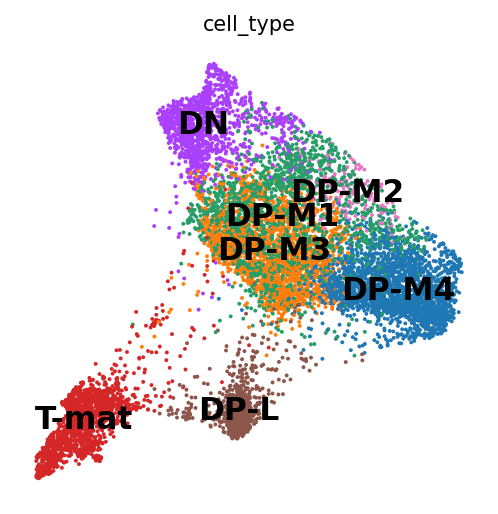
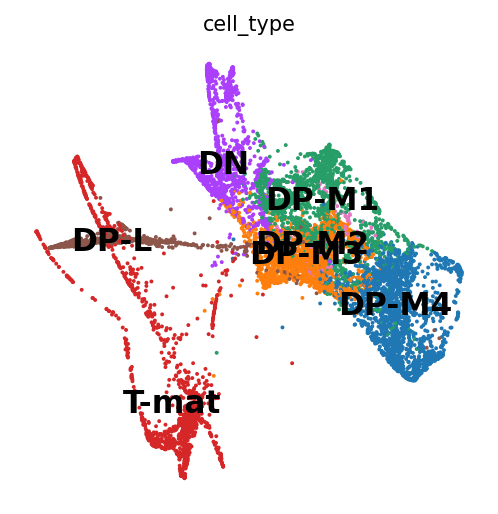
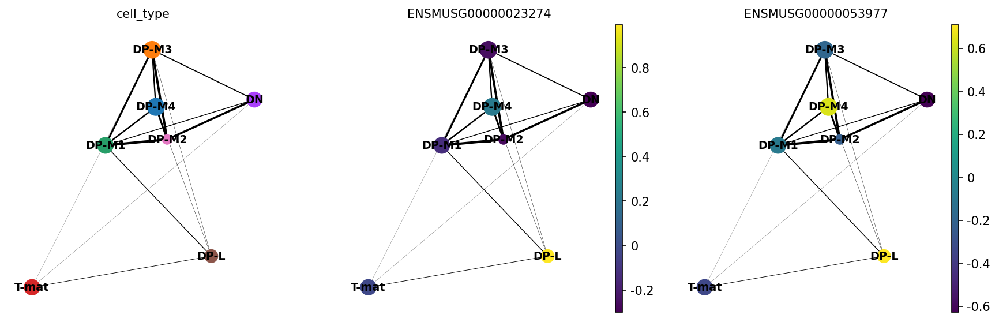
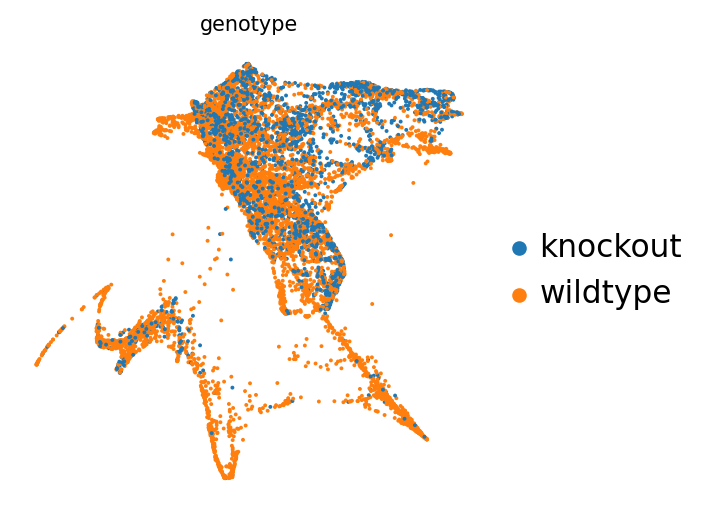
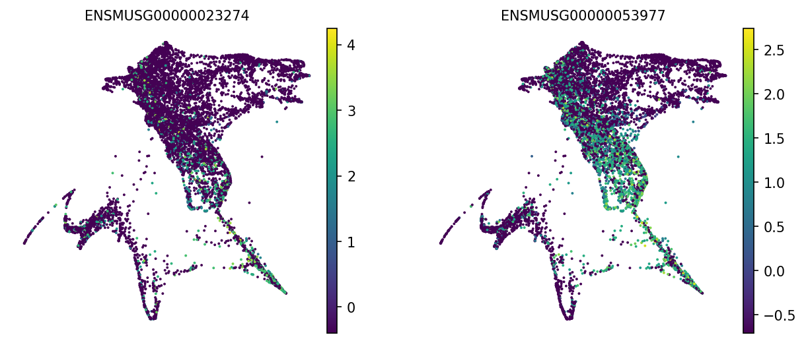
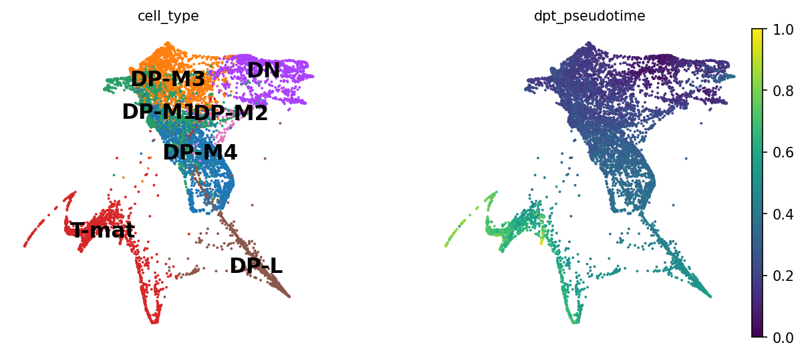

# Introduction

You've done all the hard work of preparing a single-cell matrix, processing it, plotting it, interpreting it, and finding lots of lovely genes. Now you want to infer trajectories, or relationships between cells... you can do that here, using the Galaxy interface, or head over to the [Jupyter notebook version of this tutorial]() to learn how to perform the same analysis using Python. 

Traditionally, we thought that differentiating or changing cells jumped between discrete states, so 'Cell A' became 'Cell B' as part of its maturation. However, most data shows otherwise. Generally, there is a spectrum (a 'trajectory', if you will...) of small, subtle changes along a pathway of that differentiation. Trying to analyse cells every 10 seconds can be pretty tricky, so 'pseudotime' analysis takes a single sample and assumes that those cells are all on slightly different points along a path of differentiation. Some cells might be slightly more mature and others slightly less, all captured at the same 'time'.  These cells are sorted accordingly along these pseudotime paths of differentiation to build a continuum of cells from one state to the next.  We therefore 'assume' or 'infer' relationships between from this continuum of cells.

We will use the same sample from the previous three tutorials, which contains largely T-cells in the thymus. We know T-cells differentiate in the thymus, so we would assume that we would capture cells at slightly different time points within the same sample. Furthermore, our cluster analysis alone showed different states of T-cells. Now it's time to look further!

# Citation

Please note, this tutorial is largely based on the trajectories tutorial found [on the Scanpy site itself](https://scanpy-tutorials.readthedocs.io/en/latest/paga-paul15.html).

> <agenda-title></agenda-title>
>
> In this tutorial, we will cover:
>
> 1. TOC
> {:toc}
>
{: .agenda}


## Get data

We've provided you with experimental data to analyse from a mouse dataset of fetal growth restriction . This is the full dataset generated from [this tutorial]() (see the [study in Single Cell Expression Atlas](https://www.ebi.ac.uk/gxa/sc/experiments/E-MTAB-6945/results/tsne) and the [project submission](https://www.ebi.ac.uk/arrayexpress/experiments/E-MTAB-6945/)). You can find the final dataset in this [input history](https://usegalaxy.eu/u/wendi.bacon.training/h/cs4inferred-trajectory-analysis-using-python-jupyter-notebook-in-galaxy---input) or download from Zenodo below.

> <hands-on-title>Option 1: Data upload - Import history</hands-on-title>
>
> 1. Import history from: [input history](https://usegalaxy.eu/u/wendi.bacon.training/h/cs4inferred-trajectory-analysis-using-python-jupyter-notebook-in-galaxy---input)
>
>
>    
>
> 2. **Rename**  the the history to your name of choice.
>
{: .hands_on}

> <hands-on-title>Option 2: Data upload - Add to history</hands-on-title>
>
> 1. Create a new history for this tutorial
> 2. Import the AnnData object from [Zenodo]({{ page.zenodo_link }})
>
>    ```
>    {{ page.zenodo_link }}/files/Final_cell_annotated_object.h5ad
>    ```
>
>    
>
> 3. **Rename**  the .h5ad object as `Final cell annotated object`
>
>    
>
> 4. Check that the datatype is `h5ad`
>
>    
>
{: .hands_on}

# Important tips for easier analysis



> <comment-title></comment-title>
> - The Galaxy tool search panel sometimes doesn't find the tools we need from the thousands available.
> - Note that you can favourite any tool for quick retrieval via the ★ symbol at the top of each tool, and at the top of Tools side-menu.
> - You'll have a much easier time selecting tools from the panel (if you aren't using tutorial mode!) if you are on the [humancellatlas.usegalaxy.eu](https://humancellatlas.usegalaxy.eu)
{: .comment}

## Filtering for T-cells

One problem with our current dataset is that it's not just T-cells: we found in the previous tutorial that it also contains macrophages. This is a problem, because trajectory analysis will generally try to find relationships between all the cells in the sample. We need to remove those cell types to analyse the trajectory.

> <hands-on-title> Removing macrophages </hands-on-title>
>
> 1.  with the following parameters:
>    -  *"Annotated data matrix"*: `Final cell annotated object` (Input dataset)
>    - *"Function to manipulate the object"*: `Filter observations or variables`
>        - *"What to filter?"*: `Observations (obs)`
>        - *"Type of filtering?"*: `By key (column) values`
>            - *"Key to filter"*: `cell_type`
>            - *"Type of value to filter"*: `Text`
>                - *"Filter"*: `not equal to`
>                - *"Value"*: `Macrophages`
>                - 
> 3. **Rename**  output h5ad `T-cell_object.h5ad`
>
{: .hands_on}

You should now have `8569` cells, as opposed to the `8605` you started with. You've only removed a few cells (the contaminants!), but it makes a big difference in the next steps.

## Draw force-directed graph

First, we will calculate a [force-directed graph](https://scanpy.readthedocs.io/en/stable/api/scanpy.tl.draw_graph.html) (FDG), as an alternate to tSNE, which will likely work better for trajectory analysis.

> <hands-on-title> Draw FDG </hands-on-title>
>
> 1.  with the following parameters:
>    -  *"Input object in AnnData/Loom format"*: `T-cell_object.h5ad` (output of **Manipulate AnnData** )
>    - *"Use programme defaults"*:  `No`
>    - *"Graph layout"*: `fa`
>
>    > <comment-title> Graph Layout </comment-title>
>    >
>    > We're using the fa or ForceAtlas2 layout for our FDGs. It is the same layout used in the [Jupyter notebook version of this tutorial]() and works well for our data. As well as choosing the fa layout when we create the FDGs, we will also specify the `draw_graph_fa` embedding when drawing the plots. 
>    {: .comment}
> 
{: .hands_on}

## Plot the FDG

And now time to plot it!

> <hands-on-title> Plot the FDG </hands-on-title>
>
> 1.  with the following parameters:
>    -  *"Input object in AnnData/Loom format"*: `FDG object Anndata` (output of **Scanpy RunFDG** )
>    - *"name of the embedding to plot"*: `draw_graph_fa`
>    - *"color by attributes, comma separated texts"*: `cell_type`
>    - *"Use raw attributes if present"*: `No`
>    - *"Location of legend"*: `On data`
{: .hands_on}


> <question-title></question-title>
>
> 1. What has the FDG done to our clusters of T-cells and what might this suggest about the relationships between these groups?
>
> > <solution-title></solution-title>
> >
> > 1. Well now this is exciting! Our DP-late is more clearly separating, and we might also suppose that DP-M1, DP-M2, and DP-M3 are actually earlier on in the differentiation towards mature T-cells. And we're only just getting started!
> >
> > 
> {: .solution}
>
{: .question}

## Diffusion maps

We'll now perform an *optional step*, that basically takes the place of the standard Principle Component Analysis (PCA). Instead of using PCs, we can use [diffusion maps](https://scanpy.readthedocs.io/en/stable/api/scanpy.tl.diffmap.html).

> <hands-on-title> Draw the Diffusion Map </hands-on-title>
>
> 1.  with the following parameters:
>    -  *"Input object in AnnData/Loom format"*: `FDG object Anndata` (output of **Scanpy RunFDG** )
>    - *"Number of diffusion components to calculate"*: `15`
>
>    > <comment-title> Choosing the number of diffusion components </comment-title>
>    >
>    > We could change the number of diffusion components and end up with a slightly different plot - a bit like if we changed the number of principal components used in the PCA we ran in the [Filter, Plot and Explore]() tutorial. 15 seems to work well for this dataset and matches the number used in the Jupyter version of this tutorial, so we'll stick with that. 
>    {: .comment}
>
{: .hands_on}

## Re-calculate Nearest Neighbours

Now that we have our diffusion map, we need to re-calculate neighbors using the diffusion map instead of the PCs. 

> <hands-on-title> Compute neighbours using diffusion map </hands-on-title>
>
> 1.  with the following parameters:
>    -  *"Input object in AnnData/Loom format"*: `DiffusionMap Anndata` (output of **Scanpy DiffusionMap** )
>    - *"Use programme defaults"*:  `No`
>    - *"Use the indicated representation"*: `X_diffmap`
>
{: .hands_on}

## Re-draw the FDG

Now that we've re-calculated the nearest neighbours, we can use these new neighbours to re-draw the FDG to see how this changes the plot. 

> <hands-on-title> Plot a new FDG </hands-on-title>
>
> 1.  with the following parameters:
>    -  *"Input object in AnnData/Loom format"*: `Graph object Anndata` (output of **Scanpy ComputeGraph** )
>    - *"Use programme defaults"*:  `No`
>    - *"Graph layout"*: `fa`
>
>
> 2.  with the following parameters:
>    -  *"Input object in AnnData/Loom format"*: `FDG object Anndata` (output of **Scanpy RunFDG** )
>    - *"name of the embedding to plot"*: `draw_graph_fa`
>    - *"color by attributes, comma separated texts"*: `cell_type`
>    - *"Use raw attributes if present"*: `No`
>    - *"Location of legend"*: `On data`
>
{: .hands_on}

> <question-title></question-title>
>
> 1. Does this plot seem better or worse than before? Remember that we're trying to understand the relationships between our groups of cells in time. 
>
> > <solution-title></solution-title>
> >
> > 1. Oh dear! This doesn't look great. Maybe the DP-M4 cells are a whole other trajectory? That doesn't seem right. Saying that this spreads out our T-mature cells, which makes a lot more sense when it comes to T-cell biology (we expect T-cells to differentiate into two types of T-cells, Cd8+Cd4- and Cd4+Cd8-). If you wanted to, you could also re-cluster your cells (since you've changed the neighborhood graph on which the clusterisation depends). However, we tried that, and it called far too many clusters given the depth of sequencing in this dataset. Let's stick with our known cell types and move from there.
> >
> > 
> {: .solution}
>
{: .question}

## Working in a group? Decision-time!
If you are working in a group, you can now divide up a decision here with one *control* and the rest can vary in numbers so that you can compare results throughout the tutorials.
- Control
   - Go straight to the [Partition-based Graph Abstraction (PAGA) section](#partition-based-graph-abstraction-paga)
- Everyone else:
   - you could recluster your cells using  at a different resolution, perhaps lower than the 0.6 we used before (Take a look at the Cell clusters step in the [Filter, Plot and Explore]() tutorial if you need help with this.
        - Please note that in this case, you will want to change the PAGA step `sc.pl.paga` to group by `louvain` rather than `cell_type`. You can certainly still plot both, we only didn't because with using our old Louvain calls, the cell_type and louvain categories are identical.
   - you could undo the optional diffusion map step by recalculating the neighbours again using `X_pca` instead of `X_diffmap`
   - you could also try changing the number of neighbors used in that step 

- Everyone else: You will want to compare FREQUENTLY with your control team member.

## Partition-based Graph Abstraction (PAGA)

[PAGA](https://scanpy.readthedocs.io/en/stable/api/scanpy.tl.paga.html) is used to generalise relationships between groups, or likely clusters, in this case. It will make it much easier to see the trajectories between our clusters of T-cells. 

> <hands-on-title> Plot PAGA </hands-on-title>
>
> 1.  with the following parameters:
>    -  *"Input object in AnnData/Loom format"*: `FDG object Anndata` (output of **Scanpy RunFDG** )
>    - *"Name of the clustering"*: `cell_type`
>   
>    > <comment-title> Plotting gene expression </comment-title>
>    >
>    > We can now draw our PAGA plot and we might also be interested in colouring our plot by genes as well. In this case, remembering that we are dutifully counting our genes by their EnsemblIDs rather than Symbols (which do not exist for all EnsemblIDs), we have to look up our genes of interest (CD4, CD8a) and plot the corresponding IDs in the next step.
>    {: .comment}
>
> 2.  with the following parameters:
>    -  *"Input object in AnnData/Loom format"*: `PAGA object Anndata` (output of **Scanpy PAGA** )
>    - *"Layout functions"*: `ForceAtlas2`
>    - *"Location of legend"*: `On data`
>    - *"Use programme defaults"*:  `No`
>    - *"Name of cell annotation or gene that is used to color the nodes"*: `cell_type,ENSMUSG00000023274,ENSMUSG00000053977`
>
>
>    > <comment-title> Choosing the layout </comment-title>
>    >
>    > We're going to pick the `ForceAtlas2` layout function for our PAGA plots as this is the same type of layout that we used for our FDG. 
>    {: .comment}
>
{: .hands_on}

> <question-title></question-title>
>
> 1. How have the relationships between our cell clusters changed now?
> 2. Which clusters are expressing our genes of interest, Cd4 and Cd8, at the highest levels?
>
> > <solution-title></solution-title>
> >
> > 1. The way the clusters are arranged has changed a bit now. The M4 cluster is right in the middle of the M1-3 clusters, rather than heading off on its own. The M1 cluster is looking like it is driving towards differentiation, which is not something we had necessarily been able to specify before by just looking at our cluster graphs or applying our biological knowledge.
> > 2. Cd4 and Cd8 expression appear highest in the DP-L cluster. The expression of both Cd4 and Cd8 also appears higher than we might expect in the DP-M4 cluster - perhaps this is a sign that it is closer to the DP-L cluster than it seems in this simple plot. 
> >
> > 
> {: .solution}
>
{: .question}

## Re-draw force-directed graph (again!)

Force-directed graphs can be initialised randomly, or we can prod it in the right direction. We'll prod it with our PAGA calculations. Note that you could also try prodding it with tSNE or UMAP. A lot of these tools can be used on top of each other or with each other in different ways, this tutorial is just one example. Similarly, you could be using any **obs** information for grouping, so could do this for *louvain* or *cell_type* for instance.

> <hands-on-title> Initialise FDG using PAGA </hands-on-title>
>
> 1.  with the following parameters:
>    -  *"Input object in AnnData/Loom format"*: `Plotted PAGA Anndata` (output of **Scanpy PlotTrajectory** )
>    - *"Use programme defaults"*:  `No`
>    - *"Method to initialise embedding, any key for adata.obsm or choose from the preset methods"*: `paga`
>    - *"Graph layout"*: `fa`
>
> 2.  with the following parameters:
>    -  *"Input object in AnnData/Loom format"*: `FDG object Anndata` (output of **Scanpy RunFDG** )
>    - *"name of the embedding to plot"*: `draw_graph_fa`
>    - *"color by attributes, comma separated texts"*: `cell_type`
>    - *"Use raw attributes if present"*: `No`
>    - *"Location of legend"*: `On data`
>
{: .hands_on}

> <question-title></question-title>
>
> 1. How has basing our FDG on the PAGA plot changed the relationships between our cells?
>
> > <solution-title></solution-title>
> >
> > 1. The interesting change here occurs between the Double Negative (DN) and Double Positive Module 4 (DP-M4) cells. Our DP-M4 cells are now heading on a clear trajectory towards differentiation. It looks like we've got the correct ordering of cells from DN through the DP groups and on towards T-mature. We didn't see this in our previous plots. 
> >
> > 
> {: .solution}
>
{: .question}

## Plotting by Genotype

The experiment that produced this data used two different groups of mice - the control or wildtype group and the knockout mice that were missing a gene involved in the maturation of the thymus gland. Since we know the genotype of the mice from which each sample was collected, we can colour in our plots to see if there are any differences in the cells present in wildtype and knockout mice. 

The easiest way to do this is just to rerun  the previous step, but change the attribute we want to use to colour the FDG plot. 

> <hands-on-title> Plot by genotype </hands-on-title>
>
> 1.  with the following parameters:
>    -  *"Input object in AnnData/Loom format"*: `FDG object Anndata` (output of **Scanpy RunFDG** )
>    - *"name of the embedding to plot"*: `draw_graph_fa`
>    - *"color by attributes, comma separated texts"*: `genotype`
>    - *"Use raw attributes if present"*: `No`
>    - *"Location of legend"*: `On data` 
>
{: .hands_on}

> <question-title></question-title>
>
> 1. Are there any differences in the distribution of the wildtype and knockout cells?
>
> > <solution-title></solution-title>
> >
> > 1. We’re seeing a clear trajectory issue whereby the knockout cells are not found along the trajectory into T-mature (which, well, we kind of already figured out with just the cluster analysis, but we can feel even more confident about our results!) 
> >
> > 
> {: .solution}
>
{: .question}

## Plotting Gene Expression

We're also interested in the expression of the two genes that are known to be markers of the two different types of mature T-cells, Cd4 and Cd8. We can colour in our plot to show which cells are expressing these genes. 

> <hands-on-title> Plot for gene expression </hands-on-title>
>
> 1.  with the following parameters:
>    -  *"Input object in AnnData/Loom format"*: `FDG object Anndata` (output of **Scanpy RunFDG** )
>    - *"name of the embedding to plot"*: `draw_graph_fa`
>    - *"color by attributes, comma separated texts"*: `ENSMUSG00000023274,ENSMUSG00000053977`
>    - *"Use raw attributes if present"*: `No`
>    - *"Location of legend"*: `On data`
>
>    > <comment-title> Gene Symbols </comment-title>
>    >
>    > We're using the EnsemblIDs during this tutorial, as discussed above. If you like, you could change the names of these plots to the gene symbols by filling in the optional Figure title field with `Cd4,Cd8`. Make sure that the order of your figure titles matches the order of the EnsemblIDs in the colour by field. ENSMUSG00000023274 is Cd4 and ENSMUSG00000053977 is Cd8.
>    {: .comment}
> 
{: .hands_on}

> <question-title></question-title>
>
> 1. Does the expression pattern of these genes tell us anything about our cells?
>
> > <solution-title></solution-title>
> >
> > 1. It's clear that both Cd4 and Cd8 are being expressed mainly in the later stages of T-cell development, as they head towards the DP-L cluster - although Cd4 expression is a bit more widespread. This is what we would expect to see in genes that are associated with mature T-cells. You might also be able to spot some differences in the expression of the two genes in our mature T-cell group, but there doesn't seem to be a very clear division between the cells that express Cd4 and those that express Cd8. This is a bit disappointing, as we know that there are two types of mature T-cells, which each express a different gene. 
> >
> > 
> {: .solution}
>
{: .question}

## Diffusion pseudotime

Now that we have a reasonable FDG plot for our cells, based on the diffusion map (if used) and PAGA plot, we can place our cells into pseudotime. Pseudotime lets us imagine that instead of looking at a sample of cells taken at a single timepoint, we are looking at cells moving through time. Our sample included cells at different stages of their development, but we can use pseudotime to think of these as different timepoints in the journey of individual cells. 

We know that our cells are initialising at DN. We can feed that information into our algorithms by naming DN as the root cell type to then calculate a trajectory starting from these cells. 

### Working in a group? Decision-time!
If you called new clusters using , you might want to choose one of those clusters to be your root cell instead, so change the `cell_type` for `louvain` and then name the cluster number. Use the plots you created to help you pick the number!

Onto the [diffusion pseudotime](https://scanpy.readthedocs.io/en/stable/api/scanpy.tl.dpt.html), where we are infer multiple time points within the same piece of data!

> <hands-on-title> DPT Plot </hands-on-title>
>
> 1.  with the following parameters:
>    -  *"Input object in AnnData/Loom format"*: `FDG object Anndata` (output of **Scanpy RunFDG** )
>    - *"Name of attribute that defines clustering"*: `cell_type`
>    - *"Name of the clustering that defines the root cell type"*: `DN`
>
> 
> 2.  with the following parameters:
>    -  *"Input object in AnnData/Loom format"*: `Diffusion pseudotime inference Anndata` (output of **Scanpy DPT** )
>    - *"name of the embedding to plot"*: `draw_graph_fa`
>    - *"color by attributes, comma separated texts"*: `cell_type,dpt_pseudotime`
>    - *"Use raw attributes if present"*: `No`
>    - *"Location of legend"*: `On data`
>
{: .hands_on}

> <question-title></question-title>
>
> 1. Does the pseudotime plot match with your expectations of which cells represent earlier or later stages of T-cell development?
>
> > <solution-title></solution-title>
> >
> > 1. When we look at the cell type and DPT plots, we can see that there's a clear progression from our root DN cells, through the various groups of DP cells, into DP-L and then T-mat. This matches with our expectations that the DP-L and DP-mat clusters represent later stages in T-cell development. The DPT plot also confirms that the DP-M4 cluster is heading towards differentiation, which makes sense given its position on our FDG plot. 
> >
> > 
> {: .solution}
>
{: .question}

This is nice, as it supports our conclusions thus far on the trajectory of the T-cell differentiation. With single-cell, the more ways you can prove to yourself what you're seeing is real, the better! If we did not find consistent results, we would need to delve in further to see if the cause is the algorithm (not all algorithms fit all data!) or the biology.

Where might we go from here? We might consider playing with our louvain resolutions, to see if we can get the two groups of Cd4+ and Cd8+ cells to be called as different clusters, and then comparing them to each other for gene differences or genotype differences. We might also use different objects (for instance, what if we regressed out cell cycle genes?) and see if that changes the results. What would you do?

## Working in a group? The finale!
Look at each others images! How do yours differ, what decisions were made? Previously, when calling clusters in the [Filter, Plot and Explore Single-cell RNA-seq Data]() tutorial, the interpretation at the end is largely consistent, no matter what decisions are made throughout (mostly!). Is this the case with your trajectory analyses? You may find that it is not, which is why pseudotime analysis even more crucially depends on your understanding of the underlying biology (we have to choose the root cells, for instance, or recognise that DN cells should not be found in the middle of the DPs) as well as choosing the right analysis. That's why it is a huge field! With analysing scRNA-seq data, it's almost like you need to know about 75% of your data and make sure your analysis shows that, for you to then identify the 25% new information.

# Conclusion

Congratulations! You've made it to the end! You might be interested in the [workflow](https://humancellatlas.usegalaxy.eu/u/marisa_jl/w/workflow-constructed-from-history-inferring-trajectories-with-scanpy-tutorial-1) for this tutorial or this [Example History](https://humancellatlas.usegalaxy.eu/u/marisa_jl/h/inferring-trajectories-using-scanpy---example-history) which shows the results you should expect to see if you follow this tutorial. 

In this tutorial, you moved from called clusters to inferred relationships and trajectories using pseudotime analysis. You found an alternative to PCA (diffusion map), an alternative to tSNE (force-directed graph), a means of identifying cluster relationships (PAGA), and a metric for pseudotime (diffusion pseudotime) to identify early and late cells. If you were working in a group, you found that such analysis is slightly more sensitive to your decisions than the simpler filtering/plotting/clustering is. We are inferring and assuming relationships and time, so that makes sense!
