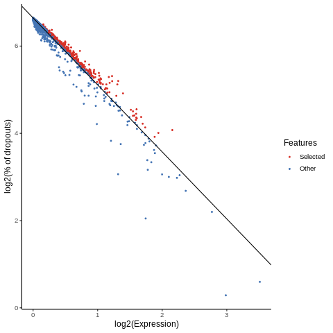
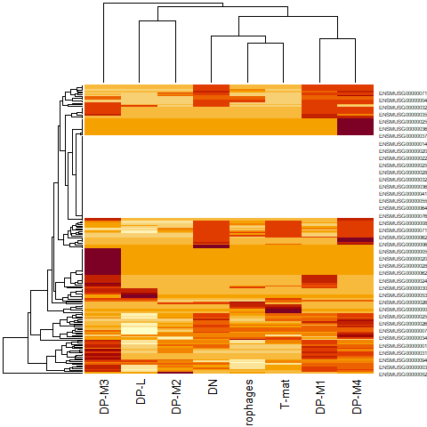

# Introduction

introduction here


## Get data

We've provided you with experimental data to analyse from a mouse dataset of fetal growth restriction . This is the full dataset generated from [this tutorial]() if you used the full FASTQ files rather than the subsampled ones (see the [study in Single Cell Expression Atlas](https://www.ebi.ac.uk/gxa/sc/experiments/E-MTAB-6945/results/tsne) and the [project submission](https://www.ebi.ac.uk/arrayexpress/experiments/E-MTAB-6945/)). You can find this dataset in this [input history](https://usegalaxy.eu/u/wendi.bacon.training/h/cs3-answerkey) or download from Zenodo below.

You can access the data for this tutorial in multiple ways:

1. **Your own history** - If you're feeling confident that you successfully ran a workflow on all 7 samples from the previous tutorial, and that your resulting 7 AnnData objects look right (you can compare with the [answer key history](https://usegalaxy.eu/u/wendi.bacon.training/h/cs2combining-datasets-after-pre-processing---input-1)), then you can use those! To avoid a million-line history, I recommend dragging the resultant datasets into a fresh history

   

2. **Importing from a history** - You can import [this history](https://usegalaxy.eu/u/wendi.bacon.training/h/cs3-answerkey)

   

3. **Uploading from Zenodo** (see below)

> <hands-on-title>Option 3: Uploading from Zenodo</hands-on-title>
>
> 1. Create a new history for this tutorial
> 2. Import the AnnData object from [Zenodo](https://zenodo.org/records/7053673)
>
>    ```
>    https://zenodo.org/record/7053673/files/Mito-counted_AnnData
>    ```
>
>    
>
> 3. **Rename**  the datasets `Mito-counted AnnData`
> 4. Check that the datatype is `h5ad`
>
>    
>
{: .hands_on}

# Pre-Process data

## Add cell type information

Now we have the data from the Filter, Plot and Explore tutorial we need to conduct some pre-processing to make the data compatible with the tool being used. The first step is to take the cell labels generated at the end of the tutorial (```Final Annotated Object```) and add them to our original data (```Final Object```), this data object will then have all the information we need to being building a searchable index.

> <hands-on-title>Add cell type labels</hands-on-title>
>
> 1.  with the following parameters:
>    -  *"Annotated data matrix"*: `Final Annotated Object`
>    - *"What to inspect?"*: `Key-indexed observations annotation (obs)`
>
> 2.  with the following parameters:
>    - *"Cut columns"*: `c22`
>    - *"Delimited by"*: `Tab`
>    -  *"From"*: `Inspect AnnData`
>
> 3. **Rename**  output `Cell type column (cut)`
>
> 4.  with the following parameters:
>    -  *"Annotated data matrix"*: `Filtered Object`
>    - *"Function to manipulate the object"*: `Add new annotation(s) for observations or variables`
>        - *"What to annotate?"*: `Observations (obs)`
>        - *"Table with new annotations"*: `Cell type column (cut)`
>
> 5. **Rename**  output `Annotated Filtered Object`
>
{: .hands_on}

Now we have all the data we need our next step is to convert it to the correct data format, currently our data is in the AnnData format however scmap is only compatible with the SingleCellExperiment format. Since no tool currently exists in Galaxy to directly convert between AnnData and SingleCellExperiment we will need to extract all the relevant information from out file and manually construct the SingleCellExperiment file.

## Convert to SCE

> <hands-on-title>Extract relevant information</hands-on-title>
>
> 1.  with the following parameters:
>    -  *"Annotated data matrix"*: `Annotated Filtered Object`
>    - *"What to inspect?"*: `The full data matrix`
>
> 2. **Rename**  output `Annotated Filtered Object (matrix)`
>
> 3.  with the following parameters:
>    -  *"Annotated data matrix"*: `Annotated Filtered Object`
>    - *"What to inspect?"*: `Key-indexed observations annotation (obs)`
>
> 4. **Rename**  output `Annotated Filtered Object (obs)`
>
> 5.  with the following parameters:
>    -  *"Input tabular dataset"*: `Annotated Filtered Object (matrix)`
>
> 6. **Rename**  output `Transposed matrix`
>
> 7.  with the following parameters:
>    - *"Format for the input matrix"*: `Tabular`
>        - *"Count Data"*: `Transposed matrix`
>    - *"Operation"*: `Filter for Barcodes`
>        - *"Method"*: `DefaultDrops`
>            - *"Expected Number of Cells"*: `31178`
>            - *"Upper Quantile"*: `1.0`
>            - *"Lower Proportion"*: `0.0`
>        - *"Format for output matricies"*: `Bundled (barcodes.tsv, genes.tsv, matrix.mtx)`
>    - *"Random Seed"*: `100`
>
{: .hands_on}

Now we have all the required data extracted we can construct the SingleCellExperiment object.

> <hands-on-title>Build SCE object</hands-on-title>
>
> 1.  with the following parameters:
>    -  *"Expression matrix in sparse matrix format (.mtx)"*: `DropletUtils 10x Matrices`
>    -  *"Gene table"*: `DropletUtils 10x Genes`
>    -  *"Barcode/cell table"*: `DropletUtils 10x Barcodes`
>    - *"Should metadata file be added"*: `Yes`
>        - *"Metadata file"*: `Annotated Filtered Object (obs)`
>        - *"Cell ID column"*: `index`
>
> 2. **Rename**  output `SingleCellExperiment Object`
>
{: .hands_on}

Congratulations! You have now processed the data into a reference dataset and converted it to the correct format, we are now ready to annotate the data using Scmap!

# Pre-process data with Scmap

Before we are able to index our data and make predictions we need do a little bit of pre-processing, specifically we just need to make sure all the relevant metadata is present and that our data is normalised, luckly this is all done for us with the scmap pre-processing tool!

> <hands-on-title>Pre-process data</hands-on-title>
>
> 1.  with the following parameters:
>    -  *"Input SCE Object"*: `SingleCellExperiment Object`
>
{: .hands_on}

Our next step is to extract features (genes) from the data, the selected gene expressions will be what is used to make our searchable reference and perform predictions. This step will standardise our data length and remove all the information which isn't very helpful for uniquely identifying cell types.

For a bit of additional context the method scmap uses to select features is **M3Drop**

> <hands-on-title>Feature selection</hands-on-title>
>
> 1.  with the following parameters:
>    -  *"SingleCellExperiment object"*: `Scmap pre-process`
>    - *"Number of features"*: `500`
>
> 2. **Rename**  output `Scmap features`
> 3. **Rename**  figure `Scmap features figure`
>
{: .hands_on}

> <comment-title>Number of features</comment-title>
> An important parameter that we can change in this workflow is how many features we want to use, too few features will end up removing important information and cause the tool to perform poorly, however too many features will make the useful information too sparse (which can effect the accuracy of the tool) as well as increase the runtime of the tool. Selecting the best number of features will depend on the data used so play around with the parameter too try to find the best results! 
{: .comment}

After the tool runs Scmap will generate a file containing our feature data as well as a figure plotting our data with the selected features. Examine ```Scmap features figure```.



The plot shows us the two important pieces of information that the feature selection method uses to select features. The x-axis shows us the expression level of each gene (higher expression levels are better for features), the y-axis shows us the dropout rate of each gene (this is related to gene expression but i won't go into detail here). The line on the plot shows us the threshold being used to determine if a gene should be selected as a feature, genes with a high enough expression level and dropout rate are ideal in this case. Note that this essentially places a cap on the maximum number of features we can use.

We can also see from the plot that there is fairly consistent relationship across the data with most of the points being very close to the threshold line. Since the charactistics chosen by our feature selector has failed to really seperate the genes it may not have done a great job at discerning which genes are the most important, this could indicate that the feature selection method used may not be best for our data and a different method may result in better data seperation. However for the sake of simplicity we are going to stick with this for the tutorial! 


> <comment-title>Reference and Query Features</comment-title>
> As a reminder we will be using the same data as both the reference and the query, when performing cell annotation on unknown data the query and reference will be different. Therefore you will need to perform pre-process and feature selection seperately for both the reference and query data, the following tools that build an index will use the reference data.
{: .comment}

# Cell Annotation

We now need to take our reference data and index it so that it can be searched efficiently using our query data. Scmap provides two methods to do this, cluster level indexing and cell level indexing.

- At the cluster level we will generate clusters of our data (one for each cell type) and get the average value of all the cells in each cluster, these values are called centroids and will be what we compare our query against, since we only have 8 cell types we only need to make 8 comparions, pretty efficient!

- Averaging out all our data however will mean loosing a lot of information, therefore we also have the option of comparing our query at the individual cell level (we wont actually be comparing against every cell since we're using approximate nearest neighbour search). This potentially gives us more accuracy with the expense of more storage and computation.

In this tutorial we will do both cluster level and cell level prediction, lets start with cluster level!

# Scmap (Cluster)

As described earlier we need to build an index at the cluster level that can be searched, so lets do that!

> <hands-on-title>Build cluster index</hands-on-title>
>
> 1.  with the following parameters:
>    -  *"SingleCellExperiment object"*: `Scmap features`
>    - *"Remove Matrix"*: `No`
>    - *"Cluster column"*: `cell_type`
>
> 2. **Rename**  output `Scmap index (clusters)`
> 3. **Rename**  figure `Scmap heatmap (clusters)`
>
{: .hands_on}

With this tool ran we now have a cluster level index that can be searched and used to make predictions, but before we do that lets quickly look at the heatmap generated. Examine ```Scmap heatmap (clusters)```



This figure shows us how much each gene correlates to each cell type. We can see that every cell type contains at least some strongly correlating genes which is a good indicator that the tool has enough infomation to make diverse classifications. If certain cell types contain no strongly correlated genes or there are many genes which correlate strongly to multiple cell types then performance could degrade, (this could be due to very similar cell types in the data or not enough features being used).

We are finally at the stage where we can make predictions! not we need to just take our reference index and query data and perform a projection to map each query to a cell type. 

> <comment-title>Query Features</comment-title>
> Remember since our reference and query data is the same we just need to take the features we generated earlier, but if you are using seperate reference and query data then you will need to replace ```Scmap features``` with the features of your query data.
{: .comment}

> <hands-on-title>Perform cluster projection</hands-on-title>
>
> 1.  with the following parameters:
>    -  *"SingleCellExperiment object"*: `Scmap index (clusters)`
>    -  *"SingleCellExperiment object to project"*: `Scmap features`
>    - *"Threshold"*: `0.7`
>
> 2. **Rename**  output `Scmap index (clusters)`
> 3. **Rename**  figure `Scmap heatmap (clusters)`
>
{: .hands_on}

> <comment-title>Threshold Parameter</comment-title>
> Similar to selecting the best number of features we also have the option here to select the threshold used for projection. Scmap will compare the query with each cluster and will only classify it if the distance between each is above the threshold value (otherwise it will be marked as unassigned). If you get a lot of unassigned lables then try lowering the threshold.
{: .comment}

Finally we need to standardise the output produced by the projection tool into a nice table for us to analyse.

> <hands-on-title>Get standard output</hands-on-title>
>
> 1.  with the following parameters:
>    -  *"Scmap predictions file in text format"*: `Output of cluster projection`
>    - *"Should prediction scores be included?"*: `Yes`
>    -  *"Scmap index object"*: `Scmap index (clusters)`
>    - *"Tool used (cell/cluster)"*: `Scmap-cluster`
>    - *"Column name of similarity scores"*: `scmap_cluster_siml`
>
> 2. **Rename**  output `Scmap clusters output`
>
{: .hands_on}

A snippet of the output table can be seen below

| cell_id        | predicted_label | score             |
| -------------- | --------------- | ----------------- |
| TTGTTCGCTATT-0 | unassigned      | 0.685218265732244 |
| CCATGACGCTGT-0 | unassigned      | 0.691608200539184 |
| GATGCATTCCTG-0 | unassigned      | 0.630431437556039 |
| TTTCCGACCTTC-0 | unassigned      | 0.588235060143573 |
| TCGTAAATTGCC-0 | unassigned      | 0.604610245578749 |
| CCATTCCTGTCT-0 | unassigned      | 0.673650933205656 |

In the table we can see each cell in our query, the predicted cell type label, and the confidence of each prediction. Remember that these tools are not perfect and may miss-label cells, so the confidence score acts as a proxy for the quality of the prediction.

# Scmap (Cell)

> <hands-on-title>Build cell index</hands-on-title>
>
> 1.  with the following parameters:
>    -  *"SingleCellExperiment object"*: `Scmap features`
>    - *"Number of chunks"*: `0`
>    - *"Number of clusters"*: `0`
>    - *"Remove Matrix"*: `No`
>    - *"Random seed"*: `1`
>
> 2. **Rename**  output `Scmap index (cells)`
>
{: .hands_on}

> <hands-on-title>Perform cell projection</hands-on-title>
>
> 1.  with the following parameters:
>    -  *"Index SingleCellExperiment object"*: `Scmap index (cells)`
>    -  *"SingleCellExperiment object to project"*: `Scmap features`
>    - *"Number of nearest neighbours"*: `5`
>    - *"Annotate cells of the projection dataset using labels of the reference?"*: `Yes`
>        - *"Cluster column"*: `cell_type`
>
> 2. **Rename**  output `Scmap index (clusters)`
> 3. **Rename**  figure `Scmap heatmap (clusters)`
>
{: .hands_on}

> <hands-on-title>Get standard output</hands-on-title>
>
> 1.  with the following parameters:
>    -  *"Scmap predictions file in text format"*: `Output of cell projection`
>    - *"Should prediction scores be included?"*: `Yes`
>    -  *"Scmap index object"*: `Scmap index (cells)`
>    - *"Tool used (cell/cluster)"*: `Scmap-cell`
>    - *"Column name of similarity scores"*: `scmap_cluster_siml`
>
> 2. **Rename**  output `Scmap cell output`
>
{: .hands_on}
