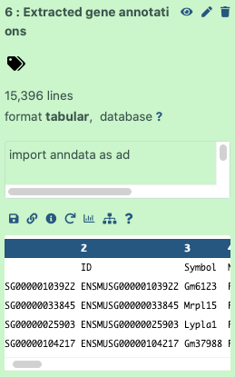

You finally decided to analyse some single cell data, you got your files either from the lab or publicly available sources, you opened the first tutorial available on Galaxy Training Network and... you hit the wall! The format of your files is not compatible with the one used in tutorial! Have you been there? 
This tutorial was created to help you overcome that problem and ensure data interoperability in single cell analysis. Once you get your data into Galaxy in the right format, that's already 50% of success. Additionally, by using format conversion, you will be able to use different packages presented in tutorials that may require different datatypes. 

> <agenda-title></agenda-title>
>
> In this tutorial, we will cover:
>
> 1. TOC
> {:toc}
>
{: .agenda}

# Single cell datatypes

To start with, here are the most common formats and datatypes that you might come across if you work with single cell data:
- **Tabular** - simply using TSV, CSV or TXT formats to store expression matrix as well as cell and gene metadata. 
- **MTX** - it's just a sparse matrix format with genes on the rows and cells on the columns as output by Cell Ranger.
- **HDF5** - Hierarchical Data Format - can store datasets and groups. A dataset is a  a multidimensional array of data elements, together with supporting metadata. A group is a structure for organizing objects in an HDF5 file. This format allows for storing both the count matrices and all metadata in a single file rather than having separate features, barcodes and matrix files. 
- **AnnData objects** - [anndata](https://anndata.readthedocs.io/en/latest/) is a Python package for handling annotated data matrices. In Galaxy, you'll see AnnData objects in **h5ad** format, which is based on the standard HDF5 (h5) format. There are lots of Python tools that work with this format, such as Scanpy, MUON, Cell Oracle, SquidPy, etc. 
- **Loom** - it is simply an HDF5 file that contains specific groups containing the main matrix as well as row and column attributes and can be read by any language supporting HDF5. [Loompy](https://linnarssonlab.org/loompy/) has been released as a Python API to interact with loom files, and [loomR](https://github.com/mojaveazure/loomR) is its implementation in R. 
- **Zarr** - a Python package providing an implementation of compressed, chunked, N-dimensional arrays, designed for use in parallel computing. The Zarr file format offers powerful compression options, supports multiple data store backends, and can read/write your NumPy arrays.
- **Seurat objects** - a representation of single-cell expression data for R, in Galaxy you might see them in **rdata** format.
- **Single Cell Experiment (SCE) object** - defines a S4 class for storing data from single-cell experiments and provides a more formalized approach towards construction and accession of data. The S4 system is one of R's systems for object oriented programing. In Galaxy you might see SCE objects in **rdata** format.
- **CellDataSet (CDS) object** - the main class used by Monocle to hold single cell expression data. In Galaxy you might see CDS objects in **rdata** format.

<!---
TO FURTHER IMPROVE THE TUTORIAL:
include images showing the structure of those files
-->



# Data import
As you can see above, there are multiple ways to store single cell data. Therefore, there are also many ways how you can get that data! 
Obviously, before any format conversion, we need to import the data. In our tutorials we often use [Zenodo](https://zenodo.org/) links, but you can also upload the files directly from your computer. There are also publicly available resources which you can easily access through public atlases, such as [Single Cell Expression Atlas](https://www.ebi.ac.uk/gxa/sc/home) or [Human Cell Atlas data portal](https://data.humancellatlas.org/). We created a [dedicated tutorial]() to show how to use those atlases to retrieve data. But today we're here to focus on data conversion!

# SCEasy Tool
In Galaxy Toolshed there is a wonderful tool called  which allows you to convert between common single cell formats, such as:
- AnnData to CellDataSet (CDS)
- AnnData to Seurat
- Loom to AnnData
- Loom to SingleCellExperiment (SCE)
- SingleCellExperiment (SCE) to AnnData
- SingleCellExperiment (SCE) to Loom
- Seurat to AnnData
- Seurat to SingleCellExperiment (SCE)

> <warning-title>Two SCEasy tools</warning-title>
>  
> As of the writing of this tutorial, the updated SCEasy tool is called  and it's only available on *usegalaxy.eu*. The second tool is called  and it works on *usegalaxy.org*, however has limited conversion options. Both tools should be visible on *singlecell.usegalaxy.eu* if you try to find them in the search box. 
> 
{: .warning}

In this tutorial you will see multiple examples of SCEasy Tool in action. However, sometimes it is useful to know how to do this conversion manually or at least to know how it all works and better understand the structure of the files. Therefore, we also have examples showing how to convert objects manually or prepare the input files for some of our single cell tutorials and workflows.

# Seurat -> AnnData 
As mentioned above, there are two SCEasy tools currently available. When we speak about conversion to AnnData, the latest tool  converts Seurat into the latest version of AnnData object. However, currently it is not possible to use that output with downstream EBI single-cell tools because they only support older versions of the AnnData. If you need to use those tools, the solution is to take advantage of the second SCEasy tool  which has limited conversion options but can generate AnnData files compatible with the EBI single-cell tools that we are going to use next in the workflow. 
Our Seurat starting file was generated by pulling data from [Single Cell Expression Atlas](https://www.ebi.ac.uk/gxa/sc/home) and transforming it into the desired format, what was shown in the [data import tutorial](). It will be our toy dataset.

> <hands-on-title>Get toy data</hands-on-title>
>
> 1. Create a new history for this tutorial 
> 2. Import the AnnData object from [Zenodo](https://zenodo.org/records/10397653)
>
>    ```
>    https://zenodo.org/records/10397653/files/Seurat_object.rdata
>    ```
>
>    
>    
> 3. Alternatively, you can import history where we created the Seurat object: [Input history](https://singlecell.usegalaxy.eu/u/j.jakiela/h/ebi-scxa---anndata-scanpy-or-seurat-object-1) 
>
>    
>
> 4. **Rename**  the dataset `Seurat object`
> 5. Check that the datatype is `rdata`
>
>    
>
{: .hands_on}




<div class="Quick-one-tool-method" markdown="1">

## Quick one tool method

> <hands-on-title> SCEasy Converter </hands-on-title>
>
> 1.  with the following parameters:
>    - *"Convert From / To"*: `Seurat to AnnData`
>    -  *"Input object in rds,rdata format"*: `Seurat object`
> 2. **Rename**  the output: `AnnData object`
>    
{: .hands_on}

And that's it! Please note that the output file is the newest AnnData version and is not compatible with EBI tools used in [Filter, Plot, Explore workflow](https://singlecell.usegalaxy.eu/u/j.jakiela/w/copy-of-filter-plot-and-explore-single-cell-rna-seq-data-imported-from-uploaded-file-3). 

</div>

<div class="Convert-to-AnnData-object-compatible-with-Filter,-Plot,-Explore-workflow" markdown="1">

## Convert to AnnData object compatible with Filter, Plot, Explore workflow

Here, we use the other SCEasy tool which generates older version of the AnnData which is compatible with the EBI single-cell tools that we are going to use next in the workflow. 

> <hands-on-title> Seurat to AnnData with SCEasy convert </hands-on-title>
>
> 1.  with the following parameters:
>    - *"Direction of conversion"*: `Seurat to AnnData`
>    -  *"Input object in Seurat RDS format"*: `Seurat object`
>      (if the dataset does not show up in the corresponding input field, just drag the dataset from the history panel and drop into the input field)
>    - *"Name of the assay to be transferred"*: `RNA`
>    - *"Data type of the assay to be transferred"*: `data`
>   
> 2. **Rename**  the output `Converted EBI-compatible AnnData file`.
>
> 3. Check that the datatype is `h5ad`
>
>    
>    
{: .hands_on}

Now, if we do small modification to metadata, we can use the generated dataset as an input file in the workflow we created in the [previous tutorial]()! Let's see how it works:

> <hands-on-title> Modify AnnData object</hands-on-title>
>
> 1. 
> 2. Make sure you are using version **1.8.1+galaxy92** of the tool (change by clicking on  Versions button)
> 3. Set the following parameters:
>    -  In *"Input object in hdf5 AnnData format"*: `Converted EBI-compatible AnnData file`
>    - In *"Change field names in AnnData var"*:
>        -  *"Insert Change field names in AnnData var"*
>            - *"Original name"*: `name`
>            - *"New name"*: `Symbol`
>    - *"Gene symbols field in AnnData"*: `Symbol`
>    - In *"Flag genes that start with these names"*:
>        -  *"Insert Flag genes that start with these names"*
>            - *"Starts with"*: `mt-`
>            - *"Var name"*: `mito`
> 4. Rename  output `AnnData for Filter, Plot, Explore workflow`
>
{: .hands_on}

The object is ready to start its journey through the [Filter, Plot, Explore workflow](https://singlecell.usegalaxy.eu/u/j.jakiela/w/copy-of-filter-plot-and-explore-single-cell-rna-seq-data-imported-from-uploaded-file-3). All thanks to one conversion tool - how awesome that is! 

</div>

# AnnData -> Seurat

Let's get an **AnnData object** that we can further work on. It's the object used in [many tutorials](), so check it out if you're curious. 

> <hands-on-title>Get toy data</hands-on-title>
>
> 1. Create a new history for this tutorial 
> 2. Import the AnnData object from [Zenodo]({{ page.zenodo_link }})
>
>    If you do this tutorial just for learning purposes, you can download the downsampled dataset which will be much quicker to process:
>    
>    ```
>    https://zenodo.org/record/10391629/files/Downsampled_annotated_AnnData.h5ad
>    ```
>    
>    If you want to use the full dataset used in the other single-cell case study tutorials, here it is! Please note, it will take much longer to process it, so we will only show the conversions on the downsampled objects.
>    
>    ```
>    https://zenodo.org/record/7053673/files/Mito-counted_AnnData
>    ```
>
>    
>
> 4. **Rename**  the datasets `Downsampled AnnData object`
> 5. Check that the datatype is `h5ad`
>
>    
>
{: .hands_on}




<div class="Quick-one-step-method" markdown="1">

## Quick one step method

> <hands-on-title> SCEasy Converter </hands-on-title>
>
> 1.  with the following parameters:
>    - *"Convert From / To"*: `AnnData to Seurat`
>    -  *"Input object in h5ad,h5 format"*: `Downsampled AnnData object`
> 2. **Rename**  the output: `Seurat object`
>    
{: .hands_on}

</div>

<div class="Manual-conversion" markdown="1">

## Manual conversion

Most of our manual conversions involve extracting tables from different data objects and importing them into the target object.
First, we will extract observations (cell metadata) and the full matrix from our AnnData.

> <hands-on-title> Inspect AnnData </hands-on-title>
>
> 1.  with the following parameters:
>    -  *"Annotated data matrix"*: `Downsampled AnnData object`
>    - *"What to inspect?"*: `Key-indexed observations annotation (obs)`
>   
> 2. **Rename**  the output `Observations`.
>
> 3.  with the following parameters:
>    -  *"Annotated data matrix"*: `Downsampled AnnData object`
>    - *"What to inspect?"*: `The full data matrix`
>
> 4. **Rename**  the output `Matrix`.
>    
{: .hands_on}


> <question-title></question-title>
>
> What are the rows, and what are the columns in the retrieved Matrix?
>
> > <solution-title></solution-title>
> >
> > If you just click on the `Matrix` dataset, you will see a preview showing barcodes in the first column, and genes in the first row.
> > 
> {: .solution}
>
{: .question}

However, the next tool we need expects a matrix wherein the genes are listed in the first column and the barcodes are listed in the first row. Therefore, we need to transpose the current matrix.

> <hands-on-title> Transpose the matrix </hands-on-title>
>
> 1.  with the following parameters:
>    -  *"Input tabular dataset"*: `Matrix`
>
{: .hands_on}

And now we are ready to input that data into **DropletUtils** tool, which will separate this matrix into the cells, genes, and matrix tabular files needed to build a Seurat object. 

> <hands-on-title> DropletUtils </hands-on-title>
>
> 1.  with the following parameters:
>    - *"Format for the input matrix"*: `Tabular`
>    -  *"Count Data"*: output of **Transpose** 
>    - *"Operation"*: `Filter for Barcodes`
>        - *"Method"*: `DefaultDrops`
>            - *"Expected Number of Cells"*: `338`
>            - *"Upper Quantile"*: `1.0`
>            - *"Lower Proportion"*: `0.0`
>        - *"Format for output matrices"*: `Bundled (barcodes.tsv, genes.tsv, matrix.mtx)`
>        - *"Random Seed"*: `100`
>
{: .hands_on}

Finally, let's combine those files that we have just generated and turn them into the Seurat object!

> <hands-on-title> Create Seurat object </hands-on-title>
>
> 1.  with the following parameters:
>    - *"Choose the format of the input"*: `10X-type MTX`
>    -  *"Expression matrix in sparse matrix format (.mtx)"*: `DropletUtils 10X Matrices`
>    - *"Gene table"*: `DropletUtils 10X Genes`
>    - *"Barcode/cell table"*: `DropletUtils 10X Barcodes`
>    -  *"Cell Metadata"*: `Observations`
>    - *"Choose the format of the output"*: `RDS with a Seurat object`
>
> 2. **Rename**  the output `Converted Seurat object`.
>    
{: .hands_on}

As usual, you can check the [example history](https://usegalaxy.eu/u/j.jakiela/h/anndata-to-seurat-conversion) and the dedicated [workflow](https://usegalaxy.eu/u/j.jakiela/w/anndata---seurat-conversion).

</div>

# AnnData -> SingleCellExperiment (SCE)
We will work on the same AnnData object so if you create a new history for this exercise, you can either get this file from Zenodo again or just copy this dataset from the previous history. 

> <hands-on-title>Get toy data</hands-on-title>
>
> 1. Create a new history for this section
> 2. Import the files from [Zenodo](https://zenodo.org/record/10391629)
>
>    ```
>    https://zenodo.org/record/10391629/files/Downsampled_annotated_AnnData.h5ad
>    ```
>
{: .hands_on}






 <div class="Quick-single-tool-method" markdown="1">

## Quick single tool method

> <hands-on-title> SCEasy Converter </hands-on-title>
>
> 1.  with the following parameters:
>    - *"Convert From / To"*: `AnnData to Seurat`
>    -  *"Input object in h5ad,h5 format"*: `Downsampled AnnData object`
> 2. **Rename**  the output: `Seurat object`
> 3. We will use SCEasy again!  with the following parameters:
>    - *"Convert From / To"*: `Seurat to SingleCellexperiment`
>    -  *"Input object in rds,rdata format"*: `Seurat object`
> 4. **Rename**  the output: `SCE object`
>
{: .hands_on}

</div>

<div class="Convert-manually" markdown="1">

## Convert manually

First, we will extract observations and the full matrix from our AnnData.

> <tip-title>Skip some steps!</tip-title>
>
> If you are following this entire tutorial (rather than using a specific section necessary!), you can stay in the your previous history and just reuse outputs to build different single cell objects!
{: .tip}


> <hands-on-title> Inspect AnnData </hands-on-title>
>
> 1.  with the following parameters:
>    -  *"Annotated data matrix"*: `Downsampled AnnData object`
>    - *"What to inspect?"*: `Key-indexed observations annotation (obs)`
>   
> 2. **Rename**  the output `Observations`.
>
> 3.  with the following parameters:
>    -  *"Annotated data matrix"*: `Downsampled AnnData object`
>    - *"What to inspect?"*: `The full data matrix`
>
> 4. **Rename**  the output `Matrix`.
>    
{: .hands_on}


> <question-title></question-title>
>
> What are the rows, and what are the columns in the retrieved Matrix?
>
> > <solution-title></solution-title>
> >
> > If you just click on the `Matrix` dataset, you will see a preview, showing barcodes in the first column, while genes are in the first row.
> > 
> {: .solution}
>
{: .question}


However, the next tool we need expects a matrix wherein the genes are listed in the first column and the barcodes are listed in the first row. Therefore, we need to transpose the current matrix.

> <hands-on-title> Transpose the matrix </hands-on-title>
>
> 1.  with the following parameters:
>    -  *"Input tabular dataset"*: `Matrix`
>
{: .hands_on}

And now we are ready to input that data to **DropletUtils** tool.

> <hands-on-title> DropletUtils </hands-on-title>
>
> 1.  with the following parameters:
>    - *"Format for the input matrix"*: `Tabular`
>    -  *"Count Data"*: output of **Transpose** 
>    - *"Operation"*: `Filter for Barcodes`
>        - *"Method"*: `DefaultDrops`
>            - *"Expected Number of Cells"*: `338`
>            - *"Upper Quantile"*: `1.0`
>            - *"Lower Proportion"*: `0.0`
>        - *"Format for output matrices"*: `Bundled (barcodes.tsv, genes.tsv, matrix.mtx)`
>        - *"Random Seed"*: `100`
>
{: .hands_on}

Finally, let's combine those files that we have just generated and turn them into the SingleCellExperiment!

> <hands-on-title> Create SCE object </hands-on-title>
>
> 1.  with the following parameters:
>    -  *"Expression matrix in sparse matrix format (.mtx)"*: `DropletUtils 10X Matrices`
>    -  *"Gene table"*: `DropletUtils 10X Genes`
>    -  *"Barcode/cell table"*: `DropletUtils 10X Barcodes`
>    - *"Should metadata file be added?"*:  `Yes`
>        -  *"Metadata file"*: `Observations`
>        - *"Cell ID column"*: `index`
>     
> 2. **Rename**  the output `Converted SCE object`.
>
{: .hands_on}

As usual, you can check the [example history](https://usegalaxy.eu/u/j.jakiela/h/anndata-to-singlecellexperiment-sce-conversion) and the dedicated [workflow](https://usegalaxy.eu/u/j.jakiela/w/anndata-to-singlecellexperiment-sce-conversion).

</div>

# Anndata -> Cell Data Set (CDS)
Cell Data Set (CDS) format is usually used when working with a package called Monocle3 (). Below we show two methods on how to transform AnnData to CDS object, one of which creates an input file for [Monocle 3 tutorial]().

{% include _includes/cyoa-choices.html option1="Create CDS input for Monocle3 tutorial" option2="General AnnData to CDS conversion" default="General AnnData to CDS conversion"
       text="You can choose whether you want just to transform AnnData to CDS or to create CDS input file for Monocle3 tutorial to proceed with the downstream analysis described in that tutorial. Please note that depending on your dataset, you might need to refer to the first method which uses both annotated and unprocessed matrices. If you did some pre-processing on your AnnData object, then you might need to choose the first method anyway since Monocle3 performs its own pre-processing, so we would also need an unprocessed expression matrix alongside annotated (pre-processed) AnnData. That method is more expanded and specific, while the general one just shows the main principle of the conversion." disambiguation="anndata2cds" %}

<div class="Create-CDS-input-for-Monocle3-tutorial" markdown="1">

## CDS input for Monocle3 tutorial (use for pre-processed data)
The [dedicated tutorial]() shows how to perform trajectory analysis using Monocle3 which is the next step in the single-cell case study tutorial series, right after [pre-processing tutorial]() and [analysing the metadata](). To keep the continuity of the series, we will continue to work on the case study data from a mouse model of fetal growth restriction  (see [the study in Single Cell Expression Atlas](https://www.ebi.ac.uk/gxa/sc/experiments/E-MTAB-6945/results/tsne) and [the project submission](https://www.ebi.ac.uk/arrayexpress/experiments/E-MTAB-6945/)). After successfully completing this section with the mentioned dataset, you can use it directly in the [Monocle3 tutorial workflow](https://humancellatlas.usegalaxy.eu/u/j.jakiela/w/copy-of-trajectory-analysis-using-monocle3-1).
If you work on your own data, you might also need to follow this method since it shows how to deal with already pre-processed datasets. Since Monocle3 performs its own pre-processing, you will need both annotated and unprocessed matrices. 

## Get data
Monocle3 works great with annotated data, so we will make use of our annotated AnnData object, generated in the [previous tutorial](). We will also need a ‘clean’ expression matrix, extracted from the AnnData object just before we started the processing.
You have two options for uploading these datasets. Importing via history is often faster.

> <hands-on-title>Option 1: Data upload - Import history</hands-on-title>
>
> 1. Import history from: [input history](https://humancellatlas.usegalaxy.eu/u/j.jakiela/h/monocle3-input-files)
>
>    
>
> 2. **Rename**  the history to your name of choice.
>
{: .hands_on}


><hands-on-title>Option 2: Data upload - Add to history</hands-on-title>
>
> 1. Create a new history for this tutorial
> 2. Import the AnnData object from [Zenodo](https://zenodo.org/records/7078524)
>
>    ```
>    https://zenodo.org/records/7078524/files/AnnData_before_processing.h5ad
>    https://zenodo.org/records/7078524/files/Annotated_AnnData.h5ad
>    ```
>
> 3. Check that the datatype is `h5ad`
>
>    
>
{: .hands_on}


## Extracting annotations
To run Monocle, we need cell metadata, gene metadata, and an expression matrix file of genes by cells. (In theory, the expression matrix alone could do, but then we wouldn’t have all those useful annotations that we worked on so hard in the previous tutorials!). In order to get these files, we will extract the gene and cell annotations from our AnnData object.

> <question-title></question-title>
>
> How many lines do you expect to be in the gene and cell metadata files?
>
> > <solution-title></solution-title>
> >
> > If you click on the step with uploaded annotated AnnData file, you will see on a small preview that this object has 8605 observations and 15395 variables, so we expect to get a cell metadata file with 8605 lines and gene metadata file with 15395 lines (without headers of course!).
> >
> {: .solution}
>
{: .question}


> <hands-on-title>Extracting annotations</hands-on-title>
>
> 1.  with the following parameters:
>    -  *"Annotated data matrix"*: `Annotated_AnnData`
>    - *"What to inspect?"*: `Key-indexed observations annotation (obs)`
> 2. Rename  the observations annotation `Extracted cell annotations (obs)`
>
> 3.  with the following parameters:
>    -  *"Annotated data matrix"*: `Annotated_AnnData`
>    - *"What to inspect?"*: `Key-indexed annotation of variables/features (var)`
>
> 4. Rename  the annotation of variables `Extracted gene annotations (var)`
>
>
{: .hands_on}

Quick and easy, isn’t it? However, we need to make some minor changes before we can input these files into the Monocle toolsuite.

## Cell metadata
Our current dataset is not just T-cells: as you might remember from the last tutorial, we identified a cluster of macrophages as well. This might be a problem, because the trajectory algorithm will try to find relationships between all the cells (even if they are not necessarily related!), rather than only the T-cells that we are interested in. We need to remove those unwanted cell types to make the analysis more accurate.

The **Manipulate AnnData** tool allows you to filter observations or variables, and that would be the most obvious way to remove those cells. However, given that we don't need an AnnData object, it's a lot quicker to edit a table rather than manipulate an AnnData object. Ultimately, we need cell metadata, gene metadata and expression matrix files that have macrophages removed, and that have the correct metadata that Monocle looks for. With some table manipulation, we’ll end up with three separate files, ready to be passed onto Monocle3.


> <question-title></question-title>
>
> Where is the information about cell types stored?
>
> > <solution-title></solution-title>
> >
> > We have already extracted the cell annotations file - in one of the columns you can find the information about cell type, assigned to each cell.
> > 
> >
> {: .solution}
>
{: .question}

Click on `Extracted cell annotations (obs)` file to see a small preview window. This shows you that the column containing the cell types has number 22.  We’ll need that to filter out unwanted cell types!

> <warning-title>Check the column number!</warning-title>
> If you are working on a different dataset, the number of the ‘cell_type’ column might be different, so make sure you check it on a preview and use the correct number!
{: .warning}

> <hands-on-title>Filter out macrophages</hands-on-title>
>
> 1.  with the following parameters:
>    -  *"Filter"*: `Extracted cell annotations (obs)`
>    - *"With following condition"*: `c22!='Macrophages'`
>    - *"Number of header lines to skip"*: `1`
>    - That’s it - our cell annotation file is ready for Monocle! Let’s rename it accordingly.
> 2. **Rename**  the output: `Cells input data for Monocle3`
>
>    > <details-title>Parameters</details-title>
>    >
>    > - `c22` means column no. 22 - that's the column with cell types, and it will be filtered for the macrophages
>    > - `!=` means 'not equal to' - we want to keep the cell types which ARE NOT macrophages
>    {: .details}
>
>    > <tip-title>Other unwanted cell types</tip-title>
>    >
>    > It might happen that during clustering you’ll find another cell type that you want to get rid of for the trajectory analysis. Then simply re-run this tool on already filtered file and change ‘Macrophages’ to another unwanted cell type.
>    {: .tip}
{: .hands_on}

## Gene annotations
Sometimes certain functionalities require a specific indication of where the data should be taken from. Monocle3 tools expect that the genes column is named ‘gene_short_name’. Let's check what the name of that column is in our dataset currently.

> <question-title></question-title>
>
> 1. Where can you check the header of a column containing genes names?
> 2. What is the name of this column?
>
> > <solution-title></solution-title>
> >
> > 1. Our extracted gene annotations file! Either by clicking on the eye icon  or having a look at the small preview window.
> > 2. In our dataset the gene names are stored in a column called ‘Symbol’ - we need to change that!
> > 
> >
> {: .solution}
>
{: .question}

Let’s click on the `Extracted gene annotations (var)` file to see a small preview. We can see that the gene names are in the third column with a header `Symbol`. Keep that in mind - we’ll use that in a second!

> <hands-on-title>Changing the column name</hands-on-title>
>
> 1.  with the following parameters:
>    -  *"Select cells from"*: `Extracted gene annotations (var)`
>    - *"using column"*: `c3` or `Column: 3`
>    - In *"Check"*:
>        -  *"Insert Check"*
>            - *"Find Regex"*: `Symbol`
>            - *"Replacement"*: `gene_short_name`
> 2. Check that the datatype is `tabular`
>
>    
>     - Voila! That’s the gene input for Monocle! Just a quick rename...
> 3. **Rename**  the output: `Genes input data for Monocle3`
>
{: .hands_on}

## Expression matrix
Last, but not least! And in fact, the most important! The expression matrix contains all the values representing the expression level of a particular gene in a cell. This is why in theory the expression matrix is the only input file required by Monocle3. Without annotation files the CDS data can still be generated - it will be quite bare and rather unhelpful for interpretation, but it's possible to process.
So, the values in the expression matrix are just numbers. But do you remember that we have already done some processing such as normalisation and the calculation of principal components in the AnnData object in the previous tutorial? That affected our expression matrix. Preprocessing is one of the steps in the Monocle3 workflow, so we want to make sure that the calculations are done on a ‘clean’ expression matrix. If we apply too many operations on our raw data, it will be too ‘deformed’ to be reliable. The point of the analysis is to use algorithms that make the enormous amount of data understandable in order to draw meaningful conclusions in accordance with biology.
So how do we do that?

> <question-title></question-title>
>
> 1. How many cells and genes are there in the `Anndata_before_processing` file?
> 2. How many lines are there in `Cells input data for Monocle3`?
> 3. How many lines are there in `Genes input data for Monocle3`?
>
> > <solution-title></solution-title>
> > You can answer all the questions just by clicking on the given file and looking at the preview window.
> > 1. [n_obs x n_vars] = 31178 x 35734, so there are 31178 cells and 35734 genes.
> > 2. 8570 lines, including a header, which makes 8569 cells.
> > 3. 15396 lines, including a header, which makes 15395 genes.
> >
> {: .solution}
>
{: .question}

As you can see, there are way more genes and cells in the unprocessed AnnData file, so the expression matrix is much bigger than we need it to be. If the genes and cells we prepared for Monocle3 are not the same as in the expression matrix, Monocle3 will crash. Therefore, we have to filter that big, clean matrix and adjust it to our already prepared genes and cells files. But first, let’s extract the matrix from the unprocessed AnnData object.

> <hands-on-title>Extracting matrix</hands-on-title>
>
> 1.  with the following parameters:
>    -  *"Annotated data matrix"*: `AnnData_before_processing`
>    - *"What to inspect?"*: `The full data matrix`
> 2. **Rename**  the output: `Unprocessed expression matrix`
>
{: .hands_on}

If you have a look at the preview of `Unprocessed expression matrix`, you’ll see that the first column contains the cell barcodes, while the first row - the gene IDs. We would like to keep only the values corresponding to the cells and genes that are included in `Cells input data for Monocle3` and `Genes input data for Monocle3`. How do we do it? First, we compare the cell barcodes from `Cells input data for Monocle3` to those in `Unprocessed expression matrix` and ask Galaxy to keep the values of the matrix for which the barcodes in both files are the same. Then, we’ll do the same for gene IDs. We will cut the first columns from `Cells input data for Monocle3` and `Genes input data for Monocle3` to be able to compare those columns side by side with the matrix file.

> <hands-on-title>Cutting out the columns</hands-on-title>
>
> 1.  with the following parameters:
>    - *"Cut columns"*: `c1`
>    -  *"From"*: `Cells input data for Monocle3`
> 2. **Rename**  the output: `Cells IDs`
> 3.  with the following parameters:
>    - *"Cut columns"*: `c1`
>    -  *"From"*: `Genes input data for Monocle3`
> 4. **Rename**  the output: `Genes IDs`
>
{: .hands_on}

> <hands-on-title> Filter matrix values by cell barcodes</hands-on-title>
>
> 1.  with the following parameters:
>    -  *"Join"*: `Cells IDs`
>    - *"using column"*: `c1`or `Column: 1`
>    -  *"with"*: `Unprocessed expression matrix`
>    - *"and column"*: `c1`or `Column: 1`
>    - *"Keep lines of first input that do not join with second input"*: `Yes`
>    - *"Keep lines of first input that are incomplete"*: `Yes`
>    - *"Fill empty columns"*: `No`
>    - *"Keep the header lines"*: `Yes`
> 2. **Rename**  the output: `Pre-filtered matrix (by cells)`
>
{: .hands_on}

Look at the preview of the output file. First of all, you can see that there are 8570 lines (8569 cells) instead of 31178 cells that were present in the matrix. That’s exactly what we wanted to achieve - now we have raw information for the T-cells that we have filtered. However, the step that we have already performed left us with the matrix whose first and second columns are the same - let’s get rid of one of those!

> <hands-on-title>Remove duplicate column (cells IDs)</hands-on-title>
>
> 1.  with the following parameters:
>    -  *"File to cut"*: `Pre-filtered matrix (by cells)`
>    - *"Operation"*: `Discard`
>    - *"Cut by"*: `fields`
>        - *"List of Fields"*: `c1`
> 2. **Rename**  the output: `Filtered matrix (by cells)`
>
{: .hands_on}

Now we will perform the same steps, but for gene IDs. But gene IDs are currently in the first row, so we need to transpose the matrix, and from there we can repeat the same steps as above for Gene IDs.

> <hands-on-title>Filter matrix by gene IDs</hands-on-title>
>
> 1.  with the following parameters:
>    -  *"Input tabular dataset"*: `Filtered matrix (by cells)`
>    - The matrix is now ready to be filtered by gene IDs!
> 2.  with the following parameters:
>    -  *"Join"*: `Genes IDs`
>    - *"using column"*: `c1` or `Column: 1`
>    -  *"with"*: output of **Transpose** 
>    - *"and column"*: `c1` or `Column: 1`
>    - *"Keep lines of first input that do not join with second input"*: `Yes`
>    - *"Keep lines of first input that are incomplete"*: `Yes`
>    - *"Fill empty columns"*: `No`
>    - *"Keep the header lines"*: `Yes`
> 3.  with the following parameters:
>    -  *"File to cut"*: output of **Join two Datasets** 
>    - *"Operation"*: `Discard`
>    - *"Cut by"*: `fields`
>        - *"List of Fields"*: `c1`
>    -  Monocle3 requires that in the matrix rows are genes, and columns are cells - that is what we've got, so there is no need to transpose matrix again. The expression matrix is ready! Let's just rename it...
> 4. **Rename**  the output: `Expression matrix for Monocle3`
>
{: .hands_on}

 Finally! We have prepared all the files to pass them onto the Monocle3 workflow! 

## Creating CDS object
Monocle3 turns the expression matrix, cell and gene annotations into an object called cell_data_set (CDS), which holds single-cell expression data.

> <details-title>Input files</details-title>
>
> Here is what [Monocle3 documentation](https://cole-trapnell-lab.github.io/monocle3/docs/starting/) says about the required three input files:
>    - **expression_matrix**: a numeric matrix of expression values, where rows are genes, and columns are cells. Must have the same number of columns as the cell_metadata has rows and the same number of rows as the gene_metadata has rows.
>    - **cell_metadata**: a data frame, where rows are cells, and columns are cell attributes (such as cell type, culture condition, day captured, etc.)
>    - **gene_metadata**: a data frame, where rows are features (e.g. genes), and columns are gene attributes, such as biotype, gc content, etc. One of its columns should be named "gene_short_name", which represents the gene symbol or simple name (generally used for plotting) for each gene.
>
{: .details}

> <hands-on-title>Create CDS object</hands-on-title>
>
>    > <details-title>Data format</details-title>
>    >
>    > You can provide expression matrix as TSV, CSV, MTX or RDS file, while genes and cells metadata as TSV, CSV or RDS files. In our case all three files are tabular, so we will set the format to TSV.
>    {: .details}
> 1.  with the following parameters:
>    -  *"Expression matrix, genes as rows, cells as columns. Required input. Provide as TSV, CSV or RDS."*: `Expression matrix for Monocle3`
>    - *"Format of expression matrix"*: `TSV`
>    -  *"Per-cell annotation, optional. Row names must match the column names of the expression matrix. Provide as TSV, CSV or RDS."*: `Cells input data for Monocle3`
>    - *"Format of cell metadata"*: `TSV`
>    -  *"Per-gene annotation, optional. Row names must match the row names of the expression matrix. Provide as TSV, CSV or RDS."*: `Genes input data for Monocle3`
>    - *"Format of gene annotation"*: `TSV`
>
> 2. **Rename**  the output: `CDS input for Monocle3 tutorial`
{: .hands_on}

It was quite a long conversion, but we did it! If you're interested, the "Tip" below describes how we could possibly speed up the process using alternative tools. 

> <tip-title> Alternative tools </tip-title>
>
> Generally in coding you can use different ways to achieve the same result. Similarly, in Galaxy you can use different tools but the outcome will be the same.
> For example, we could have used some tools on our starting AnnData object to remove macrophages and rename the column header, and afterwards extract observations and variables. It is a good practice to use methods from the libraries (such as Scanpy below) rather than dealing with text files rows and columns. The shown approach works well, but it might be problematic with much bigger datasets sizes. Then, you can use the following route: 
> 1.  on annotated Anndata to remove macrophages.
> 2.  to change the genes name from *Symbol* to *gene_short_name*.
> 3.  to extract genes and cells (to be used for Monocle).
> 4. Follow further steps to filter unprocessed matrix.
>
> You've probably used the mentioned tools before, so **challenge yourself** and try to replicate the process using the tools above!
{: .tip}

You might want to consult your results with this [control history](https://singlecell.usegalaxy.eu/u/j.jakiela/h/anndata---cds-conversion-for-monocle3-tutorial), or check out the [workflow](https://singlecell.usegalaxy.eu/u/j.jakiela/w/copy-of-trajectory-analysis-using-monocle3). 
And now you have your input file ready to start the [Monocle3 tutorial]()!

</div>

<div class="General-AnnData-to-CDS-conversion" markdown="1">

## General AnnData to CDS conversion
In fact, you can do this conversion just in one step - check the  **Tip** below! 

> <tip-title>Conversion in a single step</tip-title>
>
> As mentioned in the previous section, SCEasy tool can do this conversion in a single step. Let's try that out!
>
>   > <hands-on-title> SCEasy Converter </hands-on-title>
>   >
>   > 1.  with the following parameters:
>   >    - *"Convert From / To"*: `AnnData to CellDataSet`
>   >    -  *"Input object in h5ad,h5 format"*: `Downsampled AnnData object`
>   > 2. **Rename**  the output: `CDS object`
>   >
>   {: .hands_on}
>
{: .tip}

Below we will also show the manual conversion, just to make you familiar with the structure of the files and operations needed. 
We will continue working on previously used dataset, so you can copy it from your history or download from Zenodo. 

> <hands-on-title>Get toy data again</hands-on-title>
>
> 1. Create a new history for this tutorial
> 
> 2. You can either copy the previously used dataset from your history:
> 
>    
>
>    Or, alternatively, download the dataset from [Zenodo]({{ page.zenodo_link }})
>
>    ```
>    https://zenodo.org/record/10391629/files/Downsampled_annotated_AnnData.h5ad
>    ```
> 
> 3. **Rename**  the datasets `Downsampled AnnData object`
> 4. Check that the datatype is `h5ad`
>
>    
>
{: .hands_on}

Now we just need to extract information about cells, genes and an expression matrix. 

> <hands-on-title> Inspect AnnData </hands-on-title>
>
> 1.  with the following parameters:
>    -  *"Annotated data matrix"*: `Downsampled AnnData object`
>    - *"What to inspect?"*: `Key-indexed observations annotation (obs)`
>
> **Rename**   the output `Cell barcodes (obs)`.
>
> 2.  with the following parameters:
>    -  *"Annotated data matrix"*: `Downsampled AnnData object`
>    - *"What to inspect?"*: `Key-indexed annotation of variables/features (var)`
>
> **Rename**   the output `Genes (var)`.
>
> 3.  with the following parameters:
>    -  *"Annotated data matrix"*: `output` (Input dataset)
>    - *"What to inspect?"*: `The full data matrix`
>   
> **Rename**   the output `Expression matrix`.
>      
{: .hands_on}

Hold on here! As mentioned, if you're converting your files to CDS, you'll probably be working with Monocle. There is one function in downstream analysis in Monocle that requires a specific name of the column containing gene symbols, and that is `gene_short_name`. If you use Galaxy buttons for the analysis, you won't be able to change that name after you create CDS file, so a good piece of advice is to rename it at this stage. There is no harm in doing this, and it might save you some time and frustration later on. You only need to check which column contains the gene symbols and what is its header - you can check that in the preview window, simply by clicking on the `Genes` dataset. In our case, that's column 3 and its name is `Symbol`. Let's change that!

> <hands-on-title>Changing the column name</hands-on-title>
>
> 1.  with the following parameters:
>    -  *"Select cells from"*: `Genes`
>    - *"using column"*: `c3` or `Column: 3`
>    - In *"Check"*:
>        -  *"Insert Check"*
>            - *"Find Regex"*: `Symbol`
>            - *"Replacement"*: `gene_short_name`
> 2. Check that the datatype is `tabular`. If not, change it. 
>
>    
>     
> 3. **Rename**  the output: `Genes renamed`
>
{: .hands_on}

We're almost there, but there is one last modification we have to do - transpose the matrix to have the genes as rows and cells as columns.

> <hands-on-title> Transpose the matrix </hands-on-title>
>
> 1.  with the following parameters:
>    -  *"Input tabular dataset"*: `Expression matrix` 
{: .hands_on}

And the final step is to create the CDS file using Monocle tool!
 
> <hands-on-title> Create Cell Data Set </hands-on-title>
>
> 1.  with the following parameters:
>    -  *"Expression matrix, genes as rows, cells as columns. Required input. Provide as TSV, CSV or RDS."*: output of **Transpose** 
>    - *"Format of expression matrix"*: `TSV`
>    -  *"Per-cell annotation, optional. Row names must match the column names of the expression matrix. Provide as TSV, CSV or RDS."*: `Cell barcodes (obs)` 
>    - *"Format of cell metadata"*: `TSV`
>    -  *"Per-gene annotation, optional. Row names must match the row names of the expression matrix. Provide as TSV, CSV or RDS."*: `Genes renamed` 
>    - *"Format of gene annotation"*: `TSV`
>
> 2. **Rename**  the output: `CDS Monocle file`
{: .hands_on}

As usual, you can check the [example history](https://usegalaxy.eu/u/j.jakiela/h/anndata-to-cell-data-set-cds-conversion) and the dedicated [workflow](https://usegalaxy.eu/u/j.jakiela/w/anndata-to-cell-data-set-cds-conversion) (it doesn't include the step on renaming the column header though). 

</div>

# Downsampling FASTQ files
Sometimes, it is useful to work on smaller subsets of data (especially for teaching / learning purposes). Here is an example of how you can downsample your FASTQ files.
First, let's get some toy data. We just need two FASTQ files - one containing barcodes, the other with transcripts. 

> <hands-on-title>Get toy data</hands-on-title>
>
> 1. Create a new history for this section *"Downsampling FASTQ Files"*
> 2. Import the files from [Zenodo]({{ page.zenodo_link }})
>
>    ```
>    https://zenodo.org/record/4574153/files/SLX-7632.TAAGGCGA.N701.s_1.r_1.fq-400k.fastq
>    https://zenodo.org/record/4574153/files/SLX-7632.TAAGGCGA.N701.s_1.r_2.fq-400k.fastq
>    ```
>
>    
>
{: .hands_on}

Funnily enough, those files are already downsampled, so you won't have to wait for too long to download them. We are not going to analyse that data anyway, it's just for demonstration purposes.
Quickly check which file contains barcodes and which file contains transcripts. If you click on the two datasets, you will see that one has shorter sequences, while the other has longer. It's quite straight-forward to deduce that shorter sequences are barcodes.

> <hands-on-title>Rename the files</hands-on-title>
>
> 1. Rename file `s_1.r_1` as `Barcodes` 
>
> 2. Rename file `s_1.r_2` as `Transcripts`
>
>    
>
{: .hands_on}

Now we will convert the FASTQ files to tabular:

> <hands-on-title> FASTQ to tabular </hands-on-title>
>
> 1.  with the following parameters:
>    -  *"FASTQ file to convert"*:  Select multiple files: `Barcodes` and `Transcripts` 
>
> 3. **Rename**   the datasets `Barcodes tabular` and `Transcripts tabular`
> 
{: .hands_on}

Now let's select the number of the reads we would like to keep. It's totally up to you, we choose `100000` here.

> <hands-on-title> Downsampling </hands-on-title>
>
> 1.  with the following parameters:
>    -  *"Text file"*:  Select multiple files:   `Barcodes tabular` and `Transcripts tabular`
>    - *"Operation"*: `Keep last lines`
>    - *"Number of lines"*: `100000`
>
> 2. **Rename**  the dataset `Barcodes cut` and `Transcripts cut`
> 
{: .hands_on}

All done, now we just need to go back to FASTQ from Tabular again!

> <hands-on-title> Tabular to FASTQ </hands-on-title>
>
> 1.  with the following parameters:
>    -  *"Tabular file to convert"*: `Barcodes cut` (output of **Select last** )
>    - *"Identifier column"*: `c1` or `Column 1`
>    - *"Sequence column"*: `c2` or `Column 2`
>    - *"Quality column"*: `c3` or `Column 3`
>
> 2. **Rename**  the dataset `Downsampled barcode read` and `Downsampled transcript read`
> 
{: .hands_on}

And that's all! Your downsampled data is ready to use. You can check your answers in this [example history](https://usegalaxy.eu/u/j.jakiela/h/how-to-downsample-fastq-files) or if you want to accelerate this process, feel free to use the [workflow](https://singlecell.usegalaxy.eu/u/j.jakiela/w/workflow-constructed-from-history-copy-of-cs1generating-a-single-cell-matrix-using-alevin---how-to-downsample) next time!
