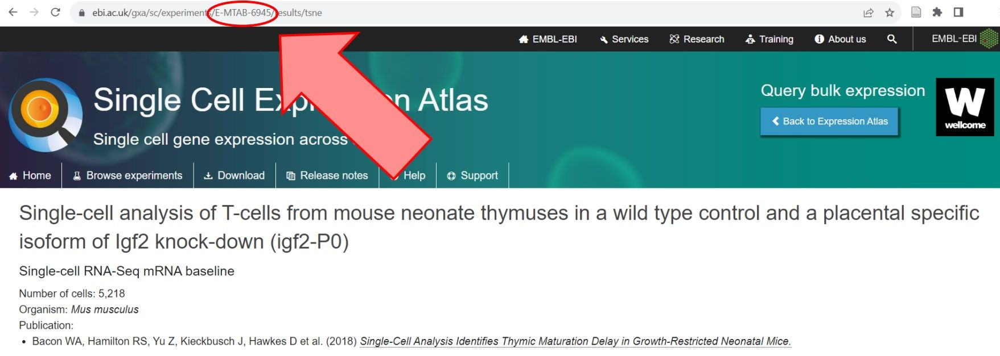

# Introduction 

You finally decided to analyse some single cell data, you got your files either from the lab or publicly available sources, you opened the first tutorial available on Galaxy Training Network and... you hit the wall! The format of your files is not compatible with the one used in tutorial! Have you been there? 

This tutorial was created to help you overcome that problem and ensure data interoperability in single cell analysis. Once you get your data into Galaxy in the right format, that's already 50% of success. Additionally, by using format conversion, you will be able to use different packages presented in tutorials that may require different datatypes. 

> <agenda-title></agenda-title>
>
> In this tutorial, we will cover:
>
> 1. TOC
> {:toc}
>
{: .agenda}

# Single cell datatypes

To start with, here are the most common formats and datatypes that you might come across if you work with single cell data:
- **Tabular** - simply using TSV, CSV or TXT formats to store expression matrix as well as cell and gene metadata. 
- **MTX** - it's just a sparse matrix format with genes on the rows and cells on the columns as output by Cell Ranger.
- **HDF5** - Hierarchical Data Format - can store datasets and groups. A dataset is a  a multidimensional array of data elements, together with supporting metadata. A group is a structure for organizing objects in an HDF5 file. This format allows for storing both the count matrices and all metadata in a single file rather than having separate features, barcodes and matrix files. 
- **AnnData objects** - [anndata](link https://anndata.readthedocs.io/en/latest/) is a Python package for handling annotated data matrices. In Galaxy, you'll see AnnData objects in **h5ad** format, which is based on the standard HDF5 (h5) format. There are lots of Python tools that work with this format, such as Scanpy, MUON, Cell Oracle, SquidPy, etc. 
- **Loom** - it is simply an HDF5 file that contains specific groups containing the main matrix as well as row and column attributes and can be read by any language supporting HDF5. [Loompy](https://linnarssonlab.org/loompy/) has been released as a Python API to interact with loom files, and [loomR](https://github.com/mojaveazure/loomR) is its implementation in R. 
- **Zarr** - a Python package providing an implementation of compressed, chunked, N-dimensional arrays, designed for use in parallel computing. The Zarr file format offers powerful compression options, supports multiple data store backends, and can read/write your NumPy arrays.
- **Seurat objects** - a representation of single-cell expression data for R, in Galaxy you might see them in **rdata** format.
- **Single Cell Experiment (SCE) object** - defines a S4 class for storing data from single-cell experiments and provides a more formalized approach towards construction and accession of data. The S4 system is one of R's systems for object oriented programing. In Galaxy you might see SCE objects in **rdata** format.
- **CellDataSet (CDS) object** - the main class used by Monocle to hold single cell expression data. In Galaxy you might see CDS objects in **rdata** format.

<!---
TO FURTHER IMPROVE THE TUTORIAL:
include images showing the structure of those files
-->




# Data import
As you can see above, there are multiple ways to store single cell data. Therefore, there are also many ways how you can get that data! 

## EBI SCXA Data Retrieval

If you want to use publicly available data, then EBI's [Single Cell Expression Atlas](https://www.ebi.ac.uk/gxa/sc/home) is a great place to get resources from. You can search datasets according to various criteria either using search box in **Home** tab or choosing kingdom, experiment collection, technology type (and others) in **Browse experiments** tab. When you find the experiment you are interested in, just click on it and the experiment ID will be displayed in the website URL, as shown below.



Once you know the experiment ID, you can use EBI SCXA Data Retrieval tool in Galaxy! 

> <hands-on-title>Retrieving data from Single Cell Expression Atlas</hands-on-title>
>
> 1.  with the following parameters:
>      - *"SC-Atlas experiment accession"*: `E-MTAB-6945`
>      - *"Choose the type of matrix to download"*: `Raw filtered counts`
>
{: .hands_on}

At this point you might want to do some modifications in the files before downstream analysis. That can include re-formating the cell metadata or changing the names of the column headers, it all depends on your dataset and how you want to perfrom your analysis. It's also fine to transform those files straight away. Now you have the choice to create AnnData object or Seurat object. 



 <div class="AnnData object" markdown="1">

> <hands-on-title>Create AnnData object</hands-on-title>
>
>  with the following parameters:
>    - *"Expression matrix in sparse matrix format (.mtx)"*: `EBI SCXA Data Retrieval on E-MTAB-6945 matrix.mtx (Raw filtered counts)`
>    - *"Gene table"*:  `EBI SCXA Data Retrieval on E-MTAB-6945 genes.tsv (Raw filtered counts)`
>    - *"Barcode/cell table"*: `EBI SCXA Data Retrieval on E-MTAB-6945 barcodes.tsv (Raw filtered counts)`
>    - *"Cell metadata table"*: `EBI SCXA Data Retrieval on E-MTAB-6945 exp_design.tsv`
{: .hands_on}

</div>

<div class="Seurat object" markdown="1">

> <hands-on-title>Create Seurat object / Loom / SCE </hands-on-title>
>
>  with the following parameters:
>    - *"Choose the format of the input"*: `10X-type MTX`
>    - *"Expression matrix in sparse matrix format (.mtx)"*: `EBI SCXA Data Retrieval on E-MTAB-6945 matrix.mtx (Raw filtered counts)`
>    - *"Gene table"*:  `EBI SCXA Data Retrieval on E-MTAB-6945 genes.tsv (Raw filtered counts)`
>    - *"Barcode/cell table"*: `EBI SCXA Data Retrieval on E-MTAB-6945 barcodes.tsv (Raw filtered counts)`
>    - *"Cell Metadata"*: `EBI SCXA Data Retrieval on E-MTAB-6945 exp_design.tsv`
>
> You can now choose if you want to get Seurat object, Loom or Single Cell Experiment by selecting your option in *"Choose the format of the output"*.
{: .hands_on}

</div>

<!---
HCA doesn't work well for other datasets...
https://github.com/galaxyproject/training-material/issues/4567 
-->

## Human Cell Atlas Matrix Downloader

This tool allows to retrieve expression matrices and metadata for any public experiment available at [Human Cell Atlas data portal](https://data.humancellatlas.org/). 

To use it, simply set the project title, project label or project UUID, which can be found at the [HCA data browser](https://data.humancellatlas.org/explore/projects), and select the desired matrix format (Matrix Market or Loom).


For projects that have more than one organism, one needs to be specified. Otherwise, there is no need to set the species.

Let's use the suggested example of the project *Single cell transcriptome analysis of human pancreas*. If you check this project in HCA, you'll find out that it's actually its label. But it will work the same if you enter the title or UUID! 

> <hands-on-title>Create AnnData object</hands-on-title>
>
>  with the following parameters:
>    - *"Human Cell Atlas project name/label/UUID"*: `Single cell transcriptome analysis of human pancreas`
>    - *"Choose the format of matrix to download"*:  `Matrix Market`
{: .hands_on}

> <details-title>What will be the output?</details-title>
>
> When "Matrix Market" is seleted, outputs are in 10X-compatible Matrix Market format:
> - **Matrix (txt)**: Contains the expression values for genes (rows) and cells (columns) in raw counts. This text file is formatted as a Matrix Market file, and as such it is accompanied by separate files for the gene identifiers and the cells identifiers.
> - **Genes (tsv)**: Identifiers (column repeated) for the genes present in the matrix of expression, in the same order as the matrix rows.
> - **Barcodes (tsv)**: Identifiers for the cells of the data matrix. The file is ordered to match the columns of the matrix.
> - **Experiment Design file (tsv)**: Contains metadata for the different cells of the experiment.
>
> When "Loom" is selected, output is a single Loom HDF5 file:
> - **Loom (h5)**: Contains expression values for genes (rows) and cells (columns) in raw counts, cell metadata table and gene metadata table, in a [single HDF5 file](http://linnarssonlab.org/loompy/format/index.html).
>
{: .details}

If you chose **Loom** format and you need to convert your file to other datatype, you can use  (more details in the next section). If you chose **Matrix Market** format, you can then transform the output to AnnData or Seurat, as shown in the EBI SCXA example above. Below, you will find an example of transforming the output to AnnData object. 


> <hands-on-title>Create AnnData object</hands-on-title>
>
>  with the following parameters:
>    - *"Expression matrix in sparse matrix format (.mtx)"*: `Human Cell Atlas Matrix Downloader on matrix.mtx`
>    - *"Gene table"*:  `Human Cell Atlas Matrix Downloader on genes.tsv`
>    - *"Barcode/cell table"*: `Human Cell Atlas Matrix Downloader on barcodes.tsv`
>    - *"Cell metadata table"*: `Human Cell Atlas Matrix Downloader on exp_design.tsv`
{: .hands_on}


> <tip-title>Flagging genes by using AnnData Operations</tip-title>
>
> After you create AnnData file, you can additionally use the  tool before downstream analysis. It's quite a useful tool since not only does it flag mitochondrial genes, but also automatically calculates a bunch of metrics, such as `log1p_mean_counts`, `log1p_total_counts`, `mean_counts`, `n_cells`, `n_cells_by_counts`, `n_counts`, `pct_dropout_by_counts`, and `total_counts`.
>
> When you use it to flag mitochondrial genes, here are some formatting tips:
> - Remember to check the name of the column with gene symbols
> - This tool is case sensitive
> - No parentheses needed when typing in the values
> - Including a dash is important to identify mitochondrial genes (eg. **MT-**)
{: .tip}


# SCEasy Tool

In Galaxy Toolshed there is a wonderful tool called  which allows you to convert between common single cell formats, such as:
- AnnData to CellDataSet (CDS)
- AnnData to Seurat
- Loom to AnnData
- Loom to SingleCellExperiment (SCE)
- SingleCellExperiment (SCE) to AnnData
- SingleCellExperiment (SCE) to Loom
- Seurat to AnnData
- Seurat to SingleCellExperiment (SCE)

> <warning-title>Two SCEasy tools</warning-title>
>  
> As of the writing of this tutorial, the updated SCEasy tool is called [**SCEasy Converter**](toolshed.g2.bx.psu.edu/repos/iuc/sceasy_convert/sceasy_convert/0.0.7+galaxy1) and it's only available on *usegalaxy.eu*. The second tool is called [**SCEasy convert**](toolshed.g2.bx.psu.edu/repos/ebi-gxa/sceasy_convert/sceasy_convert/0.0.5+galaxy1) and it works on *usegalaxy.org*, however has limited conversion options.
> 
{: .warning}

However, sometimes it is useful to know how to do this conversion manually or at least to know how it all works. Therefore, below are some examples showing how to do it. 

# AnnData -> Seurat

Let's get an **AnnData object** that we can further work on. It's the object used in [many tutorials](), so check it out if you're curious. 

> <hands-on-title>Get toy data</hands-on-title>
>
> 1. Create a new history for this tutorial 
> 2. Import the AnnData object from [Zenodo]({{ page.zenodo_link }})
>
>    ```
>    https://zenodo.org/record/7053673/files/Mito-counted_AnnData
>    ```
>
>    
>
> 3. **Rename**  the datasets `Mito-counted AnnData`
> 4. Check that the datatype is `h5ad`
>
>    
>
{: .hands_on}

Most of our conversions involve extracting tables from different data objects and importing them into the target object.

First, we will extract observations (cell metadata) and the full matrix from our AnnData.

> <hands-on-title> Inspect AnnData </hands-on-title>
>
> 1.  with the following parameters:
>    -  *"Annotated data matrix"*: `Mito-counted_AnnData`
>    - *"What to inspect?"*: `Key-indexed observations annotation (obs)`
>   
> 2. **Rename**  the output `Observations`.
>
> 3.  with the following parameters:
>    -  *"Annotated data matrix"*: `Mito-counted_AnnData`
>    - *"What to inspect?"*: `The full data matrix`
>
> 4. **Rename**  the output `Matrix`.
>    
{: .hands_on}

> <question-title></question-title>
>
> What are the rows, and what are the columns in the retrieved Matrix?
>
> > <solution-title></solution-title>
> >
> > If you just click on the `Matrix` dataset, you will see a preview showing barcodes in the first column, and genes in the first row.
> > 
> {: .solution}
>
{: .question}

However, the next tool we need expects a matrix wherein the genes are listed in the first column and the barcodes are listed in the first row. Therefore, we need to transpose the current matrix.

> <hands-on-title> Transpose the matrix </hands-on-title>
>
> 1.  with the following parameters:
>    -  *"Input tabular dataset"*: `Matrix`
>
{: .hands_on}

And now we are ready to input that data into **DropletUtils** tool, which will separate this matrix into the cells, genes, and matrix tabular files needed to build a Seurat object. 

> <hands-on-title> DropletUtils </hands-on-title>
>
> 1.  with the following parameters:
>    - *"Format for the input matrix"*: `Tabular`
>    -  *"Count Data"*: output of **Transpose** 
>    - *"Operation"*: `Filter for Barcodes`
>        - *"Method"*: `DefaultDrops`
>            - *"Expected Number of Cells"*: `31178`
>            - *"Upper Quantile"*: `1.0`
>            - *"Lower Proportion"*: `0.0`
>        - *"Format for output matrices"*: `Bundled (barcodes.tsv, genes.tsv, matrix.mtx)`
>        - *"Random Seed"*: `100`
>
{: .hands_on}

Finally, let's combine those files that we have just generated and turn them into the Seurat object!

> <hands-on-title> Create Seurat object </hands-on-title>
>
> 1.  with the following parameters:
>    - *"Choose the format of the input"*: `10X-type MTX`
>    -  *"Expression matrix in sparse matrix format (.mtx)"*: `DropletUtils 10X Matrices`
>    - *"Gene table"*: `DropletUtils 10X Genes`
>    - *"Barcode/cell table"*: `DropletUtils 10X Barcodes`
>    -  *"Cell Metadata"*: `Observations`
>    - *"Choose the format of the output"*: `RDS with a Seurat object`
>
> 2. **Rename**  the output `Converted Seurat object`.
>    
{: .hands_on}

As usual, you can check the [example history](https://usegalaxy.eu/u/j.jakiela/h/anndata---seurat) and the dedicated [workflow](https://usegalaxy.eu/u/j.jakiela/w/anndata---seurat-conversion).


# AnnData -> SingleCellExperiment (SCE)

We will work on the same AnnData object so if you create a new history for this exercise, you can either get this file from Zenodo again or just copy this dataset from the previous history. 

> <hands-on-title>Get toy data</hands-on-title>
>
> 1. Create a new history for this section *"Downsampling FASTQ Files"*
> 2. Import the files from [Zenodo]({{ page.zenodo_link_end }})
>
>      ```
>    {{ page.zenodo_link }}/files/Mito-counted_AnnData
>      ```
>
>    
>
{: .hands_on}



First, we will extract observations and the full matrix from our AnnData.

> <hands-on-title> Inspect AnnData </hands-on-title>
>
> 1.  with the following parameters:
>    -  *"Annotated data matrix"*: `Mito-counted_AnnData`
>    - *"What to inspect?"*: `Key-indexed observations annotation (obs)`
>   
> 2. **Rename**  the output `Observations`.
>
> 3.  with the following parameters:
>    -  *"Annotated data matrix"*: `Mito-counted_AnnData`
>    - *"What to inspect?"*: `The full data matrix`
>
> 4. **Rename**  the output `Matrix`.
>    
{: .hands_on}

> <question-title></question-title>
>
> What are the rows, and what are the columns in the retrieved Matrix?
>
> > <solution-title></solution-title>
> >
> > If you just click on the `Matrix` dataset, you will see a preview, showing barcodes in the first column, while genes in the first row.
> > 
> {: .solution}
>
{: .question}

To proceed with the conversion, we must have the matrix where the genes are listed in the first column while all the barcodes should be in the first row. Therefore, we need to transpose the current matrix.

> <hands-on-title> Transpose the matrix </hands-on-title>
>
> 1.  with the following parameters:
>    -  *"Input tabular dataset"*: `Matrix`
>
{: .hands_on}

And now we are ready to input that data to **DropletUtils** tool.

> <hands-on-title> DropletUtils </hands-on-title>
>
> 1.  with the following parameters:
>    - *"Format for the input matrix"*: `Tabular`
>    -  *"Count Data"*: output of **Transpose** 
>    - *"Operation"*: `Filter for Barcodes`
>        - *"Method"*: `DefaultDrops`
>            - *"Expected Number of Cells"*: `31178`
>            - *"Upper Quantile"*: `1.0`
>            - *"Lower Proportion"*: `0.0`
>        - *"Format for output matrices"*: `Bundled (barcodes.tsv, genes.tsv, matrix.mtx)`
>        - *"Random Seed"*: `100`
>
{: .hands_on}

Finally, let's combine those files that we have just generated and turn them into the SingleCellExperiment!

> <hands-on-title> Create SCE object </hands-on-title>
>
> 1.  with the following parameters:
>    -  *"Expression matrix in sparse matrix format (.mtx)"*: `DropletUtils 10X Matrices`
>    -  *"Gene table"*: `DropletUtils 10X Genes`
>    -  *"Barcode/cell table"*: `DropletUtils 10X Barcodes`
>    - *"Should metadata file be added?"*:  `Yes`
>        -  *"Metadata file"*: `Observations`
>        - *"Cell ID column"*: `index`
>     
> 2. **Rename**  the output `Converted SCE object`.
>
{: .hands_on}

As usual, you can check the [example history](https://usegalaxy.eu/u/j.jakiela/h/anndata---singlecellexperiment-sce) and the dedicated [workflow](https://usegalaxy.eu/u/j.jakiela/w/anndata-to-singlecellexperiment-sce-conversion).


# Anndata -> Cell Data Set (CDS)

Cell Data Set (CDS) format is usually used when working with a package called Monocle3 and in the [corresponding tutorial]() it was shown how to transform annotated AnnData to CDS object. Please note that depending on your dataset and pre-processing, you might need to refer to the method used in the mentioned tutorial which uses both annotated and unprocessed matrices. However, here we will just show the main principle of that conversion, so we will continue working on previously used dataset, so you can copy it from your history.



> <hands-on-title>Get toy data</hands-on-title>
>
> 1. Create a new history for this tutorial 
> 2. Import the AnnData object from [Zenodo]({{ page.zenodo_link }})
>
>    ```
>    https://zenodo.org/record/7053673/files/Mito-counted_AnnData
>    ```
>
>    
>
> 3. **Rename**  the datasets `Mito-counted AnnData`
> 4. Check that the datatype is `h5ad`
>
>    
>
{: .hands_on}


Now we just need to extract information about cells, genes and an expression matrix. 


> <hands-on-title> Inspect AnnData </hands-on-title>
>
> 1.  with the following parameters:
>    -  *"Annotated data matrix"*: `Mito-counted_AnnData`
>    - *"What to inspect?"*: `Key-indexed observations annotation (obs)`
>
> **Rename**   the output `Cell barcodes (obs)`.
>
> 2.  with the following parameters:
>    -  *"Annotated data matrix"*: `Mito-counted_AnnData`
>    - *"What to inspect?"*: `Key-indexed annotation of variables/features (var)`
>
> **Rename**   the output `Genes (var)`.
>
> 3.  with the following parameters:
>    -  *"Annotated data matrix"*: `output` (Input dataset)
>    - *"What to inspect?"*: `The full data matrix`
>   
> **Rename**   the output `Expression matrix`.
>      
{: .hands_on}


Hold on here! As mentioned, if you're converting your files to CDS, you'll probably be working with Monocle. There is one function in downstream analysis in Monocle that requires a specific name of the column containing gene symbols, and that is `gene_short_name`. If you use Galaxy buttons for the analysis, you won't be able to change that name after you create CDS file, so a good piece of advice is to rename it at this stage. There is no harm in doing this, and it might save you some time and frustration later on. You only need to check which column contains the gene symbols and what is its header - you can check that in the preview window, simply by clicking on the `Genes` dataset. In our case, that's column 3 and its name is `Symbol`. Let's change that!


> <hands-on-title>Changing the column name</hands-on-title>
>
> 1.  with the following parameters:
>    -  *"Select cells from"*: `Genes`
>    - *"using column"*: `c3` or `Column: 3`
>    - In *"Check"*:
>        -  *"Insert Check"*
>            - *"Find Regex"*: `Symbol`
>            - *"Replacement"*: `gene_short_name`
> 2. Check that the datatype is `tabular`. If not, change it. 
>
>    
>     
> 3. **Rename**  the output: `Genes renamed`
>
{: .hands_on}

We're almost there, but there is one last modification we have to do - transpose the matrix to have the genes as rows and cells as columns.

> <hands-on-title> Transpose the matrix </hands-on-title>
>
> 1.  with the following parameters:
>    -  *"Input tabular dataset"*: `Expression matrix` 
{: .hands_on}

And the final step is to create the CDS file using Monocle tool!
 
> <hands-on-title> Create Cell Data Set </hands-on-title>
>
> 1.  with the following parameters:
>    -  *"Expression matrix, genes as rows, cells as columns. Required input. Provide as TSV, CSV or RDS."*: output of **Transpose** 
>    - *"Format of expression matrix"*: `TSV`
>    -  *"Per-cell annotation, optional. Row names must match the column names of the expression matrix. Provide as TSV, CSV or RDS."*: `Cell barcodes (obs)` 
>    - *"Format of cell metadata"*: `TSV`
>    -  *"Per-gene annotation, optional. Row names must match the row names of the expression matrix. Provide as TSV, CSV or RDS."*: `Genes renamed` 
>    - *"Format of gene annotation"*: `TSV`
>
> 2. **Rename**  the output: `CDS Monocle file`
{: .hands_on}

As usual, you can check the [example history](https://usegalaxy.eu/u/j.jakiela/h/anndata---cell-data-set-cds) and the dedicated [workflow](https://usegalaxy.eu/u/j.jakiela/w/anndata-to-cell-data-set-cds-conversion) (it doesn't include the renaming step though). 

# Downsampling FASTQ files

Sometimes, it is useful to work on smaller subsets of data (especially for teaching / learning purposes). Here is an example of how you can downsample your FASTQ files.

First, let's get some toy data. We just need two FASTQ files - one containing barcodes, the other with transcripts. 

> <hands-on-title>Get toy data</hands-on-title>
>
> 1. Create a new history for this section *"Downsampling FASTQ Files"*
> 2. Import the files from [Zenodo]({{ page.zenodo_link }})
>
>      ```
>    {{ page.zenodo_link }}/files/SLX-7632.TAAGGCGA.N701.s_1.r_1.fq-400k.fastq
>    {{ page.zenodo_link }}/files/SLX-7632.TAAGGCGA.N701.s_1.r_2.fq-400k.fastq
>      ```
>
>    
>
{: .hands_on}


Funnily enough, those files are already downsampled, so you won't have to wait for too long to download them. We are not going to analyse that data anyway, it's just for demonstration purposes.

Quickly check which file contains barcodes and which file contains transcripts. If you click on the two datasets, you will see that one has shorter sequences, while the other has longer. It's quite straight-forward to deduce that shorter sequences are barcodes.

> <hands-on-title>Rename the files</hands-on-title>
>
> 1. Rename file `s_1.r_1` as `Barcodes` 
>
> 2. Rename file `s_1.r_2` as `Transcripts`
>
>    
>
{: .hands_on}

Now we will convert the FASTQ files to tabular:

> <hands-on-title> FASTQ to tabular </hands-on-title>
>
> 1.  with the following parameters:
>    -  *"FASTQ file to convert"*:  Select multiple files: `Barcodes` and `Transcripts` 
>
> 3. **Rename**   the datasets `Barcodes tabular` and `Transcripts tabular`
> 
{: .hands_on}

Now let's select the number of the reads we would like to keep. It's totally up to you, we choose `100000` here.

> <hands-on-title> Downsampling </hands-on-title>
>
> 1.  with the following parameters:
>    -  *"Text file"*:  Select multiple files:   `Barcodes tabular` and `Transcripts tabular`
>    - *"Operation"*: `Keep last lines`
>    - *"Number of lines"*: `100000`
>
> 2. **Rename**  the dataset `Barcodes cut` and `Transcripts cut`
> 
{: .hands_on}

All done, now we just need to go back to FASTQ from Tabular again!


> <hands-on-title> Task description </hands-on-title>
>
> 1.  with the following parameters:
>    -  *"Tabular file to convert"*: `Barcodes cut` (output of **Select last** )
>    - *"Identifier column"*: `c1` or `Column 1`
>    - *"Sequence column"*: `c2` or `Column 2`
>    - *"Quality column"*: `c3` or `Column 3`
>
> 2. **Rename**  the dataset `Downsampled barcode read` and `Downsampled transcript read`
> 
{: .hands_on}

And that's all! Your downsampled data is ready to use. You can check your answers in this [example history](https://usegalaxy.eu/u/j.jakiela/h/how-to-downsample-fastq-files) or if you want to accelerate this process, feel free to use the [workflow](https://singlecell.usegalaxy.eu/u/j.jakiela/w/workflow-constructed-from-history-copy-of-cs1generating-a-single-cell-matrix-using-alevin---how-to-downsample) next time!
