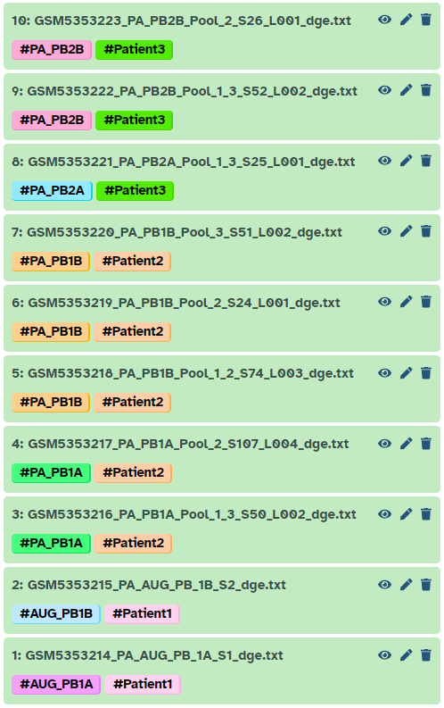

The goal of this tutorial is to take raw NCBI data from some published research, convert the raw data into the AnnData format then add metadata to the object so that it can be used for further processing / analysis. Here we will look at the steps to obtain, understand, and manipulate the data in order for it to be properly processed.

The [NCBI Database](https://www.ncbi.nlm.nih.gov/) is a large repository for storing and accessing various types of biological data such as genome sequences, protein sequences, academic literature, etc. NCBI is a invaluable tool used for researchers and scientists, as a result it is important to know how to understand and utilise NCBI's data resources.

# Obtaining the Data

The first step is the obtain the data. For this tutorial, we will use data from the paper . The data for this research is stored in the Gene Expression Omnibus (GEO).




<div class="Manual" markdown="1">
> <hands-on-title>Download and extract the data from GEO</hands-on-title>
>
> 1. Using a web browser navigate to the GEO repository for the paper
>     ```
>     https://www.ncbi.nlm.nih.gov/geo/query/acc.cgi?acc=GSE176031
>     ```
> 2. Copy the ```(http)``` link located in the supplemental materials section of the page
>
> 3. Import the data into Galaxy
>
>
>    
>
> 4. Change the datatype to `tar`
>
>
>    
>
> 5.  with the following parameters:
>    -  *"input_file"*: `tar` file you just imported
{: .hands_on}
</div>

<div class="Zenodo" markdown="1">
> <hands-on-title>Downloading the data from Zenodo</hands-on-title>
>
> 1. Create a new history for this tutorial
> 2. Import the following files from [Zenodo]({{ page.zenodo_link }})
>
>    ```
>    {{ page.zenodo_link }}/files/GSM5353214_PA_AUG_PB_1A_S1_dge.txt
>    {{ page.zenodo_link }}/files/GSM5353215_PA_AUG_PB_1B_S2_dge.txt
>    {{ page.zenodo_link }}/files/GSM5353216_PA_PB1A_Pool_1_3_S50_L002_dge.txt
>    {{ page.zenodo_link }}/files/GSM5353217_PA_PB1A_Pool_2_S107_L004_dge.txt
>    {{ page.zenodo_link }}/files/GSM5353218_PA_PB1B_Pool_1_2_S74_L003_dge.txt
>    {{ page.zenodo_link }}/files/GSM5353219_PA_PB1B_Pool_2_S24_L001_dge.txt
>    {{ page.zenodo_link }}/files/GSM5353220_PA_PB1B_Pool_3_S51_L002_dge.txt
>    {{ page.zenodo_link }}/files/GSM5353221_PA_PB2A_Pool_1_3_S25_L001_dge.txt
>    {{ page.zenodo_link }}/files/GSM5353222_PA_PB2B_Pool_1_3_S52_L002_dge.txt
>    {{ page.zenodo_link }}/files/GSM5353223_PA_PB2B_Pool_2_S26_L001_dge.txt
>    ```
>
>    
>
> 3. Check that the datatype is `tabular`
>
>    
>
{: .hands_on}
</div>

We now have the raw gene expression data that we will process. However, we will need to manually add some metadata, which requires finding out some more information about our files.


> <hands-on-title>Finding the metadata</hands-on-title>
>
> 1. Follow  the link for the paper ([https://pubmed.ncbi.nlm.nih.gov/35013146/](https://pubmed.ncbi.nlm.nih.gov/35013146/)), where you can see a link for accessing the full text. Accessing the full text takes us the following page [https://www.ncbi.nlm.nih.gov/pmc/articles/PMC8748675/](https://www.ncbi.nlm.nih.gov/pmc/articles/PMC8748675/)
>
> 2. Downloading the paper and looking under **Methods** we can see that there are 2 biopsy samples for patients 1-3. For this tutorial we will be processing the first 3 patient's data, therefore we will need to find more information about the biopsy samples.
> 
>
> 3. On the NCBI page containing the paper we can scroll down to see a **Supplementary Materials** section. Under this section we should see various `.xlsx` files (Excel spreadsheets). These will contain metadata about the work done in the paper.
>
> 4. Looking through each file we can eventually find the spreadsheet ```41467_2021_27322_MOESM2_ESM.xlsx``` which contains information about each patient including the biopsy sample IDs and tumor specimens. So we will want to download this in order to extract out the required information!
>
> 
>
> 5. Download Supplementary Dataset 1 (```41467_2021_27322_MOESM2_ESM.xlsx```).
>
{: .hands_on}

This one spreadsheet contains all the information we need to further understand our data.

## Understanding the Data

If we look at that excel file `41467_2021_27322_MOESM2_ESM.xlsx`, we can see multiple sheets.

> <question-title></question-title>
>
> 1. How many different patients are in this study?
>
> > <solution-title></solution-title>
> >
> > 1. Navigating to ```Clinical_info``` shows us that the data consists of 11 different patients, with some patients having multiple different samples of different tumor specimens.
> >
> {: .solution}
{: .question}

For this tutorial, we are only going to process the first 3 patients. A summary of the relevant data can be seen below:

| PatientID | Biopsy samples | Tumor Specimen |
|:----------|:---------------|:---------------|
| Patient 1 | AUG_PB1A       | left-mid       |
|           | AUG_PB1B       | right-mid      |
| Patient 2 | MAY_PB1A       | right-mid      |
|           | MAY_PB1B       | right-apex     |
| Patient 3 | MAY_PB2A       | right-anterior |
|           | MAY_PB2B       | right-mid      |

We can see that each patient has 2 different samples from different tumor locations. This is important information that needs to be added to our dataset so that we can separate it during analysis, if needed.

Unfortunately, the names of the files don't exactly match the data in our excel sheet. This can make finding the right samples a bit difficult! A summary of which samples match which file can be found below:

- **AUG_PB1A** ---> **PA_AUG_PB_1A**
- **AUG_PB1B** ---> **PA_AUG_PB_1B**
- **MAY_PB1A** ---> **PA_PB1A**
- **MAY_PB1B** ---> **PA_PB1B**
- **MAY_PB2A** ---> **PA_PB2A**
- **MAY_PB2B** ---> **PA_PB2B**

You may also notice that we have multiple sample files with the same name suffixed with `_Pool_X`. These are *replicates*, where multiple samples are taken of the same tumor area in order to get a more comprehensive view of the gene data of the tumor. We will need to combine these replicates during processing.

These replicate files can be confirmed by looking under the **Methods** section of the paper where it states that one to four arrays were used per sample.


<div class="Manual" markdown="1">

We now need to find the files relating to each patient. Selecting the output  **Unzip** tool shows you 53 files in a  dataset collection. We will work with the 10 files associated with our target patients.

> <hands-on-title>Unhiding 10 target files</hands-on-title>
>
> 1. In the  Galaxy history panel, select the *Include hidden* icon  to see the 53 files in your dataset collection.
>
> 2. Scroll down to visualise the following 10 samples (likely in opposite order to this!):
>    ```
>    GSM5353214_PA_AUG_PB_1A_S1_dge.txt
>    GSM5353215_PA_AUG_PB_1B_S2_dge.txt
>    GSM5353216_PA_PB1A_Pool_1_3_S50_L002_dge.txt
>    GSM5353217_PA_PB1A_Pool_2_S107_L004_dge.txt
>    GSM5353218_PA_PB1B_Pool_1_2_S74_L003_dge.txt
>    GSM5353219_PA_PB1B_Pool_2_S24_L001_dge.txt
>    GSM5353220_PA_PB1B_Pool_3_S51_L002_dge.txt
>    GSM5353221_PA_PB2A_Pool_1_3_S25_L001_dge.txt
>    GSM5353222_PA_PB2B_Pool_1_3_S52_L002_dge.txt
>    GSM5353223_PA_PB2B_Pool_2_S26_L001_dge.txt
>    ```
> 3. For each of those 10 samples, select the *Unhide* icon . This will move them from  *Hidden* to *Active*.
>
> 4. Navigate back to the  *Active* datasets list, where you will now see your 10 target samples.
>
> 5. In the  Galaxy history panel, click the  *Select items* to allow you to select multiple datasets from your history
>
> 6.  Select all 10 samples
>
> 7. Select the highlighted rectangle `10 of X` (the X may be different depending on what you've imported!) to give you a menu, from which you select `Change data type`
>
> 8. Select the dropdown menu and either type in or scroll to find `tabular.gz`
>
{: .hands_on}
</div>

# Creating the AnnData object

The next step is to convert all of the raw files into AnnData objects, this can be done one at a time or all at once by selecting ```multiple datasets``` when choosing the input and highlighting all the raw data files.

> <tip-title>Tag your datasets</tip-title>
> Before starting to process the data, it is generally a good idea to add tags to each sample in order to keep track of what data is being processed. Below is some of the imported data with added tags for the patient and sample id. We suggest you replicate this in your history.
>
> 
>
>
{: .tip}

> <hands-on-title>Convert raw data to AnnData</hands-on-title>
>
> 1.  with the following parameters:
>    - *"hd5 format to be created"*: `Anndata file`
>         - *"Format for the annotated data matrix?"*: `Tabular, CSV, TSV`
>         - *"Annotated data matrix"*
>           -  *Multiple datasets*: `Select all imported files`
>         - *"Does the first column store the row names?"*: `Yes`
>
> 2.  with the following parameters:
>    -  *"Annotated data matrix"*: `select any one of the AnnData files`
>    - *"What to inspect?"*: `Key-indexed observations annotation (obs)`
>
{: .hands_on}

Examine  the  *"Inspect AnnData"* output. You will find a list of genes - however, the `obs` (observations) layer in the AnnData object should store cell data. The `var` (variables) should store the genes data. We need to transpose all of our AnnData objects. We will speed up the process by selecting all of the AnnData objects and processing them at once.

> <comment-title>Check your data</comment-title>
> Whilst for this specific data, the object needed to be transposed, this won't always be the case! The easiest way is to check the `obs` data of the AnnData object using the  **Inspect AnnData** tool. The  `obs` file should have a column containing short nucleotide sequences (something like **CGGAAGTGATAC**). If that's the case, then the data doesn't need to be transposed, because those are the cell barcodes!
{: .comment}

> <hands-on-title>Transpose AnnData objects</hands-on-title>
>
> 1.  with the following parameters:
>
>    - *"Annotated data matrix"*
>         -  *Multiple datasets*: `Select all AnnData files`
>    - *"Function to manipulate the object"*: `Transpose the data matrix, leaving observations and variables interchanged`
>
{: .hands_on}

Now, we have all the AnnData objects with the data in the correct orientation. We can combine them into a single AnnData object, which will make the data easier to work with. This combination operation will add an additional column called `batch` which tells us which AnnData object each bit of data came from. This will be useful for further processing!

> <hands-on-title>Combine AnnData objects</hands-on-title>
>
> 1.  with the following parameters:
>    -  *"Annotated data matrix"*: `Select first Manipulate AnnData (transpose) output`
>    - *"Function to manipulate the object"*: `Concatenate along the observations axis`
>         -  *"Annotated data matrix to add"*: `Select all other Manipulate AnnData (transpose) outputs`
>         - *"Join method"*: `Intersection of variables`
>         - *"Key to add the batch annotation to obs"*: `batch`
>         - *"Separator to join the existing index names with the batch category"*: `-`
>
> 2. **Rename**  output `Combined Object`
>
{: .hands_on}

Now we have all of our gene expression data stored in a single AnnData object! We just need to add our metadata!

# Annotating the data

The next step is to annotate our data using the information gathered from the excel sheet earlier. We will do this by leveraging the `batch` column generated when the objects were combined for each individual patient/sample (indicated by the batch number). We will add in the relevant annotations. First, let's extract the observation data so we can manipulate it.

> <hands-on-title></hands-on-title>
>
> 1.  with the following parameters:
>    -  *"Annotated data matrix"*: `Combined Object`
>    - *"What to inspect?"*: `Key-indexed observations annotation (obs)`
>
> 2. **Rename**  output `Observation data`
>
{: .hands_on}

For each new column, we need to replace the relevant batch numbers with the appropriate metadata. After that, we can cut the modified column out so it is separated. We will repeat this process for each piece of metadata we want to add. All the relevant data can be found in the first table of this tutorial.

Let's now add the replicate column which tells us which cells are part of pools of the same patient and tumor location.

> <hands-on-title>Create replicate metadata</hands-on-title>
>
> 1.  *in a specific column* with the following parameters:
>    -  *"File to process"*: `Observation data`
>    - *"1: Replacement"*
>         - *"in column"*: `Column: 2`
>         - *"Find pattern"*: `2|4|7|8`
>         - *"Replace with"*: `poolA`
>    - **+ Insert Replacement**
>    - *"2: Replacement"*
>         - *"in column"*: `Column: 2`
>         - *"Find pattern"*: `3|5|9`
>         - *"Replace with"*: `poolB`
>    - **+ Insert Replacement**
>    - *"3: Replacement"*
>         - *"in column"*: `Column: 2`
>         - *"Find pattern"*: `6`
>         - *"Replace with"*: `poolC`
>    - **+ Insert Replacement**
>    - *"4: Replacement"*
>         - *"in column"*: `Column: 2`
>         - *"Find pattern"*: `0|1`
>         - *"Replace with"*: `NA`
>    - **+ Insert Replacement**
>    - *"5: Replacement"*
>         - *"in column"*: `Column: 2`
>         - *"Find pattern"*: `batch`
>         - *"Replace with"*: `replicate`
>
> 2.  with the following parameters:
>    - *"Cut columns"*: `c2`
>    - *"Delimited by"*: `Tab`
>    -  *"From"*: `output of Replace Text`
>
> 3. **Rename**  output `Replicate Metadata`
>
{: .hands_on}

Next we will add the metadata indicating which patient each row came from.

> <hands-on-title>Create patient data</hands-on-title>
>
> 1.  with the following parameters:
>    -  *"File to process"*: `Observation data`
>    - *"1: Replacement"*
>         - *"in column"*: `Column: 2`
>         - *"Find pattern"*: `0|1`
>         - *"Replace with"*: `patient1`
>    - **+ Insert Replacement**
>    - *"2: Replacement"*
>         - *"in column"*: `Column: 2`
>         - *"Find pattern"*: `2|3|4|5|6`
>         - *"Replace with"*: `patient2`
>    - **+ Insert Replacement**
>    - *"3: Replacement"*
>         - *"in column"*: `Column: 2`
>         - *"Find pattern"*: `7|8|9`
>         - *"Replace with"*: `patient3`
>    - **+ Insert Replacement**
>    - *"5: Replacement"*
>         - *"in column"*: `Column: 2`
>         - *"Find pattern"*: `batch`
>         - *"Replace with"*: `patient`
>
> 2.  with the following parameters:
>    - *"Cut columns"*: `c2`
>    - *"Delimited by"*: `Tab`
>    -  *"From"*: `output of Replace Text`
>
> 3. **Rename**  output `Patient Metadata`
>
{: .hands_on}

We will now add a column to indicate which sample each row came from using the sample ID's described earlier.

> <hands-on-title>Create sample ID metadata</hands-on-title>
>
> 1.  with the following parameters:
>    -  *"File to process"*: `Observation data`
>    - *"1: Replacement"*
>         - *"in column"*: `Column: 2`
>         - *"Find pattern"*: `0`
>         - *"Replace with"*: `AUG_PB1A`
>    - **+ Insert Replacement**
>    - *"2: Replacement"*
>         - *"in column"*: `Column: 2`
>         - *"Find pattern"*: `1$`
>         - *"Replace with"*: `AUG_PB1B`
>    - **+ Insert Replacement**
>    - *"3: Replacement"*
>         - *"in column"*: `Column: 2`
>         - *"Find pattern"*: `(2$)|3`
>         - *"Replace with"*: `MAY_PB1A`
>    - **+ Insert Replacement**
>    - *"4: Replacement"*
>         - *"in column"*: `Column: 2`
>         - *"Find pattern"*: `4|5|6`
>         - *"Replace with"*: `MAY_PB1B`
>    - **+ Insert Replacement**
>    - *"5: Replacement"*
>         - *"in column"*: `Column: 2`
>         - *"Find pattern"*: `7`
>         - *"Replace with"*: `MAY_PB2A`
>    - **+ Insert Replacement**
>    - *"6: Replacement"*
>         - *"in column"*: `Column: 2`
>         - *"Find pattern"*: `8|9`
>         - *"Replace with"*: `MAY_PB2B`
>    - **+ Insert Replacement**
>    - *"7: Replacement"*
>         - *"in column"*: `Column: 2`
>         - *"Find pattern"*: `batch`
>         - *"Replace with"*: `specimenID`
>
> 2.  with the following parameters:
>    - *"Cut columns"*: `c2`
>    - *"Delimited by"*: `Tab`
>    -  *"From"*: `output of Replace Text`
>
> 3. **Rename**  output `Specimen Metadata`
>
{: .hands_on}

> <details-title>$ parameter</details-title>
> You may have noticed that some of the parameters in the previous tool used the $ symbol. This is due to how the  tool works. The tool will replace and **update** the data for every insert operation, meaning that lines that have already been updated could be updated again.
>
> Since we are replacing our batch ID's with identifiers that include numbers, we want to prevent them from being updated again. Appending the pattern with the `$` symbol tells the tool to only replace the pattern if it is not followed by any other character (so the 1 in `AUG_PB1A` won't be replaced as it is followed by an 'A').
{: .details}

Finally we will add the tumor column which indicates which tumor sample each row belongs to.

> <hands-on-title>Create tumor metadata</hands-on-title>
>
> 1.  with the following parameters:
>    -  *"File to process"*: `Observation data`
>    - *"1: Replacement"*
>         - *"in column"*: `Column: 2`
>         - *"Find pattern"*: `0`
>         - *"Replace with"*: `left-mid`
>    - **+ Insert Replacement**
>    - *"2: Replacement"*
>         - *"in column"*: `Column: 2`
>         - *"Find pattern"*: `1|2|3|8|9`
>         - *"Replace with"*: `right-mid`
>    - **+ Insert Replacement**
>    - *"3: Replacement"*
>         - *"in column"*: `Column: 2`
>         - *"Find pattern"*: `4|5|6`
>         - *"Replace with"*: `right-apex`
>    - **+ Insert Replacement**
>    - *"4: Replacement"*
>         - *"in column"*: `Column: 2`
>         - *"Find pattern"*: `7`
>         - *"Replace with"*: `right-anterior`
>    - **+ Insert Replacement**
>    - *"5: Replacement"*
>         - *"in column"*: `Column: 2`
>         - *"Find pattern"*: `batch`
>         - *"Replace with"*: `tumorSpecimen`
>
> 2.  with the following parameters:
>    - *"Cut columns"*: `c2`
>    - *"Delimited by"*: `Tab`
>    -  *"From"*: `output of Replace Text`
>
> 3. **Rename**  output `Tumor Metadata`
>
{: .hands_on}

With all the individual metadata columns created, we can now combine them together to make a single tabular file containing our metadata. Since the ```Paste``` operation only allows us to combine two columns at once we will need to run the tool a few times to add all the columns together.

> <hands-on-title>Combine metadata</hands-on-title>
>
> 1.  with the following parameters:
>    -  *"Paste"*: `Replicate Metadata`
>    -  *"and"*: `Patient Metadata`
>    - *"Delimit by"*: `Tab`
>
> 2.  with the following parameters:
>    -  *"Paste"*: `Output of previous Paste`
>    -  *"and"*: `Specimen Metadata`
>    - *"Delimit by"*: `Tab`
>
> 3.  with the following parameters:
>    -  *"Paste"*: `Output of previous Paste`
>    -  *"and"*: `Tumor Metadata`
>    - *"Delimit by"*: `Tab`
>
> 4. **Rename**  output `Cell Metadata`
>
{: .hands_on}

After processing the ```Cell Metadata``` table should look like the following:


With the metadata table ready, we can add it to our original combined object!

> <hands-on-title>Add metadata to AnnData object</hands-on-title>
>
> 1.  with the following parameters:
>    -  *"Annotated data matrix"*: `Combined Object`
>    - *"Function to manipulate the object"*: `Add new annotation(s) for observations of variables`
>         - *"What to annotate?"*: `Observations (obs)`
>         -  *"Table with new annotations"*: `Cell Metadata`
>
> 2. **Rename**  output `Annotated Object`
>
{: .hands_on}

 Congratulations! You have successfully interpreted the milieu of files in a published dataset, transformed the data into a usable format, and added all the relevant annotations to the AnnData object! All that's left to do is to add some quality control metrics using automated tools!

# Adding quality control metrics

With the manual annotations added, we need to do some further processing to add some statistical metadata about the genes. This is done automatically by running two different tools.

First, we will run the ```Scanpy FilterCells``` tool without actually filtering. This tool will add some metadata about the counts and numbers of expressed genes.

> <warning-title>Scanpy FilterCells version issue</warning-title>
> The  tool (used below) does not work in the latest version (**1.8.1+galaxy93**), switch to version **1.8.1+galaxy9** in order to run the tool without error.
{: .warning}

> <hands-on-title>Add initial metadata</hands-on-title>
>
> 1.  with the following parameters:
>    -  *"Input object in AnnData/Loom format"*: `Annotated Object`
>    - *"Name of the column in `anndata.var` that contains gene name"*: `_index`
>
{: .hands_on}

The final tool,  **AnnData Operations**, will add the rest of our metadata. This is mostly information about the mitochondrial genes present in the object, roughly counted by flagging genes that start with **MT-**.

> <hands-on-title>Add final metadata</hands-on-title>
>
> 1.  with the following parameters:
>    -  *"Input object in hdf5 AnnData format"*: `Output of Scanpy FilterCells`
>    - **+ Insert Flag genes that start with these names**
>    - *"1: Parameters to select cells to keep"*
>         - *"starts with"*: `MT-`
>         - *"Var name"*: `mito`
>
> 2. **Rename**  output `Final Object`
>
> 3.  with the following parameters:
>    -  *"Annotated data matrix"*: `Final Object`
>    - *"What to inspect?"*: `Key-indexed observations annotation (obs)`
>
{: .hands_on}

With that run we should be finished! Check the  `obs` file to see all the metadata that we've added in throughout the tutorial.

> <warning-title>Check your final object!</warning-title>
> The above tools will sometimes run without error but not produce the correct results - just because they run doesn't mean all the parameters and inputs were set properly! When  inspecting the  `obs` file of the final AnnData object, you should see that all the columns contain data. If any of the columns are blank, then something has gone wrong!
{: .warning}

 Congratulations! Now your data is ready for further processing or analysis! You can compare your analysis results with this [example history](https://usegalaxy.eu/u/videmp/h/ncbi-to-anndata) and redo the whole analysis with a single click using this [workflow](https://usegalaxy.eu/u/videmp/w/ncbi-to-anndata).
