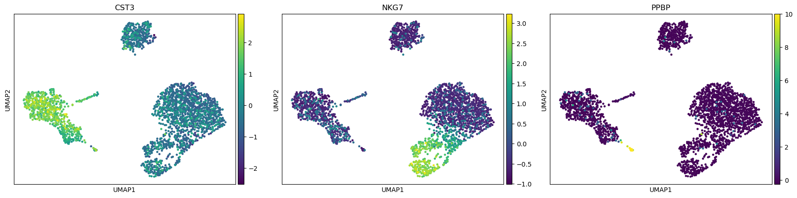
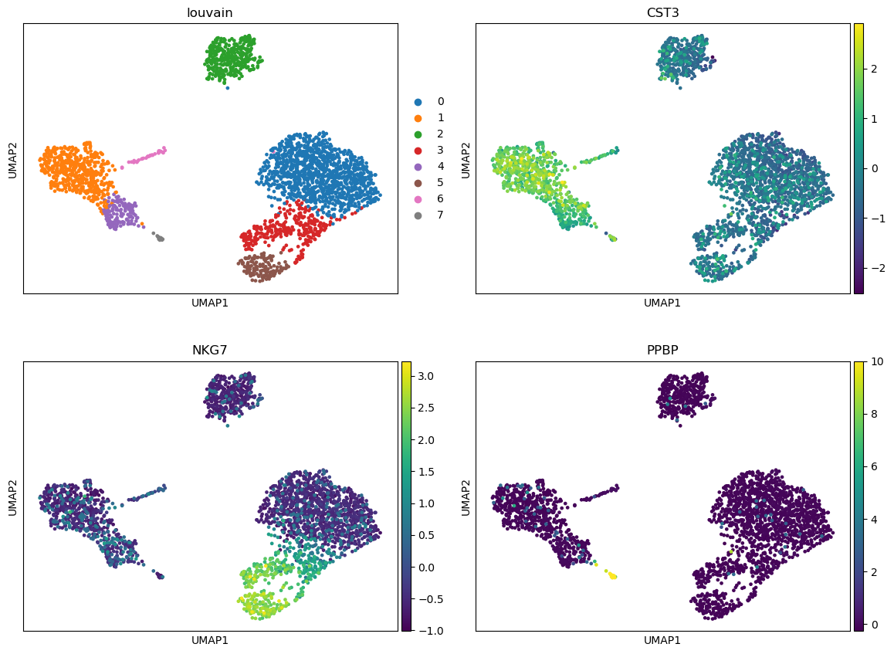
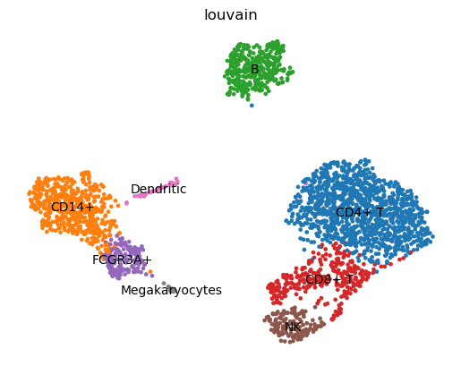
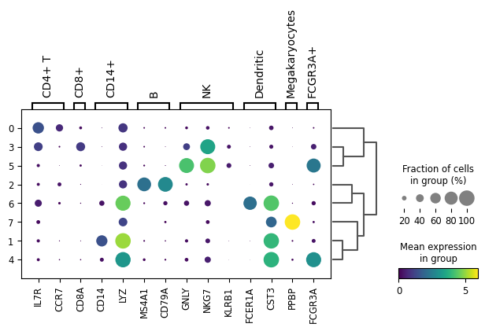

# Introduction


> <comment-title></comment-title>
>
> This tutorial is significantly based on ["Clustering 3K PBMCs" tutorial from Scanpy](https://scanpy-tutorials.readthedocs.io/en/latest/pbmc3k.html#Clustering-3K-PBMCs), ["Seurat - Guided Clustering Tutorial"](https://satijalab.org/seurat/v3.1/pbmc3k_tutorial.html) and ["Orchestrating Single-Cell Analysis with Bioconductor"](https://osca.bioconductor.org/) .
>
{: .comment}

Single-cell RNA-seq analysis is a rapidly evolving field at the forefront of transcriptomic research, used in high-throughput developmental studies and rare transcript studies to examine cell heterogeneity within a populations of cells. The cellular resolution and genome wide scope make it possible to draw new conclusions that are not otherwise possible with bulk RNA-seq.

In this tutorial, we will investigate clustering of single-cell data from 10x Genomics, including preprocessing, clustering and the identification of cell types via known marker genes, using [Scanpy](https://scanpy.readthedocs.io/en/stable/index.html) (). It will be illustrated using a dataset of Peripheral Blood Mononuclear Cells (PBMC), containing 2,700 single cells.

> <agenda-title></agenda-title>
>
> In this tutorial, we will cover:
>
> 1. TOC
> {:toc}
>
{: .agenda}

# Data

For this tutorial, we analyze a dataset of Peripheral Blood Mononuclear Cells (PBMC) extracted from a healthy donor, freely available from 10X Genomics. The dataset contains 2,700 single cells sequenced using Illumina NextSeq 500. The raw sequences have been processed by the [**cellranger**](https://support.10xgenomics.com/single-cell-gene-expression/software/pipelines/latest/what-is-cell-ranger) pipeline from 10X to extract a unique molecular identifier (UMI) count matrix, in a similar way to that as explained in ["Pre-processing of 10X Single-Cell RNA Datasets" tutorial]().

In this matrix, the values represent the number for each feature (i.e. gene; row) that are detected in each cell (column). Such matrices can be quite large, where here there are 2,700 columns with 32,738 lines, with mostly zero values, i.e. an extremely sparse matrix. To optimize the storage of such a table and the information about the genes and cells, **cellranger** creates 3 files:

- `genes.tsv`: a tabular file with information about the 32,738 genes in 2 columns (Ensembl gene id and the gene symbol)
- `barcodes.tsv`: a tabular file with the barcode for each of the 2,700 cells
- `matrix.mtx`: a condensed version of the count matrix

    The count matrix is therefore represented by its non-zero values. Each non-zero value is indicated by its line number (1st column), its column number (2nd column) and its value (3rd column). The first row gives indication about the number of lines, column and non-zero values. More information on the Matrix Market Exchange (mtx) format can be found [in this documentation](https://math.nist.gov/MatrixMarket/formats.html)

## Data upload

> <hands-on-title>Data upload</hands-on-title>
>
> 1. Create a new history for this tutorial
> 2. Import the `genes.tsv`, `barcodes.tsv` and `matrix.mtx` from [Zenodo]({{ page.zenodo_link }}) or from the shared data library
>
>    ```
>    {{ page.zenodo_link }}/files/genes.tsv
>    {{ page.zenodo_link }}/files/barcodes.tsv
>    {{ page.zenodo_link }}/files/matrix.mtx
>    ```
>
>    
>    
>
> 3. Rename the datasets
> 4. Inspect the `matrix` file
{: .hands_on}

> <question-title></question-title>
>
> ```
> 32738	2700	2286884
> 32709	1	4
> 32707	1	1
> 32706	1	10
> 32704	1	1
> ```
>
> 1. How many non-zero values are in the matrix?
> 2. How many counts are found for the 32,706th gene in the 1st cell?
>
> > <solution-title></solution-title>
> >
> > 1. There are 2,286,884 (2.6%) non-zero values for the 88,392,600 possible counts of the 32,738 genes (rows) and 2,700 cells (columns).
> > 2. 10 counts are found for the 32,706th row and 1st column.
> >
> {: .solution}
>
{: .question}

The representation of the matrix with 3 files is convenient to share the data but not to process them. Single-cell analysis packages have attempted to solve the problem of storage and analysis by inventing their own standard, which has led to the proliferation of many different "standards" in the scRNA-seq package ecosystem.

## AnnData

The most common format, called [`AnnData`](https://anndata.readthedocs.io/en/stable/), stores the matrix as well as gene and cell annotations in a concise, compressed and extremely readable manner:

 <code>obs</code>, variables (i.e. genes) <code>var</code> and unstructured annotations <code>uns</code>.")

This format is used by [Scanpy](https://scanpy.readthedocs.io/en/stable/index.html) (), the tool suite for analyzing single-cell gene expression data that we will use in this tutorial. So we need first to import the matrix and annotations of genes and cells into an `AnnData` object.

> <hands-on-title>Transform matrix and all into AnnData object</hands-on-title>
>
> 1.  with the following parameters:
>    - *"hd5 format to be created"*: `Anndata file`
>    - *"Format for the annotated data matrix"*: `Matrix Market (mtx), from Cell ranger or not`
>        -  *"Matrix"*: `matrix.mtx`
>        - *"Use 10x Genomics formatted mtx"*: `Output from Cell Ranger v2 or earlier versions`
>            -  *"Genes"*: `genes.tsv`
>            -  *"Barcodes"*: `barcodes.tsv`
>            - *"Variables index"*: `gene_symbols`
>            - *"Make the variable index unique by appending '-1', '-2'?"*: `Yes`
>
> 2. Rename the generated file to `Input 3k PBMC`
>
> 3. Check that the format is `h5ad`
{: .hands_on}

Because the `AnnData` format is an extension of the HDF5 format, i.e. a binary format, an `AnnData` object can not be inspected directly in Galaxy by clicking on the  (**View data**) icon. Instead we need to use a dedicated tool from the **AnnData** suite.

> <hands-on-title>Inspect an AnnData object</hands-on-title>
>
> 1.  with the following parameters:
>    -  *"Annotated data matrix"*: `Input 3k PBMC`
>    - *"What to inspect?"*: `General information about the object`
>
> 2. Inspect the generated file
>
>    > <question-title></question-title>
>    >
>    > ```
>    > AnnData object with n_obs × n_vars = 2700 × 32738
>    >     var: 'gene_ids'
>    > ```
>    >
>    > 1. How many observations are there? What do they represent?
>    > 2. How many variables are there? What do they represent?
>    >
>    > > <solution-title></solution-title>
>    > >
>    > > 1. There are 2,700 observations, representing the cells.
>    > > 2. There are 32,738 variables, representing the genes.
>    > >
>    > {: .solution}
>    >
>    {: .question}
>
>    > <comment-title>Faster Method for General Information</comment-title>
>    >
>    > * The **ScanPy** toolset in Galaxy produces *AnnData* formats as
>    >   output, where general information is provided for each dataset:
>    >    * Click on the name of the dataset in the history to expand it.
>    >    * General Anndata information would be given in the expanded box:
>    >
>    >      e.g.
>    >
>    >      ```
>    >      [n_obs x n_vars]
>    >      -    2700 x 32738
>    >      ```
>    > * For more specific queries,  is required.
>    {: .comment}
>
> 3.  with the following parameters:
>    -  *"Annotated data matrix"*: `Input 3k PBMC`
>    - *"What to inspect?"*: `The full data matrix`
>
> 4. Inspect the generated file
>
>    > <question-title></question-title>
>    >
>    > ```
>    > index	MIR1302-10	FAM138A	OR4F5	RP11-34P13.7	RP11-34P13.8 ...
>    > AAACATACAACCAC-1	0.0	0.0	0.0	0.0
>    > AAACATTGAGCTAC-1	0.0	0.0	0.0	0.0
>    > AAACATTGATCAGC-1	0.0	0.0	0.0	0.0
>    > AAACCGTGCTTCCG-1	0.0	0.0	0.0	0.0
>    > AAACCGTGTATGCG-1	0.0	0.0	0.0	0.0
>    > ```
>    >
>    > What is stored in the generated file?
>    >
>    > > <solution-title></solution-title>
>    > >
>    > > The file is a table with 2,700 lines (observations or cells) and 32,738 columns (variables or genes): the count matrix for each of the 32,738 genes and 2,700 cells. The 1st row contains the gene symbol as annotation of the columns and the 1st column the barcodes of the cells as annotation of the rows.
>    > >
>    > {: .solution}
>    >
>    {: .question}
>
> 5.  with the following parameters:
>    -  *"Annotated data matrix"*: `Input 3k PBMC`
>    - *"What to inspect?"*: `Key-indexed observations annotation (obs)`
>
> 6. Inspect the generated file
>
>    > <question-title></question-title>
>    >
>    > ```
>    > index
>    > AAACATACAACCAC-1
>    > AAACATTGAGCTAC-1
>    > AAACATTGATCAGC-1
>    > AAACCGTGCTTCCG-1
>    > AAACCGTGTATGCG-1
>    > ```
>    >
>    > What is stored in the generated file?
>    >
>    > > <solution-title></solution-title>
>    > >
>    > > The file is a tabular with annotations of the observations. i.e. the cells. Here there are only the barcodes as annotation, so only one column, being also the index for the count matrix.
>    > >
>    > {: .solution}
>    >
>    {: .question}
>
> 7.  with the following parameters:
>    -  *"Annotated data matrix"*: `Input 3k PBMC`
>    - *"What to inspect?"*: `Key-indexed annotation of variables/features (var)`
>
> 8. Inspect the generated file
>
>    > <question-title></question-title>
>    >
>    > ```
>    > index	gene_ids
>    > MIR1302-10	ENSG00000243485
>    > FAM138A	ENSG00000237613
>    > OR4F5	ENSG00000186092
>    > RP11-34P13.7	ENSG00000238009
>    > RP11-34P13.8	ENSG00000239945
>    > ```
>    >
>    > What is stored in the generated file?
>    >
>    > > <solution-title></solution-title>
>    > >
>    > > The file is a tabular with annotations of the variables, i.e. the genes. Here the files has 2 columns: the gene symbols (also the index in the count matrix), `gene_ids` or the Ensemble gene ids.
>    > >
>    > {: .solution}
>    >
>    {: .question}
{: .hands_on}

# Preprocessing

The first step when we get our counts is to prepare them before we perform the clustering. This includes ():

1. **Selection and filtration of cells and genes based on quality metrics**

    Low-quality cells would interfere with downstream analyses. These cells may have been damaged during processing and may not have been fully captured by the sequencing protocol.

2. **Data normalization and scaling**

    It will eliminate cell-specific biases (e.g., in capture efficiency), allowing us to perform explicit comparisons across cells afterwards. Some transformations, typically log, are also applied to adjust for the mean-variance relationship.

3. **Selection of features**

    This selection picks a subset of interesting features for downstream analysis, by modelling the variance across cells for each gene and retaining genes that are highly variable. This step is done to reduce computational overhead and noise from uninteresting genes.

## Quality control

Genes that appear in less than a few cells can be considered noise and thus removed.

> <hands-on-title>Remove genes found in less than 3 cells</hands-on-title>
>
> 1.  with the following parameters:
>    -  *"Annotated data matrix"*: `Input 3k PBMC`
>    - *"Method used for filtering"*: `Filter genes based on number of cells or counts, using 'pp.filter_genes'`
>        - *"Filter"*: `Minimum number of cells expressed`
>            - *"Minimum number of cells expressed required for a gene to pass filtering"*: `3`
>
> 2. Rename the generated file `3k PBMC`
> 3. Inspect the dataset.
>
>    > <question-title></question-title>
>    >
>    > ```
>    > [n_obs × n_vars]
>    > -    2700 × 13714
>    > [var]
>    > -    gene_ids
>    > -    n_cells
>    > ```
>    >
>    > How many genes have been removed because they are expressed in less than 3 expressed cells?
>    >
>    > > <solution-title></solution-title>
>    > >
>    > > There are now 13,714 genes. So 19,024 (32,738 - 13,714) genes have been removed.
>    > >
>    > {: .solution}
>    >
>    {: .question}
{: .hands_on}

Low-quality cells may be due to a variety of sources such as cell damage during dissociation or failure in library preparation (e.g., inefficient reverse transcription or PCR amplification, ). Usually these low-quality cells have low total counts, few expressed genes and high mitochondrial or spike-in proportions. Low-quality cells are problematic for downstream analyses and may contribute to misleading results.

> <details-title>Impact of low-quality cells on the downstream analyses</details-title>
>
> #### Formation of their own distinct cluster(s)
>
> Increased mitochondrial proportions or enrichment for nuclear RNAs after cell damage are the most obvious causes for this phenomenon. Low-quality cells in different cell types can, in the worst case, cluster together (because of similarities in the damage-induced expression profiles) leading to artificial intermediate states or trajectories between subpopulations that should be otherwise distinct. This phenomenon makes the results difficult to interpret.
>
> #### Distortion of population heterogeneity during variance estimation or principal components analysis
>
> With low-quality cells, the main differences captured by the first few principal components will be based on quality rather than biology, reducing then the effectiveness of dimensionality reduction. Similarly, differences between low- and high-quality cells will create genes with the largest variances. For example, in low-quality cells with very low counts, the scaling normalization increases the variance of genes that happen to have a non-zero count in those cells.
>
> #### Misidentification of upregulated genes
>
> Due to aggressive scaling to normalize for small cell sizes, low-quality cells shows genes that appear to be strongly "upregulated". For example, contaminating transcripts may be present in all cells with a low but constant levels. With the increased scaling normalization in low-quality cells, the small counts for these transcripts may become large normalized expression values, i.e. an apparent upregulation compared to other cells.
>
{: .details}

To mitigate these problems, we need to remove these low-quality cells at the start of the analysis. Several common QC metrics can be used to identify these cells based on their expression profile:

- **Cell size**, i.e. the total sum of counts across all genes for each cells

    When cells are very degraded or absent from the library preparation, the number of reads sequenced from that library will be very low. Cells with small sizes are then considered to be of low quality: the RNA has been lost during the library preparation (cell lysis, inefficient cDNA capture and amplification, etc.)

- **Number of expressed genes**, i.e. the number of genes with non-zero counts for each cells

    A low number of expressed genes may be a result of poor-quality cells (e.g. dying, degraded, damaged, etc.), followed by high PCR amplification of the remaining RNA. The diverse transcript population has not been successfully captured so the cell is considered of low quality. Cell doublets or multiplets may also exhibit an aberrantly high gene count.

- **Proportion of reads mapped to genes in the mitochondrial genome**

    High concentrations of mitochondrial genes is often a result of damaged cells (, ) where the endogenous RNA escapes or degrades. As mitochondria has its own cell membranes, it is often the last DNA/RNA in damaged cells to degrade and hence occurs in high quantities during sequencing.

We will make the key assumption that these metrics are independent of the biological state of each cell. Technical factors rather than biological processes are presumed to drive poor values (e.g., low cell sizes, high mitochondrial proportions). The subsequent removal of impacted cells do not misrepresent the biology in downstream analyses.

To identify low-quality cells, the simplest approach is to apply thresholds on the QC metrics. This strategy, while simple, is required to determine appropriate thresholds that will change given the experimental protocol and the biological system.

### Computation of QC metrics

To estimate the thresholds, we first need to look at the distribution of QC metrics for our dataset.

The first 2 QC metrics (cell size and number of expressed genes) can be easily estimated from the count table. For the third metric (proportion of reads mapped to genes in the mitochondrial genome), we need the information about which genes are mitochondrial or not.

> <hands-on-title>Extract gene annotation</hands-on-title>
>
> 1.  with the following parameters:
>    -  *"Annotated data matrix"*: `3k PBMC`
>    - *"What to inspect?"*: `Key-indexed annotation of variables/features (var)`
>
> 2. Rename the generated file `Gene annotation`
{: .hands_on}

In the gene annotation, we currently have the gene symbol the Ensembl gene ids and the number of cells in which the genes are expressed, but have no information on whether a gene is mitochondrial. This can be extracted from the gene symbol as all mitochondrial genes have a name starting with `MT-` and added to the `var` of the `AnnData` object using **Manipulate AnnData** tool.

A new annotation for `var` should be a table with the same number of lines as `var` (i.e. one line per genes) and as many columns as new annotations, with their names on the 1st line. In our case, we would need to create a 1 column table with `mito` on the 1st line and then `True` for mitochondrial gene or `False` for non mitochondrial genes.

To create this table, we need to:

1. Create a file with gene symbols from `Gene annotation` and a column with `1` for mitochondrial genes and `0` for other genes

    Using the `awk` program, we would like to print for every line the 1st column and a 2nd column with `1` if the 1st column starts with `MT-` or `0` if not, using the regular expression `$1 ~ /^MT-/`

2. Format it

    1. Replace the `0` by `False` and `1` by `True`
    2. Remove the first line
    3. Keep only the 2nd column
    4. Add `mito` on the 1st line

> <hands-on-title>Add mitochondrial gene annotation</hands-on-title>
>
> 1.  with the following parameters:
>    -  *"File to process"*: `Gene annotation`
>    - *"AWK Program"*: `{print $1, $1 ~ /^MT-/}`
>
> 2. Inspect the generated file
>
>    > <question-title></question-title>
>    >
>    > How many genes are found as mitochondrial?
>    >
>    > > <solution-title></solution-title>
>    > >
>    > > To evaluate the number of non mitochondrial, we need to extract all lines for which the 2nd column is 1. This can be done using the  tool:
>    > >
>    > >    -  *"Filter"*: output of **Text reformatting**
>    > >    - *"With following condition"*: `c2!=0`
>    > >    - *"Number of header lines to skip"*: `1`
>    > >
>    > > There are 13 genes found as mitochondrial (0.10% of the 13,714 genes).
>    > {: .solution}
>    >
>    {: .question}
>
> 3.  with the following parameters:
>    -  *"File to process"*: output of **Text reformatting** 
>    - In *"Replacement"*:
>        -  *"Insert Replacement"*
>            - *"in column"*: `Column: 2`
>            - *"Find pattern"*: `0`
>            - *"Replace with"*: `False`
>        -  *"Insert Replacement"*
>            - *"in column"*: `Column: 2`
>            - *"Find pattern"*: `1`
>            - *"Replace with"*: `True`
>
>    <small>**Note**: *Ensure that you have selected the same column for both replacements.*</small>
>
> 4.  with the following parameters:
>    -  *"Text file"*: output of **Replace Text** 
>    - *"Operation"*: `Keep everything from this line on`
>    - *"Number of lines"*: `2`
>
> 5.  with the following parameters:
>    - *"Cut columns"*: `c2`
>    -  *"From"*: output of **Select last** 
>
> 6. Create a new **tabular** file from the following
>
>    ```
>    mito
>    ```
>
>    
>
> 7.  with the following parameters:
>    -  *"Datasets to concatenate"*: `Pasted entry` dataset
>    - In *"Dataset"*:
>        -  *"Insert Dataset"*
>            -  *"Select"*: output of **Cut** 
>
> 8. Rename the generated file `Mitochondrial annotation` and ensure that the datatype is `tabular`
>
> 9.  with the following parameters:
>    -  *"Annotated data matrix"*: `3k PBMC`
>    - *"Function to manipulate the object"*: `Add new annotation(s) for observations or variables`
>      - *"What to annotate?"*: `Variables (var)`
>      -  *"Table with new annotations"*: `Mitochondrial annotation`
>
> 10. Rename the generated file `3k PBMC with mito annotation`
>
> 11.  with the following parameters:
>    -  *"Annotated data matrix"*: `3k PBMC with mito annotation`
>    - *"What to inspect?"*: `Key-indexed annotation of variables/features (var)`
>
> 12. Inspect the generated file and check if the mitochondrial annotation has been added
{: .hands_on}

We can now compute QC metrics on the `AnnData` object.

> <hands-on-title>Compute QC metrics</hands-on-title>
>
> 1.  with the following parameters:
>    -  *"Annotated data matrix"*: `3k PBMC with mito annotation`
>    - *"Method used for inspecting"*: `Calculate quality control metrics, using 'pp.calculate_qc_metrics'`
>      - *"Name of kind of values in X"*: `counts`
>      - *"The kind of thing the variables are"*: `genes`
>      - *"Keys for boolean columns of `.var` which identify variables you could want to control for"*: `mito`
>
> 2. Rename the generated file `3k PBMC with mito annotation and qc metrics`
>
> 3. Inspect the dataset
>
>    > <question-title></question-title>
>    >
>    > ```
>    > [n_obs × n_vars]
>    > -    2700 × 13714
>    > [obs]
>    > -    n_genes_by_counts
>    > -    log1p_n_genes_by_counts
>    > -    total_counts
>    > -    log1p_total_counts
>    > -    pct_counts_in_top_50_genes
>    > -    pct_counts_in_top_100_genes
>    > -    pct_counts_in_top_200_genes
>    > -    pct_counts_in_top_500_genes
>    > -    total_counts_mito
>    > -    log1p_total_counts_mito
>    > -    pct_counts_mito
>    > [var]
>    > -    gene_ids
>    > -    n_cells
>    > -    mito
>    > -    n_cells_by_counts
>    > -    mean_counts
>    > -    log1p_mean_counts
>    > -    pct_dropout_by_counts
>    > -    total_counts
>    > -    log1p_total_counts
>    > ```
>    >
>    > Which QC metrics have been computed?
>    >
>    > > <solution-title></solution-title>
>    > >
>    > > The tool computed several QC metrics at both cell and gene levels. These metrics are added to the annotation tables.
>    > >
>    > > At gene levels (stored in `var`):
>    > > - `total_counts`: sum of counts for a gene
>    > > - `mean_counts`: mean expression for a gene over all cells
>    > > - `n_cells_by_counts`: number of cells with non-zero counts for a gene
>    > > - `pct_dropout_by_counts`: percentage of cells this gene does not appear in
>    > >
>    > > At cell levels (stored in `obs`):
>    > > - `total_counts`: total number of counts for a cell
>    > > - `total_counts_mito`: total number of counts for the mitochondrial genes in a cell
>    > > - `n_genes_by_counts`: number of genes with non-zero counts
>    > > - `pct_counts_mito`: proportion of total counts for a cell which are from mitochondrial genes
>    > > - `pct_counts_in_top_50_genes`: cumulative percentage of counts for 50 most expressed genes in a cell
>    > > - `pct_counts_in_top_100_genes`: cumulative percentage of counts for 100 most expressed genes in a cell
>    > > - `pct_counts_in_top_200_genes`: cumulative percentage of counts for 200 most expressed genes in a cell
>    > > - `pct_counts_in_top_500_genes`: cumulative percentage of counts for 500 most expressed genes in a cell
>    > {: .solution}
>    >
>    {: .question}
{: .hands_on}

We would like to visualize 3 of the more informative QC metrics:

- the cell size, i.e. `total_counts`
- the number of expressed genes, i.e. `n_genes_by_counts`
- the proportion of reads mapped to mitochondrial genes, i.e. `pct_counts_mito`

> <hands-on-title>Visualize QC metrics</hands-on-title>
>
> 1.  with the following parameters:
>    -  *"Annotated data matrix"*: `3k PBMC with mito annotation and qc metrics`
>    - *"Method used for plotting"*: `Generic: Violin plot, using 'pl.violin'`
>      - *"Keys for accessing variables"*: `Subset of variables in 'adata.var_names' or fields of '.obs'`
>        - *"Keys for accessing variables"*: `n_genes_by_counts, total_counts, pct_counts_mito`
>      - In *"Violin plot attributes"*:
>        - *"Add a stripplot on top of the violin plot"*: `Yes`
>          - *"Add a jitter to the stripplot"*: `Yes`
>            - *"Size of the jitter points"*: `0.4`
>        - *"Display keys in multiple panels"*: `Yes`
>
> 2. Inspect the generated file
>
>    > <question-title></question-title>
>    >
>    > 
>    > <!-- To update... -->
>    >
>    > How do the distributions of the 3 QC metrics look?
>    >
>    > > <solution-title></solution-title>
>    > >
>    > > For the cell size, i.e. `total_counts`, most of the values are between 1,000 reads and 4,000 reads, with some extremely high values skewing the distribution.
>    > >
>    > > The numbers of expressed genes, i.e. `n_genes_by_counts`, are mostly between 500 genes and 1,200 genes, with also some extremely high values skewing the distribution.
>    > >
>    > > The distribution of the proportions of reads mapped to mitochondrial genes, i.e. `pct_counts_mito`, is even more narrow with some cells having no counts from mitochondrial genes but also having some really extreme values (above 5%).
>    > >
>    > {: .solution}
>    >
>    {: .question}
>
> 3.  with the following parameters:
>    -  *"Annotated data matrix"*: `3k PBMC with mito annotation and qc metrics`
>    - *"Method used for plotting"*: `Generic: Scatter plot along observations or variables axes, using 'pl.scatter'`
>      - *"Plotting tool that computed coordinates"*: `Using coordinates`
>        - *"x coordinate"*: `total_counts`
>        - *"y coordinate"*: `n_genes_by_counts`
>        - *"Use the layers attribute?"*: `No`
>
> 4. Inspect the generated file
>
>    > <question-title></question-title>
>    >
>    > 
>    >
>    > Is there any relationship between the cell size and the number of expressed genes?
>    >
>    > > <solution-title></solution-title>
>    > >
>    > > On the plot, we can see a strong correlation between the total number of counts for a cell and the number of genes with positive counts.
>    > >
>    > {: .solution}
>    >
>    {: .question}
>
> 5.  with the following parameters:
>    -  *"Annotated data matrix"*: `3k PBMC with mito annotation and qc metrics`
>    - *"Method used for plotting"*: `Generic: Scatter plot along observations or variables axes, using 'pl.scatter'`
>        - *"Plotting tool that computed coordinates"*: `Using coordinates`
>            - *"x coordinate"*: `n_genes_by_counts`
>            - *"y coordinate"*: `pct_counts_mito`
>            - *"Use the layers attribute?"*: `No`
>
> 6. Inspect the generated file
>
>    > <question-title></question-title>
>    >
>    > 
>    >
>    > 1. Is there any relationship between the number of expressed genes and the proportion of reads mapped to mitochondrial genes?
>    > 2. What could be a good threshold to filter for cells with high concentrations of mitochondrial genes?
>    > 3. What could be good thresholds to filter for cells based on the number of expressed genes?
>    >
>    > > <solution-title></solution-title>
>    > >
>    > > 1. Cells with a high proportion of mitochondrial genes are not also cells that have many expressed genes. There is no visible correlation.
>    > > 2. The cells with a percentage of mitochondrial counts above 5% have also few genes. So 5% may be a good threshold.
>    > > 3. As discussed before, a low number of expressed genes may be a sign of poor-quality cells. Any cells with less than 200 genes is definitely out of the main distribution so this could be a good threshold to use. High gene count may also be a sign for cell multiplets. We will choose here a threshold of 2,500 genes.
>    > >
>    > {: .solution}
>    >
>    {: .question}
{: .hands_on}

### Filtering of low-quality cells

As explained before, we would like now to filter for low-quality cells based on the 3 previous metrics (cell size, number of expressed genes, and proportion of reads mapped to mitochondrial genes). As the cell size is highly correlated with the number expressed genes, we can focus only on the number expressed genes and the proportion of reads mapped to mitochondrial genes.

Based on the previous plot, we would like to remove cells that have:

- a number of expressed genes below 200 or above 2,500
- a percentage of reads mapped to mitochondrial genes above 5%

> <hands-on-title>Remove low-quality cells</hands-on-title>
>
> 1.  with the following parameters:
>    -  *"Annotated data matrix"*: `3k PBMC with mito annotation and qc metrics`
>    - *"Method used for filtering"*: `Filter cell outliers based on counts and numbers of genes expressed, using 'pp.filter_cells'`
>        - *"Filter"*: `Minimum number of genes expressed`
>            - *"Minimum number of genes expressed required for a cell to pass filtering"*: `200`
>
> 2. Inspect the dataset
>
>    > <question-title></question-title>
>    >
>    > ```
>    > [n_obs × n_vars]
>    > -    2700 × 13714
>    > ```
>    >
>    > How many cells have been removed because they have less than 200 expressed genes?
>    >
>    > > <solution-title></solution-title>
>    > >
>    > > There are still 2,700 cells. So no cells have been removed because they have less than 200 expressed genes.
>    > >
>    > {: .solution}
>    >
>    {: .question}
>
> 3.  with the following parameters:
>    -  *"Annotated data matrix"*: output of **Filter** 
>    - *"Method used for filtering"*: `Filter cell outliers based on counts and numbers of genes expressed, using 'pp.filter_cells'`
>        - *"Filter"*: `Maximum number of genes expressed`
>            - *"Maximum number of genes expressed required for a cell to pass filtering"*: `2500`
>
> 4. Inspect the dataset
>    >
>    > <question-title></question-title>
>    >
>    > ```
>    > [n_obs × n_vars]
>    > -    2695 × 13714
>    > ```
>    >
>    > How many cells have been removed because they have more than 2,500 expressed genes?
>    >
>    > > <solution-title></solution-title>
>    > >
>    > > There are now 2,695 cells. So 5 cells have been removed because they have more than 2,500 expressed genes.
>    > >
>    > {: .solution}
>    >
>    {: .question}
>
> 5.  with the following parameters:
>    -  *"Annotated data matrix"*: output of **Filter** 
>    - *"Function to manipulate the object"*: `Filter observations or variables`
>        - *"What to filter?"*: `Observations (obs)`
>        - *"Type of filtering?"*: `By key (column) values`
>            - *"Key to filter"*: `pct_counts_mito`
>            - *"Type of value to filter"*: `Number`
>                - *"Filter"*: `less than`
>                - *"Value"*: `5.0`
>
> 6. Rename the generated file `3k PBMC after QC filtering`
>
> 7.  with the following parameters:
>    -  *"Annotated data matrix"*: `3k PBMC after QC filtering`
>    - *"What to inspect?"*: `General information about the object`
>
>    > <question-title></question-title>
>    >
>    > ```
>    > AnnData object with n_obs × n_vars = 2638 × 13714
>    > ```
>    >
>    > How many cells have been removed because they have more than 5% of reads mapped to mitochondrial genes?
>    >
>    > > <solution-title></solution-title>
>    > >
>    > > There are now 2,638 cells. So 57 cells have been removed because they have more than 5% of reads mapped to mitochondrial genes.
>    > >
>    > {: .solution}
>    >
>    {: .question}
{: .hands_on}

## Normalization and scaling

In scRNA-seq, we can observe systematic differences in sequencing coverage between cells (), because of technical differences in cDNA capture or PCR amplification efficiency across cells, attributable to the difficulty of achieving consistent library preparation with minimal starting material. After removing low-quality cells, normalization of the counts removes these differences to avoid that they interfere with comparisons of the expression profiles between cells. Any observed heterogeneity or differential expression within the cell population after normalization are then driven by biology and not technical biases.

Scaling normalization is the simplest and most commonly-used class of normalization strategies. All counts for each cell are divided by a cell-specific scaling factor, often called a "size factor". The assumption behind this process is that any technical biases tend to affect genes in a similar manner. The relative bias for each cell is represented by the size factor for that cell. Dividing the cell counts by its size factor should then remove the bias.

The simplest strategy for scaling normalization is the cell size normalization, i.e. similar total sum of counts across all genes for each cell. The "cell size factor" for each cell is computed directly for its cell size and transformed such that the mean size factor across all cells is equal to 1. The normalized expression values are then kept on the same scale as the original counts.

Here we would to normalize our count table such that each cell have 10,000 reads.

> <hands-on-title>Normalize for cell size</hands-on-title>
>
> 1.  with the following parameters:
>    -  *"Annotated data matrix"*: `3k PBMC after QC filtering`
>    - *"Method used for normalization"*: `Normalize counts per cell, using 'pp.normalize_total'`
>      - *"Target sum"*: `10000.0`
>      - *"Exclude (very) highly expressed genes for the computation of the normalization factor (size factor) for each cell"*: `No`
>      - *"Name of the field in 'adata.obs' where the normalization factor is stored"*: `norm`
>      - *"List of layers to normalize"*: `all`
>      - *"How to normalize layers?"*: `After: for each layer in layers each cell has a total count equal to target_sum.`
>
{: .hands_on}

The normalized counts should be log-transformed afterwards to adjust for the mean-variance relationship.

With log-transformation, the differences in the log-values represent log-fold changes in expression. Log-transformation focuses on promoting contributions from genes with strong relative differences (e.g. a gene that is expressed at an average count of 50 in cell type A and 10 in cell type B rather than a gene that is expressed at an average count of 1100 in A and 1000 in B).

> <hands-on-title>Log-transform the counts</hands-on-title>
>
> 1.  with the following parameters:
>    -  *"Annotated data matrix"*: output of **Normalize** 
>    - *"Method used for inspecting"*: `Logarithmize the data matrix, using 'pp.log1p'`
{: .hands_on}

We will freeze the current state of the AnnData object, i.e. the logarithmized raw gene expression, in the a `raw` attribute. This information will be used later in differential testing and visualizations of gene expression.

> <hands-on-title>Freeze the state of the AnnData object</hands-on-title>
>
> 1.  with the following parameters:
>    -  *"Annotated data matrix"*: output of **Inspect and manipulate** 
>    - *"Function to manipulate the object"*: `Freeze the current state into the 'raw' attribute`
>
> 2. Rename the generated output `3k PBMC after QC filtering and normalization`
{: .hands_on}

## Selection of features

Data from scRNA-Seq is often used in exploratory analyses to characterize heterogeneity across cells. With clustering and dimensionality reduction, cells are compared based on their gene expression profiles. The choice of genes to use may have a major impact on the behaviour of the clustering and the dimensionality reduction. We need then to remove genes with random noise while keeping genes containing useful information about the biology of the system. This reduces the data size but still highlights any interesting biological signal without the noise that obscures that structure.

Selecting the most variable genes based on their expression across the cells (i.e. genes highly expressed in some cells, and lowly expressed in others) is the simplest approach for feature selection. With this approach, we assume that increased variation in some genes compared to other genes are genuine biological differences and not technical noise or a baseline level of "uninteresting" biological variation.

To quantify the per-gene variation, the simplest approach consists of computing the variance of the log-normalized expression values for each gene across all cells in the population. With this approach, the feature selection is based on the same log-values as the ones used in clustering, ensuring then that the quantitative definition of heterogeneity is consistent throughout the entire analysis.

Calculation of the per-gene variance is simple but feature selection requires modelling of the mean-variance relationship, as done in the Seurat procedure () we will use.

Once the per-gene variation has been quantified, we need to select the subset of highly variable genes that we will use in downstream analyses. A large subset reduces the risk of discarding any interesting biological signal, but increases the noise from irrelevant genes on the signal. The optimal trade-off is difficult to determine but there are several common strategies routinely used. You can read the [Chapter 8 from "Orchestrating Single-Cell Analysis with Bioconductor"](https://osca.bioconductor.org/feature-selection.html#hvg-selection) for a nice presentation of the different strategies. Here, we will define the set of highly variable genes as those which, after normalization, have a normalized dispersion amount higher than 0.5.

> <hands-on-title>Identify the highly variable genes</hands-on-title>
>
> 1.  with the following parameters:
>    -  *"Annotated data matrix"*: `3k PBMC after QC filtering and normalization`
>    - *"Method used for filtering"*: `Annotate (and filter) highly variable genes, using 'pp.highly_variable_genes'`
>      - *"Flavor for computing normalized dispersion"*: `seurat`
>        - *"Minimal mean cutoff"*: `0.0125`
>        - *"Maximal mean cutoff"*: `3`
>        - *"Minimal normalized dispersion cutoff"*: `0.5`
>      - *"Inplace subset to highly-variable genes?"*: `No`
>
> 2.  with the following parameters:
>    -  *"Annotated data matrix"*: output of the last **Filter** 
>    - *"Method used for plotting"*: `Preprocessing: Plot dispersions versus means for genes, using 'pl.highly_variable_genes'`
>
{: .hands_on}


Both highly variable genes and other genes are still in the `AnnData` object. We can now actually keep only the highly variable genes.

> <hands-on-title>Keep the highly variable genes</hands-on-title>
>
> 1. Inspect the output of the last **Filter** 
>
>    > <question-title></question-title>
>    >
>    > ```
>    > [n_obs × n_vars]
>    > -    2638 × 13714
>    > [obs]
>    > -    n_genes_by_counts
>    > -    log1p_n_genes_by_counts
>    > -    total_counts
>    > -    log1p_total_counts
>    > -    pct_counts_in_top_50_genes
>    > -    pct_counts_in_top_100_genes
>    > -    pct_counts_in_top_200_genes
>    > -    pct_counts_in_top_500_genes
>    > -    total_counts_mito
>    > -    log1p_total_counts_mito
>    > -    pct_counts_mito
>    > -    n_genes
>    > -    norm
>    > [var]
>    > -    gene_ids
>    > -    n_genes
>    > -    mito
>    > -    n_cells_by_counts
>    > -    mean_counts
>    > -    log1p_mean_counts
>    > -    pct_dropout_by_counts
>    > -    total_counts
>    > -    log1p_total_counts
>    > -    highly_variable
>    > -    means
>    > -    dispersions
>    > -    dispersions_norm
>    > ```
>    >
>    > 1. How many genes are in the `AnnData` object?
>    > 2. Where is the stored the information about the genes and if they are highly variable or not?
>    >
>    > > <solution-title></solution-title>
>    > >
>    > > 1. There are now 13,714 genes, as before.
>    > > 2. Extra annotations have been added to `var`, whose a boolean annotation `highly_variable` for highly variable genes.
>    > >
>    > {: .solution}
>    >
>    {: .question}
>
> 2.  with the following parameters:
>    -  *"Annotated data matrix"*: output of the last **Filter** 
>    - *"Function to manipulate the object"*: `Filter observations or variables`
>      - *"What to filter?"*: `Variables (var)`
>        - *"Type of filtering?"*: `By key (column) values`
>          - *"Key to filter"*: `highly_variable`
>          - *"Type of value to filter"*: `Boolean`
>          - *"Value to keep"*: `Yes`
>
> 3. Rename the generated output `3k PBMC with only HVG`
>
> 4.  with the following parameters:
>    -  *"Annotated data matrix"*: `3k PBMC with only HVG`
>    - *"What to inspect?"*: `General information about the object`
>
>    > <question-title></question-title>
>    >
>    > ```
>    > AnnData object with n_obs × n_vars = 2638 × 1838
>    > ```
>    >
>    > How many genes have been removed?
>    >
>    > > <solution-title></solution-title>
>    > >
>    > > Only 1,838 (over the 13,714) genes are kept.
>    > >
>    > {: .solution}
>    >
>    {: .question}
{: .hands_on}

## Scaling the data

Prior to any downstream analysis like dimensional reduction, we need to apply a linear transformation or scaling to:

1. Regress out unwanted sources of variation in the total counts per cell and the percentage of mitochondrial genes expressed.
2. Scale data to unit variance and zero mean, i.e. the variance across cells is 1 and the mean expression is 0, in order to give equal weight in downstream analyses and ensure that highly-expressed genes do not dominate.

> <hands-on-title>Scale the data</hands-on-title>
>
> 1.  with the following parameters:
>    -  *"Annotated data matrix"*: `3k PBMC with only HVG`
>    - *"Method used for plotting"*: `Regress out unwanted sources of variation, using 'pp.regress_out'`
>      - *"Keys for observation annotation on which to regress on"*: `total_counts, pct_counts_mito`
>
> 2. 
>     with the following parameters:
>    -  *"Annotated data matrix"*: output of **Remove confounders** 
>    - *"Method used for inspecting"*: `Scale data to unit variance and zero mean, using 'pp.scale'`
>      - *"Zero center?"*: `Yes`
>      - *"Maximum value"*: `10.0`
>
>        It clips values exceeding a standard deviation of 10.
>
> 3. Rename the generated output `3k PBMC with only HVG, after scaling`
{: .hands_on}

# Dimensionality reduction

We aim in scRNA-seq to compare cells based on their expressions across genes, e.g. to identify similar transcriptomic profiles. Each gene represents then a dimension of the data.

With a dataset of 2 genes, we could make a 2-dimensional plot where each point is a cell and each axis is the expression of one gene. For datasets with thousands of genes, the concept is the same: each cell's expression profile defines its location in the high-dimensional expression space.

Expressions of different genes are correlated if they are affected by the same biological process. The separate information for these individual genes do not need to be stored, but can instead be compressed into a single dimension, e.g. an "eigengene". Dimensionality reduction aims then to reduce the number of separate dimensions in the data and then:

- reduces the computational work in downstream analyses to only a few dimensions
- reduces noise by averaging across multiple genes to obtain a more precise representation of the patterns in the data
- enables effective plotting of the data.

## Principal Component Analysis

Principal Component Analysis (PCA) is a dimensionality reduction technique consisting in the identification of axes in high-dimensional space that capture the largest amount of variation. This simple, highly effective strategy is widely used in data science.

In PCA, the first axis (or Principal Component (PC)) is chosen such that it captures the greatest variance across cells. The next PC should be orthogonal to the first and capture the greatest remaining amount of variation, and so on.

By applying PCA to scRNA-Seq, we assume that multiple genes are affected by the same biological processes in a coordinated way and random technical or biological noise affects each gene independently. As more variation can be captured by considering the correlated behaviour of many genes, the top PCs are likely to represent the biological signal and the noise are concentrated into the later PCs. The dominant factors of heterogeneity are then captured by the top PCs. Restricting downstream analyses to the top PCs will then reduce the dimensionality of the data whilst focusing on the biological signal and removing the noise.

Here we perform the PCA on the log-normalized expression values and compute the first 50 PCs.

> <hands-on-title>Perform the PCA</hands-on-title>
>
> 1. 
>    with the following parameters:
>    -  *"Annotated data matrix"*: `3k PBMC with only HVG, after scaling`
>    - *"Method used for plotting"*: `Computes PCA (principal component analysis) coordinates, loadings and variance decomposition, using 'tl.pca'`
>      - *"Number of principal components to compute"*: `50`
>      - *"Type of PCA?"*: `Full PCA`
>        - *"Compute standard PCA from covariance matrix?"*: `Yes`
>        - *"SVD solver to use"*: `ARPACK wrapper in SciPy`
>
> 2. Rename the generated output `3k PBMC with only HVG, after scaling and PCA`
>
{: .hands_on}

> <details-title>Storage of PCA information in `AnnData` objects</details-title>
>
> PCA information are stored in the `AnnData` object in a quite complex way.
>
> > <hands-on-title>Inspect the PCA inside an `AnnData` object</hands-on-title>
> >
> > 1. Inspect the `3k PBMC with only HVG, after scaling and PCA` dataset
> >
> >    > <question-title></question-title>
> >    >
> >    > ```
> >    > [n_obs × n_vars]
> >    > -    2638 × 1838
> >    > [obs]
> >    > -    n_genes_by_counts
> >    > -    log1p_n_genes_by_counts
> >    > -    total_counts
> >    > -    log1p_total_counts
> >    > -    pct_counts_in_top_50_genes
> >    > -    pct_counts_in_top_100_genes
> >    > -    pct_counts_in_top_200_genes
> >    > -    pct_counts_in_top_500_genes
> >    > -    total_counts_mito
> >    > -    log1p_total_counts_mito
> >    > -    pct_counts_mito
> >    > -    n_genes
> >    > -    norm
> >    > [var]
> >    > -    gene_ids
> >    > -    mito
> >    > -    n_cells_by_counts
> >    > -    mean_counts
> >    > -    log1p_mean_counts
> >    > -    pct_dropout_by_counts
> >    > -    total_counts
> >    > -    log1p_total_counts
> >    > -    highly_variable
> >    > -    means
> >    > -    dispersions
> >    > -    dispersions_norm
> >    > [uns]
> >    > -    pca
> >    > [obsm]
> >    > -    X_pca
> >    > [varm]
> >    > -    PCs
> >    > ```
> >    >
> >    > How is the PCA stored in the `AnnData` object?
> >    >
> >    > > <solution-title></solution-title>
> >    > >
> >    > > 3 new objects (`uns`, `obsm`, `varm`) have been added to the `AnnData` object with information that seem related to PCA.
> >    > >
> >    > > `uns` is an unstructured annotation, `obsm` multi-dimensional annotation of the observations (i.e. genes) and `varm` multi-dimensional annotation of the variables (i.e. cells).
> >    > {: .solution}
> >    >
> >    {: .question}
> >
> > 2.  with the following parameters:
> >    -  *"Annotated data matrix"*: `3k PBMC with only HVG, after scaling and PCA`
> >    - *"What to inspect?"*: `Unstructured annotation (uns)`
> >      - *"What to inspect in uns?"*: `PCA`
> >
> >    > <question-title></question-title>
> >    >
> >    > What information is stored in `uns` regarding the PCA?
> >    >
> >    > > <solution-title></solution-title>
> >    > >
> >    > > `uns` is storing:
> >    > >
> >    > > - the ratio of explained variance by the PCs, sorted by PC, as a one-column table
> >    > > - the explained variance for each PCs, equivalent to the eigenvalues of the covariance matrix, as a one-column table
> >    > {: .solution}
> >    >
> >    {: .question}
> >
> > 3.  with the following parameters:
> >    -  *"Annotated data matrix"*: `3k PBMC with only HVG, after scaling and PCA`
> >    - *"What to inspect?"*: `Multi-dimensional observations annotation (obsm)`
> >      - *"Which annotation to inspect for the observations?"*: `PCA coordinates (X_pca)`
> >
> >    > <question-title></question-title>
> >    >
> >    > What are the information stored in `obsm` regarding the PCA?
> >    >
> >    > > <solution-title></solution-title>
> >    > >
> >    > > `obsm` is storing the PCA coordinates for the cells as a table with the rows being the cells, the columns the PCs and the values the PCs coordinate for cell and PC.
> >    > {: .solution}
> >    >
> >    {: .question}
> >
> > 4.  with the following parameters:
> >    -  *"Annotated data matrix"*: `3k PBMC with only HVG, after scaling and PCA`
> >    - *"What to inspect?"*: `Multi-dimensional variables annotation (varm)`
> >      - *"Which annotation to inspect for the variables?"*: `Principal components containing the loadings`
> >
> >    > <question-title></question-title>
> >    >
> >    > What information is stored in `varm` regarding the PCA?
> >    >
> >    > > <solution-title></solution-title>
> >    > >
> >    > > `varm` is storing the PCA coordinates for the genes as a table with the rows being the genes, the columns the PCs and the values the PCs coordinate for gene and PC.
> >    > {: .solution}
> >    >
> >    {: .question}
> {: .hands_on}
{: .details}

## Visualization of PCA

One application of dimensionality reduction and PCA is to compress the data for plotting into 2 (sometimes 3) dimensions with the most salient features of the data.

Scanpy provides several useful ways of visualizing both cells and genes that define the PCA. The simplest approach for visualization is to plot the top 3 PCs on 2D plots (PC1 vs PC2 and PC2 vs PC3)

> <hands-on-title>Plot the top 2 PCs the PCA</hands-on-title>
>
> 1.  with the following parameters:
>    -  *"Annotated data matrix"*: `3k PBMC with only HVG, after scaling and PCA`
>    - *"Method used for plotting"*: `PCA: Plot PCA results, using 'pl.pca_overview'`
>      - In *"Plot attributes"*
>        - In *"Component"*
>          - Click on  *"Insert Component"*
>          - In *"1: Component"*
>            - *"X-axis"*: `1`
>            - *"Y-axis"*: `2`
>          - Click on  *"Insert Component"*
>          - In *"1: Component"*
>            - *"X-axis"*: `2`
>            - *"Y-axis"*: `3`
>        - *"Number of panels per row"*: `2`
{: .hands_on}


On these plots we see the different cells projected onto the first 3 PCs. We can already see subpopulations of cells, but only 3 PCs are represented there and plot like these are not so informative. It may be more interesting to project also the values for the genes, since perhaps these are the genes most involved in the 3 PCs.

> <hands-on-title>Visualize the top genes associated with PCs</hands-on-title>
>
> 1.  with the following parameters:
>    -  *"Annotated data matrix"*: `3k PBMC with only HVG, after scaling and PCA`
>    - *"Method used for plotting"*: `PCA: Rank genes according to contributions to PCs, using 'pl.pca_loadings'`
>      - *"List of comma-separated components"*: `1,2,3`
>
>    > <question-title></question-title>
>    >
>    > 
>    >
>    > What are the top genes for each of the 3 first PCs? What do they represent?
>    >
>    > > <solution-title></solution-title>
>    > >
>    > > CST3 is the gene the most associated with the 1st PC, NKG7 the one for the 2nd PC, and PF4 and PPBP for the 3rd PC (for consistency with the published [scanpy](https://scanpy-tutorials.readthedocs.io/en/latest/pbmc3k.html) and [Seurat](https://satijalab.org/seurat/v3.1/pbmc3k_tutorial.html) documentation, we will use PPBP).
>    > >
>    > {: .solution}
>    {: .question}
>
> 2.  with the following parameters:
>    -  *"Annotated data matrix"*: `3k PBMC with only HVG, after scaling and PCA`
>    - *"Method used for plotting"*: `PCA: Plot PCA results, using 'pl.pca_overview'`
>      - *"Keys for annotations of observations/cells or variables/genes"*: `CST3, NKG7, PPBP`
>      - In *"Plot attributes"*
>        - In *"Component"*
>          - Click on  *"Insert Component"*
>          - In *"1: Component"*
>            - *"X-axis"*: `1`
>            - *"Y-axis"*: `2`
>          - Click on  *"Insert Component"*
>          - In *"1: Component"*
>            - *"X-axis"*: `2`
>            - *"Y-axis"*: `3`
>        - *"Number of panels per row"*: `2`
{: .hands_on}


> <question-title></question-title>
>
> Where are the differences in expression for CST3, NKG7, and PPBP?
>
> > <solution-title></solution-title>
> >
> > * For CST3, the differences are mostly projected on PC1 (expected as CST3 is the top gene for PC1), and not visible on the PC3 vs PC2 plot.
> > * For NKG7, the differences in expression are seen on PC2.
> > * For PPBP, the differences in expression are seen on PC3.
> >
> {: .solution}
{: .question}

## Determination of the number of PCs to keep

We performed the PCA analyses using 50 PCS. They represent a robust compression of the dataset, but we may not need to keep all of them. How many components should we choose to include?

The choice of the number of PCs is a similar question to the choice of the number of highly variable genes to keep. More PCs means more noise but also more biological signal.

A simple heuristic for choosing the number of PCs generates an "Elbow plot": a ranking of the PCs based on the percentage of variance they explain.

> <hands-on-title>Generate an Elbow plot</hands-on-title>
>
> 1.  with the following parameters:
>    -  *"Annotated data matrix"*: `3k PBMC with only HVG, after scaling and PCA`
>    - *"Method used for plotting"*: `PCA: Scatter plot in PCA coordinates, using 'pl.pca_variance_ratio'`
>      - *"Use the log of the values?"*: `Yes`
>
{: .hands_on}


To determine the elbow point, we assume that each of the PCs should explain much more variance than the remaining PCS. So after the last PCs we choose, the percentage of variance explained should not drop much.

> <question-title></question-title>
>
> How many PCs should we keep given the previous plot?
>
> > <solution-title></solution-title>
> >
> > We choose here to keep 10 PCs.
> >
> {: .solution}
{: .question}

We encourage users to repeat downstream analyses with different number of PCs.

# Clustering of the cells

In the PC projection, we saw some subpopulations of cells emerging. We would like now to empirically define these subpopulation of cells with similar expression profiles using unsupervised clustering.

Clustering summarizes the data and allows us to describe the population heterogeneity in terms of discrete and easily understandable labels. The subpopulations can be afterwards treated as proxies for biological objects like cell types or states.

Graph-based clustering has been popularized for clustering large scRNA-Seq datasets by its use in Seurat (, ). Such approaches like the K-nearest neighbor (KNN) graph works in 2 steps:

1. **Computation of a neighborhood graph**

    A graph is first built with each node being a cell connected to its nearest neighbours having similar expression patterns. Edges are weighted based on the similarity between the cells: higher weight is given to cells that are more closely related, i.e. have similar expression profiles.

2. **Clustering of the neighborhood graph**

    The graph is then partitioned into highly interconnected "quasi-cliques" or "communities", i.e. cells that are more connected to cells in the same community than they are to cells of different communities. Each community represents a cluster that we can use for downstream interpretation.

## Computation of a neighborhood graph

When running graph-based clustering, we need to think about:

- How many neighbors are considered when constructing the graph.
- What scheme is used to weight the edges.

Here, to reproduce original results, we choose 10 neighbors for a KNN graph, the Euclidian distance metrics and the UMAP method () to compute the connectivities. The values will change depending on the data and can not easily predefined: testing different values is the only solution.

> <hands-on-title>Compute the neighborhood graph</hands-on-title>
>
> 1.  with the following parameters:
>    -  *"Annotated data matrix"*: `3k PBMC with only HVG, after scaling and PCA`
>    - *"Method used for inspecting"*: `Compute a neighborhood graph of observations, using 'pp.neighbors'`
>      - *"The size of local neighborhood (in terms of number of neighboring data points) used for manifold approximation"*: `10`
>      - *"Number of PCs to use"*: `10`
>      - *"Use a hard threshold to restrict the number of neighbors to n_neighbors?"*: `Yes`
>      - *"Method for computing connectivities"*: `umap (McInnes et al, 2018)`
>      - *"Distance metric"*: `euclidean`
>
> 2. Rename the generated output `3k PBMC with only HVG, after scaling, PCA and KNN graph`
>
> 3. Inspect the dataset
>
>    > <question-title></question-title>
>    >
>    > How is the neighborhood graph stored in the `AnnData` object?
>    >
>    > > <solution-title></solution-title>
>    > >
>    > > An extra object `neighbors` has been added to `uns` with 2 mtx objects (similar format to the original count table):
>    > >
>    > > - Distance between each cells
>    > > - Weighted adjacency matrix between cells
>    > >
>    > > This information can be accessed using **Inspect AnnData**  with the following parameters:
>    > > -  *"Annotated data matrix"*: `3k PBMC with only HVG, after scaling, PCA and KNN graph`
>    > > - *"What to inspect?"*: `Unstructured annotation (uns)`
>    > >   - *"What to inspect in uns?"*: `Neighbors`
>    > {: .solution}
>    >
>    {: .question}
{: .hands_on}

## Visualization of the neighborhood graph

To visualize and explore the neighborhood graph, we can apply an extra step of non-linear dimensional reduction techniques to learn the underlying manifold of the data in order to place similar cells together in low-dimensional space. Cells that will be in the same clusters, i.e. cells with similar local neighborhoods in high-dimensional space, should co-localize on these low-dimensional plots.

Two techniques are commonly used for the non-linear dimensional reduction: *t*-SNE (t-distributed stochastic neighbor embedding) and UMAP. Scanpy authors recommend to use here UMAP as it better preserves trajectories (check  for a review) and easily accommodates new data.

Here, we will reduce the neighborhood to 2 UMAP components and then we will check to see how the cells are projected on them given the top genes

> <hands-on-title>Embed and plot the neighborhood graph</hands-on-title>
>
> 1.  with the following parameters:
>    -  *"Annotated data matrix"*: `3k PBMC with only HVG, after scaling, PCA and KNN graph`
>    - *"Method used for plotting"*: `Embed the neighborhood graph using UMAP, using 'tl.umap'`
>
> 2. Rename the generated output `3k PBMC with only HVG, after scaling, PCA, KNN graph, UMAP`
>
>    > <question-title></question-title>
>    >
>    > How is the UMAP reduction stored in the `AnnData` object?
>    >
>    > > <solution-title></solution-title>
>    > >
>    > > An extra object `X_umap` has been added to `obsm` with the 2 UMAP coordinates for each cell, as a table of 2 columns and 2,638 lines.
>    > >
>    > > This information can be accessed using:
>    > > 1.  with the following parameters:
>    > >    -  *"Annotated data matrix"*: `3k PBMC with only HVG, after scaling, PCA, KNN graph, UMAP`
>    > >    - *"What to inspect?"*: `Generalinformation about the object`
>    > > 2.  with the following parameters:
>    > >    -  *"Annotated data matrix"*: `3k PBMC with only HVG, after scaling, PCA and KNN graph, UMAP`
>    > >    - *"What to inspect?"*: `Multi-dimensional observations annotation (obsm)`
>    > >    - *"What to inspect in for the observations?"*: `UMAP coordinates (X_umap)`
>    > {: .solution}
>    >
>    {: .question}
>
> 3.  with the following parameters:
>    -  *"Annotated data matrix"*: `3k PBMC with only HVG, after scaling, PCA, KNN graph, UMAP`
>    - *"Method used for plotting"*: `Embeddings: Scatter plot in UMAP basis, using 'pl.umap'`
>      - *"Keys for annotations of observations/cells or variables/genes"*: `CST3, NKG7, PPBP`
>
{: .hands_on}



> <question-title></question-title>
>
> Are clusters identifiable on these graphs? Might they be linked to PCs?
>
> > <solution-title></solution-title>
> >
> > There seem to be at least 3 big clusters (the 3 blobs) before looking at the expression of some representative genes.
> >
> > With the plot colored with NKG7 expression, we clearly see that the blob on the bottom right could be divided in 3 sub-clusters (light green, blue, purple). Given the expression of PPBP, the "arm" on the blob on the left should be a different cluster.
> >
> {: .solution}
{: .question}

## Clustering of the neighborhood graph

Given the first visualization, we can now cluster the cells within a neighborhood graph.

Which community detection algorithm should we use to define the clusters? Several modularity optimization techniques such as the SLM (), Louvain algorithm () or the Leiden algorithm () are available to iteratively group cells together while optimizing the standard modularity function.

Currently, the Louvain graph-clustering method (community detection based on optimizing modularity) is the one recommended. We need to define a value for the resolution parameter, i.e. the 'granularity' of the downstream clustering. High values lead to a greater number of clusters. For single-cell datasets of around 3K cells, we recommend to use a value between 0.4 and 1.2. For larger datasets, the optimal resolution will be higher.

> <hands-on-title>Cluster the neighborhood graph</hands-on-title>
>
> 1.  with the following parameters:
>    -  *"Annotated data matrix"*: `3k PBMC with only HVG, after scaling, PCA, KNN graph, UMAP`
>    - *"Method used for plotting"*: `Cluster cells into subgroups, using 'tl.louvain'`
>       - *"Flavor for the clustering"*: `vtraag (much more powerful)`
>         - *"Resolution"*: `0.45`
>
> 2. Rename the generated output `3k PBMC with only HVG, after scaling, PCA, KNN graph, UMAP, clustering`
>
>    > <question-title></question-title>
>    >
>    > How is the clustering information stored in the `AnnData` object?
>    >
>    > > <solution-title></solution-title>
>    > >
>    > > An extra column `louvain` has been added to the `obs` object with the cluster id for each cell.
>    > >
>    > > This information can be accessed using:
>    > > 1.  with the following parameters:
>    > >    -  *"Annotated data matrix"*: `3k PBMC with only HVG, after scaling, PCA, KNN graph, UMAP, clustering`
>    > >    - *"What to inspect?"*: `Generalinformation about the object`
>    > > 2.  with the following parameters:
>    > >    -  *"Annotated data matrix"*: `3k PBMC with only HVG, after scaling, PCA, KNN graph, UMAP, clustering`
>    > >    - *"What to inspect?"*: `Key-indexed observations annotation (obs)`
>    > >
>    > {: .solution}
>    {: .question}
{: .hands_on}

The cells in the same clusters should be co-localized in the UMAP coordinate plots.

> <hands-on-title>Plot the neighborhood graph and the clusters</hands-on-title>
>
> 1.  with the following parameters:
>    -  *"Annotated data matrix"*: `3k PBMC with only HVG, after scaling, PCA, KNN graph, UMAP, clustering`
>    - *"Method used for plotting"*: `Embeddings: Scatter plot in UMAP basis, using 'pl.umap'`
>      - *"Keys for annotations of observations/cells or variables/genes"*: `louvain, CST3, NKG7, PPBP`
>      - In *"Plot attributes"*
>        - *"Number of panels per row"*: `2`
>        - *"Colors to use for plotting categorical annotation groups"*: `rainbow`
>
{: .hands_on}



> <question-title></question-title>
>
> 1. How many clusters have been identified? Do they fit with the ones quickly identified with UMAP plots?
> 2. In which clusters do you expected to have CST3, NKG7 and PPBP as representative?
>
> > <solution-title></solution-title>
> >
> > 1. 8 clusters are identified, more or less corresponding to the ones we could see on the UMAP plots.
> > 2. We expect that:
> >    * CST3 should be representative of clusters 1, 3, 4, 6
> >    * NKG7 for clusters 0, 3 and 5
> >    * PPBP for cluster 7
> {: .solution}
{: .question}

# Finding marker genes

To give sense to the clusters, we need to identify the genes that drive separation between clusters. These marker genes can then be used to assign biological sense (e.g. cell type) to each cluster based on their functional annotation, but also to identify subtle differences between clusters (e.g., changes in activation or differentiation state) based on the behaviour of genes in the affected pathways.

Marker genes are usually detected by their differential expression between clusters, as the more strongly DE genes are more likely to have caused separate clustering of cells. To quantify the differences in expression profiles, several different statistical tests can be used.

The identification of the marker genes for each cluster is made not only on the highly variable genes, but on the whole set (currently stored in the `raw` attribute).

## Using the *t*-test

The simplest and fastest method is the Welch *t*-test. It has good statistical properties for large numbers of cells ().

> <hands-on-title>Rank the highly differential genes using t-test</hands-on-title>
>
> 1.  with the following parameters:
>    -  *"Annotated data matrix"*: `3k PBMC with only HVG, after scaling, PCA, KNN graph, UMAP, clustering`
>    - *"Method used for inspecting"*: `Rank genes for characterizing groups, using 'tl.rank_genes_groups'`
>      - *"The key of the observations grouping to consider"*: `louvain`
>      - *"Use 'raw' attribute of input if present"*: `Yes`
>      - *"Comparison"*: `Compare each group to the union of the rest of the group`
>      - *"The number of genes that appear in the returned tables"*: `100`
>      - *"Method"*: `t-test`
>        - *"P-value correction method"*: `Benjamini-Hochberg`
>
> 2. Rename the generated output `3k PBMC with only HVG, after scaling, PCA, KNN graph, UMAP, clustering, marker genes with t-test`
>
>    > <question-title></question-title>
>    >
>    > How is the marker gene information stored in the `AnnData` object?
>    >
>    > > <solution-title></solution-title>
>    > >
>    > > An extra object `rank_genes_groups` has been added to the `uns` object with 5 tables for the 100 top ranked genes (rows) for each cluster (column):
>    > >
>    > > - Names of the rank genes
>    > > - Z-scores for the rank genes
>    > > - Log2 Fold changes
>    > > - P-values
>    > > - Adjusted p-values
>    > >
>    > > This information can be accessed using:
>    > > 1.  with the following parameters:
>    > >    -  *"Annotated data matrix"*: `3k PBMC with only HVG, after scaling, PCA, KNN graph, UMAP, clustering, marker genes with t-test`
>    > >    - *"What to inspect?"*: `Generalinformation about the object`
>    > > 2.  with the following parameters:
>    > >    -  *"Annotated data matrix"*: `3k PBMC with only HVG, after scaling, PCA, KNN graph, UMAP, clustering, marker genes with t-test`
>    > >    - *"What to inspect?"*: `Unstructured annotation (uns)`
>    > >      - *"What to inspect in uns?"*: `Rank gene groups (rank_genes_groups)`
>    > >
>    > {: .solution}
>    {: .question}
>
> 3.  with the following parameters:
>    -  *"Annotated data matrix"*: `3k PBMC with only HVG, after scaling, PCA, KNN graph, UMAP, clustering, marker genes with t-test`
>    - *"Method used for plotting"*: `Marker genes: Plot ranking of genes using dotplot plot, using 'pl.rank_genes_groups'`
>      - *"Number of genes to show"*: `20`
>      - *"Number of panels per row"*: `3`
>      - *"Should the y-axis of each panels be shared?"*: `No`
>
> 4.  with the following parameters:
>    -  *"Annotated data matrix"*: `3k PBMC with only HVG, after scaling, PCA, KNN graph, UMAP, clustering, marker genes with t-test`
>    - *"What to inspect?"*: `Unstructured annotation (uns)`
>      - *"What to inspect in uns?"*: `Rank gene groups (rank_genes_groups)`
>
> 5. Inspect the `Names for rank genes` file
{: .hands_on}


We can quickly look at the 5 top ranked genes per cluster:

0 | 1 | 2 | 3 | 4 | 5 | 6 | 7
--- | --- | --- | --- | --- | --- | --- | ---
LDHB | LYZ | CD74 | CCL5 | LST1 | NKG7 | CD74 | GPX1
CD3D | FTL | HLA-DRA | NKG7 | AIF1 | GZMB | HLA-DRA | PF4
RPS12 | TYROBP | HLA-DPB1 | B2M | FCER1G | PRF1 | CST3 | PPBP
RPS27 | CST3 | CD79A | IL32 | FTL | CTSW | HLA-DPA1 | CALM3
RPS25 | S100A9 | HLA-DRB1 | CST7 | FTH1 | GNLY | HLA-DRB1 | NRGN


> <question-title></question-title>
>
> Are CST3, NKG7 and PPBP in the set of marker genes? If yes, are they assigned to the clusters we guessed before?
>
> > <solution-title></solution-title>
> >
> > * CST3 is a marker gene for clusters 1, 4, 6 (not 3 as guessed previously)
> > * NKG7 for clusters 3 and 5 (not 0 as guessed previously)
> > * PPBP for cluster 7, as guessed previously
> >
> {: .solution}
{: .question}

## Using Wilcoxon rank sum test

Another widely used method for pairwise comparisons between groups of observations is the Wilcoxon rank sum test (also known as the Wilcoxon-Mann-Whitney test). This test directly assesses separation between the expression distributions of different clusters. It is the recommended approach to use in publication ().

> <hands-on-title>Rank the highly differential genes using Wilcoxon rank sum</hands-on-title>
>
> 1.  with the following parameters:
>    -  *"Annotated data matrix"*: `3k PBMC with only HVG, after scaling, PCA, KNN graph, UMAP, clustering`
>
>      <small>**Note:** *Please pay attention to the dataset name.*</small>
>    - *"Method used for inspecting"*: `Rank genes for characterizing groups, using 'tl.rank_genes_groups'`
>      - *"The key of the observations grouping to consider"*: `louvain`
>      - *"Use 'raw' attribute of input if present"*: `Yes`
>      - *"Comparison"*: `Compare each group to the union of the rest of the group`
>      - *"The number of genes that appear in the returned tables"*: `100`
>      - *"Method"*: `Wilcoxon-Rank-Sum`
>        - *"P-value correction method"*: `Benjamini-Hochberg`
>
> 2. Rename the generated output `3k PBMC with only HVG, after scaling, PCA, KNN graph, UMAP, clustering, marker genes with Wilcoxon test`
>
> 3.  with the following parameters:
>    -  *"Annotated data matrix"*: `3k PBMC with only HVG, after scaling, PCA, KNN graph, UMAP, clustering, marker genes with Wilcoxon test`
>    - *"Method used for plotting"*: `Marker genes: Plot ranking of genes using dotplot plot, using 'pl.rank_genes_groups'`
>      - *"Number of genes to show"*: `20`
>      - *"Number of panels per row"*: `3`
>      - *"Should the y-axis of each panels be shared?"*: `No`
>
> 4.  with the following parameters:
>    -  *"Annotated data matrix"*: `3k PBMC with only HVG, after scaling, PCA, KNN graph, UMAP, clustering, marker genes with Wilcoxon test`
>    - *"What to inspect?"*: `Unstructured annotation (uns)`
>      - *"What to inspect in uns?"*: `Rank gene groups (rank_genes_groups)`
>
> 5. Rename the `Names for rank genes` file to `Ranked genes with Wilcoxon test`
> 6. Inspect `Ranked genes with Wilcoxon test` file
>
{: .hands_on}


We can quickly look at the 5 top ranked genes per cluster:

0 | 1 | 2 | 3 | 4 | 5 | 6 | 7
--- | --- | --- | --- | --- | --- | --- | ---
LDHB | LYZ | CD74 | CCL5 | LST1 | NKG7 | HLA-DPA1 | PF4
RPS12 | S100A9 | CD79A | NKG7 | FCER1G | GZMB | HLA-DPB1 | GNG11
RPS25 | S100A8 | HLA-DRA | CST7 | AIF1 | PRF1 | HLA-DRB1 | SDPR
RPS27 | TYROBP | CD79B | CTSW | COTL1 | GNLY | HLA-DRA | PPBP
RPS6 | FTL | HLA-DPB1 | B2M | FCGR3A | CTSW | CD74 | NRGN
RPS3 | CST3 | HLA-DQA1 | GZMA | IFITM2 | GZMA | CST3 | SPARC
CD3D | FCN1 | MS4A1 | HLA-C | FTH1 | CST7 | HLA-DQA1 | GPX1

> <question-title></question-title>
> 1. Are the 5 top ranked genes different than the one for the *t*-test?
> 2. Are CST3, NKG7 and PPBP in the marker genes? If yes, are they assigned to the clusters we guessed before?
>
> > <solution-title></solution-title>
> >
> > 1. The 5 top ranked genes are slightly different, at least in their order.
> > 2. We see that:
> >    * CST3 is a ranked genes for clusters 1, 4, 6 (not 3 as guessed previously)
> >    * NKG7 for clusters 3 and 5 (not 0 as guessed previously)
> >    * PPBP for cluster 7, as we guessed previously.
> >
> {: .solution}
{: .question}

> <hands-on-title>Compare differential expression for CST3, NKG7 and PPBP in the different clusters</hands-on-title>
>
> 1.  with the following parameters:
>    -  *"Annotated data matrix"*: `3k PBMC with only HVG, after scaling, PCA, KNN graph, UMAP, clustering, marker genes with Wilcoxon test`
>    - *"Method used for plotting"*: `Generic: Violin plot, using 'pl.violin'`
>      - *"Keys for accessing variables"*: `Subset of variables in 'adata.var_names' or fields in '.obs'`
>         - *"Keys for accessing variables"*: `CST3, NKG7, PPBP`
>      - *"The key of the observation grouping to consider"*: `louvain`
>
{: .hands_on}


> <question-title></question-title>
> Are CST3, NKG7 and PPBP more expressed in the clusters for which they are marker genes?
>
> > <solution-title></solution-title>
> >
> > - CST3 is more expressed in clusters 1, 4, 6, the ones for which it was previously found as a marker gene, but also in cluster 7, which is unexpected.
> > - NKG7 is more expressed in clusters 3 and 5, the ones for which it was previously found as a marker gene.
> > - PPBP is very pronounced in cluster 7, for which it was previously found as a marker gene.
> >
> {: .solution}
{: .question}

## Visualization of expression of the marker genes

The marker genes should be more expressed in the clusters for which they are markers. We would like to confirm this idea using some visualization.

### Expression of the top marker genes in each cluster

The assumption should be even more true for the top marker genes. The first way to visualize the expression of the top marker genes is to look at the distribution of the expression of each marker gene in cells for each cluster.

> <hands-on-title>Plot expression probability distributions across clusters of top marker genes</hands-on-title>
>
> 1.  with the following parameters:
>    -  *"Annotated data matrix"*: `3k PBMC with only HVG, after scaling, PCA, KNN graph, UMAP, clustering, marker genes with Wilcoxon test`
>    - *"Method used for plotting"*: `Generic: Stacked violin plot, using 'pl.stacked_violin'`
>      - *"Variables to plot (columns of the heatmaps)"*: `Subset of variables in 'adata.var_names'`
>         - *"List of variables to plot"*: `LDHB, LYZ, CD74, CCL5, LST1, NKG7, HLA-DPA1, PF4`
>      - *"The key of the observation grouping to consider"*: `louvain`
>      - *"Number of categories"*: `8`
>      - *"Use 'raw' attribute of input if present"*: `Yes`
>      - *"Custom figure size*: `Yes`
>      - *"Swap axes?"*: `Yes`
>      - In *"Violin plot attributes"*:
>        - *"Add a stripplot on top of the violin plot"*: `No`
>
{: .hands_on}


> <question-title></question-title>
> Are the top marker genes only expressed in the cluster for which they are markers?
>
> > <solution-title></solution-title>
> >
> > * LDHB, LYZ and CD74, even if they are top markers genes for the cluster 0, 1, 2 respectively, are also expressed in all other clusters (and also found in the top 100 marker genes for other clusters), but with higher level in the cluster for they are markers.
> >
> > * CCL5, LST1, NKG7 and HLA-DPA1 are not expressed in all clusters but also not only in the one they are markers.
> >
> > * PF4 is only expressed in cluster 7.
> >
> {: .solution}
{: .question}

Another approach consists of displaying the mean expression of the marker genes for the cells on the neighborhood graph.

> <hands-on-title>Plot top marker gene expression on an UMAP plot</hands-on-title>
>
> 1.  with the following parameters:
>    -  *"Annotated data matrix"*: `3k PBMC with only HVG, after scaling, PCA, KNN graph, UMAP, clustering, marker genes with Wilcoxon test`
>    - *"Method used for plotting"*: `Embeddings: Scatter plot in UMAP basis, using 'pl.umap'`
>      - *"Keys for annotations of observations/cells or variables/genes"*: `louvain, LDHB, LYZ, CD74, CCL5, LST1, NKG7, HLA-DPA1, PF4`
>      - *"Use 'raw' attribute of input if present"*: `Yes`
>      - In *"Plot attributes"*
>        - *"Number of panels per row"*: `2`
>        - *"Colors to use for plotting categorical annotation groups"*: `rainbow`
>
{: .hands_on}


> <question-title></question-title>
> Are the top marker genes clearly associated to their clusters?
>
> > <solution-title></solution-title>
> >
> > For most genes, we can clearly see for which cluster they are marker genes. But for physically close clusters, the differences are not so obvious.
> >
> {: .solution}
{: .question}

### Expression of the top 20 markers genes in cells for each cluster

We would like now to have a look at the expression of the top 20 marker genes in the different cells for each cluster

> <hands-on-title>Plot heatmap of the gene expression in cells</hands-on-title>
>
> 1.  with the following parameters:
>    -  *"Annotated data matrix"*: `3k PBMC with only HVG, after scaling, PCA, KNN graph, UMAP, clustering, marker genes with Wilcoxon test`
>    - *"Method used for plotting"*: `Marker genes: Plot ranking of genes as heatmap plot, using 'pl.rank_genes_groups_heatmap'`
>      - *"Number of genes to show"*: `20`
>      - *"Use 'raw' attribute of input if present"*: `Yes`
>      - *"Compute and plot a dendrogram?"*: `Yes`
>
{: .hands_on}


Each cells is shown in a row and in columns are the marker genes for each cluster.

> <question-title></question-title>
> How are clusters close to each other in terms of expression of the top 20 marker genes?
>
> > <solution-title></solution-title>
> >
> > * Clusters 0, 3, and 5 are similar in term of expression. This was expected as they are physically close on the neighborhood graph.
> >
> > * Clusters 1 and 4 are together and then 2 and 6 are together after 7. These observations are less expected given the neighborhood graph: 1 and 4 are physically close, but 2 is far from 7 and 6.
> >
> {: .solution}
{: .question}

## Comparison of the marker genes between clusters

Previously we identified marker genes by taking gene expression in cells for each cluster individually and comparing them to all remaining cells.

In some cases, it may also be interesting to find marker genes distinguishing one given cluster from one or several clusters. For example, the marker genes distinguishing cluster 0 from cluster 1.

> <hands-on-title>Identify the marker genes distinguishing cluster 0 from cluster 1 using Wilcoxon rank sum</hands-on-title>
>
> 1.  with the following parameters:
>    -  *"Annotated data matrix"*: `3k PBMC with only HVG, after scaling, PCA, KNN graph, UMAP, clustering, marker genes with Wilcoxon test`
>    - *"Method used for inspecting"*: `Rank genes for characterizing groups, using 'tl.rank_genes_groups'`
>      - *"The key of the observations grouping to consider"*: `louvain`
>      - *"Use 'raw' attribute of input if present"*: `Yes`
>      - *"Subset of groups to which comparison shall be restricted"*: `0`
>      - *"Comparison"*: `Compare with respect to a specific group`
>        - *"Group identifier with respect to which compare"*: `1`
>      - *"The number of genes that appear in the returned tables"*: `100`
>      - *"Method"*: `Wilcoxon-Rank-Sum`
>        - *"P-value correction method"*: `Benjamini-Hochberg`
>
> 2. Rename the generated output `3k PBMC with only HVG, after scaling, PCA, KNN graph, UMAP, clustering, marker genes for 0 vs 1 with Wilcoxon test`
>
> 3.  with the following parameters:
>    -  *"Annotated data matrix"*: `3k PBMC with only HVG, after scaling, PCA, KNN graph, UMAP, clustering, marker genes for 0 vs 1 with Wilcoxon test`
>    - *"Method used for plotting"*: `Marker genes: Plot ranking of genes using dotplot plot, using 'pl.rank_genes_groups'`
>      - *"Number of genes to show"*: `20`
>      - *"Should the y-axis of each panels be shared?"*: `No`
>
{: .hands_on}


> <question-title></question-title>
>
> How can we interpret this plot?
>
> > <solution-title></solution-title>
> >
> > In this graph are the marker genes distinguishing cluster 0 from cluster 1, ranked based on their difference of expression of the genes between cells in both clusters. So MALAT1 is the most differentially expressed gene between cells in cluster 0 and cells in cluster 1, even though it was not in the set of  top marker genes for cluster 0.
> >
> {: .solution}
{: .question}

The marker genes distinguishing cluster 0 from cluster 1 are extracted based on their differences in expression, which can be easily visualized.

> <hands-on-title>Plot expression difference for the marker genes distinguishing cluster 0 from cluster 1</hands-on-title>
> 1.  with the following parameters:
>    -  *"Annotated data matrix"*: `3k PBMC with only HVG, after scaling, PCA, KNN graph, UMAP, clustering, marker genes for 0 vs 1 with Wilcoxon test`
>    - *"Method used for plotting"*: `Marker genes: Plot ranking of genes as violin plot, using 'pl.rank_genes_groups_violin'`
>      - *"Which genes to plot?"*: `A number of genes`
>        - *"Number of genes to show"*: `10`
>      - *"Use 'raw' attribute of input if present"*: `Yes`
{: .hands_on}


Previous visualizations like the heatmap can also be used to represent the differential expression of the marker genes between both clusters.

In the next steps, we are mostly interested in the marker genes for each cluster individually by comparison one cluster to the rest, instead of a 1-to-1 comparison. So we will use again the AnnData object called `3k PBMC with only HVG, after scaling, PCA, KNN graph, UMAP, clustering, marker genes with Wilcoxon test`.

# Cell type annotation

Obtaining clusters of cells is quite straightforward. Determining what biological state is represented by each of those clusters is likely the most challenging task in scRNA-Seq data analysis. To do so, we need to bridge the gap between our current dataset and prior biological knowledge.

This biological knowledge is not always available in a consistent and quantitative manner. For example, the concept of "cell type" is not clearly defined. The interpretation of scRNA-seq data is often then quite manual.

Fortunately in the case of our dataset, we can use canonical markers to known cell types:

Cell type | Marker genes
--- | ---
CD4+ T cells | IL7R, CCR7
CD8+ T cells | CD8A
CD14+ Monocytes | CD14, LYZ
B cells | MS4A1, CD79A
Natural killer (NK) cells | GNLY, NKG7, KLRB1
Dendritic Cells | FCER1A, CST3
Megakaryocytes | PPBP
FCGR3A+ Monocytes | FCGR3A, MS4A7

> <tip-title>How to find canonical markers?</tip-title>
>
> Canonical markers are usually found in the literature and are also aggregated into dedicated database like the [PanglaoDB](https://panglaodb.se/markers.html) 
{: .tip}

> <question-title></question-title>
>
> Is it possible to match the clusters to cell types using the previous table?
>
> *Hint*: search for the marker genes in the table in the `Ranked genes with Wilcoxon test` dataset
>
> > <solution-title></solution-title>
> >
> > By searching the marker genes in the the `Ranked genes with Wilcoxon test` dataset:
> >
> > Marker genes | Cell type | Cluster
> > --- | --- | ---
> > IL7R | CD4+ T cells | 0
> > CCR7 | CD4+ T cells | 0
> > CD8A | CD8+ T cells | 3
> > CD14 | CD14+ Monocytes | 1
> > LYZ | CD14+ Monocytes | 1 (6)
> > MS4A1 | B cells | 2
> > CD79A | B cells | 2
> > GNLY | Natural killer (NK) cells | 5
> > NKG7 | Natural killer (NK) cells | 5 (3)
> > KLRB1 | Natural killer (NK) cells | -
> > FCER1A | Dendritic cells | 6
> > CST3 | Dendritic cells | 6 (4)
> > PPBP | Megakaryocytes | 7
> > FCGR3A | FCGR3A+ Monocytes | 4 (5)
> >
> > We can then aggregate the results by clusters
> >
> > Cell type | Marker genes | Cluster
> > --- | --- | ---
> > CD4+ T cells | IL7R, CCR7 | 0
> > CD8+ T cells | CD8A | 3
> > CD14+ Monocytes | CD14, LYZ | 1
> > B cells | MS4A1, CD79A | 2
> > Natural killer (NK) cells | GNLY, NKG7, KLRB1 | 5
> > Dendritic Cells | FCER1A, CST3 | 6
> > Megakaryocytes | PPBP | 7
> > FCGR3A+ Monocytes | FCGR3A, MS4A7 | 4
> >
> {: .solution}
{: .question}

These canonical marker genes can be easily match the clusters to known cell types:

Cluster | Cell type
--- | ---
0 | CD4+ T cells
1 | CD14+ Monocytes
2 | B cells
3 | CD8+ T cells
4 | FCGR3A+ Monocytes
5 | Natural killer (NK) cells
6 | Dendritic Cells
7 | Megakaryocytes

> <hands-on-title>Add the cell type as cluster names</hands-on-title>
>
> 1.  with the following parameters:
>    -  *"Annotated data matrix"*: `3k PBMC with only HVG, after scaling, PCA, KNN graph, UMAP, clustering, marker genes with Wilcoxon test`
>
>      <small>**Note**: *Take note that this is not the "0 vs 1 Wilcoxon" dataset*</small>
>    - *"Function to manipulate the object"*: `Rename categories of annotation`
>      - *"Key for observations or variables annotation"*: `louvain`
>      - *"Comma-separated list of new categories"*: `CD4+ T, CD14+, B, CD8+ T, FCGR3A+, NK, Dendritic, Megakaryocytes`
>
> 2. Rename the generated output `3k PBMC with only HVG, after scaling, PCA, KNN graph, UMAP, clustering, marker genes with Wilcoxon test, annotation`
>
>    > <question-title></question-title>
>    >
>    > How can we check that the cell type has been correctly added?
>    >
>    > > <solution-title></solution-title>
>    > >
>    > > The cluster information is available in the `obs` attribute of the AnnData object. So to check, we should run  with the following parameters:
>    > > -  *"Annotated data matrix"*: `3k PBMC with only HVG, after scaling, PCA and KNN graph`
>    > > - *"What to inspect?"*: `Key-indexed observations annotation (obs)`
>    > >
>    > > In the last column (called `louvain`), we should now have cell type.
>    > {: .solution}
>    {: .question}
>
> 3.  with the following parameters:
>    -  *"Annotated data matrix"*: `3k PBMC with only HVG, after scaling, PCA, KNN graph, UMAP, clustering, marker genes with Wilcoxon test, annotation`
>    - *"Method used for plotting"*: `Embeddings: Scatter plot in UMAP basis, using 'pl.umap'`
>      - *"Keys for annotations of observations/cells or variables/genes"*: `louvain`
>      - *"Use 'raw' attribute of input if present"*: `Yes`
>      - In *"Plot attributes"*
>        - *"Location of legend"*: `on data`
>        - *"Draw a frame around the scatter plot?"*: `No`
>        - *"Colors to use for plotting categorical annotation groups"*: `rainbow`
{: .hands_on}



> <question-title></question-title>
>
> How well are the cell types clustered in the neighborhood graph?
>
> > <solution-title></solution-title>
> >
> > T cells (CD4+ and CD8+) are clustered together with NK cells. Monocytes cells (CD14+ and FCGR3A+) are close to each others, with Dendritic and Megakaryocytes. B cells are physically independent.
> >
> {: .solution}
{: .question}

With the annotated cell types, we can also visualize the expression of their canonical marker genes.

> <hands-on-title>Plot expression of canonical marker genes for the annotated cell types</hands-on-title>
>
> 1.  with the following parameters:
>    -  *"Annotated data matrix"*: `3k PBMC with only HVG, after scaling, PCA, KNN graph, UMAP, clustering, marker genes with Wilcoxon test, annotation`
>    - *"Method used for plotting"*: `Generic: Makes a dot plot of the expression values, using 'pl.dotplot'`
>        - *"Variables to plot (columns of the heatmaps)"*: `Subset of variables in 'adata.var_names'`
>            - *"List of variables to plot"*: `IL7R, CCR7, CD8A, CD14, LYZ, MS4A1, CD79A, GNLY, NKG7, KLRB1, FCER1A, CST3, PPBP, FCGR3A`
>        - *"The key of the observation grouping to consider"*: `louvain`
>        - *"Number of categories"*: `8`
>        - *"Use 'raw' attribute of input if present"*: `Yes`
>        - *"Compute and plot a dendrogram?"*: `Yes`
>        - In *"Group of variables to highlight"*
>          - Click on  *"Group of variables to highlight"*
>          - In *"1: Group of variables to highlight"*
>            - *"Start"*: `0`
>            - *"End"*: `1`
>            - *"Label"*: `CD4+ T`
>          - Click on  *"Group of variables to highlight"*
>          - In *"2: Group of variables to highlight"*
>            - *"Start"*: `2`
>            - *"End"*: `2`
>            - *"Label"*: `CD8+`
>          - Click on  *"Group of variables to highlight"*
>          - In *"3: Group of variables to highlight"*
>            - *"Start"*: `3`
>            - *"End"*: `4`
>            - *"Label"*: `CD14+`
>          - Click on  *"Group of variables to highlight"*
>          - In *"4: Group of variables to highlight"*
>            - *"Start"*: `5`
>            - *"End"*: `6`
>            - *"Label"*: `B`
>          - Click on  *"Group of variables to highlight"*
>          - In *"5: Group of variables to highlight"*
>            - *"Start"*: `7`
>            - *"End"*: `9`
>            - *"Label"*: `NK`
>          - Click on  *"Group of variables to highlight"*
>          - In *"6: Group of variables to highlight"*
>            - *"Start"*: `10`
>            - *"End"*: `11`
>            - *"Label"*: `Dendritic`
>          - Click on  *"Group of variables to highlight"*
>          - In *"7: Group of variables to highlight"*
>            - *"Start"*: `12`
>            - *"End"*: `12`
>            - *"Label"*: `Megakaryocytes`
>          - Click on  *"Group of variables to highlight"*
>          - In *"8: Group of variables to highlight"*
>            - *"Start"*: `13`
>            - *"End"*: `13`
>            - *"Label"*: `FCGR3A+`
>
{: .hands_on}



> <question-title></question-title>
>
> 1. Are the canonical marker genes only expressed in their cell type?
> 2. Are the previous physical cluster (UMAP graph) confirmed?
>
> > <solution-title></solution-title>
> >
> > 1. Some canonical marker genes like LYZ or CST3 are not only highly expressed in their cell type but also on closely related other cell types.
> > 1. As seen on the UMAP graph, T cells (CD4+ and CD8+) are clustered together with NK cells, but NK cells and CD8+ closer to each other. Monocytes cells (CD14+ and FCGR3A+) are close to each others, but B cells are close to Dendritic and then Megakaryocytes despite B cells being physically independent on the neighborhood graph.
> >
> {: .solution}
{: .question}

# Conclusion


In this tutorial, we investigated clustering and annotation of single-cell data from 10x Genomics using Scanpy. This workflow used here was typical for scRNA-seq data analysis:

1. Preprocessing with
    1. Selection and filtration of cells and genes based on quality metrics
    2. Data normalization and scaling
    3. Selection of features, i.e. marker genes
2. Reduction of the dimensionality via a Principal Component Analysis
3. Clustering of the cells by
    1. Computation of a neighborhood graph
    2. Clustering of the neighborhood graph into 8 clusters of cells
4. Identification of marker genes for the clusters
5. Annotation of the clusters with cell types

This tutorial is part of the https://singlecell.usegalaxy.eu portal ().
