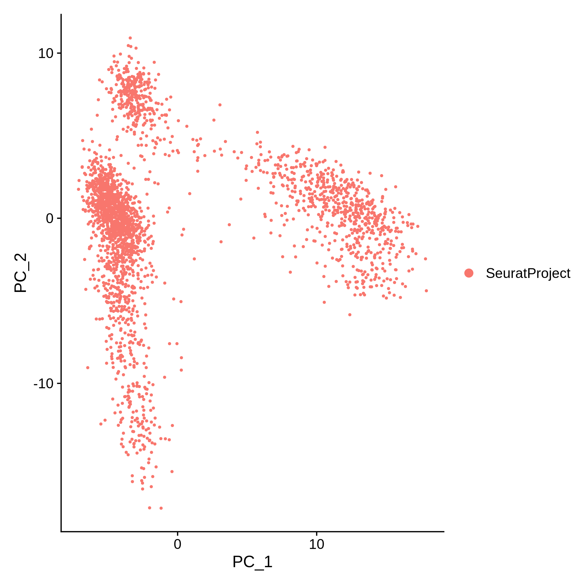
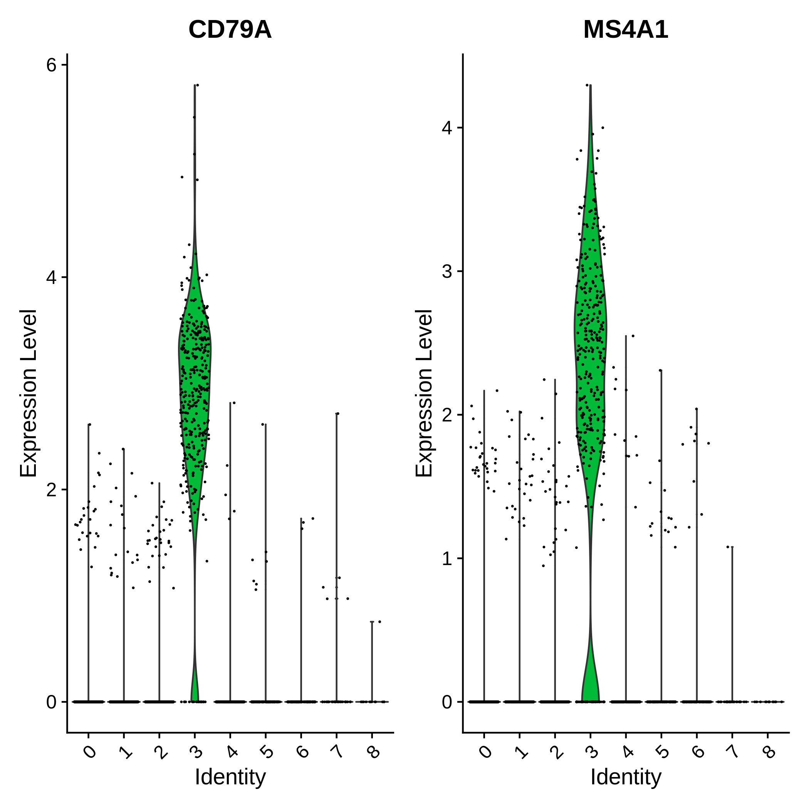

i---
layout: tutorial_hands_on

title: "Clustering 3K PBMCs with Seurat"
level: Introductory
subtopic: firstsc
priority: 3
zenodo_link: 'https://zenodo.org/record/3581213'
questions:
- How can we identify cell types in single cell RNA-Seq data? 
- What are the steps for clustering single cell data with Seurat?
objectives:
- Explain the steps involved in clustering single cell data
- Evaluate the quality of single cell data and filter out low quality cells
- Prepare single cell data for analysis with Seurat
- Perform clustering with Seurat
- Be ready to apply the Seurat pipeline to new datasets
time_estimation: 8H
key_points:
- Seurat is a commonly-used pipeline for single cell data analysis
- Clustering makes single cell datasets easier for us to understand
- Different tools and parameters should be considered when analysing different datasets
requirements:
-
    type: "internal"
    topic_name: single-cell
    tutorials:
        - scrna-preprocessing
        - scrna-preprocessing-tenx
tags:
- 10x
contributors:
- MarisaJL

---

Single cell RNA-seq analysis enables us to explore differences in gene expression between cells. It can reveal the heterogenity within cell populations and help us to identify cell types that could play roles in development, disease, or other processes. Single cell omics is a relatively young field, but there are a few commonly-used analysis pipelines that you will often see used in the literature. In this tutorial, we will use one of these pipelines, Seurat, to cluster single cell data from a 10X Genomics experiment (). You can follow the same analysis using the Scanpy pipeline in the [Clustering 3K PBMCs with Scanpy]() tutorial. 

Clustering is typically the first type of analysis we will perform on a single cell dataset. It groups together cells that are expressing similar genes, which makes the data easier to understand and often helps us to identify specific cell types.





> <comment-title></comment-title>
>
> This tutorial is based on the [Seurat - Guided Clustering Tutorial](https://satijalab.org/seurat/articles/pbmc3k_tutorial). The SCTransform sections also draw from the [Using sctransform in Seurat](https://satijalab.org/seurat/articles/sctransform_vignette.html) tutorial.
>
> {: .comment}

> <agenda-title></agenda-title>
>
> In this tutorial, we will cover:
>
> 1. TOC
> {:toc}
>
{: .agenda}

# Important tips for easier analysis





# Data

For this tutorial, we will analyze a dataset of Peripheral Blood Mononuclear Cells (PBMC) extracted from a healthy donor, which is freely available from 10X Genomics. The dataset contains 2700 single cells sequenced using Illumina NextSeq 500. The raw sequences have been processed by the [**cellranger**](https://support.10xgenomics.com/single-cell-gene-expression/software/pipelines/latest/what-is-cell-ranger) pipeline from 10X to extract a unique molecular identifier (UMI) count matrix, in a similar way to that explained in the [Pre-processing of 10X Single-Cell RNA Datasets]() tutorial.

In this matrix, the values represent the number of each feature (i.e. gene; row) detected in each cell (column). Single cell matrices can be quite large: here there are 2700 columns with 32,738 rows, so for each of our 2700 cells we know how many times we found RNAs matching each of the 32,738 genes. Since most of these genes weren't detected in most of the cells, the matrix is largely filled with zeros, i.e. it is an extremely sparse matrix. To optimize the storage of such a table and the information about the genes and cells, **cellranger** creates 3 files:

- `genes.tsv`: a tabular file with information about the 32,738 genes in 2 columns (Ensembl gene id and the gene symbol)
- `barcodes.tsv`: a tabular file with the barcode for each of the 2700 cells
- `matrix.mtx`: a condensed version of the count matrix (including the non-zero values only)

    The count matrix is represented by its non-zero values - we don't need to store all of those zeroes as long as we know where our non-zero values are in the matrix. Each non-zero value is represented by its line number (1st column), its column number (2nd column) and its value (3rd column). The first row gives the total number of rows (genes), columns (cells) and non-zero values. More information on the Matrix Market Exchange (mtx) format can be found [in this documentation](https://math.nist.gov/MatrixMarket/formats.html)

## Data upload

> <hands-on-title>Data upload</hands-on-title>
>
> 1. Create a new history for this tutorial
>
> 2. Import the `genes.tsv`, `barcodes.tsv` and `matrix.mtx` from [Zenodo]({{ page.zenodo_link }}) or from the shared data library
>
>    ```
>    {{ page.zenodo_link }}/files/genes.tsv
>    {{ page.zenodo_link }}/files/barcodes.tsv
>    {{ page.zenodo_link }}/files/matrix.mtx
>    ```
>
>    
>
>    
>
> 3. Rename the datasets as `genes`, `barcodes`, and `matrix` if necessary
>
> 4. Check the datatypes are correst - the `genes` and `barcodes` files should be tsv or tabular while the `matrix` should be an mtx or txt file
>
>    
>
> 5. Inspect the `matrix` file by clicking on the  icon
>
>    
>
{: .hands_on}

> <question-title></question-title>
>
> ```
> 32738	2700	2286884
> 32709	1	4
> 32707	1	1
> 32706	1	10
> 32704	1	1
> ```
>
> 1. How many non-zero values are in the matrix?
> 2. How many counts were found for the 32,706th gene in the 1st cell?
>
> > <solution-title></solution-title>
> >
> > 1. The first row tells us there are 2,286,884 non-zero values for the 32,738 genes (rows) and 2,700 cells (columns) - so only 2.6% of the 88,392,600 potential values we could have in this matrix are non-zero. Getting rid of all those zeros has made the matrix much more compact.
> > 2. 10 counts were found for the 32,706th row (gene) and 1st column (cell), so we collected 10 RNAs that the first cell had produced from this particular gene.
> >
> {: .solution}
>
{: .question}

Representing the matrix with these three files is convenient for sharing the data, but not for processing them. Different single cell analysis packages have attempted to solve the problem of storage and analysis by inventing their own formats, which has led to the proliferation of many different 'standards' in the scRNA-seq package ecosystem.

## Seurat Object

In order to analyse the data using Seurat, we will first need to create a Seurat Object. A Seurat Object can store all our data, including the gene names, cell barcodes and matrix in a single RDS file. Since Seurat was written in the R programming language, Seurat Objects are saved as RData or RDS files. An RDS file is simply a type of RData file that contains a single object.

Seurat Objects can also hold any metadata we might have about our cells or genes, as well as the information we will produce during our analysis, such as our dimensional reductions and cell clusters. A Seurat Object can hold data in multiple layers (also known as slots in earlier version of Seurat). We can have layers of raw counts, normalised data, and scaled data. We could also store multiple assays or types of data in a single object, although in this tutorial we will only be using one assay for RNA-seq data. The Seurat Object is designed to be self-contained so that we don't have to work with lots of different files, even if we have different versions or types of data. 

Creating a Seurat Object in R would require two steps - first, we would need to read in our data, in this case using the `Read10X` function, then secondly we would turn it into a Seurat Object using the `CreateSeuratObject` function. On Galaxy, we can perform both steps with a single tool. The `CreateSeuratObject` function also generates some QC metrics and performs basic filtering of the data.

><hands-on-title>Create a Seurat Object</hands-on-title>
> 1.  with the following parameters:
>    - *"Method used"*: `Create Seurat Object`
>        - *"Select format of input"*: `matrix market (for e.g. 10x data)`
>            -  *"Counts matrix with features as rows, cells as columns (.mtx)"*: `output` (Input dataset)
>        - *"Include features detected in at least this many cells"*: `3`
>        - *"Include cells where at least this many features are detected"*: `200`
>        - *"Calculate percentage of mito genes in each cell"*: `No`
>
> 3. Rename the generated file to `Input 3k PBMC`
> 4. Check that the format is `RDS`
{: .hands_on}

We can't look at the RDS file directly as it is designed for computers to read, rather than humans, but the Seurat tools will now be able to interact with the data. 

# Preprocessing

The standard Seurat pipeline begins with preprocessing, which includes identifying and filtering out low-quality cells, normalising and scaling the data, and selecting highly variable features.

## Quality Control

Quality control is an essential step in preparing single cell data for analysis. The results from a single cell experiment can vary in quality due to cell damage during dissociation, capturing more than one cell in a well or droplet, failures in library preparation such as inefficient reverse transcription (copying of captured RNAs to cDNA) or PCR amplification (making more copies of the cDNA so we have enough material for sequencing) or other technical problems. Low quality cells can cause issues for some analysis tools and may contribute to misleading results.

> <details-title>Impact of low-quality cells on the downstream analyses</details-title>
>
> #### Formation of their own distinct cluster(s)
>
> The most obvious cause of this problem is that damaged cells can appear more similar to each other because they have increased proportions of mitochondrial genes or are enriched for certain damage-induced genes. We could end up with a cluster made up of different cell types that share similar RNAs because they've been damaged. We might think these damaged cells represent an intermediate state between other cell types or end up misinterpreting our data in other ways.
>
> #### Distortion of population heterogeneity during variance estimation or principal components analysis
>
> When we cluster single cell data, we're looking for the biggest differences between groups of cells. If we have lots of low-quality cells, then the biggest differences we'll see might be these differences in quality, rather than something more biologically interesting. Differences in quality can have a big impact because low-quality cells often have low total RNA counts. When we perform scaling normalisation on these cells during preprocessing, this can make the variances for the genes they do express much bigger than for other cells. When we select the most variable genes in the dataset, we'll end up picking the ones expressed by low-quality cells. We'll use these in our PCA analysis, likely ending up with top principal components based on cell quality rather than biology, making it harder to detect the differences we're actually interested in.
>
> #### Misidentification of upregulated genes
>
> Another problem that arises when we apply our preprocessing steps to small, low quality cells is that the genes we detect in them can appear to be strongly upregulated. Since we didn't detect many other genes in these cells, even a small difference in the number of transcripts detected can end up becoming much larger after normalisation. For example, contaminating transcripts may be present in all cells at low but constant levels. With the increased scaling normalization in low-quality cells, the small counts for these transcripts may become large normalized expression values, so we might think we've found a population of cells where these genes are upregulated.
>
{: .details}

In order to mitigate these problems, we need to remove low-quality cells at the start of the analysis.

The `CreateSeuratObject` function we used in the  tool automatically calculates some QC metrics and allows us to filter out the lowest quality cells and features immediately. We removed any genes that were found in fewer than three cells. We assume that these genes are just technical noise (e.g. misreads, reads mapped to the wrong gene) rather than real biological features. We also removed cells where we detected fewer than 200 genes. We assume that these are low quality cells or cell fragments as we would usually expect to find more features in an undamaged cell that was captured and sequenced properly. We can always come back and create a new object with different values if we suspect they weren't right for our dataset once we make our QC plots or if we have problems later on in the analysis.

> <comment-title></comment-title>
> If you would like to see the impact of this initial filtering on the dataset, then you can rerun the previous step with these filters removed and then perform the following visualisation steps on the unfiltered dataset. The Seurat pipeline usually includes some filtering during object creation, which shouldn't cause any problems as long as we use reasonable thresholds that only filter out the lowest quality cells and genes.
{: .comment}

We will now check the data to see if it requires any further filtering.

### Computation of QC metrics

We already have two useful QC metrics that were calculated when we created our Seurat Object: 

- ** nCount_RNA** the total sum of RNAs that were found in each cell
    The total number of counts is related to cell size, but it can also be an indication of quality. If nCount_RNA is very high we might be looking at results from a doublet or multiplet - two or more cells that were isolated together during the experiment. If nCount_RNA is very low, then it is likely that we lost a lot of the RNA due to cell lysis (breakage) or inefficient cDNA capture and amplification - or perhaps we only captured a fragment of a cell. 
- ** nFeature_RNA** the number of unique genes that were detected in each cell
    We would expect to see some variation in the variety of genes expressed by cells of different sizes, types, and conditions, but if this number is unusually high or low then it could be a sign of poor quality. High nFeature_RNA could be another sign of a doublet or multiplet - we might have captured cells of different types and processed them together. Low nFeature_RNA could be due to loss of RNA if nCount_RNA is also low, or a sign that we have failed to capture the diversity of the transcript population, perhaps due to technical problems in our experiment. 

One other metric that is often used to assess cell quality is the proportion of reads that came from the mitochondrial genome. The proportion is often higher in low quality, damaged or dying cells. Mitochondrial RNAs, which are protected inside the mitochondrial membranes, can be the last RNAs to be degraded or lost from a damaged cell, so we can end up with higher proportions of them in a low quality cell. We could have calculated the proportion of mitochondrial genes while creating out Seurat Object, but we will calculate it separately here to see how it is done - and how we could do the same for other types of genes.

We can identify mitochondrial genes from their gene symbols. Genes that are encoded in the mitochondrial DNA (rather than in the cell nucleus) have names beginning with 'MT-'. The  can identify genes based on a specific naming pattern and then calculate the proportion of reads in each cell that came from these genes. We could use this tool to calculate the proportions of other genes with shared naming patterns too, such as ribosomal genes.

> <hands-on-title>Calculate the Proportion of Mitochondrial Reads</hands-on-title>
>
> 1.  with the following parameters:
>    - *"Method used"*: `Add QC Metrics`
>        -  *"Input file with the Seurat object"*: `Input 3k PBMC` (output of **Seurat Create** )
>        - *"Calculate percentage of reads based on"*: `Pattern in gene names`
>
> 2. Rename the output as `Mitochondrial Annotations`
{: .hands_on}

When we use these QC metrics to remove low quality cells, we are assuming they are independent of the biological state of each cell, which isn't always the case in reality. For example, some cell types with higher energy demands may have higher proportions of mitochondrial reads because they have more mitochondria. We need to think carefully when deciding which metrics to use for filtering, but for now we will assume that these differences in our dataset are being driven by technical factors (e.g. cell damage, loss of RNAs, problems with capture and sequencing) rather than biological processes (e.g. cell types or conditions). We can therefore remove cells with poor values without misrepresenting the biology in downstream analyses.

### Filtering of low-quality cells

The simplest approch for identifing low-quality cells is to apply thresholds on the QC metrics. We assume that any cells beyond these thresholds are low quality cells and that this is due to those technical factors. Although this is a simple strategy, we will need to decide where to set our thresholds, and this will depend on the experimental protocol and biological system - there are no standard thresholds that we can use for every dataset. 

We can visualise the QC metrics to help us decide where to set our thresholds for filtering out low quality cells. We want to get rid of cells that have unusually high or low numbers of genes or unique features, as well as cells that have higher proportions of mitochondrial genes. 

> <hands-on-title>Visualise QC Metrics</hands-on-title>
>
> 1.  with the following parameters:
>    -  *"Input file with the Seurat object"*: `Mitochondrial Annotations` (output of **Seurat Create** )
>    - *"Method used"*: `Violin Plot with 'VlnPlot'`
>        - *"Features to plot"*: `nFeature_RNA,nCount_RNA,percent.mt`
>        - In *"Plot Formatting Options"*:
>            - *"Number of columns to display"*: `3`
>
> 2.  with the following parameters:
>    -  *"Input file with the Seurat object"*: `Mitochondrial Annotations` (output of **Seurat Create** )
>    - *"Method used"*: `Scatter Plot with 'FeatureScatter'`
>        - *"First feature to plot"*: `nCount_RNA`
>        - *"Second feature to plot"*: `percent.mt`
>
> 3.  with the following parameters:
>    -  *"Input file with the Seurat object"*: `Mitochondrial Annotations` (output of **Seurat Create** )
>    - *"Method used"*: `Scatter Plot with 'FeatureScatter'`
>        - *"First feature to plot"*: `nCount_RNA`
>        - *"Second feature to plot"*: `nFeature_RNA`
>
{: .hands_on}

> <tip-title></tip-title>
> If you are re-running the same step again or just want to change a couple of parameters for the same tool, then you can click on a previous dataset to expand it in the history and then click the . The tool you used to create that dataset will open in the main panel, with the settings and inputs you used before. Make any changes and run it again.
{: .tip}

, total counts (nCount_RNA) and the proportion of reads coming from mitochondial genes (percent.mt) for all cells")

 and A. the number of unique features (nFeature_RNA) and B. the proportion of mitochondrial reads (percent.mt)")

> <question-title></question-title>
>
> 1. What do the violin plots in [Figure 1](#figure-1) tell us about the cell sizes and quality in our dataset? 
> 2. What do the scatter plots in [Figure 2](#figure-2) tell us about the relationship between cell size and the other QC metrics?
>
> > <solution-title></solution-title>
> > 1. The violin plots give us an overview of the cell sizes (nCount_RNA), number of unique genes (nFeature_RNA), and proportion of mitochondrial reads for our cells. We can see that most of the cells are grouped together near the bottom of each plot, but there are some outliers that have unusually high or low values of each metric. Cells with higher values of nCount_RNA are likely to be larger as they contained more RNA. Cells with higher values of nFeature_RNA had RNAs produced from lots of different genes, while those with low nFeature_RNA had RNAs produced from a smaller range of genes. Cells with high percent.mt had lots of reads from mitochondrial genes. Although there will be some natural variation in cell size, the range of genes being expressed, and mitochondrial content, we suspect that extreme values of these three metrics reflect low quality cells.
> > 2. The scatter plots show us how these QC metrics relate to each other. As expected, the cells with higher total RNA counts also tend to have higher numbers of unique features, but some cells have particularly high values of both - these could be doublets. The proportion of mitochondrial genes doesn't increase with cell size (total counts) in the same way. We can see a small number of cells that have very high proportions of mitochondrial reads despite having low total reads - these are likely to be damaged cells that have lost a lot of their non-mitochondrial RNAs. 
> >
> {: .solution}
{: .question}

We can now set our QC thresholds based on these plots. Unfortunately, there are no standard thresholds that can be applied to every dataset, so we need to look at our data and make this decision for ourselves. 

We've already filtered out the cells with the lowest total counts when we created the Seurat Object, so we'll focus on filtering the number of unique features and the proportion of mitochondrial reads. We saw on the scatter plots that the cells with high values for these two metrics also had the highest nCount_RNA values, so we'll actually be getting rid of the cells with the highest total counts too.

> <comment-title></comment-title>
> If you've used Scanpy or followed the [Clustering 3K PBMCs with Scanpy]() tutorial then you might be wondering why we aren't visualising and filtering our genes as well as our cells. Seurat enables us to set the minimum number of cells that genes must be present in when we create the Seurat Object, but the pipeline doesn't usually include any further quality checks for genes. If we did need to do further filtering, we could do this in R by calculating an appropriate QC metric and subsetting the data.
{: .comment}

> <question-title></question-title>
>
> 1. What threshold would you set for nFeature_RNA?
> 2. What threshold would you set for percent.mt?
>
> > <solution-title></solution-title>
> > 1. A threshold of 2500 seems sensible for this dataset. The violin plot for nFeature_RNA shows that most of our cells should be under this threshold, so we won't lose too much of our data. The scatter plot shows that the cells above this threshold also had unusually high values of nCount_RNA, which suggest they could include some doublets.
> > 2. A threshold of 5% should work for this dataset. As before, the violin plot shows that the majority of our cells are below this threshold, but in this case the cells above it had low total RNA counts, which suggests these could be damaged cells that had lost a lot of their other RNAs.
> > Although there are few standards to guide us in single cell analysis, you will see the same 5% threshold for mitochondrial content used in many studies. It often works well, but it can filter out energetic cell types such as muscle cells, so we shouldn't apply this threshold without considering whether it works for our dataset. Some studies don't filter on mitochondrial reads at all! 
> >
> {: .solution}
{: .question}

We're setting QC thresholds based on our visual inspections of the data, but we could take different approaches too. We could calculate the interquartile range for our QC metrics and use this to set a threshold (e.g. maximum of 1.5 times the IQ range above the median). We could also try running the analysis with different thresholds to see how it affects the results - this could help us to see if we're excluding any biological variation, for example if we're filtering out a specific high-energy cell type with our mitochondrial threshold.

> <hands-on-title>Filter Out Low Quality Cells</hands-on-title>
>
> 1.  with the following parameters:
>    - *"Method used"*: `Filter cells by QC metrics`
>        -  *"Input file with the Seurat object"*: `Mitochondrial Annotations` (output of **Seurat Create** )
>        - *"Minimum nFeature_RNA"*: `200`
>        - *"Maximum nFeature_RNA"*: `2500`
>        - *"Maximum percent.mt"*: `5.0`
>        - *"Filter by a different metric"*: `No`
>
> 2. Rename the output as `Filtered Dataset`
>
{: .hands_on}

If we produce the same plots again, we can see what has changed in our data.

> <hands-on-title>Re-Visualise QC Metrics</hands-on-title>
>
> 1.  with the following parameters:
>    -  *"Input file with the Seurat object"*: `Mitochondrial Annotations` (output of **Seurat Create** )
>    - *"Method used"*: `Violin Plot with 'VlnPlot'`
>        - *"Features to plot"*: `nFeature_RNA,nCount_RNA,percent.mt`
>        - In *"Plot Formatting Options"*:
>            - *"Number of columns to display"*: `3`
>
> 2.  with the following parameters:
>    -  *"Input file with the Seurat object"*: `Mitochondrial Annotations` (output of **Seurat Create** )
>    - *"Method used"*: `Scatter Plot with 'FeatureScatter'`
>        - *"First feature to plot"*: `nCount_RNA`
>        - *"Second feature to plot"*: `percent.mt`
>
> 3.  with the following parameters:
>    -  *"Input file with the Seurat object"*: `Mitochondrial Annotations` (output of **Seurat Create** )
>    - *"Method used"*: `Scatter Plot with 'FeatureScatter'`
>        - *"First feature to plot"*: `nCount_RNA`
>        - *"Second feature to plot"*: `nFeature_RNA`
>
{: .hands_on}

, total counts (nCount_RNA) and the proportion of reads coming from mitochondial genes for all cells after filtering")

 and A. the number of unique features (nFeature_RNA) and B. the proportion of mitochondrial reads (percent.mt) after filtering")

> <question-title></question-title>
>
> 1. Have we eliminated the low-quality cells from our data?
> > <solution-title></solution-title>
> > 1. We can see in both Figures [3](#figure-3) and [4](#figure-4) that the outliers have been eliminated from our dataset - we've removed the cells with high mitochondrial counts and/or unusually high numbers of detected genes. We hope that this means we've got rid of the poor quality cells without losing any real biological variation, but we can't really be sure. Sometimes it is necessary to come back and re-think our filters - for example if you get to the end of the analysis and realise that you're missing a cell type that should be present in your data!
> >
> {: .solution}
{: .question}

## Further Preprocessing 

Now that we're happy with the cells left in our Seurat Object, we can begin preparing the data for analysis. Seurat provides two routes for preprocessing, one with separate tools for each step and another that combines all these preprocessing steps into a single tool, `SCTransform`.

> <comment-title></comment-title>
>
> `SCTransform` makes preprocessing quicker and easier because it combines several steps from the standard Seurat pipeline into one. `SCTransform` normalises and scales the data while also selecting highly variable features. It also takes a different approach to preprocessing that can be more effective at removing technical effects from the data.
>
> Once you are familiar with the separate steps, you might find it more effective and convenient to use `SCTransform`. The main difference to be aware of when using `SCTransform` is that the results will be stored as a new assay called `SCT` in the Seurat Object. You will need to use this assay in the following analysis steps, instead of the original `RNA` assay. After running `SCTransform`, `SCT` will be set as the default assay for the Seurat Object so the tools should automatically use the correct one. The methods and default settings used in `SCTransform` also differ from the standard pipeline, so you should expect to see some differences in your results compared to the other route.
>
> {: .comment}

The usual preprocessing steps for single cell data are normalisation, selection of the most variable features, and scaling the data. The same steps are performed in slightly different ways by the separate preprocessing functions and SCTransform.

- **Normalisation**
    Normalisation deals with variations in the number of reads we counted for each cell that were caused by systemic technical differences. We might have captured more RNAs or produced more copies of them during the PCR amplification step in some cells. If we don't remove these differences then they could obscure the biological differences we're trying to explore. We could end up with clusters of cells based on how many RNAs we captured or copied rather than on their cell type.
    The default normalisation method for the separate `NormalizeData` tool in Seurat is `LogNormalize`, which simply divides the number of counts for each gene by the total counts for the cell, multiplies this by a scale factor (10,000 is the default), and then log-transforms the results. Essentially, we're working out how many counts we would have for each gene if we had produced 10,000 reads from each cell, instead of getting different numbers of reads from different cells. The log-transformation then increases the impact that genes that showed stronger relative differences in expression between cells will have on our analysis (e.g. a gene that is expressed at an average count of 50 in cell type A and 10 in cell type B should have a bigger impact than a gene that is expressed at an average count of 1100 in A and 1000 in B). The normalised data will be stored in the `data` layer of the Seurat Object. The unnormalised data will still be available in the `counts` layer.
    Although this form of normalisation is widely-used, it does assume that each cell originally had the same number of RNA molecules, which isn't the case when our samples contain cells of different types and sizes. SCTransform takes a different approach to normalisation that doesn't make the same assumption about the cells . Instead, it creates a model of the UMI counts that enables it to regress out variation in sequencing depth (nFeature_RNA) and pools information from genes with similar abundances to adjust the variances. The corrected counts will be stored in the `counts` layer of the new SCT assay. The log1p(counts) will be stored in the `data` layer and the pearson residuals will be stored in the `scale.data` layer.
- **Selection of highly variable features**
    Rather than use the entire dataset in every stage of the analysis, we can focus on the genes that provide the most information - the highly variable genes that showed the biggest differences in expression between cells. We assume that these bigger differences reflect genuine biological differences, while the smaller differences in expression seen in other genes is down to chance or technical noise. Focusing on the most variable genes can make biological differences clearer in single cell analysis.
    Feature selection can have a big impact on our analysis as we will run downstream analyses (e.g. PCA) on these genes. We will be comparing cells based on the expression of these variable genes. 
    Seurat's separate `FindVariableFeatures` tool selects the 2000 most variable genes by default, while `SCTransform` selects the top 3000 genes. We can select more variable genes when we use SCTransform because this method is better at removing technical effects from the data, so the additional variable features are more likely to represent biological variation.
  We may need to change this setting for some datasets to ensure we're selecting the most useful genes without including too many others.
- **Scaling**
    Scaling is a linear transformation that we apply to prepare our data for dimensional reduction. 
    The default scaling method for the separate `ScaleData` tool in Seurat shifts the expression of each gene so that the mean expression across all the cells is 0. It also scales the expression of each gene so that the variance across all cells is 1. Scaling ensures that highly expressed genes don't dominate the analysis too much - we're interested in differences in expression between cells, not in genes that are always highly expressed in all the cells. The results will be stored in the `scale.data` layer.
    SCTransform doesn't scale data in the same way - although it centers the data by default, it won't scale the data unless you select this option. Instead, SCTransform usually stores the pearson residuals in the `scale.data` layer, which don't need to be scaled to the same variance.
    By default, both approaches only center/scale the highly variable genes that we'll use for dimensional reduction, but it is possible to scale more genes if required.

The Seurat pipeline can include another step during preprocessing of our single cell data. We can regress out (or remove) the impact of unwanted sources of variation. We could use this to remove the effects of the cell cycle or the differences associated with the proportion of mitochondrial genes. The goal is to reduce differences that are related to factors we are not interested in as this can help the differences we are interested in (like those between cell types or experimental groups) stand out more.
It is possible to use the `ScaleData` function to regress out unwanted variation, but the creators of Seurat recommend using `SCTransform` for preprocessing if you want to do any regression. `SCTransform` automatically regresses out variation associated with sequencing depth (unique counts or nFeature_RNA) and can also regress out other variables - here we will also regress out the variation associated with the proportion of mitochondrial content.



<div class='Separate-Preprocessing-Steps' markdown='1'>
><hands-on-title>Separate Preprocessing Steps</hands-on-title>
>
> 1.  with the following parameters:
>    -  *"Input file with the Seurat object"*: `Filtered Dataset` (output of **Seurat Create** )
>    - *"Method used"*: `Normalize with 'NormalizeData'`
>        - *"Method for normalization"*: `LogNormalize`
>
> 2.  with the following parameters:
>    -  *"Input file with the Seurat object"*: `rds_out` (output of **Seurat Preprocessing** )
>    - *"Method used"*: `Identify highly variable genes with 'FindVariableFeatures'`
>        - *"Method to select variable features"*: `vst`
>        - *"Output list of most variable features"*: `Yes`
>
> 3.  with the following parameters:
>    -  *"Input file with the Seurat object"*: `rds_out` (output of **Seurat Preprocessing** )
>    - *"Method used"*: `Scale and regress with 'ScaleData'`
>        - *"Regress out a variable"*: `No`
>        - *"Features to scale"*: `All Features`
>
> 4. Rename the output as `Preprocessed Data`
>
{: .hands_on}
</div>

<div class='SCTransform' markdown='1'>
><hands-on-title>SCTransform</hands-on-title>
>
> 1.  with the following parameters:
>    -  *"Input file with the Seurat object"*: `Filtered Dataset` (output of **Seurat Create** )
>    - *"Method used"*: `Complete all preprocessing with 'SCTransform'`
>        - *"Genes to calculate residual features for"*: `all genes`
>            - *"How to set variable features"*: `set number of variable features`
>        - *"Output list of most variable features"*: `Yes`
>        - *"Variable(s) to regress out"*: `percent.mt`
>
> 2. Rename the output as `Preprocessed Data`
>
> If we inspect this dataset, we can see that a new assay called `SCT` has been created and is set as the default assay. Click on the - of the following output to check this.
>
> 3.  with the following parameters:
>    -  *"Input file with the Seurat object"*: `Preprocessed Data` (output of **Seurat Preprocessing** )
>    - *"Method used"*: `Inspect Seurat Object`
>        - *"Display information about"*: `General`
>
{: .hands_on}
</div>

<div class='Separate-Preprocessing-Steps SCTransform' markdown='1'>

### Visualise Highly Variable Genes

><hands-on-title>Visualise Results</hands-on-title>
>
> 1.  with the following parameters:
>    -  *"Input file with the Seurat object"*: `Preprocessed Data` (output of **Seurat Preprocessing** )
>    - *"Method used"*: `Plot Variable Genes with 'VariableFeaturePlot'`
>        - *"Label the top most variable features"*: `Yes`
>
{: .hands_on}

![Both plots show most genes grouped at the bottom of the plot with low standardized variance, but they are more compressed and lower down in the SC Transform plot. The selected variable genes are highlighted in red and have higher standardized variances although most are still quite close to the non variable genes. The top 10 most variable genes are labelled by name at the top of the plot with much higher values. For plot A these are PPBP, S100A9, LYZ, IGLL5, GNLY, FTL, PF4, FTH1, GNG11, and FCER1A. For plot B, they are S100A9, GNLY, LYZ, S100A8, NKG7, FTL, GZMB, IGLL5, FTH1, and CCL5.](../../images/scrna-seurat-pbmc3k/seurat_variable_genes.png "Plot showing the standardized variances of variable and non-variable genes for A. Separate Preprocessing Steps and B. SCTransform. The top 10 most variable genes are labelled.")

> <question-title></question-title>
> 1. What are the top 10 most variable genes in this dataset?
> 2. Why are we interested in these genes?
> > <solution-title></solution-title>
> > 1. We can check the list of the top variable genes in our history by clicking on the  or see them on our variable features plot. The ten most variable genes will depend on whether you used the separate preprocessing steps or SCTransform.
> > 
> > |    | Separate Preprocessing Steps  | SCTransform |
> > |----|-------------------------------|-------------|
> > | 1  | PPBP                          | S100A9      |
> > | 2  | S100A9                        | GNLY        |
> > | 3  | LYZ                           | LYZ         |
> > | 4  | IGLL5                         | S100A8      |
> > | 5  | GNLY                          | NKG7        |
> > | 6  | FTL                           | FTL         |
> > | 7  | PF4                           | GZMB        |
> > | 8  | FTH1                          | IGLL5       |
> > | 9  | GNG11                         | FTH1        |
> > | 10 | FCER1A                        | CCL5        |
> >
> > > <comment-title></comment-title>
> > > If you used `SCTransform` for preprocessing, then you'll end up with a slightly sifferent list of highly variable genes. The two preprocessing routes use different methods to select features, so they won't always end up with the same genes, although there are likely to be some similarities. `SCTransform` returns 3000 variable genes by default, rather than the 2000 selected by `FindVariableFeatures`. We can select more features with `SCTransform` because its normalisation method is better at removing technical effects from the data, so we believe that these additional genes reflect subtler biological variations rather than technical differences.
> > {: .comment}
> >
> > 2. Single cell datasets contain a lot of information, including expression data for thousands of different genes. Some of these genes don't tell us much about the data, for example they might be housekeeping genes that are expressed at similar levels in most of our cells. We want to find the genes that can tell us most about the differences between our cells, so we want to identify the genes whose expression varies most across the dataset - focusing on these highly variable features should help us to uncover the biological differences we're looking for.
> >
> {: .solution}
{: .question}

# Dimensionality Reduction

Dimensional reduction is a key step in single cell analysis that simplifies our big, complex datasets enough to enable us to perform and understand further analyses. 

In single cell analysis, we're comparing cells based on their patterns of gene expression - we're looking for cells with similar transcriptomic profiles. Each gene represents a dimension of the data. If we only found two genes being expressed in our cells, we could represent them on a 2-dimensional plot. The two axes of the plot would represent the expression levels of the two genes. Each cell would become a point on the plot, positioned according to its expression of these genes. We might spot one group of cells with high levels of both genes and another group that expresses large amounts of one gene and not much of the other.

For datasets with thousands of genes, the concept is essentially the same: each cell's expression profile defines its location in the high-dimensional expression space. Each gene is still a dimension or axis on the plot and each cell can be positioned along these axes based on their expression. It's just much harder to imagine a plot with thousands of different axes - that's why we need dimensional reduction!

We don't have to think of the expression of each of our thousands of genes individually. The expression of some genes can be correlated if they are affected by the same biological process - cells that express a lot of one gene might also express higher levels of other genes that have similar functions. Instead of keeping the information from each of these genes as separate axes or dimensions, we can compress them into a single dimension (e.g. an 'eigengene'). We can do the same for all of the correlated groups of genes in our data, going from thousands of individual genes to perhaps 10, 20, or 50 grouped dimensions.

 Dimensionality reduction aims to reduce the number of separate dimensions in the data, which:

- reduces the computational work in downstream analyses to only a few dimensions
- reduces noise by averaging across multiple genes to obtain a more precise representation of the patterns in the data
- enables effective plotting of the data.

## Principal Component Analysis

Principal Component Analysis (PCA) is a dimensionality reduction technique that identifies the axes in high-dimensional space that capture the largest amount of variation. It is a simple, highly effective strategy that is widely used in data science, including for single cell omics.

The axes or dimensions identified by PCA will be ordered based on how much of the variation they explain. The first axis (or Principal Component, PC) is chosen so that it captures the greatest variance across cells. The next PC is the axis orthogonal to (uncorrelated with) the first that captures the greatest amount of the remaining variation across the cells. The third PC will be orthoganol to the first two and capture the greatest amount of the remaining variation, and so on. You can decide how many PCs you want to produce and then how many of these PCs you want to use in downstream analyses.

We assume that the top PCs are more likely to represent real biological variation in the data because this should affect multiple genes in coordinated ways, having a bigger impact on variation. Random technical or biological noise should affect each gene independently, without creating patterns of correlation or explaining much variation, so these effects should be represented in the later PCs. By using just the top PCs in our downstream analysis, we can therefore focus on the biological variation and eliminate some of the unwanted noise while also making our data easier to analyse. 

### Perform the PCA

We will start by calculating the top 50 PCs and then decide how many of these we want to use.

The standard Seurat pipeline performs the PCA on the Variable Features only, rather than the complete dataset. You can change this using the `features` parameter, but you will need to scale the chosen features using `ScaleData` before running the PCA, if you didn't already choose this option during the preprocessing stage.

><hands-on-title>Perform the PCA</hands-on-title>
>
> 1.  with the following parameters:
>    -  *"Input file with the Seurat object"*: `Preprocessed Data` (output of **Seurat Preprocessing** )
>    - *"Method used"*: `Run a PCA dimensionality reduction using 'RunPCA'`
>        - *"Output list of top genes"*: `Yes`
>
{: .hands_on}

### Visualise the PCA Results

We've now reduced our dataset to 50 dimensions or PCs that represent the expression of sets of correlated genes. Since we selected the option to output a list of the top genes, we can use the  icon on this output in our history to see which genes were most strongly associated with the top five PCs. We can see lists of the genes that had the strongest positive and negative scores for each PC - these are the correlated sets of genes that defined the PCs.



Rather than just looking at a list of genes, we can also produce plots to help us better understand how our cells and genes relate to the PCs we have just computed. Let's start by finding out more about the genes that were most strongly associated with our top three PCs. We can do this with the `VizDimLoadings` plot, which shows the genes associated with each PC, how strongly each gene affected the PC, and whether it was positively or negatively correlated with the PC. The plots will look a bit different depending on which preprocessing approach you followed.

><hands-on-title>Visualise the PCA Results</hands-on-title>
>
> 1.  with the following parameters:
>    -  *"Input file with the Seurat object"*: `rds_out` (output of **Seurat Run Dimensional Reduction** )
>    - *"Method used"*: `Visualize Reduction Results with 'VizDimLoadings'`
>        - *"Number of dimensions to display"*: `3`
>        - In *"Plot Formatting Options"*:
>            - *"Number of columns to display"*: `3`
>    - *"Change size of plot"*: `Yes`
>        - *"Width of plot in pixels"*: `3000`
>
{: .hands_on}

")

")

> <question-title></question-title>
> 1. What are the top positive and negative genes for the first three PCs?
> 2. Are any of our top 10 highly variable genes associated with the top PCS? Does this surprise you?
> 3. When we plot the cells along the PC axes (in the next step) do you expect to see differences in the expression of these genes along the associated axis?
> > <solution-title></solution-title>
> > 1. The list produced by the `RunPCA` function shows the genes that were most strongly positively and negatively assocated with each PC. When preprocessing was done using the separate tools, the top positively associated genes were CST3 for PC1, CD79A for PC2, and HLA-DQA1 for PC3. The top negatively associated genes were MALAT1 for PC1, NKG7 for PC2, and PPBP for PC3. Similarly, if preprocessing was performed with SCTransform, the top positively associated genes were MALAT1, NKG7, and S100AB, while the top negatively associated genes were FTL, HLA-DRA, and CD74. However, these top genes don't define the PCs by themselves - they are part of groups of genes that showed correlated patterns of expression.
 > > The [VizDimLoadings plot](#figure-6) shows us more information about the top genes. We can see the top 30 genes in each of these groups on the plots. We can also see how strongly each of these genes was associated with the PC.
> > 2. We can see that some of our highly variable genes are associated with the top PCs. For example, FTL is one of the top genes associated with PC1. We should expect to see some of our highly variable genes here as we used the features we selected to perform the PCA. It also makes sense that our top 10 variable genes are strongly associated with PCs, because we know these are the genes that varied most across the dataset and the PCA was looking for these strong differences in expression. However, a gene that varied a lot won't necessarily be associated with a top PC unless its expression correlates with other variable genes - a group of correlated genes is likely to have a stronger impact than a single gene, even if that one gene varies a lot.
> > 3. Since these are the genes that most are strongly associated with each PC, we should expect to see strong differences in their expression from one end of the associated axis to the other. The genes positively associated with PC 1 should mainly be expressed near the positive end of the PC1 axis while the negatively associated genes should mainly be expressed at the negative end. We would expect to see similar patterns for the other PCs.
> {: .solution}
{: .question}

Next, let's see how our cells are distributed along the top PCs. We can use `DimPlot` to create a 2-dimensional plot where each axis represents one of the PCs - being able to produce these plots is one of the benefits of dimensional reduction as it makes our data easier to interpret when we can see it on two axes rather than thousands. If we're plotting the top PCs then we should see cells or clumps of cells spread along these axes. If PC1 is really explaining a lot of the variation in the data then we should see that there are cells with both high and low values along this axis - if they're all grouped together at one end of the axis then the PC wouldn't be telling us much about the differences between cells. We'd hope to see a similar effect along the next PCs, although it won't be as strong as for the top PC because that's the one that explained the most variation in the dataset. We should see similar relationships no matter which preprocessing approach we used, although of course the plots will look a bit different.

><hands-on-title>Visualise the PCA Results</hands-on-title>
>
> 1.  with the following parameters:
>    -  *"Input file with the Seurat object"*: `rds_out` (output of **Seurat Run Dimensional Reduction** )
>    - *"Method used"*: `Visualize Dimensional Reduction with 'DimPlot'`
>        - *"Name of reduction to use"*: `pca`
>
{: .hands_on}




> <question-title></question-title>
> 1. Can you see any groups or clusters of cells in the the [PCA Plot](#figure-7)?
> > <solution-title></solution-title>
> > 1. The cells seem to form three main clusters, although there are also cells spread outside and in between these groups. The cells are distributed along the full length of both axes, which makes sense as these are the PCs that explain the greatest amounts of variation in the data.
> {: .solution}
{: .question}

We don't have to use PCs 1 and 2 as the axes. We can decide which PCs we want to plot our data along. We can also use the `FeaturePlot` function to colour the plots by the expression levels of specific genes to see how this relates to the PCs, so let's see how the top genes relate to the top three PCs.

><hands-on-title>Visualise the PCA Results</hands-on-title>
>
> 1.  with the following parameters:
>    -  *"Input file with the Seurat object"*: `rds_out` (output of **Seurat Run Dimensional Reduction** )
>    - *"Method used"*: `Visualize expression with 'FeaturePlot'`
>        - *"Features to plot"*: Use the top positive and negative genes for PCs 1-3. If you did the separate preprocessing steps these will be `CST3,CD79A,HLA-DQA1, MALAT1,NKG7,PPBP` but if you used SCTransform they will be `MALAT1,NKG7,S100A8,FTL,HLA-DRA,CD74`
>        - *"Dimension to plot on x axis"*: `1`
>        - *"Dimension to plot on y axis"*: `2`
>        - *"Name of reduction to use"*: `pca`
>        - In *"Plot Formatting Options"*:
>            - *"Number of columns to display"*: `3`
>    - *"Change size of plot"*: `Yes`
>        - *"Width of plot in pixels"*: `3100`
>
> 1.  with the following parameters:
>    -  *"Input file with the Seurat object"*: `rds_out` (output of **Seurat Run Dimensional Reduction** )
>    - *"Method used"*: `Visualize expression with 'FeaturePlot'`
>        - *"Features to plot"*:  Use the top positive and negative genes for PCs 1-3. If you did the separate preprocessing steps these will be `CST3,CD79A,HLA-DQA1, MALAT1,NKG7,PPBP` but if you used SCTransform they will be `MALAT1,NKG7,S100A8,FTL,HLA-DRA,CD74`
>        - *"Dimension to plot on x axis"*: `2`
>        - *"Dimension to plot on y axis"*: `3`
>        - *"Name of reduction to use"*: `pca`
>        - In *"Plot Formatting Options"*:
>            - *"Number of columns to display"*: `3`
>    - *"Change size of plot"*: `Yes`
>        - *"Width of plot in pixels"*: `3100`
>
{: .hands_on}

> <comment-title></comment-title>
> If you've tried the [Clustering 3K PBMCs with Scanpy]() tutorial then you might notice that there are some differences in the relationships between the genes and PCs. Our top negative genes for PCs 2 and 3 (NKG7 and PPBP) are among the top positively associated genes there. This is simply a mathematical quirk - in both cases, these genes are strongly associated with the top PCs, but we're just calculating or drawing our axes in the opposite direction. You should be able to spot some similarities in the plots between these two tutorials, especially in the PC2/PC3 plot, which looks like it has been flipped upside down!
{: .comment}

If you used the separate preprocessing tools, then your plots will look like this: 

")

")

> <question-title></question-title>
> 1. How does the expression of the top positive and negative genes relate to PCs 1 and 2?
> 2. How does the expression of the top positive and negative genes relate to PCs 2 and 3?
> > <solution-title></solution-title>
> > 1. When we look at the expression of our top genes along PCs 1 and 2 we see that, as expected, the top positively associated gene for PC1, CST3, is almost exclusively expressed in cells at the positive end of the PC1 (horizontal) axis. The pattern is less clear for the negatively associated MALAT1 as most cells are expressing it, but if we look closely we can see that the expression is higher in cells at the negative end of the PC1 axis. We can see similar patterns for the top genes associated with PC2. The top positively associated gene, CD79A is mainly expressed by the cells closest to the top of the PC2 (vertical) axis. The top negative gene NKG7 is mainly expressed by cells along the lower half of the PC2 axis.
> > We don't see similar patterns for the genes associated with PC3 in this figure - although these genes are only expressed in parts of the plot, there is no clear relationship with either the PC1 or PC2 axes. This is exactly what we would expect to see - these genes are associated with PC3 so they shouldn't show any relationship with the axes in Figure 8[#figure-8].
> > 2. The picture looks very different when we plot our cells along PC2 and PC3. We can see two clumps of cells close together at the top of the plot and another small group of cells spread down the middle of the plot. This is why we have to be careful when interpreting dimensional reduction plots - the data can look very different depending on which of the many axes we choose to visualise.
> > Now it is the top genes for PC1 that don't show any relationship with the axes. The top genes for PC2 still show differences in expression along the PC2 axis (now the horizontal axis) - and these actually look a bit clearer than in the previous plot. We can also see how the top genes for PC3 relate to the PC3 (vertical) axis. The positively associated HLA-DQA1 is mostly expressed by cells at the top of the axis while the negatively associated PPBP is mostly expressed along the negative part of that axis.
> {: .solution}
{: .question}

If you used SCTransform, then you should see plots that look like this:

")

")

> <question-title></question-title>
> 1. How does the expression of the top positive and negative genes relate to PCs 1 and 2 in the plot?
> 2. How does the expression of the top positive and negative genes relate to PCs 2 and 3 in the plot?
> > <solution-title></solution-title>
> > 1. When we look at the expression of our top genes along PCs 1 and 2 we see that, as expected, the top positively associated gene for PC1, MALAT1, is expressed at higher levels in cells at the positive end of the PC1 (horizontal) axis while the top negatively associated gene, FTL, is expressed mainly at the negative end. The pattern isn't as clear for these genes as it is for the other PCs we plotted, because both MALAT1 and FTL are expressed to some extent by most of the cells in our plots. We can see more obvious patterns for the top genes associated with PC2. The top positively associated gene, NKG7 is mainly expressed by the cells at the positive end of the PC2 (vertical) axis. The top negative gene HLA-DRA is mainly expressed by cells along the lower half of the PC2 axis.
> > We don't see similar patterns for the genes associated with PC3 in this figure - although these genes are only expressed in parts of the plot, there is no clear relationship with either the PC1 or PC2 axes. This is exactly what we would expect to see - these genes are associated with PC3 so they shouldn't show any relationship with the axes.
> > 2. The picture looks very different when we plot our cells along PC2 and PC3. We can see two long lines of cells forming an upside-down 'V'. This is why we have to be careful when interpreting dimensional reduction plots - the data can look very different depending on which of the many axes we choose to visualise.
> > Now it is the top genes for PC1 that don't show any relationship with the axes. The top genes for PC2 still show differences in expression along the PC2 axis (now the horizontal axis). We can also see how the top genes for PC3 relate to the PC3 (vertical) axis. The positively associated S100A8 is mostly expressed by cells at the top of the axis while the negatively associated CD74 is mostly expressed along the negative part of that axis.
> {: .solution}
{: .question}

Another option for visualising our PCA results is to use `DimHeatmap` to produce a heatmap of the PCA scores for the top genes in each cell. We can see which genes scored highly in the same cells and get an idea of how the scores varied across the dataset. We can also look for groups of cells that had similar scores for a particular PC, suggesting that they share similar expression profiles - these groups of cells might become our clusters. We can also compare the patterns for different PCs. We would expect to see more similarities (genes with similar scores across cells and more cells grouping together) for the top PCs since these explain more of the variation in the data.

> <hands-on-title>Visualise the PCA Results</hands-on-title>
>
> 1.  with the following parameters:
>    -  *"Input file with the Seurat object"*: `rds_out` (output of **Seurat Run Dimensional Reduction** )
>    - *"Method used"*: `Visualize Reduction Results with 'DimHeatmap'`
>        - *"Dimensions from reduction to plot"*: `1`
>        - In *"Advanced Options"*:
>            - *"Number of top cells to plot"*: `500`
>            - *"Return an equal number of genes with + and - scores"*: `Yes`
>
> 2.  with the following parameters:
>    -  *"Input file with the Seurat object"*: `rds_out` (output of **Seurat Run Dimensional Reduction** )
>    - *"Method used"*: `Visualize Reduction Results with 'DimHeatmap'`
>        - *"Dimensions from reduction to plot"*: `1:15`
>        - In *"Advanced Options"*:
>            - *"Number of top cells to plot"*: `500`
>            - *"Return an equal number of genes with + and - scores"*: `Yes`
>    - *"Change size of plot"*: `Yes`
>        - *"Width of plot in pixels"*: `4100`
>        - *"Height of plot in pixels"*: `4400`
{: .hands_on}


> <comment-title></comment-title>
> Note that the cells aren't plotted in the same order in all of our heatmaps, so we can't compare the same cell (column) across multiple plots - the first column in our heatmap doesn't always represent the same cell. We have plotted the top 500 cells for each PC, which means there are lots of cells that aren't included in these plots. We are probably looking at different cells and/or cell orders on each plot. The cells that showed the strongest variation along PC1 aren't necessarily the ones that varied most along PC2, so they won't appear in the same place on the plots.
{: .comment}

> <question-title></question-title>
> 1. What does the PC1 heatmap reveal about the expression of the top genes for this PC (CST3 and MALAT1 if you used the separate preprocessing tools or MALAT1 and FTL if you used SCTransform)?
> 2. Why do the plots become messier for lower PCs?
> 3. Which type of PCA visualisation was most useful for understanding the main sources of variation in the data?
> > <solution-title></solution-title>
> > 1. The bottom row of the heatmap shows the PCA scores for the top positive gene associated with PC1, in the top cells for this PC. We can see that most cells on the left side of the heatmap are coloured yellow in this row, indicating they scored highly for this gene. Almost all of the cells on the right side are black or pink in this bottom row, indicating lower scores for the gene. Meanwhile, we see the opposite for the top negative gene associated with PC1, which appears in the topmost row of the heatmap. Cells (columns) that scored highly for the top positive gene had low scores for the top negative gene, while those that had low scores for the top positive gene showed high scores for the top negative gene.
> > Clearly, there is strong variation in these genes across the cells in the plot - and that variation isn't just in these two genes, but also in the 28 other genes in this heatmap. These are the two correlated groups of genes that define the first PC. Half the genes were more highly expressed in cells at one end of the PC while the other half were expressed more at the other end of the PC.
> > 2. Each of the plots for the top PCs distinguishes very clearly between two groups of cells. For each of the top PCs, one group (the left side of the plot) scored highly for most of the genes positively associated with the PC and usually had low scores for the genes negatively associated with the PC. The second group (the right side of the plot) showed the opposite, with low scores for positively associated genes and high scores for negatively associated genes.
> > The distinction becomes less clear in later PCs, with more cells showing different patterns to the rest and a less obvious distinction between the two sides of the plots. This makes sense, because the top PCs are the ones that explained the greatest amount of variation in the data, so they are linked to very clear patterns of expression across many cells. The later PCs didn't explain much variation because they aren't linked with such obvious patterns.
> > 3. The most useful plot might depend on your own preferences as well as the data you're analysing, but the DimHeatmap is often best for identifying which PCs will be most interesting for downstream analysis. Both cells and genes are ordered by their PCA scores on these plots, so you can see which PCs have the strongest impact on the most numbers of cells while also identifying the sets of features associated with different PCs. You can also limit the number of cells being plotted if you want to focus on the most extreme cells for each PC. 
> {: .solution}
{: .question}

### Determine the 'dimensionality' of the dataset

We have reduced our dataset into 50 dimensions or PCs, but we don't necessarily need all these PCs to understand the biological variation between our cells. We can simplify our data even more by selecting a smaller number of PCs that still provide a robust representation of the data. Just like when we chose how many features to select, we're trying to find the number that will best represent the biology while getting rid of as much unwanted noise as we can. Including more PCs might help us capture more of the biological signal, but it will also increase the noise.

The DimHeatmap plots can give you an idea of which PCs are having the strongest effects on your dataset, but an Elbow Plot can provide a simpler option for selecting how many dimensions (PCs) we should use in the following analyses.

The Elbow Plot ranks the PCs based on the percentage of variance that each of them explains. We should see that the top PCs each explain a substantial amount of the data, but that there is a bend or elbow where the dots start lining up along the bottom axis. The PCs before the elbow explain most of the variation while those after the elbow don't provide much additional information, so we don't need to include them in our analysis.

><hands-on-title>Elbow Plot</hands-on-title>
>
> 1.  with the following parameters:
>    -  *"Input file with the Seurat object"*: `rds_out` (output of **Seurat Run Dimensional Reduction** )
>    - *"Method used"*: `Determine dimensionality with 'ElbowPlot'`
>        - *"Number of dimensions to plot standard deviation for"*: If you ran the separate preprocessing steps then enter `30` here, if you used SCTransfrom then enter `50`
>
{: .hands_on}


> <question-title></question-title>
> 1. How many PCs should we use?
> > <solution-title></solution-title>
> > 1. As with many decisions in single cell analysis, there isn't an exact method for deciding how many PCs we should use. The elbow in Plot A (after performing separate preprocesing steps) appears to be around PC9-10, so we'll use 10 dimensions in this tutorial, but you could justifiably choose anywhere between about PC7 to PC12 on the basis of this plot. It is usually better to err on the higher side than to get rid of PCs that might be useful. Sometimes it is worth repeating the analysis with different numbers of PCs to see how it affects the results.
> > In Plot B (for the SCTransform route), there is still a sharp elbow at around PC10, but there is a more gradual slope down towards the x-axis after this. We can actually use more PCs when we preprocess with SCTransform because the more effective normalisation method seems to be better at removing technical effects from the data. When we preprocess with SCTransform, we assume that higher PCs are more likely to represent subtle biological variation rather than technical effects, so we might improve our results by including more of them.
> > As always, it is also important to consider biology when making your decision. In this case, an expert might have spotted that the genes strongly associated with PCs 12 and 13 are known markers for certain rare subtypes of immune cells (e.g. MZB1 is a marker for plasmacytoid Dendritic cells). However, these cells are so rare that we're unlikely to find many in a dataset of this size, so these PCs might not be that useful here. In a larger dataset or one that was enriched for these cell types, we might decide to include these PCs in our analysis because of these genes. Since we only have 2700 cells, we can't be sure that this is a true biological signal rather than just noise, so we'll stick with the top 10 PCs.
> > It's also worth noting that we calcualted 50 PCs earlier, but only plotted 30 of them here as we wouldn't expect to need all 50 to explain this small dataset (especially after seeing the weaker patterns in those later heatmaps) - if we didn't see a clear bend in this plot, we could try plotting all 50 PCs instead. We plotted all 50 after running SCTransfrom as we expect to be able to use more PCs in this case. You might want to do this if you're following the SCTransform route where we're using more PCs.
> {: .solution}
{: .question}

# Cluster the Cells

The preprocessing and dimensional reduction we've performed were all done in preparation for what we actually want to do to understand our data - clustering. We want to find groups of cells that are expressing similar genes. You might already have spotted some cells grouping together in the DimPlots we produced from the PCA, but we don't want to rely on our eyes to pick out clusters. We will empirically define subpopulations of cells with similar expression profiles using a clustering algorithm.

Clustering summarises the data and allows us to describe a heterogeneous population of cells using a set of discrete and easily understandable cluster labels - each cell will be assigned to one specific cluster. Once we've explored which genes are being expressed in these clusters, we'll then be able to treat them as proxies for biological identities such as cell types or states. We'll be able to think of each cluster as a particular type of cell.

We will perform graph-based, unsupervised clustering in two steps to find out which cells are most similar to each other and how these similar cells can be grouped together:

1. **Computation of a neighborhood graph**

    First, we will build a graph where every cell is a node that is connected to its neighbors by a line or edge. The distances between cells (the lengths of these edges) will be based on a distance metric, which is calculated by comparing the values for our top PCs between each pair of cells. The edges are weighted based on the similarity between the cells, so that more weight is given to the connections between cells that are more similar based on their expression patterns. The cells that share the closest, most heavily weighted connections in the graph are the ones with the most similar expression profiles - they are each others' nearest neighbours. Seurat uses a K-nearest neighbor (KNN) graph, so it will draw edges (lines) between each cell and a certain number (k) of its nearest neighbours.
    
2. **Clustering of the neighborhood graph**

    Second, we will partition this graph into a number of highly interconnected groups, 'quasi-cliques', or communities. Seurat provides several different algorithms for clustering, but they all work to find the optimal way to organise the data into groups. Clustering algorithms will look for communities of cells that are more closely connected with each other than with the cells outside their group. Each community represents a cluster that we can use for downstream interpretation.

## Find Neighbors

Seurat includes a selection of different methods for computing a neighborhood graph, but we will stick to the default settings of using a Euclidean distance metric and the `annoy` method. We will need to decide how many nearest neighbors we want to include in our KNN graph - the value we want to use for `k`. The default for Seurat is to look for the 20 nearest neighbors for each cell.

The best approach to building the neighborhood graph and the optimal value for `k` will depend on the data we are analysing - sometimes we'll need to try a few options to find the right fit. We'll use Seurat's default value of 20 for now - we'll know how well it worked when we take a look at our clusters later.

><hands-on-title>Find Neighbors</hands-on-title>
>
> 1.  with the following parameters:
>    -  *"Input file with the Seurat object"*: `rds_out` (output of **Seurat Run Dimensional Reduction** )
>    - *"Method used"*: `Compute nearest neighbors with 'FindNeighbors'`
>        - *"Number of dimensions from reduction to use as input"*: Use `10` if you ran the separate preprocessing steps or `30` if you used SCTransform.
>
{: .hands_on}

## Find Clusters

Seurat also offers a variety of different clustering algorithms, including SLM, Leiden and Louvain. We will follow the default Seurat pipeline and use the Louvain algorithm.

We need to define a value for the resolution parameter, which determines the size of the clusters the algorithm will find. We'll set the resolution at `0.5` for now, or `0.8` if we used SCTransfrom for preprocessing, but this is one of those parameters that we'll often want to try a few different values for when working with single cell data.

> <comment-title></comment-title>
> Resolution is one of the key parameters you might need to change when performing clustering. It sets the 'granularity' of the clustering - you can choose a lower value to arrange your data into bigger clusters or use a higher resolution if you're looking for lots of little clusters. The best resolution can depend on how varied your cells are - do you think there are only a few different cell types or should your sample contain lots of different populations of cells? The resolution will usually need to be higher for larger datasets too. In most cases, a resolution of between 0.4 and 1.2 will work well - we're using a fairly low value here as we have a smaller dataset.
{: .comment}

><hands-on-title>FindClusters</hands-on-title>
>
> 1.  with the following parameters:
>    -  *"Input file with the Seurat object"*: `rds_out` (output of **Seurat Find Clusters** )
>    - *"Method used"*: `Identify cell clusters with 'FindClusters'`
>        - *"Resolution"*: Use `0.5` if you ran separate preprocessing steps or `0.8` if you ran SCTransform.
>        - *"Algorithm for modularity optimization"*: `1. Original Louvain`
>
{: .hands_on}

# Run non-linear dimensional reduction (UMAP/tSNE)

We have already performed dimensional reduction using PCA to simplify our data and make it easier to analyse, but PCA plots aren't always the best way to display our data. We will often want a plot that separates out our clusters more clearly. It can make our clusters easier to interpret and enable us to use plots to show differences in characteristics such as the expression levels of specific genes between clusters. However, we need to be cautious about over-interpreting these plots - they give us an overview, but we can only look at two dimensions at a time, so we aren't seeing all of the relationships between clusters. The cells can also end up being plotted on top of each other, so some of them can be hidden from view. We shouldn't try to draw conclusions just by looking at the plots, but rather use them to make it easier to understand and share the results from tests such as differential expression analysis.

Two options are available for non-linear dimensional reduction with Seurat on Galaxy: UMAP and tSNE. Both approaches try to learn the underlying structure of the dataset so that the cells that are most similar to each other can be placed closest to each other in the two-dimensional plots. Since we've already identifed clusters of cells with similar expression profiles, we should expect to see cells from the same cluster grouped together in the plots. However, these dimensional reduction techniques have their limitations as there is no way to fully represent our complex single cell data in just two dimensions. Both UMAP and tSNE prioritise preserving local distances in the data to make sure that cells that are very similar will be located close to one another on the plot, but in order to do this they may not be able to show the more global relationships as accurately.

> <comment-title></comment-title>
> If you have followed the [Clustering 3K PBMCs with Scanpy]() tutorial, you might notice that this step was performed between construction of the neighborhood graph and finding clusters. In the Seurat pipeline, it is usually performed after clustering, but it shouldn't make any difference to your plots. You should end up with the same result if you run these steps the other way around, except that you won't be able to show your clusters on the plot if you haven't found them yet.
{: .comment}

><hands-on-title>RunUMAP</hands-on-title>
>
> 1.  with the following parameters:
>    -  *"Input file with the Seurat object"*: `rds_out` (output of **Seurat Find Clusters** )
>    - *"Method used"*: `Run a UMAP dimensional reduction using 'RunUMAP'`
>        - *"UMAP implementation to run"*: `uwot`
>        - *"Run UMAP on dimensions, features, graph or KNN output"*: `dims`
>            - *"Number of dimensions from reduction to use as input"*: If you ran separate preprocessing steps, leave this as `10`, if you used SCTransform then change it to `30`
>
{: .hands_on}

## Visualise UMAP

Now we can visualise the UMAP, just as we did with the PCA. We can also colour in the UMAP plot based on the expression of genes we're interested in - we'll start by seeing where the cells expressing the top genes associated with PCs 1-3 have ended up in the UMAP plot.

><hands-on-title>Visualise UMAP</hands-on-title>
>
> 1.  with the following parameters:
>    -  *"Input file with the Seurat object"*: `rds_out` (output of **Seurat Run Dimensional Reduction** )
>    - *"Method used"*: `Visualize Dimensional Reduction with 'DimPlot'`
>        - *"Name of reduction to use"*: `umap`
>
> 1.  with the following parameters:
>    -  *"Input file with the Seurat object"*: `rds_out` (output of **Seurat Run Dimensional Reduction** )
>    - *"Method used"*: `Visualize expression with 'FeaturePlot'`
>        - *"Features to plot"*: Use the top positive and negative genes for PCs 1-3. If you did the separate preprocessing steps these will be `CST3,CD79A,HLA-DQA1, MALAT1,NKG7,PPBP` but if you used SCTransform they will be `MALAT1,NKG7,S100A8,FTL,HLA-DRA,CD74`
>        - In *"Plot Formatting Options"*:
>            - *"Number of columns to display"*: `3`
>    - *"Change size of plot"*: `Yes`
>        - *"Width of plot in pixels"*: `3100`
>
{: .hands_on}

If you used the separate preprocessing tools then your plots should look like this:

")

")

If you used SCTransform then your plots should look like this:

")

")

> <question-title></question-title>
> 1. How many clusters have we identified? How do they relate to the shapes you can see on the plot?
> 2. Are there any relationships between our clusters and expression of the top genes associated with the first three PCs?
>
> > <solution-title></solution-title>
> > 1. We have three main groups of cells in our plot and they are more clearly separated here than the cells in our PCA plot. Since the cells have been coloured by the cluster they were assigned to by the `FindClusters` algorithm, we can see that if we used the separate preprocessing tools, we have identified 9 clusters in our data. Using SCTransform, we identified 12 clusters, suggesting that preprocessing with this tool enabled us to capture more of the biological variation. In boths cases, the first cluster is numbered as zero.
> > Only one of the three main clumps of cells is made up of a single cluster (cluster 3). The other two big groups have been split up into different clusters by the algorithm, suggesting that there are some differences within them - this is one of the reasons we don't just want to rely on our eyes when identifying clusters. The UMAP can give us a quick overview of the data and our clusters, but we must be careful about overinterpreting it. We can't see everything about the data just be looking!
> > 2. Although this plot looks somewhat different from our PCA plot, we can still see patterns in the expression of the top genes that were associated with our PCs. The top positive and negative genes associated with PCs 1, 2, and 3 are expressed in different parts of the UMAP plot.  This makes sense, because we used the PCA to make the UMAP, so the cells that were at different ends of the PC axes should be in different parts of the UMAP plot too. We don't see the same relationships between the genes and the axes, because we're now looking at a UMAP plot not a PCA plot - the UMAP axes are not the same as the PCA axes!
> > As well as the broader patterns across the plot, we can also see some relationships between the top genes and specific clusters. In the plots produced after using the separate preprocessing tools, the top negative gene for PC2, NKG7, is expressed at the highest level in cluster 6 and at a slightly lower level in the adjacent cluster 4. This must be one of the genes that caused the clustering algorithm to assign these cells into separate clusters even though they are part of the same larger group on the plot. Again, this makes sense because we used the PCA reduction to create the neighborhood graph that we then used to identify our clusters.
> {: .solution}
{: .question}

## Other ways to visualise clusters

UMAP plots aren't the only way to see what is going on with the clusters we've just identified - and they aren't always the best choice when we're interested in which cells express specific genes. For example, we can create violin plots to show the expression of our top six genes from the PCA across the clusters we've just identified.

><hands-on-title>Visualise Results to compare all clusters</hands-on-title> TODO
>
> 1.  with the following parameters:
>    -  *"Input file with the Seurat object"*: `rds_out` (output of **Seurat Run Dimensional Reduction** )
>    - *"Method used"*: `Violin Plot with 'VlnPlot'`
>        - *"Features to plot"*:  Use the top positive and negative genes for PCs 1-3. If you did the separate preprocessing steps these will be `CST3,CD79A,HLA-DQA1,MALAT1,NKG7,PPBP` but if you used SCTransform they will be `MALAT1,NKG7,S100A8,FTL,HLA-DRA,CD74`
>        - In *"Plot Formatting Options"*:
>            - *"Number of columns to display"*: `3`
>    - *"Change size of plot"*: `Yes`
>        - *"Width of plot in pixels"*: `3100`
>
{: .hands_on}

If you're following the route using separate preprocessing steps then your plots will look like this:


If you used SCTransform then your violin plots will look like this:


> <question-title></question-title>
> 1. Are the top genes for PCs 1-3 expressed in the clusters you expected?
> 2. Do you find it easier to understand gene expression with the violin plots or the UMAPs we coloured by expression in the last step?
> > <solution-title></solution-title>
> > 1. We can see the same expression patterns in the violin plots as we did in the UMAP feature plots. For example, if you're following the separate preprocessing route, MALAT1 is expressed across most of the clusters while PPBP is only expressed in cluster 8. We can see similarities between the UMAP and violin plots for the SCTransform route too, such as S100A8 expression being highest in cluster 1.
> > We can also see that there is some expression of the top genes outside the clusters they are most highly expressed in, although usually at low levels in a small number of cells. An exception on the plots for the separate preprocessing route is a cell in cluster 1 that expressed very high levels of HLA-DQA1 - perhaps this cell was assigned to the wrong cluster or maybe there was some contamination or error, but it could also just be an unusual cell that really did have higher levels of this gene!
> > 2. The UMAP plots can give us a good overview of the data that you may find easier to picture and remember, but it can be hard to tell where one cluster ends and another begins. The violin plots can be clearer as each cluster is plotted separately and we can see the whole range of expression - we would have a hard time picking out that outlier in cluster 1 with high levels of HLA-DQA1 from the UMAP plot.
> {: .solution}
{: .question}

Looking at the expression of these genes can tell us something about our clusters, but the top genes from the PCA aren't necessarily the ones that will tell us what our clusters represent. Our next step is to find these marker genes.

# Find Marker Genes

We have now identified and plotted our clusters, groups of cells that share similar expression profiles, but we don't yet know which genes are part of these cluster-specific profiles - although looking at the top genes associated with PCs 1-3 has given us some hints. We need to identify the genes that drive separation between clusters. These marker genes can then be used to assign biological sense (e.g. cell type) to each cluster, based on where we know these genes are usually expressed. We can also use them to identify subtler differences between clusters, such as changes in activation or differentiation state, based on the behaviour of genes in the affected pathways.

Marker genes are usually detected by their differential expression (DE) between clusters. We're looking for the genes that were expressed much more in one cluster than in the other(s). Seurat provides a number of statistical tests for quantifying these differences, with the Wilcoxon rank sum test as the default.

Seurat also provides different tools for finding markers using these tests so that we can ask various questions about how genes are differentially expressed between clusters or experimental groups. We can use `FindAllMarkers` to identify the markers of each cluster compared to all the other clusters or we can use `FindMarkers` to look for differences between specific clusters or groups.

We'll discuss the markers found after using the separate preprocessing tools in this section, but you can run the same analyses after using SCTransfrom - you'll just see some differences in the lists of markers.

> <comment-title></comment-title>
> When we find markers using the Seurat tools on Galaxy, we will get two outputs: a CSV file and an RDS file. Both files contain the same content, a table of marker genes and the relevant statistics from the test, but in different formats. We'll be able to read the CSV table, while Seurat tools can interact with the RDS file. Seurat doesn't save the outputs from DE tests into the original Seurat Object by default. This means that we won't be able to use the RDS outputs from finding markers if we want to perform further analysis of our dataset - we'll need to use the output from the previous step instead as that is where all our expression data, metadata, reductions and neighborhood graphs are. However, we can use the RDS markers file for plotting and investigating our marker genes.
{: .comment}

## Find Positive Markers for Every Cluster Compared to the Rest

Usually, the first question we'll want to ask is which genes define each of our clusters as this can help us to understand why we've ended up with these groups. If we're trying to learn more about a particular group of cells (e.g. a specific cell type or condition) then this can tell us which cluster or clusters these cells are in.

The `FindAllMarkers` option is the simplest way to do this as it will run the DE test for each cluster simultaneously. The results will tell us which genes set each cluster apart from all the rest of the clusters. We might find markers that are known to be expressed in specific cell types, which will enable us to start annotating our clusters.

We can look for both positive and negative markers, or limit the results to just the positive markers for the clusters. We'll start by looking for the positive markers of all clusters.

> <hands-on-title>Use `FindAllMarkers` to compare all clusters</hands-on-title>
>
> 1.  with the following parameters:
>    -  *"Input file with the Seurat object"*: `rds_out` (output of **Seurat Run Dimensional Reduction** )
>    - *"Method used"*: `Identify marker genes with 'FindAllMarkers'`
>        - *"Select test to run"*: `wilcox`
>        - *"Limit output to top N markers per cluster"*: `No`
>        - In *"Advanced Options"*:
>            - *"Only return positive markers"*: `Yes`
>
{: .hands_on}

The output is a list of positive markers for each cluster, genes that were significantly more likely to be expressed by cells in that cluster than in the rest of the dataset.

Take a look at the second output, the CSV file. You can click on the dataset to see a quick peek of it in the history panel or use the  icon to see the full table in the main panel.



The first column is the name of the marker gene. The following columns tell us the:

- **p_val** - unadjusted p-value
- **avg_log2FC** - log fold-change of average expression between the two groups, which is positive if expression was higher in the first group and negative if lower (in this case, the values are all positive as we only looked for positive markers)
- **pct.1** - percentage of cells in the cluster that express this gene
- **pct.2** - percentage of cells in the rest of the dataset that express this gene
- **p_val_adj** - adjusted p-value (Bonferroni correction using all features in dataset)
- **cluster** - which cluster the gene is a marker for
- (the first column with the gene names is also repeated at the end!)

Although there is a lot of information here, all we need to know for now is that the markers listed for each cluster are the genes that were expressed more by these cells than any of the other clusters. We can search online for these genes to get an idea of what types of cells are in our clusters.

> <question-title></question-title>
> 1. Are the top genes associated with PCs 1-3 in our list of markers? Which clusters are they markers for?
> 2. Do these results match your expectations?
> > <solution-title></solution-title>
> > 1. If we search the markers table for our top genes (you can use Ctrl+F to do this), we can see that CST3 is a positive marker for clusters 1, 5, and 7 while MALAT1 is a positive marker for clusters 0, 4 and 6. CD79A was a marker for cluster 3 while NKG7 was a marker for clusters 4 and 6. HLA-DQA1 was a marker for clusters 3 and 7 while PPBP was a marker for cluster 8.
> > 2. The results make sense, as we would expect the top positive and negative genes for each PC to be expressed in different clusters. The results also match up fairly well with what we saw on the UMAP and violin plots - although we might have thoughtthat MALAT1 could be a marker for clusters 2 and 3 too as it seems to be highly expressed by them. The apparent difference in expression we saw in the plot wasn't strong enough to show up in this statistical test.
> > However, the top genes associated with our PCs aren't necessarily the most significant markers for our clusters (they can appear quite far down the lists) and they are often markers for more than one cluster. Again, this makes sense, because the PCA was looking for the bigger patterns across the whole dataset, while now we're looking for differences between smaller groups of cells.
> {: .solution}
{: .question}

## Find Markers of Cluster 2

If we are interested in a specific cluster, we might want to find out which genes set this cluster apart from all the rest. We can look for genes that are more likely to be expressed in this cluster (positive markers) and ones that are less likely to be expressed (negative markers). We might do this if we're particularly interested in one cell type or group.

Let's try finding the positive and negative markers of cluster 2.

><hands-on-title>Use `FindMarkers` on a single cluster</hands-on-title>
>
> 1.  with the following parameters:
>    -  *"Input file with the Seurat object"*: `rds_out` (output of **Seurat Run Dimensional Reduction** )
>    - *"Method used"*: `Identify marker genes for specific groups with 'FindMarkers'`
>        - *"Compare markers between clusters of cells"*: `Yes`
>            - *"Identity class to define markers for"*: `2`
>
{: .hands_on}

The results from this test will look a little different than when we were comparing markers for all the clusters. 

The first column is still the name of the marker gene. The following columns tell us the:

- **p_val** - unadjusted p-value
- **avg_log2FC** - log fold-change of average expression between the two groups, which is positive if expression was higher in the first group and negative if lower
- **pct.1** - percentage of cells in the first group that express this gene (in this case, cluster 2)
- **pct.2** - percentage of cells in the second group that express this gene (in this case, all other clusters)
- **p_val_adj** - adjusted p-value (Bonferroni correction using all features in dataset)
- (again, the gene names are repeated at the end)

We don't have a cluster column this time as we were only testing one group against another (in this case, cluster 2 against all the rest of the clusters).

> <question-title></question-title>
> 1. What are the top five markers of cluster 2 and are they positive or negative markers?
> 2. Are these the same as the top five markers for cluster 2 when we ran `FindAllMarkers`?
> > <solution-title></solution-title>
> > 1. When we look at the marker table, we can see that the first five genes listed as markers of cluster 2 are:
> > > |    |      |
> > > |----|------|
> > > | 1  | IL32 |
> > > | 2  | LTB  |
> > > | 3  | CD3D |
> > > | 4  | IL7R |
> > > | 5  | LDHB |
> > We can look at the third column, avg_log2FC to see if these are positive or negative markers. Although we didn't limit this test to positive markers, we can see that the avg_log2FC for the five top markers is positive, which means these are all positive markers for cluster 2. Expression of these genes was higher in cluster 2 than in the rest of the dataset.
> > 2. If we go back to the markers table from the `FindAllMarkers` step above and then scroll down to the cluster 2 results (starting on line 2189!) we will see the same top five markers for this cluster. Since we used `FindMarkers` to test cluster 2 against all the rest of the data, we actually performed the same test that `FindAllMarkers` does for each cluster in turn. The only difference is that we previously limited `FindAllMarkers` to positive markers only. We don't see a difference in the top five markers as these all happened to be positive markers for cluster 2, but if we keep looking down the marker tables we'll start to see differences as the negative markers we found for cluster 2 using `FindMarkers` won't appear in our `FindAllMarkers` table. If we hadn't limited that test to positive markers, then we wouldn't see any differences.
>>
> {: .solution}
{: .question}

## Find Markers Distinguishing Cluster 5 from Clusters 0 and 3

We just used `FindMarkers` to run the same test on cluster 2 as `FindAllMarkers` performs for all the clusters, but we can also use it to ask different questions. If we are interested in what makes one cluster different from another, then we might want to look for genes that are differentially expressed between two specific clusters. We can also choose to compare expression with more than one cluster. We might do this if we want to focus on differences between two specific cell types, without considering what makes them different from the rest of the dataset - this could be handy if we have two very similar cell types or subtypes.

><hands-on-title>Use `FindMarkers` to compare specific clusters</hands-on-title>
>
> 1.  with the following parameters:
>    -  *"Input file with the Seurat object"*: `rds_out` (output of **Seurat Run Dimensional Reduction** )
>    - *"Method used"*: `Identify marker genes for specific groups with 'FindMarkers'`
>        - *"Compare markers between clusters of cells"*: `Yes`
>            - *"Identity class to define markers for"*: `5`
>            - *"Second identity class to compare"*: `0,3`
>
{: .hands_on}

> <question-title></question-title>
> 1. What are the top five markers of cluster 5 compared to clusters 0 and 3?
> 2. Are these the same as the top five markers for the cluster when we ran FindAllMarkers?
> > <solution-title></solution-title>
> > 1. The top five markers in the output table are:
> > > |    |               |
> > > |----|---------------|
> > > | 1  | FCGR3A        |
> > > | 2  | IFITM3        |
> > > | 3  | CFD           |
> > > | 4  | CD68          |
> > > | 5  | RP11-290F20.3 |
> >
> > 2. If we go back to our `FindAllMarkers` table, we'll see that these aren't exactly the same as the top five markers for cluster 5 when we compared it to all of the rest of the dataset. Only two of these markers are in the top five of both lists, although we can find the other genes further down in the table if we look.
> > We would'nt expect to see the same results because we're now looking for differences specifically between cluster 5 and clusters 0 and 3. The genes that `FindAllMarkers` identified as differentiating cluster 5 from all of the other clusters might not be best at differentiating it specifically from clusters 0 and 3 - some of those markers could actually be expressed by all three of these clusters.
> >
> {: .solution}
{: .question}

## Find the cluster 0 markers with the highest 'classification power'

We can also use other methods for DE analyis in Seurat. We can use the 'ROC' test to find out the 'classification power' of marker genes for our clusters. A classification power of 1 means that the expression level of this gene can perfectly assign cells to this cluster. A classification power of 0 means that the expression of this gene is useless for identifying cells in this particular cluster - it's completely random!

><hands-on-title></hands-on-title>
>
> 1.  with the following parameters:
>    -  *"Input file with the Seurat object"*: `rds_out` (output of **Seurat Run Dimensional Reduction** )
>    - *"Method used"*: `Identify marker genes for specific groups with 'FindMarkers'`
>        - *"Compare markers for two groups of cells"*: `No`
>        - *"Change cell identities before finding markers"*: `No`
>        - *"Compare markers between clusters of cells"*: `Yes`
>            - *"Identity class to define markers for"*: `0`
>        - *"Minimum log-fold difference to test"*: `0.25`
>        - *"Select test to run"*: `roc`
>        - In *"Advanced Options"*:
>            - *"Only return positive markers"*: `Yes`
>
{: .hands_on}

> <question-title></question-title>
> 1. What do the names of the top markers for cluster 0 have in common and what does this signify?
>
> > <solution-title></solution-title>
> > 1. the top five markers in the output table are: 
> > > |    |       |
> > > |----|-------|
> > > | 1  | RPS12 |
> > > | 2  | RPS6  |
> > > | 3  | RPL27 |
> > > | 4  | RPS32 |
> > > | 5  | RPS14 |
> >
> > Many of the top markers (including all of the top five) have names starting with RP. This indicates that they are ribosomal genes (encoding proteins or RNAs that form ribosomes). Cluster 0 might represent a group of cells that are very busy making new proteins using all these ribosomes. If we expect our data to include a cell type that has lots of ribosomes, then this could be a sign that they've formed their own cluster, so we'll be happy with this result (this is actually the case here, as we'll see in the next section). 
> > However, if we don't expect to see differences in ribosomal content between cells, then we might suspect that we've ended up with a cluster based on ribosomal RNA content rather than on cell type. In this case, we might want to go back to the QC steps. We could score the cells for `percent.ribo` in the same way we did for `percent.mt`. We could then filter out cells with unusually high proportions of ribosomal genes or regress out the variation associated with this characteristic during the scaling step. Just as when we're filtering cells by mitochondrial RNA proportions, we would need to think carefully about this - we wouldn't want to eliminate a cell type just because it has higher proportions of ribosomal genes, which is what we could end up doing if we tried it with this particular dataset.
> >
> {:.solution}
{: .question}

# Identify Cell Types

Now that we've arranged our data into clusters, we can start to identify the cell types forming each cluster. We can do this by looking for clusters that express genes that we know a certain type of PBMC should express. We can also check that the clusters don't express genes that we wouldn't expect to see if we know any negative markers for a particular cell type.

We can take two different approaches when identifying our cells:

1. **Unsupervised**
    We could start with our list of marker genes and then see if they are known to be expressed in specific cell types. In this case, we are starting with what the data tells us - the list of genes produced by our DE tests.
2. **Supervised**
    We could start with a list of known marker genes for each cell type we expect to see in our data, then look to see which clusters are expressing these genes. With this approach, we are starting with a list of genes selected from previous research and then searching from them in our data - we're choosing or 'supervising' the genes we use.

If we're taking the unsupervised approach, then we might want to limit our markers to the ones that showed the biggest differences in expression. We can do this using some of the extra parametes provided by `FindAllMarkers`. Let's refine the parameters to find the top 10 positive markers for each cluster that showed a log fold change of at least 1 (meaning their expression was at least twice as high).

><hands-on-title>Find the top 10 markers</hands-on-title>
>
> 1.  with the following parameters:
>    -  *"Input file with the Seurat object"*: `rds_out` (output of **Seurat Run Dimensional Reduction** )
>    - *"Method used"*: `Identify marker genes with 'FindAllMarkers'`
>        - *"Minimum log-fold difference to test"*: `1.0`
>        - *"Select test to run"*: `wilcox`
>        - *"Limit output to top N markers per cluster"*: `Yes`
>            - *"Number to show"*: `10`
>        - In *"Advanced Options"*:
>            - *"Only return positive markers"*: `Yes`
>
{: .hands_on}

We could now search online or in a database such as [PanglaoDB](https://panglaodb.se/) or the [Human Protein Atlas](https://www.proteinatlas.org/) to find out which cell types express the markers we've identified for each cluster. If we look at the top 10 markers for cluster 3, we see that the first gene in the list is CD79A. This was also the top positive marker for PC2.

> <question-title></question-title>
> 1. Which type of cells express CD79A?
> > <solution-title></solution-title>
> > 1. A quick search online or in one of the databases should tell you that CD79A is usually expressed by B cells, which are a type of PBMC, so we would expect to find some in this dataset. This suggests that cluster 3 is made up of B cells.
> > 
>  {: .solution}
{: .question}

If we were to continue with this unsupervised approach, we would look at more of the top markers for cluster 3 to check that they are expressed by the same cell type as CD79A. We would then repeat the process for the rest of our nine clusters.

The unsupervised approach might be the only option if we don't know exactly what we're looking for - we might be investigating rare cell types, working with samples from an understudied species, or looking at the changes that happen in a particular disease. However, in many cases, we can use what we already know to begin to understand our dataset. We can look for genes that previous research has identified as markers for the cell types we expect to see. We won't always get all the answers we need from a supervised approach like this, but it can be a quicker way to identify known cell types. 

A supervised approach should work well for the current dataset because PBMCs have been very well characterised. We know which cell types should be present in a PBMC sample and which genes each of these cell types should be expressing. 

To begin, we'll need a list of these canonical markers for PBMCs. Let's use the one provided in the [original Seurat version](https://satijalab.org/seurat/articles/pbmc3k_tutorial) of this tutorial:

### Known Markers for PBMCs

> | Cell Type     |Marker Genes   |
> | --------------|---------------|
> | Naive CD4+ T  | IL7R, CCR7    |
> | CD14+ Mono    | CD14, LYZ     |
> | Memory CD4+ T | IL7R, S100A4  |
> | B             | MS4A1         |
> | CD8+ T        | CD8A          |
> | FCGR3A+ Mono  | FCGR3A, MS4A7 |
> | NK            | GNLY, NKG7    |
> | DC            | FCER1A, CST3  |
> | Platelet      | PPBP          |

The suggested marker gene for B cells isn't our top marker, CD79A, but MS4A1. If we look back at our table of the top 10 markers, we can see that this was actually the second gene in the list, so if we'd continued with the unsupervised approach we'd have ended up using the same gene to help identify our B cells. Both of these genes are actually very good markers for B cells, so some lists of B cell markers might suggest using CD79A rather than (or in addition to) MS4A1. If we plot the expression of both genes across our clusters, we should be able to see where our B cells are.

><hands-on-title>Violin Plots of B Cell Markers</hands-on-title>
>
> 1.  with the following parameters:
>    -  *"Input file with the Seurat object"*: `rds_out` (output of **Seurat Run Dimensional Reduction** )
>    - *"Method used"*: `Violin Plot with 'VlnPlot'`
>        - *"Features to plot"*: `CD79A,MS4A1`
>
{: .hands_on}



Both CD79A and MS4A1 are mainly expressed in cluster 3, with very little expression in any of the other clusters. Since most cells in cluster 3 are expressing these two well-known markers of B cells and our DE test showed they were expressed more by this cluster than in the rest of the data, we can confidently say that cluster 3 represents our B cell population.

Sometimes the results aren't quite so clear as markers might be expressed across multiple clusters of the same or different cell types. We might need to use multiple markers to differentiate between these groups - as with T cells in this dataset.

><hands-on-title>Violin Plots of T Cell Markers</hands-on-title>
>
> 1.  with the following parameters:
>    -  *"Input file with the Seurat object"*: `rds_out` (output of **Seurat Run Dimensional Reduction** )
>    - *"Method used"*: `Violin Plot with 'VlnPlot'`
>        - *"Features to plot"*: `IL7R,CCR7,S100A4,CD8A`
>        - In *"Plot Formatting Options"*:
>            - *"Number of columns to display"*: `4`
>    - *"Change size of plot"*: `Yes`
>        - *"Width of plot in pixels"*: `3100`
>
{: .hands_on}


We can see that IL7R (also known as CD4+) is mainly expressed by clusters 0, 2, and 4. With this marker alone, we could only identfy these as three clusters of T cells. If we look at which other markers are being expressed (or not expressed) by these three clusters, we can identify three different types of T cells.

Each of the three IL7R-expressing clusters also expresses other T cell markers. Cluster 0 expresses CCR7, which tells us these are Naive CD4+ T cells. Cluster 2 expresses S100A4, but not much CCR7, which suggests they are Memory CD4+ T cells. Finally, cluster 4 expresses CD8A, which identifies these as CD8+ T Cells. Some of these patterns are clearer to see than others - CD8A is obviously linked with cluster 4, while S100A4 is expressed across many other clusters in addition to cluster 2.

> <comment-title></comment-title>
> How do you know which markers to use to identify different cell types? 
> Unfortunately, there isn't always an easy answer - it depends on how well defined the cell types you're interested in are. A quick search online or a look through the literature should give you an idea of which markers other people have used to identify the cell types you expect to see in your sample. You could look for genes that have been identified by previous single cell studies or ones that are used to identify or isolate a specific cell type. For well studied cell types like PBMCs, it should be easy to find lists of canonical markers that are often used.
{: .comment}

To continue with the supervised approach, we can check the expression of the chosen markers in our clusters to see if they match the known expression patterns of specific cell types. We could just look at our list of the top positive markers, but there are also several options for visualising marker gene expression. We'll try a few of them here to give you an idea of the types of plots you can use in the future.

> <hands-on-title>Colour the UMAP Plot by Feature Expression</hands-on-title>
> 1.  with the following parameters:
>    -  *"Input file with the Seurat object"*: `rds_out` (output of **Seurat Run Dimensional Reduction** )
>    - *"Method used"*: `Visualize expression with 'FeaturePlot'`
>        - *"Features to plot"*: `IL7R,CCR7,CD14,LYZ,S100A4,MS4A1,CD8A,FCGR3A,MS4A7,GNLY,NKG7,FCER1A,CST3,PPBP`
>    - *"Change size of plot"*: `Yes`
>        - *"Width of plot in pixels"*: `4100`
>        - *"Height of plot in pixels"*: `4100`
>
{: .hands_on}

![14 UMAP Plots coloured by expression of different genes. Plot 1 shows IL7R expression in clusters 0, 2 and part of cluster 4. Plot 2 shows CCR7 expression in cluster 0. Plot 3 shows CD14 expression mainly in cluster 1. Plot 4 shows LYZ expression in clusters 1, 5 and 7. Plot 5 shows high S100A4 expression in clusters 1, 5, and 7 with medium expression in clusters 2, 4 and 6. Plot 6 shows MS4A1 expression in cluster 3. Plot 7 shows CD8A expression in cluster 4. Plot 8 shows FCGR3A expression in clusters 5 and 6. Plot 9 shows MS4A7 expression in cluster 5. Plot 10 shows GNLY expression in cluster 6. Plot 11 shows NKG7 expression in clusters 4 and 6. Plot 12 shows FCER1A expression in cluster 7. Plot 13 shows CST3 expression in clusters 1, 5 and 7. Plot 14 shows PPBP expression in cluster 8.](../../images/scrna-seurat-pbmc3k/seurat_FeaturePlot_CellTypeMarkers.png "UMAP plots showing expression of canonical markers for PBMCs")

If you used SCTransfrom, then you'll have more clusters to annotate. We can use some additional cell type markers to do this. 

> <hands-on-title>Colour the UMAP Plot by Feature Expression</hands-on-title>
> 1.  with the following parameters:
>    -  *"Input file with the Seurat object"*: `rds_out` (output of **Seurat Run Dimensional Reduction** )
>    - *"Method used"*: `Visualize expression with 'FeaturePlot'`
>        - *"Features to plot"*: `GZMK,CCL5,CCR7,S100A4,CCR7,IL32,ISG15`
>    - *"Change size of plot"*: `Yes`
>        - *"Width of plot in pixels"*: `4100`
>        - *"Height of plot in pixels"*: `4100`
>
{: .hands_on}

SCTransform Plots and caption to go here TODO

We have produced a series of UMAP plots, each coloured according to the expression level of a different marker gene. We can look back at the [UMAP plot](#figure-13) we created earlier to see which areas correspond to specific clusters.

> <question-title></question-title>
> 1. Are the markers clearly associated with one or more clusters?
> 2. Are the canonical markers only expressed in these clusters?
> 3. How similar are the clusters in terms of their expression of these cell type markers? Are more similar cell types closer together on the UMAP plot?
> > <solution-title></solution-title>
> > 1. Each cell type marker is clearly expressed at higher levels in certain parts of the plots - we don't have the same problem as we did when we plotted the top genes for PCs 1-3 and found that MALAT1 was expressed at quite high levels across the entire plot! When we compare the expression plots to the clusters we previously plotted, we can see that they match up quite well with each other. Most of the markers are expressed more in certain clusters, but there isn't always a clear boundary, especially for clusters that are close together in the plot. Some markers are associated with a single cluster, such as PPBP in cluster 8, while others are expressed across multiple clusters, such as NKG7 in the adjacent clusters 4 and 6.
> > 2. Although marker expression mainly occurs in one or more clusters, there is still some expression by cells in other parts of the plot. It could be that these genes are sometimes expressed by other cell types, but these could also be cells of the same type that have simply ended up further away in the plot. It can be hard to tell which cluster these cells have been assigned to from these plots, especially when you consider that some points could be hidden behind others. Cells of the same type might have been assigned to different clusters, but there could also be a few cells that have been plotted at a distance from the main part of their assigned cluster - you might be able to spot a couple of differently coloured cells at the tip of cluster 7 and by cluster 8.
> > 3. We can distinguish between all of our clusters on the basis of which known markers they are shown to express. Each cluster expresses a unique combination of these genes, although the markers aren't only expressed in the clusters they're mainly associated with. Some of the clusters are more similar to each other, such as clusters 1, 5 and 7, which all express a lot of LYZ, S100A4, and CST3. These three clusters are all close together on the plot, forming part of the same larger group of cells. Since the UMAP was created based on the PCA, which was in turn based on similarities in expression of the highly variable genes, it makes sense that clusters that are plotted closer together are more similar to each other. However, we should always remember that we're only looking at a 2D plot of the first two UMAP dimensions, so we shouldn't read too much into what we see! The plot can't tell us everything about the relationships between cells and clusters.
> {: .solution}
{: .question}

Another option for visualising marker gene expression across clusters is the Violin Plot, which can sometimes make it easier to distinguish between clusters. Each cluster is plotted separately, so we don't need to work out which cluster a cell belongs to, which can be tricky when we have similar clusters close together on the UMAP plot.

> <hands-on-title>Use Violin Plots to Compare Expression by Cluster</hands-on-title>
>
> 1.  with the following parameters:
>    -  *"Input file with the Seurat object"*: `rds_out` (output of **Seurat Run Dimensional Reduction** )
>    - *"Method used"*: `Violin Plot with 'VlnPlot'`
>        - *"Features to plot"*: `IL7R,CCR7,CD14,LYZ,S100A4,MS4A1,CD8A,FCGR3A,MS4A7,GNLY,NKG7,FCER1A,CST3,PPBP`
>    - *"Change size of plot"*: `Yes`
>        - *"Width of plot in pixels"*: `4100`
>        - *"Height of plot in pixels"*: `4100`
>
{: .hands_on}

 ![14 Violin plots showing expression of different genes. Plot 1 shows IL7R expression in clusters 0, 2, and 4, with some expression in cluster 7. Plot 2 shows CCR7 expression in cluster 0 and to a lesser extent in cluster 2. Plot 3 shows CD14 expression in cluster 1. Plot 4 shows LYZ expression across all clusters, with the highest expression in clusters 1 and 7. Plot 5 shows S100A4 expression across all clusters, with the highest expression in clusters 1 and 5. Plot 6 shows MS4A1 expression in cluster 3. Plot 7 shows CD8A expression in cluster 4. Plot 8 shows FCGR3A expression in clusters 5 and 6. Plot 9 shows MS4A7 expression in cluster 5 and to a lesser extent in cluster 1. Plot 10 shows GNLY expression in clusters 4 and 6. Plot 11 shows NKG7 expression in clusters 4 and 6, with some expression at lower levels in clusters 5 and 7. Plot 12 shows FCER1A expression in cluster 7. Plot 13 shows CST3 expression in clusters 1, 5, and 7 with some expression in cluster 8. Plot 14 shows PPBP expression in cluster 8.](../../images/scrna-seurat-pbmc3k/seurat_Violin_CellTypeMarkers.png "Violin plots showing expression of canonical marker genes by cluster")

Again, if we used SCTransform for preprocessing, we can use those additional cell type markers to identify our smaller clusters.

> <hands-on-title>Use Violin Plots to Compare Expression by Cluster</hands-on-title>
>
> 1.  with the following parameters:
>    -  *"Input file with the Seurat object"*: `rds_out` (output of **Seurat Run Dimensional Reduction** )
>    - *"Method used"*: `Violin Plot with 'VlnPlot'`
>        - *"Features to plot"*: `GZMK,CCL5,CCR7,S100A4,CCR7,IL32,ISG15`
>    - *"Change size of plot"*: `Yes`
>        - *"Width of plot in pixels"*: `4100`
>        - *"Height of plot in pixels"*: `4100`
>
{: .hands_on}

> <question-title></question-title>
> 1. Are the markers clearly associated with one or more clusters?
> 2. Are the canonical markers only expressed in these clusters - and are they expressed at the same level by all the cells in these clusters?
> 3. How similar are the clusters to each other in terms of their marker gene expression - are there any clusters that seem particularly alike?
> > <solution-title></solution-title>
> > 1. The violin plot can make the associations between clusters and markers look clearer, since each cluster is plotted separately and labelled by number. Some of the markers are clearly expressed mainly in one or a few clusters, while others like LYZ and S100A4 are expressed across most of the clusters.
> > 2. None of the markers are unique to a specific cluster - there are always a few dots (or cells) in the other clusters that are expressing these genes. We can also see that the expression level varies within each cluster as there are cells at different positions along the vertical axis. As well as looking at the expression level in individual cells (dots) we can compare the overall expression patterns by looking at the coloured violin shapes, which show us where most of the cells in each cluster are plotted. For example, we can see there was more variation in the expression level of NKG7 in cluster 4 (where the violin shape is longer) than there was in cluster 6 (where there is a short violin shape as all the cells showed high expression of this gene).
> > 3. Each cluster has a unique pattern of expression of the canonical markers. Some clusters are very distinct as they express markers that are rarely seen in other clusters. Cluster 3 is the only cluster to express MS4A1 and it doesn't express much of the other markers. Other clusters seem to be more similar to each other - clusters 0, 2, and 4 all express IL7R, although the expression levels of other genes vary between these cells. This makes sense because cluster 3 is far away from all the other clusters in the UMAP while clusters 0, 2, and 4 are close to each other.
> {: .solution}
{: .question}

Based on our table of marker genes and these plots, we know which clusters were expressing the canonical markers for each cell type. We can use this information to annotate our clusters by cell type.

> <question-title></question-title>
> 1. Can you identify the cell types for each cluster?
> > <solution-title></solution-title>
> > 1. Based on the expression of the known PBMC markers, we can assign the following cell types to our clusters: 
> >
> > | Cell Type     |Marker Genes   | Cluster |
> > | --------------|---------------|---------|
> > | Naive CD4+ T  | IL7R, CCR7    | 0       |
> > | CD14+ Mono    | CD14, LYZ     | 1       |
> > | Memory CD4+ T | IL7R, S100A4  | 2       |
> > | B             | MS4A1         | 3       |
> > | CD8+ T        | CD8A          | 4       |
> > | FCGR3A+ Mono  | FCGR3A, MS4A7 | 5       |
> > | NK            | GNLY, NKG7    | 6       |
> > | DC            | FCER1A, CST3  | 7       |
> > | Platelet      | PPBP          | 8       |
> >
> {: .solution}
{: .question}

We can now rename our clusters using these cell names. It will be easier to interpret our plots and any downstream analyses we run if we can use cell names rather than cluster numbers!

> <hands-on-title>Rename Clusters</hands-on-title>
>
> 1.  with the following parameters:
>    -  *"Input file with the Seurat object"*: `rds_out` (output of **Seurat Run Dimensional Reduction** )
>    - *"Method used"*: `Manipulate Seurat Object`
>        - *"Manipulation to perform"*: `Rename idents`
>            - *"Rename all idents"*: `Yes`
>                - *"New names"*: If you ran the separate preprocessing steps, enter `CD4 Naive T, CD14 Mono, CD4 Memory T, B, CD8 T,FCGR3A Mono, NK, DC, Platelet` or if you used SCtransform, enter - *"New names"*: `CD4 Memory T, CD14 Mono, CD4 Naive T, B, CD8 Effector T, NK, FCGR3A Mono, CD8 Memory T, CD8 Naive T,DC, CD4 IFN-activated T,Platelet`
>            - *"Save copy of old idents first"*: `Yes`
>
> 2. Rename the output as `Annotated Clusters`
> 
{: .hands_on}

Now we can plot our UMAP again, this time showing the names of our clusters.

> <hands-on-title>DimPlot Clusters</hands-on-title>
>
> 1.  with the following parameters:
>    -  *"Input file with the Seurat object"*: `Annotated Clusters` (output of **Seurat Data Management** )
>    - *"Method used"*: `Visualize Dimensional Reduction with 'DimPlot'`
>        - *"Name of reduction to use"*: `umap`
>
{: .hands_on}


## Canonical Markers vs Marker Genes

We've now annotated our clusters by cell type using the supervised approach, but let's try making one more type of plot that we could have used during this process. We can make heatmaps of the canonical markers for each cell type and of the top markers for each cluster to see how expression of these genes varies within and between our clusters.

In order to create a heatmap, we need to prepare a tabular file with a list of the genes we want to plot. You could create this table outside of Galaxy and then upload it or follow the first step below to create the file in Galaxy.

> <hands-on-title>Create Heatmaps to Compare Expression by Cluster - Canonical Markers</hands-on-title>
>
> 1. Use the Upload Data - Paste/Fetch data option to create a table of genes to plot. Select the input type as tabular and enter a list of genes, one on each row. You can type these in or copy and paste one of the following lists.
> 
> If you used the separate preprocessing tools:
> 
> If you used SCTransform:
> 
> 2. Rename the file as `Top Markers` when it has finished uploading
> 
> 3.  with the following parameters:
>    -  *"Input file with the Seurat object"*: `Annotated Clusters` (output of **Seurat Data Management** )
>    - *"Method used"*: `Visualize expression with 'DoHeatmap'`
>        -  *"List of features to plot"*: `Top Markers` (Input dataset)
>        - In *"Plot Formatting Options"*:
>            - *"Size of text above colour bar"*: `3.5`
>            - *"Angle of text above colour bar"*: `60`
>    - *"Change size of plot"*: `Yes`
>        - *"Width of plot in pixels"*: `4100`
>        - *"Height of plot in pixels"*: `4100`
>
{: .hands_on}

![Heatmap showing expression of IL7R mainly in clusters 0, 2 and 4, expression of CCR7 mainly in clusters 0, 2 and 3, expression of CD14 in cluster 1, expression of LYZ in clusters 1, 4 and 7, expression of S100A4 in clusters 1 and 5, expression of MS4A1 in cluster 3, expression of CD8A in cluster 4, expression of FCGR3A in clusters 5 and 6, expression of MS4A7 in cluster 5, expression of GNLY in cluster 6 and to a lesser extent in cluster 4, expression of NKG7 in clusters 4 and 6, expression of FCER1A in cluster 7, expression of CST3 in clusters 1, 5 and 7, and expression of PPBP in cluster 8.](../../images/scrna-seurat-pbmc3k/seurat_DoHeatmap_CellType_markers.png "Heatmap showing expression of known PBMC markers by cluster")

If we want to make a heatmap of the top markers from our DE analysis, we'll first need to turn the output from `FindAllMarkers` into a tabular file. We can then cut out the column with the list of gene names, getting rid of the column header, and use this as an input for the plot.

> <hands-on-title>Create Heatmaps to Compare Expression by Cluster - Markers from DE</hands-on-title>
>
> 1. Click on the  pencil icon of the CSV output from `FindAllMarkers`(from the second time we ran it) then select  Datatypes in the central panel. Choose the second option, `Convert to Datatype` and make sure `tabular (using `Convert CSV to tabular`)` is selected in the drop down menu before pressing the `Create Dataset` button. This will create a new, tabular version of the dataset at the top of your history.
>
> 2.  with the following parameters:
>    - *"Input Single or Multiple Tables"*: `Single Table`
>        -  *"Table"*: `tabular` (output of **Convert CSV to tabular** )
>        - *"Input data has"*:
>              - `Select` Column names on the first row
>              - `Unselect` Row names on the first column
>        - *"Type of table operation"*: `Drop, keep or duplicate rows and columns`
>            - *"List of columns to select"*: `1`
>        - *"Output formatting options"*:
>              - `Unselect` Output column headers
>              - `Unselect` Output row headers
>
> 3. Rename this file as `Canonical Markers`

> 4.  with the following parameters:
>    -  *"Input file with the Seurat object"*: `Annotated Clusters` (output of **Seurat Data Management** )
>    - *"Method used"*: `Visualize expression with 'DoHeatmap'`
>        -  *"List of features to plot"*: `Canonical Markers` (output of **Table Compute** )
>        - In *"Plot Formatting Options"*:
>            - *"Size of text above colour bar"*: `3.5`
>            - *"Angle of text above colour bar"*: `60`
>    - *"Change size of plot"*: `Yes`
>        - *"Width of plot in pixels"*: `4100`
>        - *"Height of plot in pixels"*: `4100`
>
{: .hands_on}


Looking at these plots, we can see that there are clear associations between certain genes and clusters. In both cases, we can also see that there is variation in the expression level of these genes within the associated clusters, with some cells expressing little or none of the gene. We can also see cells outside of the associated clusters that are expressing the genes. This is true for both the known cell type markers and the markers we identified through our DE analysis - even when a statistical test has identified a significant association with one cluster, there are still differences between cells.

Comparing the two plots also shows us why the supervised approach can be faster - we had fewer genes to consider and the patterns can also be a bit clearer. If we know enough about the cells we're trying to identify, then we can make our lives easier by taking the supervised approach. However, it is always a good idea to try multiple approaches when we can, as we'll have more confidence in our results if they both end up giving the same answers!

> <question-title></question-title>
> 1. Which plot type was best for annotating clusters?
> 2. Are you happy with this clustering - even for cluster 0, which had a lot of ribosomal genes in its top markers list?
> > <solution-title></solution-title>
> > 1. The best type of plot for identifying cell types can depend on your data as well as your own personal preferences. You might find one plot easier to interpret than another. It can also be helpful to create different types of plots as some patterns may be clearer on one type while others are clearer on another. It's also good to be able to confirm your interpretation on multiple plots! 
> > UMAP plots are often used to provide a quick and memorable overview of the data, but it can be tricky to match the expression patterns to the clusters, especially given the limitations of these plots - some cells can be hidden, adjacent clusters can blend into each other, and we can't rely on the 2D plot to accurately represent all the relationships between cells and clusters.
> > Violin plots present each cluster separately, so they can make it easier to differentiate between clusters. Since every cluster is given the same amount of space on the plot, no matter how many cells it contains, violin plots can also make it easier to see what's going on with smaller clusters. We can also get a clearer idea of how much variation there is within and between clusters, although some of the points may still be hidden behind others.
> > Heatmaps give us the best overview of the variation between cells as each cell is given its own little section on the plot. We can see how consistently the markers are expressed within the cluster and how common it is for cells outside the cluster to express the same genes. We can also see the overall patterns as blocks of cells with similar expression profiles, including the clusters that share similar patterns. However, heatmaps can be less useful if we want to focus on individual cells or genes, as it can be hard to pick out details.
> > 2. We should be happy with the results of our clustering as they match up with what we already know about PBMCs. We have been able to annotate each cluster as a different cell type based on a supervised approach - and we could do the same using an unsupervised approach. The decisions we made along the way, such as using the top 10 PCA dimensions and looking for the 20 nearest neighbors have worked well.
> > Even though many of the top markers for cluster 0 were from ribosomal genes, we were still able to identify it as a specific cell type. Cluster 0 represents our population of Naive CD4+ T cells. If we search online to learn a bit more about this cell type, we'll quickly find that it is known to have lots of ribosomes, so in this case, we can be confident that the high expression of ribosomal genes in these cells is due to real biological differences between cell types, rather than a problem with our data. If we weren't able to assign a cell type to cluster 0, for example because it expressed a mix of markers for different types, then we would come to a different conclusion!
> > If we couldn't see strong associations between our clusters and the different cell types that we expect to see in the dataset, then this would make us very suspicious - did something go wrong with our experiment or analysis? We would need to go back and try to identify the problem to see if we can fix it. If the problem isn't too bad, we might just need to change some of the clustering parameters to get clusters that make biological sense - maybe we would need to use more PCs, look for more/fewer nearest neighbors, or simply change the resolution. If the problem is more serious, we might need to recheck the quality of our data or make bigger changes to the analysis.
> {: .solution}
{: .question}

# Conclusion
{ icon congratualtions %} Well done, you've successfully used Seurat to prepare and cluster single cell data. You might want to check your results against the example histories for the [separate preprocessing steps](https://usegalaxy.eu/u/marisa_jl/h/clustering-3k-pbmcs-with-seurat---separate-preprocessing---answer-key) or [SCTransform route](https://usegalaxy.eu/u/marisa_jl/h/clustering-3k-pbmcs-with-seurat---sctransform---answer-key). You can also take a look at the whole workflow for [the separate steps](https://usegalaxy.eu/u/marisa_jl/w/copy-of-cluster-3k-pbmcs-with-seurat---workflow) of [SCTransform version](https://usegalaxy.eu/u/marisa_jl/w/cluster-3k-pbmcs-with-seurat---workflow---sctransform-version).

In this tutorial, we've learned about the steps involved in clustering single cell data and how to identify different cell types. We followed a typical clustering workflow:

1. Preprocessing with
    - selection and filtering of cells based on quality metrics
    - normalisation and scaling
    - selection of features (highly variable genes)
2. Dimensional reduction
    - using PCA and then UMAP
3. Clustering of the cells by
    - computation of a neighborhood graph
    - clustering the neighborhood graph into communities
4. Identification of marker genes for the clusters
5. Annotation of the clusters with cell types

Now that you know how to perform clustering with Seurat, you might want to try the alternative Scanpy pipeline by following the [Clustering 3K PBMCs with Scanpy]() tutorial. If you would prefer to stay with Seurat, then you could go back and try using the alternative preprocessing steps described above or try using it to analyse a slightly trickier dataset by following the 'Filter, plot and explore single cell RNA-seq data with Seurat' tutorial [using Galaxy buttons]() or in an [R notebook on Galaxy](% link topics/single-cell/tutorials/scrna-case_FilterPlotandExploreRStudio/tutorial.html %}). You could also trying using Seurat to analyse your own data!

This tutorial is part of the https://singlecell.usegalaxy.eu portal ().
