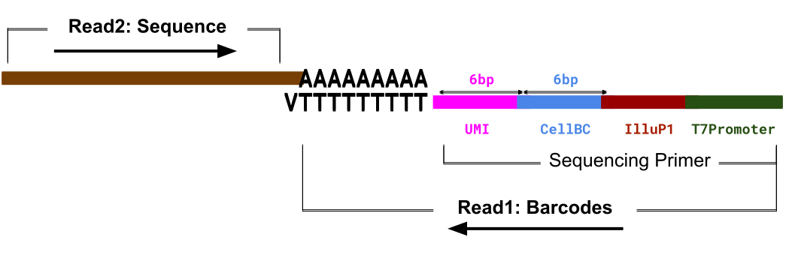
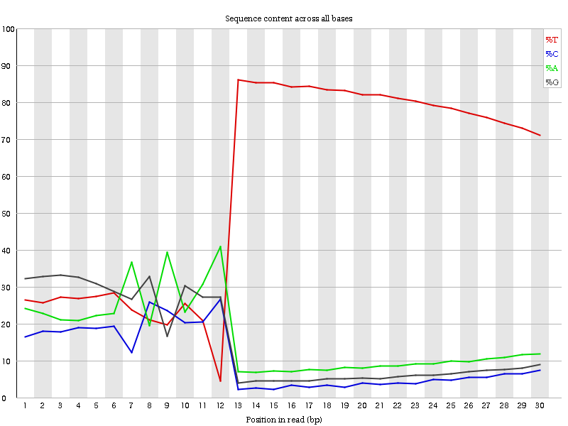

# Introduction


Barcodes are small oligonucleotides that are inserted into the captured sequence at a specific point, and provide two pieces of information about the sequence:

 1. Which cell the sequence came from
 2. Which transcript the sequence came from

When the sequence is mapped against a reference genome, we can then see which gene locus it aligns to and qualitatively assert that, together with the two pieces of information above, the sequence depicts a transcript from a specific gene that originated from a specific cell.

Barcodes come in a variety of formats, and in this tutorial we will be looking at the CEL-Seq2 protocol  used in droplet-based single-cell RNA-seq.

### The CEL-Seq2 Protocol

<small>[Back to previous](javascript:window.history.back())</small>

CEL-Seq2 is a paired-end protocol, meaning that two primers bind to opposite ends of a cDNA strand in order to sequence. Each primer has a specific role.

In this case; *Read1* contains the barcoding information followed by the polyT tail of the messenger RNA, and *Read2* contains the actual sequence. Here, Read1 is regarded as the 'forward' strand and Read2 as the 'reverse' strand, though this is more a convention when dealing with paired-end data rather than an indication of the actual strand orientation.

 


> <agenda-title></agenda-title>
>
> In this tutorial, we will cover:
>
> 1. TOC
> {:toc}
>
{: .agenda}

# Understanding Barcodes

Cell barcodes are designed primarily for delineating one cell from another, such that read transcripts containing different cell barcodes can be trivially said to be derived from different cells.

 

Transcript barcodes, meanwhile, are random sets of nucleotides added to each transcript.

  reads")

There are two things to take note of:

 1. The number of duplicates in the transcript barcodes (left)
 2. The number of duplicate read transcripts (right)

Transcript barcodes are often *not* unique. This becomes evident when you consider that there are approximately 200,000 mRNA's in a given mammalian cell () which would require barcode lengths of greater than 9 nucleotides to capture, assuming no sequencing errors.

> <question-title></question-title>
>
> 1. Why is it important to know which cell a read came from?
> 2. Why do we need to barcode a read transcript too? Isn't mapping it against the reference genome enough?
>
> > <solution-title></solution-title>
> >
> > 1. If all our reads encode for a *Red Gene* (as above), we may want to know which cells express *Red Gene* more than others.
> > * e.g. If our *Grey* cell has 10 times more *Red Gene* reads than our *Green* cell, then we know that the *Grey* cell and *Green* cell differ in their expression of *Red Gene* - which might be biologically significant.
> > 2. *Yes* and *no*!
> > * **Yes**: We can indeed align our sequence against a reference genome and obtain the name of the gene it aligns against. This sequence will then contribute to the 'count' of sequences that gene has, and increase the expression of that gene.
> > * **No**: We do not know whether these 'counts' are *unique*. Many of these counts could be duplicates as a result of the amplification process. To explain further, we must look at UMIs and their role in the analysis.
> {: .solution}
>
{: .question}

The purpose of transcript barcodes is to reduce the impact of duplicated reads that occur non-linearly during the amplification process.

For this reason, transcript barcodes do not need to be unique. As long as we know that a given read maps to a specific transcript (i.e. after mapping it to a transcriptome), then we can assess how unique that read is based on:

  1. Cell barcode
  2. Transcript barcode
  3. Mapped location

To fully explore the uniqueness of counts, we must discuss the inclusion of *UMIs* in a single-cell analysis.

# Mitigating duplicate transcript counts with UMIs

One of the major issues with sequencing is that the read fragments require amplification before they can be sequenced. A gene with a single mRNA transcript will not be detected by most sequencers, so it needs to be duplicated 100-1000x times for the sequencer to 'see' it.

Amplification is an imprecise process however, since some reads are amplified more than others, and subsequent amplification can lead to these over-amplified reads being over-amplified even more, leading to an exponential bias of some reads over others.

<small>***Note:*** Cell barcodes are not shown in any of the below examples, we assume they were added to our transcripts previously. </small><br /><br />

## Naive Amplification

 


Consider the above example where two reads from different transcripts are amplified unevenly. The resulting frequency table would yield:

> |  | Reads in Cell 1 |
> |--|------------------|
> | Gene Red | 4 |
> | Gene Blue | 0 |
{: .matrix}

But the truth is entirely different (i.e. Gene Red should have 1 count, and Gene Blue should also have 1 count).
How do we correct for this bias?

## Amplification with UMIs

**Unique Molecular Identifiers** (or *UMIs*) constitute the second portion of a barcode, where their role is to *uniquely* count reads such that amplicons of the same read are only counted once, e.g:

 

 Here, we see two unique transcripts from Gene Red and two unique transcripts from Gene Blue, each given a (coloured) UMI. After amplification, Gene Red has more reads than Gene Blue. If we were to construct a frequency table as before to count the reads, we would have:

> |  | Reads in Cell 1 |
> |--|-----------------|
> | Gene Red | 6 |
> | Gene Blue | 3 |
{: .matrix}

This information is false, because it shows that Red has twice the expression that Blue does. However, we can reconstitute the true count by considering the UMI information:

> |  | UMI colour  | Reads in Cell 1 |
> |--|-------------|-----------------|
> | Gene Red | Pink | 2 |
> |          | Blue | 4 |
> | Gene Blue | Pink | 1 |
> |           | Green | 2 |
{: .matrix}

From this we can then make the decision to ignore the frequencies of these UMIs, and simply count how many *unique* UMIs we see in each gene:

> |  | Set of UMIs in Gene | UMIs in Cell 1 |
> |--|---------------------|----------------|
> | Gene Red | {Pink, Blue} | 2 |
> | Gene Blue | {Pink, Green} | 2 |
{: .matrix}

This then provides us with the true count of the number of true transcripts for each gene as given by our original figure.

> |  | UMIs in Cell 1 |
> |--|----------------|
> | Gene Red | 2 |
> | Gene Blue | 2 |
{: .matrix}


> <question-title>about UMIs</question-title>
>
> 1. Are UMIs not specific to certain genes? Can the same UMI map to different genes?
> 2. Can the same UMI map to different mRNA molecules of the same gene?
>
> > <solution-title></solution-title>
> >
> 1. Yes, UMIs are not specific to genes and the same UMI barcode can tag the transcripts of different genes. UMIs are not universal tags, they are just 'added randomness' that help reduce amplification bias.
> > 2. Yes, UMIs are not precise but operate probabilistically. In most cases, two transcripts of the same gene will be tagged by different UMIs. In rarer (but still prevalent) cases, the same UMI will capture different transcripts of the same gene.
> >  * One helpful way to think about how quantification is performed is to observe the following hierarchy of data `Cell Barcode → Gene → UMI`
> >
> >   e.g.
> >
> >  | BC:Cell | Maps to Gene | BC:UMI |
> >  |------|-----|------|
> >  | AAAT | Slx1 | TCA |
> >  | AAAT | Slx2 | GTG |
> >  | AAAT | Gh13 | TCA |
> >  | TTAA | Slx1 | TCA |
> >  | TTAA | Atp3 | CCC |
> >
> > If UMIs were unique to a gene, then the `TCA` UMI barcode would not have reads that map to both *Slx1* and *Gh13* in the same cell (`AAAT`).
> >
> {: .solution}
>
{: .question}

# Barcoding Format

We now know the role of UMIs and cell barcodes, but how do we handle them in the analysis? Let us look at 4 example sequences in our paired-end FASTQ data.

> <hands-on-title>Preparing the Data</hands-on-title>
>
>    1. Create a new history and rename it (*e.g.* 'Inspecting FastQ Files in scRNA batch data')
>    1. Import the following files from [`Zenodo`](https://zenodo.org/record/2573177) or from the data library (ask your instructor)
>    ```
> https://zenodo.org/record/2573177/files/test_barcodes_celseq2_R1.fastq.gz
> https://zenodo.org/record/2573177/files/test_barcodes_celseq2_R2.fastq.gz
>    ```
>
>        <br/>
>
>    1. Build a *Dataset pair* for the two FASTQ files <!-- cannot force this to count from 3 -->
>       - Click the *Operations on multiple datasets* check box at the top of the history panel
>       - Check the two boxes next to the R1 and R2 scRNA FASTQ samples
>       - Click *For all selected...* and choose *Build dataset pair*
>       - Ensure that the forward read is the `R1` sample, and the reverse read is the `R2` sample.
>          - Click 'Swap' otherwise.
>       - Set the name of the pair
>
>    1. Generate a list of reads to filter by creating a plain tabular file containing the following read names:
>        ```
>       J00182:75:HTKJNBBXX:2:1114:12469:11073
>       J00182:75:HTKJNBBXX:2:2222:13301:35690
>       J00182:75:HTKJNBBXX:2:1203:25022:13763
>       J00182:75:HTKJNBBXX:2:1115:8501:46961
>        ```
>    1. Set the datatype of the file as **tabular**
>
{: .hands_on}

At this point we now have a history with two items: our paired FASTQ test data, and a tabular file of read names. We will now apply the tabular file to the FASTQ file and extract only those reads.

> <hands-on-title>Extracting the Reads</hands-on-title>
>
> 1. Extracting our 4 reads
>    *  with the following parameters:
>      - **Sequence file to be filtered**
>        - Click the *Dataset Collection* icon
>        - Select the FastQ collection if not already selected.
>      - **Filter using the ID list from**:`tabular file`
>        - *Tabular file containing sequence identifiers*:`Pasted Entry`
>      - **Column(s) containing sequence identifiers**
>        - **Select/Unselect all**:(tick the box)
>      - **Output positive matches, negative matches, or both?**:`Just positive matches (ID on list), as a single file`
>
> 1. Change the datatypes of the output pair to `fastqsanger` if not already set.
>
>    
>
> 1. Viewing our 4 reads side-by-side
>    - Activate the **Scratchbook** by clicking on the **Enable/Disable Scratchbook** icon on the main top toolbar
>    - Click on the newly generated FastQ pair ending in *"with matched ID"* to expand the individual reads
>      - Click on the  symbol of the forward read
>      - Click somewhere outside the white box to close the **Scratchbook**
>      - Click on the  symbol of the reverse read
>    - Position/Resize the boxes as desired
{: .hands_on}

<!--
These are reads that all map to ENSDARG00000019692. In [Cell, UMI] format:

(J00182:75:HTKJNBBXX:2:1114:12469:11073|J00182:75:HTKJNBBXX:2:2222:13301:35690|J00182:75:HTKJNBBXX:2:1203:25022:13763|J00182:75:HTKJNBBXX:2:1115:8501:46961)

            Cell  , UMI
1: 46961 -- ACCAGA, GGAAGA
2: 13763 -- GGTAAC, GTCCCA -> same UMI, same cell
3: 35690 -- GGTAAC, GTCCCA -> same UMI, same cell
4: 11073 -- GGTAAC, CGGCGT -> diff UMI, same cell
-->

## Our Four Reads of Interest

Let us examine these four reads of interest which we have just sub-selected using their headers:

> <details-title>Forward Reads:</details-title>
>
>     @J00182:75:HTKJNBBXX:2:1115:8501:46961 1:N:0:ATCACG
>     GGAAGAACCAGATTTTTTTTTTTTTTTTTT
>     +
>     AAFFFJJJJJJJFFFJJJJJJJJJJJJJJJ
>
>     @J00182:75:HTKJNBBXX:2:1203:25022:13763 1:N:0:ATCACG
>     GTCCCAGGTAACTTTTTTTTTTTTTTTTTT
>     +
>     AAFFFJJJJJJJJFFJJJJJJJJJFJ<FF-
>
>     @J00182:75:HTKJNBBXX:2:2222:13301:35690 1:N:0:ATCACG
>     GTCCCAGGTAACTTTTTTTTTTTTTTTTTT
>     +
>     AAFFFJJJJJJJ<AFJJJJJFFJJFJJJFF
>
>     @J00182:75:HTKJNBBXX:2:1114:12469:11073 1:N:0:ATCACG
>     CGGCGTGGTAACTTTTTTTTTTTTTTTTCC
>     +
>     AAFFFJJJJJJJFAFFJJJJJJJJF---<F
>
>
{: .details}

> <details-title>Reverse Reads:</details-title>
>
>     @J00182:75:HTKJNBBXX:2:1115:8501:46961 2:N:0:ATCACG
>     GACCTCTGATCTTTACGAAAGGCCAACGCGTTTTCAGTCTGGACACGGTTCAGCTCCTGTTCATTATTCA
>     +
>     A<<A-777F<AA<AJJJJJJJJJJJJJJJJJJJJJJJJJJJJJJJJJJJJJJJJJJJJJJJJJJJJJJJJ
>
>     @J00182:75:HTKJNBBXX:2:1203:25022:13763 2:N:0:ATCACG
>     GCCACCTAATTTCCGTCATCACACTCCTCTCCGTTTTCAACTTGCACAATGCTGTCTCCGCAGAATCCCT
>     +
>     ---<----<A---77-7A-FJ<JJFFJJ<JJAJ7<-FAFFJJFF<FFJJFFAJFA-AFFFJFFFFFJAJJ
>
>     @J00182:75:HTKJNBBXX:2:2222:13301:35690 2:N:0:ATCACG
>     CAATCCTCTCCGTTATCAACTTGCACAATGCTGTCTCCGCAGAATCCCTCCGGATCAGGATCGCTCTCCA
>     +
>     <<A-77--77F<----7AFJ-A--FJJJFAJF-AFAJAJ<JFJ<JJJFFJJJFJJJJJAAFJJJFJJJF-
>
>     @J00182:75:HTKJNBBXX:2:1114:12469:11073 2:N:0:ATCACG
>     ATCCACTTATTGCAAAGCAGAGGACATTGAGTCTCACCTTTTGTCCAGGTCTTCCAATTTCACCCTGCAA
>     +
>     A-77AA-7FF<7FFJFFFJJJJJJJJJJJJJ-AFJJJJJJJFJJJJJJJJJJJJJJJJJJJJJJJJJJJJ
>
{: .details}

What we observe are the standard four lines of any FASTQ file:
  1. Read name starting with `@`
  2. Sequence of nucleotide bases
  3. Separator `+`
  4. Quality string of the nucleotide bases in ASCII

The main source of interest for us is in the (2) sequences of these reads, which somewhere within encode for three crucial pieces of information that we will need to perform quantification:

  1. Cell Barcode
  2. UMI Barcode
  3. Reverse-transcribed mRNA sequence

These can be encoded into the sequences of our paired-end data by any means. In order to know where our barcodes are, we must be familiar with the sequencing primers used in the analysis:


<!-- TODO: Expand the schema to talk about the actual read primers and not just the sequencing primers -->

## Verifying the Barcode Format

As shown in [CEL-Seq2 protocol](#the-cel-seq2-protocol), we have the following encoding:
 * Forward Read:
    * 01-06bp: UMI Barcode
    * 07-12bp: Cell Barcode
    * 13-30bp: Poly-T tail
 * Reverse Read:
    * 01-70bp: mRNA sequence

The encoding of the barcodes on the first read can actually be seen by examining the distribution of bases in a FastQC plot.

> <hands-on-title>Confirming the Barcoding</hands-on-title>
>
> 1.  with the following parameters:
>    -  *"Short read data from your current history"*: `Paired FastQ` (the original paired set) You will need to choose 'Dataset collection' to allow this as an input.
>
>    > <comment-title></comment-title>
>    >
>    > We are only interested in the distribution of bases on the Forward read, but it is more convenient to process the data as a pair instead of un-hiding the original dataset
>    {: .comment}
>
> 1. Click on *FastQC on collection :Webpage*
> 1. Click on the  of the Forward read
> 1. Click on the *Per base sequence content* header on the side-bar
{: .hands_on}


 


Here we can see the three distinct regions along the x-axis that correspond to our expected [CEL-Seq2 Schema](#the-cel-seq2-protocol):

 * 01-06bp: smooth, relatively constant bases.
 * 07-12bp: noisy, highly varied distribution of bases.
 * 13-30bp: T-dominated region

We can see that the distribution of nucleotides in the 01-06bp range is relatively more stable than the distribution of nucleotides in the 07-12bp range, which seems to exhibit more extreme variation.

> <question-title></question-title>
>
> Why is this the case? Why is the UMI barcode base distribution smoother than the Cell barcode base distribution?
> >
> > <solution-title></solution-title>
> >
> > There are far more UMIs than cells. Cell barcodes are designed and selected with a specified edit distance, greatly limiting their availability in the data. UMIs are not so well-curated -- i.e it is possible to encounter the same UMI in the same cell multiple times. The more extreme variation in the 7-12bp region is simply caused by a fewer number of samples.
> >
> {: .solution}
{: .question}


# Uniting Barcodes with Sequence

In a sense, we have a disparity in our data: the reverse reads contain the sequences we wish to map, but not the barcodes; the forward reads contain the barcode, but not the sequence. For the forward and reverse reads given above, the information that we really want from both can be summarized in this table:

 | Read | Cell | UMI | Sequence |
 |------|------|-----|----------|
 | <small>@J00182:75:HTKJNBBXX:2:1115:8501:46961</small>  | ACCAGA | GGAAGA | <small>GACCTCTGATCTTTACGAAAGGCCAACGCGTTTTCAGTCTGGACACGGTTCAGCTCCTGTTCATTATTCA</small> |
 | <small>@J00182:75:HTKJNBBXX:2:1203:25022:13763</small> | GGTAAC | GTCCCA | <small>GCCACCTAATTTCCGTCATCACACTCCTCTCCGTTTTCAACTTGCACAATGCTGTCTCCGCAGAATCCCT</small> |
 | <small>@J00182:75:HTKJNBBXX:2:2222:13301:35690</small> | GGTAAC | GTCCCA | <small>CAATCCTCTCCGTTATCAACTTGCACAATGCTGTCTCCGCAGAATCCCTCCGGATCAGGATCGCTCTCCA</small> |
 | <small>@J00182:75:HTKJNBBXX:2:1114:12469:11073</small> | GGTAAC | CGGCGT | <small>ATCCACTTATTGCAAAGCAGAGGACATTGAGTCTCACCTTTTGTCCAGGTCTTCCAATTTCACCCTGCAA</small> |

> <question-title></question-title>
>
> Provided that these reads all map to the same gene:
>
> 1. Which of these reads come from the same cell?
> 2. Which of these reads are PCR duplicates?
>
> > <solution-title></solution-title>
> >
> > 1. Reads:
> >  * `@J00182:75:HTKJNBBXX:2:1203:25022:13763`
> >  * `@J00182:75:HTKJNBBXX:2:2222:13301:35690`
> >  * `@J00182:75:HTKJNBBXX:2:1114:12469:11073`
> >  all have the cell barcode `GGTAAC`.
> >
> > 2. Reads:
> >  * `@J00182:75:HTKJNBBXX:2:1203:25022:13763`
> >  * `@J00182:75:HTKJNBBXX:2:2222:13301:35690`
> >  appear to be PCR duplicates, since they both have the same cell barcode and same UMI.
> >
> > However if we consider their sequences, we can see that they contain different (but overlapping) sequences.
> >
> >     13763:   GCCACCTAATTTCCGTCATCACACTCCTCTCCGTTTTCAACTTGCACAATGCTGTCTCCGCAGAATCCCT
> >     35690:                        CAATCCTCTCCGTTATCAACTTGCACAATGCTGTCTCCGCAGAATCCCTCCGGATCAGGATCGCTCTCCA
> >
> > They describe the same transcript but have sequences from different reads, and therefore both reads *should* be counted as separate reads. Whether or not both these reads are counted as a single read due to their identical barcodes, or counted separately due to their differing sequences depends entirely on the deduplication utility they are fed into it.
> >
> {: .solution}
{: .question}

## Coupling our Data Sources

How should we unite these two source of information into a single location without impacting the data content?

For this we need to take the barcode information from the Forward reads, and stick it into the *header* of the Reverse reads. That way we can align our sequence to the reference and still keep the barcode information associated with the reads.

> <hands-on-title>Barcode Extraction and Annotation of our 4 reads</hands-on-title>
>
> 1.  with the following parameters:
>    - *"Library type"*: `Paired-end Dataset Collection`
>        -  *"Reads in FASTQ format"*: `output` (Our paired set of 4 sequences)
>        - *"Barcode on both reads?"*: `Barcode on first read only`
>    - *"Use Known Barcodes?"*: `No`
>    - *"Barcode pattern for first read"*: `NNNNNNCCCCCC`
>    - *"Enable quality filter?"*: `No`
>
>    > <comment-title></comment-title>
>    >
>    > - Here we specify the format of our barcodes as `NNNNNNCCCCCC` where the *N*s represent UMI bases and the *C*s represent the cell barcodes.
>    > - In some protocols, actual sequence data can be found in between the cell and UMI barcodes, wherein it is neccesary to represent sequence bases using *X*.
>    > - e.g. A protocol that starts with a 3bp sequence, followed by a 4bp Cell barcode, followed once again by a 10bp sequence, and then finally a 5bp UMI barcode, would require the following barcode format:
>    >   `XXXCCCCXXXXXXXXXXNNNNN`
>    >
>    {: .comment}
> 1. Click the  symbol on the *Reads1: UMI-tools extract* file
> 1. Click somewhere outside the white box to close the **Scratchbook**
> 1. Click the  symbol on the *Reads2: UMI-tools extract* file
>
{: .hands_on}

We should now be able to see the following reads:

> <details-title>Forward Reads:</details-title>
>
>     @J00182:75:HTKJNBBXX:2:1115:8501:46961_ACCAGA_GGAAGA 1:N:0:ATCACG
>     TTTTTTTTTTTTTTTTTT
>     +
>     FFFJJJJJJJJJJJJJJJ
>
>     @J00182:75:HTKJNBBXX:2:1203:25022:13763_GGTAAC_GTCCCA 1:N:0:ATCACG
>     TTTTTTTTTTTTTTTTTT
>     +
>     JFFJJJJJJJJJFJ<FF-
>
>     @J00182:75:HTKJNBBXX:2:2222:13301:35690_GGTAAC_GTCCCA 1:N:0:ATCACG
>     TTTTTTTTTTTTTTTTTT
>     +
>     <AFJJJJJFFJJFJJJFF
>
>     @J00182:75:HTKJNBBXX:2:1114:12469:11073_GGTAAC_CGGCGT 1:N:0:ATCACG
>     TTTTTTTTTTTTTTTTCC
>     +
>     FAFFJJJJJJJJF---<F>
>
{: .details}

> <details-title>Reverse Reads:</details-title>
>
>     @J00182:75:HTKJNBBXX:2:1115:8501:46961_ACCAGA_GGAAGA 2:N:0:ATCACG
>     GACCTCTGATCTTTACGAAAGGCCAACGCGTTTTCAGTCTGGACACGGTTCAGCTCCTGTTCATTATTCA
>     +
>     A<<A-777F<AA<AJJJJJJJJJJJJJJJJJJJJJJJJJJJJJJJJJJJJJJJJJJJJJJJJJJJJJJJJ
>
>     @J00182:75:HTKJNBBXX:2:1203:25022:13763_GGTAAC_GTCCCA 2:N:0:ATCACG
>     GCCACCTAATTTCCGTCATCACACTCCTCTCCGTTTTCAACTTGCACAATGCTGTCTCCGCAGAATCCCT
>     +
>     ---<----<A---77-7A-FJ<JJFFJJ<JJAJ7<-FAFFJJFF<FFJJFFAJFA-AFFFJFFFFFJAJJ
>
>     @J00182:75:HTKJNBBXX:2:2222:13301:35690_GGTAAC_GTCCCA 2:N:0:ATCACG
>     CAATCCTCTCCGTTATCAACTTGCACAATGCTGTCTCCGCAGAATCCCTCCGGATCAGGATCGCTCTCCA
>     +
>     <<A-77--77F<----7AFJ-A--FJJJFAJF-AFAJAJ<JFJ<JJJFFJJJFJJJJJAAFJJJFJJJF-
>
>     @J00182:75:HTKJNBBXX:2:1114:12469:11073_GGTAAC_CGGCGT 2:N:0:ATCACG
>     ATCCACTTATTGCAAAGCAGAGGACATTGAGTCTCACCTTTTGTCCAGGTCTTCCAATTTCACCCTGCAA
>     +
>     A-77AA-7FF<7FFJFFFJJJJJJJJJJJJJ-AFJJJJJJJFJJJJJJJJJJJJJJJJJJJJJJJJJJJJ
>
{: .details}

Notice the remaining sequence in each of the reads, and that the reverse reads appear to fully encapsulate all the information that we wanted to capture in our table at the beginning of this section.

> <question-title></question-title>
>
> 1. Compare the Forward/Read1 and Reverse/Read2 reads to those prior the extraction. What has happened to the header and sequence of each read?
> 2. Are the Forward reads useful at all?
>
> > <solution-title></solution-title>
> >
> > 1. Comparison:
> >    * Forward:
> >       * Sequence: The `cell` and `umi` sections of the sequence have been removed, leaving behind only the PolyT tail.
> >       * Header: The `cell` and `umi` sections of the sequence have been added as `cell_umi` barcode in the header
> >    * Reverse:
> >       * Sequence: Has not changed.
> >       * Header: The `cell` and `umi` sections of the sequence from the Forward (note: **NOT** Reverse) reads have been added to the header.
> > 2. With the inclusion of the cell and UMI barcodes into the header of our sequence data, we now have all our useful data in the Reverse reads. We can now effectively throw away our Forward reads, as they have no more useful information within them.
> {: .solution}
{: .question}

We have now successfully multiplexed data from several different (cell) sources into a single file that will greatly simplify the mapping/alignment process downstream.

We have also now successfully *de*-multiplexed our data, by decoding each pair of reads into barcoding and sequence parts and making use of the FASTQ format by storing this information within the FASTQ headers and data, respectively.


# Conclusion


With this tutorial we have understood the importance of handling FASTQ data from different sources, and extracting the information we need (barcodes (cell and UMI) and sequence) using **UMI-tools** so that we can perform mapping without losing any context of where the reads are derived from.

This tutorial is part of the https://singlecell.usegalaxy.eu portal ().
