https://www.10xgenomics.com/products/xenium-in-situ/preview-dataset-human-breast

Breast tumours contain epithelial, stromal, vascular, and immune components whose abundance and position can vary across a tissue section  . Spatial transcriptomics measures gene expression together with the position of each observation, so expression patterns can be compared with the tissue image and with neighbouring capture spots  .

The data in this tutorial come from the 10x Genomics **Human Breast Cancer, Block A Section 1** Visium dataset . 10x Genomics describes the sample as a fresh-frozen invasive ductal carcinoma section containing ductal carcinoma in situ, lobular carcinoma in situ, and invasive carcinoma. The Space Ranger 1.1.0 summary reports 3,798 spots under tissue and a median of 6,026 detected genes per spot.

For training, the official 10x output files were converted to SpatialData in Galaxy and deposited on Zenodo. The Zenodo record is the distribution site for the prepared files; 10x Genomics is the source of the experiment. The main lesson starts from `V1_Breast_Cancer_Block_A_Section_1.spatialdata.zip`. An optional section shows how that archive was rebuilt with SpatialData IO.

This tutorial produces QC summaries, a filtered and normalised AnnData table, PCA and UMAP coordinates, three Leiden results, ranked genes, Squidpy statistics, CellTypist annotations, LIANA rankings, and a processed table returned to SpatialData.



> <agenda-title></agenda-title>
>
> In this tutorial, we will cover:
>
> 1. TOC
> {:toc}
>
{: .agenda}

# Analysis strategy

Two graphs are used in the analysis:

1. Scanpy builds an **expression-neighbour graph** from PCA coordinates. Spots with similar expression profiles are connected in this graph. Leiden clustering and UMAP use these connections.
2. Squidpy builds a **spatial-neighbour graph** from the capture-spot coordinates. This graph represents nearby positions in the tissue section.

A **Leiden group** is the set of spots assigned the same Leiden label. A group can be described as a candidate tissue region only when its location and ranked genes support that interpretation. A Leiden group is not automatically a cell type.

| Analysis group | Purpose | Main output |
| --- | --- | --- |
| SpatialData input | Keep the expression table, capture-spot shapes, tissue images, and coordinate systems together, then export the expression table for analysis. | Prepared SpatialData archive and exported AnnData object. |
| Scanpy preprocessing | Examine data quality, filter spots and genes, normalise and log-transform expression, and identify highly variable genes. | Filtered and log-normalised AnnData object with HVG annotations. |
| Scanpy clustering | Calculate PCA, construct an expression-neighbour graph, generate UMAP, and compare three Leiden resolutions. | PCA coordinates, expression-neighbour graph, UMAP coordinates, and Leiden group assignments. |
| Ranked genes | Rank genes for every group in the selected Leiden partition. | Ranked-gene results in the AnnData object and a tabular output for inspection. |
| Squidpy | Construct a spatial-neighbour graph and calculate group-level spatial statistics and gene-expression autocorrelation. | Spatial-neighbour graph, centrality scores, neighbourhood enrichment, and Moran's I results. |
| CellTypist | Compare each spot expression profile with an adult human breast single-cell reference and refine the predictions by majority voting. | Reference-label predictions, majority-voting labels, and confidence scores. |
| LIANA | Rank candidate ligand–receptor pairs between Leiden groups from their expression profiles. | Candidate source-to-target ligand–receptor rankings. |
| SpatialData output | Add the processed AnnData object back to the original spatial object. | SpatialData archive containing `table_processed` alongside the original images, capture-spot shapes, and coordinate system. |

> <question-title></question-title>
>
> 1. What is the difference between the expression-neighbour graph and the spatial-neighbour graph?
> 2. Why is a Leiden group not automatically a cell type?
>
> > <solution-title></solution-title>
> >
> > 1. The expression graph connects spots with similar PCA profiles. The spatial graph connects spots that are close in the tissue section.
> > 2. Leiden uses expression similarity, and each Visium spot can contain several cells. A biological description also needs evidence from ranked genes, tissue position, morphology, and other analyses.
> >
> {: .solution}
>
{: .question}

# Get the prepared SpatialData object

> <hands-on-title>Import the training input</hands-on-title>
>
> 1. Create a new Galaxy history and name it `Breast cancer Visium spatial transcriptomics`.
>
>    
>
>    
>
> 2. Import the prepared SpatialData archive from [Zenodo]({{ page.zenodo_link }}):
>
>    ```
>    {{ page.zenodo_link }}/files/V1_Breast_Cancer_Block_A_Section_1.spatialdata.zip
>    ```
>
>    
>
> 3. Confirm that Galaxy assigns the datatype `spatialdata.zip`.
>
>    
>
{: .hands_on}

> <tip-title>Rename Galaxy datasets</tip-title>
>
> 
>
{: .tip}


> <details-title>Optional: rebuild the SpatialData archive from the Visium files</details-title>
>
> The same Zenodo record contains the six files used to create the training input. This preparation is optional because the downstream analysis starts from the completed SpatialData archive.
>
> 1. Import these files from [Zenodo]({{ page.zenodo_link }}):
>
>    ```
>    {{ page.zenodo_link }}/files/V1_Breast_Cancer_Block_A_Section_1_filtered_feature_bc_matrix.h5
>    {{ page.zenodo_link }}/files/V1_Breast_Cancer_Block_A_Section_1_image.tif
>    {{ page.zenodo_link }}/files/tissue_hires_image.png
>    {{ page.zenodo_link }}/files/tissue_lowres_image.png
>    {{ page.zenodo_link }}/files/tissue_positions_list.csv
>    {{ page.zenodo_link }}/files/scalefactors_json.json
>    ```
>
> 2. Run  with the following parameters:
>    - *"Spatial Technology"*: `10x Genomics Visium`
>    - *"Dataset identifier to name the constructed SpatialData elements"*: `V1_Breast_Cancer_Block_A_Section_1`
>    -  *"feature BC matrix (Counts file)"*: `V1_Breast_Cancer_Block_A_Section_1_filtered_feature_bc_matrix.h5`
>    -  *"Scale factors file"*: `scalefactors_json.json`
>    -  *"Full resolution image"*: `V1_Breast_Cancer_Block_A_Section_1_image.tif`
>    -  *"Tissue high resolution image"*: `tissue_hires_image.png`
>    -  *"Tissue low resolution image"*: `tissue_lowres_image.png`
>    -  *"Tissue positions file"*: `tissue_positions_list.csv`
>
> 3. Compare the generated element names with the prepared archive. They should use `V1_Breast_Cancer_Block_A_Section_1` as the image, shape, and coordinate-system prefix.
>
{: .details}

# Extract the expression table

SpatialData keeps the tissue images, capture-spot shapes, coordinate transformations, and annotated expression table in one object . The Scanpy tools use the AnnData table, so the first analysis step exports `table` while preserving the original SpatialData archive for later plots.

> <hands-on-title>Export and inspect the AnnData table</hands-on-title>
>
> 1. Run  with the following parameters:
>    -  *"SpatialData object"*: `V1_Breast_Cancer_Block_A_Section_1.spatialdata.zip`
>    - *"Operation"*: `Export the table of a SpatialData object to anndata`
>
>    Rename the AnnData output `Breast cancer input AnnData`.
>
> 2. Run  with the following parameters:
>    -  *"Annotated data matrix"*: `Breast cancer input AnnData`
>
>    Record `n_obs` and `n_vars`. The source dataset contains 3,798 spots under tissue.
>
{: .hands_on}

> <question-title></question-title>
>
> What do `n_obs` and `n_vars` represent in this AnnData object?
>
> > <solution-title></solution-title>
> >
> > `n_obs` is the number of Visium capture spots in the table. `n_vars` is the number of measured features represented as variables.
> >
> {: .solution}
>
{: .question}

# Scanpy filtering and highly variable gene selection

## Calculate QC metrics before filtering

`total_counts` measures the number of transcripts observed in a spot, while `n_genes_by_counts` measures expression complexity. The `pct_counts_in_top_N_genes` metrics reveal whether a small number of highly expressed genes dominates a spot.

> <hands-on-title>Calculate and visualise pre-filter QC metrics</hands-on-title>
>
> 1. Run  with the following parameters:
>    -  *"Annotated data matrix"*: `Breast cancer input AnnData`
>    - *"Method used for inspecting"*: `Calculate quality control metrics, using 'pp.calculate_qc_metrics'`
>    - *"Proportions of top genes to cover"*: `50,100,200,300`
>
>    Rename the output `QC metrics before filtering`.
>
>
> 2. Run  with the following parameters:
>    -  *"Annotated data matrix"*: `QC metrics before filtering`
>    - *"Method used for plotting"*: `Generic: Scatter plot along observations or variables axes, using 'pl.scatter'`
>    - *"x coordinate"*: `total_counts`
>    - *"y coordinate"*: `n_genes_by_counts`
>    - *"Color by"*: `pct_counts_in_top_50_genes`
>
> 3. Run  with the following parameters:
>    -  *"Annotated data matrix"*: `QC metrics before filtering`
>    - *"Method used for plotting"*: `Generic: Violin plot, using 'pl.violin'`
>    - *"Keys for accessing variables"*: `Subset of variables in 'adata.var_names' or fields of '.obs'`
>        - *"Keys for accessing variables"*: `n_genes_by_counts`
>
> 4. Run  with the following parameters:
>    -  *"Annotated data matrix"*: `QC metrics before filtering`
>    - *"Method used for plotting"*: `Generic: Violin plot, using 'pl.violin'`
>    - *"Keys for accessing variables"*: `Subset of variables in 'adata.var_names' or fields of '.obs'`
>    - *"Keys for accessing variables"*: `total_counts`
>
{: .hands_on}

> <hands-on-title>Map the QC metrics back onto the tissue</hands-on-title>
>
> 1. Run  with the following parameters:
>    -  *"SpatialData object"*: `V1_Breast_Cancer_Block_A_Section_1.spatialdata.zip`
>    - *"Operation"*: `Import anndata table to a SpatialData object`
>    -  *"annotated data object to add"*: `QC metrics before filtering`
>    - *"Table name"*: `table_qc`
>
> 2. Run  with the following parameters:
>    -  *"SpatialData object"*: the output from step 1
>    - In *"Render Images"*:
>        - *"Image element name"*: `V1_Breast_Cancer_Block_A_Section_1_hires_image`
>    - In *"Render Shapes"*:
>        - *"Shapes element name"*: `V1_Breast_Cancer_Block_A_Section_1`
>        - *"Color column"*: `total_counts`
>        - *"Table name"*: `table_qc`
>    - In *"Plot Display Parameters"*:
>        - *"Coordinate system(s)"*: `V1_Breast_Cancer_Block_A_Section_1`
>
> 3. Run  with the same settings, changing:
>    -  *"SpatialData object"*: the output from step 1
>    - In *"Render Images"*:
>        - *"Image element name"*: `V1_Breast_Cancer_Block_A_Section_1_hires_image`
>    - In *"Render Shapes"*:
>        - *"Shapes element name"*: `V1_Breast_Cancer_Block_A_Section_1`
>    - *"Color column"*: `n_genes_by_counts`
>        - *"Table name"*: `table_qc`
>    - In *"Plot Display Parameters"*:
>        - *"Coordinate system(s)"*: `V1_Breast_Cancer_Block_A_Section_1`
>
{: .hands_on}

> <question-title>Inspect the pre-filter QC outputs</question-title>
>
> 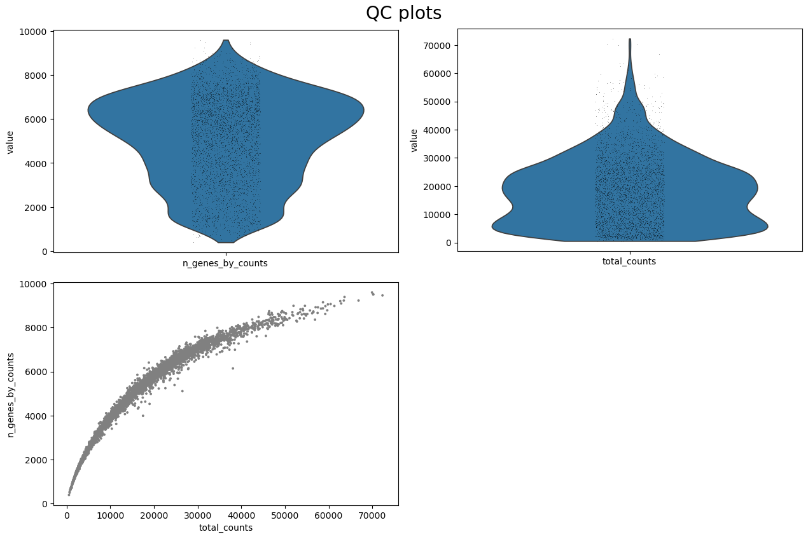
>
> 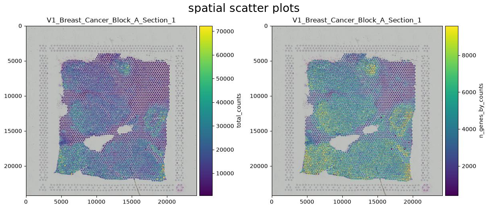
>
> 1. In the displayed QC plots, where is the low-count and low-complexity tail?
> 2. What might spots in that tail represent?
> 3. Why should those spots be checked on the spatial maps before they are discarded?
>
> > <solution-title></solution-title>
> >
> > 1. The low-information tail appears at the lower end of the violin distributions and in the lower-left region of the `total_counts` versus `n_genes_by_counts` scatter plot.
> > 2. Those spots may represent poorly captured or damaged regions, edge spots, or genuinely low-RNA tissue.
> > 3. Low counts can coincide with real tissue compartments such as adipose or necrotic regions. The spatial maps help distinguish technical failure from plausible biology.
> >
> {: .solution}
>
{: .question}

## Filter spots and genes

The thresholds below were used for this section. They are not universal defaults. The upper limits of 75,000 counts and 10,000 detected genes sit above the main distributions in the reference plots and act as guardrails.

> <hands-on-title>Apply the validated QC filters and record dimensions</hands-on-title>
>
> Run six  jobs in sequence, always using the AnnData output of the previous job.
>
> 1. Run  with the following parameters:
>    -  *"Annotated data matrix"*: `QC metrics before filtering`
>    - *"Method used for filtering"*: `Filter cell outliers based on counts and numbers of genes expressed, using 'pp.filter_cells'`
>    - *"Filter"*: `Minimum number of genes expressed`
>    - *"Minimum number of genes expressed required for a cell to pass filtering"*: `500`
>
> 2. Run  with the following parameters:
>    -  *"Annotated data matrix"*: the AnnData output from step 1
>    - *"Method used for filtering"*: `Filter cell outliers based on counts and numbers of genes expressed, using 'pp.filter_cells'`
>    - *"Filter"*: `Minimum number of counts`
>    - *"Minimum number of counts required for a cell to pass filtering"*: `1000`
>
> 3. Run  with the following parameters:
>    -  *"Annotated data matrix"*: the AnnData output from step 2
>    - *"Method used for filtering"*: `Filter genes based on number of cells or counts, using 'pp.filter_genes'`
>    - *"Filter"*: `Minimum number of cells expressed`
>    - *"Minimum number of cells expressed required for a gene to pass filtering"*: `3`
>
> 4. Run  with the following parameters:
>    - *"Method used for filtering"*: `Filter genes based on number of cells or counts, using 'pp.filter_genes'`
>    -  *"Annotated data matrix"*: the AnnData output from step 3
>    - *"Filter"*: `Minimum number of counts`
>    - *"Minimum number of counts required for a gene to pass filtering"*: `3`
>
> 5. Run  with the following parameters:
>    -  *"Annotated data matrix"*: the AnnData output from step 4
>    - *"Method used for filtering"*: `Filter cell outliers based on counts and numbers of genes expressed, using 'pp.filter_cells'`
>    - *"Filter"*: `Maximum number of counts`
>    - *"Maximum number of counts required for a cell to pass filtering"*: `75000`
>
> 6. Run  with the following parameters:
>    - *"Method used for filtering"*: `Filter cell outliers based on counts and numbers of genes expressed, using 'pp.filter_cells'`
>    -  *"Annotated data matrix"*: the AnnData output from step 5
>    - *"Filter"*: `Maximum number of genes expressed`
>    - *"Maximum number of genes expressed required for a cell to pass filtering"*: `10000`
>
> Rename the final output `Filtered breast cancer AnnData`.
>
> 7. Run  for steps 2, 4, and 6 with the following parameters:
>    -  *"Annotated data matrix"*: the relevant Scanpy filter output
>
> Record `n_obs` and `n_vars` in a small table.
>
>
{: .hands_on}

Use the values reported by **Inspect AnnData** to complete this table:

| Stage | Spots (`n_obs`) | Variables (`n_vars`) |
| --- | ---: | ---: |
| Before filtering | 3813 | 33538 |
| After the minimum spot filters | 3800 | 33538 |
| After the gene filters | 3800 | 20687 |
| After the upper spot filters | 3800 | 20687 |


> <hands-on-title>Recalculate and map QC after filtering</hands-on-title>
>
> 1. Run , changing:
>    -  *"Annotated data matrix"*: `Filtered breast cancer AnnData`
>    - *"Method used for inspecting"*: `Calculate quality control metrics, using 'pp.calculate_qc_metrics'`
>    - *"Proportions of top genes to cover"*: `50,100,200,300`
>
>    Rename the output `QC metrics After filtering`.
>
> 2. Run  with the following parameters:
>    -  *"Annotated data matrix"*: `QC metrics After filtering`
>    - *"Method used for plotting"*: `Generic: Scatter plot along observations or variables axes, using 'pl.scatter'`
>    - *"x coordinate"*: `total_counts`
>    - *"y coordinate"*: `n_genes_by_counts`
>    - *"Color by"*: `pct_counts_in_top_50_genes`
>
> 3. Run  with the following parameters:
>    -  *"Annotated data matrix"*: `QC metrics After filtering`
>    - *"Method used for plotting"*: `Generic: Violin plot, using 'pl.violin'`
>    - *"Keys for accessing variables"*: `Subset of variables in 'adata.var_names' or fields of '.obs'`
>        - *"Keys for accessing variables"*: `n_genes_by_counts`
>
> 4. Run  with the following parameters:
>    -  *"Annotated data matrix"*: `QC metrics After filtering`
>    - *"Method used for plotting"*: `Generic: Violin plot, using 'pl.violin'`
>    - *"Keys for accessing variables"*: `Subset of variables in 'adata.var_names' or fields of '.obs'`
>    - *"Keys for accessing variables"*: `total_counts`
> 5. Run  with the following parameters:
>    -  *"SpatialData object"*: `V1_Breast_Cancer_Block_A_Section_1.spatialdata.zip`
>    - *"Operation"*: `Import anndata table to a SpatialData object`
>    -  *"annotated data object to add"*: `QC metrics After filtering`
>    - *"Table name"*: `table_qc_filtered`
>
> 6. Run  with:
>    -  *"SpatialData object"*: the output from step 5
>    - In *"Render Images"*:
>        - *"Image element name"*: `V1_Breast_Cancer_Block_A_Section_1_hires_image`
>    - In *"Render Shapes"*:
>        - *"Shapes element name"*: `V1_Breast_Cancer_Block_A_Section_1`
>        - *"Color column"*: `total_counts`
>        - *"Table name"*: `table_qc_filtered`
>    - In *"Plot Display Parameters"*:
>        - *"Coordinate system(s)"*: `V1_Breast_Cancer_Block_A_Section_1`
>
> 7. Run  with:
>    -  *"SpatialData object"*: the output from step 5
>    - In *"Render Images"*:
>        - *"Image element name"*: `V1_Breast_Cancer_Block_A_Section_1_hires_image`
>    - In *"Render Shapes"*:
>        - *"Shapes element name"*: `V1_Breast_Cancer_Block_A_Section_1`
>        - *"Color column"*: `n_genes_by_counts`
>        - *"Table name"*: `table_qc_filtered`
>    - In *"Plot Display Parameters"*:
>        - *"Coordinate system(s)"*: `V1_Breast_Cancer_Block_A_Section_1`
>
{: .hands_on}

> <question-title>Inspect the post-filter QC outputs</question-title>
>
> 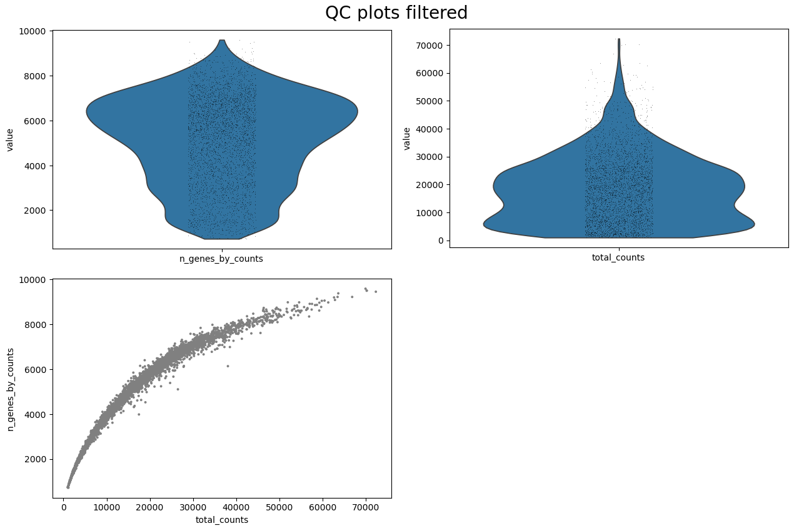
>
> 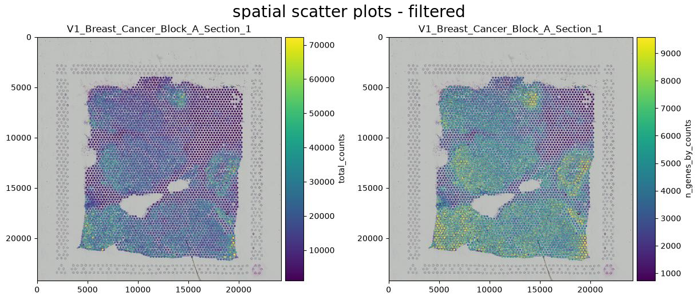
>
> 1. Using the dimensions you recorded, how many observations and variables were removed?
> 2. What percentage of observations was retained?
> 3. What do the pre- and post-filter plots show about the effect of these thresholds?
>
> > <solution-title></solution-title>
> >
> > 1. Subtract the final `n_obs` and `n_vars` from the corresponding starting values.
> > 2. Calculate `final n_obs / starting n_obs × 100`.
> > 3. In the reference images, the distributions and broad tissue pattern change little. The filters mainly trim the low-information tail. Use your recorded dimensions to report the exact effect in your run.
> >
> {: .solution}
>
{: .question}

## Normalise expression and select HVGs

Scanpy normalises the expression values in each spot to a total of 10,000, applies a `log1p` transformation to reduce the influence of highly expressed genes, and selects 3,000 highly variable genes for PCA and neighbourhood construction.

> <hands-on-title>Preserve counts and normalise expression</hands-on-title>
>
> 1. Run  with the following parameters:
>    -  *"Annotated data matrix"*: `QC metrics after filtering`
>    - *"Target sum"*: `10000.0`
>
> 2. Run  with the following parameters:
>    -  *"Annotated data matrix"*: the normalised AnnData output from step 1
>    - *"Method used for inspecting"*: `Logarithmize the data matrix, using 'pp.log1p'`
>
>    Rename the output `Log-normalised breast cancer AnnData`.
>
>
{: .hands_on}

> <hands-on-title>Select 3,000 highly variable genes</hands-on-title>
>
> 1. Run  with the following parameters:
>    -  *"Annotated data matrix"*: `Log-normalised breast cancer AnnData`
>    - *"Method used for filtering"*: `Annotate (and filter) highly variable genes, using 'pp.highly_variable_genes'`
>    - *"Choose the flavor for identifying highly variable genes"*: `Cell Ranger`
>    - *"Number of highly-variable genes to keep"*: `3000`
>
>    Rename the output `Breast cancer AnnData with HVGs`.
>
>
> 2. Run  with the following parameters:
>    -  *"Annotated data matrix"*: `Breast cancer AnnData with HVGs`
>    - *"Method used for plotting"*: `Preprocessing: Plot dispersions versus means for genes, using 'pl.highly_variable_genes'`
>
{: .hands_on}

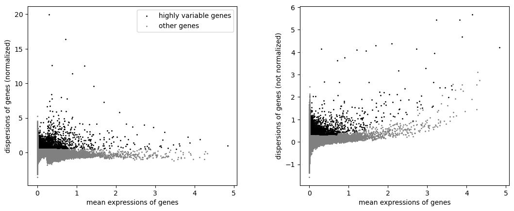


> <question-title>Interpret the highly-variable-gene output</question-title>
>
> 1. What does the displayed plot show about how the selected HVGs differ from other genes with similar mean expression?
> 2. Does selecting 3,000 HVGs mean the other genes are biologically unimportant?
>
> > <solution-title></solution-title>
> >
> > 1. The selected genes show stronger variability than expected for genes at a similar average expression level, making them useful for modelling structure in this dataset.
> > 2. No. HVG selection chooses genes that are most useful for modelling variation and neighbourhood structure; non-HVG genes remain available for marker interpretation and other analyses.
> >
> {: .solution}
>
{: .question}

# Scanpy dimensionality reduction and clustering

## PCA, transcriptomic neighbours, and UMAP

PCA compresses correlated gene-expression patterns into orthogonal components. The k-nearest-neighbour graph then links spots with similar PCA coordinates. UMAP provides a two-dimensional visualisation of this graph; it is useful for exploration but should not be interpreted as a physical tissue map .

> <hands-on-title>Generate PCA, inspect count depth, and regress total counts</hands-on-title>
>
> 1. Run  with the following parameters:
>    -  *"Annotated data matrix"*: `Breast cancer AnnData with HVGs`
>    - *"Method used"*: `Computes PCA (principal component analysis) coordinates, loadings and variance decomposition, using 'pp.pca'`
>
>    Rename the output `Breast cancer PCA before regression`.
>
> 2. Run  with the following parameters:
>    -  *"Annotated data matrix"*: `Breast cancer PCA before regression`
>    - *"Method used for plotting"*: `PCA: Scatter plot in PCA coordinates, using 'pl.pca'`
>    - *"Keys for annotations of observations/cells or variables/genes"*: `log1p_total_counts,log1p_n_genes_by_counts,total_counts`
>
> 3. Run  with the following parameters:
>    -  *"Annotated data matrix"*: `Breast cancer AnnData with HVGs`
>    - *"Method used for plotting"*: `Regress out unwanted sources of variation, using 'pp.regress_out'`
>    - *"Keys for observation annotation on which to regress on"*: `total_counts`
>
>    Rename the output `Breast cancer AnnData regressed for total counts`.
>
> 4. Run  with the following parameters:
>    -  *"Annotated data matrix"*: `Breast cancer AnnData regressed for total counts`
>    - *"Method used"*: `Computes PCA (principal component analysis) coordinates, loadings and variance decomposition, using 'pp.pca'`
>
>    Rename the output `Breast cancer PCA after regression`.
>
> 5. Run  with the following parameters:
>    -  *"Annotated data matrix"*: `Breast cancer PCA after regression`
>    - *"Method used for plotting"*: `PCA: Scatter plot in PCA coordinates, using 'pl.pca'`
>    - *"Keys for annotations of observations/cells or variables/genes"*: `log1p_total_counts,log1p_n_genes_by_counts,total_counts`
>
{: .hands_on}

> <hands-on-title>Build the transcriptomic graph and UMAP</hands-on-title>
>
> 1. Run  with the following parameters:
>    -  *"Annotated data matrix"*: `Breast cancer PCA after regression`
>    - *"Method used for inspecting"*: `Compute a neighborhood graph of observations, using 'pp.neighbors'`
>
>    Rename the output `Breast cancer transcriptomic neighbours`.
>
>
> 2. Run  with the following parameters:
>    -  *"Annotated data matrix"*: `Breast cancer transcriptomic neighbours`
>    - *"Method used"*: `Embed the neighborhood graph using UMAP, using 'tl.umap'`
>
>    Rename the output `Breast cancer UMAP`.
>
>
> 3. Run  with the following parameters:
>    -  *"Annotated data matrix"*: `Breast cancer UMAP`
>    - *"Method used for plotting"*: `Embeddings: Scatter plot in UMAP basis, using 'pl.umap'`
>    - *"Keys for annotations of observations/cells or variables/genes"*: `log1p_total_counts,log1p_n_genes_by_counts,total_counts`
>
{: .hands_on}

> <question-title>Inspect the PCA and UMAP outputs</question-title>
>
> 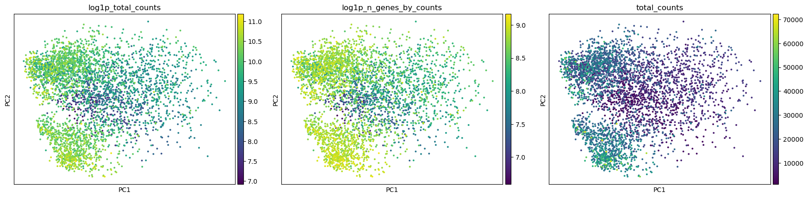
>
> 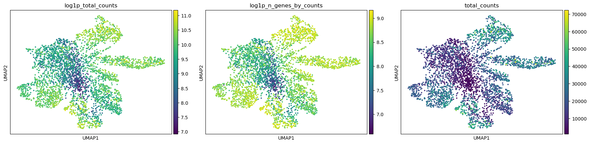
>
> 1. What type of similarity defines the neighbour graph used for the displayed UMAP?
> 2. What relationship between count depth and the embeddings is visible in the displayed PCA and UMAP panels?
> 3. Does proximity on UMAP mean two spots are physically adjacent in the tissue?
>
> > <solution-title></solution-title>
> >
> > 1. Similarity of gene-expression profiles in PCA space.
> > 2. Count depth follows part of the structure, especially in some separated regions, so it may contribute to the embedding. This is a reason to compare the result with spatial QC and ranked genes, not proof that the pattern is purely technical. The reference run keeps the normalised data without regression; Scanpy also warns that `regress_out` can overcorrect in some settings.
> > 3. No. UMAP reflects transcriptomic similarity. Physical adjacency is calculated later from spatial coordinates.
> >
> {: .solution}
>
{: .question}

# Multi-resolution Leiden clustering

Leiden clustering groups spots that have similar expression profiles in the transcriptomic neighbour graph. The resolution parameter controls how finely the graph is divided: lower values usually produce fewer, broader groups, whereas higher values produce more, smaller groups.

Run Leiden at resolutions `0.4`, `0.8`, and `1.2` and save each result under a different observation key. Comparing the three results helps determine whether the main expression patterns remain stable or split into smaller groups as the resolution increases.

> <hands-on-title>Run three Leiden resolutions</hands-on-title>
>
> 1. Run  with the following parameters:
>    -  *"Annotated data matrix"*: `Breast cancer UMAP`
>    - *"Method used"*: `Cluster cells into subgroups, using 'tl.leiden'`
>    - *"Coarseness of the clusterin"*: `0.4`
>    - *"Key under which to add the cluster labels"*: `leiden_res_0.4`
>    - *"How many iterations of the Leiden clustering algorithm to perform."*: `2`
>
> 2. Run  with the following parameters:
>    -  *"Annotated data matrix"*: `The output of step 1`
>    - *"Method used"*: `Cluster cells into subgroups, using 'tl.leiden'`
>    - *"Coarseness of the clusterin"*: `0.8`
>    - *"Key under which to add the cluster labels"*: `leiden_res_0.8`
>    - *"How many iterations of the Leiden clustering algorithm to perform."*: `2`
>
> 3. Run  with the following parameters:
>    -  *"Annotated data matrix"*: `The output of step 2`
>    - *"Method used"*: `Cluster cells into subgroups, using 'tl.leiden'`
>    - *"Coarseness of the clusterin"*: `1.2`
>    - *"Key under which to add the cluster labels"*: `leiden_res_1.2`
>    - *"How many iterations of the Leiden clustering algorithm to perform."*: `2`
>
>    Rename the final output `AnnData with Leiden comparison`.
>
{: .hands_on}

> <hands-on-title>Compare the resolutions</hands-on-title>
>
> 1. Run  with the following parameters:
>    -  *"Annotated data matrix"*: `AnnData with Leiden comparison`
>    - *"Method used for plotting"*: `Embeddings: Scatter plot in UMAP basis, using 'pl.umap'`
>    - *"Keys for annotations of observations/cells or variables/genes"*: `leiden_res_0.4,leiden_res_0.8,leiden_res_1.2`
>
> 2. Count the groups in each panel: the reference run contains 9 groups at `0.4`, 10 at `0.8`, and 13 at `1.2`.
> 3. Compare which UMAP branches are merged at `0.4` and which are divided at `1.2`.
> 4. Use `leiden_res_0.8` for the remaining reference analysis. It gives an intermediate partition, but the ranked genes and spatial results must still be checked before assigning biological descriptions.
>
{: .hands_on}

> <question-title>Compare the Leiden-resolution outputs</question-title>
>
> 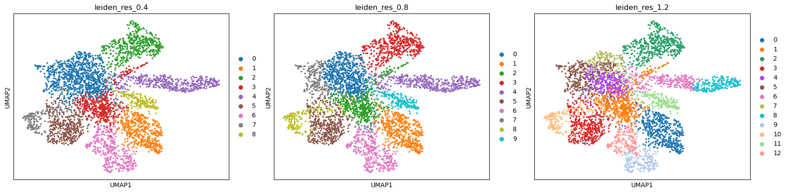
>
> 1. Which signs in the displayed panels could suggest under-clustering at a coarse resolution?
> 2. Which signs suggest over-clustering at a fine resolution?
> 3. Does selecting `leiden_res_0.8` prove that the tissue contains exactly 10 biological compartments?
>
> > <solution-title></solution-title>
> >
> > 1. Distinct expression programmes or spatial regions may remain merged.
> > 2. Tiny or unstable groups, redundant markers, or separation driven mostly by QC variables may indicate over-clustering.
> > 3. No. The 10 labels are an analytical partition that must be interpreted with marker, spatial, morphological, and QC evidence.
> >
> {: .solution}
>
{: .question}

# Interpret ranked genes

Ranked genes show which genes distinguish each Leiden group from the remaining spots. Examine several related genes for each group and compare their expression with the group's position in the tissue section. Because a Visium spot can contain several cells, these results describe expression patterns within groups of spots rather than pure cell types.

> <hands-on-title>Rank and inspect marker genes for every Leiden group</hands-on-title>
>
> 1. Run  with the following parameters:
>    -  *"Annotated data matrix"*: `AnnData with Leiden comparison`
>    - *"Method used for inspecting"*: `Rank genes for characterizing groups, using 'tl.rank_genes_groups'`
>    - *"The key of the observations grouping to consider"*: `leiden_res_0.8`
>    - *"Get ranked genes as a Tabular file?"*: `True`
>    - *"Method"*: `Wilcoxon-Rank-Sum`
>
> 2. Run  with the following parameters:
>    -  *"Annotated data matrix"*: The output of step 1
>    - *"Method used for plotting"*: `Marker genes: Plot ranking of genes using dotplot plot, using 'pl.rank_genes_groups'`
>
>    Rename the AnnData output `AnnData with markers` and the table `Ranked marker genes`.
>
{: .hands_on}

# Squidpy spatial analysis

Squidpy constructs a separate spatial-neighbour graph from the Visium spot coordinates . This graph is distinct from the transcriptomic neighbour graph used for Leiden clustering and UMAP. The later centrality and neighbourhood-enrichment analyses for this step use leiden_res_0.8 as the grouping key.

> <hands-on-title>Construct the Visium spatial-neighbour graph</hands-on-title>
>
> 1. Run  with the following parameters:
>    -  *"spatial object (in SpatialData or AnnData format)"*: `AnnData with markers`
>    - *"Operation"*: `Create a graph from spatial coordinates (gr.spatial_neighbors)`
>    - *"Coordinate type"*: `Grid coordinates`
>
>    Rename the output `AnnData with spatial neighbours`.
>
{: .hands_on}

This step stores the spatial-neighbour graph in the AnnData object as spatial_connectivities and spatial_distances.

> <hands-on-title>Calculate and plot Leiden-group spatial statistics</hands-on-title>
>
> 1. Run  with the following parameters:
>    -  *"spatial object (in SpatialData or AnnData format)"*: `AnnData with spatial neighbours`
>    - *"Operation"*: `Compute centrality scores per cluster or cell type (gr.centrality_scores)`
>    - *"Key in adata.obs where clustering is stored"*: `leiden_res_0.8`
>
> 2. Run  with the following parameters:
>    -  *"spatial object (in SpatialData or AnnData format)"*: the centrality output from step 1
>    - *"Operation"*: `Plot centrality scores (pl.centrality_scores)`
>    - *"Key in adata.obs where clustering is stored"*: `leiden_res_0.8`
>
> 3. Run  with the following parameters:
>    -  *"spatial object (in SpatialData or AnnData format)"*: the centrality output from step 1
>    - *"Operation"*: `Compute neighborhood enrichment by permutation test (gr.nhood_enrichment)`
>    - *"Key in adata.obs where clustering is stored"*: `leiden_res_0.8`
>    Rename output to `AnnData with neighbourhood enrichment`.
>
> 4. Run  with the following parameters:
>    -  *"spatial object (in SpatialData or AnnData format)"*: the neighbourhood-enrichment output from step 3
>    - *"Operation"*: `Plot neighborhood enrichment (pl.nhood_enrichment)`
>    - *"Key in adata.obs where clustering is stored"*: `leiden_res_0.8`
>
>
{: .hands_on}

> <hands-on-title>Calculate Moran's I</hands-on-title>
>
> 1. Run  with the following parameters:
>    -  *"spatial object (in SpatialData or AnnData format)"*: `AnnData with neighbourhood enrichment`
>    - *"Operation"*: `Calculate Global Autocorrelation Statistic (Moran’s I or Geary's C) (gr.spatial_autocorr)`
>
>    Rename the output `AnnData with Squidpy results`.
>
{: .hands_on}

> <question-title>Interpret the Squidpy spatial-graph summaries</question-title>
>
> 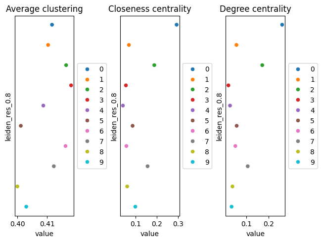
>
> 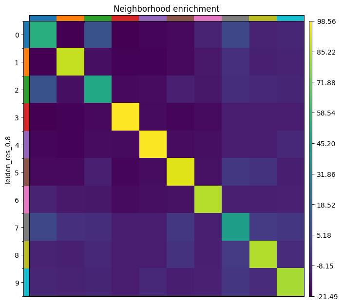
>
> 1. Which Leiden group has the highest closeness-centrality and degree-centrality scores in the displayed centrality plot?
> 2. What does a high degree-centrality score describe, and what does it not establish?
> 3. What does a strong positive value on the diagonal of the neighbourhood-enrichment heatmap indicate?
> 4. What does a positive off-diagonal z-score indicate?
>
> > <solution-title></solution-title>
> >
> > 1. Group `0` has the highest closeness-centrality and degree-centrality scores.
> > 2. A high degree-centrality score indicates that members of the group have a high fraction of spatial-graph connections to spots outside that group. It does not establish biological importance, signalling activity, or clinical relevance.
> > 3. Spots assigned to the same Leiden group are adjacent more often than expected after permuting the group labels.
> > 4. Spots from two different Leiden groups are adjacent more often than expected under the permutation model. This identifies enriched spatial adjacency, but it does not demonstrate cell–cell communication or a biological interaction.
> >
> {: .solution}
>
{: .question}

# CellTypist as a reference check

CellTypist compares each input profile with labels learned from a single-cell reference . The selected `Cells_Adult_Breast` model contains 58 reference labels and was built from the Human Breast Cell Atlas  .

> <hands-on-title>Annotate spots with CellTypist</hands-on-title>
>
> 1. Run  with the following parameters:
>    -  *"Input AnnData file"*: `AnnData with Squidpy results`
>    - *"Choose CellTypist model"*: `cell types from the adult human breast (v1)`
>    - *"Refine the predicted labels by running the majority voting classifier after over-clustering"*: `Yes`
>    - *"Generate a dotplot of the predicted cell types"*: `Yes`
>        - *"Reference column in AnnData.obs for dotplot"*: `leiden_res_0.8`
>
>    Rename the AnnData output `CellTypist-annotated breast cancer AnnData`.
>
{: .hands_on}

CellTypist chooses the best matching reference label for each input profile, and majority voting refines labels within local groups . Here, `LummHR-SCGB` is the main match for groups `8`, `4`, `3`, `9`, `6`, and `5`, whereas `plasma_IgG` is more prominent in groups `7`, `0`, `2`, and `1`.

> <question-title>Interpret the CellTypist output</question-title>
>
> 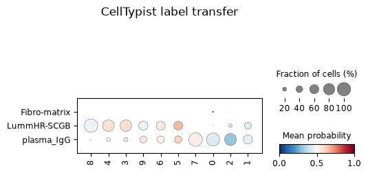
>
> 1. What do dot size and dot colour represent?
> 2. What does the large blue `plasma_IgG` dot for group `2` indicate?
> 3. Why should these labels be treated as a reference check rather than definitive cell-type identities?
>
> > <solution-title></solution-title>
> >
> > 1. Dot size shows the fraction of spots in a Leiden group assigned to the reference label. Colour shows the mean prediction probability.
> > 2. A large fraction of group `2` spots received the `plasma_IgG` label, but the low mean probability indicates weak support for that assignment.
> > 3. Each Visium spot can contain several cells, whereas CellTypist assigns labels learned from single-cell profiles. The assignments should therefore be compared with ranked genes, tissue position, and morphology before naming a Leiden group.
> >
> {: .solution}
>
{: .question}

# LIANA ligand-receptor rankings between Leiden groups

LIANA integrates several scoring approaches and curated ligand-receptor resources  . In this analysis, the source and target categories are the `leiden_res_0.8` groups, not purified cell populations.

> <hands-on-title>Rank ligand-receptor pairs between Leiden groups</hands-on-title>
>
> 1. Run  with the following parameters:
>    -  *"Annotated data matrix"*: `CellTypist-annotated breast cancer AnnData`
>    - *"Method for ligand-receptor inference"*: `Aggregate ligand-receptor scores from multiple methods (rank_aggregate)`
>    - *"Group By"*: `leiden_res_0.8`
>    - *"Resource source"*: `Download from LIANA API`
>    - *"Use raw counts"*: `No`
>
>    Rename the output `LIANA breast cancer AnnData`.
>
>
{: .hands_on}

> <question-title></question-title>
>
> Which evidence combination provides the strongest basis for prioritising a LIANA result?
>
> A. A high LIANA rank alone.
>
> B. Ligand and receptor expression, spatial adjacency of the relevant Leiden groups, coherent markers, literature support, and reproduction in another sample.
>
> C. Detection of either gene anywhere in the matrix.
>
> > <solution-title></solution-title>
> >
> > **B**. LIANA ranks expression-based hypotheses. Convergent expression, spatial, biological, and reproducibility evidence is needed before a pair becomes a strong prospective target.
> >
> {: .solution}
>
{: .question}

# Return the processed table to SpatialData

> <hands-on-title>Create the final processed SpatialData object</hands-on-title>
>
> 1. Run  with the following parameters:
>    -  *"SpatialData object"*: `V1_Breast_Cancer_Block_A_Section_1.spatialdata.zip`
>    - *"Operation"*: `Import anndata table to a SpatialData object`
>    -  *"annotated data object to add"*: `LIANA breast cancer AnnData`
>    - *"Table name"*: `table_processed`
>
>    Rename the output `Validated breast cancer SpatialData`.
>
{: .hands_on}

# Conclusion

This tutorial analysed a prepared SpatialData object derived from the 10x Genomics Human Breast Cancer, Block A Section 1 Visium dataset. The AnnData table was exported, quality-control metrics were examined before and after filtering, expression values were normalised and log-transformed, and 3,000 highly variable genes were selected for PCA, transcriptomic-neighbour construction, and UMAP.

Leiden clustering at resolutions `0.4`, `0.8`, and `1.2` produced 9, 10, and 13 groups, respectively. Resolution `0.8` was retained as an intermediate partition for marker ranking and downstream spatial analysis. The resulting groups remain analytical partitions rather than confirmed cell types or tissue compartments.

Ranked genes were used to compare expression programmes among the groups. Squidpy then summarised their spatial connectivity, neighbourhood enrichment, and spatially structured gene expression. CellTypist returned three adult-breast reference matches, which were treated as supporting evidence for mixed Visium spots rather than definitive cell identities. LIANA ranked candidate ligand–receptor relationships between Leiden groups, but these rankings do not establish cell–cell signalling.

Finally, the processed AnnData table was added back to the SpatialData object alongside the original tissue image, capture-spot shapes, and coordinate system.

> <comment-title>Volume or area filtering</comment-title>
>
> The general workflow includes optional volume- and area-based filtering for assays with segmented cells or nuclei. This Visium dataset contains capture spots and does not provide those measurements, so these branches were not used.
>
{: .comment}
