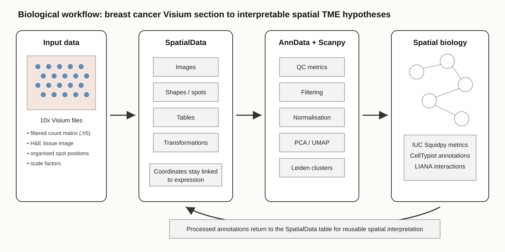
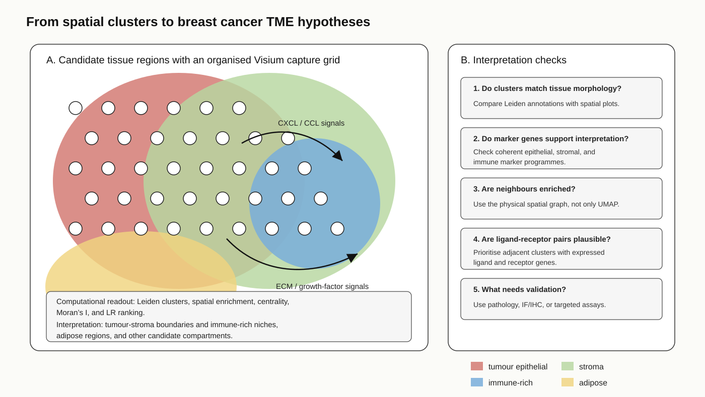
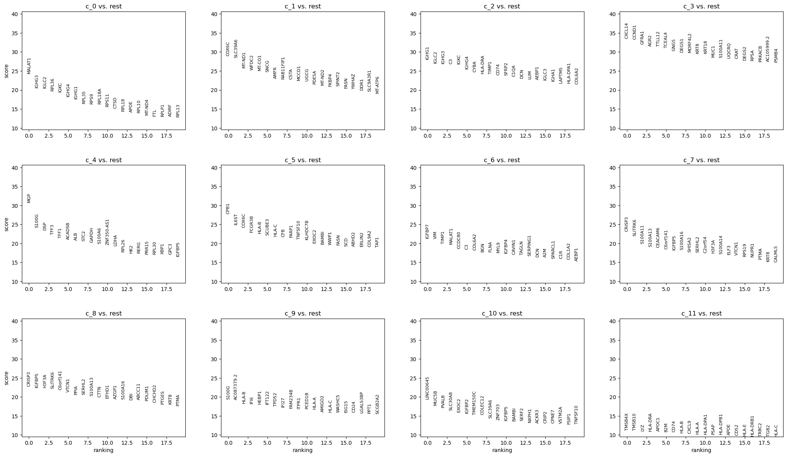

Breast cancers are spatially heterogeneous tissues containing malignant epithelial cells, fibroblasts, immune populations, vascular cells, adipose tissue, and extracellular matrix  . The abundance, state, and spatial organisation of these components can influence tumour growth, immune infiltration, invasion, and treatment response  . Spatial transcriptomics measures gene expression while preserving the position of each observation, allowing molecular programmes to be examined in relation to neighbouring tissue structures and histological morphology rather than being collapsed into a bulk average  .

This tutorial uses the public 10x Genomics **Human Breast Cancer, Block A Section 1** Visium dataset, distributed in the `BreastCancer1.zip` archive on Zenodo  . The source sample is described as fresh-frozen invasive ductal carcinoma, AJCC/UICC Stage Group IIA, ER positive, PR negative, and HER2 positive. The imported expression matrix contains **3,813 Visium capture spots and 33,538 genes**. 

## Relationship to the HisHRST paper

The same Zenodo record accompanied the study **Geometry-informed multimodal fusion network for enhancing high-density spatial transcriptomics from histology images** . That study introduced **HisHRST**, a deep-learning approach combining histological image features and spatial-coordinate information to predict gene-expression profiles at locations that were not experimentally measured. The breast cancer section was one of several public datasets used to assess high-density expression prediction and preservation of spatial expression patterns.

This Galaxy tutorial is complementary to, rather than a reproduction of, HisHRST. It starts from a vendor-filtered Visium feature-barcode matrix together with tissue images, spot positions, and scale factors, and generates:

- spot- and gene-level QC summaries;
- a filtered and normalised AnnData object;
- 3,000 highly variable genes;
- PCA, a transcriptomic nearest-neighbour graph, and UMAP;
- Leiden clusterings at three representative resolutions followed by learner-guided comparison;
- ranked marker genes for candidate spatial transcriptional clusters;
- Squidpy spatial neighbours, centrality, neighbourhood enrichment, and Moran's I;
- CellTypist dominant breast cell-type annotations;
- LIANA candidate ligand-receptor relationships between spatial clusters; and
- a processed table returned to the SpatialData object.

> <warning-title>Prospective findings, not experimentally validated targets</warning-title>
>
> No wet-lab validation is performed in this tutorial. Marker genes, spatially autocorrelated genes, CellTypist signatures, and ligand-receptor pairs must therefore be presented as **prospective follow-up targets or hypotheses**. They do not prove a mechanism, clinical biomarker, therapeutic target, or direct cell-cell signalling event.
>
{: .warning}



> <agenda-title></agenda-title>
>
> In this tutorial, we will cover:
>
> 1. TOC
> {:toc}
>
{: .agenda}

# Analysis strategy

The analysis uses two different definitions of neighbourhood:

1. A **transcriptomic neighbour graph**, built from PCA coordinates, connects spots with similar expression profiles. Scanpy uses this graph for Leiden clustering and UMAP visualisation.
2. A **spatial neighbour graph**, built from physical spot coordinates, connects observations that are close in the tissue. Squidpy uses this graph for spatial statistics.

In this tutorial, a **spatial cluster** is a group of Visium spots sharing a Leiden label. The term **spatial domain** is used only when that cluster also forms a coherent or recurrent region in the tissue and is supported by marker genes, morphology, QC, or spatial statistics. Neither term means that every spot contains one pure cell type.


The workflow screenshot above shows the actual implemented Galaxy workflow. The conceptual diagram below summarises the same analytical route for learners.



| Analysis group | Purpose | Main output |
| --- | --- | --- |
| SpatialData input | Link expression, the organised spot grid, images, and coordinate systems. | SpatialData archive and AnnData table. |
| Scanpy filtering and HVG selection | Audit data quality, filter low-information spots and genes, normalise, log-transform, and identify variable genes. | QC metrics, filtered AnnData, counts layer, and HVG annotation. |
| Scanpy clustering | Reduce dimensionality and construct the expression-neighbour graph. | PCA, neighbours, and UMAP. |
| Leiden comparison | Run three representative resolutions and compare their granularity. | Three Leiden columns and a selected resolution. |
| Squidpy | Analyse physical tissue neighbourhoods and spatially patterned genes. | Spatial graph, centrality, enrichment, and Moran's I. |
| CellTypist | Compare spot expression with an adult human breast reference. | Predicted annotations, majority voting, and confidence scores. |
| LIANA | Rank putative ligand-receptor relationships between spatial clusters. | Candidate cluster-to-cluster LR interactions. |
| SpatialData output | Return processed results to the spatial container. | Reusable processed SpatialData object. |

> <question-title></question-title>
>
> 1. What is the main analytical difference between HisHRST and this tutorial?
> 2. Why should a Leiden cluster not immediately be called a cell type or histopathological compartment?
>
> > <solution-title></solution-title>
> >
> > 1. HisHRST predicts expression at unmeasured locations from histology and spatial information. This tutorial analyses experimentally measured spots using QC, clustering, spatial statistics, reference annotation, and ligand-receptor prioritisation.
> > 2. Leiden is run on an expression-derived graph, and a Visium spot can contain RNA from several cells. Biological interpretation requires marker, spatial, morphological, and QC evidence.
> >
> {: .solution}
>
{: .question}

# Get the Visium breast cancer data

> <hands-on-title>Upload and extract the Visium archive</hands-on-title>
>
> 1. Create a new Galaxy history and name it `EISTA breast cancer spatial transcriptomics`.
>
>    
>
>    
>
> 2. Import the archive from [Zenodo]({{ page.zenodo_link }}):
>
>    ```
>    {{ page.zenodo_link }}/files/BreastCancer1.zip
>    ```
>
>    
>
> 3. Run  with:
>    -  *"Input file"*: `BreastCancer1.zip`
>
>    The tool creates a collection containing the archive members. Use these six files directly; renaming them is not required:
>
>    - `V1_Breast_Cancer_Block_A_Section_1_filtered_feature_bc_matrix.h5`
>    - `V1_Breast_Cancer_Block_A_Section_1_image.tif`
>    - `scalefactors_json.json`
>    - `tissue_hires_image.png`
>    - `tissue_lowres_image.png`
>    - `tissue_positions_list.csv`
>
{: .hands_on}

> <tip-title>Keep history outputs identifiable</tip-title>
>
> Rename outputs as instructed throughout the tutorial so that later tool inputs are easy to recognise. The following FAQ shows how to rename a Galaxy dataset; the same interface pattern is used throughout the lesson.
>
> 
>
{: .tip}

> <comment-title>These are processed Visium inputs</comment-title>
>
> The HDF5 file is the 10x Genomics **filtered feature-barcode matrix**. It contains measured counts for barcodes retained by the vendor pipeline; it is not raw sequencing data and should not be treated as a raw matrix.
>
{: .comment}

# Build the SpatialData object

SpatialData stores images, geometries, coordinate transformations, and annotated expression tables in one linked object . The descriptive identifier `V1_Breast_Cancer_Block_A_Section_1` is used for the experiment instead of the generic default `Galaxy`.

> <hands-on-title>Construct SpatialData from the Visium files</hands-on-title>
>
> 1. Run  with:
>    - *"Spatial Technology"*: `10x Genomics Visium`
>    - *"Dataset identifier to name the constructed SpatialData elements"*: `V1_Breast_Cancer_Block_A_Section_1`
>    -  *"feature BC matrix (Counts file)"*: `V1_Breast_Cancer_Block_A_Section_1_filtered_feature_bc_matrix.h5`
>    -  *"Scale factors file"*: `scalefactors_json.json`
>    -  *"Full resolution image"*: `V1_Breast_Cancer_Block_A_Section_1_image.tif`
>    -  *"Tissue high resolution image"*: `tissue_hires_image.png`
>    -  *"Tissue low resolution image"*: `tissue_lowres_image.png`
>    -  *"Tissue positions file"*: `tissue_positions_list.csv`
>
>    Rename the output `Breast cancer SpatialData`.
>
{: .hands_on}

The object should contain approximately:

```text
SpatialData object
├── Images
│   ├── V1_Breast_Cancer_Block_A_Section_1_full_image
│   ├── V1_Breast_Cancer_Block_A_Section_1_hires_image
│   └── V1_Breast_Cancer_Block_A_Section_1_lowres_image
├── Shapes
│   └── V1_Breast_Cancer_Block_A_Section_1    (3,813 spots)
└── Tables
    └── table                                 (3,813 × 33,538)
```

> <question-title></question-title>
>
> What do the 3,813 observations and 33,538 variables represent?
>
> > <solution-title></solution-title>
> >
> > The observations are Visium capture spots and the variables are genes.
> >
> {: .solution}
>
{: .question}

# Extract the expression table

The Scanpy tools operate on AnnData. We will export the `table` element while keeping the original SpatialData object for spatial plotting and the final re-import step.

> <hands-on-title>Export the AnnData table</hands-on-title>
>
> 1. Run  with:
>    -  *"SpatialData object"*: `Breast cancer SpatialData`
>    - *"Operation"*: `Export the table of a SpatialData object to anndata`
>
>    Rename the AnnData output `Breast cancer input AnnData`.
>
{: .hands_on}

# Scanpy filtering and highly variable gene selection

## Calculate QC metrics before filtering

`total_counts` measures the number of transcripts observed in a spot, while `n_genes_by_counts` measures expression complexity. The `pct_counts_in_top_N_genes` metrics reveal whether a small number of highly expressed genes dominates a spot.

> <hands-on-title>Calculate and visualise pre-filter QC metrics</hands-on-title>
>
> 1. Run  with:
>    -  *"Annotated data matrix"*: `Breast cancer input AnnData`
>    - *"Proportions of top genes to cover"*: `50,100,200,300`
>
>    Rename the output `QC metrics before filtering`.
>
> 2. Run :
>    -  *"Annotated data matrix"*: `QC metrics before filtering`
>
>    Record `n_obs = 3813` and `n_vars = 33538` as the starting dimensions.
>
> 3. Run  with:
>    -  *"Annotated data matrix"*: `QC metrics before filtering`
>    - *"x coordinate"*: `total_counts`
>    - *"y coordinate"*: `n_genes_by_counts`
>    - *"Color by"*: `pct_counts_in_top_50_genes`
>
> 4. Rerun  with:
>    -  *"Annotated data matrix"*: `QC metrics before filtering`
>    - *"Method used for plotting"*: `Generic: Violin plot, using 'pl.violin'`
>    - *"Keys for accessing variables"*: `Subset of variables in 'adata.var_names' or fields of '.obs'`
>        - *"Keys for accessing variables"*: `n_genes_by_counts`
>    - *"Size of the jitter points"*: `0.4`
>
> 5. Rerun  with the same settings, changing:
>    - *"Keys for accessing variables"*: `total_counts`
>
{: .hands_on}

> <hands-on-title>Map the QC metrics back onto the tissue</hands-on-title>
>
> 1. Run  with:
>    -  *"SpatialData object"*: `Breast cancer SpatialData`
>    - *"Operation"*: `Import anndata table to a SpatialData object`
>    -  *"annotated data object to add"*: `QC metrics before filtering`
>    - *"Table name"*: `table_qc`
>
> 2. Run  with:
>    -  *"SpatialData object"*: the output from step 1
>    - In *"Render Images"*:
>        - *"Image element name"*: `V1_Breast_Cancer_Block_A_Section_1_hires_image`
>    - In *"Render Shapes"*:
>        - *"Shapes element name"*: `V1_Breast_Cancer_Block_A_Section_1`
>        - *"Color column"*: `total_counts`
>        - *"Table name"*: `table_qc`
>    - In *"Plot Display Parameters"*:
>        - *"Coordinate system(s)"*: `V1_Breast_Cancer_Block_A_Section_1`
>    - *"Image format"*: `PNG`
>
> 3. Rerun  with the same settings, changing:
>    - *"Color column"*: `n_genes_by_counts`
>
{: .hands_on}

> <question-title>Inspect the pre-filter QC outputs</question-title>
>
> 
>
> 
>
> 1. In the displayed QC plots, where is the low-count and low-complexity tail?
> 2. What might spots in that tail represent?
> 3. Why should those spots be checked on the spatial maps before they are discarded?
>
> > <solution-title></solution-title>
> >
> > 1. The low-information tail appears at the lower end of the violin distributions and in the lower-left region of the `total_counts` versus `n_genes_by_counts` scatter plot.
> > 2. Those spots may represent poorly captured or damaged regions, edge spots, or genuinely low-RNA tissue.
> > 3. Low counts can coincide with real tissue compartments such as adipose or necrotic regions. The spatial maps help distinguish technical failure from plausible biology.
> >
> {: .solution}
>
{: .question}

## Filter spots and genes

The thresholds below were validated for this section. They are not universal defaults. The upper limit of 75,000 counts is a permissive guardrail based on the observed distribution; it removed no spots in the reference run.

> <hands-on-title>Apply the validated QC filters and record dimensions</hands-on-title>
>
> Run six  jobs in sequence, always using the AnnData output of the previous job.
>
> 1. Run  with:
>    -  *"Annotated data matrix"*: `QC metrics before filtering`
>    - *"Filter"*: `Minimum number of genes expressed`
>    - *"Minimum number of genes expressed required for a cell to pass filtering"*: `500`
>
> 2. Rerun  with:
>    -  *"Annotated data matrix"*: the AnnData output from step 1
>    - *"Filter"*: `Minimum number of counts`
>    - *"Minimum number of counts required for a cell to pass filtering"*: `1000`
>
> 3. Rerun  with:
>    -  *"Annotated data matrix"*: the AnnData output from step 2
>    - *"Method used for filtering"*: `Filter genes based on number of cells or counts, using 'pp.filter_genes'`
>    - *"Filter"*: `Minimum number of cells expressed`
>    - *"Minimum number of cells expressed required for a gene to pass filtering"*: `3`
>
> 4. Rerun  with:
>    -  *"Annotated data matrix"*: the AnnData output from step 3
>    - *"Filter"*: `Minimum number of counts`
>    - *"Minimum number of counts required for a gene to pass filtering"*: `3`
>
> 5. Rerun  with:
>    -  *"Annotated data matrix"*: the AnnData output from step 4
>    - *"Method used for filtering"*: `Filter cell outliers based on counts and numbers of genes expressed, using 'pp.filter_cells'`
>    - *"Filter"*: `Maximum number of counts`
>    - *"Maximum number of counts required for a cell to pass filtering"*: `75000`
>
> 6. Rerun  with:
>    -  *"Annotated data matrix"*: the AnnData output from step 5
>    - *"Filter"*: `Maximum number of genes expressed`
>    - *"Maximum number of genes expressed required for a cell to pass filtering"*: `10000`
>
> After steps 2, 4, and 6, run  with:
>    -  *"Annotated data matrix"*: the relevant Scanpy filter output
>
> Record `n_obs` and `n_vars` in a small table.
>
> Rename the final output `Filtered breast cancer AnnData`.
>
{: .hands_on}

The reference execution changed the object as follows:

| Stage | Spots (`n_obs`) | Genes (`n_vars`) |
| --- | ---: | ---: |
| Before filtering | 3,813 | 33,538 |
| After the minimum spot filters | 3,800 | 33,538 |
| After the gene filters | 3,800 | 20,687 |
| After the upper spot filters | 3,800 | 20,687 |

> <hands-on-title>Recalculate and map QC after filtering</hands-on-title>
>
> 1. Rerun , changing:
>    -  *"Annotated data matrix"*: `Filtered breast cancer AnnData`
>
> 2. Rerun the three  jobs from the pre-filter QC section, using the filtered QC output as *"Annotated data matrix"*.
> 3. Run  with:
>    -  *"SpatialData object"*: `Breast cancer SpatialData`
>    - *"Operation"*: `Import anndata table to a SpatialData object`
>    -  *"annotated data object to add"*: the filtered QC AnnData output from step 1
>    - *"Table name"*: `table_qc_filtered`
>
> 4. Rerun the two  jobs from the pre-filter spatial-QC section, changing:
>    -  *"SpatialData object"*: the output from step 3
>    - *"Table name"*: `table_qc_filtered`
>
> Rename the AnnData output `QC metrics after filtering`.
>
{: .hands_on}

> <question-title>Inspect the post-filter QC outputs</question-title>
>
> 
>
> 
>
> 1. How many spots and genes were removed?
> 2. What percentage of spots was retained?
> 3. Comparing the displayed pre- and post-filter outputs, did the upper thresholds affect the reference run or remove a coherent tissue region?
>
> > <solution-title></solution-title>
> >
> > 1. Thirteen spots and 12,851 genes were removed.
> > 2. Approximately 99.66% of spots were retained: `3800 / 3813 × 100`.
> > 3. No. The 75,000-count and 10,000-gene limits removed no additional spots, and the post-filter spatial maps do not show loss of a coherent tissue region. These thresholds are safeguards for this dataset, not generally recommended Visium defaults.
> >
> {: .solution}
>
{: .question}

## Preserve counts, normalise, and select HVGs

The unmodified count matrix is copied to `layers['counts']` before normalisation. The working matrix is then normalised to the same total per spot and log-transformed. Highly variable gene selection focuses downstream structure on genes that vary more than expected across observations.

> <hands-on-title>Preserve counts and normalise expression</hands-on-title>
>
> 1. Run  with:
>    -  *"Annotated data matrix"*: `QC metrics after filtering`
>    - *"Function to manipulate the object"*: `Copy layers from a different anndata object`
>    -  *"Source anndata object"*: `QC metrics after filtering`
>    - In *"Layers to copy"*:
>        - *"Layer to be copied from the source anndata"*: `X`
>        - *"Target layer name"*: `counts`
>
>    Rename the output `Filtered AnnData with counts layer`.
>
>
> 2. Run  with:
>    -  *"Annotated data matrix"*: `Filtered AnnData with counts layer`
>    - *"Target sum"*: `10000.0`
>
> 3. Run  with:
>    -  *"Annotated data matrix"*: the normalised AnnData output from step 2
>    - *"Method used for inspecting"*: `Logarithmize the data matrix, using 'pp.log1p'`
>
>    Rename the output `Log-normalised breast cancer AnnData`.
>
>
{: .hands_on}

> <hands-on-title>Select 3,000 highly variable genes</hands-on-title>
>
> 1. Run  with:
>    -  *"Annotated data matrix"*: `Log-normalised breast cancer AnnData`
>    - *"Method used for filtering"*: `Annotate (and filter) highly variable genes, using 'pp.highly_variable_genes'`
>    - *"Choose the flavor for identifying highly variable genes"*: `Cell Ranger` (the Scanpy flavour; this does not run Cell Ranger)
>    - *"Number of highly-variable genes to keep"*: `3000`
>
>    Rename the output `Breast cancer AnnData with HVGs`.
>
>
> 2. Run  with:
>    -  *"Annotated data matrix"*: `Breast cancer AnnData with HVGs`
>    - *"Method used for plotting"*: `Preprocessing: Plot dispersions versus means for genes, using 'pl.highly_variable_genes'`
>
{: .hands_on}

> <question-title>Interpret the highly-variable-gene output</question-title>
>
> 
>
> 1. What does the displayed plot show about how the selected HVGs differ from other genes with similar mean expression?
> 2. Why preserve a `counts` layer before normalisation?
> 3. Does selecting 3,000 HVGs mean the other genes are biologically unimportant?
> 4. Why is no batch key supplied?
>
> > <solution-title></solution-title>
> >
> > 1. The selected genes show stronger variability than expected for genes at a similar average expression level, making them useful for modelling structure in this dataset.
> > 2. It preserves the integer-like measured counts for later methods or reprocessing while the working matrix is transformed.
> > 3. No. HVG selection chooses genes that are most useful for modelling variation and neighbourhood structure; non-HVG genes remain available for marker interpretation and other analyses.
> > 4. This tutorial analyses one tissue section and no batch annotation is supplied. A batch key is only appropriate when meaningful batch groups exist.
> >
> {: .solution}
>
{: .question}

# Scanpy dimensionality reduction and clustering

## PCA, transcriptomic neighbours, and UMAP

PCA compresses correlated gene-expression patterns into orthogonal components. The k-nearest-neighbour graph then links spots with similar PCA coordinates. UMAP provides a two-dimensional visualisation of this graph; it is useful for exploration but should not be interpreted as a physical tissue map .

> <hands-on-title>Generate PCA and inspect technical covariates</hands-on-title>
>
> 1. Run  with:
>    -  *"Annotated data matrix"*: `Breast cancer AnnData with HVGs`
>    - *"Method used"*: `Computes PCA (principal component analysis) coordinates, loadings and variance decomposition, using 'pp.pca'`
>
>    Rename the output `Breast cancer PCA`.
>
>
> 2. Run  with:
>    -  *"Annotated data matrix"*: `Breast cancer PCA`
>    - *"Method used for plotting"*: `PCA: Scatter plot in PCA coordinates, using 'pl.pca'`
>    - *"Keys for annotations of observations/cells or variables/genes"*: `log1p_total_counts,log1p_n_genes_by_counts,total_counts`
>
{: .hands_on}

> <hands-on-title>Build the transcriptomic graph and UMAP</hands-on-title>
>
> 1. Run  with:
>    -  *"Annotated data matrix"*: `Breast cancer PCA`
>    - *"Method used for inspecting"*: `Compute a neighborhood graph of observations, using 'pp.neighbors'`
>
>    Rename the output `Breast cancer transcriptomic neighbours`.
>
>
> 2. Run  with:
>    -  *"Annotated data matrix"*: `Breast cancer transcriptomic neighbours`
>    - *"Method used"*: `Embed the neighborhood graph using UMAP, using 'tl.umap'`
>
>    Rename the output `Breast cancer UMAP`.
>
>
> 3. Run  with:
>    -  *"Annotated data matrix"*: `Breast cancer UMAP`
>    - *"Method used for plotting"*: `Embeddings: Scatter plot in UMAP basis, using 'pl.umap'`
>    - *"Keys for annotations of observations/cells or variables/genes"*: `log1p_total_counts,log1p_n_genes_by_counts`
>
{: .hands_on}

> <question-title>Inspect the PCA and UMAP outputs</question-title>
>
> 
>
> 
>
> 1. What type of similarity defines the neighbour graph used for the displayed UMAP?
> 2. In the displayed PCA and UMAP panels, what would it suggest if separation closely followed `total_counts`?
> 3. Does proximity on UMAP mean two spots are physically adjacent in the tissue?
>
> > <solution-title></solution-title>
> >
> > 1. Similarity of gene-expression profiles in PCA space.
> > 2. Sequencing depth may be contributing to the inferred structure. Recheck QC, normalisation, spatial patterns, and later marker results. Do not automatically regress out `total_counts`: it can also reflect real tissue composition, and regression was not used in the validated run.
> > 3. No. UMAP reflects transcriptomic similarity. Physical adjacency is calculated later from spatial coordinates.
> >
> {: .solution}
>
{: .question}

# Multi-resolution Leiden clustering

Leiden clustering partitions the transcriptomic neighbour graph. Workflow-only parameter tools and collection mapping are useful for automation, but they are not directly reproducible as ordinary Galaxy history steps. For training, run Leiden three times in sequence and store each result under a distinct key.

> <hands-on-title>Run three Leiden resolutions</hands-on-title>
>
> 1. Run  with:
>    -  *"Annotated data matrix"*: `Breast cancer UMAP`
>    - *"Method used"*: `Cluster cells into subgroups, using 'tl.leiden'`
>    - *"Coarseness of the clusterin"*: `0.4`
>    - *"Key under which to add the cluster labels"*: `leiden_res_0.4`
>    - *"How many iterations of the Leiden clustering algorithm to perform."*: `2`
>
> 2. Rerun  using the output from step 1, changing:
>    - *"Coarseness of the clusterin"*: `0.8`
>    - *"Key under which to add the cluster labels"*: `leiden_res_0.8`
>
> 3. Rerun  using the output from step 2, changing:
>    - *"Coarseness of the clusterin"*: `1.0`
>    - *"Key under which to add the cluster labels"*: `leiden_res_1.0`
>
>    Rename the final output `AnnData with Leiden comparison`.
>
{: .hands_on}

> <hands-on-title>Compare the resolutions</hands-on-title>
>
> 1. Run  with:
>    -  *"Annotated data matrix"*: `AnnData with Leiden comparison`
>    - *"Method used for plotting"*: `Embeddings: Scatter plot in UMAP basis, using 'pl.umap'`
>    - *"Keys for annotations of observations/cells or variables/genes"*: `leiden_res_0.4,leiden_res_0.8,leiden_res_1.0`
>
> 2. Count the clusters in each panel and compare cluster sizes, separation, and fragmentation.
> 3. Retain `leiden_res_0.8` for the reference analysis. It produces 12 clusters, labelled `c_0` to `c_11`, and provides an intermediate granularity between `0.4` and `1.0`.
>
{: .hands_on}

> <question-title>Compare the Leiden-resolution outputs</question-title>
>
> 
>
> 1. Which signs in the displayed panels could suggest under-clustering at a coarse resolution?
> 2. Which signs suggest over-clustering at a fine resolution?
> 3. Does selecting `leiden_res_0.8` prove that the tissue contains exactly 12 biological compartments?
>
> > <solution-title></solution-title>
> >
> > 1. Distinct expression programmes or spatial regions may remain merged.
> > 2. Tiny or unstable groups, redundant markers, or separation driven mostly by QC variables may indicate over-clustering.
> > 3. No. The 12 labels are an analytical partition that must be interpreted with marker, spatial, morphological, and QC evidence.
> >
> {: .solution}
>
{: .question}

# Interpret marker genes

A **spatial cluster** is the set of spots sharing a Leiden label. A **candidate spatial domain** is a spatial cluster that also forms a coherent or recurrent tissue region. Neither is automatically a cell type.

> <hands-on-title>Rank and inspect marker genes for every cluster</hands-on-title>
>
> 1. Run  with:
>    -  *"Annotated data matrix"*: `AnnData with Leiden comparison`
>    - *"Method used for inspecting"*: `Rank genes for characterizing groups, using 'tl.rank_genes_groups'`
>    - *"The key of the observations grouping to consider"*: `leiden_res_0.8`
>    - *"Get ranked genes as a Tabular file?"*: `True`
>    - *"Method"*: `Wilcoxon-Rank-Sum`
>
> 2. Run  on the resulting AnnData:
>    - *"Method used for plotting"*: `Marker genes: Plot ranking of genes using dotplot plot, using 'pl.rank_genes_groups'`
>
> 3. Open the ranked table. For **every** cluster from `c_0` to `c_11`, retain positive genes with adjusted p-value `< 0.05` and log-fold change `> 0.5`, then record the top 10 to 20 genes.
> 4. Compare each cluster's markers with its tissue position, the H&E image, CellTypist annotations, and relevant literature. Leave weakly supported clusters descriptively labelled instead of forcing a cell-type name.
>
>    Rename the AnnData output `AnnData with markers` and the table `Ranked marker genes`.
>
{: .hands_on}

Representative patterns from the reference output include:

| Spatial cluster | Example positive markers | Cautious interpretation |
| --- | --- | --- |
| `c_0` | *IGHG3*, *IGLC2*, *IGKC*, *IGHG1* | Immunoglobulin-rich or plasma/immune-associated programme. |
| `c_5` | *SIX1*, *DDR1*, *SQLE*, *ERBB2*, *HK2*, *SPDEF* | Epithelial/tumour-associated programme. |
| `c_6` | *IGFBP7*, *VIM*, *CCDC80*, *COL6A2*, *BGN*, *MYL9*, *TAGLN*, *DCN*, *SPARCL1*, *COL1A2* | Stromal/ECM and vascular-supporting programme. |
| `c_8` | *ERBB2* enrichment | A second ERBB2-associated tumour state or compartment. |

These examples do not replace inspection of all 12 clusters; they demonstrate the level of caution expected when a spot can contain several cells.



> <question-title>Interpret the ranked-marker output</question-title>
>
> 
>
> Looking across the displayed cluster panels, why is a coherent set of markers more convincing than one familiar marker gene?
>
> > <solution-title></solution-title>
> >
> > A programme supported by several functionally related genes is less likely to be caused by ambient RNA, noise, or a broadly expressed gene. The pattern should still be checked spatially and against histology.
> >
> {: .solution}
>
{: .question}

# Squidpy spatial analysis

Squidpy uses physical spot coordinates rather than the transcriptomic UMAP graph . The IUC Squidpy tools are used below. The selected key is `leiden_res_0.8`.

> <hands-on-title>Construct the Visium spatial-neighbour graph</hands-on-title>
>
> 1. Run  with:
>    -  *"spatial object (in SpatialData or AnnData format)"*: `AnnData with markers`
>    - *"Coordinate type"*: `Grid coordinates`
>
>    Rename the output `AnnData with spatial neighbours`.
>
{: .hands_on}

A one-ring, six-neighbour graph represents the immediate neighbourhood of the organised Visium lattice. It encodes local tissue proximity, not expression similarity.

> <hands-on-title>Calculate and plot cluster-level spatial statistics</hands-on-title>
>
> 1. Rerun  with:
>    -  *"spatial object (in SpatialData or AnnData format)"*: `AnnData with spatial neighbours`
>    - *"Operation"*: `Compute centrality scores per cluster or cell type (gr.centrality_scores)`
>    - *"Key in adata.obs where clustering is stored"*: `leiden_res_0.8`
>
> 2. Run  with:
>    -  *"spatial object (in SpatialData or AnnData format)"*: the centrality output from step 1
>    - *"Operation"*: `Plot centrality scores (pl.centrality_scores)`
>    - *"Key in adata.obs where clustering is stored"*: `leiden_res_0.8`
>
> 3. Rerun  on the centrality output with:
>    - *"Operation"*: `Compute neighborhood enrichment by permutation test (gr.nhood_enrichment)`
>    - *"Key in adata.obs where clustering is stored"*: `leiden_res_0.8`
>
> 4. Run  with:
>    -  *"spatial object (in SpatialData or AnnData format)"*: the neighbourhood-enrichment output from step 3
>    - *"Key in adata.obs where clustering is stored"*: `leiden_res_0.8`
>
>    Rename the graph output `AnnData with neighbourhood enrichment`.
>
{: .hands_on}

> <hands-on-title>Calculate Moran's I</hands-on-title>
>
> 1. Rerun  with:
>    -  *"spatial object (in SpatialData or AnnData format)"*: `AnnData with neighbourhood enrichment`
>    - *"Operation"*: `Calculate Global Autocorrelation Statistic (Moran’s I or Geary's C) (gr.spatial_autocorr)`
>
>    Rename the output `AnnData with Squidpy results`.
>
{: .hands_on}

> <question-title>Interpret the Squidpy outputs</question-title>
>
> 
>
> 
>
> 1. What does a high degree-centrality score in the displayed centrality output mean, and what does it not prove?
> 2. What does a strong positive diagonal in the displayed neighbourhood-enrichment heatmap indicate?
> 3. What can a positive off-diagonal entry suggest?
> 4. Does high Moran's I show that a gene causes tumour progression?
>
> > <solution-title></solution-title>
> >
> > 1. The cluster contacts many other clusters in the spatial adjacency graph. It does not prove that the cluster is biologically dominant, drives signalling, or has clinical importance.
> > 2. Spots from the same spatial cluster occur beside one another more often than expected, supporting spatial self-association.
> > 3. Two different clusters form a recurrent spatial interface or neighbour one another more frequently than expected.
> > 4. No. Moran's I identifies spatially structured expression, not causality or function.
> >
> {: .solution}
>
{: .question}

# CellTypist annotations for dominant breast cell-type signatures

CellTypist assigns reference-based annotations to observations using a trained model  . Since a Visium spot can contain several cells, report each result as a **dominant predicted CellTypist annotation**, not a pure cell identity.

> <hands-on-title>Annotate spots with CellTypist</hands-on-title>
>
> 1. Run  with:
>    -  *"Input AnnData file"*: `AnnData with Squidpy results`
>    - *"Choose CellTypist model"*: `cell types from the adult human breast (v1)`
>    - *"Refine the predicted labels by running the majority voting classifier after over-clustering"*: `Yes`
>    - *"Generate a dotplot of the predicted cell types"*: `Yes`
>        - *"Reference column in AnnData.obs for dotplot"*: `leiden_res_0.8`
>
>    Rename the AnnData output `CellTypist-annotated breast cancer AnnData`.
>
>
> 2. Inspect `predicted_labels`, `majority_voting`, and `conf_score` in the annotated AnnData output.
>
{: .hands_on}

> <question-title>Interpret the CellTypist output</question-title>
>
> 
>
> Looking at the dot plot, why can a high-confidence CellTypist result still be incomplete for a Visium spot?
>
> > <solution-title></solution-title>
> >
> > The classifier reports the best matching reference signature, but the input profile may contain transcripts from several cell types. Confidence measures classifier certainty relative to its reference, not spot purity or complete representation of all states.
> >
> {: .solution}
>
{: .question}

# LIANA candidate ligand-receptor relationships

LIANA integrates several scoring approaches and curated ligand-receptor resources  . In this analysis the selected Leiden spatial clusters, rather than pure cell types, are the source and target groups.

> <hands-on-title>Rank spatial-cluster-to-spatial-cluster ligand-receptor hypotheses</hands-on-title>
>
> 1. Run  with:
>    -  *"Annotated data matrix"*: `CellTypist-annotated breast cancer AnnData`
>    - *"Method for ligand-receptor inference"*: `Aggregate ligand-receptor scores from multiple methods (rank_aggregate)`
>    - *"Group By"*: `leiden_res_0.8`
>    - *"Resource source"*: `Download from LIANA API`
>    - *"Use raw counts"*: `No`
>
>    Rename the output `LIANA breast cancer AnnData`.
>
>
{: .hands_on}

> <question-title></question-title>
>
> Which evidence combination provides the strongest basis for prioritising a LIANA result?
>
> A. A high LIANA rank alone.
>
> B. Ligand and receptor expression, spatial adjacency of the relevant spatial clusters, coherent markers, literature support, and reproduction in another sample.
>
> C. Detection of either gene anywhere in the matrix.
>
> > <solution-title></solution-title>
> >
> > **B**. LIANA ranks expression-based hypotheses. Convergent expression, spatial, biological, and reproducibility evidence is needed before a pair becomes a strong prospective target.
> >
> {: .solution}
>
{: .question}

# Return the processed table to SpatialData

> <hands-on-title>Create the final processed SpatialData object</hands-on-title>
>
> 1. Run  with:
>    -  *"SpatialData object"*: `Breast cancer SpatialData`
>    - *"Operation"*: `Import anndata table to a SpatialData object`
>    -  *"annotated data object to add"*: `LIANA breast cancer AnnData`
>    - *"Table name"*: `table_processed`
>
>    Rename the output `Validated breast cancer SpatialData`.
>
> 2. Confirm that the output retains:
>    - `V1_Breast_Cancer_Block_A_Section_1_full_image`, `V1_Breast_Cancer_Block_A_Section_1_hires_image`, and `V1_Breast_Cancer_Block_A_Section_1_lowres_image`;
>    - the `V1_Breast_Cancer_Block_A_Section_1` Shapes element;
>    - the `V1_Breast_Cancer_Block_A_Section_1` coordinate system; and
>    - `table_processed` with 3,800 observations and 20,687 variables.
>
{: .hands_on}

> <question-title></question-title>
>
> Why return the processed table to SpatialData rather than retaining only a standalone AnnData object?
>
> > <solution-title></solution-title>
> >
> > SpatialData preserves explicit links among expression, spot geometries, tissue images, and coordinate transformations. This supports morphology-aware interpretation and future spatial plotting without reconstructing those relationships.
> >
> {: .solution}
>
{: .question}

# Integrate the biological evidence

A computational result becomes more convincing when independent evidence layers agree.

| Evidence layer | Question to ask | Important limitation |
| --- | --- | --- |
| QC | Is the spatial cluster independent of low counts or low complexity? | Good QC does not establish identity. |
| Marker genes | Are several coherent positive markers enriched? | Markers may reflect mixed spots or shared programmes. |
| Spatial organisation | Is the spatial cluster self-associated or part of a recurrent interface? | Adjacency is not signalling. |
| Morphology | Is the location compatible with visible tissue structure? | Visual agreement can be subjective without pathology annotation. |
| Moran's I | Are important genes spatially patterned? | Spatial autocorrelation is not causation. |
| CellTypist | Do CellTypist annotations support the marker interpretation? | Spots are mixtures and the result is model-dependent. |
| LIANA | Is a plausible pair ranked between relevant adjacent spatial clusters? | Transcript abundance does not prove protein interaction. |
| Literature or another section | Is the pattern plausible and reproducible? | Published association is not validation in this sample. |

> <question-title>Final interpretation challenge</question-title>
>
> A coherent spatial cluster has strong *COL1A2*, *DCN*, and *BGN* markers, lies beside an *ERBB2*-associated cluster, and participates in a highly ranked LIANA interaction with that neighbour. How should the finding be reported without wet-lab validation?
>
> > <solution-title></solution-title>
> >
> > Report a **stromal/ECM-associated candidate spatial domain at a tumour-stroma interface** and describe the LIANA pair as a **prospective communication hypothesis**. Present marker, spatial-neighbourhood, and LIANA evidence separately. Do not claim that the interaction occurs at the protein level, drives invasion, or is a treatment target until independently tested.
> >
> {: .solution}
>
{: .question}

# Conclusion

In this tutorial, we started from a vendor-filtered Visium feature-barcode matrix with tissue images, spot positions, and scale factors; constructed a linked SpatialData object; and reproduced the analysis with individual Galaxy tools. The analysis retained 3,800 of 3,813 spots, reduced the gene set to 20,687 detected features, selected 3,000 HVGs with Scanpy's Cell Ranger flavour, generated PCA and UMAP, and compared Leiden resolutions `0.4`, `0.8`, and `1.0`. Resolution `0.8` was retained for interpretation and produced 12 spatial clusters.

Marker programmes supported cautious stromal/ECM, epithelial/tumour-associated, ERBB2-associated, and immunoglobulin-rich interpretations. Squidpy evaluated physical tissue organisation, CellTypist added dominant breast reference annotations, and LIANA generated spatial-cluster-level ligand-receptor hypotheses.

These outputs are suitable for **exploratory and hypothesis-generating analysis**. Without experimental or independent-sample validation, the strongest conclusions are those supported by several evidence layers and reported as prospective targets rather than definitive mechanisms or clinical findings.

> <comment-title>Optional volume- or area-aware workflow branch</comment-title>
>
> The downloadable general workflow also supports optional filtering and regression based on an observation-level volume or area measurement. This Visium SpatialData object does not contain a per-observation volume or cell-area field, so the volume-dependent tools are excluded from the hands-on tutorial. They can be enabled for compatible segmented-cell spatial data after confirming the correct AnnData observation key and units.
>
{: .comment}
