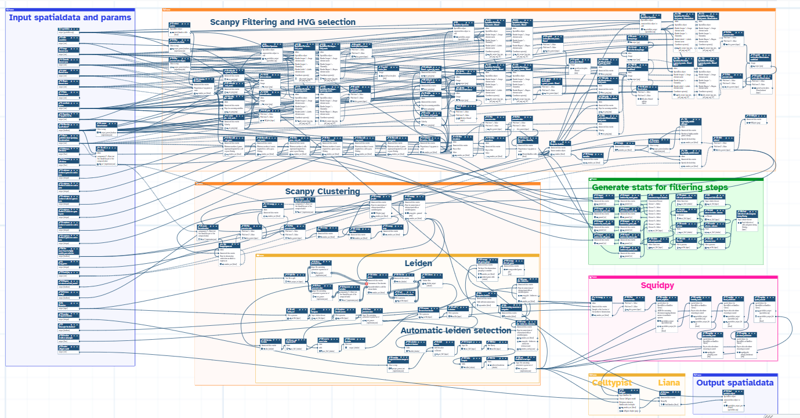

Breast cancers are spatially heterogeneous tissues containing malignant epithelial cells, fibroblasts, immune populations, vascular cells, adipose tissue, and extracellular matrix  . The abundance, state, and spatial organisation of these components can influence tumour growth, immune infiltration, invasion, and treatment response  . Spatial transcriptomics measures gene expression while preserving the position of each observation, allowing molecular programmes to be examined in relation to neighbouring tissue structures and histological morphology rather than being collapsed into a bulk average  .

This tutorial uses the public 10x Genomics **Human Breast Cancer, Block A Section 1** Visium dataset, distributed in the `BreastCancer1.zip` archive on Zenodo  . The source sample is described as fresh-frozen invasive ductal carcinoma, AJCC/UICC Stage Group IIA, ER positive, PR negative, and HER2 positive. The imported expression matrix contains **3,813 Visium capture spots and 33,538 genes**.

## Relationship to the HisHRST paper

The same Zenodo record accompanied the study **Geometry-informed multimodal fusion network for enhancing high-density spatial transcriptomics from histology images** . That study introduced **HisHRST**, a deep-learning approach combining histological image features and spatial-coordinate information to predict gene-expression profiles at locations that were not experimentally measured. The breast cancer section was one of several public datasets used to assess high-density expression prediction and preservation of spatial expression patterns.

This Galaxy tutorial is complementary to, rather than a reproduction of, HisHRST. It starts from the experimentally measured Visium count matrix and generates:

- spot- and gene-level QC summaries;
- a filtered and normalised expression matrix;
- 3,000 highly variable genes;
- PCA, a transcriptomic nearest-neighbour graph, and UMAP;
- Leiden clusterings across seven resolutions and an automatically selected candidate solution;
- ranked marker genes for candidate spatial transcriptional domains;
- Squidpy spatial neighbours, centrality, neighbourhood enrichment, and Moran's I;
- CellTypist dominant breast cell-type signatures;
- LIANA candidate ligand-receptor relationships between transcriptional domains; and
- a processed table returned to the SpatialData object.

> <warning-title>Prospective findings, not experimentally validated targets</warning-title>
>
> No wet-lab validation is performed in this tutorial. Marker genes, spatially autocorrelated genes, CellTypist signatures, and ligand-receptor pairs must therefore be presented as **prospective follow-up targets or hypotheses**. They do not prove a mechanism, clinical biomarker, therapeutic target, or direct cell-cell signalling event.
>
{: .warning}



> <agenda-title></agenda-title>
>
> In this tutorial, we will cover:
>
> 1. TOC
> {:toc}
>
{: .agenda}

# Analysis strategy

The analysis uses two different definitions of neighbourhood:

1. A **transcriptomic neighbour graph**, built from PCA coordinates, connects spots with similar expression profiles. Scanpy uses this graph for Leiden clustering and UMAP visualization.
2. A **spatial neighbour graph**, built from physical spot coordinates, connects observations that are close in the tissue. Squidpy uses this graph for spatial statistics.

A Leiden cluster is therefore first an expression-defined group. It becomes a convincing **candidate spatial transcriptional domain** only when it also has coherent tissue localisation, interpretable positive markers, reasonable QC characteristics, and support from spatial statistics or morphology.



| Analysis group | Purpose | Main output |
| --- | --- | --- |
| SpatialData input | Link expression, spot shapes, images, and coordinate systems. | SpatialData archive and AnnData table. |
| Scanpy filtering and HVG selection | Audit data quality, filter low-information spots and genes, normalise, log-transform, and identify variable genes. | QC metrics, filtered matrix, counts layer, and HVG annotation. |
| Scanpy clustering | Reduce dimensionality and construct the expression-neighbour graph. | PCA, neighbours, and UMAP. |
| Leiden and automatic selection | Compare clustering granularities and choose the tested result nearest to the target count. | Seven Leiden resolutions and selected key. |
| Squidpy | Analyse physical tissue neighbourhoods and spatially patterned genes. | Spatial graph, centrality, enrichment, and Moran's I. |
| CellTypist | Compare spot expression with an adult human breast reference. | Predicted labels, majority voting, and confidence scores. |
| LIANA | Rank putative ligand-receptor relationships between domains. | Candidate domain-to-domain LR interactions. |
| SpatialData output | Return processed results to the spatial container. | Reusable processed SpatialData object. |

> <question-title></question-title>
>
> 1. What is the main analytical difference between HisHRST and this tutorial?
> 2. Why should a Leiden cluster not immediately be called a cell type or histopathological compartment?
>
> > <solution-title></solution-title>
> >
> > 1. HisHRST predicts expression at unmeasured locations from histology and spatial information. This tutorial analyses experimentally measured spots using QC, clustering, spatial statistics, reference annotation, and ligand-receptor prioritisation.
> > 2. Leiden is run on an expression-derived graph, and a Visium spot can contain RNA from several cells. Biological labels require marker, spatial, morphological, and QC evidence.
> >
> {: .solution}
>
{: .question}

# Get the Visium breast cancer data

> <hands-on-title>Upload the Visium files and the resolution series</hands-on-title>
>
> 1. Create a new Galaxy history and name it `EISTA breast cancer spatial transcriptomics`.
> 2. Import the archive from [Zenodo]({{ page.zenodo_link }}) or the shared data library:
>
>    ```
>    {{ page.zenodo_link }}/files/BreastCancer1.zip
>    ```
>
>    
>
>    
>
> 3. Extract the archive contents into the history. Retain these six Visium files:
>    - `V1_Breast_Cancer_Block_A_Section_1_filtered_feature_bc_matrix.h5`
>    - `V1_Breast_Cancer_Block_A_Section_1_image.tif`
>    - `scalefactors_json.json`
>    - `tissue_hires_image.png`
>    - `tissue_lowres_image.png`
>    - `tissue_positions_list.csv`
>
>    Rename `V1_Breast_Cancer_Block_A_Section_1_filtered_feature_bc_matrix.h5` to `feature_bc_matrix.h5`.
>
>    
>
>    Rename `V1_Breast_Cancer_Block_A_Section_1_image.tif` to `fullres_image.tif`. Keep the remaining four filenames unchanged.
>
>    
>
> 4. In the Galaxy upload dialog, choose **Paste/Fetch data** and create `Resolution.txt` containing one value per line:
>
>    ```text
>    0.2
>    0.3
>    0.4
>    0.5
>    0.6
>    0.8
>    1.0
>    ```
>
{: .hands_on}

The seven resolutions allow the analysis to compare coarse and fine expression groupings. Higher resolution generally produces more and smaller clusters, but the relationship is data-dependent and not perfectly linear.

> <question-title></question-title>
>
> Why test several Leiden resolutions instead of assuming that one value is biologically correct?
>
> > <solution-title></solution-title>
> >
> > Leiden resolution controls analytical granularity. Testing several values reveals how stable the main groups are and allows nearby solutions to be compared. A requested cluster count is a selection target, not evidence that the tissue contains exactly that many biological compartments.
> >
> {: .solution}
>
{: .question}

# Build the SpatialData object

SpatialData stores images, geometries, coordinate transformations, and annotated expression tables in one linked object . In this Visium object, the capture spots are represented by geometries in the `Galaxy` Shapes element and the expression matrix is stored in the `table` AnnData table.

> <hands-on-title>Construct SpatialData from the Visium files</hands-on-title>
>
> 1. Run  with the following parameters:
>    - *"Spatial technology"*: `10x Genomics Visium`
>    - *"Dataset identifier to name the constructed SpatialData elements"*: `Galaxy`
>    -  *"feature BC matrix (Counts file)"*: `feature_bc_matrix.h5`
>    - *"Is the matrix input, raw?"*: `No`
>    -  *"Scale factors file"*: `scalefactors_json.json`
>    -  *"Full resolution image"*: `fullres_image.tif`
>    -  *"Tissue high resolution image"*: `tissue_hires_image.png`
>    -  *"Tissue low resolution image"*: `tissue_lowres_image.png`
>    -  *"Tissue positions file"*: `tissue_positions_list.csv`
>
>    Rename the output `Breast cancer SpatialData`.
>
>    
>
{: .hands_on}

The object should contain approximately:

```text
SpatialData object
├── Images
│   ├── Galaxy_full_image
│   ├── Galaxy_hires_image
│   └── Galaxy_lowres_image
├── Shapes
│   └── Galaxy                         (3,813 spots)
└── Tables
    └── table                          (3,813 × 33,538)
```

> <question-title></question-title>
>
> 1. Which element is annotated by the AnnData table?
> 2. Why is this association described as `shapes`, not `labels`?
> 3. What do the 3,813 observations and 33,538 variables represent?
>
> > <solution-title></solution-title>
> >
> > 1. The table annotates the `Galaxy` Shapes element.
> > 2. The Visium capture locations are represented as vector geometries. A Labels element would instead be a raster segmentation or label mask.
> > 3. The observations are capture spots and the variables are genes.
> >
> {: .solution}
>
{: .question}

# Extract the expression table

The Scanpy tools operate on AnnData. We will export the `table` element while keeping the original SpatialData object for the final re-import step.

> <hands-on-title>Export the AnnData table</hands-on-title>
>
> 1. Run  with the following parameters:
>    -  *"SpatialData object"*: `Breast cancer SpatialData`
>    - *"Operation"*: `Export the table of a SpatialData object to anndata`
>    - *"Table name"*: `table`
>
>    Rename the AnnData output `Breast cancer raw AnnData`.
>
>    
>
{: .hands_on}

# Scanpy filtering and highly variable gene selection

## Calculate QC metrics before filtering

`total_counts` measures the number of transcripts observed in a spot, while `n_genes_by_counts` measures expression complexity. The `pct_counts_in_top_N_genes` metrics reveal whether a small number of highly expressed genes dominates a spot.

> <hands-on-title>Calculate and visualise pre-filter QC metrics</hands-on-title>
>
> 1. Run  with:
>    -  *"Annotated data matrix"*: `Breast cancer raw AnnData`
>    - *"Method used for inspecting"*: `Calculate quality control metrics, using 'pp.calculate_qc_metrics'`
>        - *"Expression type"*: `counts`
>        - *"Variable type"*: `genes`
>        - *"Proportions of top genes to cover"*: `50,100,200,300`
>        - *"Log-transform QC metrics"*: `Yes`
>        - *"Layer"*: leave blank
>        - *"Use raw"*: `No`
>
>    Rename the AnnData output `QC metrics before filtering`.
>
>    
>
> 2. Run  with:
>    -  *"Annotated data matrix"*: `QC metrics before filtering`
>    - *"Method used for plotting"*: `Generic: Scatter plot along observations or variables axes, using 'pl.scatter'`
>        - *"Plotting tool that computed coordinates"*: `Using coordinates`
>        - *"x coordinate"*: `total_counts`
>        - *"y coordinate"*: `n_genes_by_counts`
>        - *"Color by"*: `pct_counts_in_top_50_genes`
>        - *"Use the layers attribute?"*: `No`
>
> 3. Rerun  with:
>    -  *"Annotated data matrix"*: `QC metrics before filtering`
>    - *"Method used for plotting"*: `Generic: Violin plot, using 'pl.violin'`
>    - *"Keys for accessing variables"*: `Subset of variables in 'adata.var_names' or fields of '.obs'`
>        - *"Keys for accessing variables"*: `n_genes_by_counts`
>    - *"Add a strip plot"*: `Yes`
>        - *"Jitter"*: `Yes`
>        - *"Jitter size"*: `0.4`
>    - *"Display keys in multiple panels"*: `No`
>
> 4. Rerun  with:
>    -  *"Annotated data matrix"*: `QC metrics before filtering`
>    - *"Method used for plotting"*: `Generic: Violin plot, using 'pl.violin'`
>    - *"Keys for accessing variables"*: `Subset of variables in 'adata.var_names' or fields of '.obs'`
>        - *"Keys for accessing variables"*: `total_counts`
>    - *"Add a strip plot"*: `Yes`
>        - *"Jitter"*: `Yes`
>        - *"Jitter size"*: `0.4`
>    - *"Display keys in multiple panels"*: `No`
>
{: .hands_on}

> <question-title></question-title>
>
> 1. What might a spot with very low `total_counts` and `n_genes_by_counts` represent?
> 2. Why should low-count spots be checked spatially before they are discarded?
>
> > <solution-title></solution-title>
> >
> > 1. It may reflect a poorly captured or damaged region, an edge spot, or genuinely low-RNA tissue.
> > 2. Low counts can coincide with real tissue compartments such as adipose or necrotic regions. Spatial inspection helps distinguish technical failure from plausible biology.
> >
> {: .solution}
>
{: .question}

## Filter spots and genes

The thresholds used here were validated on this section. They are deliberately permissive at the lower tail and mainly remove spots with very little information plus genes detected in very few observations.

> <hands-on-title>Apply the validated QC filters</hands-on-title>
>
> Run six **Scanpy filter** jobs in sequence, using the AnnData output of each job as the input to the next one.
>
> 1. Run  with:
>    -  *"Annotated data matrix"*: `QC metrics before filtering`
>    - *"Method used for filtering"*: `Filter cell outliers based on counts and numbers of genes expressed, using 'pp.filter_cells'`
>    - *"Filter"*: `Minimum number of genes expressed`
>    - *"Minimum number of genes expressed required for a cell to pass filtering"*: `500`
>
> 2. Rerun  with:
>    -  *"Annotated data matrix"*: the AnnData output from step 1
>    - *"Method used for filtering"*: `Filter cell outliers based on counts and numbers of genes expressed, using 'pp.filter_cells'`
>    - *"Filter"*: `Minimum number of counts`
>    - *"Minimum number of counts required for a cell to pass filtering"*: `1000`
>
> 3. Rerun  with:
>    -  *"Annotated data matrix"*: the AnnData output from step 2
>    - *"Method used for filtering"*: `Filter genes based on number of cells or counts, using 'pp.filter_genes'`
>    - *"Filter"*: `Minimum number of cells expressed`
>    - *"Minimum number of cells expressed required for a gene to pass filtering"*: `3`
>
> 4. Rerun  with:
>    -  *"Annotated data matrix"*: the AnnData output from step 3
>    - *"Method used for filtering"*: `Filter genes based on number of cells or counts, using 'pp.filter_genes'`
>    - *"Filter"*: `Minimum number of counts`
>    - *"Minimum number of counts required for a gene to pass filtering"*: `3`
>
> 5. Rerun  with:
>    -  *"Annotated data matrix"*: the AnnData output from step 4
>    - *"Method used for filtering"*: `Filter cell outliers based on counts and numbers of genes expressed, using 'pp.filter_cells'`
>    - *"Filter"*: `Maximum number of counts`
>    - *"Maximum number of counts for a cell to pass filtering"*: `75000`
>
> 6. Rerun  with:
>    -  *"Annotated data matrix"*: the AnnData output from step 5
>    - *"Method used for filtering"*: `Filter cell outliers based on counts and numbers of genes expressed, using 'pp.filter_cells'`
>    - *"Filter"*: `Maximum number of genes expressed`
>    - *"Maximum number of genes expressed for a cell to pass filtering"*: `10000`
>
>    Rename the final output `Filtered breast cancer AnnData`.
>
>    
>
{: .hands_on}

> <hands-on-title>Recalculate and visualise QC after filtering</hands-on-title>
>
> 1. Run  with:
>    -  *"Annotated data matrix"*: `Filtered breast cancer AnnData`
>    - *"Method used for inspecting"*: `Calculate quality control metrics, using 'pp.calculate_qc_metrics'`
>        - *"Expression type"*: `counts`
>        - *"Variable type"*: `genes`
>        - *"Proportions of top genes to cover"*: `50,100,200,300`
>        - *"Log-transform QC metrics"*: `Yes`
>        - *"Layer"*: leave blank
>        - *"Use raw"*: `No`
>
>    Rename the AnnData output `QC metrics after filtering`.
>
>    
>
> 2. Rerun  with:
>    -  *"Annotated data matrix"*: `QC metrics after filtering`
>    - *"Method used for plotting"*: `Generic: Scatter plot along observations or variables axes, using 'pl.scatter'`
>        - *"Plotting tool that computed coordinates"*: `Using coordinates`
>        - *"x coordinate"*: `total_counts`
>        - *"y coordinate"*: `n_genes_by_counts`
>        - *"Color by"*: `pct_counts_in_top_50_genes`
>        - *"Use the layers attribute?"*: `No`
>
> 3. Rerun  with:
>    -  *"Annotated data matrix"*: `QC metrics after filtering`
>    - *"Method used for plotting"*: `Generic: Violin plot, using 'pl.violin'`
>    - *"Keys for accessing variables"*: `Subset of variables in 'adata.var_names' or fields of '.obs'`
>        - *"Keys for accessing variables"*: `n_genes_by_counts`
>    - *"Add a strip plot"*: `Yes`
>        - *"Jitter"*: `Yes`
>        - *"Jitter size"*: `0.4`
>    - *"Display keys in multiple panels"*: `No`
>
> 4. Rerun  with:
>    -  *"Annotated data matrix"*: `QC metrics after filtering`
>    - *"Method used for plotting"*: `Generic: Violin plot, using 'pl.violin'`
>    - *"Keys for accessing variables"*: `Subset of variables in 'adata.var_names' or fields of '.obs'`
>        - *"Keys for accessing variables"*: `total_counts`
>    - *"Add a strip plot"*: `Yes`
>        - *"Jitter"*: `Yes`
>        - *"Jitter size"*: `0.4`
>    - *"Display keys in multiple panels"*: `No`
>
> 5. Expand `QC metrics after filtering` in the history and record its AnnData dimensions.
>
{: .hands_on}

The reference execution changed the object as follows:

| Stage | Spots | Genes |
| --- | ---: | ---: |
| Before filtering | 3,813 | 33,538 |
| After the minimum-gene filter | 3,811 | 33,538 |
| After the minimum-count filter | 3,800 | 33,538 |
| After all gene filters | 3,800 | 20,687 |
| After maximum filters | 3,800 | 20,687 |

> <question-title></question-title>
>
> 1. How many spots and genes were removed?
> 2. What percentage of spots was retained?
> 3. Did the upper thresholds affect the reference run?
>
> > <solution-title></solution-title>
> >
> > 1. Thirteen spots and 12,851 genes were removed.
> > 2. Approximately 99.66% of spots were retained: `3800 / 3813 × 100`.
> > 3. No. The maximum-count and maximum-gene filters removed no additional spots, but they remain useful safeguards for other datasets.
> >
> {: .solution}
>
{: .question}

## Preserve counts, normalise, and select HVGs

The unmodified count matrix is copied to `layers['counts']` before normalisation. The working matrix is then normalised to the same total per spot and log-transformed. Highly variable gene selection focuses downstream structure on genes that vary more than expected across observations.

> <hands-on-title>Preserve counts and normalise expression</hands-on-title>
>
> 1. Run  with:
>    -  *"Annotated data matrix"*: `QC metrics after filtering`
>    - *"Function to manipulate the object"*: `Copy layers from a different anndata object`
>    -  *"Source anndata object"*: `QC metrics after filtering`
>    - In *"Layers to copy"*:
>        - *"Layer to be copied from the source anndata"*: `X`
>        - *"Target layer name"*: `counts`
>
>    Rename the output `Filtered AnnData with counts layer`.
>
>    
>
> 2. Run  with:
>    -  *"Annotated data matrix"*: `Filtered AnnData with counts layer`
>    - *"Method used for normalization"*: `Normalize counts per cell, using 'pp.normalize_total'`
>    - *"Target sum"*: `10000.0`
>    - *"Exclude (very) highly expressed genes for the computation of the normalization factor"*: `No`
>
> 3. Run  with:
>    -  *"Annotated data matrix"*: the normalised AnnData output from step 2
>    - *"Method used for inspecting"*: `Logarithmize the data matrix, using 'pp.log1p'`
>
>    Rename the output `Log-normalised breast cancer AnnData`.
>
>    
>
{: .hands_on}

> <hands-on-title>Select 3,000 highly variable genes</hands-on-title>
>
> 1. Run  with:
>    -  *"Annotated data matrix"*: `Log-normalised breast cancer AnnData`
>    - *"Method used for filtering"*: `Annotate (and filter) highly variable genes, using 'pp.highly_variable_genes'`
>    - *"Choose the flavor for identifying highly variable genes"*: `Cell Ranger`
>    - *"Number of highly-variable genes to keep"*: `3000`
>    - *"Batch key"*: leave blank
>
>    Rename the output `Breast cancer AnnData with HVGs`.
>
>    
>
> 2. Run  with:
>    -  *"Annotated data matrix"*: `Breast cancer AnnData with HVGs`
>    - *"Method used for plotting"*: `Preprocessing: Plot dispersions versus means for genes, using 'pl.highly_variable_genes'`
>
{: .hands_on}

> <question-title></question-title>
>
> 1. Why preserve a `counts` layer before normalisation?
> 2. Does selecting 3,000 HVGs mean the other genes are biologically unimportant?
> 3. Why is the batch key left blank?
>
> > <solution-title></solution-title>
> >
> > 1. It preserves the integer-like measured counts for later methods or reprocessing while the working matrix is transformed.
> > 2. No. HVG selection chooses genes that are most useful for modelling variation and neighbourhood structure; non-HVG genes remain available for marker interpretation and other analyses.
> > 3. This tutorial analyses one tissue section and no batch annotation is supplied. A batch key is only appropriate when meaningful batch groups exist.
> >
> {: .solution}
>
{: .question}

# Scanpy dimensionality reduction and clustering

## PCA, transcriptomic neighbours, and UMAP

PCA compresses correlated gene-expression patterns into orthogonal components. The k-nearest-neighbour graph then links spots with similar PCA coordinates. UMAP provides a two-dimensional visualisation of this graph; it is useful for exploration but should not be interpreted as a physical tissue map .

> <hands-on-title>Generate PCA and inspect technical covariates</hands-on-title>
>
> 1. Run  with:
>    -  *"Annotated data matrix"*: `Breast cancer AnnData with HVGs`
>    - *"Method used"*: `Principal component analysis, using 'pp.pca'`
>    - *"Number of principal components to compute"*: `50`
>    - *"Data type of PCA output"*: `float32`
>    - *"Perform incremental PCA"*: `No`
>    - *"Zero-center data"*: `Yes`
>    - *"Random seed"*: `0`
>
>    Rename the output `Breast cancer PCA`.
>
>    
>
> 2. Run  with:
>    -  *"Annotated data matrix"*: `Breast cancer PCA`
>    - *"Method used for plotting"*: `PCA: Scatter plot in PCA coordinates, using 'pl.pca'`
>    - *"Keys for annotations of observations/cells or variables/genes"*: `log1p_total_counts,log1p_n_genes_by_counts,total_counts`
>    - *"Projection"*: `2d`
>
{: .hands_on}

> <hands-on-title>Build the transcriptomic graph and UMAP</hands-on-title>
>
> 1. Run  with:
>    -  *"Annotated data matrix"*: `Breast cancer PCA`
>    - *"Method used for inspecting"*: `Compute a neighborhood graph of observations, using 'pp.neighbors'`
>    - *"Number of neighbors"*: `15`
>    - *"Use a hard threshold to restrict the number of neighbors"*: `Yes`
>    - *"Method for computing connectivities"*: `umap`
>    - *"Distance metric"*: `euclidean`
>    - *"Random seed"*: `0`
>
>    Rename the output `Breast cancer transcriptomic neighbours`.
>
>    
>
> 2. Run  with:
>    -  *"Annotated data matrix"*: `Breast cancer transcriptomic neighbours`
>    - *"Method used"*: `Embed the neighborhood graph using UMAP, using 'tl.umap'`
>    - *"Minimum distance between embedded points"*: `0.5`
>    - *"Effective scale of embedded points"*: `1.0`
>    - *"Number of UMAP dimensions"*: `2`
>    - *"Initialisation"*: `spectral`
>    - *"Random seed"*: `0`
>
>    Rename the output `Breast cancer UMAP`.
>
>    
>
> 3. Run  with:
>    -  *"Annotated data matrix"*: `Breast cancer UMAP`
>    - *"Method used for plotting"*: `Embeddings: Scatter plot in UMAP basis, using 'pl.umap'`
>    - *"Keys for annotations of observations/cells or variables/genes"*: `log1p_total_counts,log1p_n_genes_by_counts`
>    - *"Show edges?"*: `No`
>
{: .hands_on}

> <question-title></question-title>
>
> 1. What type of similarity defines the neighbour graph at this stage?
> 2. What would it suggest if UMAP separation closely followed `total_counts` rather than marker programmes?
> 3. Does proximity on UMAP mean two spots are physically adjacent in the tissue?
>
> > <solution-title></solution-title>
> >
> > 1. Similarity of gene-expression profiles in PCA space.
> > 2. Sequencing depth may be dominating the inferred structure, so QC, normalisation, and optional confounder handling should be reassessed.
> > 3. No. UMAP reflects transcriptomic similarity. Physical adjacency is calculated later from spatial coordinates.
> >
> {: .solution}
>
{: .question}

# Multi-resolution Leiden clustering

Leiden clustering partitions the transcriptomic neighbour graph. We will map the clustering tool over the seven values in `Resolution.txt`, create a unique observation key for each result, and compare the cluster counts.

## Prepare the resolution collection

> <hands-on-title>Create resolution values and Leiden keys</hands-on-title>
>
> 1. Run  with:
>    - *"Select the file type to split"*: `Text files`
>    -  *"Text file to split"*: `Resolution.txt`
>    - *"Specify number of output files or number of records per file?"*: `Number of records per file ('chunk mode')`
>    - *"Number of records per file"*: `1`
>    - *"Method to allocate records to new files"*: `Maintain record order`
>
>    Rename the output collection `Leiden resolution lines`.
>
>    
>
> 2. Run  over `Leiden resolution lines` with:
>    -  *"Input file containing parameter to parse out of"*: `Leiden resolution lines`
>    - *"Select type of parameter to parse"*: `Float`
>    - *"Remove newlines"*: `Yes`
>
>    Rename the output collection `Leiden resolution values`.
>
>    
>
> 3. Run  over `Leiden resolution values` with:
>    - First component: text value `leiden_res_`
>    - Second component: the mapped float parameter from `Leiden resolution values`
>
>    Rename the output parameter collection `Leiden observation keys`.
>
>    
>
{: .hands_on}

> <question-title></question-title>
>
> What key names should be produced for the first and last resolution values?
>
> > <solution-title></solution-title>
> >
> > `leiden_res_0.2` and `leiden_res_1.0`. Distinct keys allow several clustering annotations to coexist without overwriting one another.
> >
> {: .solution}
>
{: .question}

## Run Leiden and rank markers

> <hands-on-title>Cluster at every resolution</hands-on-title>
>
> 1. Run  as a mapped job with:
>    -  *"Annotated data matrix"*: `Breast cancer UMAP`
>    - *"Method used"*: `Cluster cells into subgroups, using 'tl.leiden'`
>    -  *"Coarseness of the clustering"*: `Leiden resolution values`
>    -  *"Key under which to add the cluster labels"*: `Leiden observation keys`
>    - *"Use weights from the neighbour graph"*: `Yes`
>    - *"How many iterations of the Leiden clustering algorithm to perform"*: `2`
>    - *"Implementation"*: `leidenalg`
>    - *"Random seed"*: `0`
>
>    Rename the AnnData collection `Leiden results by resolution`.
>
>    
>
> 2. Run  over `Leiden results by resolution` with:
>    - *"Method used for inspecting"*: `Rank genes for characterizing groups, using 'tl.rank_genes_groups'`
>    -  *"The key of the observations grouping to consider"*: `Leiden observation keys`
>    - *"Get ranked genes as a Tabular file?"*: `True`
>    - *"Comparison"*: `Compare each group to the union of the rest of the group`
>    - *"Method"*: `Wilcoxon-Rank-Sum`
>    - *"Multiple testing correction"*: `Benjamini-Hochberg`
>
>    Rename the AnnData collection `Leiden results with markers`.
>
>    
>
>    Rename the table collection `Ranked marker tables`.
>
>    
>
> 3. Run  over `Leiden results with markers` with:
>    - *"Method used for plotting"*: `Marker genes: Plot ranking of genes using 'pl.rank_genes_groups'`
>    - *"Number of genes to show"*: `20`
>    - *"Font size"*: `8`
>    - *"Number of panels per row"*: `4`
>    - *"Share y-axis"*: `Yes`
>
{: .hands_on}

## Combine the Leiden annotations

The validated workflow stores all seven clustering columns in one AnnData object. The following utility steps extract the observation labels from the mapped results and add the combined columns back to the base UMAP object.

> <hands-on-title>Build a table containing all Leiden labels</hands-on-title>
>
> 1. Run  over `Leiden results by resolution` with:
>    - *"What to inspect?"*: `Key-indexed observations annotation (obs)`
>
> 2. Run  over the observation-table collection with:
>    - *"AWK Program"*:
>
>      ```awk
>      awk 'BEGIN {FS="\t"; OFS="\t"} {print $1, $NF}'
>      ```
>
> 3. Run  with:
>    -  *"Tabular files"*: the reformatted collection
>    - *"Number of header lines in each input file"*: `1`
>    - *"Identifier column"*: `1`
>    - *"Fill character"*: `.`
>
> 4. Run  with:
>    -  *"File to cut"*: the joined table
>    - *"Operation"*: `Discard`
>    - *"Cut by"*: `fields`
>    - *"Is there a header for the data's columns?"*: `Yes`
>    - *"List of Fields"*: column `1`
>
> 5. Run  with:
>    -  *"File to process"*: the cut table
>    - *"Find pattern"*: `split_file_\d+.txt_`
>    - *"Find-Pattern is a regular expression"*: `Yes`
>    - *"Replace all occurrences of the pattern"*: `Yes`
>    - *"Find and Replace text in"*: `entire line`
>
> 6. Rerun  with:
>    -  *"File to process"*: the output from step 5
>    - *"Find pattern"*: `(?<!\.)\b(\d+)\b`
>    - *"Replace with"*: `c_\1`
>    - *"Find-Pattern is a regular expression"*: `Yes`
>    - *"Replace all occurrences of the pattern"*: `Yes`
>    - *"Find and Replace text in"*: `entire line`
>
>    Rename the final table `All Leiden labels`.
>
>    
>
{: .hands_on}

> <hands-on-title>Add all Leiden labels to the AnnData object</hands-on-title>
>
> 1. Run  with:
>    -  *"Annotated data matrix"*: `Breast cancer UMAP`
>    - *"Function to manipulate the object"*: `Add new annotation(s) for observations or variables`
>    - *"What to annotate?"*: `Observations (obs)`
>    -  *"Table with new annotations"*: `All Leiden labels`
>
> 2. Rerun  with:
>    -  *"Annotated data matrix"*: the AnnData output from step 1
>    - *"Function to manipulate the object"*: `Transform string annotations to categoricals`
>
>    Rename the output `AnnData with all Leiden resolutions`.
>
>    
>
> 3. Run  with:
>    -  *"Annotated data matrix"*: `AnnData with all Leiden resolutions`
>    - *"Method used for plotting"*: `Embeddings: Scatter plot in UMAP basis, using 'pl.umap'`
>    - *"Keys for annotations of observations/cells or variables/genes"*: `leiden_res_0.2,leiden_res_0.3,leiden_res_0.4,leiden_res_0.5,leiden_res_0.6,leiden_res_0.8,leiden_res_1.0`
>    - *"Show edges?"*: `No`
>    - *"Output annotated data matrix?"*: `Yes`
>
>    Rename the AnnData output `AnnData with Leiden comparison`.
>
>    
>
{: .hands_on}

> <question-title></question-title>
>
> What patterns indicate probable over-clustering or under-clustering when comparing the UMAP panels?
>
> > <solution-title></solution-title>
> >
> > Over-clustering is suggested by unstable tiny groups, weak or redundant markers, and fragmentation driven mainly by QC values. Under-clustering is suggested when distinct marker programmes or coherent tissue compartments remain merged. The correct balance is evaluated biologically, not only by the number of colours.
> >
> {: .solution}
>
{: .question}

## Select the solution nearest to 11 clusters

The workflow counts the unique labels for every resolution, appends the target value `11`, calculates the absolute difference, sorts the candidates, and extracts the best key. This is a reproducible selection rule, not biological validation.

> <hands-on-title>Reproduce automatic Leiden selection</hands-on-title>
>
> 1. Run  with:
>    - *"Input Single or Multiple Tables"*: `Single Table`
>    -  *"Table"*: `All Leiden labels`
>    - specify that the input has column names
>    - *"Type of table operation"*: `Compute expression across rows or columns`
>    - *"Calculate"*: `Number of Unique Observations`
>    - apply the operation to columns
>
>    Rename the output `Cluster count by resolution`.
>
>    
>
> 2. Run  with:
>    - *"Add this value"*: `11`
>    -  *"to Dataset"*: `Cluster count by resolution`
>
> 3. Run  with:
>    -  *"Input file"*: the table with the target-value column
>    - *"Input has a header line with column names?"*: `Yes`
>    - In *"Expressions"*:
>        - *"Add expression"*: `abs(c2-c3)`
>        - *"The new column name"*: `difference`
>    - *"If an expression cannot be computed for a row"*: `Fail the entire tool run`
>
> 4. Run  with:
>    -  *"Sort Query"*: the difference table
>    - *"Number of header lines"*: `1`
>    - first sort on column `4` numerically in ascending order
>    - then sort on column `1` in descending order to provide a deterministic tie-break
>
> 5. Run  with:
>    - *"Input Single or Multiple Tables"*: `Single Table`
>    -  *"Table"*: the sorted table
>    - *"Type of table operation"*: `Drop, keep or duplicate rows and columns`
>    - *"List of rows to select"*: `2`
>
> 6. Run  with:
>    - *"Cut columns"*: `c1`
>    -  *"From"*: the selected row
>
> 7. Run  with:
>    -  *"Input file containing parameter to parse out of"*: the cut output
>    - *"Select type of parameter to parse"*: `Text`
>    - *"Remove newlines"*: `Yes`
>
>    Rename the parsed value `Selected Leiden key`.
>
>    
>
{: .hands_on}

For the validated reference run, the selected key is:

```text
leiden_res_0.8
```

and this solution contains **12 domains**, labelled `c_0` to `c_11`. Twelve is one cluster away from the requested target of eleven.

> <question-title></question-title>
>
> 1. Why was a 12-domain solution selected when the requested value was 11?
> 2. Does the automatic rule establish that `leiden_res_0.8` is the biologically correct solution?
>
> > <solution-title></solution-title>
> >
> > 1. The workflow selects the tested result whose cluster count is nearest to 11; it does not require an exact match.
> > 2. No. Spatial coherence, domain sizes, marker genes, morphology, QC independence, and stability across neighbouring resolutions must still be assessed.
> >
> {: .solution}
>
{: .question}

# Interpret marker genes

For tutorial interpretation, use positive markers with adjusted p-value below `0.05` and log2 fold-change above `0.5`, then examine the top 10–20 genes per domain. Avoid assigning a label from one gene alone.

The reference outputs contained examples such as:

| Domain | Example positive markers | Cautious interpretation |
| --- | --- | --- |
| `c_6` | `IGFBP7`, `VIM`, `CCDC80`, `COL6A2`, `BGN`, `MYL9`, `TAGLN`, `DCN`, `SPARCL1`, `COL1A2` | Stromal/ECM and vascular-supporting programme. |
| `c_5` | `SIX1`, `DDR1`, `SQLE`, `ERBB2`, `HK2`, `SPDEF` | Epithelial/tumour-associated programme. |
| `c_8` | positive `ERBB2` enrichment | A second ERBB2-associated tumour state or compartment. |
| `c_0` | `IGHG3`, `IGLC2` among leading markers | Immunoglobulin-rich or plasma/immune-associated programme. |

> <question-title></question-title>
>
> Why is a coherent set of markers more convincing than one familiar marker gene?
>
> > <solution-title></solution-title>
> >
> > A programme supported by several functionally related genes is less likely to be caused by ambient RNA, noise, or a broadly expressed gene. The pattern should still be checked spatially and against histology.
> >
> {: .solution}
>
{: .question}

# Squidpy spatial analysis

Squidpy uses the physical spot coordinates rather than the transcriptomic UMAP graph . The selected domain key, `leiden_res_0.8`, is used to calculate domain-level spatial organisation.

> <hands-on-title>Construct the Visium spatial-neighbour graph</hands-on-title>
>
> 1. Run  with:
>    -  *"Select the input anndata"*: `AnnData with Leiden comparison`
>    - *"Select an analysis"*: `Spatial neighbors -- Create a graph from spatial coordinates`
>    - *"Spatial coordinate key"*: `spatial`
>    - *"Type of coordinate system"*: `grid`
>    - *"Number of neighbors"*: `6`
>    - *"Number of rings"*: `1`
>    - *"Transformation"*: `none`
>    - *"Key under which to add the graph"*: `spatial`
>
>    Rename the output `AnnData with spatial neighbours`.
>
>    
>
{: .hands_on}

A one-ring, six-neighbour graph corresponds to the immediate neighbourhood of the Visium lattice. It encodes local tissue proximity, not expression similarity.

> <hands-on-title>Calculate centrality and neighbourhood enrichment</hands-on-title>
>
> 1. Run  with:
>    -  *"Select the input anndata"*: `AnnData with spatial neighbours`
>    - *"Select an analysis"*: `centrality_scores -- Compute centrality scores per cluster or cell type`
>    - *"Key in anndata.AnnData.obs where clustering is stored"*: `leiden_res_0.8`
>    - *"Score"*: `none` to calculate all supported scores
>
>    Rename the output `AnnData with centrality scores`.
>
>    
>
> 2. Rerun  with:
>    -  *"Select the input anndata"*: `AnnData with centrality scores`
>    - *"Select an analysis"*: `nhood_enrichment -- Compute neighbourhood enrichment by permutation`
>    - *"Key in anndata.AnnData.obs where clustering is stored"*: `leiden_res_0.8`
>
>    Rename the output `AnnData with neighbourhood enrichment`.
>
>    
>
{: .hands_on}

> <hands-on-title>Calculate Moran's I</hands-on-title>
>
> 1. Run  with:
>    -  *"Select the input anndata"*: `AnnData with neighbourhood enrichment`
>    - *"Select an analysis"*: `spatial_autocorr -- Calculate Global Autocorrelation Statistic (Moran's I or Geary's C)`
>    - *"Connectivity key"*: `spatial_connectivities`
>    - *"Mode"*: `Moran's I`
>    - *"Apply variance-stabilising transformation"*: `Yes`
>    - *"Genes"*: leave blank to analyse all available genes
>    - *"Layer"*: leave blank
>    - *"Use a two-tailed test"*: `No`
>
>    Rename the output `AnnData with Squidpy results`.
>
>    
>
{: .hands_on}

> <question-title></question-title>
>
> 1. What does a strong positive diagonal in the neighbourhood-enrichment heatmap indicate?
> 2. What can a positive off-diagonal entry suggest?
> 3. Does high Moran's I show that a gene causes tumour progression?
>
> > <solution-title></solution-title>
> >
> > 1. Spots from the same domain occur beside one another more often than expected, supporting spatial self-association.
> > 2. Two different domains form a recurrent spatial interface or neighbour one another more frequently than expected.
> > 3. No. Moran's I identifies spatially structured expression, not causality or function.
> >
> {: .solution}
>
{: .question}

# CellTypist dominant breast cell-type signatures

CellTypist compares observations with a trained reference model  . Since a Visium spot can contain several cells, report the output as a **dominant predicted cell-type signature**, not a pure cell identity.

> <hands-on-title>Annotate spots with CellTypist</hands-on-title>
>
> 1. Run  with:
>    -  *"Input AnnData file"*: `AnnData with Squidpy results`
>    - *"Select model from"*: `Cached`
>    - *"Choose CellTypist model"*: `cell types from the adult human breast (v1)`
>    - *"Mode"*: `best match`
>    - *"p-value threshold"*: `0.5`
>    - *"Refine the predicted labels by running the majority voting classifier after over-clustering"*: `Yes`
>    - *"Minimum proportion"*: `0.0`
>    - *"Transpose input"*: `No`
>    - *"Generate a dotplot of the predicted cell types"*: `Yes`
>        - *"Reference column in AnnData.obs for dotplot"*: `leiden_res_0.8`
>        - *"Prediction column"*: `majority_voting`
>        - *"Format"*: `png`
>
>    Rename the AnnData output `CellTypist-annotated breast cancer AnnData`.
>
>    
>
> 2. Inspect `predicted_labels`, `majority_voting`, and `conf_score` in the annotated AnnData output.
>
{: .hands_on}

> <question-title></question-title>
>
> Why can a high-confidence CellTypist result still be incomplete for a Visium spot?
>
> > <solution-title></solution-title>
> >
> > The classifier reports the best matching reference signature, but the input profile may contain transcripts from several cell types. Confidence measures classifier certainty relative to its reference, not spot purity or complete representation of all states.
> >
> {: .solution}
>
{: .question}

# LIANA candidate ligand-receptor relationships

LIANA integrates several scoring approaches and curated ligand-receptor resources  . In this analysis the selected Leiden domains, rather than individual cell types, are the source and target groups.

> <hands-on-title>Rank domain-to-domain ligand-receptor hypotheses</hands-on-title>
>
> 1. Run  with:
>    -  *"Annotated data matrix"*: `CellTypist-annotated breast cancer AnnData`
>    - *"Method for ligand-receptor inference"*: `Aggregate ligand-receptor scores from multiple methods (rank_aggregate)`
>    - *"Group By"*: `leiden_res_0.8`
>    - *"Interaction source"*: `Use built-in database`
>    - *"Resource source"*: `Built-in`
>    - *"Resource name"*: `consensus`
>    - *"Minimum expression proportion"*: `0.1`
>    - *"Minimum number of observations per group"*: `5`
>    - *"Subset cell type pairs"*: `Use all possible combinations`
>    - *"Aggregate method"*: `rra`
>    - *"Consensus options"*: `Default (Specificity and Magnitude)`
>    - *"Return all ligand-receptor pairs"*: `No`
>    - *"Key added"*: `liana_res`
>    - *"Layer"*: leave blank
>    - *"Use raw"*: `No`
>    - *"Differential-expression method"*: `t-test`
>    - *"Number of permutations"*: `1000`
>    - *"Random seed"*: `1337`
>
>    Rename the output `LIANA breast cancer AnnData`.
>
>    
>
{: .hands_on}

> <question-title></question-title>
>
> Which evidence combination provides the strongest basis for prioritising a LIANA result?
>
> A. A high LIANA rank alone.
>
> B. Ligand and receptor expression, spatial adjacency of the relevant domains, coherent markers, literature support, and reproduction in another sample.
>
> C. Detection of either gene anywhere in the matrix.
>
> > <solution-title></solution-title>
> >
> > **B**. LIANA ranks expression-based hypotheses. Convergent expression, spatial, biological, and reproducibility evidence is needed before a pair becomes a strong prospective target.
> >
> {: .solution}
>
{: .question}

# Return the processed table to SpatialData

> <hands-on-title>Create the final processed SpatialData object</hands-on-title>
>
> 1. Run  with:
>    -  *"SpatialData object"*: `Breast cancer SpatialData`
>    - *"Operation"*: `Import anndata table to a SpatialData object`
>    -  *"annotated data object to add"*: `LIANA breast cancer AnnData`
>    - *"Table name"*: `table_processed`
>
>    Rename the output `Validated breast cancer SpatialData`.
>
>    
>
> 2. Confirm that the output retains:
>    - `Galaxy_full_image`, `Galaxy_hires_image`, and `Galaxy_lowres_image`;
>    - the `Galaxy` Shapes element;
>    - the `Galaxy` coordinate system; and
>    - `table_processed` with 3,800 observations and 20,687 variables.
>
{: .hands_on}

> <question-title></question-title>
>
> Why return the processed table to SpatialData rather than retaining only a standalone AnnData object?
>
> > <solution-title></solution-title>
> >
> > SpatialData preserves explicit links among expression, spot geometries, tissue images, and coordinate transformations. This supports morphology-aware interpretation and future spatial plotting without reconstructing those relationships.
> >
> {: .solution}
>
{: .question}

# Integrate the biological evidence

A computational result becomes more convincing when independent evidence layers agree.

| Evidence layer | Question to ask | Important limitation |
| --- | --- | --- |
| QC | Is the domain independent of low counts or low complexity? | Good QC does not establish identity. |
| Marker genes | Are several coherent positive markers enriched? | Markers may reflect mixed spots or shared programmes. |
| Spatial organisation | Is the domain self-associated or part of a recurrent interface? | Adjacency is not signalling. |
| Morphology | Is the location compatible with visible tissue structure? | Visual agreement can be subjective without pathology annotation. |
| Moran's I | Are important genes spatially patterned? | Spatial autocorrelation is not causation. |
| CellTypist | Does a breast reference signature support the marker interpretation? | Spots are mixtures and the result is model-dependent. |
| LIANA | Is a plausible pair ranked between relevant adjacent domains? | Transcript abundance does not prove protein interaction. |
| Literature or another section | Is the pattern plausible and reproducible? | Published association is not validation in this sample. |

> <question-title>Final interpretation challenge</question-title>
>
> A coherent domain has strong `COL1A2`, `DCN`, and `BGN` markers, lies beside an ERBB2-associated domain, and participates in a highly ranked LIANA interaction with that neighbour. How should the finding be reported without wet-lab validation?
>
> > <solution-title></solution-title>
> >
> > Report a **stromal/ECM-associated candidate domain at a tumour-stroma interface** and describe the LIANA pair as a **prospective communication hypothesis**. Present marker, spatial-neighbourhood, and LIANA evidence separately. Do not claim that the interaction occurs at the protein level, drives invasion, or is a treatment target until independently tested.
> >
> {: .solution}
>
{: .question}

# Conclusion

In this tutorial, we started from raw Visium files, built a linked SpatialData object, and reproduced the validated analysis with individual Galaxy tools rather than executing a pre-built workflow. The analysis retained 3,800 of 3,813 spots, reduced the gene set to 20,687 detected features, selected 3,000 HVGs, generated PCA and UMAP, tested seven Leiden resolutions, and selected `leiden_res_0.8` with 12 candidate domains. Marker programmes supported stromal/ECM, epithelial/tumour-associated, ERBB2-associated, and immunoglobulin-rich interpretations. Squidpy evaluated physical tissue organisation, CellTypist added dominant breast cell-type signatures, and LIANA generated domain-level ligand-receptor hypotheses.

These outputs are biologically meaningful for **exploratory and hypothesis-generating analysis**. Without experimental or independent-sample validation, the strongest conclusions are those supported by multiple evidence layers and reported as prospective targets rather than definitive mechanisms or clinical findings.

> <comment-title>Optional volume- or area-aware workflow branch</comment-title>
>
> The downloadable general workflow also supports optional filtering and regression based on an observation-level volume or area measurement. This Visium SpatialData object does not contain a per-observation volume or cell-area field, so the volume-dependent tools are excluded from the hands-on tutorial. They can be enabled from the workflow for compatible datasets, such as segmented-cell spatial data, after confirming the correct AnnData observation key and its units.
>
{: .comment}

